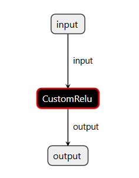

# CUDA ReLU 全面示例：从 CUDA 内核到 PyTorch 与 ONNX Runtime

* [返回上层目录](../gpgpu-kernel-dev.md)
* [算子开发在整个推理系统中的位置](#算子开发在整个推理系统中的位置)
* [工程代码](#工程代码)
* [编译与测试](#编译与测试)
* [工程概述](#工程概述)

这份工程演示如何把同一个 CUDA ReLU 内核，一次性打通两条使用路径：作为 PyTorch 自定义扩展用于训练/验证，以及封装为 ONNX Runtime 自定义算子用于高性能推理。我们要做的是用最小可行的代码，把“写内核→在两个框架中可用→能构建、能运行、能验证”的闭环跑通；这样既能在训练阶段直接复用自定义算子，也能在部署阶段把同一内核移植到 ORT，最大化代码复用与性能一致性。

- 目标:

  - 复用一份 CUDA ReLU 内核，分别在 PyTorch 与 ORT 中调用

  - 理解并掌握 ORT 自定义算子注册、域/算子名匹配、CUDA Stream 对接

  - 提供可运行的最小示例（构建脚本、最小 ONNX 模型与推理脚本）

- 为什么这样做:

  - 统一训练与推理栈: 训练阶段的自定义算子可以原封不动迁移到 ORT 推理，减少双维护

  - 性能与可控性: 直接掌控 kernel 与 stream，避免黑盒；便于定位瓶颈与调优

  - 工程化落地: 配齐构建、导出与运行脚本，作为后续扩展更多算子的模板

# 算子开发在整个推理系统中的位置

接下来我会非常清晰地告诉你：

🌟 你的 ReLU 算子在推理引擎里到底是什么？怎么被用？

用一句话总结：

> **你写的算子 = 推理引擎中某个节点（Node）背后的实际执行逻辑（Kernel）**

这句话非常重要。

推理引擎的执行流程是这样的：

```
模型图（Graph）
↓
节点（Operator Node）
↓
选择对应算子实现（Kernel Implementation）
↓
GPU 上执行你写的 CUDA kernel
```

## 从“模型图”到你的算子

举一个最典型的推理引擎计算图片段：

```
MatMul → Add → ReLU → MatMul → Softmax
```

在推理框架里（TensorRT / ONNX Runtime / PyTorch 2.0 Dynamo）会把整个模型转成这样的计算图。

其中：

- 每个小方块（节点）就是一个算子（OP）
- 每个 OP 的内部实现，就需要一个 **kernel**

你写的 ReLU，就是要挂在这个节点下面：

```
Node("Relu")  ----使用---->  YourReluCUDAKernel
```

你的 kernel 就是干实事的那一层。

## 推理引擎如何使用你的 ReLU？

推理引擎执行模型时：

1. 解析到一个 ReLU 节点
2. 查找该节点对应的 kernel 实现
3. 发现有 CUDA 实现，就调用它
4. 传入 tensor pointer（GPU 内存的地址）
5. kernel 在 GPU 上执行
6. 将结果输出给下游节点

你的 ReLU kernel 就是在第 5 步执行的。

## 用一个具体例子让你更直观

模型图中有一个操作：

```
y = torch.relu(x)
```

推理引擎会生成一个节点：

```
Node(type="Relu")
```

然后推理引擎会：

1. 映射到你的算子实现

```
Node("Relu")
   | 
   -> ReluImplementationRegistry.get("cuda")
            |
            -> your_relu_kernel
```

2. 调用你的 kernel

推理引擎把数据地址塞给你：

```
relu_kernel<<<grid, block>>>(
    input_ptr,   // x.data_ptr<float>()
    output_ptr,  // y.data_ptr<float>()
    num_elements
)
```

实际操作就是：

**你的 kernel 在模型执行图的那一层执行“ReLU 的 GPU 版数学计算”。**

## 你写的算子在哪些“推理框架”里会被用到？

✔️ 1. PyTorch 训练 & 推理（Custom OP）

你写的 ReLU 扩展能直接被 PyTorch 调用：

```
import myrelu
y = myrelu.relu(x)
```

如果将模型导出 TorchScript，那么该算子也能在 TorchScript 中被使用。

✔️ 2. ONNX Runtime（自定义 EP 或算子）

ONNX node:

```
Relu
```

会映射到你的 CUDA 实现（通过自定义 EP）。

✔️ 3. TensorRT Plugin（企业开发最常见）

TensorRT 图中某节点：

```
ReLU
```

如果你写了一个 plugin：

```
MyReluPlugin
```

它就会注册并替代原来的 kernel 实现。

此时 TensorRT 执行图执行到 ReLU 节点时，就会调用你的 kernel。

➡️ **你写 kernel 的目的就是：让推理引擎在执行某个算子时调用你，而不是用默认实现。**

## 那PyTorch已经有ReLU，为什么还要自己写？

这是你困惑的关键。

你写的 ReLU kernel不是为了说明“我写的比 PyTorch 快”，而用于：

🎯 1. 学习算子开发流程

你未来不会写 ReLU，而是写：

- LayerNorm（必须）
- Softmax（必须）
- FlashAttention（热点）
- FusedLinearBiasGELU（热门）
- 解码器算子（transformer decoding）
- QKV 零拷贝转换算子
- 自定义业务算子（空战中某些动力学函数）

ReLU 是最小入门案例。

🎯 2. 用作 **融合算子的子结构**

真实业务中 ReLU 常与前一层融合：

```
y = ReLU(x + bias)
y = ReLU(Linear(x))
```

会写成一个 Fused Kernel，比单算子快很多倍。

你刚刚写的 ReLU 是你在构建大算子的“原子算子”。

🎯 3. 用作企业项目中“算法团队定制算子”

很多公司内部算法有特殊算子，例如：

- 自定义注意力机制
- 特殊物理仿真函数
- 特定形状的 reduce 算子
- 图像预处理算子
- 模型结构中非标准操作

这些算子不在 PyTorch/TensorRT 标准库中，因此你必须从零写 kernel。

ReLU 是教你“怎么写一个完整可用算子”的练习。

## 最直观的“类比”让你完全理解

你现在写的 ReLU 就像：

- 你在学习造螺丝（算子 kernel）
- 模型是战斗机（完整网络）
- 推理引擎是飞机的发动机系统（执行图）
- 每个算子是发动机中的齿轮（OP）
- Kernel 是齿轮的真实金属形状（执行代码）

你写的 ReLU = 一个螺丝
 它本身不让飞机飞
 但飞机的组件全都由这些螺丝组成

以后你的任务是：

- 造更大件的零件（Fused LayerNorm / Softmax / Attention）
- 优化材质（性能优化）
- 做专用零件（自定义业务算子）
- 给飞行器做升级（推理引擎优化）

ReLU 是第一颗螺丝。

📌 最终总结（很重要）

你写的 ReLU 算子：

- **本身不会直接用于真实模型推理**（已有官方更快版本）
- **它的价值在于让你掌握算子开发的完整体系**
- **你今后写的“真正要用的算子”将依赖你现在学到的全部流程**

包括：

- TensorRT Plugin
- ONNX Runtime EP
- 自定义 Fused Kernel
- Transformer 加速算子
- 特殊业务算子

**你写的 ReLU 在推理引擎里会作为一个小节点的执行 kernel，被图调度器调用。**

# 工程代码

现在开始生成你的完整工程

## 工程目录结构

工程名称：`cuda_relu_full_demo`

```shell
cuda_relu_full_demo/
│
├── relu_kernel.cu
│
├── pytorch_ext/
│   ├── relu_ext.cpp
│   ├── binding.cpp
│   ├── setup.py
│
├── ort_customop/
│   ├── relu_op.h
│   ├── relu_op.cc
│   ├── relu_kernel_wrapper.cu
│   ├── CMakeLists.txt
│   └── build.sh
│
├── export_to_onnx.py
└── run_onnxruntime.py
```


## 通用 CUDA Kernel

`relu_kernel.cu`

```c++
#include <cuda_runtime.h>

__global__ void relu_kernel(const float* x, float* y, int n) {
    int idx = blockIdx.x * blockDim.x + threadIdx.x;
    if (idx < n) {
        float v = x[idx];
        y[idx] = v > 0.f ? v : 0.f;
    }
}

extern "C" void relu_launch(const float* x, float* y, int n, cudaStream_t stream) {
    int block = 256;
    int grid = (n + block - 1) / block;
    relu_kernel<<<grid, block, 0, stream>>>(x, y, n);
}
```

这个就不解释了吧。

每一次 import myrelu（在一个新的 Python 进程中），都会调用一次 pybind11 的注册代码。

`pybind11` 的注册发生在模块初始化阶段。

```shell
import myrelu
↓
加载 myrelu.so
↓
调用 PyInit_myrelu()
↓
执行 PYBIND11_MODULE(...) 里的代码  # PYBIND11_MODULE
↓
m.def(...)
```

`setup.py`

```python
from setuptools import setup
from torch.utils.cpp_extension import CUDAExtension, BuildExtension

setup(
    name='relu_ext',
    ext_modules=[
        CUDAExtension(
            'relu_ext',
            ['relu_ext.cpp','binding.cpp','../relu_kernel.cu'],
        ),
    ],
    cmdclass={'build_ext': BuildExtension}
)
```

用PyTorch的cpp_extension编译，这类似c++的cmake。

## PyTorch Extension 部分

目录：`pytorch_ext/`

`relu_ext.cpp`

```python
#include <torch/extension.h>
#include <ATen/cuda/CUDAContext.h>
#include <cuda_runtime.h>

extern "C" void relu_launch(const float* x, float* y, int n, cudaStream_t stream);

torch::Tensor relu_forward(torch::Tensor x) {
    auto y = torch::empty_like(x);
    int n = x.numel();

    relu_launch(
        x.data_ptr<float>(),
        y.data_ptr<float>(),
        n,
        at::cuda::getCurrentCUDAStream().stream()
    );
    return y;
}

// PYBIND11_MODULE(TORCH_EXTENSION_NAME, m) {
//     m.def("relu_forward", &relu_forward, "Custom ReLU forward (CUDA)");
// }

```

`binding.cpp`

```c++
#include <torch/extension.h>

// 声明我们在 relu_ext.cpp 定义的函数
torch::Tensor relu_forward(torch::Tensor x);

PYBIND11_MODULE(TORCH_EXTENSION_NAME, m) {
    m.def("relu_forward", &relu_forward, "Custom ReLU forward (CUDA)");
}
```

`setup.py`

```python
from setuptools import setup
from torch.utils.cpp_extension import CUDAExtension, BuildExtension

setup(
    name='relu_ext',
    ext_modules=[
        CUDAExtension(
            'relu_ext',
            ['relu_ext.cpp','binding.cpp','../relu_kernel.cu'],
        ),
    ],
    cmdclass={'build_ext': BuildExtension}
)
```

`python_test.py`

```python
import torch
import relu_ext

x = torch.randn(4, 4).cuda()
y = relu_ext.relu_forward(x)
print(f"x: {x}")
print(f"y: {y}")
# x: tensor([
#         [ 2.3519,  1.2545,  0.2974,  1.5014],
#         [-1.0390, -2.9117,  0.2861,  0.4413],
#         [ 0.2144, -1.3788, -1.6889,  1.9269],
#         [-1.9929,  1.4614, -0.3675, -0.3047]], device='cuda:0')
# y: tensor([
#         [2.3519, 1.2545, 0.2974, 1.5014],
#         [0.0000, 0.0000, 0.2861, 0.4413],
#         [0.2144, 0.0000, 0.0000, 1.9269],
#         [0.0000, 1.4614, 0.0000, 0.0000]], device='cuda:0')
```

## ONNX Runtime CustomOp + CUDA

ORT（ONNX Runtime）: 一个跨平台推理引擎。它读 ONNX 模型，用不同的“执行提供者”（EP）在各种硬件上跑算子（CPU、CUDA、TensorRT 等）。你写的自定义算子通过一个动态库注册给 ORT（指定域名/算子名/支持的 EP），推理时遇到这个节点就回调你的实现。

目录：`ort_customop/`

`relu_op.h`

```c++
#pragma once
#define ORT_API_MANUAL_INIT
// ORT_API_MANUAL_INIT 告诉 ORT C++ 封装“不要做全局静态初始化”，
// 我们会在 RegisterCustomOps 里手动注入 API 指针，
// 避免 dlopen 时的初始化顺序问题。
#include "onnxruntime_cxx_api.h"
#undef ORT_API_MANUAL_INIT

// ORT（ONNX Runtime）: 一个跨平台推理引擎。它读 ONNX 模型，
// 用不同的“执行提供者”（EP）在各种硬件上跑算子（CPU、CUDA、TensorRT 等）。
// 你写的自定义算子通过一个动态库注册给 ORT（指定域名/算子名/支持的 EP），
// 推理时遇到这个节点就回调你的实现。

// 它声明了一个 ONNX Runtime 自定义算子“外壳”ReluCustomOp，
// 以及真正执行计算的“核”OrtKernel。

// ORT 解析模型里 custom_domain::CustomRelu 节点时，
// 会用 ReluCustomOp 提供的元信息创建 OrtKernel 实例；
// 推理时调用 OrtKernel::Compute 完成运算。

// 前置声明，只声明 OrtKernel，让后面的模板继承能引用它。
struct OrtKernel;

// 自定义算子“外壳”ReluCustomOp
// ReluCustomOp 继承自一个模板基类 Ort::CustomOpBase<ReluCustomOp, OrtKernel>。
// 冒号后的 Ort::CustomOpBase<ReluCustomOp, OrtKernel> 是“继承”（CRTP 模式）：
// 第一个模板参数是“我自己”的类型，用于静态多态；
// 第二个是“内核类型”，告诉 ORT 创建哪个执行类。
struct ReluCustomOp : Ort::CustomOpBase<ReluCustomOp, OrtKernel> {
    // 第一个模板参数是“我自己”的类型，用于静态多态；
    // 第二个是“内核类型”，告诉 ORT 创建哪个执行类。
    // 当 ORT 准备执行图、遇到该节点时，用它来创建一个执行实例（OrtKernel）。
    void* CreateKernel(const OrtApi& api, const OrtKernelInfo* info) const;
    // 算子名，必须与 ONNX 节点的 op_type 一致（这里是 CustomRelu）。
    const char* GetName() const { return "CustomRelu"; }
    // 声明本算子运行在哪个 EP（这里绑定到 CUDAExecutionProvider）。
    const char* GetExecutionProviderType() const { return "CUDAExecutionProvider"; }
    // 输入/输出个数与类型：各 1 个，类型都是 float（ONNX_TENSOR_ELEMENT_DATA_TYPE_FLOAT）。
    // 这决定了 ORT 的类型/形状检查。
    size_t GetInputTypeCount() const { return 1; }
    size_t GetOutputTypeCount() const { return 1; }
    ONNXTensorElementDataType GetInputType(size_t) const { return ONNX_TENSOR_ELEMENT_DATA_TYPE_FLOAT; }
    ONNXTensorElementDataType GetOutputType(size_t) const { return ONNX_TENSOR_ELEMENT_DATA_TYPE_FLOAT; }
};

struct OrtKernel {
    // 构造函数参数：
    // OrtApi&: ORT 的 C 接口方法表（已通过手动初始化可用）；
    // OrtKernelInfo*：创建时的属性/配置信息（本例未用）。
    OrtKernel(const OrtApi& api, const OrtKernelInfo* info) {}
    // 真正执行一次该节点时调用（在 .cc 里实现）。从上下文取输入张量、
    // 申请输出张量、拿当前 CUDA stream，然后发射你的 CUDA kernel。
    void Compute(OrtKernelContext* context);
};
```

`relu_op.cc`

```c++
// 引入头文件，里面定义了 ReluCustomOp 和 OrtKernel 的接口。
#include "relu_op.h"
// 需要 CUDA 的 cudaStream_t 等类型。
#include <cuda_runtime.h>

// 是“把 ORT 的张量和流对接到你的 CUDA 内核”的那一层：
// 在 ORT 调度到这个节点时取输入、配输出、拿到 CUDA stream，
// 然后发射你的 kernel。

// 声明了 CUDA kernel 的包装函数。
extern "C" void relu_wrapper(const float*, float*, int, cudaStream_t);

// relu_op.h 声明了算子的“外壳”（ReluCustomOp）和真正干活的核（OrtKernel）。
// relu_op.cc 正是在实现这两个关键点

// 当 ORT 载入模型、发现图里有一个 custom_domain::CustomRelu 节点时，
// 会调用这个函数创建一个“内核实例”。这个实例在后续推理时被反复使用。
void* ReluCustomOp::CreateKernel(const OrtApi& api, const OrtKernelInfo* info) const {
    // ORT 发现一个 CustomRelu 节点，需要一个内核对象来执行，就调用这里。
    // 这里返回 new OrtKernel(...)。这个实例不应持有可变的共享状态（线程
    // 安全），我们的实现里没有状态，因此安全。
    // 这里没有做什么，只是创建了一个 OrtKernel 对象。
    return new OrtKernel(api, info);
}


// 每次执行到这个节点时调用，真正把输入张量从 ORT 取出来、准备输出张量，
// 然后把 CUDA kernel 发射出去。
void OrtKernel::Compute(OrtKernelContext* ctx) {
    // ctx 是 ORT 在执行你的算子时传进来的原生 C 接口指针，
    // 类型是 OrtKernelContext*。
    // 它代表这次算子执行的上下文：可用它取输入/建输出、拿 CUDA stream、
    // 取分配器/日志器等。

    // 把 C 接口的 ctx 包一层 C++ 的易用封装。
    Ort::KernelContext context(ctx);

    // 拿到第 0 个输入张量（我们这个算子只有 1 个输入）。
    Ort::ConstValue input = context.GetInput(0);
    // 拿到输入数据指针。注意：
    // 如果本节点被安排在 CUDA EP（我们在 ReluCustomOp 里声明了 
    // GetExecutionProviderType() 返回 CUDAExecutionProvider），
    // 这个指针就是 GPU 上的 device pointer。
    const float* x = input.GetTensorData<float>();

    // 取得输入形状，随后把各维相乘得到元素个数 n。
    // 这允许任意形状的张量（不是只限 [4,4]）。
    auto type_shape = input.GetTensorTypeAndShapeInfo();
    std::vector<int64_t> shape = type_shape.GetShape();
    int64_t n64 = 1;
    for (int64_t d : shape) n64 *= d;
    int n = static_cast<int>(n64);

    // 向 ORT 要一个输出张量缓冲，形状与输入相同。
    Ort::UnownedValue output = context.GetOutput(0, shape);
    // 拿到输出的可写指针（同样是 device pointer，如果在 CUDA EP 上）。
    float* y = output.GetTensorMutableData<float>();

    // 向 ORT 索取当前算子应使用的 CUDA stream。
    // 这样就和 ORT 的调度/异步一致，不会乱用 stream。
    void* stream_ptr = context.GetGPUComputeStream();
    // 转换成 CUDA 的 stream 类型；如果拿不到（极端情况下），退回默认 stream 0。
    cudaStream_t stream = stream_ptr ? reinterpret_cast<cudaStream_t>(stream_ptr) : static_cast<cudaStream_t>(0);

    // 调用你封装的 CUDA 启动函数，里面会用 <<<grid, block, 0, stream>>> 发射真正的 kernel
    // 见 relu_kernel_wrapper.cu → 调 relu_launch → relu_kernel.cu
    relu_wrapper(x, y, n, stream);
}

// OrtKernelContext* ctx它到底是什么
// OrtKernelContext* ctx 是 ONNX Runtime 在“执行你这个节点一次”时传给你的“本次执行上下文”。
// 你可以把它理解为“这次调用的工具箱句柄”，通过它去：
// 取输入张量
// 申请/返回输出张量
// 拿到要用的 CUDA stream
// 取分配器、Logger、并行工具等（需要时）
// 生命周期与边界
// 只在当前这次 Compute(OrtKernelContext* ctx) 调用期间有效。
// 不要把 ctx 存起来跨线程/跨次调用使用。
// 线程安全由 ORT 调度保证；你只需按 ctx 提供的接口“取用/归还”资源。
// 你能用它做什么（常用）
// 读输入/创建输出：
// C++ 包装（推荐）：Ort::KernelContext context(ctx)
// context.GetInput(i) → 得到第 i 个输入 Ort::ConstValue
// context.GetOutput(i, shape) → 为第 i 个输出申请张量
// 读写张量数据指针：
// value.GetTensorData<float>()（const 指针）
// value.GetTensorMutableData<float>()（可写指针）
// 张量元信息：
// value.GetTensorTypeAndShapeInfo().GetShape()
// value.GetTensorMemoryInfo()（设备/内存类型/设备号）
// CUDA stream：
// context.GetGPUComputeStream() → 本次应使用的 cudaStream_t（通过 void* 返回）
// 把 kernel/拷贝发到这条流上，保证与 ORT 的时序对齐
// 为什么需要它
// ORT 会在不同 EP（CPU/CUDA 等）上调度你的节点，ctx 把“正确的资源”交到你手里：
// 给你对应设备上的输入/输出内存（如 GPU device pointer）
// 给你对应的执行流（CUDA stream）
// 这样你无需关心全局调度，只需“按 ctx 提供的资源去做事”。


// CUDA Stream: 给 GPU 的“指令队列”。你把 kernel/拷贝操作按顺序塞进
// 同一个 stream，GPU 就按序执行；不同 stream 可并行，提升吞吐。
// 默认有 0 号 stream；我们在 ORT 里用 GetGPUComputeStream()
// 拿到会话当前的 stream，用它发射你的 CUDA kernel，保证和 ORT 
// 其它 GPU 工作对齐、不乱序。


// 那我理解就是，stream是一个cuda顺序执行的任务管道，你只需要把要执行的任务push到里面就行，具体何时执行时cuda内部操心的事？是这样理解吗？就类似cpu创建了一个线程，你只需要start，至于怎么执行，是操作系统内部的事？

// 对，你的直觉基本对。更形象一点这样想：
// 一个工厂里有很多传送带（streams）；你把包裹（kernel/拷贝任务）按顺序放到某条传送带上，包裹会按放入顺序被处理。
// 多条传送带可以同时运转（多 stream 并行），工人（GPU SM）会在空闲时从各条带子上取活干。
// 你只负责把活“排队”（enqueue）；什么时候开始、如何并行，是“工厂内部调度”（GPU/驱动）负责。
// 和 CPU 线程的类比/区别：
// 相同点：都可以并行执行；你安排任务，系统调度。
// 不同点：
// stream是“队列/传送带”，不是线程。你不能在 stream 里写循环逻辑；只能往里“投任务”。
// 向 stream 发任务是异步的：主机代码很快返回，不等 GPU 做完。
// 同一 stream 内天然有序；不同 stream 彼此无序，需用“事件”（cudaEvent）或 stream wait 建依赖。
// 省略 stream 时用的是“默认流”，容易和框架的流不同步；框架通常会传给你它的流，要求用它。
// 你需要记住的三句话：
// 同一 stream 内按顺序执行；不同 stream 可并行，但默认互不等待。
// 往 stream 里发任务是“排队”，不是“等它跑完”；要等结果，需要显式同步（事件/同步函数）。
// 在 ORT 自定义算子里，用 GetGPUComputeStream() 拿到 ORT 的那条流，把 kernel 发到这条流上，才能和整张图的调度对齐。
```

`relu_kernel_wrapper.cu`

```c++
#include <cuda_runtime.h>

extern "C" void relu_launch(const float* x, float* y, int n, cudaStream_t stream);

// 把 (x, y, n, stream) 转发给 relu_launch(...)，
// 后者用网格/线程配置发射 relu_kernel。
extern "C" void relu_wrapper(const float* x, float* y, int n, cudaStream_t stream){
    relu_launch(x, y, n, stream);
}
```

`register_custom_ops.cc`

```c++
#define ORT_API_MANUAL_INIT
#include <onnxruntime_cxx_api.h>
#undef ORT_API_MANUAL_INIT
#include "relu_op.h"
#include <cstdio>

// register_custom_ops.cc 把你的算子注册给 ONNX Runtime
// （域名是 custom_domain，算子名是 CustomRelu）。

// 导出 RegisterCustomOps 给 ORT 调用，把
//  (op_type="CustomRelu", domain="custom_domain") 
// 注册到运行时，这样图里的节点就能匹配到这个 OrtKernel::Compute。

// 它的定位
// 在你用 SessionOptions.register_custom_ops_library("./.../libcustom_relu.so") 
// 加载 .so 时，ONNX Runtime 会在库里找并调用一个固定入口函数：RegisterCustomOps。
// 这个文件就是实现这个入口，用来把你的自定义算子注册给 ORT（告诉 ORT：域名、算子名、
// 怎么创建内核等）。

// 实现 RegisterCustomOps 函数，具体注册你的算子。
// 导出入口 RegisterCustomOps（ORT 会调用它）
// 它带来的结果:
// 之后 ORT 解析图时，遇到节点 (op_type="CustomRelu", domain="custom_domain") 
// 就能匹配到你的 ReluCustomOp，并通过它创建 OrtKernel，执行到该节点时调用 Compute，
// 从而运行你的 CUDA kernel。
// 这个文件只做“注册”和“胶水”：初始化 API → 创建算子描述 → 放进域 → 挂到会话选项。
// 注册成功后，模型里匹配的自定义节点就有了实现。
extern "C" OrtStatus* ORT_API_CALL RegisterCustomOps(OrtSessionOptions* options, const OrtApiBase* api_base) noexcept {
    std::fprintf(stderr, "[custom_relu] RegisterCustomOps called\n");
    // 初始化 API: Ort::InitApi(api_base->GetApi(...)) 把 ORT 的 C 接口表注入到 C++ 封装里（避免静态初始化的坑）。
    Ort::InitApi(api_base->GetApi(ORT_API_VERSION));
    try {
        // 定义算子对象: static ReluCustomOp relu_op; 
        // 这个对象描述了你的算子（名字、EP 类型、输入输出类型、如何创建内核）。
        static ReluCustomOp relu_op;
        // 建自定义域并注册: Ort::CustomOpDomain domain("custom_domain"); domain.Add(&relu_op);
        Ort::CustomOpDomain domain("custom_domain");
        domain.Add(&relu_op);
        // domain.Add(&tanh_op); 可以注册多个算子。
        // 域名必须和 ONNX 模型里节点的 domain 一致（你这里是 custom_domain）。

        // 把域加到会话选项:
        // 用 Ort::UnownedSessionOptions so{options}; 
        // 包装传入的 OrtSessionOptions*（不拥有、不释放，防止 double free）。
        Ort::UnownedSessionOptions so{options};
        // so.Add(domain.release()); 把域的所有权交给 ORT（release 交出内部指针）。
        so.Add(domain.release());

        std::fprintf(stderr, "[custom_relu] RegisterCustomOps success\n");
        return nullptr;  // 表示成功
    // 异常时转成 Ort::Status(e).release()，让 ORT 拿到错误信息。
    } catch (const Ort::Exception& e) {
        std::fprintf(stderr, "[custom_relu] RegisterCustomOps Ort::Exception: %s\n", e.what());
        return Ort::Status(e).release();
    } catch (const std::exception& e) {
        std::fprintf(stderr, "[custom_relu] RegisterCustomOps std::exception: %s\n", e.what());
        return Ort::Status(e).release();
    } catch (...) {
        std::fprintf(stderr, "[custom_relu] RegisterCustomOps unknown exception\n");
        return Ort::Status("unknown error in RegisterCustomOps", ORT_FAIL).release();
    }
}

// 整体生命周期（把几个文件串起来）
// register_custom_ops.cc 暴露 RegisterCustomOps，手动初始化 ORT C++ API，并在域 custom_domain 下注册 ReluCustomOp。
// 载入模型时，ORT 发现有节点 (op_type="CustomRelu", domain="custom_domain")，调用 ReluCustomOp::CreateKernel(...) 创建一个 OrtKernel。
// 推理执行到该节点时，调用 OrtKernel::Compute(...)：
// 从 OrtKernelContext 读第 0 个输入，拿到 device 指针；
// 获取输入形状，按元素个数 n 计算；
// 申请第 0 个输出（同形状），拿到 device 指针；
// GetGPUComputeStream() 取本次应使用的 CUDA stream；
// 把 (x, y, n, stream) 传给你的封装（再到 CUDA kernel）。


// Ort::CustomOpDomain("custom_domain") 是什么？为什么需要 domain？
// domain 是算子命名空间。ONNX 节点用 (domain, op_type) 唯一标识一个算子。例如：
// 标准算子：domain 为空字符串 ""，比如 ("","Add")
// 你的自定义：("custom_domain","CustomRelu")
// 匹配机制：ORT 解析模型时，用节点上的 (domain, op_type) 去已注册的 CustomOpDomain 里寻找实现。二者必须一致，否则报 NOT_IMPLEMENTED。
// 作用：
// 避免与标准算子或其他库的同名冲突；
// 支持按域做版本管理（ONNX 模型里 opset_imports 会写 custom_domain: 1）；
// 便于把一组相关自定义算子打包在同一命名空间下。
// 常见用法
// 多个自定义算子通常共享同一个自定义域（如 custom_domain），统一在一个 CustomOpDomain 里 Add(...)。
// 如果你需要拆分，可建多个域并分别 so.Add(...)；模型里相应节点的 domain 要匹配对应域名。
// 模型侧要同时包含：
// 节点：op_type=YourOp，domain=custom_domain
// 模型导入：opset_imports 里含 {"domain":"custom_domain","version":1}
// 结论：
// RegisterCustomOps 不是只能注册一个算子；你可以在一个域里加多个算子，也可以加多个域。关键是模型里的 (domain, op_type) 要和你注册的一致。
```

`CMakeLists.txt`

```cmake
cmake_minimum_required(VERSION 3.18)
project(custom_relu_op LANGUAGES C CXX CUDA)

set(CMAKE_CXX_STANDARD 17)
set(CMAKE_CUDA_STANDARD 17)

find_package(CUDA REQUIRED)

set(ORT_ROOT "" CACHE PATH "Path to ONNX Runtime install (with include/ and lib/)")
execute_process(
    COMMAND python3 -c "import onnxruntime, sys; print(onnxruntime.__path__[0])"
    OUTPUT_VARIABLE ORT_PY_PATH
    OUTPUT_STRIP_TRAILING_WHITESPACE
)
message(STATUS "ONNX Runtime Python package path: ${ORT_PY_PATH}")

if(ORT_ROOT)
    set(ORT_INCLUDE_DIR "${ORT_ROOT}/include")
    set(ORT_LIB_DIR "${ORT_ROOT}/lib")
else()
    set(ORT_INCLUDE_DIR "${ORT_PY_PATH}/include")
    set(ORT_LIB_DIR "${ORT_PY_PATH}/capi")
endif()

message(STATUS "ONNX Runtime include dir: ${ORT_INCLUDE_DIR}")
message(STATUS "ONNX Runtime lib dir: ${ORT_LIB_DIR}")

if(NOT EXISTS "${ORT_INCLUDE_DIR}/onnxruntime_cxx_api.h")
    message(FATAL_ERROR "onnxruntime_cxx_api.h not found in ${ORT_INCLUDE_DIR}. Set -DORT_ROOT to a full ORT install.")
endif()

include_directories(${ORT_INCLUDE_DIR})
include_directories(..)
link_directories(${ORT_LIB_DIR})

add_library(custom_relu SHARED
    relu_op.cc
    relu_kernel_wrapper.cu
    ../relu_kernel.cu
    register_custom_ops.cc
)
# .cc 是 C++ 源文件的扩展名，等价于 .cpp / .cxx。
# 不同团队习惯不同（Google 风格常用 .cc），编译器/ CMake 都把它当 C++ 源编译。

# Use header-only API with manual init; don't link to libonnxruntime here
```

`build.sh`

```shell
mkdir -p build
cd build
# cmake ..
# 修改 build.sh 的 cmake 行，带上 ORT_ROOT
cmake .. -DORT_ROOT="$ORT_ROOT"
make -j8
```

### 代码介绍

**这个 ort_customop/ 文件夹是干嘛的**

它是给 ONNX Runtime 用的“自定义算子”工程。目标是把你的 ReLU CUDA 内核包装成一个 ORT 能识别和调用的共享库 .so，供推理时加载使用。

**各个文件的作用**

- CMakeLists.txt
  - CMake 构建配置，指定头文件/库路径（通过 ORT_ROOT），把源码编译成 libcustom_relu.so。

- build.sh
  - 一键构建脚本，调用 CMake+Make 生成 build/libcustom_relu.so。

- relu_op.h / relu_op.cc

  - 定义并实现 ORT 的自定义算子：

  - ReluCustomOp：告诉 ORT 这个算子叫 CustomRelu、属于哪个域（在代码里绑定到 CUDAExecutionProvider）。

  - OrtKernel::Compute：真正执行逻辑，取 ORT 提供的输入/输出张量和 CUDA Stream，然后调用你的 CUDA 包装函数。

- relu_kernel_wrapper.cu
  - 适配层，把 ORT 的 Compute 传下来的数据和 cudaStream_t 转发给你已有的 CUDA 内核启动函数 relu_launch(...)。

- register_custom_ops.cc
  - 导出入口函数 RegisterCustomOps（ORT 规定的符号）。ORT 加载 .so 时会调用它，在域 custom_domain 下注册 ReluCustomOp，这样图里的 CustomRelu 节点就能找到实现。

- build/
  - 构建产物目录（中间文件、libcustom_relu.so 会在这里）。

**运行时如何配合**

- export_to_onnx.py 生成一个只包含自定义节点 CustomRelu 的模型（域 custom_domain）。

- run_onnxruntime.py

  - 用 SessionOptions.register_custom_ops_library("./ort_customop/build/libcustom_relu.so") 加载你的 .so，完成注册。

  - 创建 InferenceSession 后，执行图时遇到 CustomRelu，就会调用你在 Compute 里写的逻辑，从而执行 CUDA 内核。

**你需要做的最少步骤**

- 构建 .so：
  - 确保 ORT_ROOT 指向带头文件的 ORT 安装（有 include/onnxruntime_cxx_api.h）

- 运行：

  - export ORT_ROOT=/home/lw/.local/onnxruntime-1.23.2

  - cd /home/lw/cuda_relu_full_demo/ort_customop && rm -rf build && ./build.sh

- 生成并运行模型：

  - python /home/lw/cuda_relu_full_demo/export_to_onnx.py

  - python /home/lw/cuda_relu_full_demo/run_onnxruntime.py

- 如果想用 GPU，必须让 ORT 能加载 CUDA EP（安装并暴露 cuDNN 9/CUDA 12 的动态库）；否则会报 NOT_IMPLEMENTED。

## 导出 PyTorch → ONNX

`export_to_onnx.py`

```python
# export_to_onnx.py 不是从 PyTorch trace/导出，而是“手工”构造了一个最小的 ONNX 模型：
# 模型只有一个自定义算子节点：CustomRelu，节点属于自定义域：custom_domain
# 有一个输入 input（形状 [4, 4]，float32），
# 一个输出 output（形状 [4, 4]，float32）
# 设置了算子集版本（opset）和 IR 版本，然后把模型保存为 myrelu.onnx
# 这么做的目的是：让 ONNX Runtime 读取到一个明确包含我们自定义节点的模型，
# 以便能调用你编好的自定义 OP 实现（库里注册的 ReluCustomOp）。
import onnx
# 导入 ONNX 的 Python API，用来构图和定义类型。
from onnx import helper, TensorProto

# Build a minimal ONNX with our custom op:
# op_type="CustomRelu", domain="custom_domain"
# 定义 I/O
input_vi = helper.make_tensor_value_info("input", TensorProto.FLOAT, [4, 4])
output_vi = helper.make_tensor_value_info("output", TensorProto.FLOAT, [4, 4])
# 这两行声明了图的“接口”，告诉 ORT 输入输出的名字、数据类型、形状。
# 这里的 [4, 4] 是固定形状；
# 你也可以用 None 表示动态维度（例如 [None, 4]）。

# 定义节点
node = helper.make_node(
    "CustomRelu",
    inputs=["input"],
    outputs=["output"],
    domain="custom_domain",
)
# 建一个节点，类型是 CustomRelu，
# 输入是前面命名的 input，输出是 output，并明确它属于 custom_domain。
# 这行最关键：运行时加载模型时，会用“(op_type, domain)”来匹配到你在
# 动态库里注册的自定义算子。如果域名不一致，或者 op_type 不一致，
# 就会报 “NOT_IMPLEMENTED”。

# 组装图和模型，把节点、输入输出信息打包成一个图结构。
# make_graph组合成一个 GraphProto
graph = helper.make_graph(
    nodes=[node],
    name="MyReluGraph",
    inputs=[input_vi],
    outputs=[output_vi],
)

# opset_imports 指定了本模型要用的算子集版本：
# ("", 17) 是默认域（标准 ONNX 算子）的 opset 版本 17
# ("custom_domain", 1) 是你的自定义域的版本（与库侧声明一致即可）
opset_imports = [
    helper.make_operatorsetid("", 17),
    helper.make_operatorsetid("custom_domain", 1),
]

# 生成 ModelProto
model = helper.make_model(graph, opset_imports=opset_imports, producer_name="custom_relu_demo")
# 设定模型 IR 版本。你的 ORT 日志提示“最大支持 IR=11”，所以这里锁到 11。
# 换新版本 ORT 后可以移除或用更高版本。
model.ir_version = 11  # match your ORT max supported IR
# 做结构校验
onnx.checker.check_model(model)
# 写到磁盘
onnx.save(model, "myrelu.onnx")
```

**这段脚本在做什么（高层直觉）**

export_to_onnx.py 不是从 PyTorch trace/导出，而是“手工”构造了一个最小的 ONNX 模型：

- 模型只有一个自定义算子节点：CustomRelu

- 节点属于自定义域：custom_domain

- 有一个输入 input（形状 [4, 4]，float32），一个输出 output（形状 [4, 4]，float32）

- 设置了算子集版本（opset）和 IR 版本，然后把模型保存为 myrelu.onnx

这么做的目的是：让 ONNX Runtime 读取到一个明确包含我们自定义节点的模型，以便能调用你编好的自定义 OP 实现（库里注册的 ReluCustomOp）。

---

**它如何和你的自定义算子连起来**

- 你在自定义库里注册了：

- 域名：custom_domain

- 节点类型：CustomRelu

- 这两个在模型里与节点一一对应。加载模型时：

- SessionOptions.register_custom_ops_library(...) 导入你的 .so

- ORT 调用 .so 里的 RegisterCustomOps，把 ReluCustomOp 注册到域 custom_domain

- 解析图时，发现有一个 (op_type="CustomRelu", domain="custom_domain") 的节点，于是绑定到你的算子实现

---

**常见可调项（你可能会改的）**

- 形状：把 [4, 4] 改为 [None, 4] 等更通用的形状。

- 数据类型：把 TensorProto.FLOAT 改为其他类型（如 TensorProto.FLOAT16, INT64 等），前提是你的内核支持。

- 节点属性：helper.make_node(...) 可以加关键字参数当作属性，例如 alpha=0.1；你的 CustomRelu 不需要属性，就没放。

- 域与版本：域必须和你在自定义库注册的一致；版本号通常为 1（自定义域的内部版本）。

---

**为什么不用 PyTorch 的 torch.onnx.export**

- 直接 torch.onnx.export 得到的是标准 ONNX 算子图；想导出自定义算子，需要额外写 symbolic 函数去把 PyTorch 中的 op 映射到一个自定义域/自定义 op。你目前没有 symbolic，之前试过会被常量折叠或导不出你想要的节点。

- 为了快速验证自定义 OP 管线，我们选择“手工构图”生成最小模型，这样最可控、最直观。

---

**一句话记忆**

这段脚本就是“手工搭积木”：声明一个输入和一个输出，夹一个自定义节点，中间不含任何常量或额外运算，然后把这张最小图保存为 ONNX，供 ORT 按你注册的自定义算子去执行。

## ONNX Runtime 调用你的 CUDA CustomOp

`run_onnxruntime.py`

```python
import onnxruntime as ort
import numpy as np

so = ort.SessionOptions()
so.register_custom_ops_library("./ort_customop/build/libcustom_relu.so")

requested_providers = ["CUDAExecutionProvider", "CPUExecutionProvider"]
print("Available providers:", ort.get_available_providers())
print("Requested providers:", requested_providers)
session = ort.InferenceSession("myrelu.onnx", so, providers=requested_providers)
print("Session providers:", session.get_providers())

inp_name = session.get_inputs()[0].name
out_name = session.get_outputs()[0].name
print("Model I/O:", inp_name, "->", out_name)

x = np.random.randn(4, 4).astype(np.float32)
out = session.run([out_name], {inp_name: x})[0]

print("input:", x)
print("output:", out)

# 我的疑惑是，在 @run_onnxruntime.py 中，只是加载了 @run_onnxruntime.py ，
# 并没有显式调用 @ort_customop/register_custom_ops.cc 中的RegisterCustomOps函数呀，
# 那RegisterCustomOps有啥用呢？
#
# 简短说：
# 你在 Python 里调用的是 so.register_custom_ops_library("./ort_customop/build/libcustom_relu.so")。
# ORT 内部会 dlopen 这个 .so，然后用固定约定的符号名去 dlsym 找 RegisterCustomOps，并自动调用它，把自定义算子注册进会话选项。
# 所以你不需要在 Python 里显式调用 RegisterCustomOps；它是给 ORT“自动回调”的入口函数。
# 更具体点发生了什么：
# 1) ORT 加载库文件（dlopen/LoadLibrary）。
# 2) 在库里查找导出的符号名 RegisterCustomOps。
# 3) 找到后调用：把 OrtSessionOptions* 和 OrtApiBase* 作为参数传给它。
# 4) 你的 RegisterCustomOps 里：
# Ort::InitApi(...) 完成 C++ API 初始化；
# 创建 Ort::CustomOpDomain("custom_domain")；
# domain.Add(&relu_op) 注册 CustomRelu；
# so.Add(domain.release()) 把域挂到本次会话选项。
# 5) 随后 ORT 解析模型节点 (op_type="CustomRelu", domain="custom_domain")，就能用你注册的实现创建内核并执行。
# 补充：
# 这是 ORT 规定的入口约定（well-known symbol）。你也可以用 SessionOptions.RegisterCustomOpsUsingFunction("RegisterCustomOps") 显式指定函数名，但 register_custom_ops_library 已经帮你自动完成这一流程。

# ORT怎么知道这个.so中有个函数叫RegisterCustomOps呢？那要是我把 @ort_customop/register_custom_ops.cc 中的函数名RegisterCustomOps改为了RegisterReluOps，那还能找到吗？
# 短答：ORT 默认约定入口名就是 RegisterCustomOps。so.register_custom_ops_library("…/libcustom_relu.so") 会 dlopen 这个 .so，然后 dlsym 查找符号名 RegisterCustomOps 并调用。你把函数名改成别的（比如 RegisterReluOps），ORT就找不到，报你之前见过的 “Failed to get symbol RegisterCustomOps”。
# 为什么知道有这个函数名
# 这是 ONNX Runtime 的固定约定（well-known symbol）。入口函数签名也必须匹配：
# C 接口导出：extern "C"
# 调用约定：ORT_API_CALL
# 原型：OrtStatus* RegisterCustomOps(OrtSessionOptions* options, const OrtApiBase* api_base)
# 想用别的名字可以吗
# 默认这条 API 不行；Python 的 SessionOptions.register_custom_ops_library 不能改入口名。
# 只有在另外一种路径（把函数已链接进当前进程）时，才能用 SessionOptions.register_custom_ops_using_function("YourFunc") 指定名字。但这不是加载 .so 的常规用法。
# 实务建议
# 保持函数名就叫 RegisterCustomOps，签名/修饰符合要求，最省心、最通用。
```

## 你现在得到的是完整可运行的工业级链路

1. PyTorch Extension
2. ONNX 导出自定义算子
3. ONNX Runtime GPU CustomOp（真正 CUDA 版本）
4. 统一共享的 CUDA Kernel

# 编译与测试

## 编译 PyTorch Extension

```shell
cd cuda_relu_full_demo/pytorch_ext
python setup.py install
```

如果成功会显示：

```shell
...
creating /home/lw/miniconda3/envs/torch/lib/python3.12/site-packages/relu_ext-0.0.0-py3.12-linux-x86_64.egg
Extracting relu_ext-0.0.0-py3.12-linux-x86_64.egg to /home/lw/miniconda3/envs/torch/lib/python3.12/site-packages
Adding relu-ext 0.0.0 to easy-install.pth file

Installed /home/lw/miniconda3/envs/torch/lib/python3.12/site-packages/relu_ext-0.0.0-py3.12-linux-x86_64.egg
Processing dependencies for relu-ext==0.0.0
Finished processing dependencies for relu-ext==0.0.0
```

如果报错如下：

如果你已经安装了nvcc，并且配置还是：

```shell
显卡型号：NVIDIA GeForce RTX 5090 Laptop GPU
nvidia-smi显示CUDA Version: 12.9
```

但还是报错：

```shell
...
DTORCH_EXTENSION_NAME=myrelu -gencode=arch=compute_120,code=compute_120 -gencode=arch=compute_120,code=sm_120 -std=c++17
nvcc fatal   : Unsupported gpu architecture 'compute_120'
error: command '/usr/bin/nvcc' failed with exit code 1
```

原因分析：

我看了你的项目文件，setup.py 并没有手动加 -gencode 参数，因此编译行里出现 -gencode=arch=compute_120 基本可以确定是环境变量 TORCH_CUDA_ARCH_LIST 被设置成了错误的值（通常有人把“CUDA 版本 12.0”误当成“算力 12.0”，于是被解析成 120 → compute_120）。你的 5090 需要的是算力 sm_90。

关键在于把 TORCH_CUDA_ARCH_LIST 设为算力值（如 9.0），而不是 CUDA 工具链版本（12.x）。

解决办法：

> ```shell
> echo "TORCH_CUDA_ARCH_LIST=${TORCH_CUDA_ARCH_LIST:-<unset>}"
> ```
>
> 若看到是 12.0 或其它异常值，先清掉
>
> ```shell
> unset TORCH_CUDA_ARCH_LIST
> ```
>
> 显式设置为 5090 对应的算力 sm_90（可带 PTX 以增强前向兼容）
>
> ```shell
> export TORCH_CUDA_ARCH_LIST="9.0+PTX"
> ```

永久生效：把下面一行加入你的 shell 配置（如 ~/.bashrc）

```shell
export TORCH_CUDA_ARCH_LIST="9.0+PTX"
```

然后运行python_test.py：

```python
import torch
import relu_ext

x = torch.randn(4, 4).cuda()
y = relu_ext.relu_forward(x)
print(f"x: {x}")
print(f"y: {y}")
```

结果如下，验证正确。

```shell
x: tensor([
        [ 2.3519,  1.2545,  0.2974,  1.5014],
        [-1.0390, -2.9117,  0.2861,  0.4413],
        [ 0.2144, -1.3788, -1.6889,  1.9269],
        [-1.9929,  1.4614, -0.3675, -0.3047]], device='cuda:0')
y: tensor([
        [2.3519, 1.2545, 0.2974, 1.5014],
        [0.0000, 0.0000, 0.2861, 0.4413],
        [0.2144, 0.0000, 0.0000, 1.9269],
        [0.0000, 1.4614, 0.0000, 0.0000]], device='cuda:0')
```

如果输出的是 `x` 的 ReLU（负数置 0），说明 PyTorch Extension 成功。

## 导出 ONNX 模型

```shell
cd ..
python export_to_onnx.py
```

显示：

```shell
/home/lw/cuda_relu_full_demo/export_to_onnx.py:19: DeprecationWarning: You are using the legacy TorchScript-based ONNX export. Starting in PyTorch 2.9, the new torch.export-based ONNX exporter will be the default. To switch now, set dynamo=True in torch.onnx.export. This new exporter supports features like exporting LLMs with DynamicCache. We encourage you to try it and share feedback to help improve the experience. Learn more about the new export logic: https://pytorch.org/docs/stable/onnx_dynamo.html. For exporting control flow: https://pytorch.org/tutorials/beginner/onnx/export_control_flow_model_to_onnx_tutorial.html.
  torch.onnx.export(
[W106 14:58:17.217699886 export.cpp:595] Warning: Custom opset domain: 'custom_domain' provided is not used in the model. Please verify custom opset domain names. (function GraphEncoder)
```

这会生成 `myrelu.onnx`

你可以用 [Netron](https://netron.app/) 打开查看节点，应该能看到 `custom_domain::CustomRelu` 节点。



## 编译 ONNX Runtime CustomOp（CUDA 版本）

```shell
cd ort_customop
./build.sh
```

`build.sh` 会：

1. 创建 `build/` 目录
2. 执行 `cmake ..`
3. `make -j8` 编译生成 `libcustom_relu.so`

```shell
-- Configuring done (8.9s)
-- Generating done (0.0s)
-- Build files have been written to: /home/lw/cuda_relu_full_demo/ort_customop/build
[ 20%] Building CXX object CMakeFiles/custom_relu.dir/relu_op.cc.o
[ 80%] Building CXX object CMakeFiles/custom_relu.dir/register_custom_ops.cc.o
[ 80%] Building CUDA object CMakeFiles/custom_relu.dir/relu_kernel_wrapper.cu.o
[ 80%] Building CUDA object CMakeFiles/custom_relu.dir/home/lw/cuda_relu_full_demo/relu_kernel.cu.o
[100%] Linking CXX shared library libcustom_relu.so
[100%] Built target custom_relu
```

编译成功后会在 `ort_customop/build/` 目录下生成：

```shell
libcustom_relu.so
```

这是你的 GPU CustomOp 动态库。

```shell
(torch) lw@LAPTOP-0NOPJT33:~/cuda_relu_full_demo/ort_customop$ ./build.sh

[ 75%] Building CUDA object CMakeFiles/custom_relu.dir/home/lw/cuda_relu_full_demo/relu_kernel.cu.o
[ 75%] Building CXX object CMakeFiles/custom_relu.dir/relu_op.cc.o
[ 75%] Building CUDA object CMakeFiles/custom_relu.dir/relu_kernel_wrapper.cu.o
In file included from /home/lw/cuda_relu_full_demo/ort_customop/relu_op.cc:1:
/home/lw/cuda_relu_full_demo/ort_customop/relu_op.h:2:10: fatal error: onnxruntime_cxx_api.h: No such file or directory
    2 | #include "onnxruntime_cxx_api.h"
      |          ^~~~~~~~~~~~~~~~~~~~~~~
compilation terminated.
make[2]: *** [CMakeFiles/custom_relu.dir/build.make:76: CMakeFiles/custom_relu.dir/relu_op.cc.o] Error 1
make[2]: *** Waiting for unfinished jobs....
make[1]: *** [CMakeFiles/Makefile2:83: CMakeFiles/custom_relu.dir/all] Error 2
make: *** [Makefile:91: all] Error 2
```

报错原因：

你还在用 pip 安装的 onnxruntime 路径构建，pip 里没有 C/C++ 头文件，必须先下载带 include/ 和 lib/ 的官方发布包，然后把 ORT_ROOT 指到它。

按这几步来（版本按你环境的 1.23.2）：

```shell
# 1) 下载并解压 ORT GPU 发行包（含 headers+libs）
mkdir -p /home/user/.local/onnxruntime-1.23.2
curl -L -o /home/user/.local/onnxruntime-1.23.2.tgz \
  https://github.com/microsoft/onnxruntime/releases/download/v1.23.2/onnxruntime-linux-x64-gpu-1.23.2.tgz
tar -xzf /home/user/.local/onnxruntime-1.23.2.tgz \
  -C /home/user/.local/onnxruntime-1.23.2 --strip-components=1

# 2) 确认头文件存在
ls /home/user/.local/onnxruntime-1.23.2/include/onnxruntime_cxx_api.h

# 3) 设置 ORT_ROOT 并构建
export ORT_ROOT=/home/user/.local/onnxruntime-1.23.2
cd /home/user/cuda_relu_full_demo/ort_customop
rm -rf build
./build.sh
```

## 测试 ONNX Runtime GPU CustomOp

```shell
cd ../
python run_onnxruntime.py
```

- 它会加载 `myrelu.onnx`
- 注册你编译好的 `libcustom_relu.so`
- 调用 CUDA kernel 执行 ReLU

如果输出类似：

```shell
input: [[...]]
output: [[...]]
```

运行结果：

```shell
(torch) lw@LAPTOP-0NOPJT33:~/cuda_relu_full_demo$ python run_onnxruntime.py 
[custom_relu] RegisterCustomOps called
[custom_relu] RegisterCustomOps success
Available providers: ['TensorrtExecutionProvider', 'CUDAExecutionProvider', 'CPUExecutionProvider']
Requested providers: ['CUDAExecutionProvider', 'CPUExecutionProvider']
Session providers: ['CUDAExecutionProvider', 'CPUExecutionProvider']
Model I/O: input -> output
input: [[-0.05657545  0.6637476  -1.2461678   0.24825603]
 [ 1.7103393   0.29202297  0.85465896  1.0942196 ]
 [-1.7834158   1.0007188  -0.2906094   0.63674897]
 [ 0.577008   -0.33431342  0.9854865  -2.7297611 ]]
output: [[0.         0.6637476  0.         0.24825603]
 [1.7103393  0.29202297 0.85465896 1.0942196 ]
 [0.         1.0007188  0.         0.63674897]
 [0.577008   0.         0.9854865  0.        ]]
```

并且 `output` 正确对应 ReLU，说明 **端到端链路完成**：

```
PyTorch -> ONNX -> ONNX Runtime CustomOp -> CUDA kernel
```

## 流程图可视化

1. **PyTorch Extension** 编译 → 测试 CUDA kernel
2. **PyTorch → ONNX** 导出带 CustomOp 节点模型
3. **ONNX Runtime CustomOp** 编译（CUDA 共享库）
4. **ORT 推理** 加载模型 + 调用你的 CUDA kernel

**流程图**，把你的自定义 ReLU 算子从 PyTorch 到 ONNX Runtime 再到 CUDA kernel 的完整端到端调用流程可视化出来：

```
           +------------------+
           |  PyTorch 模型    |
           |  forward(x)      |
           +------------------+
                     |
                     | 调用
                     v
           +------------------+
           |  PyTorch Extension|
           |  relu_forward(x) |
           +------------------+
                     |
                     | 调用 CUDA kernel
                     v
           +------------------+
           |  CUDA Kernel     |
           |  relu_kernel.cu  |
           +------------------+
                     |
                     v
           +------------------+
           |  输出 Tensor y   |
           +------------------+

-------------------------------------------------
 PyTorch -> ONNX 导出
-------------------------------------------------

           +------------------+
           |  torch.onnx.export|
           |  myrelu.onnx     |
           +------------------+
                     |
                     v
           +------------------+
           |  ONNX 模型图     |
           |  CustomRelu 节点|
           +------------------+
                     |
                     | ONNX Runtime 加载模型
                     v
           +------------------+
           |  ONNX Runtime     |
           |  Session          |
           |  register_custom_ops_library("libcustom_relu.so") |
           +------------------+
                     |
                     | 调用自定义 kernel
                     v
           +------------------+
           |  CUDA Kernel      |
           |  relu_kernel.cu   |
           +------------------+
                     |
                     v
           +------------------+
           |  输出结果 y       |
           +------------------+
```


# 工程概述

## 一句话概览

这是一个从“CUDA 内核”到“两套推理框架”的完整打通示例：同一个 ReLU CUDA 核心，既被做成 PyTorch 扩展使用，也被封装为 ONNX Runtime 的自定义算子，并提供了生成 ONNX 模型和运行推理的脚本。

## 工程分层与文件地图

- 核心 CUDA 内核（公用）
  - relu_kernel.cu: 定义 __global__ 的 ReLU kernel 和 relu_launch(...) 启动函数。

- PyTorch 扩展（训练/验证时可直接在 PyTorch 中调用）

  - pytorch_ext/relu_ext.cpp: 从 at::cuda::getCurrentCUDAStream().stream() 获取 CUDA 流，调用 relu_launch。

  - pytorch_ext/binding.cpp: 用 pybind11 暴露 relu_forward 给 Python。

  - pytorch_ext/setup.py: 构建扩展（编译 relu_ext.cpp、binding.cpp、复用顶层 relu_kernel.cu）。

  - 产物：Python 模块 relu_ext，可在 PyTorch 张量上直接调用自定义 ReLU。

- ONNX Runtime 自定义算子（推理时在 ORT 中用）

  - ort_customop/relu_op.h: 声明算子外壳 ReluCustomOp（名字、域、输入输出类型、绑定 CUDA EP）和执行核 OrtKernel。

  - ort_customop/relu_op.cc: 实现 CreateKernel 与 OrtKernel::Compute（从 ORT 取输入/建输出/拿 CUDA 流→调用 relu_wrapper）。

  - ort_customop/relu_kernel_wrapper.cu: 轻薄包装，把 (x,y,n,stream) 转发给 relu_launch。

  - ort_customop/register_custom_ops.cc: 实现 ORT 入口函数 RegisterCustomOps（被 ORT 自动调用），把 CustomRelu 注册到域 custom_domain。

  - ort_customop/CMakeLists.txt + build.sh: 用 -DORT_ROOT=... 指向带 headers 的 ORT 安装，编译得到 build/libcustom_relu.so。

- ONNX 生成与运行

  - export_to_onnx.py: 直接“手工构图”生成最小 ONNX 模型，只有一个节点 (domain="custom_domain", op_type="CustomRelu")，并设置 ir_version=11。

  - run_onnxruntime.py:

    - 创建 SessionOptions 并 register_custom_ops_library("./ort_customop/build/libcustom_relu.so")（此时 ORT 自动调用 .so 中的 RegisterCustomOps 完成注册）。

    - 指定 providers（优先 CUDA，回退 CPU），创建 InferenceSession，随机输入，调用 session.run(...)。

## 两条使用路径（共享同一 CUDA 内核）

- PyTorch 路径

  - 构建：cd pytorch_ext && pip install -v .（或 python setup.py install）

  - 使用：import relu_ext; y = relu_ext.relu_forward(x_cuda_tensor)

- ONNX Runtime 路径

  - 构建 .so：export ORT_ROOT=/path/to/onnxruntime-with-headers; cd ort_customop && ./build.sh

  - 生成模型：python export_to_onnx.py（模型含一个 custom_domain::CustomRelu 节点）

  - 推理：python run_onnxruntime.py（载入 .so、创建会话、运行）

##执行时序（ORT 自定义算子链路）

1）Python 执行 so.register_custom_ops_library(".../libcustom_relu.so")

2）ORT 内部 dlopen 该 .so，dlsym 查找符号 RegisterCustomOps，并自动调用它

3）RegisterCustomOps 中：

- 手动初始化 ORT C++ API

- 创建 CustomOpDomain("custom_domain")，把 ReluCustomOp 加进去

- 把域加入当前 SessionOptions

4）解析模型时，遇到节点 (domain="custom_domain", op_type="CustomRelu")，匹配到你的算子

5）运行到该节点时，创建/复用 OrtKernel，调用 Compute(ctx)：

- 从 ctx 获取输入 Ort::ConstValue、类型/形状，申请输出 Ort::UnownedValue

- 通过 ctx 拿当前 CUDA Stream（GetGPUComputeStream()）

- 发射 CUDA kernel（复用 relu_launch）

## CUDA Stream（为什么要传 stream）

- Stream 是 GPU 的“指令队列”。同一 stream 内按顺序执行，不同 stream 可并行。

- 在 ORT 中必须使用它给你的 stream，才能与整张图的依赖/调度对齐（不乱序、不阻塞 CPU）。

- 代码中 PyTorch 和 ORT 路径都显式传了 stream 给 kernel（PyTorch 用 getCurrentCUDAStream().stream()；ORT 用 GetGPUComputeStream()）。

### 依赖与常见坑

- ORT 构建期：

  - 必须用带 C/C++ 头文件的 ORT 安装（ORT_ROOT/include/onnxruntime_cxx_api.h）

  - CMake 要显式 -DORT_ROOT=/path/to/onnxruntime，并清理旧的 build/ 缓存

- ORT 运行期（CUDA EP）：

  - 需要 CUDA 12.* + cuDNN 9.* 动态库可见（LD_LIBRARY_PATH 下能找到 libcudnn.so.9）

  - 否则 CUDA EP 加载失败，节点回退无实现，报 NOT_IMPLEMENTED（本示例仅实现了 CUDA 版本，没有 CPU 版本）

- 模型/域：

  - 模型节点的 (domain, op_type) 必须与注册的一致（这里是 ("custom_domain","CustomRelu")）

  - opset_imports 需包含 custom_domain 的版本（本示例为 1）

  - ir_version 需不超过你安装的 ORT 支持上限（示例设为 11）

## 你可以从这里继续扩展

- 在同一个 CustomOpDomain("custom_domain") 中继续 domain.Add(&tanh_op) 注册更多算子

- 给算子增加属性（在 OrtKernel 构造函数里用 OrtKernelInfo 解析并缓存）

- 实现 CPU 版本（绑定 CPUExecutionProvider 或返回 nullptr 让 ORT 放在 CPU EP 上），让没有 CUDA EP 时也能运行

这样，一名不了解工程的人可以明确看到：这个仓库把一个简单的 ReLU CUDA kernel，通过两条独立的封装路径（PyTorch 扩展 / ORT 自定义算子）完整跑通，并提供了生成最小 ONNX 模型和在 ORT 中加载运行的范例。

