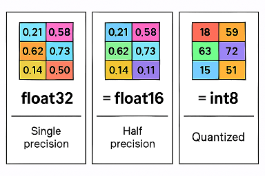

# 量化quantization

- [返回上层目录](../model-inference-optimization-deployment.md)

# 问题

## 量化int4/8直接把float值变成整数值了还能是对的吗

> 就是混合精度推理把float32变成float16我还能理解，毕竟都是float值，只是精度略有降低，用scale缩放就可以解决了，但是量化int4/8直接把float值变成整数值了，这感觉一眼看上去就是错的呀

你的感觉很对，咱们可以更仔细地分一下思考：

🔹**混合精度推理**（float32 ➔ float16）

- 本质：都是**浮点数**，只是精度降低了（比如小数点后位数变少了），但**数值本身变化不大**。
- 通过缩放（scaling）等手段，基本能保住信息，不严重破坏原来模型的表示能力。
- 所以，float16可以做到：**稍微慢一点精度，换来巨大加速，效果损失小**。

🔹**模型量化**（float32 ➔ int8 / int4）

- 本质：把连续的浮点数，**硬挤进**离散的整数表示范围。
- 这不是简单精度降低了，而是**值本身都被改了**（严重信息丢失）。
- 举例：
  - float32里可能有 0.2137、0.2189、0.2201 很近的值。
  - 量化成int8以后，可能都变成了**同一个整数**，比如 22。
- 所以量化需要非常复杂的处理，比如：
  - 找一个合适的**缩放因子（scale）和零点（zero point）**，让 float 值映射到整数。
  - 量化训练（Quantization-Aware Training, QAT）：提前模拟量化误差，边训练边适应。
  - 后训练量化（Post-Training Quantization, PTQ）：训练完以后再做一点微调。
- **量化损失比混合精度大得多**，但也能获得更夸张的速度和内存提升。

所以总结一句话就是：

> 混合精度更像是"压缩图片"，而量化更像是"把彩色照片变成像素马赛克"。

🌟 很多先进的方法，比如 GPT-4、Gemini 也在用 int4/int8，但都要经过特别仔细的量化训练和误差校准，不是简单地 "除一除" 就完事的。

要不要我给你画一个 **float32 ➔ float16 ➔ int8的直观对比小图**？

# 参考资料

[七、量化原理](https://zhuanlan.zhihu.com/p/637609643)

[Understanding INT4 Quantization for Transformer Models: Latency Speedup, Composability, and Failure Cases](https://arxiv.org/abs/2301.12017)

## 大模型

* [量化和反量化](https://chatgpt.com/c/69396693-e570-8333-9e69-1eb752c4a677)

