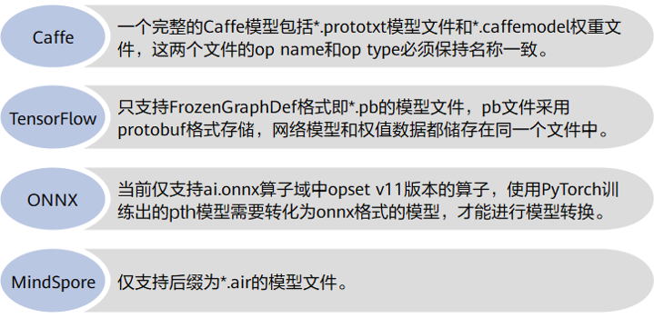
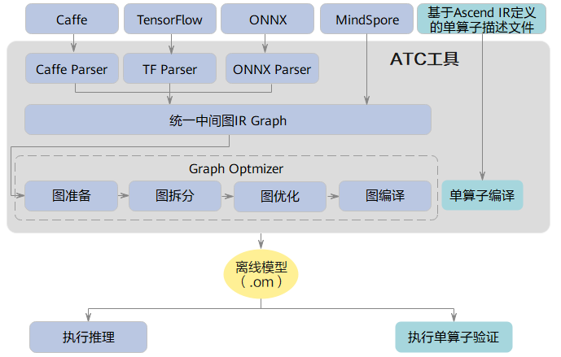
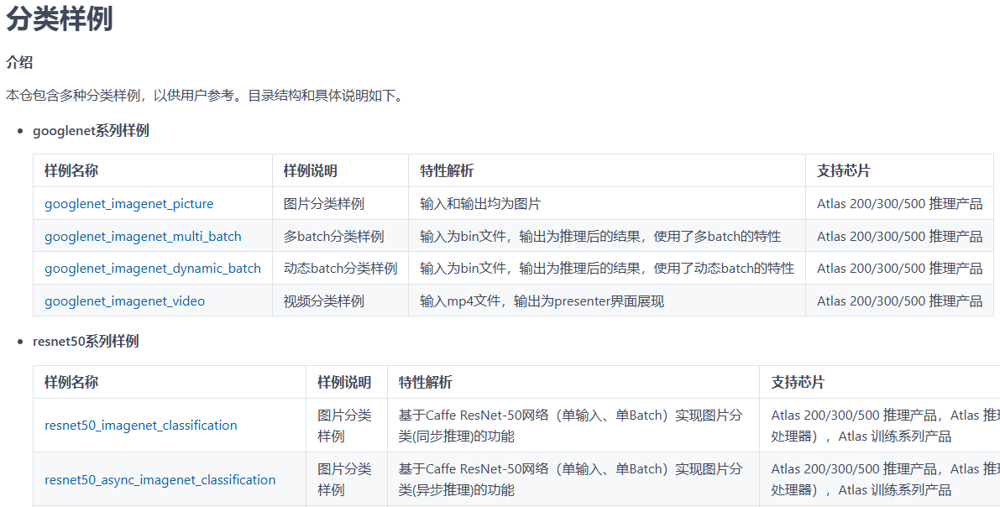

# 华为昇腾NPU

* [返回上层目录](../hardware-platform.md)

# 使用ATC工具将主流开源框架模型转换为昇腾模型

昇腾张量编译器（Ascend Tensor Compiler，简称ATC）是昇腾CANN架构体系下的**模型转换工具**。

## ATC简介

什么是ATC，它能做什么？

* 它可以将开源框架的网络模型（例如TensorFlow、ONNX等）转换为昇腾AI处理器支持的模型文件（.om格式），用于后续的模型推理。比如将模型从.onnx转换为.om格式。

* 它可以将基于Ascend IR定义的单算子描述文件（*.json格式）转换为昇腾AI处理器支持的模型文件（.om格式），用于后续在整网中验证算子功能。

模型转换过程中，ATC会进行算子调度优化、权重数据重排、内存使用优化等操作，对开源框架的网络模型做进一步调优，使其高效地在昇腾AI处理器上执行。

使用ATC（Ascend Tensor Compiler）工具将模型转换为OM格式。ATC工具能够优化算子调度、权值数据排列和内存使用，使得模型能在升腾AI处理器上更高效地运行。

开源框架网络模型支持情况如下：

## ATC工具功能架构

开源框架网络模型编译流程：

* 使用ATC工具转换模型时，开源框架网络模型经过Parser解析后，转换为昇腾的中间图IR Graph。

* 中间图IR Graph经过图准备，图拆分，图优化，图编译等一系列操作后，转成适配昇腾AI处理器的.om模型文件。

* 后续用户可调用**AscendCL提供的模型加载、执行等接口实现模型推理**。

单算子编译流程：

* 使用ATC工具转换单算子时，单算子经过编译后，转换成适配昇腾AI处理器的单算子.om模型文件。

* 后续用户可调用AscendCL提供的单算子模型加载、执行等接口在整网中验证单算子功能。

## 如何使用ATC工具

具体的学习和使用方法参见在[昇腾官网文档](https://www.hiascend.com/document)中的[ATC离线模型编译工具](https://www.hiascend.com/document/detail/zh/canncommercial/81RC1/devaids/devtools/atc/atlasatc_16_0001.html)，按照它的左侧的目录按照顺序学习和操作

> 本文档用于指导开发者如何使用ATC（Ascend Tensor Compiler，简称ATC）工具进行模型转换，得到适配昇腾AI处理器的离线模型。通过本文档您可以达成以下目标：
>
> - 了解不同框架原始网络模型转成昇腾AI处理器离线模型的方法。
> - 能够基于本文档中的参数，转成满足不同定制要求的离线模型。

### 环境搭建

获取ATC工具

参见《[CANN 软件安装指南](https://www.hiascend.com/document/detail/zh/canncommercial/81RC1/softwareinst/instg/instg_0000.html?Mode=PmIns&InstallType=local&OS=Ubuntu&Software=cannToolKit)》 进行环境搭建。

# 基于昇腾NPU的模型推理

昇腾官方Gitee上的推理代码：[gitee: Ascend/samples](https://gitee.com/ascend/samples/tree/master/cplusplus/level2_simple_inference/1_classification)

# 参考资料

* [使用ATC工具将主流开源框架模型转换为昇腾模型](https://www.hiascend.com/developer/techArticles/20230321-2?envFlag=1)

”使用ATC工具将主流开源框架模型转换为昇腾模型“一节参考此官方文档

# 附录

## 什么是华为的CANN

华为CANN（Compute Architecture for Neural Networks）是华为针对AI场景推出的异构计算架构，向上支持多种AI框架，向下服务AI处理器与编程，发挥承上启下的关键作用，是提升昇腾AI处理器计算效率的关键平台。

**主要功能**

- **提供多层次编程接口**：CANN提供了从底层算子、模型开发再到上层应用全流程的开发工具，包括Ascend C算子开发语言、AscendCL编程接口等，覆盖全场景应用，方便开发者快速开发各类算法。
- **支持多种AI框架**：全面支持昇思MindSpore、飞桨PaddlePaddle、PyTorch、TensorFlow、Caffe等主流AI框架。
- **优化算子库**：CANN内置了大量优化过的算子，如elementwise算子、Resize算子等，以提高计算效率。
- **模型转换工具**：提供ATC（Ascend Tool Chain）工具，用于将模型从ONNX、Caffe等格式转换为Ascend处理器可执行的OM模型。
- **硬件抽象层**：CANN提供了硬件抽象层，使得应用程序可以不关心底层硬件细节，从而更容易地移植和扩展。

**架构组成**

CANN的架构被抽象为五大层级：

- **计算语言接口**：如Ascend C算子开发语言，原生支持C和C++标准规范。
- **计算服务层**：提供内存管理、算力分配和资源调度等功能。
- **计算编译引擎**：如GE图引擎，是计算图编译和运行的控制中心，提供图优化、图编译管理以及图执行控制等功能。
- **计算执行引擎**：如HCCL集合通信库，提供单机多卡以及多机多卡间的数据并行、模型并行集合通信方案。
- **计算基础层**：提供高效的硬件资源管理、媒体数据预处理、单算子加载执行、模型推理等开发接口。

**应用场景**

CANN适用于多种AI应用场景，包括但不限于：

- **数据中心**：用于大规模模型训练和推理。
- **边缘计算**：在边缘设备上实现高效的AI推理。
- **端设备**：如智能手机、智能摄像头等，实现端到端的AI应用。

**优势**

- **兼容性强**：可在不同的硬件、操作系统和AI开发框架的异构环境中发挥较好的计算性能，实现端边云多设备的协同。
- **开发效率高**：提供统一的编程接口AscendCL，适配全系列硬件，助力开发者快速构建基于昇腾平台的AI应用。

**与英伟达CUDA的对比**

- **硬件适配**：CUDA专为英伟达GPU设计，覆盖消费级到服务器级显卡；CANN仅适配华为昇腾AI芯片。
- **生态系统**：CUDA自2007年推出以来，已形成庞大生态；CANN起步较晚，生态尚在完善中。
- **编程模型**：CUDA基于SIMT架构，开发者需用C/C++编写核函数；CANN提供更贴近AI框架的编程接口，简化了昇腾芯片的指令编排。