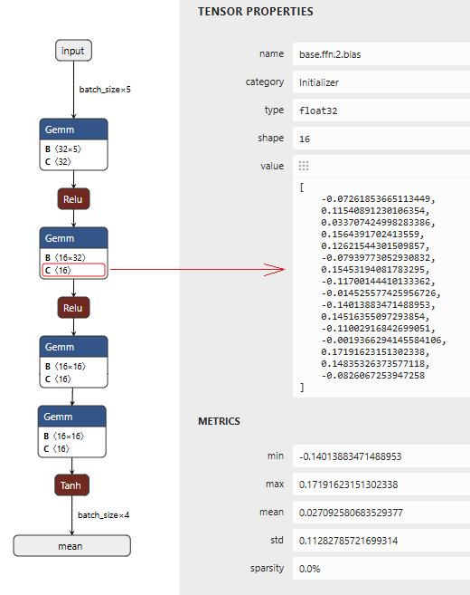

# netron模型可视化工具

- [返回上层目录](../model-deployment-practice.md)

netron是一个用于查看和可视化神经网络模型的桌面应用程序，支持多种深度学习框架和常用的神经网络格式。适合用于可视化神经网络模型，尤其是对于需要进行神经网络模型调试和可视化的开发人员和研究人员。

软件源码和应用程序下载地址：

* [github netron](https://github.com/lutzroeder/netron)
* [gitee netron](https://gitcode.com/gh_mirrors/ne/netron) （github的镜像地址，实时同步）

我们打开一个onnx模型文件看一下界面内容：



会显示你的输入输出的名字，还有神经网络的权重：

* 输入输出的名字分别是：`input`和`mean`，注意，这里的输入输出的名字就是你保存模型时起的名字。
* 神经网络权重：点击该模块，在由此的`value`中显示。

下面附上将pytorch的模型保存为onnx模型的代码：

```python
import torch
import torch.nn as nn
import onnxruntime as ort

def export_onnx():
    model = Model()
    # model.load_state_dict(torch.load("model.pth"))
    model.eval()

    dummy_input = torch.randn(1, 5)
    torch.onnx.export(model, dummy_input, "model.onnx",
        input_names=["input"], output_names=["mean", "..."],  # 有几个输出就命名几个
        opset_version=11,
        dynamic_axes={  # 加上这个就会变为batch_size变为动态的
            "input": {0: "batch_size"},  # 让第0维（batch）是动态的
            "mean": {0: "batch_size"},
            "...": {0: "batch_size"}  # 有几个输出就命名几个
         })
```

