# im2col: 将卷积转为矩阵乘法来加速计算

* [返回上层目录](../matrix-acceleration-algorithm.md)
* [矩阵卷积](#矩阵卷积)
* [im2col的作用](#im2col的作用)
* [单通道单卷积核](#单通道单卷积核)
* [多通道单卷积核](#多通道单卷积核)
* [多通道多卷积核](#多通道多卷积核)
* [批量多通道多卷积核](#批量多通道多卷积核)

# 矩阵卷积

卷积就是卷积核跟图像矩阵的运算。卷积核是一个小窗口，记录的是权重。卷积核在输入图像上按步长滑动，每次操作卷积核对应区域的输入图像，将卷积核中的权值和对应的输入图像的值相乘再相加，赋给卷积核中心所对应的输出特征图的一个值，如下图所示（这里卷积核要旋转180 °）：

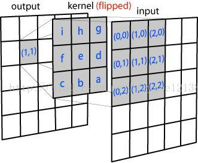

卷积计算的输入从二维的矩阵到四维张量，以及卷积核从二维矩阵到四维矩阵都对应不同大小的输出，最后会统一到一个算法里面，这里用一个函数来表示：
$$
a=conv(x,k)
$$
$x$是输入，$k$是卷积核，$\alpha$是卷积的结果，即特征图（feature map）。

# im2col的作用

以上我们已经知道了卷积是如何操作的，im2col的作用就是优化卷积运算，如何优化呢，我们先学习一下这个函数的原理。

我们假设卷积核的尺寸为2x2，输入图像尺寸为3x3。im2col做的事情就是对于卷积核每一次要处理的小窗，将其展开到新矩阵的一行（列），新矩阵的列（行）数，就是对于一副输入图像，卷积运算的次数（卷积核滑动的次数），如下图所示：

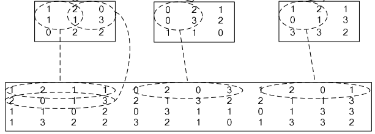

以最右侧一列为例，卷积核为2x2，所以新矩阵的列数就为4；步长为一，卷积核共滑动4次，行数就为4。再放一张图应该看得更清楚。

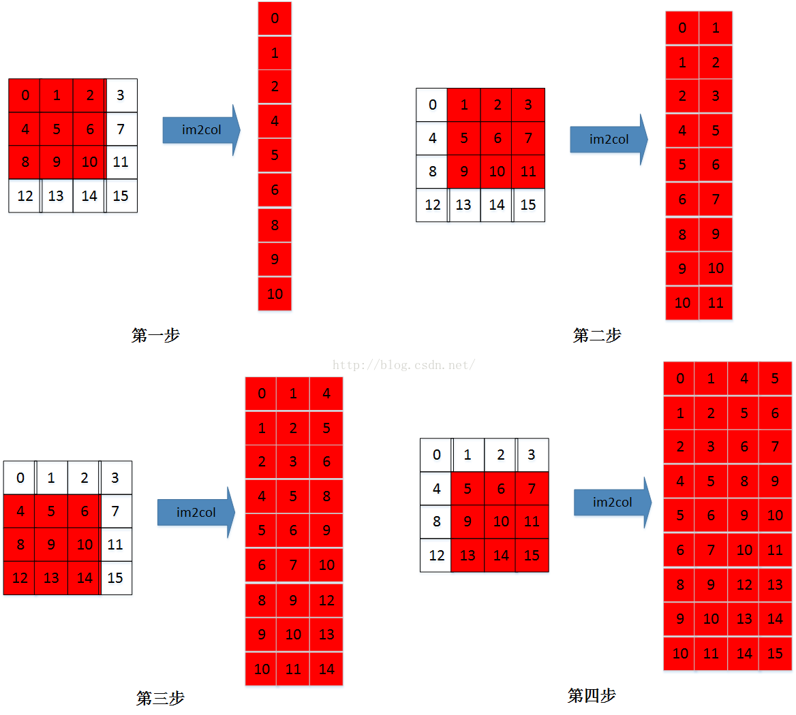

输入为4x4，卷积核为3x3，则新矩阵为9x4 。看到这里我就产生了一个疑问：我们把一个卷积核对应的值展开，到底应该展开为行还是列呢？卷积核的滑动先行后列还是相反？区别在哪？

这其实主要取决于我们使用的框架访存的方式。 计算机一次性读取相近的内存是最快的，尤其是当需要把数据送到GPU去计算的时候，这样可以节省访存的时间，以达到加速的目的。不同框架的访存机制不一样，所以会有行列相反这样的区别。在caffe框架下，im2col是将一个小窗的值展开为一行，而在matlab中则展开为列。所以说，行列的问题没有本质区别，目的都是**为了在计算时读取连续的内存**。

这也解释了我们为什么要通过这个变化来优化卷积。如果**按照数学上的步骤做卷积读取内存是不连续的**，这样就会增加时间成本。同时我们注意到做卷积对应元素相乘再相加的做法跟向量内积很相似，所以通过im2col将矩阵卷积转化为矩阵乘法来实现。

# 单通道单卷积核

先看输入和卷积核都是矩阵的情况：

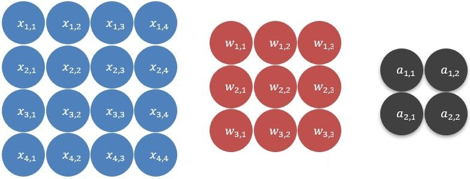

上图中蓝色的为输入，红色的是卷积核，灰色是结果

卷积的过程就是，将输入划分成若干个**与卷积核相同大小**的不同子集，再分别与卷积核点乘：

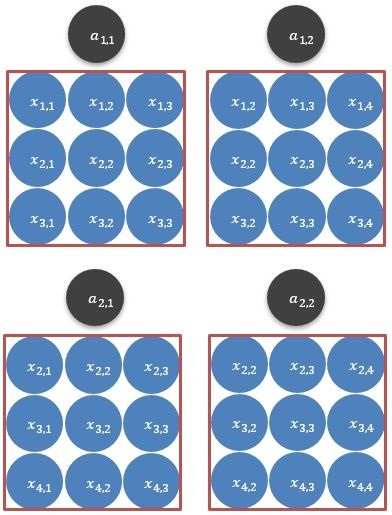

如上图所示，本栗子的输入可以划分为4个子子集（为什么是4个，这里涉及一个步长的变量，后面讨论），将它们各自与卷积核点乘，得到的结果就是红框上面的输出。

现在，将上述的过程用公式向量表示，就拿第一个子集（将其表示为$x^{(1)}$）来说吧：
$$
x^{(1)}=
\begin{bmatrix}
x_{1,1}&x_{1,2}&x_{1,3}\\
x_{2,1}&x_{2,2}&x_{2,3}\\
x_{3,1}&x_{3,2}&x_{3,3}\\
\end{bmatrix}
$$
然后将其展开，变成一个行向量：
$$
x^{(1)}=
\begin{bmatrix}
x_{1,1}&x_{1,2}&x_{1,3}&
x_{2,1}&x_{2,2}&x_{2,3}&
x_{3,1}&x_{3,2}&x_{3,3}
\end{bmatrix}
$$
对这四个子集都进行同样的操作，然后并在一起得到一个**矩阵**：
$$
\begin{aligned}
X&=
\begin{bmatrix}
x^{(1)}\\
x^{(2)}\\
x^{(3)}\\
x^{(4)}\\
\end{bmatrix}
&=
\begin{bmatrix}
x_{1,1}&x_{1,2}&x_{1,3}&
x_{2,1}&x_{2,2}&x_{2,3}&
x_{3,1}&x_{3,2}&x_{3,3}\\
x_{1,2}&x_{1,3}&x_{1,4}&
x_{2,2}&x_{2,3}&x_{2,4}&
x_{3,2}&x_{3,3}&x_{3,4}\\
x_{2,1}&x_{2,2}&x_{2,3}&
x_{3,1}&x_{3,2}&x_{3,3}&
x_{4,1}&x_{4,2}&x_{4,3}&\\
x_{2,2}&x_{2,3}&x_{2,4}&
x_{3,2}&x_{3,3}&x_{3,4}&
x_{4,2}&x_{4,3}&x_{4,4}
\end{bmatrix}
\end{aligned}
$$
同样的，再将卷积核如法炮制，只不过这次是展开成**列向量**：
$$
W=
\begin{bmatrix}
w_{1,1}&w_{1,2}&w_{1,3}&
w_{2,1}&w_{2,2}&w_{2,3}&
w_{3,1}&w_{3,2}&w_{3,3}
\end{bmatrix}^T
$$
然后将$X,W$相乘，得到：
$$
\begin{aligned}
A&=XW
=
\begin{bmatrix}
x^{(1)}\\
x^{(2)}\\
x^{(3)}\\
x^{(4)}\\
\end{bmatrix}W
=
\begin{bmatrix}
x^{(1)}W\\
x^{(2)}W\\
x^{(3)}W\\
x^{(4)}W\\
\end{bmatrix}
&=
\begin{bmatrix}
x_{1,1}&x_{1,2}&x_{1,3}&
x_{2,1}&x_{2,2}&x_{2,3}&
x_{3,1}&x_{3,2}&x_{3,3}\\
x_{1,2}&x_{1,3}&x_{1,4}&
x_{2,2}&x_{2,3}&x_{2,4}&
x_{3,2}&x_{3,3}&x_{3,4}\\
x_{2,1}&x_{2,2}&x_{2,3}&
x_{3,1}&x_{3,2}&x_{3,3}&
x_{4,1}&x_{4,2}&x_{4,3}&\\
x_{2,2}&x_{2,3}&x_{2,4}&
x_{3,2}&x_{3,3}&x_{3,4}&
x_{4,2}&x_{4,3}&x_{4,4}
\end{bmatrix}
\begin{bmatrix}
w_{1,1}\\w_{1,2}\\w_{1,3}\\
w_{2,1}\\w_{2,2}\\w_{2,3}\\
w_{3,1}\\w_{3,2}\\w_{3,3}
\end{bmatrix}
&=
\begin{bmatrix}
a_1\\
a_2\\
a_3\\
a_4\\
\end{bmatrix}
\end{aligned}
$$
最后将A变形，就得到了卷积的结果：
$$
A=\begin{bmatrix}
a_1\\
a_2\\
a_3\\
a_4\\
\end{bmatrix}
\rightarrow
\begin{bmatrix}
a_1&a_2\\
a_3&a_4\\
\end{bmatrix}
=
\begin{bmatrix}
a_{1,1}&a_{1,2}\\
a_{2,1}&a_{2,2}\\
\end{bmatrix}
$$
以上，就是输入和卷积核都是矩阵时的情况。

更一般的，卷积操作一般会进行填零操作（same padding），这是为了卷积后结果的尺寸和卷积输入一致：
$$
\begin{bmatrix}
x_{1,1}&x_{1,2}&x_{1,3}&x_{1,4}\\
x_{2,1}&x_{2,2}&x_{2,3}&x_{2,4}\\
x_{3,1}&x_{3,2}&x_{3,3}&x_{3,4}\\
x_{4,1}&x_{4,2}&x_{4,3}&x_{4,4}\\
\end{bmatrix}
\rightarrow
\begin{bmatrix}
0&0&0&0&0&0\\
0&x_{1,1}&x_{1,2}&x_{1,3}&x_{1,4}&0\\
0&x_{2,1}&x_{2,2}&x_{2,3}&x_{2,4}&0\\
0&x_{3,1}&x_{3,2}&x_{3,3}&x_{3,4}&0\\
0&x_{4,1}&x_{4,2}&x_{4,3}&x_{4,4}&0\\
0&0&0&0&0&0
\end{bmatrix}
$$
对应的卷积核为：
$$
\begin{bmatrix}
w_{1,1}&w_{1,2}&w_{1,3}\\
w_{2,1}&w_{2,2}&w_{2,3}\\
w_{3,1}&w_{3,2}&w_{3,3}\\
\end{bmatrix}
$$
卷积结果为：
$$
\begin{bmatrix}
a_{1,1}&a_{1,2}&a_{1,3}&a_{1,4}\\
a_{2,1}&a_{2,2}&a_{2,3}&a_{2,4}\\
a_{3,1}&a_{3,2}&a_{3,3}&a_{3,4}\\
a_{4,1}&a_{4,2}&a_{4,3}&a_{4,4}\\
\end{bmatrix}
$$
其各项的值按如下方式算出：
$$
\begin{bmatrix}
0&0&0&0&x_{1,1}&x_{1,2}&0&x_{2,1}&x_{2,2}\\
0&0&0&x_{1,1}&x_{1,2}&x_{1,3}&x_{2,1}&x_{2,2}&x_{2,3}\\
0&0&0&x_{1,2}&x_{1,3}&x_{1,4}&x_{2,2}&x_{2,3}&x_{2,4}\\
0&0&0&x_{1,3}&x_{1,4}&0&x_{2,3}&x_{2,4}&0\\
\\
0&x_{1,1}&x_{1,2}&0&x_{2,1}&x_{2,2}&0&x_{3,1}&x_{3,2}\\
x_{1,1}&x_{1,2}&x_{1,3}&x_{2,1}&x_{2,2}&x_{2,3}&x_{3,1}&x_{3,2}&x_{3,3}\\
x_{1,2}&x_{1,3}&x_{1,4}&x_{2,2}&x_{2,3}&x_{2,4}&x_{3,2}&x_{3,3}&x_{3,4}\\
x_{1,3}&x_{1,4}&0&x_{2,3}&x_{2,4}&0&x_{3,3}&x_{3,4}&0\\
\\
0&x_{2,1}&x_{2,2}&0&x_{3,1}&x_{3,2}&0&x_{4,1}&x_{4,2}\\
x_{2,1}&x_{2,2}&x_{2,3}&x_{3,1}&x_{3,2}&x_{3,3}&x_{4,1}&x_{4,2}&x_{4,3}\\
x_{2,2}&x_{2,3}&x_{2,4}&x_{3,2}&x_{3,3}&x_{3,4}&x_{4,2}&x_{4,3}&x_{4,4}\\
x_{2,3}&x_{2,4}&0&x_{3,3}&x_{3,4}&0&x_{4,3}&x_{4,4}&0\\
\\
0&x_{3,1}&x_{3,2}&0&x_{4,1}&x_{4,2}&0&0&0\\
x_{3,1}&x_{3,2}&x_{3,3}&x_{4,1}&x_{4,2}&x_{4,3}&0&0&0\\
x_{3,2}&x_{3,3}&x_{3,4}&x_{4,2}&x_{4,3}&x_{4,4}&0&0&0\\
x_{3,3}&x_{3,4}&0&x_{4,3}&x_{4,4}&0&0&0&0\\
\end{bmatrix}
\times
\begin{bmatrix}
w_{1,1}\\w_{1,2}\\w_{1,3}\\
w_{2,1}\\w_{2,2}\\w_{2,3}\\
w_{3,1}\\w_{3,2}\\w_{3,3}\\
\end{bmatrix}
=
\begin{bmatrix}
a_{1,1}\\a_{1,2}\\a_{1,3}\\a_{1,4}\\\\
a_{2,1}\\a_{2,2}\\a_{2,3}\\a_{2,4}\\\\
a_{3,1}\\a_{3,2}\\a_{3,3}\\a_{3,4}\\\\
a_{4,1}\\a_{4,2}\\a_{4,3}\\a_{4,4}
\end{bmatrix}
$$
im2col具体过程如下：

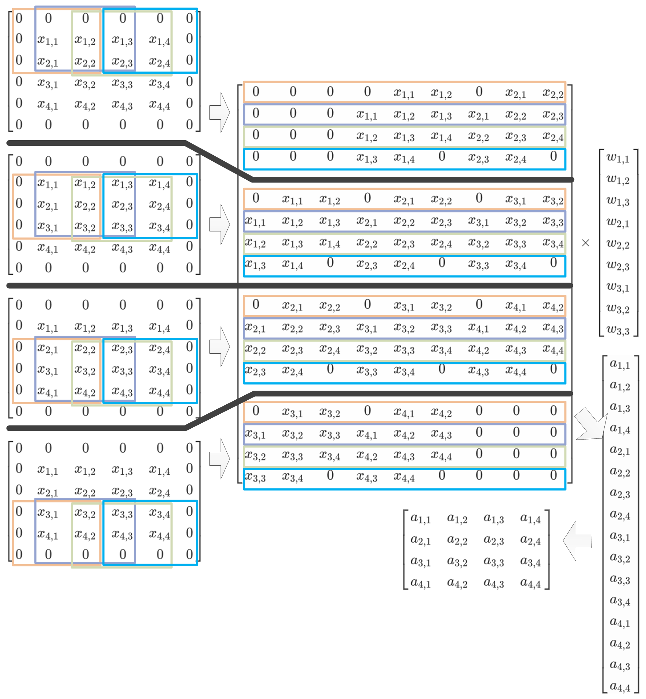

# 多通道单卷积核

现在将输入升级为**多通道**（例如图片一般都是三通道的），即变成一个三维张量，相对应的，之前的情况称之为**单通道**；同时，卷积核也必须升级成多通道的，为什么？因为**卷积核的通道数必须与输入的通道数相等**：

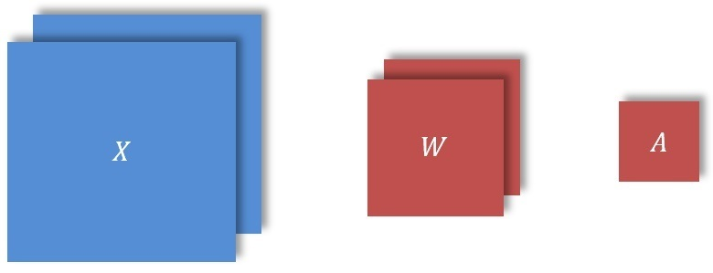

如上图所示，输入变成双通道后，卷积核也必须变成双通道的，但是，输出还是一个通道，下面看一下计算过程，先画一个详细的图示：

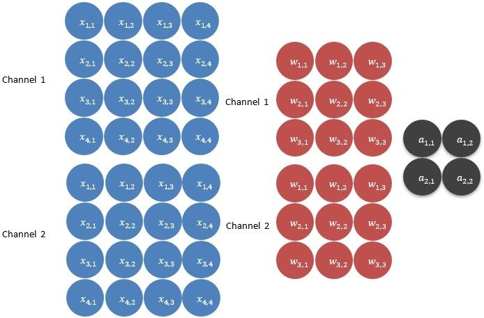

同样，还是将输入划分成4个子集，具体的划分过程是，通道一和通道二各自划一个子集，与卷积核对应的通道大小相同：

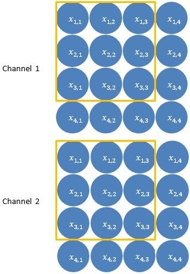

将两个通道的子集上下拼接变成一个6行3列的矩阵，它们之间元素的顺序我用下标表示：
$$
x^{(1)}=
\begin{bmatrix}
x_{1,1,1}&x_{1,1,2}&x_{1,1,3}\\
x_{1,2,1}&x_{1,2,2}&x_{1,2,3}\\
x_{1,3,1}&x_{1,3,2}&x_{1,3,3}\\
x_{2,1,1}&x_{2,1,2}&x_{2,1,3}\\
x_{2,2,1}&x_{2,2,2}&x_{2,2,3}\\
x_{2,3,1}&x_{2,3,2}&x_{2,3,3}\\
\end{bmatrix}
=
\begin{bmatrix}
x_1&x_2&x_3\\
x_4&x_5&x_6\\
x_7&x_8&x_9\\
x_{10}&x_{11}&x_{12}\\
x_{13}&x_{14}&x_{15}\\
x_{16}&x_{17}&x_{18}\\
\end{bmatrix}
$$
然后同样的将其展开成一个**横向量**：$x^{(1)}=[x_1,...,x_{18}]$，剩下的就是重复上述两步，得到4个横向量，得到一个**矩阵**：
$$
X=
\begin{bmatrix}
x^{(1)}\\
x^{(2)}\\
x^{(3)}\\
x^{(4)}\\
\end{bmatrix}
$$
接下来，同样将卷积核也给展开，还是变成一个**列向量**，卷积核两个通道的元素之间的顺序处理与输入是一样的：
$$
W=
\begin{bmatrix}
w_1\\
\vdots\\
w_{18}\\
\end{bmatrix}
$$
然后，计算卷积结果：
$$
A=XW=
\begin{bmatrix}
x^{(1)}\\
x^{(2)}\\
x^{(3)}\\
x^{(4)}\\
\end{bmatrix}W
=
\begin{bmatrix}
x^{(1)}W\\
x^{(2)}W\\
x^{(3)}W\\
x^{(4)}W\\
\end{bmatrix}
=
\begin{bmatrix}
a_1\\
a_2\\
a_3\\
a_4\\
\end{bmatrix}
$$
可以看到，多通道的情况与单通道的情况基本上是没有区别的；然后，还是示意图：

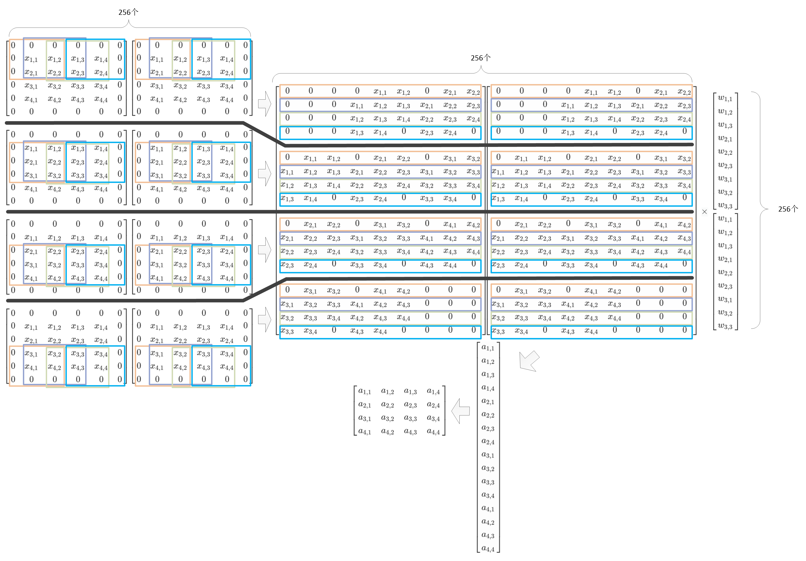

# 多通道多卷积核

接下来，在多通道的基础上，进一步升级，使用**多个卷积核**，大致如下图：

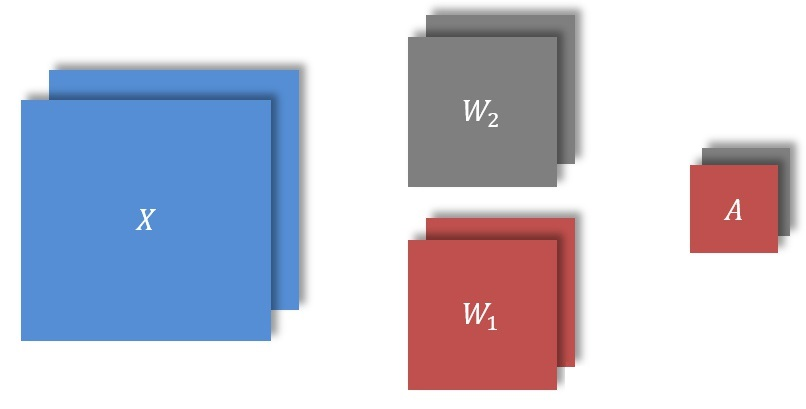

可以看到，现在输出的结果变成多通道了，也就是说，**卷积结果的通道数等于卷积核的个数是一致的**，计算过程大致如下：

因为输入没有变化，所以划分出来的矩阵还是与之前一样：
$$
X=
\begin{bmatrix}
x^{(1)}\\
x^{(2)}\\
x^{(3)}\\
x^{(4)}\\
\end{bmatrix}
$$
然后，对于第一个卷积核，处理的方式也和之前一样，展开成一个列向量，不过这里命名为$W_1$：
$$
W=
\begin{bmatrix}
w_1\\
\vdots\\
w_{18}\\
\end{bmatrix}
$$
然后对于第二个卷积核也是采取同样的操作展开成一个列向量，为$W_2$，所以此时所有的卷积核可以用**一个矩阵**表示：
$$
W=[W_1,W_2]
$$
然后是结算卷积结果：
$$
A=XW=
\begin{bmatrix}
x^{(1)}\\
x^{(2)}\\
x^{(3)}\\
x^{(4)}\\
\end{bmatrix}
\begin{bmatrix}
W_1
W_2\\
\end{bmatrix}
=
\begin{bmatrix}
a_1&a_5\\
a_2&a_6\\
a_3&a_7\\
a_4&a_8\\
\end{bmatrix}
$$
从上式可以得知，各个每个卷积核是独立与输入进行卷积计算，相互之间并不影响；然后，将计算结果变形，就得到了输出：
$$
A=
\begin{bmatrix}
a_1&a_5\\
a_2&a_6\\
a_3&a_7\\
a_4&a_8\\
\end{bmatrix}
\rightarrow
\begin{bmatrix}
\begin{bmatrix}
a_1&a_2\\
a_3&a_4\\
\end{bmatrix}
\begin{bmatrix}
a_5&a_6\\
a_7&a_8\\
\end{bmatrix}
\end{bmatrix}
=
\begin{bmatrix}
\begin{bmatrix}
a_{1,1,1}&a_{1,1,2}\\
a_{1,2,1}&a_{1,2,2}\\
\end{bmatrix}
\begin{bmatrix}
a_{2,1,1}&a_{2,1,2}\\
a_{2,2,1}&a_{2,2,2}\\
\end{bmatrix}
\end{bmatrix}
$$
然后，还是示意图：

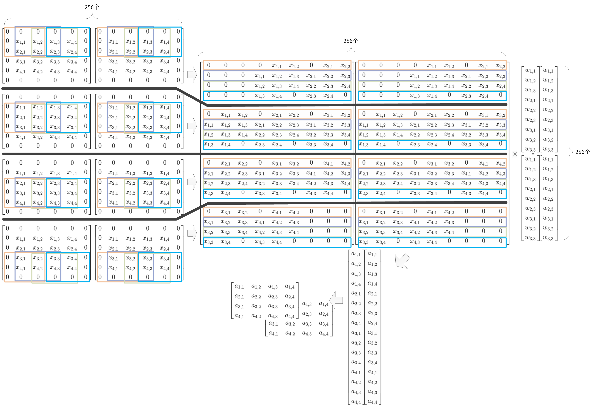

# 批量多通道多卷积核

剩下的就是扩展到批量的情况了：

有了前面多卷积核的计算过程做对比后，多输入的计算过程也是大同小异的，在前面的多卷积核的计算中，每个卷积核都独立与输入进行卷积，现在有多个输入也是一样，每一个输入独立与所有卷积核进行卷积计算得到一个输出，所以**输入的数量与输出的数量一致**

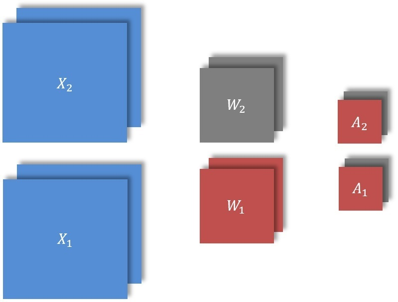

还是来看栗子吧，设输入的批量为2，对第一个输入采用与前面一样的操作，变换为一个矩阵：
$$
X_1=
\begin{bmatrix}
x^{(1)}\\
x^{(2)}\\
x^{(3)}\\
x^{(4)}\\
\end{bmatrix}
$$
第二个输入变换为：
$$
X_2=
\begin{bmatrix}
x^{(5)}\\
x^{(6)}\\
x^{(7)}\\
x^{(8)}\\
\end{bmatrix}
$$
然后**将两个矩阵拼接在一起**，组成一个大矩阵：
$$
X=
\begin{bmatrix}
X^{(1)}\\
X^{(2)}\\
\end{bmatrix}
=
\begin{bmatrix}
x^{(1)}\\
x^{(2)}\\
\vdots\\
x^{(4)}\\
x^{(5)}\\
x^{(6)}\\
\vdots\\
x^{(8)}\\
\end{bmatrix}
$$
如果非常熟悉矩阵乘法，肯定已经知道了输出的结果：
$$
A=XW=
\begin{bmatrix}
X_1\\
X_2
\end{bmatrix}
\begin{bmatrix}
W_1
W_2\\
\end{bmatrix}
=
\begin{bmatrix}
x^{(1)}\\
x^{(2)}\\
\vdots\\
x^{(4)}\\
x^{(5)}\\
x^{(6)}\\
\vdots\\
x^{(8)}\\
\end{bmatrix}
\begin{bmatrix}
W_1
W_2\\
\end{bmatrix}
=
\begin{bmatrix}
a_1&a_5\\
a_2&a_6\\
a_3&a_7\\
a_4&a_8\\
a_9&a_{13}\\
a_{10}&a_{14}\\
a_{11}&a_{15}\\
a_{12}&a_{16}\\
\end{bmatrix}
$$
上面$a_1$至$a_8$是$X_1$与$W$相乘的结果，$a_9$至$a_{16}$是$X_2$与$W$相乘的结果，扩展到更一般的形式就是：
$$
XW=
\begin{bmatrix}
X_1\\
X_2\\
\vdots\\
X_m\\
\end{bmatrix}
\begin{bmatrix}
W_1&W_2&\dots&W_n
\end{bmatrix}
$$

# 参考资料

* [im2col的原理和实现](https://blog.csdn.net/dwyane12138/article/details/78449898)
* [im2col方法实现卷积算法](https://zhuanlan.zhihu.com/p/63974249)

本文参考了上述博客。

===

现在卷积运算一般先用img2col算法展成矩阵，然后调用gemm矩阵乘