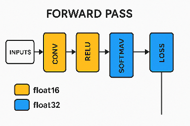

# 混合精度推理

* [返回上层目录](../model-compression.md)
* [混合精度推理与量化的使用阶段](#混合精度推理与量化的使用阶段)
* [混合精度推理的原理](#混合精度推理的原理)
* [推理速度的比较](#推理速度的比较)
* [标准混合精度训练流程](#标准混合精度训练流程)
  * [基础版代码实现](#基础版代码实现)
  * [简洁版代码实现](#简洁版代码实现)
  * [高级版代码实现](#高级版代码实现)
  * [为什么前向推理是部分操作是float16](#为什么前向推理是部分操作是float16)
  * [混合精度推理对梯度的缩放是在实际代码中哪里完成的](#混合精度推理对梯度的缩放是在实际代码中哪里完成的)
  * [autocast的内部机制](#autocast的内部机制)
  * [自己手写的混合精度伪代码版](#自己手写的混合精度伪代码版)
* [问题](#问题)
  * [param.grad.data的格式应该不再是float16了吧](#param.grad.data的格式应该不再是float16了吧)
  * [动态调整scale大小scale.update()是为什么](#动态调整scale大小scale.update()是为什么)
  * [混合精度推理和模型量化是什么关系](#混合精度推理和模型量化是什么关系)
  * [为什么不把混合精度推理训练时前向把float16换成int4/8](#为什么不把混合精度推理训练时前向把float16换成int4/8)
  * [loss的精度是float32还是float16呢](#loss的精度是float32还是float16呢)
  * [float16和bfloat16的区别](#float16和bfloat16的区别)


# 混合精度推理与量化的使用阶段

🔵 **训练的前向阶段（forward pass）**，大厂（DeepMind，OpenAI） **确实用 float16 / bfloat16 做混合精度**，而不是一直用 float32。

也就是说，大厂们在**训练的前向推理部分**，

**是用混合精度的**！（不是全 float32）

**具体细节是这样：**

- **前向（Forward）**：可以用 float16 / bfloat16，加速推理、减少显存。
- **反向（Backward）和权重更新（Update）**：通常回到 float32（尤其是梯度累积、权重本身，精度要求高）。

所以叫做 "**混合精度训练**"（**Mixed Precision Training**）

而不是 "**纯 float16 训练**"。

它是：

→ **前向大部分 float16**，

→ **反向、梯度计算、参数更新 float32**。

▶️ 为什么这样设计？

因为**前向传播**主要是算一堆加减乘除，float16够用了。

但**反向传播**（尤其是梯度特别小的时候），

如果用float16，很容易**梯度下溢到0**，训练崩掉。

所以梯度必须 float32 保证稳定。

🔔 **小结版**：

| 阶段             | 大厂通常用的数据类型                        |
| ---------------- | ------------------------------------------- |
| 训练 - 前向      | **float16 / bfloat16**（混合精度）          |
| 训练 - 反向/更新 | **float32**（高精度保证稳定性）             |
| 推理 - 前向      | float16 / bfloat16 / int8 / int4 （轻量化） |

✅ 所以你的理解可以更新为：

> 大厂在训练的前向阶段，**确实用了混合精度（float16/bfloat16）**，
>
> 而不是完全float32。


# 混合精度推理的原理

如果你想看 PyTorch 官方怎么做的，其实 `torch.cuda.amp.GradScaler` 里面就是这么处理的：

比如大概伪代码流程：

```python
# 1. 先scale loss
scaled_loss = loss * scale

# 2. backward
scaled_loss.backward()

# 3. 在optimizer.step()之前
for param in model.parameters():
    if param.grad is not None:
        param.grad.data.div_(scale)  # 反缩放！

# 4. 再真正执行step()
optimizer.step()
```

真实的逻辑是：

| 阶段 | 动作                                          | 说明                                                         |
| ---- | --------------------------------------------- | ------------------------------------------------------------ |
| 1    | 正常前向传播、计算loss                        | 没问题                                                       |
| 2    | 反向传播前，把loss乘以scale                   | **注意！** 是loss乘以scale，不是梯度乘以scale！              |
| 3    | 反向传播（计算梯度）                          | 因为loss被放大了，所以梯度也变大了（但数值不会小到float16精度丢失） |
| 4    | **在optimizer.step()之前，先把梯度除以scale** | 把梯度缩回正常的大小                                         |
| 5    | optimizer.step()真正更新权重                  | **用的是恢复回正常尺度的梯度！**                             |

**为什么是loss乘以scale，而不是直接去动梯度？**

因为 PyTorch 中，反向传播（`loss.backward()`）是基于loss来链式计算梯度的。
 所以，我们直接在loss上乘一个scale，相当于在整个链式求导过程里，**每一条链路的梯度都被scale了**，避免了中间数值太小的问题。
 但是，在真正执行 `optimizer.step()` 更新参数之前，**需要自己手动把梯度除回去**！

这个除回去的操作，一般是由 `torch.cuda.amp.GradScaler` 自动帮你做的。

正确流程画图理解一下：

```shell
原本： loss -> backward -> small gradients -> step

改成混合精度训练：
loss * scale --> backward --> scaled large gradients --> gradients / scale --> step
```

注意：**在step之前一定要除回去，否则就是等效学习率放大了，训练会爆炸。**

所以回答你最开始的疑问：

- 权重不会被放大梯度直接更新。
- **在更新权重前，梯度已经除以scale恢复回正常值了。**
- 这样就保证了：
  - 在 float16 反向传播时避免精度丢失（因为loss被乘了scale，梯度大了）
  - 权重更新时又能用正常的梯度，不会乱改学习率。

# 推理速度的比较

接下来我给你写一个简单的**完整示例**，演示如何从普通推理到混合精度推理。

假设我们有一个简单的神经网络模型，先用普通的`float32`进行推理，然后用混合精度推理。我们将对比一下推理速度！

```python
import torch
import torch.nn as nn
import time


# 模拟一个简单的神经网络
class SimpleModel(nn.Module):
    def __init__(self, input_dim, output_dim):
        super(SimpleModel, self).__init__()
        self.fc = nn.Linear(input_dim, output_dim)

    def forward(self, x):
        return self.fc(x)


# 配置
device = torch.device("cuda" if torch.cuda.is_available() else "cpu")
input_dim = 1024  # 假设输入特征维度
output_dim = 10  # 假设分类数目

# 实例化模型
model = SimpleModel(input_dim, output_dim).to(device)

# 随机生成一些输入数据
inputs = torch.randn(64, input_dim).to(device)  # 假设批量大小为64

infer_times = 100

# 普通的float32推理
start_time = time.time()
with torch.no_grad():
    for _ in range(infer_times):
        outputs = model(inputs)  # 正常推理
end_time = time.time()
print(f"普通推理（float32）的时间：{(end_time - start_time) / infer_times:.4f}秒")

# 开启混合精度推理
with torch.autocast(device_type='cuda', dtype=torch.float16):  # 如果没有cuda，可以试试 float32
    start_time = time.time()
    with torch.no_grad():
        for _ in range(infer_times):
            outputs = model(inputs)  # 混合精度推理
    end_time = time.time()
print(f"混合精度推理（float16）的时间：{(end_time - start_time) / infer_times:.4f}秒")
```

测试结果：

> 普通推理（float32）的时间：0.0430秒
>
> 混合精度推理（float16）的时间：0.0003秒

解释：

1. **普通推理**：直接用`float32`。
2. **混合精度推理**：通过 `torch.autocast(device_type='cuda', dtype=torch.float16)`，让 PyTorch 在推理过程中自动选择 `float16` 和 `float32`，根据数值稳定性来加速推理。

运行结果：

- **普通推理（float32）**：通常会慢一些，显存占用也较大。
- **混合精度推理（float16）**：通常会快很多，而且显存使用量也减少，适合大规模推理。

如果你在 GPU 上运行，**混合精度**的推理速度通常会是普通精度的 1.5 - 2 倍，甚至更多！🎉

# 标准混合精度训练流程

## 基础版代码实现

配合GradScaler使用

送你一个超简洁版口诀 🧠：

> 先 autocast()，再 scale(loss)，然后 backward()，最后 step() + update()

下面这段代码就是标准的、完整的、实战中使用的 **混合精度训练（AMP, Automatic Mixed Precision）流程**了！而且很清晰规范！

```python
import torch
from torch.cuda.amp import autocast, GradScaler

use_amp = torch.cuda.is_available()  # 是否开启混合精度推理，只支持GPU，CPU是无效的

# 创建 GradScaler，用来做 loss scaling
scaler = GradScaler(enabled=use_amp)

for inputs, targets in dataloader:
    optimizer.zero_grad()

    # 开启 autocast，自动在 float16/float32 间切换，节省显存加速推理
    with autocast(enabled=use_amp):
        outputs = model(inputs)       # 模型前向推理，部分操作用float16
        loss = loss_fn(outputs, targets)  # 计算loss（内部关键部分还是float32）

    # 反向传播前先缩放 loss，避免float16下梯度太小
    scaler.scale(loss).backward()

    # scaler.step 会自动处理：如果梯度正常，就执行optimizer.step()
    #                   如果梯度出现 inf/nan，就跳过本次 optimizer.step
    scaler.step(optimizer)

    # 更新Scaler内部的缩放因子，动态调整，保持稳定训练
    scaler.update()
```

🔵 注意：

- `autocast()` 只影响 `forward` 推理的精度（用float16跑更快）。
- `scale(loss)` 是为了让 backward 里的梯度更大，避免下溢。
- `scaler.step()` 和 `scaler.update()` 是核心，**自动检测** + **自动调整scale**！

🔵 我给你稍微配点讲解细节，每一步都讲明白：

✅ 1. 创建 GradScaler

```python
scaler = torch.cuda.amp.GradScaler()
```

- `GradScaler` 就是专门用来做 **loss缩放** 的小助手。
- 它会在反向传播时把loss放大，避免float16下的梯度精度丢失问题。
- 初始缩放因子一般是 `2^16=65536`，然后会**动态调整**（scale太大出nan就缩小，scale稳定就增大）。

问题：

> nan是指超出了float16的范围了吗还是超出了float32的范围了？


✅ 2. 开启 autocast（自动混合精度推理）

```python
with torch.cuda.amp.autocast():
    outputs = model(inputs)
    loss = loss_fn(outputs, targets)
```

- `autocast()` 的作用是：**自动选择每一层用 float16 还是 float32 计算。**
- 绝大部分前向计算（比如卷积、矩阵乘）可以安全地用 float16，大大加速。
- 但像softmax、loss计算这种对精度要求高的，会自动用 float32。
- 完全不用你手动指定！PyTorch内部帮你做好了。

问题：

> torch.cuda.amp.autocast()中含有cuda，那我基于cpu训练，还能使用这句话吗，这句话还有效果吗

非常好的问题！

✅ 简单直接回答你：

- **如果你在 CPU 上训练，也能调用 torch.cuda.amp.autocast()，不会报错**。
- **但它不会有任何效果**，相当于是**空操作**（no-op）。
- 也就是说，**在 CPU 上即使用了 autocast()，内部计算还是 float32，不会真的切成 float16**，因为：
  - CPU 原生对 float16 支持很差，大部分 CPU 不支持高效地跑 float16。
  - PyTorch 的 AMP（自动混合精度）是专门为 **CUDA GPU** 做的优化。

更准确一点讲：

- `torch.cuda.amp.autocast()` 检测到你当前设备不是 CUDA，就直接忽略了自动混合精度的逻辑，相当于：

  ```python
  with autocast():
      outputs = model(inputs)
  ```

  在 CPU 上，就和

  ```python
  outputs = model(inputs)
  ```

  **一模一样**，啥也没改变。

拓展一下：

如果你想在 CPU 上也做类似 float16 的加速（虽然通常意义不大），PyTorch 有一个新特性是：

- `torch.autocast('cpu')`
- 不过这个是到 **PyTorch 1.10+** 后才开始支持，而且要求 CPU 支持 bfloat16（比如 Intel AVX512-BF16 指令集），很新很新，普通 CPU 基本没戏。

而且即使支持，**CPU上的自动混合精度加速效果远远比不上GPU**，因为 CPU 硬件设计就不是为这个优化的。

🔥总结一句话

| 设备       | `torch.cuda.amp.autocast()`的效果 |
| ---------- | --------------------------------- |
| GPU (CUDA) | 正常生效，加速推理/节省显存       |
| CPU        | 空操作，无效果，但不会报错        |

------

要不要我也顺便告诉你一下，如果想写一份**能自动兼容 CPU 和 GPU 的混合精度代码**，应该怎么写？
 就是不用自己判断设备，写一版代码能智能处理，有需要的话告诉我！🚀

✅ 3. 缩放后的反向传播

```python
scaler.scale(loss).backward()
```

- 不是直接 `loss.backward()`，而是 `scaler.scale(loss).backward()`。
- 这里 `scale(loss)` 是放大了loss，比如乘上65536，让之后算出来的梯度也大65536倍。
- 这样可以避免float16梯度太小直接变成0。

✅ 4. scaler.step 自动处理异常

```python
scaler.step(optimizer)
```

- `scaler.step()` 会检查梯度有没有爆掉（比如变成 inf/nan）。
- 如果一切正常，它就帮你执行 `optimizer.step()`。
- 如果发现梯度异常，它会**跳过这次optimizer.step()**，保护你的参数不被 nan 污染！

✅ 5. 自动调整scale

```python
scaler.update()
```

- 根据上一步情况调整 scale：
  - 如果发现梯度爆了（nan/inf），**scale缩小一半**。
  - 如果训练一段时间都没问题，**scale慢慢变大**，让训练效率更高。

**每一步精髓总结**

| 步骤                            | 目的               | 细节                       |
| ------------------------------- | ------------------ | -------------------------- |
| `autocast()`                    | 自动混用float16/32 | 前向推理加速、省显存       |
| `scaler.scale(loss).backward()` | 放大loss再反向传播 | 避免float16下梯度精度丢失  |
| `scaler.step(optimizer)`        | 检查inf/nan        | 遇到异常跳过step，保护参数 |
| `scaler.update()`               | 调整scale          | 动态适配，稳定训练         |

💬 额外一点点进阶

- **float16张量**：模型里的参数、输出大部分都是float16
- **loss计算、标量操作**：为了保证数值稳定，PyTorch在autocast中会让loss部分用float32。
- **scaler内部逻辑**：PyTorch内部其实是捕捉了梯度爆炸（检测到了inf/nan）再决定要不要调整scale。

🚀拷过去直接用！

这一版就是现在工业界实际项目中 PyTorch标准混合精度训练的最佳实践模板！🌟

## 简洁版代码实现

好耶！！那我来教你！⚡我们来封装一个 **超专业又干净** 的混合精度小工具！

**✨ 第一步：写一个 AMPContext 小类**

```python
import torch
from contextlib import contextmanager

class AMPContext:
    def __init__(self, enabled: bool = None):
        if enabled is None:
            enabled = torch.cuda.is_available()
        self.enabled = enabled
        self.scaler = torch.cuda.amp.GradScaler(enabled=self.enabled)

    @contextmanager
    def autocast(self):
        with torch.cuda.amp.autocast(enabled=self.enabled):
            yield

    def backward(self, loss):
        self.scaler.scale(loss).backward()

    def step(self, optimizer):
        self.scaler.step(optimizer)
        self.scaler.update()
```

这个小类帮你统一做了几件事：

- 根据环境自动判断要不要启用AMP（除非你手动指定`enabled`）
- 自动管理`autocast()`上下文
- 自动管理`GradScaler`的`scale/backward/step/update`

**✨ 第二步：训练时超级优雅地用**

```python
amp = AMPContext()  # 自动启用/关闭AMP

for inputs, targets in dataloader:
    optimizer.zero_grad()

    with amp.autocast():
        outputs = model(inputs)
        loss = loss_fn(outputs, targets)

    amp.backward(loss)
    amp.step(optimizer)
```

🚀 为什么这么写好？

- 你的训练代码非常短、非常清晰，再也不用到处写 `autocast(enabled=...)` 了。
- 未来想不开启混合精度？只要建 `amp = AMPContext(enabled=False)` 就行了！
- 可以很方便地集成到大型训练框架里（比如Trainer类）。

✨ 总结一句话：

| 之前写法                                                  | 现在写法                        |
| --------------------------------------------------------- | ------------------------------- |
| 各种 scattered autocast / scaler.step() / scaler.update() | 统一封装到AMPContext            |
| 读起来冗长又容易出错                                      | 简洁优雅，像开关按钮一样开关AMP |

## 高级版代码实现

要不要我顺便也教你一版**更进阶的版本**？比如可以支持**autocast在CPU下禁用/跳过**、**自动检测模型是不是float16**？

要的话直接告诉我：“要更高级版！”

 🌟（这个就真的跟专业训练库的AMP管理模块一样了）

好！收到！！✨ 我们来写一个 **超级专业版 AMPContext V2**！

这个版本不仅干净，还能智能检测、自动跳过无意义的操作，让你训练时毫无负担。

🚀 高级版 AMPContext V2

```python
import torch
from contextlib import contextmanager

class AMPContext:
    def __init__(self, enabled: bool = None, use_cpu: bool = False):
        if enabled is None:
            enabled = torch.cuda.is_available()
        self.enabled = enabled and (not use_cpu)  # 如果是CPU训练，强制禁用AMP
        self.device = 'cuda' if torch.cuda.is_available() else 'cpu'
        self.scaler = torch.cuda.amp.GradScaler(enabled=self.enabled)

    @contextmanager
    def autocast(self):
        if self.enabled:
            with torch.cuda.amp.autocast(enabled=True):
                yield
        else:
            # 如果禁用，就什么也不做（保持 float32）
            yield

    def backward(self, loss):
        if self.enabled:
            self.scaler.scale(loss).backward()
        else:
            loss.backward()

    def step(self, optimizer):
        if self.enabled:
            self.scaler.step(optimizer)
            self.scaler.update()
        else:
            optimizer.step()

    def to(self, model):
        """根据是否开启amp，决定是否把模型半精度（适配大模型部署等场景）"""
        if self.enabled:
            model.half()  # 将模型权重变成float16
        else:
            model.float()  # 保持float32
        model.to(self.device)
        return model
```

🔥 使用示范（专业级别）

```python
amp = AMPContext()

model = MyModel()
model = amp.to(model)

optimizer = torch.optim.Adam(model.parameters(), lr=1e-4)

for inputs, targets in dataloader:
    optimizer.zero_grad()

    with amp.autocast():
        outputs = model(inputs)
        loss = loss_fn(outputs, targets)

    amp.backward(loss)
    amp.step(optimizer)
```

✨ 这版 V2 的超能力总结

| 功能                   | 描述                                                 |
| ---------------------- | ---------------------------------------------------- |
| 自动检测环境           | `torch.cuda.is_available()`                          |
| 自动禁用在CPU          | 如果在CPU训练，强制关闭混合精度（避免意外）          |
| 自动管理autocast上下文 | 自动决定是否启用float16推理                          |
| 自动管理GradScaler     | 自动scale/backward/step/update                       |
| 支持模型权重半精度化   | `.to(model)`可以让模型直接half()（比如用于推理加速） |
| 完全兼容float32训练    | 只要环境或设置不启用AMP，就自动用标准训练流程        |

🧠 补充一点小知识：

- `autocast` 是**只影响前向推理的计算**。权重参数还是float32，除非你手动 `model.half()`。
- `GradScaler` 是**只影响反向传播**，避免float16下梯度太小。

所以，两者**配合使用**才能真正安全地做混合精度训练！

🔥 结论

这版 AMPContext V2 是真正工业级的封装。
 它适合：

- 单GPU / 多GPU
- CPU / GPU自动适配
- 以后你接触大型开源训练库（如huggingface、DeepSpeed）时，能无缝理解它们的混合精度模块。

## 为什么前向推理是部分操作是float16

```python
outputs = model(inputs)       # 模型前向推理，部分操作用float16
```

为什么前向推理是部分操作是float16？不应该全部都是float16吗？

好问题！你这个思考已经非常专业了！🎯

来，我给你讲清楚：

**🔥 为什么**不是全部**都是float16？**

因为，有些运算如果直接用float16，会导致**数值精度太差**，甚至直接**崩掉（溢出或下溢）**！

**典型的例子：**

- **Softmax**（尤其是softmax后取对数，log-softmax）
- **归一化类运算**（比如 LayerNorm、BatchNorm）
- **大规模求和**（比如大矩阵乘法之后的归约）
- **loss相关的计算**

这些操作，**本身就很敏感**，用float16会出严重数值误差，比如：

- softmax输出接近0的概率，被float16直接压成0，loss瞬间nan。
- layernorm标准化过程，除以方差，float16精度不够，除错了，梯度一塌糊涂。

**🛡️所以，PyTorch的 `autocast()` 内部，实际上有一套「白名单/黑名单机制」：**

- 🔵 **白名单**：安全可以用float16的算子，比如：
  - 卷积（Conv）
  - 矩阵乘（MatMul）
  - ReLU
  - 普通MLP
- 🔴 **黑名单**：强制保持float32的算子，比如：
  - softmax、LayerNorm、BatchNorm
  - loss函数计算

PyTorch在 `autocast()` 里面，**自动判断每个算子应该用float16还是float32**，让你既能加速，又不会数值爆炸。

🧠 你可以理解成：

> 前向推理的大部分操作确实是float16，但为了数值稳定，**关键敏感运算**是用float32算的。

✨举个具体的小例子：

假设我们有一段前向过程：

```python
x = Conv2d(x)        # float16
x = BatchNorm2d(x)   # float32
x = ReLU(x)          # float16
x = Softmax(x)       # float32
loss = CrossEntropyLoss(x, labels)  # float32
```

看到没？虽然大部分是float16，但关乎数值稳定的地方还是float32！

🔥总结一行话：

> 混合精度训练不是全float16，而是「能用float16的地方用float16，容易出数值问题的地方坚持用float32」。

------

要不要我顺带给你列一版「autocast白名单/黑名单常见算子表」？📚
 （就是哪些层是float16算的，哪些层是float32算的，一目了然！）要的话告诉我！🌟

好嘞！🌟 那我直接给你整理一版清晰的表格版！

📚 autocast 白名单 / 黑名单 常见算子表

| 算子/操作                               | 精度默认 | 备注说明                    |
| --------------------------------------- | -------- | --------------------------- |
| 卷积（Conv2d、Conv3d）                  | float16  | 加速明显，数值安全          |
| 线性层（Linear / Dense）                | float16  |                             |
| 激活函数（ReLU, GELU）                  | float16  |                             |
| Dropout                                 | float16  |                             |
| 矩阵乘（MatMul、einsum）                | float16  |                             |
| 平均池化（AvgPool）                     | float16  |                             |
| 最大池化（MaxPool）                     | float16  |                             |
| 层归一化（LayerNorm）                   | float32  | 避免方差小数值精度丢失      |
| 批归一化（BatchNorm）                   | float32  | 避免归一化误差              |
| Softmax                                 | float32  | 避免exp数值爆炸或下溢       |
| LogSoftmax                              | float32  | 同上                        |
| Loss计算（CrossEntropyLoss、MSELoss等） | float32  | 保证loss梯度稳定            |
| 累加大规模求和（如大矩阵sum）           | float32  | 避免累加精度损失            |
| 梯度计算 (backward阶段)                 | float32  | 梯度通常也是float32精度累积 |

🔥快速记忆法：

- **卷积、线性、ReLU** ➔ 安全，float16！
- **归一化、Softmax、Loss** ➔ 敏感，float32！

🧠 额外补充一点：

在PyTorch `torch.cuda.amp`里，**autocast**还有一个**手动控制**的能力：

```python
with autocast(dtype=torch.float32):  
    # 这里强制某一部分用float32，不管默认
```

也就是说，如果你自己知道某段代码非常敏感，可以手动指定让它跑float32。

（当然，一般不用自己手动干预，PyTorch默认分配已经很聪明了）

🚀 总结一句话：

> autocast自动为你做「能快就快，遇到敏感就稳」的智能分配，基本让你既拿到加速，又不担心数值炸掉。

要不要我顺便也给你画一个「前向推理流经各个精度阶段的小流程图」？（比如 inputs ➔ conv ➔ bn ➔ relu ➔ softmax ➔ loss，这里怎么切换float16/float32，图形化清晰展现！）



## 混合精度推理对梯度的缩放是在实际代码中哪里完成的

混合精度推理的伪代码流程：

```python
# 1. 先scale loss
scaled_loss = loss * scale

# 2. backward
scaled_loss.backward()

# 3. 在optimizer.step()之前
for param in model.parameters():
    if param.grad is not None:
        param.grad.data.div_(scale)  # 反缩放！

# 4. 再真正执行step()
optimizer.step()
```

中的第三步：

```python
# 3. 在optimizer.step()之前
for param in model.parameters():
    if param.grad is not None:
        param.grad.data.div_(scale)  # 反缩放！
```

是在实际的代码中的哪一步完成的？

回答：

你问得特别准确，我来一行一行对照你的问题回答：

在你给的这段**混合精度训练**实际代码里：

```python
scaler.scale(loss).backward()
scaler.step(optimizer)
scaler.update()
```

你问的是：**伪代码第三步：在 optimizer.step() 之前，对每个 param.grad 进行 div_(scale)（反缩放）**，**在实际代码中是在哪里完成的？**

✅ 答案是：**在 scaler.step(optimizer) 这一行内部完成的**！

详细解释一下：

- `scaler.scale(loss).backward()`
   → 这一行把 loss 乘以了一个很大的 `scale`，再去 `backward()`，所以此时**梯度也被 scale 放大了**。
- `scaler.step(optimizer)`
   → **这一行内部**实际上做了两件事：
  1. 遍历 `model.parameters()`，对每个 `param.grad`，执行
      `param.grad.data.div_(scale)` → **手动把梯度除以 scale**（就是你在伪代码第3步写的反缩放！）。
  2. 反缩放完毕后，检查所有梯度有没有出现 inf/nan。
     - 如果正常：执行 `optimizer.step()`。
     - 如果异常：跳过本次 `optimizer.step()`（防止错误的更新导致模型崩掉）。
- `scaler.update()`
   → 更新内部的 scale 值（动态调整），如果最近出现了 inf/nan，就把 scale 减小一点；如果很稳定，就把 scale 增大一点，提高训练精度。

🔥总结一下：

- 你的伪代码第3步（反缩放 param.grad）
   → **实际代码是在 scaler.step(optimizer) 内部自动完成的**。
- 所以**用户不用自己手动写 for param in model.parameters() 的循环**，`GradScaler` 帮你封装好了。


## autocast的内部机制

当你写：

```python
with autocast():
    outputs = model(inputs)
```

其实 PyTorch 在 `autocast()` 内部大致做了这么几件事：

1. **检查当前环境**：

   - 看是不是在 `CUDA`（GPU）设备上。
   - 如果是，就启用混合精度 (`float16/bfloat16`)。
   - 如果不是（比如 CPU），就啥也不做，相当于透明执行。

2. **具体来说，autocast 内部大概做了类似下面的逻辑**（伪代码）：

   ```python
   if torch.cuda.is_available():
       # 进入混合精度模式
       enable_fp16_mixed_precision()
   else:
       # 什么都不做，直接执行原本的代码
       pass
   ```

3. **autocast 的代码源**在 `torch.cuda.amp.autocast` 模块里。 它本质是通过设置一个"上下文管理器"（Context Manager）来控制：

   - 在这个上下文中，哪些操作切到 float16/bfloat16
   - 哪些保持在 float32 以保证数值稳定性
   - 没有 CUDA 时，就直接跳过这些切换动作

🔥 小结一句话：

> `autocast()` 是智能的，它会**自己检查是不是有 CUDA**，在 CPU 上根本不会报错，只是不会启用混合精度而已。

你写 `with autocast():`，在 CPU/GPU 都是**安全**的，**绝对不会出错**。

补充趣闻（懂了更高级）

实际上，PyTorch后来还推出了 **torch.autocast** （注意，不是 **torch.cuda.amp.autocast**），可以支持：

- CPU 上的 bfloat16 混合精度
- GPU 上的 float16 / bfloat16 混合精度

不过目前主流代码，尤其在GPU上训练，大家都还是用 `torch.cuda.amp.autocast`。

## 自己手写的混合精度伪代码版

仅仅是方便你理解PyTorch内部到底做了啥

```python
if backward产生的梯度存在inf或nan:
    # 梯度爆炸，危险！
    不进行optimizer.step()
    缩小scale（通常除以2）
else:
    # 梯度正常
    使用scale缩放过的梯度进行optimizer.step()
    如果连续很多步都没出问题：
        慢慢增加scale（提高精度利用率）
```

所以：

- **scaler.update()**，其实内部就做了这套逻辑判断。
- 目的是：**动态调整scale大小**，在“稳定性”和“加速效果”之间找平衡。


# 问题

## param.grad.data的格式应该不再是float16了吧

`torch.cuda.amp.GradScaler` 的大概伪代码流程：

```python
# 1. 先scale loss
scaled_loss = loss * scale

# 2. backward
scaled_loss.backward()

# 3. 在optimizer.step()之前
for param in model.parameters():
    if param.grad is not None:
        param.grad.data.div_(scale)  # 反缩放！

# 4. 再真正执行step()
optimizer.step()
```

对！你又抓到了一个很关键的点！✅

通常，在**混合精度训练**（比如 PyTorch 的 `torch.cuda.amp`）里，
 **param.grad.data 的 dtype 是 float32**，而不是 float16！

**为什么呢？**

因为 float16 适合做前向传播（推理），但它**不适合累积梯度**（尤其是长时间训练），
 梯度通常非常小，如果用 float16 来存储，很容易因为精度不足被截断成 0，导致训练崩掉。

所以 PyTorch 的 `amp`（自动混合精度）有个设计原则：

- 模型参数（`param`）可以是 float16。
- 但是，**梯度**（`param.grad`）是 float32。

这种做法叫做：

> **"master weights in fp32"（用 float32 保持主权重或者梯度）**

🔵 **更标准的过程是这样**：

1. **模型前向**：可以用 float16，提速 + 省显存。
2. **loss 放大**：loss × scale。
3. **反向传播**：梯度链式传播，梯度很大，避免变成0。
4. **梯度是 float32 存储的**。
5. **反缩放梯度**：grad / scale。
6. **参数更新**（在 float32 的 master copy 上更新）。
7. **如果需要，再把参数 cast 成 float16 用于下一步前向推理。**

**直接举个例子：**

```python
with torch.cuda.amp.autocast():
    output = model(inputs)
    loss = criterion(output, targets)

scaler.scale(loss).backward()  # loss被scale，反向传播

# 这时，虽然模型是float16，但param.grad是float32的！

scaler.step(optimizer)  # 在内部先把梯度反缩放，再optimizer.step()
scaler.update()         # 动态调整scale大小
```

所以，

> **param.grad.data 的 dtype 是 float32，不是 float16！**

补充一个超级重要的小点

> 如果你**自己在写混合精度代码**（比如不想用 `torch.cuda.amp` 自动帮忙），
>  那你自己也要保证：
>
> - 反向传播后把梯度除以scale
> - 确保梯度是float32类型（哪怕param是float16）

否则就会出严重的数值问题。

## 动态调整scale大小scale.update()是为什么

```python
scaler.update()         # 动态调整scale大小
```

这一步是啥意思？scale不一直是固定的值吗，比如1024指定值

你问得太好了！🌟

**scaler.update()** 其实正是 PyTorch 混合精度训练里非常关键的一步，而且它确实**不是固定scale**！下面我来详细解释一下：

**先说结论：**

✅ **scale 是动态调整的**，不是一直固定不变的，比如**不是永远1024！**

- 初始时给一个比较大的 scale，比如 1024、4096。
- 但在训练过程中，如果发现数值不稳定（比如反向传播时出现了 `inf` 或 `NaN` 的梯度），就会**降低 scale**。
- 如果一段时间内训练很稳定（没有 `inf` / `nan`），就可以**慢慢把 scale 提高**，继续追求更高的精度利用率。

这就是 `scaler.update()` 在做的事情！

**为什么要动态调整 scale？**

因为：

- scale 太大了，可能在反向传播时，梯度爆了（溢出成 inf 或 nan），导致训练崩掉。
- scale 太小了，又没啥意义，不能充分发挥 float16 的动态范围优势。

所以，PyTorch 自动帮你监控：

- 如果发现梯度爆了，就把 scale 缩小一点（比如除以 2）。
- 如果发现连续好多步都很稳定，就把 scale 稍微乘大一点。

这叫做：

> **动态loss scaling（dynamic loss scaling）**

**一个直观的流程（动态调整的例子）**

1. 初始设定 scale=1024。
2. 每次训练时：
   - 把 loss 乘以 scale。
   - backward。
   - 检查 param.grad 有没有出现 inf / nan。
3. 如果检测到 **异常**：
   - 把 scale 缩小一半，比如 1024 ➔ 512。
   - 这一次 step 不进行，跳过，重新训练下一次。
4. 如果连续很多次都没有异常：
   - 可以慢慢把 scale 增大，比如 1024 ➔ 2048。
5. 下一次又继续用新的 scale 乘以 loss。

**scaler.update()** 就是负责做**第3步、第4步**的。

**总结一句话：**

> `scaler.update()` = **动态监控梯度稳定性，并且自动调整 loss scale 的大小，确保训练稳定又高效。**

**额外告诉你一点内幕**

在 PyTorch 里，`GradScaler` 是这样维护的：

- `self._scale` : 当前的scale值（float）
- `self._growth_factor` : 如果稳定，就乘以这个因子（一般是 2.0）
- `self._backoff_factor` : 如果爆了，就除以这个因子（一般也是 2.0）
- `self._growth_interval` : 稳定多少步之后才增长（比如 2000步）

所以实际上是非常智能地自动调整的。

> scale 太大了，可能在反向传播时，梯度爆了（溢出成 inf 或 nan），导致训练崩掉。

崩掉了会报错停止吗？还是不会报错，而是pytorch内部处理？

这个点你问得特别关键！！🌟

我来明确地告诉你：

**如果没有用 `GradScaler`：**

- **梯度爆了（出现 inf 或 nan）**，**不会**自动处理！
- 训练继续进行，但梯度是错的，模型参数就被“污染”，训练会彻底崩坏。（比如loss突然变成nan，模型性能掉光）
- 你自己也不会马上知道，因为PyTorch默认不自动报错，除非你特别去检测。

**如果用了 `GradScaler`（混合精度训练常用的做法）：**

- **PyTorch 自动帮你检测**每次反向传播后的梯度。
- 如果发现梯度中有 `inf` 或 `nan`：
  - PyTorch 会**内部拦截**，**这一轮的 optimizer.step() 会被跳过**。
  - 也就是说：**不会真正更新权重！**
- 然后 PyTorch **自动缩小 scale**，比如除以2。
- 继续下一轮训练，尝试用更小的scale让训练恢复正常。
- **不会抛出异常报错**，训练不会硬性停止。

就是悄悄地，**安全地保护住训练**，避免因为精度问题把模型搞坏。

**总结一下**

|                     | 没有GradScaler                 | 有GradScaler                  |
| ------------------- | ------------------------------ | ----------------------------- |
| 反向梯度出现inf/nan | 不拦截，继续错误训练，训练崩坏 | 拦截，跳过这步更新，缩小scale |
| 是否报错            | 不自动报错                     | 不报错，但内部处理            |
| 是否保护训练        | 否                             | 是                            |

**一个直观的比喻 🎯**

就好像你在路上开车：

- 没有GradScaler：看不见前方的坑，一脚油门冲进去，爆胎（模型崩了）。
- 有GradScaler：有雷达探测坑，一发现坑就紧急刹车不踩油门，调整速度，保证平稳开过去。

## 混合精度推理和模型量化是什么关系

这个问题非常好！而且你问到了很**核心**的地方！🌟
 我来给你讲清楚：「混合精度推理」和「模型量化」的关系。

它们俩有点**像亲戚**，但其实是**两件不同的事**：

🌟 简单总结：

|              | 混合精度推理（Mixed Precision Inference） | 模型量化（Model Quantization）          |
| ------------ | ----------------------------------------- | --------------------------------------- |
| **目的**     | 加速推理、减少内存，但尽量保持原始精度    | 极致压缩模型大小，尽量在更小设备上运行  |
| **做法**     | 部分用 float16 (半精度)，部分保留 float32 | 用 int8 / int4 替代 float32（更小位宽） |
| **数据范围** | 16位浮点（float16），少量32位浮点         | 8位整数（int8）甚至4位整数（int4）      |
| **使用场景** | 服务器推理、大模型加速                    | 移动端、小设备（手机、IoT）部署         |
| **主要关注** | 保持模型性能（精度损失极小）              | 极限压缩（允许一点点精度下降）          |

🌟 更具体地讲：

- **混合精度推理**
   → 还是在用浮点数（float16 / float32），只是用**更小位宽**（float16）加速。 → 通常推理时，模型几乎不需要修改。
- **模型量化**
   → 是把权重、激活、甚至推理时的中间结果，全都变成整数（int8 / int4）。 → 需要**训练时量化感知（QAT）**，或者推理前做**后量化（PTQ）**。 → 可能会有一定的准确率下降（尤其是量化到 int4）。

🌟 打个比喻：

- **混合精度推理**，就像是换了一辆更省油的汽车（还是很豪华，很平稳）。
- **模型量化**，就是直接换了一辆小摩托（非常省油、轻便，但舒适性会降低）。

🌟 最后总结一句大白话：

> 混合精度是为了加速大模型，量化是为了压缩模型，小设备能用。
>
> 一个轻微提速，一个极限瘦身。

## 为什么不把混合精度推理训练时前向把float16换成int4/8

问题：

> 混合精度推理 在训练中的前向部分是用的float16，对吧，那如果把float16换成int8/4，会不会更快呢？如果更快，那么为什么混合精度推理不换成int8/4而是要用float16呢

你的问题非常好！让我们深入讨论一下为什么混合精度推理（尤其是在训练中的前向部分）使用FP16而不是直接使用int8或int4。

为什么使用 **FP16** 而不是 **int8/int4**？

1. **精度和稳定性**：
   - **FP16** 在计算上比 **int8/int4** 精度要高，尤其是在训练过程中，尤其是在反向传播和梯度更新时。即使在前向计算中，FP16相比于int8或int4能够更好地保持数值的稳定性。
   - 训练过程中，梯度可能会非常小或非常大。FP16能够提供足够的动态范围（虽然较FP32有限，但比int8要大得多），而int8或int4的动态范围会非常有限，容易导致数值溢出或精度丢失，从而影响训练的稳定性和收敛性。
2. **训练中的计算需求**：
   - **训练** 通常会有较高的计算复杂度，因为除了前向传播，还涉及到反向传播、梯度计算和优化等步骤。这些步骤要求在数值上保持一定精度，否则会影响模型收敛或者梯度更新的效果。
   - **FP16** 具有比 **int8/int4** 更好的数值表示能力和动态范围，因此它在训练中的表现比低精度整数（如int8或int4）更为可靠。
3. **硬件支持**：
   - 现代硬件（如NVIDIA的Tensor Cores）已经优化了对 **FP16** 的支持，尤其是在加速深度学习模型的训练时。这些硬件利用FP16进行计算，能够比使用FP32时提供更高的吞吐量和更低的延迟。
   - 对于 **int8/int4**，虽然某些硬件也支持（例如Google的TPU），但它们在训练时可能没有FP16那么广泛的硬件支持，且有些硬件并没有专门优化过对int8的计算加速。因此，FP16成为了训练中更常见的选择。
4. **数值精度与误差积累**：
   - 在训练过程中，数值误差会随着反向传播和多次更新而积累。使用 **int8/int4** 会导致较大的精度丧失，特别是在梯度计算和优化步骤中，这会导致训练的不稳定，甚至导致模型无法收敛。
   - **FP16** 提供足够的精度，能较好地平衡性能和数值稳定性，因此在训练中被广泛采用。

那么为什么不直接使用 **int8/int4**？

- **数值稳定性问题**：如前所述， **int8/int4** 对于数值精度和动态范围的限制会影响训练的稳定性。特别是在反向传播时，梯度更新可能会导致溢出或精度损失，影响模型训练的效果。
- **硬件优化问题**：虽然很多硬件支持int8加速，但训练过程中的许多操作（如反向传播）依赖于较高的精度，FP16在当前硬件中可以提供更好的支持，尤其是使用Tensor Cores时。硬件的优化程度和对不同精度的支持，决定了选择FP16比直接使用int8/int4更为高效。

总结

- **FP16** 提供了比 **int8/int4** 更好的精度和动态范围，适合用于训练中的前向传播以及梯度计算。它能在保证计算精度的同时，提高性能，且现代硬件对其有良好的支持。
- **int8/int4** 虽然可以提高推理速度，但在训练中可能会因为精度问题导致不稳定，因此不适合在训练过程中使用。它们通常更多用于推理阶段，尤其是在需要大量计算且对精度要求不高的场合。

希望这个回答能帮助你理解为什么在训练时选择FP16，而不是直接用int8或int4！

## loss的精度是float32还是float16呢

C(计算Loss)这一步，loss的精度是float32还是float16呢。我的猜测：pred是float16，true是float32，计算loss时会把pred从float16转为float32，然后和true作比较，结果就是float32型，是我想的这样吗

✅ 你的猜测 **基本正确**，而且思路非常清晰了！
 我来给你完整细细讲一遍，补充得更准确一点：

🔵 混合精度训练时，计算Loss时的数据类型流程：

1. **pred（预测值）**：一般是 **float16/bfloat16**（因为前向是低精度推理）。
2. **true（真实标签）**：通常是 **float32**，特别是监督学习任务中，标签一般没特别量化处理。
3. **计算loss**：
   - 绝大部分损失函数（如 `MSELoss`、`CrossEntropyLoss` 等）在PyTorch实现中，会**自动把输入的float16升级到float32计算**。
   - 也就是说，**pred 会在loss计算前，内部自动cast（转换）成 float32**，然后再和true（float32）一起参与loss的计算。
4. **最终loss**：loss本身就是 **float32** 类型的！

🔥 也就是说你的理解可以这样更新：

> **pred是float16，但在算loss前自动转成float32，和true（float32）一起计算，最后loss是float32。**

📈 为什么这么设计？

- 如果直接用float16算loss，很容易损失精度，导致loss波动不稳定。
- 损失（loss）本身非常敏感，所以即使前向阶段混合精度了，**loss计算仍然坚持使用float32**，保证训练的数值稳定性。

小tips

如果你自己手写loss（比如自定义损失函数），

记得**加一句 pred = pred.float()**，手动转成float32，避免精度炸掉的问题！

比如：

```python
def my_custom_loss(pred, true):
    pred = pred.float()
    true = true.float()
    return torch.mean((pred - true) ** 2)
```

当然，PyTorch官方的标准loss函数内部都自动处理了，不用你管。

##  float16和bfloat16的区别

要不要我也顺便给你讲一下 **bfloat16** 和 **float16** 的区别？这个在混合精度时代越来越重要了！🚀

太好啦！那我给你讲一下 **float16** 和 **bfloat16** 的区别～

这个内容在以后做深度学习训练/推理优化时真的非常有用！🌟

**🎯 float16 vs bfloat16 简单对比**

| 特性                 | float16 (FP16)                     | bfloat16 (BF16)                       |
| -------------------- | ---------------------------------- | ------------------------------------- |
| 总位数               | 16 位                              | 16 位                                 |
| 有效数字（精度）位数 | 10 位                              | 7 位                                  |
| 指数位数（表示范围） | 5 位                               | 8 位                                  |
| 主要优势             | 精度高一点（数值细腻）             | 范围大（不容易溢出/下溢）             |
| 缺点                 | 容易数值溢出                       | 精度低，可能影响很小的差异            |
| 适用场景             | 训练时注意溢出（需要loss scaling） | 更安全，适合直接替代 float32          |
| 硬件支持             | 早期GPU主要支持FP16（V100, T4等）  | 现代硬件大力支持（A100, H100, TPU等） |

**📈 为什么出现 bfloat16？**

因为 float16 虽然节省内存和计算量，但是：

- 指数位太短（5位），能表示的数太小了！
- 很容易出现 **overflow（溢出）** 或 **underflow（下溢）**。
- 所以训练深层模型（比如Transformer、BERT）时，必须做 **loss scaling**，否则训练容易崩掉。

**bfloat16** 就是为了这个问题发明的！

- 它直接用和 float32 一样多的 **8位指数**（超大范围！）
- 只少了小数部分的精度（7位有效位）
- **几乎可以不需要loss scaling**，训练超稳定！

所以：

- Google的TPU上默认支持 bfloat16
- Nvidia的A100、H100 GPU上也超强支持 bfloat16

🧠 总结一句话

> **float16 节省内存，但容易数值不稳定，需要小心；bfloat16 更稳定，但精度略差一些，非常适合直接替代 float32。**

未来深度学习的发展趋势是：**越来越多模型用 bfloat16 直接训练推理！**