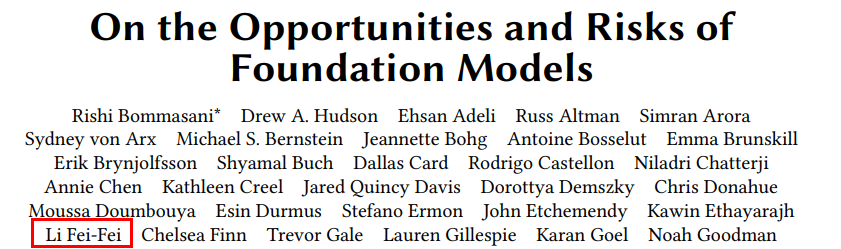
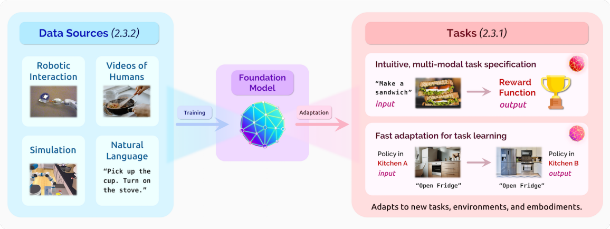

# On the Opportunities and Risks of Foundation Models

* [返回上层目录](../foundation-models.md)

paper: [On the Opportunities and Risks of Foundation Models](https://arxiv.org/pdf/2108.07258.pdf)

摘录其中机器人部分：

> 2.3 Robotics
>
> 
>
> Fig. 8. Building new types of foundation models for robotics will require massive datasets spanning diverse environments and behaviors. Simulation, robotic interaction, videos of humans, and natural language descriptions could all be useful data sources for these models. Despite the challenges of acquiring data, developing new foundation models for robotics has tremendous potential for a variety of problem formulations in task specification and robot learning. Image credits: [Finn et al. 2016b; Szot et al. 2021].
> A longstanding challenge of robotics research is to endow robots with the ability to handle the myriad conditions they will encounter in real-world settings. In this section, we discuss how the ideas underlying foundation models can potentially help bring about “generalist” robots that can, for example, cook a new meal in a new house, with a new kitchen. 

===

* [ChatGPT 有多高的技术壁垒？国内外除了 OpenAI 还有谁可以做到类似程度？](https://www.zhihu.com/question/581806122/answer/2882441759)

2021年，有一篇论文叫做《[On the Opportunities and Risks of Foundation Models](https://arxiv.org/pdf/2108.07258.pdf)》，论文的作者列表非常长，不过有个熟悉的名字——李飞飞（Li Fei-Fei)。

在这篇论文中，他们给超大模型取了一个名字——「基础模型（foundation model）」。基础模型可以做的事情如图

* [探究基础AI模型潜在社会风险，斯坦福成立基础模型研究中心](https://baijiahao.baidu.com/s?id=1709155576182662679)

北京时间8月25日结束的美国斯坦福大学基础模型研究中心(Center for Research on Foundation Models, 简称CRFM)研讨会上，来自不同学科领域的知名研究者讨论了“基础模型”在种族/宗教歧视，社会不平等和信息安全等多种层面上可能带来的威胁以及需要研究的问题。

近几年，得益于多种AI模型的完善，人工智能开始能够对人类引以为豪的语言能力进行学习和模仿，于是根据描述进行绘画、帮程序员自动补全修改代码等等应用开始成为现实，人工智能渗透入生活的方方面面。

这些强大的人工智能模型包括BERT（Bidirectional Encoder Representations from Transformers，一个预训练的语言表征模型）,GPT-3（Generative Pre-Training，生成式预训练），CLIP（Contrastive Language–Image Pre-training，对比语言-图像预训练）, DALL-E（命名是艺术家萨尔瓦多·达利Salvador Dalí和皮克斯Pixar机器人WALL·E名称的结合）等。

这些模型往往基于不同的技术模块，但它们现在都有了一个共同的名字——“基础模型”（foundation models）。基础模型对当下社会的影响越来越深远，然而人们对其如何发生作用、产生了哪些结果实际上缺乏清晰了解。

这也造成了所谓的“黑箱”问题：机器学习中会出现无法解释、不够安全可信可靠的情形。基于以上考量，斯坦福大学在8月18日宣布成立基础模型研究中心（下简称CRFM），专职于基础模型的研究。

基础模型研究中心由不同领域的研究者组成（如哲学、社会学、计算机科学等），研究中心主任是知名人工智能研究者、斯坦福大学教授Percy Liang。CRFM隶属于斯坦福“以人为本人工智能研究院”（Human-centered AI Research，HAI），在其官网的主页上，CRFM称他们的使命是“在基础模型的研究、开发和部署上”作出贡献。