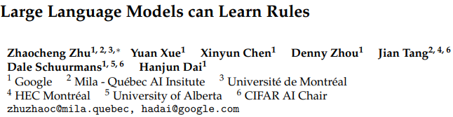

# Large Language Models can Learn Rules

* [返回上层目录](../google-deepmind.md)

paper: [*Large Language Models can Learn Rules*](https://arxiv.org/pdf/2310.07064)

github: [google-deepmind/LLMs_can_learn_rules](https://github.com/google-deepmind/LLMs_can_learn_rules)

===

[Deepmind 重磅开源：消除幻觉，让 LLMs 学会规则库和多步推理](https://mp.weixin.qq.com/s/EpdwF1DShUROOHpsRrJRyg)