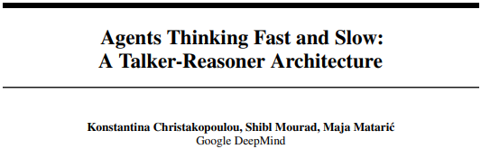

# Agents Thinking Fast and Slow: A Talker-Reasoner Architecture

* [返回上层目录](../google.md)

论文pdf：[Agents Thinking Fast and Slow: A Talker-Reasoner Architecture](https://arxiv.org/pdf/2410.08328v1)

今年10月，OpenAI高级研究科学家、德扑AI之父Noam Brown，曾在美国旧金山举办的TED AI大会上提出了一个惊人的理论——让AI模型思考20秒所带来的性能提升，相当于将模型扩大100,000倍并训练100,000倍的时间。

Noam所指的技术便是System 1/2 thinking，也是OpenAI最新模型o1正在使用的技术。

谷歌DeepMind研究人员则直接把这项技术集成到AI Agent中开发了Talker-Reasoner框架，让其具备“快”、“慢”两种拟人化思考方式。这对于解决复杂、冗长的任务来说帮助巨大，也突破了传统AI Agent执行业务流程的方法，极大提升了效率。

# 参考资料

* [谷歌发布双思维AI Agent：像人类一样思考，重大技术突破！](https://mp.weixin.qq.com/s/hJL9E8vw1neHPE04L4BrAQ)

