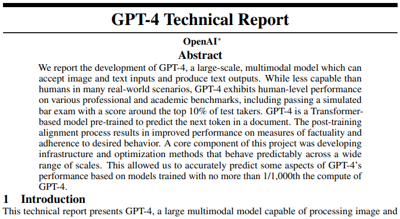

# GPT-4

* [返回上层目录](../openai.md)

GPT-4发布于2023年3月15日凌晨。

官网博客：[OpenAI/GPT-4](https://openai.com/research/gpt-4)

论文/技术报告：[GPT-4 Technical Report](https://cdn.openai.com/papers/gpt-4.pdf)

===

[OpenAI 发布 GPT-4，有哪些技术上的优化或突破？](https://www.zhihu.com/question/589639535/answer/2936661611)

GPT-4除了多模态以外，它的核心点是，相比GPT-3.5，如果只是常规的交流，那估计没太大差，但是如果说遇到非常复杂的指令，GPT-4的理解能力和创造力远超3.5。他们做了一大堆实验，来向大家展示GPT-4比GPT-3.5强太多，反正就是一通爆做奥赛和AP的题目。结果直接一图一表秀死大家：

[OpenAI 发布 GPT-4，有哪些技术上的优化或突破？张俊林](https://www.zhihu.com/question/589639535/answer/2937928726)

具身智能毫无疑问会是LLM下一阶段的重点研究方向。这方面的代表就是前阵子Google放出来的PaLM-E了。目前的GPT 4，我们可以认为人类创造出了一个超级大脑，但还是把它封锁在GPU集群里。而这个超级大脑需要一个身体，GPT 4要和物理世界发生联系、交流和互动，并在物理世界中获得真实的反馈，来学会在真实世界里生存，并根据真实世界的反馈，利用比如强化学习来学习在世界游走的能力。这个肯定是最近的将来最热门的LLM研究方向。

多模态LLM给予了GPT 4以眼睛和耳朵，而具身智能给予GPT 4身体、脚和手。GPT 4和你我发生一些联系，而依托于GPT 4本身强大的学习能力，这个事情估计很快会出现在我们身边。

如果你细想，其实还有很多其它有前途的方向。我的个人判断是：未来5到10年，将会是AGI最快速发展的黄金十年。如果我们站在未来30年的时间节点，当我们回顾这10年时，我们中一定会有人，想起下面的诗句：“懂得，但为时太晚，他们使太阳在途中悲伤， 也并不温和地走进那个良夜。”

[GPT-4震撼发布：多模态大模型，直接升级ChatGPT、必应，开放API，游戏终结了？](https://mp.weixin.qq.com/s/kA7FBZsT6SIvwIkRwFS-xw)

[新智元 GPT-4王者加冕！读图做题性能炸天，凭自己就能考上斯坦福](https://mp.weixin.qq.com/s/MN35PBHJEMRCJjyTQL5ggA)

[量子位 GPT-4发布！ChatGPT大升级！太太太太强了！](https://mp.weixin.qq.com/s/6u33Xnp4oEHq26WR4W1kdg)

[GPT-4 的实际体验如何？和之前相比有哪些明显提升？](https://www.zhihu.com/question/589641645/answer/2936696934)

从 ChatGPT Plus 发布第一天就开始重度使用，刚刚和新发布的 GPT-4 进行了 20 多轮对话，来简单介绍下这几个模型背后的技术，并且分享下感受。

GPT 在发展历程中，一共经历了 4 个阶段，分别是 1、2、3、4。这几个阶段分别进行了不同思考，就好像三体中提出的几个公理，都很有意思。

第一代模型 GPT-1，当时的论文叫做「通过生成式预训练模型，来提升对于语言本身的理解」Improving Language Understanding by Generative Pre-Training：其中的 Generative Pre-Training，便是现在 GPT 的来源。在传统机器学习中，学者们更喜欢用标注好的东西来进行机器学习。比如我心情真棒（正面情绪），括号中的就是一个标注。

在这篇论文中，OpenAI 在想，这个世界上有如此丰富的预料，但大部分都是没有被标注的数据。虽然不好用，但我们可以通过对其学习，只要学的足够多，我们就可以培养模型对于语言表达的理解能力。

第二代模型 GPT-2, OpenAI 手头拿着学会了语言模型，但的确是没什么用。他们就在思考，现在是能理解文字了，但是这什么也不能干呀，这个模型到底能做什么呢？在大量试验后，他们发现，人们以往认为机器学习中的自然语言处理，也许不一定需要划分成很多很多的子任务。

如果语言本身包含了这些信息，那么各类任务，都应该可以被统一学习。比如，传统思路中，人们认为翻译，你必须要有中英文对应，来进行学习。但实际上，互联网上充斥着这样的提问，比如：有没有小伙伴知道香水有法语怎么表达最贴切，于是就有人回复 Parfum。

这段话既包含了中文原文，又包含了网友智慧所提出的法语翻译。既然我们学了这么多语料库，那么翻译，应该是自然而然就能学会的，不需要单独进行。同理，归类、找相似性、等等工作，都应该可以被大模型统一的表达。

因此提出了第二篇论文「大语言模型，是无需监督的多任务学习者」Language Models are Unsupervised Multitask Learners。即它可以自己学会做很多很多事，不用监督瞪大眼睛看它学对没，先学再说。学会的知识，应该是具备普适性的，能够处理很多任务。

第三代模型 GPT-3，也就是大家熟悉的 ChatGPT 的前身。这个阶段，OpenAI 在冲着充分堆料，已经学会很多内容的模型陷入深深思考。既然它通过学习大量数据，掌握了人类语言，又理论上来说具备多任务的处理能力，怎么才能让它用出来呢？

传统思路中，机器学习模型需要进行针对性优化，来提升对于不同任务的表现。OpenAI 看了看已经被训练的巨大的模型，每次针对性优化，其实是不现实的，于是放弃了这条路。转而进行下一个重要思考。既然人类可以通过举例学习，语言模型应该也可以。

因此提出了第三篇论文「大语言模型，通过几个例子就能学会你要他做什么」Language Models are Few-Shot Learners。比如，如果你和一个智慧球举例，说从一数到一百，1，2，3... 它就应该能根据你的例子，去完成内容补全。甚至多学学，不用举例子也行。

这便是前三代模型的发展背景。截至目前为止，OpenAI 手头的这几个模型一个比一个大，但是最大的问题在于，它们擅长生成符合人类说话风格的胡言乱语，但是这不符合和人类和他们交流的习惯。

OpenAI 首先想到的就是服务程序员的代码，如果学会了世界上所有代码，应该能给人带来帮助。于是在此尝试下，推出了包含代码数据集的 OpenAI Codex，并且把这个包含了代码和新数据训练的模型叫做 GPT-3.5。这还是不好用，因为在人类世界中，我说上句你补充下句意义不大。

重点还是交流，交流涉及沟通，于是便训练了基于 GPT-3.5 的对话模型 InstructGPT。这个模型中用到了很多人工反馈，对问答方式和表述方式进行更符合人性的指导。而我们现在最熟悉，最出圈的 ChatGPT，就是 InstructGPT 的一个更适合大众的姊妹模型变种。

在我的工作中，ChatGPT 已经成为不可或缺的一部分，它带来的生产效率提升可以轻松达到 20 倍以上。从我个人角度出发，觉得这项技术，会深刻改变人类学习、教育、做事的方式。新的教育体系，若思维固步自封，同时学生不尽快掌握 ChatGPT，那么从起点上就会落后非常多。

就像互联网时代前和后，新能源汽车时代前和后，时代已经被刻骨，全面，深刻的改变了。

它不会降低知识的门槛，也就是说，如果一个人并不熟悉某个领域，指望就靠 ChatGPT 用处不大。这就好像一个小朋友问围棋之神，我如何才能变成围棋大佬一样，帮助有限。但假如你已经是个业余棋手，有了 ChatGPT 会无限拉进你与世界上顶尖棋手的距离。

即便已经强如 ChatGPT，还是存在一些问题。比如，在复杂语句的推理能力，其实 ChatGPT 还有成长空间。比如倘若你的描述充满非常复杂的逻辑关系，那么 ChatGPT 有可能会遗漏其中的部分要求。这个问题，在我今晚测试的 GPT-4 中，就完全解决啦。

[OpenAI 发布 GPT-4，有哪些技术上的优化或突破？](https://www.zhihu.com/question/589639535/answer/2936639668)

据下面那条 Predictable Scaling 曲线，最右边那个灰色的点应该就是 GPT-3 了，训练 GPT-4 的计算量比 GPT-3 要多 10000 倍。根据 scaling law 是要优先扩增参数达到最佳计算效率的，猜测 GPT-4 参数量至少在 GPT-3 的 100 倍以上，也就是 GPT-4 的参数规模在十万亿，10 T 以上。

技术报告中有一大堆性能展示，就不一一介绍了。这里放一个印象比较深刻的，GPT-4 解物理题，你可能觉得这事 ChatGPT 也能做，但是注意，这道题的输入不是文字，全是图片，这意味着 GPT-4 已经把视觉感知（OCR等）到语义理解到逻辑推理全打通了。。

