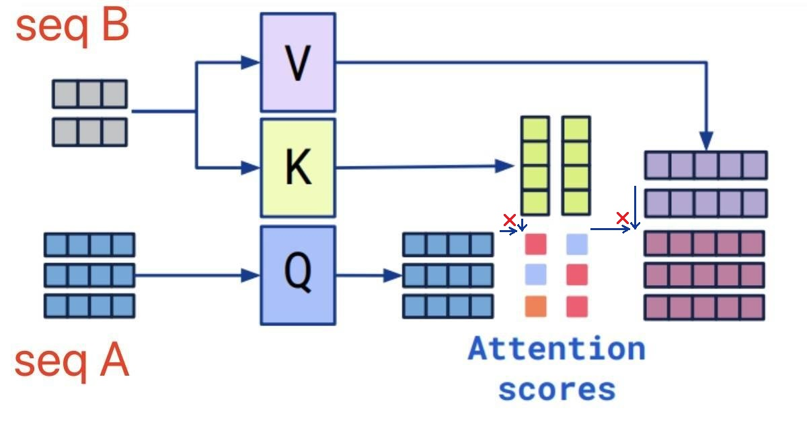
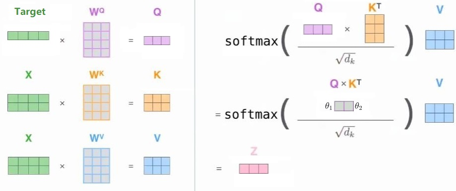
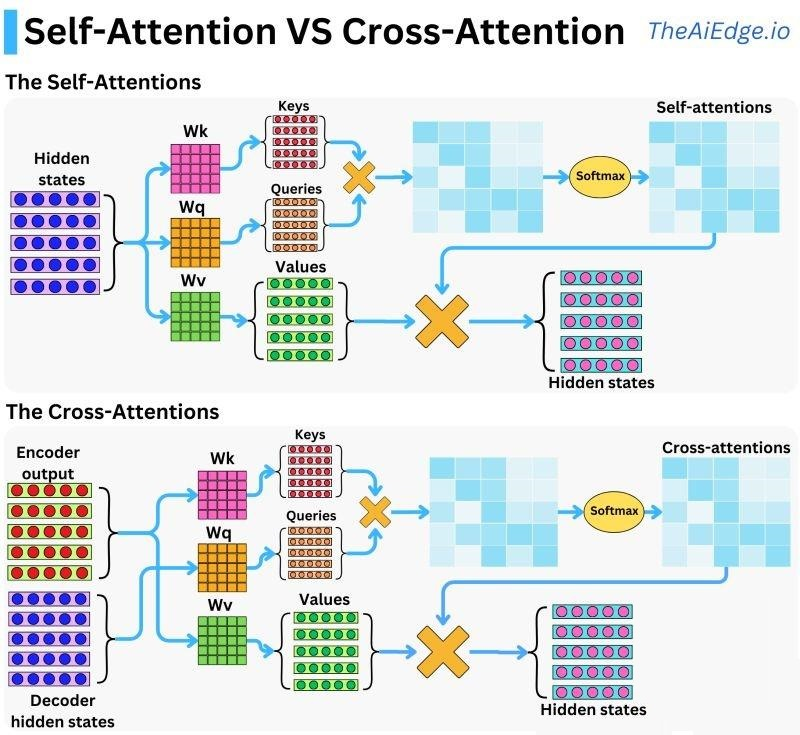

# Cross Attention机制

* [返回上层目录](../attention-mechanism.md)
* [Cross-Attention介绍](#Cross-Attention介绍)
* [Self-Attention和Cross-Attention的区别](#Self-Attention和Cross-Attention的区别)
  * [定性描述](#定性描述)
  * [定量分析](#定量分析)
* [代码实现](#代码实现)
* [Cross-Attention与多模态模型架构](#Cross-Attention与多模态模型架构)


# Cross-Attention介绍

Cross Attention：

- 一种在Transformer架构中的attention机制，可以将两种不同embedding序列进行混合
- 这两个序列必须具有相同的维度
- 这两个序列可以是不同的模态（例如文本、图像、声音）
- 其中一个序列作为Query输入，定义了输出长度。另一个序列则产生Key和Value输入，用于attention计算

交叉注意力机制使得模型能够关注来自两个序列的相关信息，这在图像字幕或多模式机器翻译等任务中非常有用。

CrossAttention与SelfAttention主要的不同之处在于QKV，其它计算方式是相同的。



在多模态结构中，我们可能有两个(或多个)Embeddings序列$S_1$和$S_2$。我们将$S_1$作为attention的K,V，将$S_2$作为attention的Q。使用Q与K计算注意力权重矩阵，并与V相乘，得到：
$$
softmax(\frac{(W_QS_2)(W_KS_1)}{\sqrt{d}})W_VS_1
$$
此外，我们最终得到的输出必须与序列$S_2$有着相同的维度。

Cross Attention的实际应用：

* **在Transformer中**，Decoder部分的输入为上图中的seq A，即Q是Decoder部分已经预测出来的词向量，而K和V是Encoder部分输出的经过了Self Attention的词向量。
* **Target Attention是Cross Attention的一个特例**，当上图的seq A只有一个词向量，即Q矩阵的seq_len为1时，Cross Attention退化为Target Attention。所以没必要再额外介绍Target  Attention了。



# Self-Attention和Cross-Attention的区别

## 定性描述

**Self Attention（自注意力）**和**Cross Attention（交叉注意力）**是在注意力机制中常见的两种类型，它们有以下主要区别：

（1）关注对象

- Self Attention关注的是输入序列自身内部元素之间的关系。
- Cross Attention则是关注**两个不同输入序列之间元素的关系**。

（2）计算方式

- 在Self Attention中，查询（Query）、键（Key）和值（Value）都来自同一个输入序列。
- 而在Cross Attention中，Q来自一个序列（解码器输出），K和V来自另一个序列（编码器输出）。

（3）应用场景

- Transfermor：Self Attention常用于对单个序列进行特征提取和建模，例如在自然语言处理中的Transformer 模型中用于对文本进行编码。

  > Cross Attention，也称为编码器-解码器注意力，是Transformer架构中的一个关键组件，特别用于在解码器中整合来自编码器的信息。这种机制允许解码器在生成每个输出时，利用整个输入序列的上下文信息，从而增强翻译或文本生成的准确性和相关性。以下是对Cross Attention机制的详细解释：
  >
  > **（1）工作原理**
  >
  > 在Transformer模型中，Cross-attention通常位于解码器的每个层中，紧随Masked Self-Attention层之后。该机制的核心目的是允许解码器的每个位置访问整个编码器输出的信息，以确定当前生成步骤最相关的输入信息。
  >
  > a. 输入向量
  >
  > * Query（Q）：来自于解码器的前一层或前一步的输出。Query代表了当前解码器在生成序列中所关注的点。
  >
  > * Key（K）和 Value（V）：这两种向量来自于编码器的最终输出层。Key帮助解码器确定输入序列中哪些部分是与当前生成的Query最相关的，而Value提供了这些部分的具体内容。
  >
  > b. 注意力得分计算
  >
  > * Cross-attention层通过计算Query与所有Key的点积来评估输入序列中每个元素与当前解码位置的相关性。
  >
  > * 得分随后通过Softmax函数标准化，转换为概率分布，表明各个输入元素对于当前解码步骤的重要性。
  >
  > c. 输出向量
  >
  > * 输出是通过将Softmax输出的权重概率应用于Value向量，通过加权求和的方式生成的。这个加权和表示了编码器输出的加权组合，用于当前解码步骤。
  >
  > **（2）重要性和优势**
  >
  > Cross-attention在保证解码器可以充分理解并利用整个输入信息方面发挥了关键作用。特别在复杂的语言处理任务中，如机器翻译和文本摘要，这种能力尤为重要，因为输出的准确性和相关性直接依赖于对输入序列全局上下文的理解。
  >
  > **（3）应用场景**
  >
  > * 机器翻译：Cross Attention使解码器能够在翻译每个词时考虑到整个输入句子的语境，从而生成更自然、语义上更连贯的翻译结果。
  >
  > * 文本摘要：在生成摘要时，Cross Attention帮助解码器聚焦于输入文本的关键部分，确保生成的摘要准确反映原文的主要信息。
  >
  > * 问答系统：在自动问答系统中，Cross Attention能够帮助解码器更准确地从提供的资料中找到问题的答案。

- 文生图模型：Cross Attention则常用于涉及两个不同但相关的序列之间的交互和信息融合，比如在图像和文本的多模态任务中，将图像特征和文本特征进行交互。

  > 在文生图模型（如Stable Diffusion）的交叉注意力机制中，**查询向量（Q）通常来自图像生成的中间特征（即解码器部分的图像embedding），而键向量（K）和值向量（V）则来自文本编码器输出的文字embedding**。这一设计是模型实现文本条件控制的核心机制，具体逻辑如下：
  >
  > **（1）交叉注意力层的角色**
  >
  > 交叉注意力（Cross-Attention）在文生图模型中负责将文本语义与图像生成过程动态对齐。其核心逻辑是：
  >
  > - **Q（查询）**：由当前图像生成阶段的潜在特征（即解码器的中间输出）生成，代表模型需要关注的图像局部区域或语义。
  > - K（键）与V（值）：由文本编码器（如CLIP）生成的文本嵌入（Text Embedding）经过线性变换得到，提供文本描述的全局语义信息。
  >
  > 这种设计使模型能够在生成图像的不同步骤中，根据当前图像状态（Q）主动“查询”文本条件（K/V）中相关的语义信息，从而动态调整生成方向。
  >
  > **（2）具体实现细节**
  >
  > 以Stable Diffusion为例：
  >
  > 1. **文本编码**：输入提示词（如“戴帽子的猫”）通过CLIP文本编码器转换为高维文本嵌入。
  > 2. **图像潜在空间**：扩散模型的U-Net在去噪过程中，每一步生成的潜在图像特征会被提取为Q。
  > 3. 注意力计算：
  >    - **Q的生成**：U-Net解码器的中间特征图通过线性层投影为Q向量。
  >    - **K/V的生成**：文本嵌入通过独立的线性层分别转换为K和V向量。
  > 4. 特征融合：通过注意力权重（Q与K的相似度），对V进行加权求和，生成融合文本条件的图像特征，指导下一步去噪。
  >
  > 这一过程在U-Net的多个层级重复进行，确保文本条件在不同空间尺度上精细化控制图像生成。
  >
  > **（3）技术优势**
  >
  > - 精准对齐：Q来自图像特征，使模型能够根据当前生成状态主动“聚焦”文本中的关键描述（如“帽子”的位置或形状）。
  > - 高效计算：文本作为K/V仅需编码一次，而Q随去噪步骤动态更新，平衡了计算效率与生成质量。
  > - 多模态交互：文本语义通过K/V“注入”图像生成过程，而非简单拼接，避免了模态冲突。
  >
  > **总结**：**解码器的Q是图像生成过程中的动态特征，而K/V固定为文本编码器的输出**。这种架构通过交叉注意力实现了文本对图像生成的细粒度控制，是多模态生成任务的核心创新之一

举例来Self-Attention和Cross-Attention的区别：

- 假设我们要处理一个句子“今天天气很好”。在Self Attention中，会计算“今天”与“天气”、“很好”等词之间的注意力权重。
- 而在一个图像描述生成任务中，图像特征作为一个序列，描述文本作为另一个序列，使用Cross Attention来建立图像特征和文本之间的关系，例如根据图像特征来确定文本中应该重点关注哪些词汇。

总之，Self Attention着重于单个序列内部的关系挖掘，Cross Attention则更侧重于不同序列之间的信息交互。

## 定量分析

Cross Attention的输入为多模态。

举例：根据图像生成文本，希望图像中每个patch的特征融合文本的特征。输出新的图像的每个patch特征。

**Q根据图像产生**，K和V由句子产生，

Q和K相乘得到的注意力值获得图像特征对句子中每个token的关注度。然后将V中的特征按照关注的权重加载一起，代表融合句子特征的图像patch特征。

自注意力和交叉注意力的不同如下图所示：



# 代码实现

Transformer中，CrossAttention实际上是指编码器和解码器之间的交叉注意力层。在这一层中，解码器会对编码器的输出进行注意力调整，以获得与当前解码位置相关的编码器信息。在Transformer的编码器-解码器架构中，编码器负责将输入序列编码为一系列特征向量，而解码器则根据这些特征向量逐步生成输出序列。为了使解码器能够对当前生成位置的上下文进行有效的建模，CrossAttention层被引入其中。

CrossAttention的计算过程：

* 编码器输入（通常是来自编码器的输出）：它们通常被表示为enc_inputs，大小为(batch_size, seq_len_enc, hidden_dim)。
* 解码器的输入（已生成的部分序列）：它们通常被表示为dec_inputs，大小为(batch_size, seq_len_dec, hidden_dim)。
* 解码器的每个位置会生成一个查询向量（query），用来在编码器的所有位置进行注意力权重计算。
  编码器的所有位置会生成一组键向量（keys）和值向量（values）。
* 使用查询向量（query）和键向量（keys）进行点积操作，并通过softmax函数获得注意力权重。
* 注意力权重与值向量相乘，并对结果进行求和，得到编码器调整的输出。


为了方便理解，此代码只是定义了一个简单的带有线性映射的注意力模型，并没有完整地实现Transformer中的CrossAttention层。如果您想实现Transformer的CrossAttention层，请参考Transformer的详细实现代码或使用现有的Transformer库（如torch.nn.Transformer）来构建模型。

```python
import torch
import torch.nn as nn
import torch.nn.functional as F


class MultiHeadCrossAttention(nn.Module):
    def __init__(self, embed_size, num_heads):
        super(MultiHeadCrossAttention, self).__init__()
        self.embed_size = embed_size
        self.num_heads = num_heads
        self.head_dim = embed_size // num_heads

        assert self.head_dim * num_heads == embed_size, "Embedding size must be divisible by number of heads"

        # 为 Q, K, V 定义线性变换
        self.query = nn.Linear(embed_size, embed_size)  # 用于目标
        self.key = nn.Linear(embed_size, embed_size)    # 用于输入序列
        self.value = nn.Linear(embed_size, embed_size)  # 用于输入序列

        # 输出投影层
        self.fc_out = nn.Linear(embed_size, embed_size)

    def forward(self, x, target, mask):
        """
        x: 输入序列 (batch_size, seq_len, embed_size)
        target: 目标特征 (batch_size, target_seq_len embed_size)
        """
        batch_size, seq_len, _ = x.shape
        _, target_seq_len, _ = target.shape

        # 计算 Q, K, V
        Q = self.query(target)               # (batch_size, target_seq_len, embed_size)
        K = self.key(x)                      # (batch_size, seq_len, embed_size)
        V = self.value(x)                    # (batch_size, seq_len, embed_size)

        # 拆分多个头
        # Q = Q.view(batch_size, 1, self.num_heads, self.head_dim).permute(0, 2, 1, 3)  # (batch_size, num_heads, 1, head_dim)
        Q = Q.view(batch_size, target_seq_len, self.num_heads, self.head_dim).permute(0, 2, 1, 3)  # (batch_size, num_heads, target_seq_len, head_dim)
        K = K.view(batch_size, seq_len, self.num_heads, self.head_dim).permute(0, 2, 1, 3)  # (batch_size, num_heads, seq_len, head_dim)
        V = V.view(batch_size, seq_len, self.num_heads, self.head_dim).permute(0, 2, 1, 3)  # (batch_size, num_heads, seq_len, head_dim)

        # 计算注意力权重
        scores = torch.matmul(Q, K.transpose(-2, -1)) / (self.head_dim ** 0.5)  # (batch_size, num_heads, 1, seq_len)

        attention_weights = F.softmax(scores, dim=-1)  # (batch_size, num_heads, 1, seq_len)

        # 应用注意力权重
        output = torch.matmul(attention_weights, V)  # (batch_size, num_heads, 1, head_dim)

        # 重新排列
        output = output.permute(0, 2, 1, 3).contiguous().view(batch_size, target_seq_len, self.num_heads * self.head_dim)  # (batch_size, target_seq_len, embed_size)

        # 通过线性层映射回原始维度
        output = self.fc_out(output).squeeze(1)  # (batch_size, embed_size)

        return output, attention_weights


# 示例用法
if __name__ == "__main__":
    batch_size = 2
    seq_len = 2
    embed_size = 4
    num_heads = 2

    # 随机生成输入序列
    x = torch.rand(batch_size, seq_len, embed_size)
    # 目标特征
    target = torch.rand(batch_size, embed_size)

    x_data = torch.tensor(
        [[[ 0.1000,  0.2000,  0.3000,  0.4000],
          [ 0.0000,  0.0000,  0.0000,  0.0000]],

         [[ 0.0000,  0.0000,  0.0000,  0.0000],
          [ 0.0000,  0.0000,  0.0000,  0.0000]]])
    x.data = x_data
    target_data = torch.tensor(
        [[[ 1.0000,  1.0000,  1.0000,  1.0000],
          [ 1.0000,  1.0000,  1.0000, 1.0000],
          [ 1.0000,  1.0000,  1.0000,  1.0000]],

         [[ 0.0000,  0.0000,  0.0000,  0.0000],
          [ 0.0000,  0.0000,  0.0000,  0.0000],
          [ 0.0000,  0.0000,  0.0000,  0.0000]]])
    # target_data = torch.tensor(
    #     [[[ 1.0000,  1.0000,  1.0000,  1.0000]],
    #
    #      [[ 0.0000,  0.0000,  0.0000,  0.0000]]])
    target.data = target_data
    print(f"{x=}")
    print(f"{target=}")

    # 初始化 target attention 层
    target_attention_layer = MultiHeadCrossAttention(embed_size, num_heads)

    # 前向传播
    output, attention_weights = target_attention_layer(x, target)

    print("Output:", output)
    print("Attention Weights:", attention_weights)
```

# Cross-Attention与多模态模型架构

交叉注意力（Cross Attention）与多模态模型架构密切相关，它是实现不同模态间信息交互的核心技术之一。以下从机制、应用场景、模型实例和优势四个维度展开说明：

## 交叉注意力与多模态模型的关联性

1. **定义与目标**
   交叉注意力是一种让不同模态（如文本、图像、音频）的特征动态交互的机制。在多模态模型中，其核心目标是：
   - **对齐**：建立跨模态语义对应（如“苹果”这个词与苹果图片的关联）。
   - **融合**：提取跨模态的联合表示，用于下游任务（如视觉问答、图文生成）。
2. **典型架构位置**
   - **编码器-编码器交互**：如CLIP中文本和图像编码器通过对比学习隐式对齐。
   - **编码器-解码器交互**：如文生图模型（Stable Diffusion）中文本编码器输出指导图像解码器生成。
   - **混合交互层**：如Flamingo中交叉注意力层交替处理文本和视觉特征。

## 多模态模型中的交叉注意力应用场景

1. **图文检索与对齐**

- **模型示例**：CLIP、ALIGN
- **机制**：通过文本编码器（输出K/V）和图像编码器（输出Q）的交叉注意力计算相似度，实现图文匹配。

2. **多模态生成任务**

- **模型示例**：Stable Diffusion、DALL·E 3
- **机制**：文本嵌入作为K/V，图像潜在特征作为Q，动态控制生成内容（如根据“沙滩上的马”生成对应图像）。

3. **视觉问答（VQA）**

- **模型示例**：ViLBERT、LXMERT
- **机制**：问题文本作为Q，图像区域特征作为K/V，定位与问题相关的视觉信息。

4. **视频-文本理解**

- **模型示例**：Flamingo、VideoBERT
- **机制**：视频帧特征作为K/V，文本或时序信号作为Q，理解视频中的事件因果。

## 交叉注意力在多模态模型中的技术优势

1. **动态权重分配**
   - 通过Q/K相似度计算注意力权重，自动聚焦跨模态的关键信息（如生成图像时关注文本中的核心物体）。
2. **解耦模态处理**
   - 允许不同模态使用独立的编码器（如文本用Transformer、图像用CNN），再通过交叉注意力融合，提升灵活性。
3. **计算效率**
   - 相比全连接融合，交叉注意力仅需计算模态间的局部相关性（稀疏交互），降低计算量。
4. **可解释性**
   - 注意力权重可视化可解释模型决策（如VQA中模型关注图片的哪一区域回答问题）。

## 典型模型案例分析

1. **Stable Diffusion（文生图）**

- **交叉注意力层位置**：U-Net解码器的每个残差块中。
- 流程：
  1. 文本编码器输出 → 投影为K/V。
  2. 图像潜在特征 → 投影为Q。
  3. 计算Q与K的相似度，加权聚合V，生成条件化的图像特征。

2. **Flamingo（多模态对话）**

- 交叉注意力设计：
  - 交替堆叠自注意力（处理文本）和交叉注意力（融合视觉特征）。
  - 视觉特征作为K/V，文本作为Q，支持多轮对话中的视觉上下文理解。

3. **CLIP（图文对比学习）**

- **隐式交叉注意力**：通过对比损失迫使文本和图像编码器的输出在共享空间中对齐，相当于全局的跨模态注意力。

## 与自注意力（Self-Attention）的对比

|   **特性**   |  **自注意力（Self-Attention）**   | **交叉注意力（Cross-Attention）** |
| :----------: | :-------------------------------: | :-------------------------------: |
| **输入来源** |   同一模态（如纯文本或纯图像）    |   不同模态（如文本Q + 图像K/V）   |
|   **目标**   |   捕捉单模态内部的长程依赖关系    |  建立跨模态的语义关联与信息融合   |
| **典型应用** | BERT中的文本编码、ViT中的图像分类 |   文生图、视觉问答、多模态检索    |

## 总结

交叉注意力是多模态模型架构的**核心组件**，其价值体现在：

1. **跨模态对齐**：突破单模态信息孤岛，实现语义级关联。
2. **灵活适配**：可插入不同模型架构（编码器-编码器、编码器-解码器）。
3. **任务通用性**：覆盖生成、检索、推理等多种多模态任务。

未来，随着多模态大模型（如GPT-4V、Gemini）的发展，交叉注意力将进一步结合稀疏化、层次化设计，提升对复杂跨模态任务（如开放世界推理）的处理能力。

# 参考资料

* [Cross Attention 知乎 by 复读机](https://zhuanlan.zhihu.com/p/701936847)

介绍部分主要参考此知乎博客。

* [self attention 和cross attention有啥区别](https://zhuanlan.zhihu.com/p/710832437)
* [深度学习：Cross-attention详解](https://blog.csdn.net/m0_73640344/article/details/143579532)

区别定性部分主要参考此知乎博客。

* [交叉注意力机制cross attention 知乎 by 德基先生](https://zhuanlan.zhihu.com/p/24505373323)

区别定量部分主要参考此知乎博客。

* [交叉注意力机制CrossAttention CSDN](https://blog.csdn.net/m0_63097763/article/details/132293568)

代码实现部分参考此博客。

