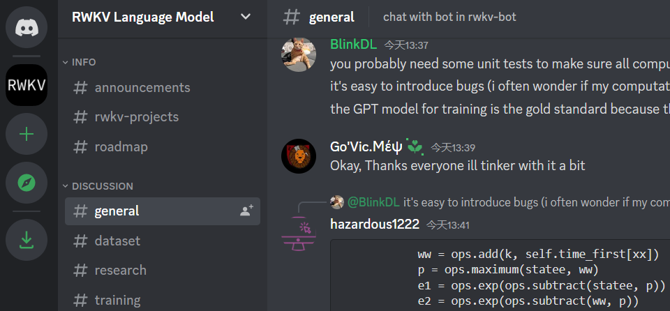

# ChatRWKV

* [返回上层目录](../blinkdl.md)

ChatRWKV 对标ChatGPT的开源项目

创始人知乎主页：[PENG Bo](https://www.zhihu.com/people/bopengbopeng)

[知乎：参与 ChatRWKV 项目，做开源 ChatGPT（可以在每个人电脑和手机直接运行的）](https://zhuanlan.zhihu.com/p/603840957)

ChatRWKV训练代码：[https://github.com/BlinkDL/RWKV-LM](https://github.com/BlinkDL/RWKV-LM)

ChatRWKV Discord交流: [RWKV Language Model](https://discord.com/invite/bDSBUMeFpc)

> Discord，聊天软件，是一家游戏聊天应用与社区，Discord从游戏语音、IM工具服务起家，随后转向直播平台，进而开设游戏商店的社区平台，成为游戏玩家在游戏中沟通协作的首选工具。

为实现这一目标，只需四个方面，现均有基础，欢迎大家来建设生态：

1. **算力。**我平时用上百张A100训练，有需要可以用上千张。其实如果有经验，一个人就可以炼100B模型。训练代码：[GitHub - BlinkDL/RWKV-LM](https://github.com/BlinkDL/RWKV-LM)

2. **数据。**有国外国内多个团队收集整理数据，包括收集RLHF数据。

3. **模型。**ChatRWKV采用我设计的RWKV架构（魔改RNN，是迄今唯一看齐transformer性能的纯RNN，梯度可以无限走，也能并行化，拥有RNN和transformer的所有优点），效率高于GPT（运行快，省显存，适合在端侧离线运行），不仅适用于语言模型，也有潜力成为未来AI模型的基础。现已scale到14B验证，等大语料发布后再逐步scale到100B+【补充为何RWKV这样强：RWKV几乎不碰信息channel，它们就只是exponential decay而已，没有更多的非线性。其它RNN在上面的非线性太多，容易破坏信息】。

4. **开发者和生态。**ChatRWKV项目发布3个星期在Github已有1.8k stars，有多位开发者建设，且OpenAI和Huggingface等等都在密切关注ChatRWKV（他们给我发过邮件）。

RNN-based 没有attention之类机制的模型是怎么获得long memory的能力的啊？

> 这个形式就是[Transformers are RNNs](http://link.zhihu.com/?target=https%3A//arxiv.org/abs/2006.16236)的形式，只不过把Q换成了positional invariant的time weighting。 最近很多work都显示Attention里的Q其实没啥用，换成一个跟着相对位置exponential decay的term就行了, e.g. [Toeplitz Neural Network for Sequence Modeling](http://link.zhihu.com/?target=https%3A//openreview.net/forum%3Fid%3DIxmWsm4xrua)
>
> slow decaying units

模型大小现在能压到多少？ 能到5GB以内吗

> 已经有人做了简单的8bit量化版，其实认真做到3bit或4bit是没问题的。

请问pytorch版本不同是不是效果也不一样？还是说模型影响更大些。感觉3B模型效果很差，7B模型勉强能用，14B没敢跑……

> 肯定模型影响大啊，大力出奇迹

建议套皮个webui，这样子普通人也能玩。

> 套个webui，很多玩sd的小白也会跟风跑过来玩了。
> 论开源分布式训练的ai，我还是佩服当年里拉zero的。
>
> 欢迎大家来做傻瓜包，其实 chatRWKV 已经很容易用了，直接用最新torch就能跑。
>
> 确实，套皮webui是很好的选择