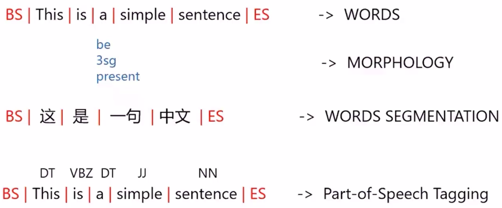
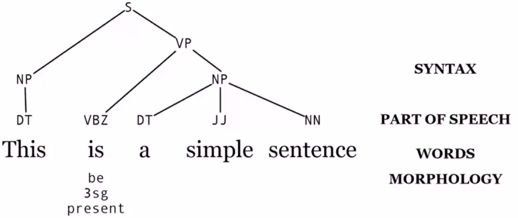
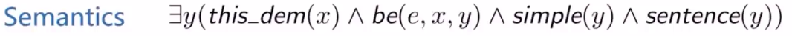
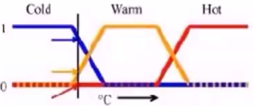
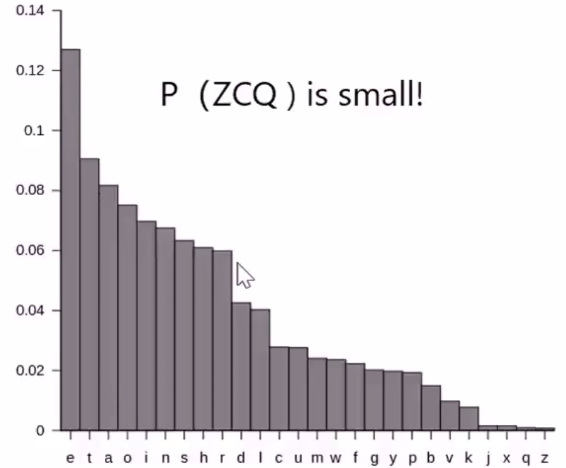
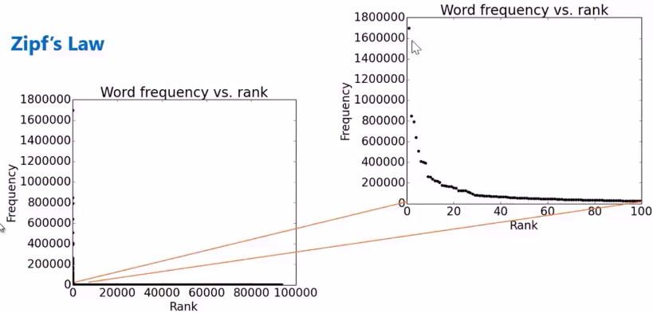
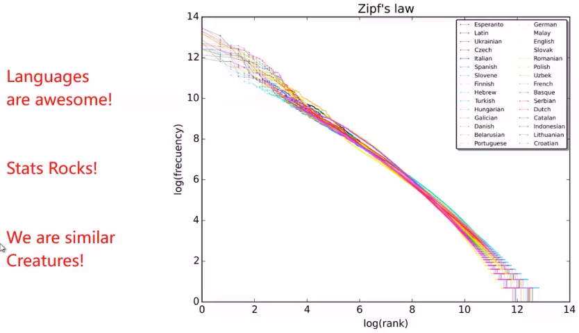

# 自然语言处理概论

* [返回上层目录](../natural-language-processing.md)
* [什么是自然语言处理](#什么是自然语言处理)
* [自然语言处理的核心技术与应用](#自然语言处理的核心技术与应用)
* [自然语言的一些重要术语](#自然语言的一些重要术语)
* [语言学的发展史](#语言学的发展史)
  * [逻辑](#逻辑)
  * [命题逻辑](#命题逻辑)
  * [通用能力](#通用能力)
  * [典型代表](#典型代表)
  * [模糊逻辑](#模糊逻辑)
  * [词的不确定性](#词的不确定性)
  * [稀疏数据](#稀疏数据)
  * [同意不同形](#同意不同形)
* [NLP的发展](#NLP的发展)
* [推荐书籍](#推荐书籍)

# 什么是自然语言处理

为了和计算机语言（如C语言，Python语言）区别，我们对于人类的语言称之为自然语言。

自然语言处理是AI最重要的一个分支。目前自然语言处理主要依赖于机器学习技术。

# 自然语言处理的核心技术与应用

自然语言处理的核心技术：

* 语言建模
* 文本切分
* 词性标注
* 句法解析
* 名字识别
* 词意区分
* 语义角色标注

自然语言处理应用：

* 垃圾分类
* 机器翻译
* 信息检索
* 问答系统
* 对话系统
* 信息抽取
* 段落总结
* 情感分析
* 实体（地点人名时间）识别

# 自然语言的一些重要术语

句法分析和语义：

语义：

用逻辑来表示语义

# 语言学的发展史

## 逻辑

著名的三段论：

>1、所有人都会死
>
>2、苏格拉底是人
>
>3、所以苏格拉底会死

莱布尼兹的定律

>1、a=a
>
>2、a=b, and b=c, then a=c
>
>3、a=not(not a)
>
>4、a is b equals not-b not-a 

语言的推理都是基于符号的系统的，这也是早期人工智能的基础。

是否可以把所有数学建立于简单的逻辑之上？

18世纪希望用集合论作为基础来描述数学。但是根据罗素悖论不行。

罗素悖论：村里的理发师宣称：我只给村里不给自己理发的人理发。这句话是有问题的，对于理发师自己，他如果给自己理发，那他就违反了他说的话，如果他不给自己理发，那他就应该给自己理发，但是这样他又给自己理发了，但是也违反了他说的话。

罗素悖论描述的是。自己索引自己是集合论里边的重大缺点。

维特斯坦：语言只是语言游戏，语言是大脑中某个模型的表述。语言会刺激大脑中图形的出现，我们使用语言时，只是在交换这些图形。我看见了一个图形，我告诉你后，你的大脑中应当也会出现一个图形。

## 命题逻辑

Chomsky在1950s年代写了一本书叫《句法结构》（Syntactic Structures），第一次以数学的方式理解语言。他认为人类之所以能理解语言，是大脑有对应的不同语言结构。比如像猩猩就不能理解人类语言，所以我们必须要把人类的语言结构再造出来才能人工智能来理解人类语言。

但目前我们并没有这样做，只是讲复杂的人类任务映射成函数关系，通过找概率最大的结果来逼近。

## 通用能力

人类学习了简单的句子之后，就可以再造出来自己的句子，这就是说人类有一个通用的语言结构。

## 典型代表

看见这句话：我今天看见树上有一只鸟。脑子中就会想到一只小鸟，而不是鸵鸟，企鹅。这就是集合的典型代表，类似的，我们会取集合中的平均值来代表这个集合。

## 模糊逻辑

冷热，好坏，多少等这些形容词可以用模糊逻辑去衡量。

## 词的不确定性

词的不确定性有很多层次：

* 词意：苹果（电脑，手机还是水果？）
* 词性标注：host（主人、主持）
* 句法结构：I saw a man with a telescope(who has the telescope?)
* 指用：Join dropped the goblet onto the glass table and it broke.(which broke?奖杯还是玻璃桌子)

于是处理方法从逻辑上的真理变成了概率模型。

## 稀疏数据

有用的数据并没有那么多。

比如单词以E开头的最多：

## 同意不同形

* 这个老师上课非常好，得到了同学们的肯定
* 给这个老师的课点赞，疯狂打call
* 好课，6666666666

She gave the book to Tom vs. She gave Tom the book

Some kids popped by vs. A few children visited

Is that window still open? vs. Please close the window

# NLP的发展

我们抽取了三篇论文讲述词向量的发展，一脉相承，从经典到前沿。

**经典篇：《Efficient Estimation of Word Representations in Vector Space》** 

word2vec是将词汇向量化，这样我们就可以进行定量的分析，分析词与词之间的关系，这是one-hot encoding做不到的。Google的Tomas Mikolov 在2013年发表的这篇论文给自然语言处理领域带来了新的巨大变革，提出的两个模型CBOW (Continuous Bag-of-Words Model)和Skip-gram (Continuous Skip-gram Model)，创造性的用预测的方式解决自然语言处理的问题，而不是传统的词频的方法。**奠定了后续NLP处理的基石**。并将NLP的研究热度推升到了一个新的高度。 

**经典篇：《Neural Machine Translation by Jointly Learning to Align and Translate》**     

Attention机制最初由图像处理领域提出，后来被引入到NLP领域用于解决机器翻译的问题，使得机器翻译的效果得到了显著的提升。attention是近几年NLP领域最重要的亮点之一，后续的Transformer和Bert都是基于attention机制。

**经典篇：《Transformer: attention is all you need》** 

这是谷歌与多伦多大学等高校合作发表的论文，提出了一种新的网络框架Transformer，是一种新的编码解码器，与LSTM地位相当。

Transformer是完全基于注意力机制（attention mechanism)的网络框架，使得机器翻译的效果进一步提升，为Bert的提出奠定了基础。该论文2017年发表后引用已经达到1280，GitHub上面第三方复现的star2300余次。可以说是**近年NLP界最有影响力的工作，NLP研究人员必看！**

# 推荐书籍

这两本书是自然语言处理中比较重要的两本教科书。

* *Foundations of Statistical Natural Language Processing* by Christopher D. Manning and Hinricn Schutze
* *Speech and Language Processing* by Daniel Jurafsky & James H. Martin

# 参考资料

* [01第一课：自然语言与数学之美 秦曾昌 小象学院](http://www.chinahadoop.cn/course/1344/learn#lesson/34213)

本文来自改视频课程。

