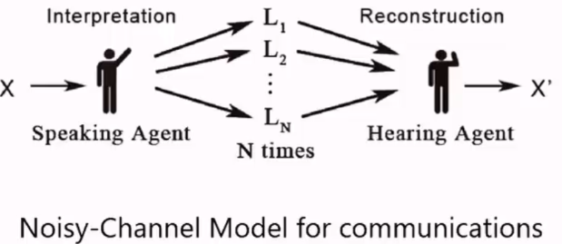
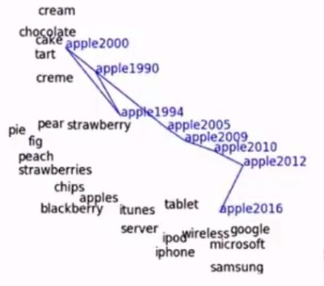
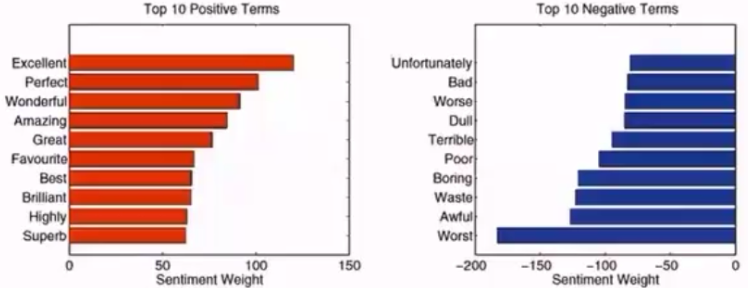

# 自然语言

* [返回上层目录](../natural-language-processing.md)

# 语言的进化

语言不是静态的，而是持续变化的。比如吃鸡，这个词在现在有一种游戏的含义了。所以计算机对语义的建模是一个难点。

## 来自自然选择的社会协作

自然界进化倾向于合作，并不完全是竞争的关系。在达尔文的基础上。提出了另外一个进化的标识：合作。

语言和语音是怎么挂钩的呢？原始社会最开始的时候，渐渐地会把某个音对应于某个物体，这样就形成了基本的语言。

## 语言游戏与摩斯密码

语言对应着大脑中的一幅图像。语言的交流就是图像的传输。

语言存在的唯一意义就是交流。

# 语言与智能

## 信息熵

熵是对信息量衡量的函数。

事件x的信息量H(x)需要满足

* 信息量必须大于等于0
  $
  H(x)\geq 0
  $

* 信息量H(x)和概率P(x)之间的关系是相反的关系
  $
  P(x)\uparrow,\ H(x)\downarrow
  $

* 如果有两件事H(x1)和H(x2)，这两件事的信息量应该是两者的加和。
  $
  H(x_1,x_2)=H(x_1)+H(x_2)
  $

则信息量的定义为：
$$
H(x)=\text{log}\ \frac{1}{P(x)}=-\text{log}\ P(x)
$$
信息熵的定义就是信息量的期望：
$$
\begin{aligned}
E_X[H(x)]&=-\sum_xP(x)\text{log}\ P(x)\\
&=-\int_{x}P(x)\text{log}\ P(x)dx
\end{aligned}
$$

## 交叉熵（KL散度）

交叉熵的定义：
$$
H(P,Q)=-\sum_xP(x)\text{log}\ Q(x)
$$
首先我们定义下KL散度，即Kullback-Leiblev Divergence，描述的是两个分布之间的差别和距离。

对于分布p和q，之间的差别（肯定是正数）是
$$
\begin{aligned}
\text{KL}(P||Q)&=E_Q\left[-\text{log}\frac{P(x)}{Q(x)}\right]\\
&\geqslant-\text{log}\ E_Q\left[\frac{P(x)}{Q(x)}\right](\text{Jensen不等式})\\
&=-\text{log}\left[\int Q(x)\frac{P(x)}{Q(x)}dx\right]\\
&=-\text{log}\int P(x)dx\\
&=-\text{log}\ 1\\
&=0
\end{aligned}
$$
但是KL散度有个特别不好的特点就是：
$$
\text{KL}(P||Q)\neq\text{KL}(Q||P)
$$
所以很多时候在衡量的时候，需要用到Average KL，即
$$
\text{AKL}(P||Q)=\frac{\text{KL}(P||Q)+\text{KL}(Q||P)}{2}
$$
这样就比较公平地衡量两个分布之间的区别。

交叉熵H(P, Q)和KL散度的关系为：
$$
H(P,Q)=H(P)+\text{KL}(P||Q)
$$
证明如下
$$
\begin{aligned}
H(P,Q)&=-\sum_xP(x)\text{log}\ Q(x)\\
&=-\sum_x\left[P(x)\text{log}\ Q(x)-P(x)\text{log}P(x)+P(x)\text{log}P(x)\right]\\
&=-\sum_xP(x)\text{log}P(x)+\sum_xP(x)\text{log}\frac{P(x)}{Q(x)}\\
&=H(P)+\text{KL}(P||Q)
\end{aligned}
$$
如果P和Q非常像，那KL(P, Q)就会等于0

# 语义的进化

以苹果这个单词为例，可以很明显地看到语义随时间的变化：

# 语言模型：语言概率

语言模型源于语音识别，就是讲出的这一段话的概率。

# 词袋模型

第一个语言模型：

比如这段话：

>Computer we table loves Trump phone

它的概率就是，在全部语料库中，这个句子出现的次数，除以所有六个单词组成的句子的次数，即
$$
P(x_1,x_2,...,x_n)=\frac{c(x_1,x_2,...,x_n)}{N}
$$
N是所有n个词组成的句子（N元组）出现的概率。

这就是一个非常简单的语言模型，就是通过统计次数得到的。

但是这种模型每个单词之间的关系太强了，我们假设每个字的出现概率独立，即
$$
P(I\ love\ China)=P(I)P(love)P(China)
$$
这就叫做词袋模型，即认为词和词之间是相互独立的。

但是这显然是不符合实际的，相邻的两个词之间往往是有关联的，比如I love后面出现you的概率就很大，出现txt的概率就很小。即有一个条件概率的关系。

# 二元语言模型：CR情感分析

词袋模型真的有用吗？

我们用LR模型统计出每个词的正负情感趋势，如下：
$$
P(y=1|x)=\frac{1}{1+\text{exp}(W^Tx)}
$$

# 参考资料

* [《自然语言处理算法精讲》第3章：自然语言](http://www.chinahadoop.cn/course/1344)

本节是这门课该章节的课程笔记。

