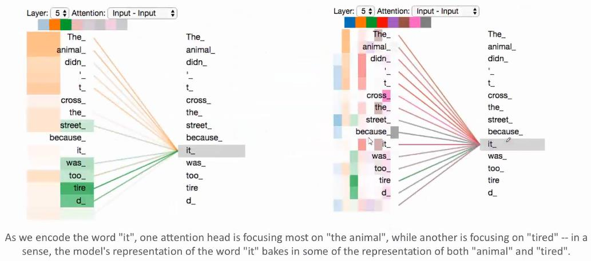
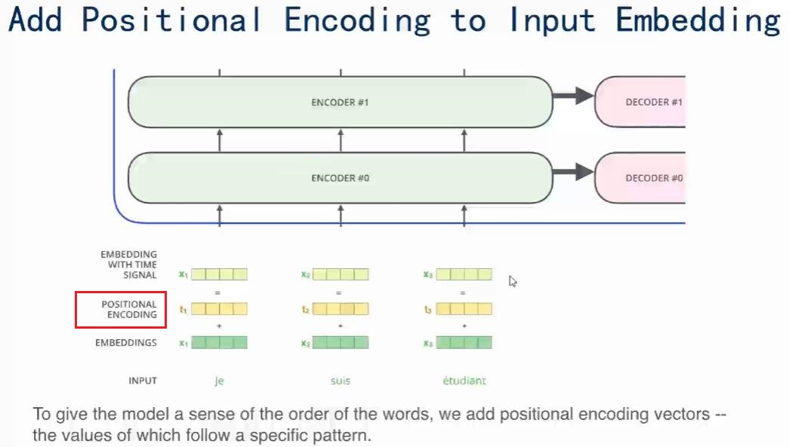
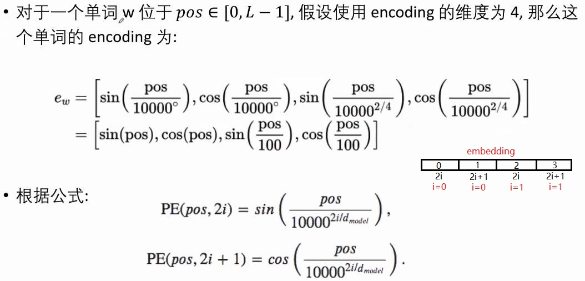
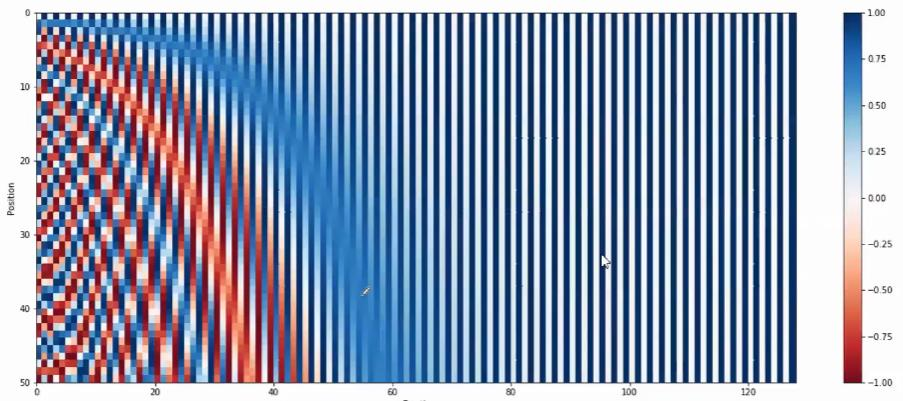
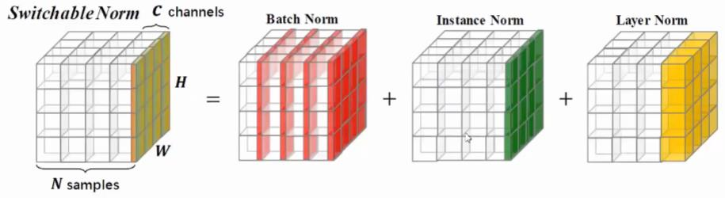
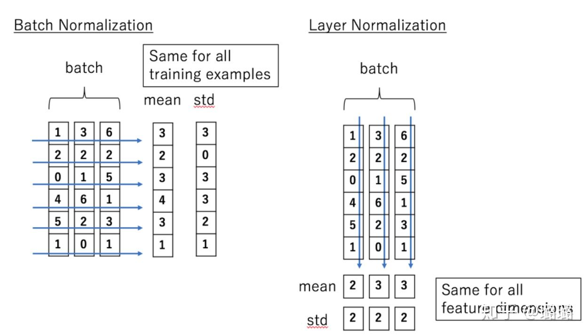
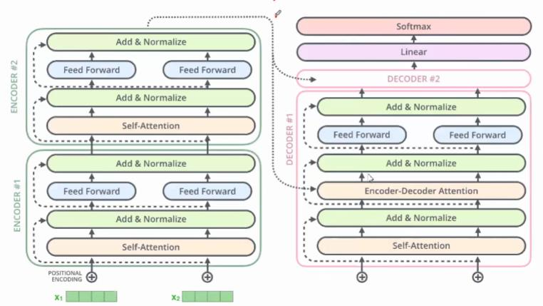

# Attention Is All You Need

​          ——Self-Attention机制和Transformer详解


* [返回上层目录](../self-attention-and-transformer.md)
* [模型的思想](#模型的思想)
  * [RNN的缺陷](#RNN的缺陷)
  * [Transformer为何优于RNN](#Transformer为何优于RNN)
* [Transformer模型架构](#Transformer模型架构)
* [Encoder模块](#Encoder模块)
  * [Self-Attention机制](#Self-Attention机制)
  * [multi-headed-Attention](#multi-headed-Attention)
  * [词向量Embedding输入](#词向量Embedding输入)
  * [位置编码](#位置编码)
  * [skip-connection和Layer-Normalization](#skip-connection和Layer-Normalization)
  * [Encoder模块汇总](#Encoder模块汇总)
* [Decoder模块](#Decoder模块)
  * [Decoder的Mask-Multi-Head-Attention输入端](#Decoder的Mask-Multi-Head-Attention输入端)
  * [Decoder的Encode-Decode注意力层](#Decoder的Encode-Decode注意力层)
  * [Decoder的输出](#Decoder的输出)
* [Transformer动态流程图](#Transformer动态流程图)
* [Transformer特点](#Transformer特点)
* [代码实现](#代码实现)


pdf: [*Attention Is All You Need*](https://papers.nips.cc/paper/7181-attention-is-all-you-need.pdf)

能否不用RNN/LSTM去做自然语言处理呢？如何用深度神经网络去做？可以用Transformer。它可以用注意力机制来代替RNN，而且效果比RNN更好。

论文中给出Transformer的定义是：

> Transformer is the first transduction model relying entirely on self-attention to compute representations of its input and output without using sequence aligned RNNs or convolution。

# 模型的思想

## RNN的缺陷

在没有Transformer以前，大家做神经机器翻译用的最多的是基于RNN的Encoder-Decoder模型：


Encoder-Decoder模型当然很成功，在2018年以前用它是用的很多的。而且也有很强的能力。但是RNN天生有缺陷，只要是RNN，就会有梯度消失问题，核心原因是有递归的方式，作用在同一个权值矩阵上，使得如果这个矩阵满足条件的话，其最大的特征值要是小于1的话，那就一定会出现梯度消失问题。后来的LSTM和GRU也仅仅能缓解这个问题


## Transformer为何优于RNN

那如果要获得比RNN更进一步能力的提升，那怎么办呢？Transformer给了我们一种答案。

Transformer中抛弃了传统的CNN和RNN，整个网络结构完全是由Attention机制组成。 作者采用Attention机制的原因是考虑到RNN（或者LSTM，GRU等）的计算限制为是顺序的，也就是说RNN相关算法只能从左向右依次计算或者从右向左依次计算，这种机制带来了两个问题：

1. **时间片 $t$ 的计算依赖 $t-1$ 时刻的计算结果，这样限制了模型的并行能力**

2. 顺序计算的过程中信息会丢失，尽管LSTM等门机制的结构一定程度上缓解了长期依赖的问题，但是对于特别**长期的依赖现象，LSTM依旧无能为力**。

Transformer的提出解决了上面两个问题：

1. 首先它使用了**Attention机制**，将序列中的任意两个位置之间的距离缩小为一个常量；

2. 其次它不是类似RNN的顺序结构，因此具有**更好的并行性，符合现有的GPU框架**。

# Transformer模型架构

Transformer模型在论文《[Attention Is All You Need](https://papers.nips.cc/paper/7181-attention-is-all-you-need.pdf)》中被提出，利用Attention，去掉RNN。这篇论文的题目想说的是：你只需要用到Attention机制，完全不需要再用到RNN，就能解决很多问题。Transformer没有用到RNN，而且它的效果很好。

Transformer模型总体的样子如下图所示：总体来说，还是和Encoder-Decoder模型有些相似，左边是Encoder部分，右边是Decoder部分。


**Encoder**：输入是单词的Embedding，再加上位置编码，然后进入一个统一的结构，这个结构可以循环很多次（N次），也就是说有很多层（N层）。每一层又可以分成Attention层和全连接层，在每一层中，再额外加了一些处理，比如Skip Connection，做跳跃连接，然后还加了Normalization层。其实它本身的模型还是很简单的。

**Decoder**：第一次输入是前缀信息，之后的就是上一次产出的Embedding，加入位置编码，然后进入一个可以重复很多次的模块。该模块可以分成三块来看，第一块也是Attention层，第二块是cross Attention，不是Self-Attention，第三块是全连接层。也用了跳跃连接和Normalization。

**输出**：最后的输出要通过Linear层（全连接层），再通过softmax做预测。

再换用另一种简单的方式来解释Transformer的网络结构。


需要注意的是上图的Decoder的第一个输入，就是output的前缀信息。

# Encoder模块

## Self-Attention机制

我们把上图的网络简化一下，理论上Encoder和Decoder只有一个模块，那也算是Transformer。


那我们就来看下最简单的模型，它是怎样工作的。重点是看Encoder和Decoder里面的Attention机制是怎么运作的。


这个绿色的框（Encoder #1）就是Encoder里的一个独立模块。下面绿色的输入的是两个单词的embedding。这个模块想要做的事情就是想**把$x_1$转换为另外一个向量$r_1$**，这两个向量的维度是一样的。然后就一层层往上传。

转化的过程分成几个步骤，第一个步骤就是Self-Attention，第二个步骤就是普通的全连接神经网络。但是注意，**Self-Attention框里是所有的输入向量共同参与了这个过程，也就是说，$x_1$和$x_2$通过某种信息交换和杂糅，得到了中间变量$z_1$和$z_2$**。而全连接神经网络是割裂开的，$z_1$和$z_2$各自独立通过全连接神经网络，得到了$r_1$和$r_2$。

$x_1$和$x_2$互相不知道对方的信息，但因为在第一个步骤Self-Attention中发生了信息交换，所以**$r_1$和$r_2$各自都有从$x_1$和$x_2$得来的信息了**。

如果我们用**直觉的方式来理解Self-Attention**，假设左边的句子就是输入$x_1,x_2,...,x_{14}$，然后通过Self-Attention映射为$z_1,z_2,...,z_{14}$，**为什么叫Self-Attention呢，就是一个句子内的单词，互相看其他单词对自己的影响力有多大**。比如单词`it`，它和句子内其他单词最相关的是哪个，如果颜色的深浅来表示影响力的强弱，那显然我们看到对`it`影响力最强的就是`The`和`Animal`这两个单词了。所以**Self-Attention就是说，句子内各单词的注意力，应该关注在该句子内其他单词中的哪些单词上**。


具体注意力的不同强弱是怎么计算出来的呢？下面就讲解Self-Attention。

首先说下Attention和Self-Attention的区别

> Attention和self-attention的区别
>
> 以Encoder-Decoder框架为例，输入Source和输出Target内容是不一样的，比如对于英-中机器翻译来说，Source是英文句子，Target是对应的翻译出的中文句子，Attention发生在Target的元素Query和Source中的所有元素之间。
>
> Self Attention，指的不是Target和Source之间的Attention机制，而是Source内部元素之间或者Target内部元素之间发生的Attention机制，也可以理解为Target=Source这种特殊情况下的Attention。
>
> 两者具体计算过程是一样的，只是计算对象发生了变化而已。

下图就是Self-Attention的计算机制。已知输入的单词embedding，即$x_1$和$x_2$，想转换成$z_1$和$z_2$。


转换方式如下：

先把$x_1$转换成三个不一样的向量，分别叫做$q_1$、$k_1$、$v_1$，然后把$x_2$转换成三个不一样的向量，分别叫做$q_2$、$k_2$、$v_2$。那把一个向量变换成另一个向量的最简单的方式是什么？就是乘以矩阵进行变换了。所以，需要三个不同的矩阵$W^Q$、$W^K$、$W^v$，即
$$
\begin{aligned}
&q_1=x_1 W^Q\quad q_2=x_2 W^Q\\
&k_1=x_1 W^K\quad k_2=x_2 W^K\\
&v_1=x_1 W^V\quad v_2=x_2 W^V\\
\end{aligned}
$$
可以注意到，**上述过程中，不同的$x_i$分享了同一个$W^Q$、$W^K$、$W^v$，通过这个操作，$x_1$和$x_2$已经发生了某种程度上的信息交换**。也就是说，单词和单词之间，通过共享权值，已经相互发生了信息的交换。

然后，有了$q_1$、$k_1$、$v_1$和$q_2$、$k_2$、$v_2$，怎么才能得到$z_1$和$z_2$呢？计算过程是这样子的：我们用$v_1$和$v_2$两个向量的线性组合，来得到$z_1$和$z_2$，即
$$
\begin{aligned}
&z_1=\theta_{11}v_1+\theta_{12}v_2\\
&z_2=\theta_{21}v_1+\theta_{22}v_2
\end{aligned}
$$
那怎么才能得到组合的权重 $\theta$ 呢？有
$$
\begin{aligned}
&[\theta_{11},\theta_{12}]=\text{softmax}\left(\frac{q_1k^T_1}{\sqrt{d_k}},\quad \frac{q_1k^T_2}{\sqrt{d_k}}\right)\\
&[\theta_{21},\theta_{22}]=\text{softmax}\left(\frac{q_2k^T_1}{\sqrt{d_k}},\quad \frac{q_2k^T_2}{\sqrt{d_k}}\right)
\end{aligned}
$$
通过上述的整个流程，就可以把输入的$x_1$和$x_2$转换成了$z_1$和$z_2$。这就是Self-Attention机制。有了$z_1$和$z_2$，再通过全连接层，就能输出该Encoder层的输出$r_1$和$r_2$。

讲到这里，你肯定很困惑为什么要有$q$、$k$、$v$向量，因为这个思路来自于比较早的信息检索领域，$q$就是query，$k$就是key，$v$就是value，(k,v)就是键值对、也就是用query关键词去找到最相关的检索结果。

举个例子，假设query是`5G`，然后k-v键值对有

```
k-v: 5G : Huawei
k-v: 4G : Nokia
```

那query（`5G`）和key（`5G`）的相关性是100%，和key（`4G`）的相关性是50%。这就是为什么用query，key，value这种概念。

为了得到query，key，value，一个$x$就得做3次乘法，那n个$x$就得做$3n$次乘法。为了比较高效的实现矩阵乘法，要进行类似matlab中的向量化操作，因为因为GPU中矩阵运算的复杂度是$O(1)$不是$O(N^2)$。如果我们能把上面的操作变为矩阵操作，那我们就能很好的利用GPU做并行计算。具体的矩阵操作如下图所示。


用公式表示即为
$$
\text{Attention}(Q,K,V)=\text{softmax}\left(\frac{QK^T}{\sqrt{d_k}}\right)V
$$
为什么这里要用矩阵而不是神经网络呢？因为矩阵运算能用GPU加速，会更快，同时参数量更少，更节省空间。

注意，上式中的$d_k$是向量$q$或$k$的维度，这两个向量的维度一定是一样的，因为要做点积。但是$v$的维度和向量$q$或$k$的维度不一定相同。**上式为什么要除以$\sqrt{d_k}$呢？**因为为了防止维数过高时$QK^T$的值过大导致softmax函数反向传播时发生梯度消失。那为什么是$\sqrt{d_k}$而不是$d_k$呢？这就是个经验值，从理论上来说，就是还需要让$QK^T$的值适度增加，但不能过度增加，如果是$d_k$的话，可能就不增加了。

原文关于除以$\sqrt{d_k}$是这么解释的：

> 点积注意力被缩小了深度的平方根倍。这样做是因为对于较大的深度值，点积的大小会增大，从而推动softmax函数往仅有很小的梯度的方向靠拢，导致了一种很硬的（hard）softmax。
>
> 例如，假设Q和K的均值为0，方差为1。它们的矩阵乘积将有均值为0，方差为$d_k$ 。因此，*$d_k$的平方根*被用于缩放（而非其他数值），因为，Q和K的矩阵乘积的均值本应该为0，方差本应该为1，这样会获得一个更平缓的softmax。

数学理解：[为什么 dot-product attention 需要被 scaled？](https://blog.csdn.net/qq_37430422/article/details/105042303)

## multi-headed-Attention

如果用不同的$W^Q$、$W^K$、$W^V$，就能得到不同的$Q$、$K$、$V$。multi-headed Attention就是指用了很多个不同的$W^Q$、$W^K$、$W^V$。


那这样的好处是什么呢？可以让Attention有更丰富的层次。有多个$Q$、$K$、$V$的话，可以分别从多个不同角度来看待Attention。这样的话，输入$x$，对于不同的multi-headed Attention，就会产生不同的$z$。


那现在一个$x$就有了多个版本的$z$，那该怎么结合为一个$z$呢？

那就将多个版本的$x$拼接称为一个长向量，然后用一个全连接网络，即乘以一个矩阵，就能得到一个短的$x$向量。


把multi-headed输出的不同的$z$，组合成最终想要的输出的$z$，这就是multi-headed Attention要做的一个额外的步骤。


multi-headed Attention用公式表示就是
$$
\begin{aligned}
&\text{MultiHead}(Q,K,V)=\text{Contact}(\text{head}_1,...,\text{head}_2)W^O\\
&\quad\quad \text{where}\ \text{head}_i=\text{Attention}(QW^Q_i,KW^K_i,VW^V_i)
\end{aligned}
$$
上面讲的是理论和细节，现在从直觉上理解为什么需要multi-headed Attention。

下图是有八个Attention，先看右图，这八个Attention用八种不同的颜色表示，从蓝色到灰色。然后我们可以看到一个单词，在这八个Attention上对句子里每个单词的权重，颜色越深，代表权重越大。我们只挑出橙色和绿色（即第二个和第三个色块），看它们分别是怎样的注意力。然后把橙色和绿色的色块拉长就得到了左边这个图。



我们现在看左边，先看橙色部分，单词`it`连接的权重最重的是`animal`，这是从某一个侧面来看，那从另一个侧面来看，看绿色部分，`it`最关注的是`tired`。橙色的注意力主要表明`it`是个什么东西，从东西的角度说明它是一种动物，而不是苹果或者香蕉。如果我们从状态这个层面来看，`it`这个动物现在是在怎么样的一个状态，它的状态是`tired`，而不是兴奋。所以**不同的Self-Attention Head是不同方面的理解**。

## 词向量Embedding输入

Encoder输入的是单词$x$的embedding，通常有两种选择：

1. 使用Pre-trained的**embeddings并固化**，这种情况下实际就是一个Lookup Table。

2. 对其进行随机初始化（当然也可以选择Pre-trained的结果），但**设为Trainable**。这样在training过程中不断地对embeddings进行改进。 即End2End训练方式。

Transformer选择后者。

## 位置编码

输入的时候，不仅有单词的向量$x$，还要加上Positional Encoding，即**输入模型的整个Embedding是Word Embedding与Positional Embedding直接相加之后的结果**。这是想让网络知道这个单词所在句子中的位置是什么，是想让网络做自注意力的时候，不但要知道注意力要聚焦在哪个单词上面，还想要知道单词之间的互相距离有多远。

为什么要知道单词之间的相对位置呢？因为Transformer模型没有用RNN也没有卷积，所以为了让模型能利用序列的顺序，必须输入序列中词的位置。所以我们在Encoder模块和Decoder模块的底部添加了位置编码，这些位置编码和输入的$x$向量的维度相同，所以可以直接相加，从而将位置信息注入。



想要知道单词之间的距离，就得知道单词的坐标。有很多不同衡量距离的方式，

这里使用不同频率的$sin$和$cos$函数：
$$
\begin{aligned}
PE_{(pos,2i)}&=sin(\frac{pos}{10000^{2i/d_{model}}})\\
PE_{(pos,2i+1)}&=cos(\frac{pos}{10000^{2i/d_{model}}})
\end{aligned}
$$
其中，$pos$是单词的位置索引，设句子长度为$L$，那么$pos = 0, 1, ..., L−1$。$i$是向量的某一维度，假设词向量维度$d_{model} = 512$，那么$i = 0 , 1 , . . . , 255$。

下面举例说明该公式的用法。



举例来说，假设$$d_{model} =5$$，那么在一个样本中：

第一个单词的位置编码为：
$$
\left[ sin(\frac{0}{10000^{\frac{2\times 0}{5}}})\quad cos(\frac{0}{10000^{\frac{2\times 0}{5}}})\quad sin(\frac{0}{10000^{\frac{2\times 1}{5}}})\quad cos(\frac{0}{10000^{\frac{2\times 1}{5}}})\quad sin(\frac{0}{10000^{\frac{2\times 2}{5}}})\right]
$$
第二个单词的位置编码为：
$$
\left[ sin(\frac{1}{10000^{\frac{2\times 0}{5}}})\quad cos(\frac{1}{10000^{\frac{2\times 0}{5}}})\quad sin(\frac{1}{10000^{\frac{2\times 1}{5}}})\quad cos(\frac{1}{10000^{\frac{2\times 1}{5}}})\quad sin(\frac{1}{10000^{\frac{2\times 2}{5}}})\right]
$$
为什么这样做呢？用图形的方式可以直觉上理解。下图为一个长度为50，维度是128的句子的Positional Encoding（每一行为一个Encoding向量）。下图中一行就是一个单词的Positional Encoding。



上图可以看出，**不同位置的Positional Encoding是独特的**。但是计算Positional Encoding的方式不是唯一的，甚至Positional Encoding也可以是train出来的，**并不是必须用作者说的sin cos**。只要能相互计算距离就可以。但是训练出来的不鲁棒，选择正弦曲线版本是因为它可以使模型外推到比训练过程中遇到的序列更长的序列长度。

Positional Encoding的**物理意义**是：把50个Positional Encoding两两互相做点击，看相关性。**其特点是Encoding向量的点积值对称，随着距离增大而减小**。


关于位置编码的更多解释和理解，请看

* [Transformer Architecture: The Positional Encoding](https://kazemnejad.com/blog/transformer_architecture_positional_encoding/)
* [Linear Relationships in the Transformer’s Positional Encoding](https://timodenk.com/blog/linear-relationships-in-the-transformers-positional-encoding/)
* [Why add positional embedding instead of concatenate?](https://github.com/tensorflow/tensor2tensor/issues/1591)
* [d_positional_encoding_in_transformer](https://www.reddit.com/r/MachineLearning/comments/cttefo/d_positional_encoding_in_transformer/exs7d08/)

这几篇文章会解决你的所有关于位置编码的疑问。

## skip-connection和Layer-Normalization

Add & Norm模块接在Encoder端和Decoder端每个子模块的后面，其中Add表示残差连接，Norm表示LayerNorm，残差连接来源于论文[*Deep Residual Learning for Image Recognition*](https://arxiv.org/abs/1512.03385)，LayerNorm来源于论文[*Layer Normalization*](https://arxiv.org/abs/1607.06450)，因此Encoder端和Decoder端每个子模块实际的输出为：
$$
\text{LayerNorm}(x+\text{Sublayer}(x))
$$
，其中$\text{Sublayer}(x)$为子模块的输出。

skip connection最早是在计算机视觉的ResNet里面提到的，是微软亚洲研究院的何凯明做的，主要是想解决当网络很深时，误差向后传递会越来越弱，训练就很困难，那如果产生跳跃连接，如果有误差，可以从不同路径传到早期的网络层，这样的话误差就会比较明确地传回来。这就是跳跃层的来历。

跳跃层不是必须的，但在Transformer中，作者建议这样做，在Selft-Attention的前后和每一个Feed Forwar前后都用了跳跃层，如下图中的虚线所示。


如上图所示，同时，还用了Normalize，用的是一种新的[Layer Normalize](https://arxiv.org/pdf/1607.06450.pdf)，不是常用的Batch Normalize。是一种正则化的策略，避免网络过拟合。

Layer Normalize就是对每一层$t$的所有向量进行求均值$u^l$和方差$\sigma^l$，然后归一化到正态分布后，再学习到合适的均值$b$和方差$g$进行再次缩放，即
$$
\begin{aligned}
& \mu^t=\frac{1}{H}\sum^H_{i=1}a^t_i,\quad \sigma^t=\sqrt{\frac{1}{H}\sum_{i=1}^H(a^t_i-u^t)^2}\\
&h^t=f\left[\frac{g}{\sigma^t}\odot \left(a^t-\mu^t\right)+b\right]
\end{aligned}
$$


Layer Normalize和Batch Normalize唯一的区别就是不考虑其他数据，只考虑自己，这样就避免了不同batch size的影响。

下图给出一个对不同样本做Layer Normalization的实例以及和Batch Normalization的对比。



Layer Normalization的方法可以和Batch Normalization对比着进行理解，因为Batch Normalization不是Transformer中的结构，这里不做详解，详细清楚的解释请看这里：[NLP中 batch normalization与 layer normalization](https://zhuanlan.zhihu.com/p/74516930)。下面简单解释一下：

Batch Normalization 的处理对象是对一批样本， Layer Normalization 的处理对象是单个样本。Batch Normalization 是对这批样本的同一维度特征做归一化， Layer Normalization是对这单个样本的所有维度特征做归一化。

BN、LN可以看作横向和纵向的区别。其作用为：

* 经过归一化再输入激活函数，得到的值大部分会落入非线性函数的线性区，导数远离导数饱和区，避免了梯度消失，这样来加速训练收敛过程。

* 这类归一化技术，**目的就是让每一层的分布稳定下来**，让后面的层可以在前面层的基础上安心学习知识。

## Encoder模块汇总

Encoder模块各部分及相关流程如下所示。


# Decoder模块

接下来看Decoder模块。论文中Decoder也是N=6层堆叠的结构。被分为3个SubLayer，Encoder与Decoder有**三大主要的不同**：

1. Decoder SubLayer-1使用的是“**Masked**” Multi-Headed Attention机制，**防止为了模型看到要预测的数据，防止泄露**。

2. SubLayer-2是一个Encoder-Decoder Multi-head Attention。

3. LinearLayer和SoftmaxLayer作用于SubLayer-3的输出后面，来预测对应的word的probabilities 。

## Decoder的Mask-Multi-Head-Attention输入端

模型训练阶段：

- Decoder的初始输入：训练集的标签$Y$，并且需要整体右移（Shifted Right）一位
- Shifted Right的原因：T-1时刻需要预测T时刻的输出，所以Decoder的输入需要整体后移一位

举例说明：`我爱中国` → `I Love China`

位置关系：

```
0-“I”
1-“Love”
2-“China”
```

操作：整体右移一位（Shifted Right）

```
0-</s>【起始符】目的是为了预测下一个Token
1-“I”
2-“Love”
3-“China”
```

具体步骤

* **Time Step 1**

- - 初始输入： 起始符`</s>`  + Positional Encoding
  - 中间输入：（`我爱中国`）Encoder Embedding
  - Decoder：产生预测`I`

* **Time Step 2**

- - 初始输入：起始符`</s>` + `I` + Positonal Encoding
  - 中间输入：（`我爱中国`）Encoder Embedding
  - Decoder：产生预测`Love`

* **Time Step 3**

- - 初始输入：起始符`</s>` + `I` + `Love` + Positonal Encoding
  - 中间输入：（`我爱中国`）Encoder Embedding
  - Decoder：产生预测`China`

第一步，预测第一个字母`I`：


其余步骤，预测其余字母`am a student`：


Transformer Decoder的输入：

- 初始输入：**前一时刻Decoder输入**??+前一时刻Decoder的预测结果 + Positional Encoding
- 中间输入：Encoder Embedding

**什么是Mask**

mask表示掩码，它对某些值进行掩盖，使其在参数更新时不产生效果。Transformer模型里面涉及两种mask，分别是 padding mask和sequence mask。
其中，**padding mask**在所有的scaled dot-product attention里面都需要用到，而**sequence mask**只有在Decoder的Self-Attention里面用到。

**Padding Mask**

什么是padding mask呢？因为每个批次输入序列长度是不一样的也就是说，我们要对输入序列进行对齐。具体来说，就是给在较短的序列后面填充0。但是如果输入的序列太长，则是截取左边的内容，把多余的直接舍弃。因为这些填充的位置，其实是没什么意义的，所以我们的Attention机制不应该把注意力放在这些位置上，所以我们需要进行一些处理。

具体的做法是，把这些位置的值加上一个非常大的负数(负无穷)，这样的话，经过softmax，这些位置的概率就会接近0！

而我们的padding mask实际上是一个张量，每个值都是一个Boolean，值为false的地方就是我们要进行处理的地方。

**Sequence mask**

文章前面也提到，sequence mask是为了使得Decoder不能看见未来的信息。也就是对于一个序列，在time_step为t的时刻，我们的解码输出应该只能依赖于t时刻之前的输出，而不能依赖t之后的输出。因此我们需要想一个办法，把t之后的信息给隐藏起来。
那么具体怎么做呢？也很简单：产生一个上三角矩阵，上三角的值全为0。把这个矩阵作用在每一个序列上，就可以达到我们的目的。

sequence mask的目的是防止Decoder “seeing the future”，就像防止考生偷看考试答案一样。这里mask是一个下三角矩阵，对角线以及对角线左下都是1，其余都是0。下面是个10维度的下三角矩阵：

```python
[[1, 0, 0, 0, 0, 0, 0, 0, 0, 0],
 [1, 1, 0, 0, 0, 0, 0, 0, 0, 0],
 [1, 1, 1, 0, 0, 0, 0, 0, 0, 0],
 [1, 1, 1, 1, 0, 0, 0, 0, 0, 0],
 [1, 1, 1, 1, 1, 0, 0, 0, 0, 0],
 [1, 1, 1, 1, 1, 1, 0, 0, 0, 0],
 [1, 1, 1, 1, 1, 1, 1, 0, 0, 0],
 [1, 1, 1, 1, 1, 1, 1, 1, 0, 0],
 [1, 1, 1, 1, 1, 1, 1, 1, 1, 0],
 [1, 1, 1, 1, 1, 1, 1, 1, 1, 1]]
```

对于Decoder的Self-Attention，里面使用到的scaled dot-product attention，同时需要padding mask和sequence mask作为attn_mask，具体实现就是两个mask相加作为attn_mask。

其他情况，attn_mask一律等于padding mask。

举个例子：

假设最大允许的序列长度为10，先令padding mask为

```
[0 0 0 0 0 0 0 0 0 0]
```

然后假设当前句子一共有5个单词（加一个起始标识），在输入第三个单词的时候，前面有一个开始标识和两个单词，则此刻的sequence mask为

```
[1 1 1 0 0 0]
```

然后padding mask和sequence mask相加，得

```
[1 1 1 0 0 0 0 0 0 0]
```

## Decoder的Encode-Decode注意力层


Attention的预测流程和和普通的Encoder-Decoder的模式是一样的，只是用Self-Attention替换了RNN。

在这一层（Decoder中的第二个注意力层），输入不仅有前一层的输出$x$，还有来自Encoder的输出$m$（不然Encoder辛辛苦苦做的输出就没用了），然后把Encoder产生的向量$m$作为Decoder的key和value，Decoder的$x$作为query，然后进行Self-Attention。相当于是，Encoder告诉我key和value是什么，我现[]在要做的就是产生query。即有
$$
\begin{aligned}
q&=xW^Q\\
k&=mW^K\\
v&=mW^V
\end{aligned}
$$
## Decoder的输出



从上图可以看出，Decoder和Encoder唯一的区别就是多了一个Encode-Decode注意力层，然后最后一层接了个linear+softmax层，损失函数就是交叉熵损失。

Decoder的最后一个部分是过一个linear layer将decoder的输出扩展到与vocabulary size一样的维度上。经过softmax 后，选择概率最高的一个word作为预测结果。假设我们有一个已经训练好的网络，**在做预测时，步骤如下：**

1. 给Decoder输入Encoder对整个句子embedding的结果和一个特殊的开始符号`</s>`。Decoder 将产生预测，在我们的例子中应该是 ”I”。

2. 给Decoder输入Encoder的embedding结果和`</s> I`，在这一步Decoder应该产生预测 `am`。

3. 给Decoder输入Encoder的embedding结果和`</s> I am`，在这一步Decoder应该产生预测`a`。

4. 给Decoder输入Encoder的embedding结果和`</s> I am a`，在这一步Decoder应该产生预测`student`。

5. 给Decoder输入Encoder的embedding结果和`</s> I am a student`, Decoder应该生成句子结尾的标记，Decoder 应该输出`</eos>`。

6. 然后Decoder生成了`</eos>`，翻译完成。


这里有两个训练小技巧，第一个是label平滑，第二个就是学习率要有个worm up过程，然后再下降。

1、Label Smoothing（regularization）

由传统的
$$
\begin{aligned}
P_i=\left\{\begin{matrix}
1,\ \text{if}(i=y)\\ 
0,\ \text{if}(i\neq y)
\end{matrix}\right.
\end{aligned}
$$
变为
$$
\begin{aligned}
P_i=\left\{\begin{matrix}
(1-\epsilon),\ \text{if}(i=y)\\ 
\frac{\epsilon}{K-1},\ \text{if}(i\neq y)
\end{matrix}\right.
\end{aligned}
$$
注：$K$表示多分类的类别总数，$\epsilon$是一个较小的超参数。

2、[Noam Learning Rate Schedule](https://arxiv.org/abs/1706.03762)

学习率不按照这样可能就得不到一个好的Transformer。
$$
lr=d^{-0.5}_{\text{model}}\cdot min(step\_num^{-0.5},\ step\_num \cdot warmup\_steps^{-1.5})
$$


# Transformer动态流程图

Encoder通过处理输入序列开启工作。Encoder顶端的输出之后会变转化为一个包含向量$K$（键向量）和$V$（值向量）的注意力向量集 ，**这是并行化操作**。这些向量将被每个Decoder用于自身的“Encoder-Decoder注意力层”，而这些层可以帮助Decoder关注输入序列哪些位置合适：


在完成Encoder阶段后，则开始Decoder阶段。Decoder阶段的每个步骤都会输出一个输出序列（在这个例子里，是英语翻译的句子）的元素。接下来的步骤重复了这个过程，直到到达一个特殊的终止符号，它表示Transformer的解码器已经完成了它的输出。每个步骤的输出在下一个时间步被提供给底端Decoder，并且就像Encoder之前做的那样，这些Decoder会输出它们的Decoder结果 。


# Transformer特点

* 优点
  * 每层计算**复杂度比RNN要低**。
  * 可以进行**并行计算**。
  * 从计算一个序列长度为n的信息要经过的路径长度来看, CNN需要增加卷积层数来扩大视野，RNN需要从1到n逐个进行计算，而Self-attention只需要一步矩阵计算就可以。Self-Attention可以比RNN**更好地解决长时依赖问题**。当然如果计算量太大，比如序列长度N大于序列维度D这种情况，也可以用窗口限制Self-Attention的计算数量。
  * 从作者在附录中给出的栗子可以看出，Self-Attention**模型更可解释，Attention结果的分布表明了该模型学习到了一些语法和语义信息**。
* 缺点，在原文中没有提到缺点，是后来在Universal Transformers中指出的，主要是两点：
  * 有些RNN轻易可以解决的问题Transformer没做到，比如复制String，或者推理时碰到的sequence长度比训练时更长（因为碰到了没见过的position embedding）
  * 理论上：transformers不是computationally universal(图灵完备)，而RNN图灵。完备，这种非RNN式的模型是非图灵完备的的，**无法单独完成NLP中推理、决策等计算问题**（包括使用transformer的bert模型等等）。

# 代码实现

* 哈佛大学自言语言处理组的notebook，很详细文字和代码描述，用pytorch实现

  https://nlp.seas.harvard.edu/2018/04/03/attention.html

* Google的TensorFlow官方的，用tf keras实现

  https://www.tensorflow.org/tutorials/text/transformer

# 参考资料

* [贪心科技“ 共同战疫” NLP系列专题直播](https://www.greedyai.com/my/course/124)

本文主要内容是这个视频课程的笔记。

* [深入理解Transformer及其源码](https://www.cnblogs.com/zingp/p/11696111.html)

本文的整体架构参考了此博客。

* [The Illustrated Transformer](https://link.zhihu.com/?target=https%3A//jalammar.github.io/illustrated-transformer/)

很多资料上的图都是来自于这个英文博客。

* [batchNormalization与layerNormalization的区别](https://zhuanlan.zhihu.com/p/113233908)

“skip-connection和Layer-Normalization”参考此博客。

* [Transformer模型详解](https://blog.csdn.net/u012526436/article/details/86295971)
* [Transformer学习总结——原理篇](http://www.uml.org.cn/ai/201911074.asp)
* [Transformer模型中，decoder的第一个输入是什么？](https://www.zhihu.com/question/344516091/answer/899804534)
* [transformer的细节到底是怎么样的？](https://www.zhihu.com/question/362131975/answer/945357471)

“mask”部分参考了此博客。

===

[B站李宏毅深度学习Transformer2019](https://www.bilibili.com/video/av73798762?p=92)

[通俗易懂！使用Excel和TF实现Transformer](https://mp.weixin.qq.com/s/QRiNGxA-D9MLvv8GPnlhHg)

[小强公众号: Self-Attention与Transformer](https://mp.weixin.qq.com/s/lUqpCae3TPkZlgT7gUatpg)

[transformer中为什么使用不同的K 和 Q， 为什么不能使用同一个值？](https://www.zhihu.com/question/319339652/answer/730848834)

[放弃幻想，全面拥抱Transformer：自然语言处理三大特征抽取器（CNN/RNN/TF）比较](https://zhuanlan.zhihu.com/p/54743941)

[Transformers是一种图神经网络](https://zhuanlan.zhihu.com/p/147707275)

[让研究人员绞尽脑汁的Transformer位置编码](https://zhuanlan.zhihu.com/p/352898810)

[如何理解Transformer论文中的positional encoding，和三角函数有什么关系？](https://www.zhihu.com/question/347678607/answer/864217252)

[transformer问题整理（参考知乎大佬内容）](https://zhuanlan.zhihu.com/p/266695736)

[各种norm的论文](https://pytorch.org/docs/stable/nn.html#normalization-layers)

[BatchNormalization、LayerNormalization、InstanceNorm、GroupNorm、SwitchableNorm总结](https://blog.csdn.net/liuxiao214/article/details/81037416)

[从One-hot, Word embedding到Transformer，一步步教你理解Bert](https://www.sohu.com/a/322916145_99979179)

[答案解析(1)—史上最全Transformer面试题：灵魂20问帮你彻底搞定Transformer](https://zhuanlan.zhihu.com/p/149799951?from_voters_page=true)

[additive attention ](https://www.jianshu.com/p/e647d3a10d9c)


- [ML 2021 Spring](https://link.zhihu.com/?target=https%3A//speech.ee.ntu.edu.tw/~hylee/ml/2021-spring.html)

强烈推荐[李宏毅](https://www.zhihu.com/search?q=李宏毅&search_source=Entity&hybrid_search_source=Entity&hybrid_search_extra={"sourceType"%3A"answer"%2C"sourceId"%3A2305000399})老师关于Transformer的讲解，有深度且又通俗易懂。如果楼主对原始论文有迷惑，可以在学完李宏毅老师的课之后，再来读论文。

- [Transformer论文逐段精读【论文精读】_哔哩哔哩_bilibili](https://link.zhihu.com/?target=https%3A//www.bilibili.com/video/BV1pu411o7BE%3Fspm_id_from%3D333.999.0.0)

如果这时论文还是看不懂，还可以来听李沐老师的论文精读，这真得是不花钱就能看到的宝藏！

- [猛猿：Transformer学习笔记一：Positional Encoding（位置编码）](https://zhuanlan.zhihu.com/p/454482273)

我在学Transformer的过程中，把它当作一个“积木模型“，即拆成了很多小零件来详细学习。也把笔记分享给楼主，这个笔记系列在持续更新中～

* [transformer的细节到底是怎么样的？](https://www.zhihu.com/question/362131975/answer/2182682685)


[Transformer称霸的原因找到了？OpenAI前核心员工揭开注意力头协同工作机理](https://mp.weixin.qq.com/s?__biz=MzA3MzI4MjgzMw==&mid=2650844831&idx=2&sn=e6ae775a0d46dcc2c7f06945c9b7ea1c&chksm=84e56ae1b392e3f7d952ec2f4ba5a224c05f0e331ee8522577cf60961c91274be20c55617711&scene=132#wechat_redirect)


[哪位大神讲解一下Transformer的Decoder的输入输出都是什么？能解释一下每个部分都是什么?](https://www.zhihu.com/question/337886108/answer/893002189)

[如何从浅入深理解transformer？](https://www.zhihu.com/question/471328838/answer/2905251738)

[如何最简单、通俗地理解Transformer？](https://www.zhihu.com/question/445556653/answer/2884200706)

代码很详细


[Naive Bayes is all you need ?](https://zhuanlan.zhihu.com/p/637493675)

在写完[《NBCE：使用朴素贝叶斯扩展LLM的Context处理长度》](https://kexue.fm/archives/9617)之后，笔者就觉得朴素贝叶斯（Naive Bayes）跟Attention机制有很多相同的特征，后来再推导了一下发现，Attention机制其实可以看成是一种广义的、参数化的朴素贝叶斯。