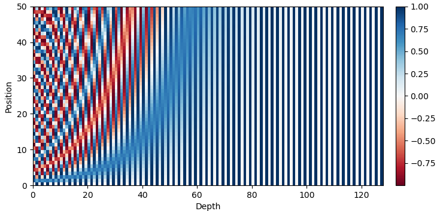
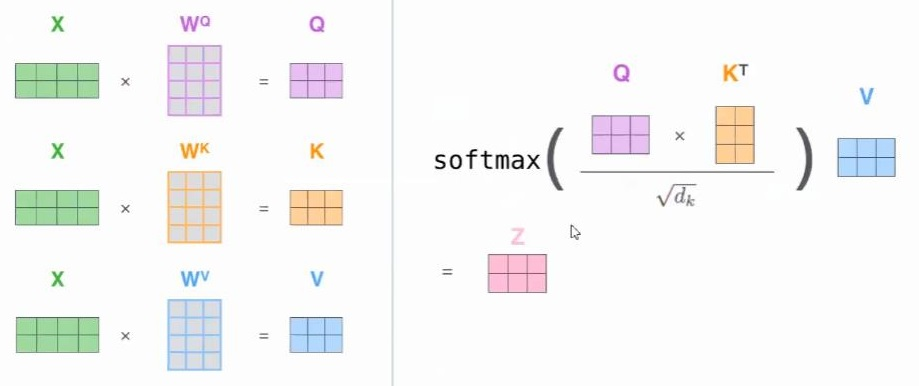

# Transformer模型TF2官网demo代码解读

- [返回上层目录](../self-attention-and-transformer.md)


TensorFlow官网有一个Transformer的demo，即

[理解语言的 Transformer 模型](https://www.tensorflow.org/tutorials/text/transformer)（如果打不开，需要科学上网），本文针对此略微进行结构调整（但代码不变），然后进行讲解。

调整后的整个代码分为三部分：

* params.py  一些配置参数
* transformer_model.py 模型结构
* run_demo.py 运行，包括数据产出、模型加载、训练、预测等

# 配置参数params.py

这块的代码如下所示，不多，也很好理解，不再多说，即便不理解也不用管，接着往下看。

```python
# 数据来源
DATA_PATH = 'ted_hrlr_translate/pt_to_en'
# 读取数据的buffer
BUFFER_SIZE = 20000
# 数据的batch size
BATCH_SIZE = 64

# 为了使训练速度变快，我们删除长度大于40个单词的样本。
MAX_LENGTH = 40
# 训练的轮次
EPOCHS = 1  # 20
```

#  模型结构transformer_model.py

导入模型所需的包：

```python
import tensorflow as tf
import numpy as np
import matplotlib.pyplot as plt

'''
本代码为 理解语言的Transformer模型 中的代码实现
https://www.tensorflow.org/tutorials/text/transformer
本教程训练了一个Transformer模型 用于将葡萄牙语翻译成英语。
'''
```

## 位置编码

Transformer 模型本身不具备像循环神经网络那样的学习词序信息的能力，所以我们需要主动地将词序信息输入模型。那么，模型原先的输入是不含词序信息的词向量，位置编码需要将词序信息和词向量结合起来形成一种新的表示输入给模型（在编码器和解码器中使用），这样模型就具备了学习词序信息的能力。

计算位置编码的公式如下：
$$
\begin{aligned}
PE_{(pos,2i)}&=sin(\frac{pos}{10000^{2i/d_{model}}})\\
PE_{(pos,2i+1)}&=cos(\frac{pos}{10000^{2i/d_{model}}})
\end{aligned}
$$
其中，$pos$是单词的位置索引，设句子长度为$L$，那么$pos = 0, 1, ..., L−1$。$i$是向量的某一维度，假设词向量维度$d_{model} = 512$，那么$i = 0 , 1 , . . . , 255$。

举例来说，假设$$d_{model} =5$$，那么在一个样本中：

第一个单词的位置编码为：
$$
\left[ sin(\frac{0}{10000^{\frac{2\times 0}{5}}})\quad cos(\frac{0}{10000^{\frac{2\times 0}{5}}})\quad sin(\frac{0}{10000^{\frac{2\times 1}{5}}})\quad cos(\frac{0}{10000^{\frac{2\times 1}{5}}})\quad sin(\frac{0}{10000^{\frac{2\times 2}{5}}})\right]
$$
第二个单词的位置编码为：
$$
\left[ sin(\frac{1}{10000^{\frac{2\times 0}{5}}})\quad cos(\frac{1}{10000^{\frac{2\times 0}{5}}})\quad sin(\frac{1}{10000^{\frac{2\times 1}{5}}})\quad cos(\frac{1}{10000^{\frac{2\times 1}{5}}})\quad sin(\frac{1}{10000^{\frac{2\times 2}{5}}})\right]
$$

```python

# ===================位置编码=====================
# 因为该模型并不包括任何的循环（recurrence）或卷积，所以模型添加了位置编码，为模型提供一些关于单词在句子中相对位置的信息。

# 位置编码向量被加到嵌入（embedding）向量中。嵌入表示一个d维空间的标记，在d维空间中有着相似含义的标记会离彼此更近。
# 但是，嵌入并没有对在一句话中的词的相对位置进行编码。因此，当加上位置编码后，
# 词将基于它们含义的相似度以及它们在句子中的位置，在d维空间中离彼此更近。
def get_angles(pos, i, d_model):
    """就是计算公式里sin和cos括号里的，参数类型是我根据下面的代码推测的，方便理解本函数
    Args:
        pos: ndarray型
        i: ndarray型，注意，这里的i和公式里的i不一样，这里的i是公式里的2i和2i+1，所以在代码里要用//地板除
        d_model: int型
    Returns:
        计算公式里sin和cos括号里的部分
    """
    angle_rates = 1 / np.power(10000, (2 * (i//2)) / np.float32(d_model))
    # 以后面的调用为例，传入的pos是维度(50,1)的ndarray，i是维度(1,512)的ndarray，d_model是整型512
    # 于是angle_rates也是(1,512)的ndarray

    return pos * angle_rates
    # 于是返回值pos * angle_rates的维度就是(50,512)
    # 从这里也可以看到，位置编码是根据position的值一下子把整个序列的每一时间步的编码都算出来的
    # 实际用的时候，根据序列长度，对位置编码切片取值


def positional_encoding(position, d_model):
    # np.newaxis的作用是增加一个维度
    # position行：np.arange(position)[:, np.newaxis]
    # d_model列：np.arange(d_model)[np.newaxis, :]
    angle_rads = get_angles(np.arange(position)[:, np.newaxis], np.arange(d_model)[np.newaxis, :], d_model)
    # 将 sin 应用于数组中的偶数索引（indices）；2i
    angle_rads[:, 0::2] = np.sin(angle_rads[:, 0::2])
    # 将 cos 应用于数组中的奇数索引；2i+1
    angle_rads[:, 1::2] = np.cos(angle_rads[:, 1::2])
    pos_encoding = angle_rads[np.newaxis, ...]
    # 最后的维度是(1,position,d_model)
    return tf.cast(pos_encoding, dtype=tf.float32)
```

这段代码本身很简单，认真看就能理解，唯一理解可能有难度的就是里面的矩阵相乘用到了广播机制。

然后我们测试一下，画一个位置编码的图：

```python
# 简单测试下positional_encoding函数：
pos_encoding = positional_encoding(50, 128)
print(pos_encoding.shape)

plt.pcolormesh(pos_encoding[0], cmap='RdBu')
plt.xlabel('Depth')
plt.xlim((0, 128))
plt.ylabel('Position')
plt.colorbar()
plt.show()
```



## 遮挡

### 填充遮挡

当句子的长度小于规定的长度时，在后面的空白处要遮挡，即后面的空白处的填充遮挡补1。

在填充值0出现的位置mask输出1，否则输出0。

```python
# ===================遮挡========================
# 填充遮挡
# 遮挡一批序列中所有的填充标记（即将文本转换到数字向量后标记为零的位置）。
# 这确保了模型不会将填充作为输入。在填充值0出现的位置mask输出1，否则输出0。
def create_padding_mask(seq):
    """创建padding mask，功能上来说，就是对于把序列中不是0的换成0，0换成1，1就表示被遮挡了
    Args:
        seq:输入的数据，维度是(batch_size,seq_len)
    Returns:
        处理后的结果，顺便增加了维度，变成(batch_size, 1, 1, seq_len)
    """
    seq = tf.cast(tf.math.equal(seq, 0), tf.float32)

    # 这个tf.newaxis和np.newaxis效果一样
    return seq[:, tf.newaxis, tf.newaxis, :]  # (batch_size, 1, 1, seq_len)
```

测试一下

```python
# create_padding_mask的调用示例：
x = tf.constant([[7, 6, 0, 0, 1], [1, 2, 3, 0, 0], [0, 0, 0, 4, 5]])
print(create_padding_mask(x))
```

结果为：

```
tf.Tensor(
[[[[0. 0. 1. 1. 0.]]]
 [[[0. 0. 0. 1. 1.]]]
 [[[1. 1. 1. 0. 0.]]]], shape=(3, 1, 1, 5), dtype=float32)
```

### 前瞻遮挡

前瞻遮挡用于遮挡未来的信息。

```python
# 前瞻遮挡
def create_look_ahead_mask(size):
    """
    关于tf.linalg.band_part函数：
    这是个关于三角阵操作的函数，函数api手册说得挺花哨的，功能就是保留矩阵的非主对角线元素，其余的换成0
    接收三个参数：
    input: 输入的张量;
    num_lower ：指定保留的主对角线下方的副对角线的数量，输入数值为负数时，表示下方的对角矩阵元素全部保留；
    num_upper：指定保留的主对角线上方的副对角线的数量，输入数值为负数时，表示上方的对角矩阵元素全部保留；
    这样解释就很清晰明了了，自己跑一跑就更清楚了
    """
    mask = 1 - tf.linalg.band_part(tf.ones((size, size)), -1, 0)
    # 先产生个幺矩阵，再把主对角线上方的元素置零，变成了下三角阵，1减这个下三角阵，又变成了上三角阵（此时主对角线也全是0）
    # 在模型中的作用，后续会有解释，目前先记住代码功能就行
    return mask  # (seq_len, seq_len)
```

测试一下：

```python
# 测试下上面的函数：
x = tf.random.uniform((1, 5))
print(create_look_ahead_mask(x.shape[1]))
```

输出结果为

```
tf.Tensor(
[[0. 1. 1. 1.]
 [0. 0. 1. 1.]
 [0. 0. 0. 1.]
 [0. 0. 0. 0.]], shape=(4, 4), dtype=float32)
```

### 生成所有遮挡

在编码器中，我们对其中唯一的注意力模块使用填充遮挡；在解码器中，我们对其中第一个注意力模块使用填充遮挡和前瞻遮挡，对第二个注意力模块使用填充遮挡。

```python
# 在编码器中，我们对其中唯一的注意力模块使用填充遮挡；
# 在解码器中，我们对其中第一个注意力模块使用填充遮挡和前瞻遮挡，对第二个注意力模块使用填充遮挡。
def create_masks(inp, tar):
    # 编码器填充遮挡
    enc_padding_mask = create_padding_mask(inp)

    # 在解码器的第二个注意力模块使用。
    # 该填充遮挡用于遮挡编码器的输出。
    dec_padding_mask = create_padding_mask(inp)

    # 在解码器的第一个注意力模块使用。
    # 用于填充（pad）和遮挡（mask）解码器获取到的输入的后续标记（future tokens）。
    look_ahead_mask = create_look_ahead_mask(tf.shape(tar)[1])
    # 1、前瞻mask，tar即目标数据，维度是batch_size × tar_seq_len × embedding_dims
    # 可以回忆下create_look_ahead_mask函数，生成一个上三角阵，维度是tar_seq_len × tar_seq_len，对角线及其以下都是0，其他的是1
    # 对于tar的一条数据来说，第i个时间步，对应前瞻mask的第i行，i及i前面的mask是0，后面的是1（表示遮挡），so easy
    dec_target_padding_mask = create_padding_mask(tar)
    # 2、填充mask
    combined_mask = tf.maximum(dec_target_padding_mask, look_ahead_mask)
    # 用maximum函数，这样两个mask只要有一个是1的地方，combined mask对应位置就是1

    return enc_padding_mask, combined_mask, dec_padding_mask
```

## 注意力机制

这部分的代码是进行如下图和下式的运算



用公式表示即为
$$
\text{Attention}(Q,K,V)=\text{softmax}\left(\frac{QK^T}{\sqrt{d_k}}\right)V具体代码如下。祝
$$
具体代码如下。注意，下面函数`scaled_dot_product_attention`的输入`q,k,v`为矩阵形式，内容为
$$
\begin{aligned}
q&=XW^Q=Q\\
k&=XW^K=K\\
q&=XW^V=V\\
\end{aligned}
$$

```python
# ===================Scaled dot-product attention======================
def scaled_dot_product_attention(q, k, v, mask):
    """计算注意力权重。
    q, k, v必须具有匹配的前置维度。
    k, v必须有匹配的倒数第二个维度，例如：seq_len_k = seq_len_v。
    虽然mask根据其类型（填充或前瞻）有不同的形状，
    但是mask必须能进行广播转换以便求和。

    参数:
    q: 请求的形状 == (..., seq_len_q, depth)
    k: 主键的形状 == (..., seq_len_k, depth)
    v: 数值的形状 == (..., seq_len_v, depth_v)
    mask: Float 张量，其形状能转换成
          (..., seq_len_q, seq_len_k)。默认为None。

    返回值:
    输出，注意力权重
    """

    matmul_qk = tf.matmul(q, k, transpose_b=True)  # (..., seq_len_q, seq_len_k)
    # tf.matmul，就是矩阵乘法，会自动处理好batch等维度
    # transpose_b=True就是先把右乘的矩阵转置再计算
    # 最后得到的矩阵维度就是(..., seq_len_q, seq_len_k)
    # 这一步就是计算公式里的q，k内积，不清楚的可以去官方页面查看公式
    # q，k，v什么含义一定要先看明白

    # 缩放 matmul_qk
    dk = tf.cast(tf.shape(k)[-1], tf.float32)
    scaled_attention_logits = matmul_qk / tf.math.sqrt(dk)

    # 将 mask 加入到缩放的张量上。
    if mask is not None:
        scaled_attention_logits += (mask * -1e9)
    # 遮挡（mask）与-1e9（接近于负无穷）相乘。这样做是因为遮挡与缩放的Q和K的矩阵乘积相加，
    # 并在softmax之前立即应用。目标是将这些单元归零，因为softmax的较大负数输入在输出中接近于零。
    # 原文没对这个做说明，我的理解是，需要屏蔽的位置(比如序列长度不足填充0的地方)，
    # mask矩阵对应的位置就是1(可以看一下前面创建mask的两个函数)

    # softmax在最后一个轴（seq_len_k）上归一化，因此分数相加等于1。
    attention_weights = tf.nn.softmax(scaled_attention_logits, axis=-1)  # (..., seq_len_q, seq_len_k)

    output = tf.matmul(attention_weights, v)  # (..., seq_len_q, depth_v)

    return output, attention_weights
```

我们来简单测试一下：

```python
# 测试scaled_dot_product_attention
np.set_printoptions(suppress=True)  # 设置supress=True意味着打印出来的小数不用科学记数法
# 用于测试下qkv计算的函数
def print_out(q, k, v):
    temp_out, temp_attn = scaled_dot_product_attention(q, k, v, None)
    print('Attention weights are:')
    print(temp_attn)
    print('Output is:')
    print(temp_out)

# 随机给个q、k、v瞧瞧：
temp_q = tf.constant([[[0, 1, 0], [0, 0, 1]], [[0, 1, 0], [0, 0, 1]]], dtype=tf.float32)  # (batch_size, 4, 3)
temp_k = tf.constant([[[1, 2, 0], [0, 1, 1]], [[1, 2, 0], [0, 1, 1]]], dtype=tf.float32)  # (batch_size, 4, 3)
temp_v = tf.constant([[[1, 0], [2, 0]], [[1, 0], [2, 0]]], dtype=tf.float32)  # (batch_size, 4, 2)
print_out(temp_q, temp_k, temp_v)
```

输出为：

```
Attention weights are:
tf.Tensor(
[[[0.64045745 0.35954252]
  [0.35954252 0.64045745]]

 [[0.64045745 0.35954252]
  [0.35954252 0.64045745]]], shape=(2, 2, 2), dtype=float32)
Output is:
tf.Tensor(
[[[1.3595425 0.       ]
  [1.6404574 0.       ]]

 [[1.3595425 0.       ]
  [1.6404574 0.       ]]], shape=(2, 2, 2), dtype=float32)
```

到这里，我们其实还是不是那么清楚到底函数里面是怎么算的，那我们就一步步来把函数里面的算法过一遍。

先**定义输入的变量$q,k,v$**：

```python
q = tf.constant([[[0, 1, 0], [0, 0, 1]], [[0, 1, 0], [0, 0, 1]]], dtype=tf.float32)  # (batch_size, 4, 3)
k = tf.constant([[[1, 2, 0], [0, 1, 1]], [[1, 2, 0], [0, 1, 1]]], dtype=tf.float32)  # (batch_size, 4, 3)
v = tf.constant([[[1, 0], [2, 0]], [[1, 0], [2, 0]]], dtype=tf.float32)  # (batch_size, 4, 2)
print("q =", q)
print("k =", k)
print("v =", v)
```

可得：

```
q = tf.Tensor(
[[[0. 1. 0.]
  [0. 0. 1.]]

 [[0. 1. 0.]
  [0. 0. 1.]]], shape=(2, 2, 3), dtype=float32)

k = tf.Tensor(
[[[1. 2. 0.]
  [0. 1. 1.]]

 [[1. 2. 0.]
  [0. 1. 1.]]], shape=(2, 2, 3), dtype=float32)

v = tf.Tensor(
[[[1. 0.]
  [2. 0.]]

 [[1. 0.]
  [2. 0.]]], shape=(2, 2, 2), dtype=float32)
```

去掉batch，$q,k,v$分别为
$$
q=\begin{bmatrix}
0 & 1 & 0\\ 
0 & 0 & 1
\end{bmatrix},
k=\begin{bmatrix}
1 & 2 & 0\\ 
0 & 1 & 1
\end{bmatrix},
v=\begin{bmatrix}
2 & 1\\ 
0 & 1
\end{bmatrix}
$$
为什么$v$和$q,k$的维度不同呢？因为我故意的，从理论上是可以不同的，但是$q$和$k$需要矩阵相乘，所以维度必须要相同。

然后**计算$q$和$k$的矩阵相乘的结果**，

```python
matmul_qk = tf.matmul(q, k, transpose_b=True)  # (..., seq_len_q, seq_len_k)
print("matmul_qk =", matmul_qk)
```

结果为

```
matmul_qk = tf.Tensor(
[[[2. 1.]
  [0. 1.]]

 [[2. 1.]
  [0. 1.]]], shape=(2, 2, 2), dtype=float32)
```

我们来手算验证一下：
$$
qk^T=\begin{bmatrix}
0 & 1 & 0\\ 
0 & 0 & 1
\end{bmatrix}
\begin{bmatrix}
1 & 2 & 0\\ 
0 & 1 & 1
\end{bmatrix}^T
=\begin{bmatrix}
0 & 1 & 0\\ 
0 & 0 & 1
\end{bmatrix}
\begin{bmatrix}
1 & 0\\ 
2 & 1\\
0 & 1
\end{bmatrix}
=\begin{bmatrix}
2 & 1\\ 
0 & 1
\end{bmatrix}
$$
和代码计算结果一致。

然后**除以$\sqrt{d_k}$进行修正**，防止维数过高时$QK^T$的值过大导致softmax函数反向传播时发生梯度消失。

```python
dk = tf.cast(tf.shape(k)[-1], tf.float32)
scaled_attention_logits = matmul_qk / tf.math.sqrt(dk)
print("dk =", dk)
print("scaled_attention_logits =", scaled_attention_logits)
```

结果为：

```
dk = tf.Tensor(3.0, shape=(), dtype=float32)
scaled_attention_logits = tf.Tensor(
[[[1.1547005  0.57735026]
  [0.         0.57735026]]

 [[1.1547005  0.57735026]
  [0.         0.57735026]]], shape=(2, 2, 2), dtype=float32)
```

我们来手算验证一下：
$$
\frac{qk^T}{\sqrt{d_k}}=\frac
{\begin{bmatrix}
2 & 1\\ 
0 & 1
\end{bmatrix}}
{\sqrt{3}}
={\begin{bmatrix}
1.1547005 & 0.57735026\\ 
0 & 0.57735026
\end{bmatrix}}
$$
和代码计算结果一致。

然后进行softmax得到attention的权重：

```python
attention_weights = tf.nn.softmax(scaled_attention_logits, axis=-1)  # (..., seq_len_q, seq_len_k)
print("attention_weights =", attention_weights)
```

结果为：

```
attention_weights = tf.Tensor(
[[[0.64045745 0.35954252]
  [0.35954252 0.64045745]]

 [[0.64045745 0.35954252]
  [0.35954252 0.64045745]]], shape=(2, 2, 2), dtype=float32)
```

我们来手算验证一下：
$$
\begin{aligned}
\text{attention_weights}&=\text{softmax}\left(\frac{qk^T}{\sqrt{d_k}}\right)\\
&=\text{softmax}(\frac
{\begin{bmatrix}
2 & 1\\ 
0 & 1
\end{bmatrix}}
{\sqrt{3}})\\
&=\text{softmax}\begin{pmatrix}
1.1547005 & 0.57735026\\ 
0 & 0.57735026
\end{pmatrix}\\
&=\begin{bmatrix}
\frac{\text{exp}(1.1547005)}{\text{exp}(1.1547005) + \text{exp}(0.5773502)} & \frac{\text{exp}(0.5773502)}{\text{exp}(1.1547005) + \text{exp}(0.5773502)}\\ 
\frac{\text{exp}(0)}{\text{exp}(0) + \text{exp}(0.5773502)} & \frac{\text{exp}(0.5773502)}{\text{exp}(0) + \text{exp}(0.5773502)}
\end{bmatrix}\\
&=\begin{bmatrix}
0.64045745 & 0.35954252\\
0.35954252 & 0.64045745
\end{bmatrix}
\end{aligned}
$$
最后，我们计算Attention层输出的向量，即
$$
\text{Attention}(Q,K,V)=\text{softmax}\left(\frac{QK^T}{\sqrt{d_k}}\right)V
$$
其实也就是
$$
\begin{aligned}
&z_1=\theta_{11}v_1+\theta_{12}v_2\\
&z_2=\theta_{21}v_1+\theta_{22}v_2
\end{aligned}
$$
其中，组合权重（即所谓的权值矩阵）$\theta$为：
$$
\begin{aligned}
&[\theta_{11},\theta_{12}]=\text{softmax}\left(\frac{q_1k^T_1}{\sqrt{d_k}},\quad \frac{q_1k^T_2}{\sqrt{d_k}}\right)\\
&[\theta_{21},\theta_{22}]=\text{softmax}\left(\frac{q_2k^T_1}{\sqrt{d_k}},\quad \frac{q_2k^T_2}{\sqrt{d_k}}\right)
\end{aligned}
$$
用代码表示为：

```
output = tf.matmul(attention_weights, v)
print("output =", output)
```

输出为

```
output = tf.Tensor(
[[[1.3595425 0.       ]
  [1.6404574 0.       ]]

 [[1.3595425 0.       ]
  [1.6404574 0.       ]]], shape=(2, 2, 2), dtype=float32)
```

我们来手动验算一下：
$$
\begin{aligned}
z&=\text{softmax}\left(\frac{qk^T}{\sqrt{d_k}}\right)v\\
&=\text{softmax}(\frac
{\begin{bmatrix}
2 & 1\\ 
0 & 1
\end{bmatrix}}
{\sqrt{3}})\begin{bmatrix}
1 & 0\\ 
2 & 0
\end{bmatrix}\\
&=\text{softmax}\begin{pmatrix}
1.1547005 & 0.57735026\\ 
0 & 0.57735026
\end{pmatrix}
\begin{bmatrix}
1 & 0\\ 
2 & 0
\end{bmatrix}\\
&=\begin{bmatrix}
\frac{\text{exp}(1.1547005)}{\text{exp}(1.1547005) + \text{exp}(0.5773502)} & \frac{\text{exp}(0.5773502)}{\text{exp}(1.1547005) + \text{exp}(0.5773502)}\\ 
\frac{\text{exp}(0)}{\text{exp}(0) + \text{exp}(0.5773502)} & \frac{\text{exp}(0.5773502)}{\text{exp}(0) + \text{exp}(0.5773502)}
\end{bmatrix}
\begin{bmatrix}
1 & 0\\ 
2 & 0
\end{bmatrix}\\
&=\begin{bmatrix}
0.64045745 & 0.35954252\\
0.35954252 & 0.64045745
\end{bmatrix}
\begin{bmatrix}
1 & 0\\ 
2 & 0
\end{bmatrix}\\
&=\begin{bmatrix}
1.3595425 & 0\\ 
1.6404574 & 0
\end{bmatrix}
\end{aligned}
$$
即
$$
\begin{aligned}
z_1&=\begin{bmatrix}
1.3595425 & 0
\end{bmatrix}\\
z_2&=\begin{bmatrix}
1.6404574 & 0
\end{bmatrix}
\end{aligned}
$$

## 多头注意力


## 点式前馈网络


## 编码与解码

### 编码器层

### 解码器层

### 编码器

### 解码器


## 自定义学习率调用程序


# 运行run_demo.py


# 参考资料

* [理解语言的 Transformer 模型](https://www.tensorflow.org/tutorials/text/transformer)

这是官网的demo。

* [Tensorflow2.0之理解语言的 Transformer 模型](https://blog.csdn.net/qq_36758914/article/details/105465817)

本文的解释部分参考了此博客。


