# Seq2Seq和注意力机制

* [返回上层目录](../natural-language-processing.md)
* [RNN的多种结构](#RNN的多种结构)
* [Seq2Seq模型](#Seq2Seq模型)
* [Encoder-Decoder结构](#Encoder-Decoder结构)
  * [Encoder-Decoder介绍](#Encoder-Decoder介绍)
  * [Encoder-Decoder分析](#Encoder-Decoder分析)
* [Attention机制](#Attention机制)
  * [Encoder-Decoder结构的局限性](#Encoder-Decoder结构的局限性)
  * [Attention机制原理](#Attention机制原理)

pdf: [*NEURAL MACHINE TRANSLATION BY JOINTLY LEARNING TO ALIGN AND TRANSLATE*](https://arxiv.org/pdf/1409.0473.pdf)

# RNN的多种结构

首先从RNN的结构说起，根据输出和输入序列不同数量RNN可以有多种不同的结构，不同结构自然就有不同的引用场合。如下图，

* **one to one**结构，仅仅只是简单的给一个输入得到一个输出，此处并未体现序列的特征，例如图像分类场景。
* **one to many**结构，给一个输入得到一系列输出，这种结构可用于生产图片描述的场景。
* **many to one**结构，给一系列输入得到一个输出，这种结构可用于文本情感分析，对一些列的文本输入进行分类，看是消极还是积极情感。
* **many to many**结构，给一些列输入得到一系列输出，这种结构可用于翻译或聊天对话场景，对输入的文本转换成另外一些列文本。
* **同步many to many**结构，它是经典的RNN结构，前一输入的状态会带到下一个状态中，而且每个输入都会对应一个输出，我们最熟悉的就是用于字符预测了，同样也可以用于视频分类，对视频的帧打标签。

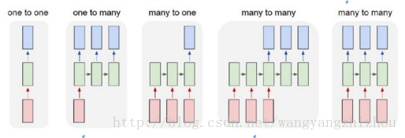

# Seq2Seq模型

Seq2Seq是2014年Google提出的一个模型[*Sequence to Sequence Learning with Neural Networks*](https://papers.nips.cc/paper/5346-sequence-to-sequence-learning-with-neural-networks.pdf)。论文中提出的 *Seq2Seq* 模型可简单理解为由三部分组成：**Encoder、Decoder 和连接两者的 State Vector (中间状态向量) C 。**

在上图many to many的两种模型中，可以看到第四和第五种是有差异的，经典的RNN结构的输入和输出序列必须要是等长，它的应用场景也比较有限。而第四种它可以是**输入和输出序列不等长，这种模型便是Seq2Seq模型**，即Sequence to Sequence。

Seq2Seq实现了**从一个序列到另外一个序列的转换**，比如google曾用Seq2Seq模型加attention模型来实现了翻译功能，类似的还可以实现聊天机器人对话模型。经典的RNN模型固定了输入序列和输出序列的大小，而Seq2Seq模型则突破了该限制。

这种结构最重要的地方在于**输入序列和输出序列的长度是可变的**。

**举个栗子**

> 在机器翻译：输入（hello） -> 输出 （你好）。输入是1个英文单词，输出为2个汉字。 
> 在对话机器中：我们提（输入）一个问题，机器会自动生成（输出）回答。这里的输入和输出显然是长度没有确定的序列（sequences）.

要知道，在以往的很多模型中，我们一般都说输入**特征矩阵**，每个样本对应矩阵中的某一行。就是说，无论是第一个样本还是最后一个样本，他们都有一样的特征维度。但是对于翻译这种例子，难道我们要让每一句话都有一样的字数吗，那样的话估计五言律诗和七言绝句又能大火一把了，哈哈。但是这不科学呀，所以就有了Seq2Seq这种结构。

Seq2Seq模型有两种常见结构。

（1）简单结构

该结构是最简单的结构，**Decoder 的第一个时刻只用到了 Encoder 最后输出的中间状态变量** ：

上图来自谷歌2014年的论文：[*Sequence to Sequence Learning with Neural Networks*](https://papers.nips.cc/paper/5346-sequence-to-sequence-learning-with-neural-networks.pdf)

（2）复杂结构

上图来自蒙特利尔大学2014年的论文：[*Learning Phrase Representations using RNN Encoder–Decoder
for Statistical Machine Translation*](https://www.aclweb.org/anthology/D14-1179.pdf)

Seq2Seq的应用有：

* 在英文翻译中，将英文输入到Encoder中，Decoder输出中文。

  蒙特利尔大学2014年的论文：[*Learning Phrase Representations using RNN Encoder–Decoder
  for Statistical Machine Translation*](https://www.aclweb.org/anthology/D14-1179.pdf)

* 在图像标注中，将图像特征输入到Encoder中，Decoder输出一段文字对图像的描述。

  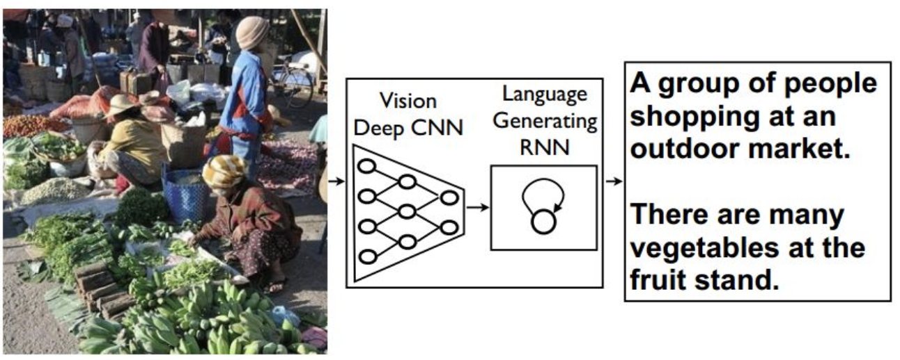

  Google2015年的论文：[*Show and Tell: A Neural Image Caption Generator*](https://www.cv-foundation.org/openaccess/content_cvpr_2015/papers/Vinyals_Show_and_Tell_2015_CVPR_paper.pdf)

* 在 *QA* 系统中，将提出的问题输入Encoder中，Decoder输出对于问题的回答。

# Encoder-Decoder结构

## Encoder-Decoder介绍

所谓的Sequence2Sequence任务主要是泛指一些Sequence到Sequence的映射问题，Sequence在这里可以理解为一个字符串序列，当我们在给定一个字符串序列后，希望得到与之对应的另一个字符串序列（如 翻译后的、如语义上对应的）时，这个任务就可以称为Sequence2Sequence了。

在现在的深度学习领域当中，通常的做法是将输入的源Sequence编码到一个中间的context当中，这个context是一个特定长度的编码（可以理解为一个向量），然后再通过这个context还原成一个输出的目标Sequence。 

如果用人的思维来看，就是我们先看到源Sequence，将其读一遍，然后在我们大脑当中就记住了这个源Sequence，并且存在大脑的某一个位置上，形成我们自己的记忆（对应Context），然后我们再经过思考，将这个大脑里的东西转变成输出，然后写下来。

那么我们大脑读入的过程叫做Encoder，即将输入的东西变成我们自己的记忆，放在大脑当中，而这个记忆可以叫做Context，然后我们再根据这个Context，转化成答案写下来，这个写的过程叫做Decoder。其实就是编码-存储-解码的过程。

而对应的，大脑怎么读入（Encoder怎么工作）有一个特定的方式，怎么记忆（Context）有一种特定的形式，怎么转变成答案（Decoder怎么工作）又有一种特定的工作方式。

好了，现在我们大体了解了一个工作的流程Encoder-Decoder后，我们来介绍一个深度学习当中，最经典的Encoder-Decoder实现方式，即用RNN来实现。

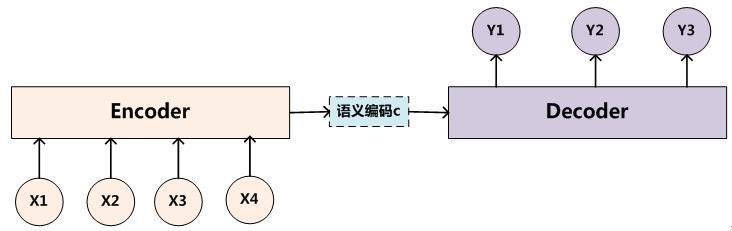

在RNN Encoder-Decoder的工作当中，我们用一个RNN去模拟大脑的读入动作，用一个特定长度的特征向量去模拟我们的记忆，然后再用另外一个RNN去模拟大脑思考得到答案的动作，将三者组织起来利用就成了一个可以实现Sequence2Sequence工作的“模拟大脑”了。
而我们剩下的工作也就是如何正确的利用RNN去实现，以及如何正确且合理的组织这三个部分了。

获取**语义向量C**最简单的方式就是直接将最后一个输入的隐状态作为语义向量C。也可以对最后一个隐含状态做一个变换得到语义向量，还可以将输入序列的所有隐含状态做一个变换得到语义变量。

## Encoder-Decoder分析

**（1）Encoder**

给定句子对

**（2）Decoder**

得到中间语义向量$C$后，使用Decoder进行解码。Decoder根据中间状态向量$C$和已经生成的历史信息$y_1, y_2,...,y_{i-1}$去生成$t$时刻的单词$y_i$：
$$
y_i=g(C,y_1,y_2,...,y_{i-1})
$$
如果直接将$C$输入到Decoder中，则是Seq2Seq模型的第一种模型：

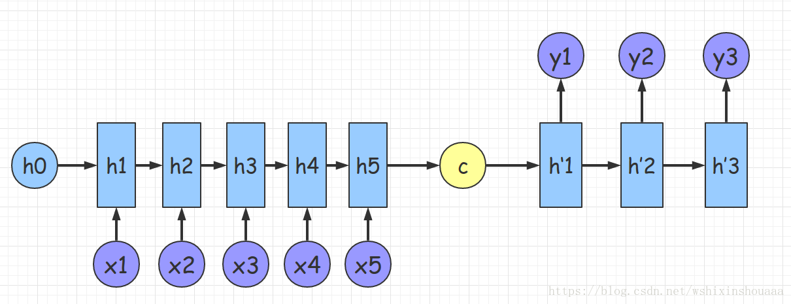

如果将$C$当作Decoder的每一时刻输入，则是Seq2Seq模型的第二种模型：

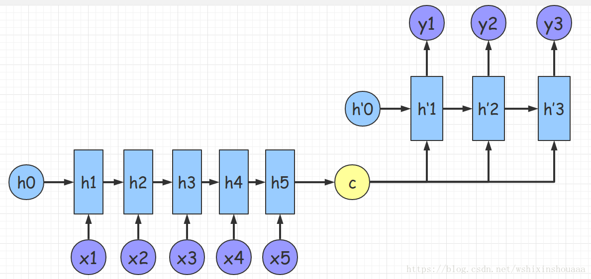

# Attention机制

## Encoder-Decoder结构的局限性

（1）Encoder和Decoder的唯一联系只有语义编码$C$

即将整个输入序列的信息编码成一个固定大小的状态向量再解码，相当于将信息”有损压缩”。很明显这样做有两个缺点：

* 中间语义向量无法完全表达整个输入序列的信息。

* 随着输入信息长度的增加，由于向量长度固定，先前编码好的信息会被后来的信息覆盖，丢失很多信息。

（2）不同位置的单词的贡献都是一样的

 Decoder过程，其输出的产生如下：
$$
\begin{aligned}
&y_1=g(C,h^{'}_0)\\
&y_2=g(C,y_1)\\
&y_3=g(C,y_1,y_2)
\end{aligned}
$$
明显可以发现在生成$y_1$、$y_2$、$y_3$时，语义编码$C$对它们所产生的贡献都是一样的。例如翻译：`Cat chase mouse`，Encoder-Decoder模型逐字生成：“猫”、“捉”、“老鼠”。在翻译mouse单词时，每一个英语单词对“老鼠”的贡献都是相同的。如果引入了Attention模型，那么mouse对于它的影响应该是最大的。

## Attention机制原理

为了解决上面两个问题，于是引入了Attention模型。Attention模型的特点是Decoder不再将整个输入序列编码为固定长度的中间语义向量$C$ ，而是根据当前生成的新单词计算新的$C_i$，使得每个时刻输入不同的$C$，这样就解决了单词信息丢失的问题。引入了Attention的Encoder-Decoder模型如下图：

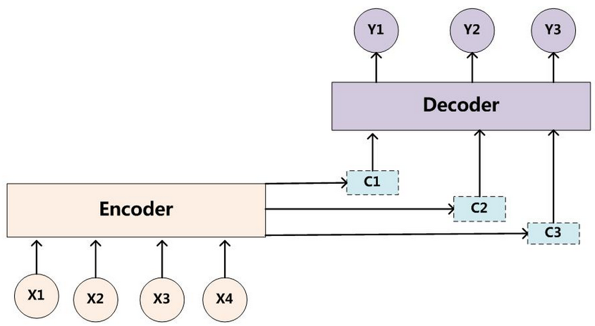

对于刚才提到的那个“猫捉老鼠”的翻译过程变成了如下：
$$
\begin{aligned}
&y_1=g(C_1,h^{'}_0)\\
&y_2=g(C_2,y_1)\\
&y_3=g(C_3,y_1,y_2)
\end{aligned}
$$
整个翻译流程如下：

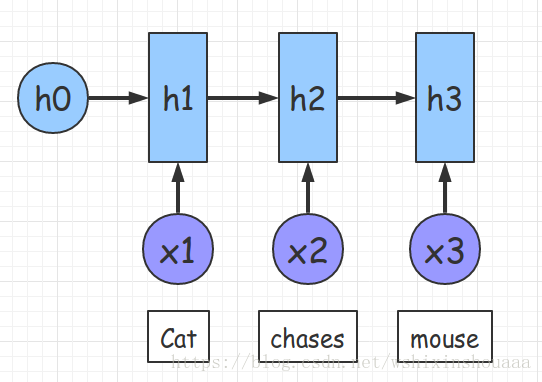

图中输入是`Cat chase mouse`，Encoder中隐层$h_1$、$h_2$、$h_3$可看作经过计算`Cat、chase、mouse`这些词的信息。

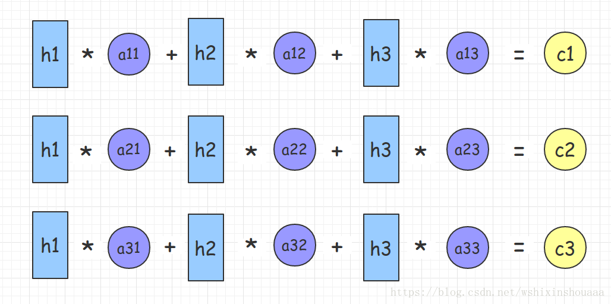

使用$a_{ij}$表示Encoder中第$j$阶段的$h_j$和解码时第$i$阶段的相关性，计算出解码需要的中间语义向量$C_i$。$C_1$和 “猫” 关系最近，相对应的$a_{11}$要比$a_{12}$、$a_{13}$大；而$C_2$和 “捉” 关系最近，相对应的$a_{22}$要比$a_{21}$、$a_{23}$大；同理$C_3$和 “老鼠” 关系最近，相对应的$a_{33}$要比$a_{31}$、$a_{32}$大。

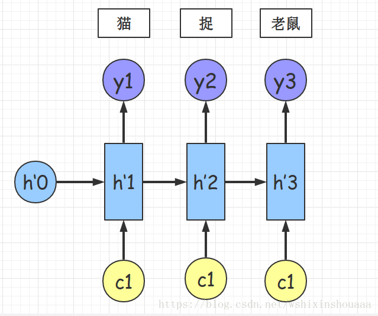

那么参数$a_{ij}$是如何得到呢？

Encoder中第$j$个隐层单元$h_j$和Decoder第$i-1$个隐层单元$h^{'}_{i-1}$经过运算得到$a_{ij}$。

例如$a_{1j}$的计算过程：

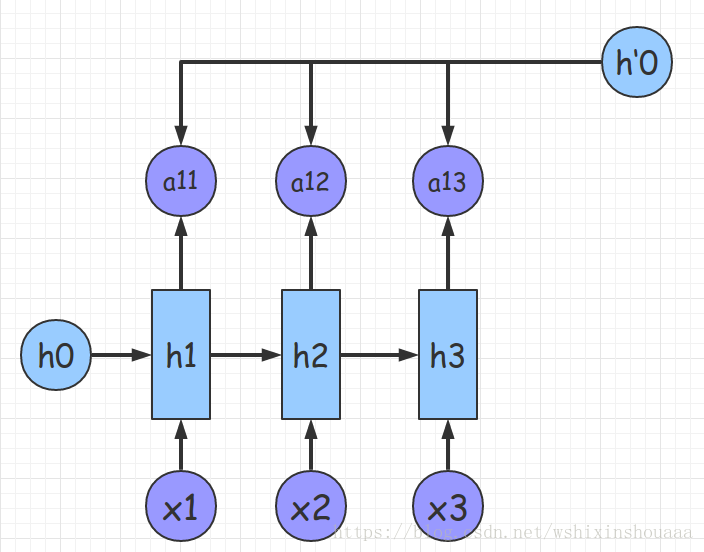

例如$a_{2j}$的计算过程：

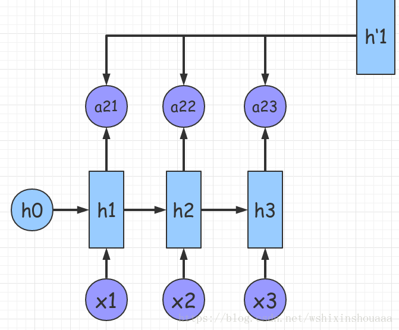

那具体是怎么运算得到的呢？我们来把上面的过程用公式严谨的表达出来。我们按照原论文的标点符号来进行推导。

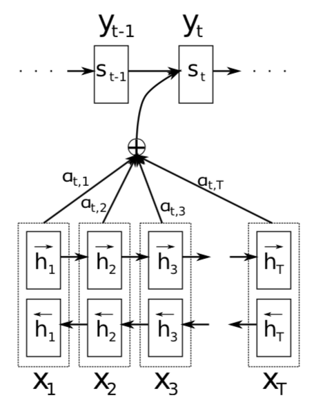

语义向量$c_i$由Encoder的隐向量$h_i$加权求和表示：
$$
c_i=\sum^{T_x}_{j=1}\alpha_{ij}h_j
$$
每个隐向量$h_j$对应的权重$\alpha_{ij}$可由下式计算得到：
$$
\alpha_{ij}=\frac{\text{exp}(e_{ij})}{\sum^{T_x}_{k=1}\text{exp}(e_{ik})}
$$
其中，
$$
e_{ij}=\alpha(s_{i-1},h_j)
$$
上式中的$s_{i-1}$就是上图中的$h^{'}_{i-1}$。

这个$\alpha$具体怎么算，有不同的方法，论文里是用了神经网络去算，
$$
e_{ij}=\alpha(s_{i-1},h_j)=v^T\text{tanh}(Ws_{i-1}+Vh_j)
$$
还可以用二次型矩阵来计算：
$$
e_{ij}=\alpha(s_{i-1},h_j)=s_{i-1}W_{i-1,j}h_j
$$
通过训练，注意力机制可以对关系较大的输入输出的赋以较大权重（两者在转换中对齐的概率更大），对位置信息进行了建模，而因此减少了信息损失，能专注于更重要的信息进行序列预测。

我们可以看到，attention的效果如下图所示，确实是不同单词的注意力是不一样的。

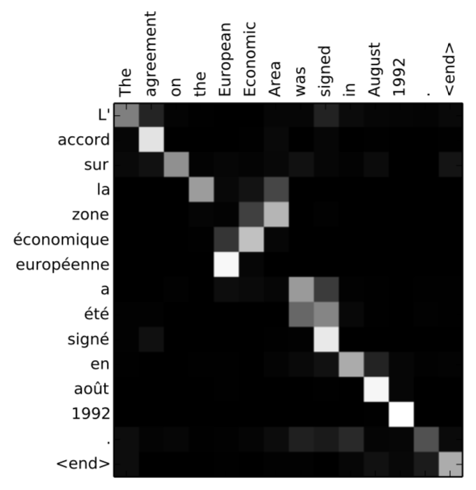

这是Attention Mechanism第一次找到很合适的用武之地。在BERT中，还会用到Attention Mechanism。

# 参考资料

* [详解从 Seq2Seq模型、RNN结构、Encoder-Decoder模型 到 Attention模型](https://blog.csdn.net/wshixinshouaaa/article/details/80085668)

本文参考了此博客。

* [从seq2seq到谷歌BERT，浅谈对Attention Mechanism的理解](https://blog.csdn.net/weixin_39671140/article/details/88240612)

对注意力机制的解释参考了此博客。

* [自然语言处理中的Attention Model：是什么及为什么](https://blog.csdn.net/malefactor/article/details/50550211)
* [以Attention Model为例谈谈两种研究创新模式](https://blog.csdn.net/malefactor/article/details/50583474)

这两个还没看，但是这是张俊林写的需要好好看看。所以就列在这了。

===

[Seq2Seq 与attention机制 网易公开课](https://study.163.com/course/courseMain.htm?courseId=1006498029)

[如何理解Seq2Seq？](http://f.dataguru.cn/thread-907291-1-1.html)

[完全图解RNN、RNN变体、Seq2Seq、Attention机制](https://zhuanlan.zhihu.com/p/28054589)

[Seq2Seq学习笔记](https://blog.csdn.net/jerr__y/article/details/53749693)

Seq2Seq 模型分析

首先介绍几篇比较重要的 Seq2Seq 相关的论文： 
[1] Cho et al., 2014 . Learning Phrase Representations using RNN Encoder-Decoder for Statistical Machine Translation 
[2] Sutskever et al., 2014. Sequence to Sequence Learning with Neural Networks 
[3] Bahdanau et al., 2014. Neural Machine Translation by Jointly Learning to Align and Translate 
[4] Jean et. al., 2014. On Using Very Large Target Vocabulary for Neural Machine Translation 
[5] Vinyals et. al., 2015. A Neural Conversational Model[J]. Computer Science

[NLP之Seq2Seq](https://blog.csdn.net/qq_32241189/article/details/81591456)

[翻译系统/聊天机器人Seq2Seq模型+attention](https://blog.csdn.net/weixin_37479258/article/details/99887469)

[真正的完全图解Seq2Seq Attention模型](https://zhuanlan.zhihu.com/p/40920384)

[从seq2seq到谷歌BERT，浅谈对Attention Mechanism的理解](https://blog.csdn.net/weixin_39671140/article/details/88240612)

[tensorflow2.0官网demo学习笔记 基于attention的seq2seq机器翻译](https://blog.csdn.net/ziyi9663/article/details/109989814)

这个有tf官网的代码，有空跑起来试试。

[目前主流的attention方法都有哪些？ 张俊林](https://www.zhihu.com/question/68482809/answer/264632289)

张俊林写的，已经看过了其注意力模块，有空仔细看后半部分的自注意力部分。

[目前主流的attention方法都有哪些？「Attention九层塔——理解Attention的九层境界」](https://www.zhihu.com/question/68482809/answer/1876764572)

