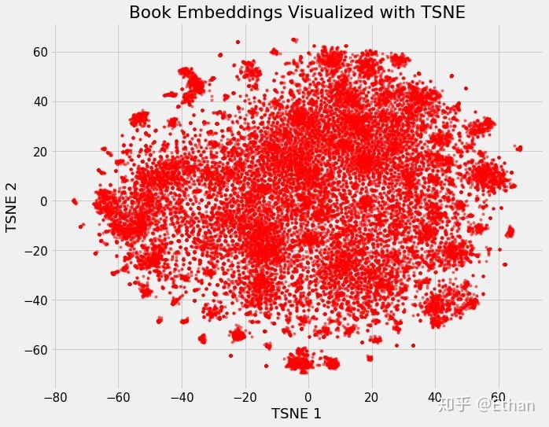

# word2vector实践

* [返回上层目录](../word2vec.md)

# 原版word2vec实践

官方使用说明：[word2vec](https://code.google.com/archive/p/word2vec/)，这个并没有实践过，只是放在这里，下面是经过实践检验的：

下面的介绍仅仅适用于linux系统，windows其实也差不多，只是不能用sh语言了，需要自己去手动编译和运行程序或者自己写bat语言。

## 下载源码

github:[dav/word2vec](https://github.com/dav/word2vec)

## 下载训练数据

下载训练数据：[text8.zip](http://mattmahoney.net/dc/text8.zip)，用`unzip text8.zip`将其解压缩到`\data`文件夹中，文件名为text8，这个解压后的文件text8就是模型训练需要的数据了。

其实在sh文件中会自动下载text8，但是还是自己先下载下来吧。

## 开始训练模型

（1）由c源码生成可执行文件

两种方法：

第一种方法：进入word2vec的根目录，然后命令行运行`make build`把`\src`文件夹中的c文件编译为可执行文件放到`\bin`文件夹中。

第二种方法：进入word2vec\src目录，然后命令行运行`make`把`\src`文件夹中的c文件编译为可执行文件放到`\bin`文件夹中。

（2）运行可执行文件开始训练模型

进入根目录下的`\scripts`文件夹，然后运行sh文件demo-classes.sh：`sh demo-classes.sh`，等待程序运行完毕（可能需要五分钟到一个小时之间，看机器性能）。

## 得到结果文件

等训练结束后，会在`\data`文件夹中生成两个文件：classes.txt和classes.sorted.txt，其中classes.txt就是我们需要的文件。打开就能看到每个单词训练的embedding向量了。

## 查看TopN相似度

进入根目录下的`\scripts`文件夹，然后运行sh文件demo-word.sh：`sh demo-word.sh`，然后按照提示输入单词，查看与其相近的前40个词及相似程度。

相似程度的代码是distance.c，很简单，有个博客有对这个代码的注释：[Word2Vec代码注解-distance](https://blog.csdn.net/a785143175/article/details/23771625)

# embedding的可视化

##TSNE降维

Embedding最酷的一个地方在于它们可以用来可视化出表示的数据的相关性，当然要我们能够观察，需要通过降维技术来达到2维或3维。最流行的降维技术是：t-Distributed Stochastic Neighbor Embedding (TSNE)。

我们可以定义维基百科上所有书籍为原始37000维（one-hot编码），使用neural network embedding将它们映射到50维，然后使用TSNE将它们映射到2维，其结果如下：

这样看好像并不能看出什么，但是如果我们根据不同书籍的特征着色，我们将可以很明显的看出结果。

我们可以清楚地看到属于同一类型的书籍的分组。虽然它并不完美，但惊奇的是，我们只用2个数字就代表维基百科上的所有书籍，而在这些数字中仍能捕捉到不同类型之间的差异。这代表着embedding的价值。

## TensorFlow-projector

静态图的问题在于我们无法真正探索数据并调查变量之间的分组或关系。 为了解决这个问题，TensorFlow开发了 [projector](https://projector.tensorflow.org/)，这是一个在线应用程序，可以让我们可视化并与embedding交互。 结果如下：

Embedding的基本内容如前面介绍所示，然而我想说的是它的价值并不仅仅在于word embedding或者entity embedding，这种将类别数据用低维表示且可自学习的思想更存在价值。通过这种方式，我们可以将神经网络，深度学习用于更广泛的领域，Embedding可以表示更多的东西，而这其中的关键在于要想清楚我们需要解决的问题和应用Embedding表示我们得到的是什么。

## google-tensorboard

词的分布，推荐用google的[tensorboard](https://www.tensorflow.org/tensorboard/r1/summaries)，可以多视角查看，如果不想搭建服务，直接访问[TensorFlow-projector](http://projector.tensorflow.org/)。另外可以用python的matplotlib。

# word2vec的参数选择

[word2vec你可能不知道的秘密](https://blog.csdn.net/xiaojiayudst/article/details/84668729)

# 参考资料

* [使用word2vec（C语言版本）训练中文语料 并且将得到的vector.bin文件转换成txt文件](https://blog.csdn.net/zwwhsxq/article/details/77200129)
* [Deep Learning 实战之 word2vec](https://kexue.fm/usr/uploads/2017/04/146269300.pdf)
* [word2vec 入门教程](https://blog.csdn.net/bitcarmanlee/article/details/51182420)
* [word2vec-google code](https://code.google.com/archive/p/word2vec/)

“原版word2vec实践”参考了上述资料。

* [Embedding 的理解](https://zhuanlan.zhihu.com/p/46016518)
* [关于word2vec，我有话要说](https://zhuanlan.zhihu.com/p/29364112)

“embedding的可视化”参考了该知乎专栏文章。

