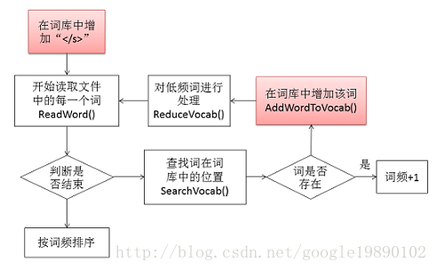
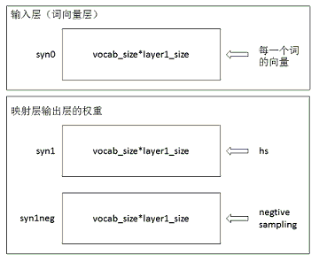
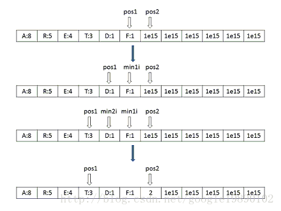
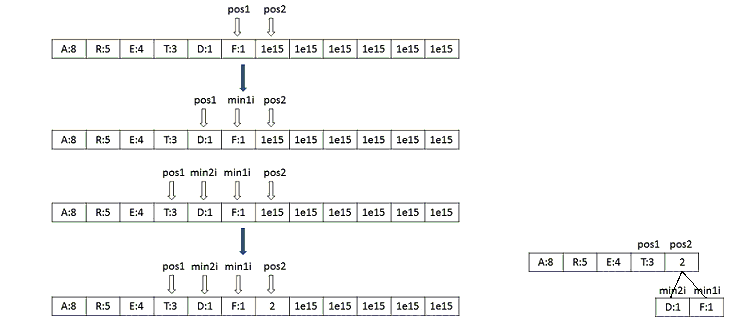
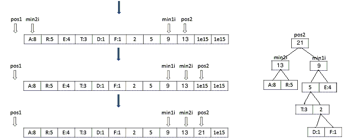
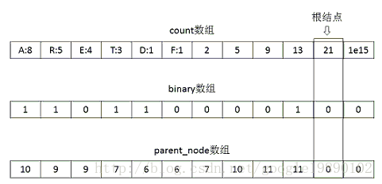

# word2vec源码解析

* [返回上层目录](../word2vec.md)


在阅读本文之前，建议首先阅读上一小节的“word2vec的算法原理”，掌握如下的几个概念：

* 什么是统计语言模型
* 神经概率语言模型的网络结构
* CBOW模型和Skip-gram模型的网络结构
* Hierarchical Softmax和Negative Sampling的训练方法
* Hierarchical Softmax与Huffman树的关系

有了如上的一些概念，接下来就可以去读word2vec的源码。在源码的解析过程中，对于基础知识部分只会做简单的介绍，而不会做太多的推导，原理部分会给出相应的参考地址。

在wrod2vec工具中，有如下的几个比较重要的概念：

* CBOW

* Skip-Gram

* Hierarchical Softmax

* Negative Sampling

其中CBOW和Skip-Gram是word2vec工具中使用到的两种不同的语言模型，而Hierarchical Softmax和Negative Sampling是对以上的两种模型的具体的优化方法。

# word2vec源码

* GitHub:[dav/word2vec](https://github.com/dav/word2vec)
* Google-Code:[google-code:word2vec](https://code.google.com/archive/p/word2vec/)

# word2vec流程图

在word2vec工具中，主要的工作包括：

* 预处理。即变量的声明，全局变量的定义等；
* 构建词库。即包含文本的处理，以及是否需要有指定词库等；
* 初始化网络结构。即包含CBOW模型和Skip-Gram模型的参数初始化，Huffman编码的生成等；
* 多线程模型训练。即利用Hierarchical Softmax或者Negative Sampling方法对网络中的参数进行求解；
* 最终结果的处理。即是否保存和以何种形式保存。

对于以上的过程，可以由下图表示：


在接下来的内容中，将针对以上的五个部分，详细分析下在源代码中的实现技巧，以及简单介绍我在读代码的过程中对部分代码的一些思考。

# 预处理


# 构建词库

在word2vec源码中，提供了两种构建词库的方法，分别为：

- 指定词库：ReadVocab()方法
- 从词的文本构建词库：LearnVocabFromTrainFile()方法

## 构建词库的过程

### 从指定词库生成词库

### 从词的文本构建词库

在这里，我们以从词的文本构建词库为例（函数LearnVocabFromTrainFile()）。构建词库的过程如下所示：



## 对词的哈希处理

## 对低频词的处理


## 根据词频对词库中的词排序

# 初始化网络结构

有了以上的对词的处理，就已经处理好了所有的训练样本，此时，便可以开始网络结构的初始化和接下来的网络训练。网络的初始化的过程在InitNet()函数中完成。

## 初始化网络参数

在初始化的过程中，主要的参数包括词向量的初始化和映射层到输出层的权重的初始化，如下图所示：



在初始化的过程中，映射层到输出层的权重都初始化为0，而对于每一个词向量的初始化，作者的初始化方法如下代码所示：

```c
for (a = 0; a < vocab_size; a++) for (b = 0; b < layer1_size; b++) {
    next_random = next_random * (unsigned long long)25214903917 + 11;
    // 1、与：相当于将数控制在一定范围内
    // 2、0xFFFF：65536
    // 3、/65536：[0,1]之间
    syn0[a * layer1_size + b] = (((next_random & 0xFFFF) / (real)65536) - 0.5) / layer1_size;// 初始化词向量
}
```

首先，生成一个很大的next_random的数，通过与“0xFFFF”进行与运算截断，再除以65536得到\[0,1\]之间的数，最终，得到的初始化的向量的范围为：\[−0.5/m,0.5/m\]，其中，m为词向量的长度。

## Huffman树的构建

word2vec里是拿数组实现word2vec，效率很高，在学校里经常见到的是递归迭代实现Huffman树，这对于处理大量叶子节点的问题不是一个最佳方法。 

在层次Softmax中需要使用到Huffman树以及Huffman编码，因此，在网络结构的初始化过程中，也需要初始化Huffman树。在生成Huffman树的过程中，首先定义了3个长度为vocab_size\*2+1的数组：

```c
long long *count = (long long *)calloc(vocab_size * 2 + 1, sizeof(long long));
long long *binary = (long long *)calloc(vocab_size * 2 + 1, sizeof(long long));
long long *parent_node = (long long *)calloc(vocab_size * 2 + 1, sizeof(long long));
```

其中，count数组中前vocab_size存储的是每一个词的对应的词频，后面初始化的是很大的数，已知词库中的词是按照降序排列的，因此，构建Huffman树的过程如下所示（对于Huffman树的原理，可以参见博文“[数据结构和算法——Huffman树和Huffman编码](http://blog.csdn.net/google19890102/article/details/54848262)”）：



首先，设置两个指针pos1和pos2，分别指向最后一个词和最后一个词的后一位，从两个指针所指的数中选出最小的值，记为min1i，如果pos1所指的值最小，则此时将pos1左移，再比较pos1和pos2所指的数，选择出最小的值，记为min2i，**将它们的和存储到pos2所指的位置。并将此时pos2所指的位置设置为min1i和min2i的父节点**，同时，记min2i所指的位置的编码为1，如下代码所示：

```c
// 设置父节点
parent_node[min1i] = vocab_size + a;
parent_node[min2i] = vocab_size + a;
binary[min2i] = 1;// 设置一个子树的编码为1
```

完整的过程如下图所示：






构建好Huffman树后，此时，需要根据构建好的Huffman树生成对应节点的Huffman编码。假设，上述的数据生成的最终的Huffman树为：


此时，count数组，binary数组和parent_node数组分别为：



在生成Huffman编码的过程中，针对每一个词（词都在叶子节点上），从叶子节点开始，将编码存入到code数组中，如对于上图中的“R”节点来说，其code数组为{1,0}，再对其反转便是Huffman编码：

```c
vocab[a].codelen = i;// 词的编码长度
vocab[a].point[0] = vocab_size - 2;
for (b = 0; b < i; b++) {
    vocab[a].code[i - b - 1] = code[b];// 编码的反转
    vocab[a].point[i - b] = point[b] - vocab_size;// 记录的是从根结点到叶子节点的路径
}
```

注意：这里的Huffman树的构建和Huffman编码的生成过程写得比较精简。

## 负样本选中表的初始化

如果是采用负采样的方法，此时还需要初始化每个词被选中的概率。在所有的词构成的词典中，每一个词出现的频率有高有低，我们希望，对于那些高频的词，被选中成为负样本的概率要大点，同时，对于那些出现频率比较低的词，我们希望其被选中成为负样本的频率低点。这个原理于“轮盘赌”的策略一致。在程序中，实现这部分功能的代码为：

```c
// 生成负采样的概率表
void InitUnigramTable() {
        int a, i;
        double train_words_pow = 0;
        double d1, power = 0.75;
        table = (int *)malloc(table_size * sizeof(int));// int --> int
        for (a = 0; a < vocab_size; a++) train_words_pow += pow(vocab[a].cn, power);
        // 类似轮盘赌生成每个词的概率
        i = 0;
        d1 = pow(vocab[i].cn, power) / train_words_pow;
        for (a = 0; a < table_size; a++) {
                table[a] = i;
                if (a / (double)table_size > d1) {
                        i++;
                        d1 += pow(vocab[i].cn, power) / train_words_pow;
                }
                if (i >= vocab_size) i = vocab_size - 1;
        }
}
```

# 多线程模型训练


# TensorFlow上构建Word2Vec词嵌入模型

* [在TensorFlow上构建Word2Vec词嵌入模型](https://zhuanlan.zhihu.com/p/42067012)

本文详细介绍了 word2vector 模型的模型架构，以及 TensorFlow 的实现过程，包括数据准备、建立模型、构建验证集，并给出了运行结果示例。


# 参考资料

* [机器学习算法实现解析——word2vec源码解析](https://blog.csdn.net/google19890102/article/details/51887344)

"word2vec源码解析"一节主要参考此文章。

* [深度学习笔记——Word2vec和Doc2vec原理理解并结合代码分析](https://blog.csdn.net/mpk_no1/article/details/72458003)

从此文知道了Huffman树的作用和HS的负反馈就是其哈夫曼树的根结点。

* [word2vec之源码注释](http://suhui.github.io/word2vec)
* [基于深度学习的自然语言处理（Word2vec源码分析-2上）](https://zhuanlan.zhihu.com/p/40557458)
* [基于深度学习的自然语言处理（Word2vec源码分析-2下）](https://zhuanlan.zhihu.com/p/40558913)

* [word2vec 源代码 完整注释](https://blog.csdn.net/jingquanliang/article/details/82886645)
* [word2vec源码解析之word2vec.c](https://blog.csdn.net/lingerlanlan/article/details/38232755)

源码注释参考上述几个文档。

* [word2vec使用说明](http://jacoxu.com/word2vector/)

这是word2vec的使用说明。


---


## 代码

[word2vec代码流程图](https://www.processon.com/diagraming/5c3f5691e4b08a7683aa7ac5)

[word2vec之源码注释](http://suhui.github.io/word2vec)

[基于深度学习的自然语言处理（Word2vec源码分析-2上）](https://zhuanlan.zhihu.com/p/40557458)

[基于深度学习的自然语言处理（Word2vec源码分析-2下）](https://zhuanlan.zhihu.com/p/40558913)

[word2vec源码解析之word2vec.c](https://blog.csdn.net/lingerlanlan/article/details/38232755)

[word2vec 源代码 完整注释](https://blog.csdn.net/jingquanliang/article/details/82886645)

[word2vec 源码分析word2vec.c](https://blog.csdn.net/leiting_imecas/article/details/72303044)


代码架构讲解分析：

[机器学习算法实现解析——word2vec源码解析](https://blog.csdn.net/google19890102/article/details/51887344)


局部代码解读：

[word2vec源码阅读-词典的建立](http://pskun.github.io/machine%20learning/word2vec-source-code-analysis.html)


具体使用：

[使用word2vec（C语言版本）训练中文语料 并且将得到的vector.bin文件转换成txt文件](https://blog.csdn.net/zwwhsxq/article/details/77200129)


---

原始

http://suhui.github.io/word2vec
http://pskun.github.io/machine%20learning/word2vec-source-code-analysis.html
https://zhuanlan.zhihu.com/p/40557458
https://zhuanlan.zhihu.com/p/40558913
http://jacoxu.com/word2vector/
https://blog.csdn.net/lingerlanlan/article/details/38232755
https://blog.csdn.net/google19890102/article/details/51887344
https://blog.csdn.net/jingquanliang/article/details/82886645
https://www.processon.com/diagraming/5c3f5691e4b08a7683aa7ac5

https://blog.csdn.net/lingerlanlan/article/details/38232755
https://blog.csdn.net/mpk_no1/article/details/72458003
https://blog.csdn.net/leiting_imecas/article/details/72303044
https://www.zhihu.com/question/21661274
https://blog.csdn.net/zwwhsxq/article/details/77200129


