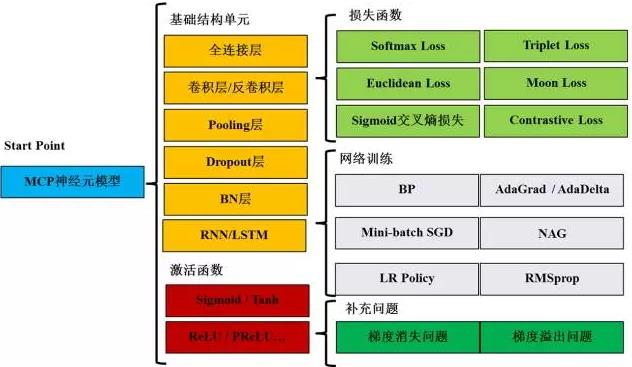
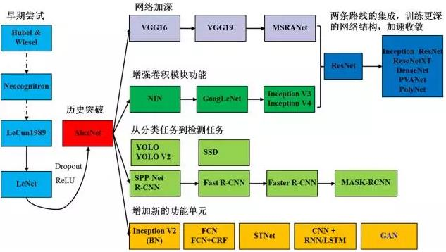

# 机器学习的学习路径

* [返回上层目录](../perface.md)
* [快速入门机器学习](#快速入门机器学习)
  * [背景](#背景)
  * [自学机器学习的误区和陷阱](#自学机器学习的误区和陷阱)
    * [不要试图掌握所有的相关数学知识再开始学习](#不要试图掌握所有的相关数学知识再开始学习)
    * [不要把深度学习作为入门的第一门课](#不要把深度学习作为入门的第一门课)
    * [不要收集过多的资料&分辨资料的时效性](#不要收集过多的资料&分辨资料的时效性)
  * [机器学习的一些前期准备](#机器学习的一些前期准备)
    * [硬件选择](#硬件选择)
    * [软件选择](#软件选择)
    * [语言能力](#语言能力)
  * [机器学习课程表](#机器学习课程表)
    * [第一阶段：基础入门（3-6个月）](#第一阶段：基础入门（3-6个月）)
    * [第二阶段：进阶学习（3-6个月）](#第二阶段：进阶学习（3-6个月）)
    * [第三阶段：深度学习（3-6个月）](#第三阶段：深度学习（3-6个月）)
    * [第四阶段：深入研究](#第四阶段：深入研究)
  * [实践经验](#实践经验)
    * [研究经历](#研究经历)
    * [企业实习](#企业实习)
    * [在本职工作中使用机器学习](#在本职工作中使用机器学习)
  * [写在最后](#写在最后)
* [机器学习需要参考哪些书](#机器学习需要参考哪些书)
* [机器学习的学习路径](#机器学习的学习路径)
  * [ML数学基础](#ML数学基础)
  * [Python基础](#Python基础)
  * [机器学习算法讲解](#机器学习算法讲解)
  * [深度学习](#深度学习)
  * [人工智能综合项目实战](#人工智能综合项目实战)
  * [开源项目](#开源项目)
  * [会议论文](#会议论文)
  * [自由学习](#自由学习)
  * [总结](#总结)
* [深度学习的学习路径](#深度学习的学习路径)
  * [DL数学基础](#DL数学基础)
  * [计算机基础](#计算机基础)
  * [深度学习入门](#深度学习入门)
  * [深度学习实战经验](#深度学习实战经验)
  * [深度学习前沿](#深度学习前沿)

# 快速入门机器学习

本文摘自知乎专栏[如何用3个月零基础入门机器学习？](https://zhuanlan.zhihu.com/p/29704017)

## 背景

写这篇文章的初衷是大部分私信我的朋友都想了解**如何入门/转行机器学习**，搭上人工智能这列二十一世纪的快车。再加上这个问题每隔一阵子就会在知乎时间线上出现一次，因此想写一篇文章来“一劳永逸”的分享我的观点。

**文章的宗旨是：1. 指出一些自学的误区 2. 不过多的推荐资料 3. 提供客观可行的学习表 4. 给出进阶学习的建议。**这篇文章的目标读者是计划零基础自学的朋友，对数学/统计基础要求不高，比如：

- 在读的学生朋友
- 非计算机行业的读者
- 已经工作但想将机器学习/数据分析和自己的本职工作相结合的朋友

因此，这篇文章对于已经身处机器学习领域可能帮助不大。同时再次声明这只是我的个人看法，请大家有选择的性阅读，探索适合自己的学习方法。

## 自学机器学习的误区和陷阱

### 不要试图掌握所有的相关数学知识再开始学习

在很多[相关的回答](https://www.zhihu.com/question/60064269/answer/172305599)中，我都一再强调不要试图补足数学知识再开始学习机器学习。一般来说，大部分机器学习课程/书籍都要求：

- 线性代数：矩阵/张量乘法、求逆，奇异值分解/特征值分解，行列式，范数等
- 统计与概率：概率分布，独立性与贝叶斯，最大似然(MLE)和最大后验估计(MAP)等
- 优化：线性优化，非线性优化(凸优化/非凸优化)以及其衍生的求解方法如梯度下降、牛顿法、基因算法和模拟退火等
- 微积分：偏微分，链式法则，矩阵求导等
- 信息论、数值理论等

一般人如果想要把这些知识都补全再开始机器学习往往需要很长时间，容易半途而废。而且这些知识是工具不是目的，我们的目标又不是成为运筹学大师。**建议在机器学习的过程中哪里不会补哪里，这样更有目的性且耗时更低。**

### 不要把深度学习作为入门的第一门课

虽然很多人都是冲着深度学习来的，但把深度学习作为机器学习第一课不是个好主意。原因如下：

- 深度学习的黑箱性更加明显，很容易学得囫囵吞枣
- 深度学习的理论/模型架构/技巧还在一直变化当中，并未尘埃落定
- 深度学习实验对硬件要求高，不太适合自学或者使用个人电脑进行学习

更多讨论可以看我的回答：[阿萨姆：深度学习的教学和课程，与传统 CS 的教学和课程有什么区别？](https://www.zhihu.com/question/63883727/answer/225499427)

### 不要收集过多的资料&分辨资料的时效性

机器学习的资料很多，动辄就有几个G的材料可以下载或者观看。而很多朋友都有“收集癖”，一下子购买十几本书的人我也常常能够看到。

机器学习的发展和变化速度很快。在入门期间，**建议“小而精”的选择资料，选择近期出版的且口碑良好的书籍**。我不止一次的提到这个例子：

> 在很多深度学习的教科书中，尤其是10年以前的教科书中都还依然把Sigmoid当作默认的激活函数。但事实上，整流函数(ReLu)以及其拓展变形函数，如Leaky ReLu早就成为了主流的深度学习激活函数。但因为知识的滞后性，很多课程/书籍甚至都没有介绍ReLu的章节。

一般来说，我比较推荐近5年内出版的书籍，或者10年以后出版的书籍。有些书籍虽然是经典，比如Tom Mitchell的《机器学习》，但因为其出版已经超过20年，还是不建议大家购买。

在这篇文章中我所推荐的书籍和课程都相对比较经典，同时属于紧跟时代潮流的。入门阶段我推荐了1门课程和2本书，进阶阶段推荐了1本书，深度学习推荐了1门课程一本书，高级阶段推荐了2本额外书籍。

## 机器学习的一些前期准备

### 硬件选择

另一个大家常问的问题是：是否可以用自己的笔记本电脑进行机器学习。答案是肯定的，大部分市面上的数据集都可以放到你的内存中运行。在入门阶段，我们很少会用到非常大的数据集，一般最大也就是MNIST，完全可以使用个人笔记本电脑进行运行。

请不要打着学习的名义重新购买机器...

### 软件选择

如果要做深度学习，Linux还是首选，因为其对很多学习模型支持比较好（主要是深度学习的Library）。但即使你使用的是Windows系统，也可以用虚拟机装Ubuntu来进行学习。小型的深度学习模型足够了，大型的深度学习我们很少在本地/个人计算机上运行。

至于编程语言，首推Python，因为其良好的拓展支持性，主流的工具包都有Python版本。在特定情况下，选择R作为编程语言也是可以的。其他可能的语言还包括C++、Java和Matlab，但我个人不大推荐。

此处也想额外提一句，因为编程属于机器学习基本要求之一，所以推荐大家可以自学一些基础编程的知识(如Python)，在文中不再赘述。

### 语言能力

学好英语，至少打下阅读和听力的基础。**虽然人工智能领域中国现在已经做得很不错，但主流的书籍、期刊和会议，资料都是英文的**。我们可以接受翻译版，但最好的方法还是自己有能力直接阅读。即使你将来不做机器学习，英文阅读能力还是会有很大的帮助。

## 机器学习课程表

### 第一阶段：基础入门（3-6个月）

入门的第一步是学习一些经典课程并配套经典书籍，一般来说这个过程在半年之内比较合适。在这个部分我介绍的课程和书籍都属于难度非常低的，对数学和编程都没什么太大的要求。

**吴恩达Cousera机器学习课程**

Andrew Ng的机器学习课程（[Machine Learning | Coursera](www.coursera.org/learn/machine-learning)）是很多人的启蒙课程，难度适中且完全免费。Coursera上总共有49285个人给出了评分，平均得分4.9分，满分5分。据我个人观察，大部分Coursera上的课程评分处于4-4.5分之间，能做到4.9分的课程寥寥无几。另一个值得关注的是，这门课有接近五万人给出评分，统计学知识告诉我们这个样本较大所以评分应该趋近于其真实值，比较可信。根据Freecodecamp的[统计](https://medium.freecodecamp.org/every-single-machine-learning-course-on-the-internet-ranked-by-your-reviews-3c4a7b8026c0)，这门课是所有在线Machine Learning课程中最受到大家好评的课程。另一个比较直接的观察是如果大家在知乎上搜索“机器学习如何入门？”，大部分答案都提到了Andrew的这门入门课程，所以这是一门绝对的口碑课程。

**Python机器学习 & Introduction to Statistical Learning with R**

在学习吴恩达的在线课程时，推荐同时阅读相关的机器学习书籍**补充理论知识**。我再次推荐这两本非常好的入门书籍，在我的专栏也有对于这两本书的介绍。

- **Python机器学习**：这本书出版于2015年并多次再版，在亚马逊中国上我们可以找到影印版和翻译版。这本书去掉了大量的数学推导的部分，仅保留了机器学习的核心应用。阅读本书可以快速对如何使用Python机器学习框架Sklearn有一个基本的了解，可以很快上手开始工作。本书涉及的内容很广泛，虽然只有400多页，但内容涉及了数据预处理(Data Preprocessing), 维度压缩和核函数(Dimension Reduction & Kernel)，评估方法如交叉验证，集成学习，情感分析，聚类，甚至还包括了神经网络和Theano。更多介绍：[带你读机器学习经典(三): Python机器学习(Chapter 1&2)](https://zhuanlan.zhihu.com/p/28647608)
- **Introduction to Statistical Learning with R（ISL）**：相信正在机器学习苦海中遨游的朋友们肯定都听过大名鼎鼎的The Element of Statistical Learning, 这本频率学派的统计学习“圣经”被大家叫做ESL。而ISL正是基于满足更广大阅读人群的目的而推出的；ISL是ESL的入门版，不仅大量的去除了繁复的数学推导，还加入了R编程的部分，方便大家可以尽快上手。**这本书是我推荐书单第一名**：ISL的电子版是免费的：[点击下载](http://www-bcf.usc.edu/~gareth/ISL/ISLR%20First%20Printing.pdf)。更多介绍：[带你读机器学习经典(一): An Introduction to Statistical Learning (Chapter 1&2)](https://zhuanlan.zhihu.com/p/27556007)

**周志华《机器学习》**

周志华老师的《机器学习》也被大家亲切的叫做“西瓜书”。虽然只有几百页，但内容涵盖比较广泛。然而和其他人的看法不同**，我建议把西瓜书作为参考书而不是主力阅读书**。西瓜书因为篇幅的限制，涵盖了很多的内容但无法详细的展看来讲，对于初学者自学来说实际阅读很大。这本书更适合作为学校的教材或者中阶读者自学使用，入门时学习这本书籍难度稍微偏高了一些。

我个人建议的用法是在学习网课和阅读ISL遇到疑惑时可以参考西瓜书的相关章节，但入门阶段没有必要一章一章的阅读，建议在这个阶段只阅读前十章即可。

### 第二阶段：进阶学习（3-6个月）

在这个阶段，你已经对机器学习有了基本的了解。如果你认真的阅读了ISL并上完了吴恩达的课程，我相信你已经在理论上明白了什么是线性回归，什么是数据压缩，对特征工程以及简单的回归/预测问题有了理论上的基础。这个时候最重要的就是进行实践！

**Kaggle挑战赛/练习**

Kaggle（[Your Home for Data Science](https://www.kaggle.com/)）在数据分析领域早已大名鼎鼎，甚至可以说是数据分析第一社区，前一阵子刚刚被谷歌收购。Kaggle上有很多很好的数据集和挑战赛，你可以尝试这些挑战取得名次，甚至拿到奖金，对于将来找工作也非常有帮助。而且Kaggle的另一大优势是网友会分享他们的经验和看法，你也可以提出问题让大家来帮你提出一些修正方法。

国内也有类似的平台，比如天池大数据竞赛，其他类似的平台还包括DataCastle。

**使用Kaggle的目的主要是将技能落在实处，防止练就一身屠龙之技。机器学习最大的幻觉就是觉得自己什么都懂了，但等到真的使用时发现并不奏效**，而Kaggle是一个低成本的应用机器学习的机会。

**Sklearn文档学习**

Sklearn([scikit-learn: machine learning in Python](http://scikit-learn.org/stable/))是Python上最流行的机器学习/数据科学工具包，上文介绍的Python Machine Learning书中就大量使用Sklearn的API。和使用Kaggle的目的一致，学习的Sklearn的文档也是一种实践过程。比较推荐的方法是把主流机器学习模型Sklearn中的例子都看一遍。

Sklearn的文档是少数写的跟教程一样的技术文档，很具有阅读价值。举个简单的例子，假设你想学习Python中使用逻辑回归，就可以参考: [Logistic Regression 3-class Classifier](http://scikit-learn.org/stable/auto_examples/linear_model/plot_iris_logistic.html#sphx-glr-auto-examples-linear-model-plot-iris-logistic-py)

Sklearn的文档不仅提供了练习数据、sklearn的相关代码实例，还提供了可视化图。

**周志华机器学习**

再次提到周老师是因为西瓜书是值得常常翻看的一本书，在kaggle挑战和阅读Sklearn文档的过程中你还会时不时的遇到一些新的名词，比如流形学习(manifold learning)等。这个时候你会发现西瓜书真的是一本中级阶段大而全的书籍:)

### 第三阶段：深度学习（3-6个月）

因为深度学习是当下的热点，很多公司都在寻找深度学习人才。虽然深度学习只是机器学习的一个子集，但有兴趣朝这个方向发展的朋友可以在完成以上学习后单独学习一下深度学习。

**吴恩达深度学习课程**

吴恩达在八月份的时候通过Deeplearning.ai和Coursera平台推出了最新系列的五门深度学习课程([deeplearning.ai](https://www.deeplearning.ai/))。有条件的朋友可以通过Coursera学习获得证书，最近网易云课堂也上线了这门课的翻译版。如果想要上其中的课程，需要先注册报名「深度学习工程师微专业」 [深度学习工程师微专业 - 一线人工智能大师吴恩达亲研-网易云课堂 - 网易云课堂](http://mooc.study.163.com/smartSpec/detail/1001319001.htm)，之后就可以分别点开每门课单独进行学习。和Coursera上的DL同步，现在云课堂也上线了五门中的前三门课程，而卷积网络(CNN)和循环网络(RNN)还未开放。

更多关于网易云课堂上深度学习课程的介绍可以看：[阿萨姆：如何评价网易云课堂上线的吴恩达Deep Learning课程？](https://www.zhihu.com/question/64615398/answer/222596302)

**Deep Learning -  by IanGoodFellow**

深度学习这本书是由当下深度学习领域的几位领军人物所著，包含三大巨头之一的Bengio，还有教父Hinton来作序推荐。这本书的中文本翻译由张志华教授团队负责，在github上免费放出了翻译版本，印刷版也可以从亚马逊中国上买到。

英文版：[Deep Learning](http://www.deeplearningbook.org/)

中文版：[exacity/deeplearningbook-chinese](https://github.com/exacity/deeplearningbook-chinese)

这本书的阅读建议：

- 为了补充基础可以阅读第1-5章其中也包含了一些数学知识
- 只关注主流神经网络知识可以阅读6-10章，介绍了DNN/CNN/RNN
- 需要进一步了解一些调参和应用技巧，推荐阅读11和12章

第13-20章为进阶章节，在入门阶段没有必要阅读。其实比较实际的做法是吴恩达的课程讲到什么概念，你到这本书里面可以阅读一些深入的理论进行概念加深，按章节阅读还是比较耗时耗力的。

### 第四阶段：深入研究

恭喜你！如果你已经完成了上面的计划表，代表你已经有了相当的机器学习能力。这个阶段，最重要的就是不要贪多嚼不烂。如果你浏览知乎，会发现大家都说你必须读Elements of Statistical Learning， MLAPP之类的大部头。我承认阅读这样的书会有帮助，但在你有了一定的基础知识后，相信你已经知道自己需要接着做什么了也有了志同道合的朋友，我希望把选择权交还给你，而不是继续推荐成堆的课程和书籍。当然，如果你希望继续深入的话，中文可以继续阅读周志华老师的《机器学习》和李航老师的《统计学习基础》，英文可以入手《Elements of Statistical Learning》。**在这个阶段，重点要形成成体系的知识脉络，切记贪多嚼不烂，切记！**

从阅读论文角度来说，订阅Arxiv，关注机器学习的顶级会议，如ICML/NIPS等，相关的方法在知乎上可以很容易搜索到，不在此赘述。

## 实践经验

### 研究经历

如果你还是学生，尝试尽早接触科研，进实验室。一般来说，大三的时候你应该已经有了基本的机器学习知识，尽管还比较浅。这个时候可以向老师/学长/学姐毛遂自荐进实验室，即使是无偿劳动和做基本的苦力活。进实验室有两个明显的好处：

- **对某个小方向会有比较深入的了解**。一般实验室做纯理论的不大需要本科生，做机器视觉或者自然语言处理(NLP)等小方向的比较需要本科生，所以这是很好的深入了解一个方向的机会。
- 补充了研究经历也可以明白自己是否适合这个领域。如果运气好的话，你也有可能成为论文的作者之一，甚至可以去开会(公款旅游顺道见一下业内大佬)。**这对于继续深造和去国外继续学习都很有帮助，有科研经历和论文是很大的筹码，对于找工作来说也绝对有利无害。**

### 企业实习

上文提到过，机器学习光说不练假把式，最好的方法还是要实践。**因此，应该先试着做科研，再尝试工业界实习。对待科研机会，有则就上，没有也不是太大的遗憾。**我建议大部分做机器学习的朋友尽早实习，主要出于以下几个考量：

- **打破幻想，了解工业界的主流模型**。在其他很多答案中我都提到过，其实工业界用的大部分技术并不酷炫，你很少能看到深度强化学习那种AlphaGo一样酷炫的模型。不夸张的说，广义线性模型(generalized linear models)还是占据了大壁江山，这要归功于其良好的解释能力。从神经网络角度出发，一般也逃不过普通任务深度网络、视觉任务卷积网络CNN、语音和文字任务LSTM的套路。
- **补上学术界忽视的内容，比如可视化和数据清洗**。工业界的最终目的是输出商业价值，而获得商业洞见的过程其实是非常痛苦的，比如第一步就是令人深恶痛绝的数据清洗。毫不夸张的说，工业界百分之六十的时间都在清理数据，这和学术界干净且规则化的现成数据完全不同。没有在工业界体验过的人，无法真的了解原来机器学习从头到尾有那么多陷阱，泛化能力只是终极目标，而往往我们连规整的数据都无法得到。
- **了解技术商业化中的取舍，培养大局观**。做技术的人往往一头扎进技术里面，而忽视了从全局思考。举个例子，模型A的准确率95.5%，每次训练时间是3天，需要6台有GPU的服务器。而模型B的准确率是百分之95.2%，但只需要一台普通的macbook训练4个小时就可以了。从学术角度出发我们往往追求更好的模型结果选A，而工业界还要考虑到训练开销、模型可解释性、模型稳定度等。到工业界实习不仅可以培养大家的宏观掌控能力，对将来自己带学生控制开销或者选题也大有帮助

### 在本职工作中使用机器学习

对于大部分已经工作的朋友来说，重新回到学校攻读学位并不现实，进研究室进行学习更是缺少机会。那么这个时候，你就可以试着把机器学习应用到你自己的工作当中。

已经有了工作/研究经验的朋友，要试着将自己的工作经历利用起来。举例，不要做机器学习里面最擅长投资的人，而要做金融领域中最擅长机器学习的专家，这才是你的价值主张(value proposition)。最重要的是，机器学习的基本功没有大家想的那么高不可攀，没有必要放弃自己的本专业全职转行，沉没成本太高。通过跨领域完全可以做到曲线救国，化劣势为优势，你们可能比只懂机器学习的人有更大的行业价值。

举几个我身边的例子，我的一个朋友是做传统软件工程研究的，前年他和我商量如何使用机器学习以GitHub上的commit历史来识别bug，这就是一个很好的结合领域的知识。如果你本身是做金融出身，在你补足上面基本功的同时，就可以把机器学习交叉运用于你自己擅长的领域，做策略研究，我已经听说了无数个“宣称”使用机器学习实现了交易策略案例。虽不可尽信，但**对特定领域的深刻理解往往就是捅破窗户的那最后一层纸，只理解模型但不了解数据和数据背后的意义，导致很多机器学习模型只停留在好看而不实用的阶段**。

## 写在最后

虽然人们曾说二十一是生物的世纪，但现在还是人工智能的世纪。欢迎大家来试试机器学习，体验数据分析的魅力。

就像我曾在很多回答中提到，机器学习领域应该要敞开大门，让每个人都可以尝试将机器学习知识应用于他们原本的领域，摒弃人为制造的知识壁垒。唯有这样，机器学习技术才能在更多的不同领域落地，从而反哺机器学习研究本身。

科技日新月异，追逐热点是好的。但在这个浮躁的时代，**不管选择什么方向最重要的就是独立思考的能力，和去伪存真的勇气。因此，看了这么多入门教程和经验分享后，我最希望的是你既不要急着全盘接受，也不要因为不对胃口全盘否定。慢下来，好好想想，制定适合自己的计划，这大概才是做科学工作的正确态度。**

**在思考之后，拒绝外界的噪音，无论是鼓励还是嘲笑。抱着“不撞南山不回头”的信念，继续朝机器学习的高峰攀登。**

**或许，科技领域正因为有了我们这群“书呆子”才显得尤为可爱 **ʕ•ᴥ•ʔ

# 机器学习需要参考哪些书

先看《统计学习方法》，然后《PRML》和《MLAPP》配合着一起看。

* **《机器学习》**周志华

* **《统计学习方法》**李航

  书薄，有些章节乱，整体很好。

* **《Pattern Recognition and Machine Learning》**Christopher M. Bishop

  中文名称：《模式识别与机器学习》，有中文版。

  早，全，厚，没中文版，写法是贝叶斯观点，不是频率学派的，读起来拗口，
  读完会对理论基础有用，强烈推荐，初学不建议，入门课程完了再读。

* **《Machine Learning: A Probabilistic Perspective》**Kevin P. Murphy

  梯度下降和共轭拟牛顿讲的比较好，和上一本《PRML》配合来看。

* **《Deep Learning》**Lan Goodfellow

* **《Convex Optimization》**Stephen Boyd

  SVM章节需要用到凸优化的知识，可参考本书。

* **《Elements of Information》**Thomas M. Cover

  “决策树和随机森林”章节需要用到信息论中的信息熵等知识，可参考本书。

* 各章节特定的经典论文：

  * **《Clustering by fast search and find of density peak》**Alex Rodriguez

    这篇论文是发表在science上的。

  * **《Latent Dirichlet Allocation》**David M. Blei, Andrew Y. Ng

    这篇论文作者有吴恩达。

* 深度学习未必就是未来的一定主流，至少一些大牛是这么认为的。传统的机器学习有如下特点，知识系统化，有相对经典的书。其中统计学习（代表SVM）与集成学习（代表adaboost）是在实践中使用非常多的技术。下面是相关资源：

  - 推荐，机器学习(周志华)：如果是在以前，机器学习方面的经典教材首推PRML，但现在周老师的书出来以后，就不再是这样了。首先推荐读周老师的书。这本书有一个特点，那就是再难的道理也能用浅显精炼的语言表达出来。正如周老师的名言：“体现你水平的地方是把难的东西讲容易了，而不是把容易的东西讲难，想把一个东西讲难实在太简单”；
  - 不推荐，Pattern Recognition And Machine Learning：当前阶段不推荐。PRML是以贝叶斯的观点看待很多机器学习方法，这也是它的一大特色。但对于初学者来说，这种观点其实并无必要。而且此书没有中文翻译，当前阶段硬啃很容易放弃；

****

下面讲机器学习和深度学习的学习路径，其实两者的学习路径基本是先后顺序，即先学完机器学习再学习深度学习。所以，下面两种路径可以合在一起看。

这个学习路线是这样设计的：

* 首先了解这个领域，建立起全面的视野，培养起充足的兴趣，然后开始学习机器学习的基础，这里选择一门由浅入深的课程来学习，课程最好有足够的实验能够进行实战。
* 基础打下后，对机器学习已经有了充足的了解，可以用机器学习来解决一个实际的问题。这时还是可以把机器学习方法当作一个黑盒子来处理的。
* 实战经验积累以后，可以考虑继续进行学习。这时候有两个选择，深度学习或者继续机器学习。深度学习是目前最火热的机器学习方向，其中一些方法已经跟传统的机器学习不太一样，因此可以单独学习。除了深度学习以外，机器学习还包括统计学习，集成学习等实用方法。如果条件足够，可以同时学习两者，一些规律对两者是共通的。
* 学习完后，你已经具备了较强的知识储备，可以进入较难的实战。这时候有两个选择，工业界的可以选择看开源项目，以改代码为目的来读代码；学术界的可以看特定领域的论文，为解决问题而想发论文。无论哪者，都需要知识过硬，以及较强的编码能力，因此很能考察和锻炼水平。
* 经过这个阶段以后，可以说是踏入AI领域的门了。“师傅领进门，修行在个人”。之后的路就要自己走了。

# 机器学习的学习路径

## ML数学基础

如果日常只编写增删改查的代码的话，那可能数学已经忘得差不多了，需要重温线性代数和微积分的基础知识，这会为之后的学习立下汗马功劳。

**数学分析**

- 常数e
- 极限、导数、拉格朗日中值定理
- 梯度
- Taylor
- 傅里叶变换
- gini系数
- 信息熵与组合数
- 梯度下降
- 牛顿法

推荐阅读吴军《数学之美》。

**概率论（大一大二学过有木有）**

- 微积分与逼近论
- 极限、微分、积分基本概念
- 利用逼近的思想理解微分，利用积分的方式理解概率
- 概率论基础
- 古典模型
- 常见概率分布
- 大数定理和中心极限定理
- 协方差(矩阵)和相关系数
- 最大似然估计和最大后验估计

高数+概率，这俩只要掌握基础就行了，比如积分和求导、各种分布、参数估计等等。（评论中有知友提到概率与数理统计的重要性，我举四肢赞成，因为cs229中几乎所有算法的推演都是从参数估计及其在概率模型中的意义起手的，参数的更新规则具有概率上的可解释性。对于算法的设计和改进工作，概统是核心课程，没有之一。答主这里想要说的是，当拿到现成的算法时，仅需要概率基础知识就能看懂，然后需要比较多的线代知识才能让模型高效的跑起来。比如最近做卷积的作业， 我手写的比作业里给出的带各种trick的fast函数慢几个数量级，作业还安慰我不要在意效率，岂可修！）

进一步还需要学习：

* 相关性分析（相关系数r、皮尔逊相关系数、余弦相似度、互信息）
* 回归分析（线性回归、L1/L2正则、PCA/LDA降维） 
* 聚类分析（K-Means） 
* 分布（正态分布、t分布、密度函数） 
* 指标（协方差、ROC曲线、AUC、变异系数、F1-Score） 
* 显著性检验（t检验、z检验、卡方检验） 
* A/B测试

这里推荐阅读李航的《统计学习方法》。

**线性代数及矩阵（大一大二学过有木有）**

- 线性空间及线性变换
- 矩阵的基本概念
- 状态转移矩阵
- 特征向量
- 矩阵的相关乘法
- 矩阵的QR分解
- 对称矩阵、正交矩阵、正定矩阵
- 矩阵的SVD分解
- 矩阵的求导
- 矩阵映射/投影

线性代数，非常重要，模型计算全靠它~一定要复习扎实，如果平常不用可能忘的比较多。直接看著名的——[麻省理工公开课：线性代数](http://open.163.com/special/opencourse/daishu.html)，深入浅出效果拔群，以后会用到的SVD、希尔伯特空间等都有介绍。

**凸优化（看不懂不要紧，掌握基础即可）**

- 凸优化基本概念
- 凸集
- 凸函数
- 凸优化问题标准形式
- 凸优化之Lagerange对偶化
- 凸优化之牛顿法、梯度下降法求解

## Python基础

**Python入门及实践课程**

- Python快速入门
- 科学计算库Numpy
- 数据分析处理库Pandas
- 可视化库Matplotlib
- 更简单的可视化Seaborn

**Python实践项目**

- Python爬虫项目

****

需要用到的编程知识也就是Matlab和Numpy了吧，Matlab是可以现学现卖的；至于Python，就看你想用来做什么了，如果就是用来做机器学习，完全可以一天入门，如果想要做更多好玩的事，一天不行那就两天。（贴一个Python/Numpy的简要教程：[Python Numpy Tutorial](https://cs231n.github.io/python-numpy-tutorial/)，是cs231n的课堂福利。）。

作为一个普通程序员，C++ / Java / Python 这样的语言技能栈应该是必不可少的，其中 Python 需要重点关注爬虫、数值计算、数据可视化方面的应用，主要是：

具体的python知识请看本笔记的python章节。

最最后，也要时刻关注能帮你偷懒的工具，它将让你拥有更多的时间去调参：[Python 网页爬虫 & 文本处理 & 科学计算 & 机器学习 & 数据挖掘兵器谱](http://python.jobbole.com/81153/)

****

关于计算机方面的基本功要求有：

* **Python 开发**
  * 控制语句（if, for, while, pass, assert, with, yield, import, in）
  * 类型（object, list, tuple, dict, set）
  * 表达式（lambda, 列表推导式）
  * 函数（map, reduce, filter, zip, sort, enumrate, isinstance）
  * 面向对象（类成员、实例化、构造函数、析构函数、继承、派生、多态、super）
  * 数值计算（numpy、scipy、pandas、sklearn、gensim）
  * 数据可视化（matplotlib、moviepy）
  * 爬虫（scrapy、beautifulsoup、urllib、requests、selenium）

推荐阅读：《Python手册》、官方文档、《Head First Python》

* **Git**
  * commit
  * config
  * push
  * pull
  * diff
  * checkout
  * merge
  * stash
  * merge request

推荐阅读：《踏潮 Git 使用规范》

* **传统算法和数据结构**
  * 枚举（8皇后问题）
  * 递归（汉诺塔问题、树的前中后序遍历）
  * 分治（求中位数、快排）
  * 贪婪（Dijkstra 求最短路、Prim 最小生成树）
  * 动态规划（背包问题、Floyd 求最短路）
  * 链表（增删改查、循环链表、判环）
  * 栈（用队列模拟栈、售货员卖棒冰找零问题）
  * 队列（用栈模拟队列，双向队列、优先队列）
  * 二叉树（BST、平衡树、线段树）
  * 堆（最小/最大堆、堆排序）
  * 排序（冒泡、选择、插入、快速、归并、堆、桶）
  * 图论（DFS、BFS、最小生成树、最短路、关键路径、流网络）
  * 字符串（KMP、字典树、AC自动机）
  * 计算几何（线性规划、凸包）

推荐阅读：微软《编程之美》、《算法导论》

**完成 Leetcode 中所有 easy / medium 难度的习题，编程语言 Python / C++ 自选。**

## 机器学习算法讲解

**机器学习基础入门-算法讲解**

* 线性回归算法

- 梯度下降原理
- 逻辑回归算法
- 案例实战：Python实现逻辑回归
- 案例实战：对比不同梯度下降策略
- 案例实战：Python分析科比生涯数据
- 案例实战：信用卡欺诈检测
- 决策树构造原理
- 案例实战：决策树构造实例
- 随机森林与集成算法
- 案例实战：泰坦尼克号获救预测
- 贝叶斯算法推导
- 案例实战：新闻分类任务
- Kmeans聚类及其可视化展示
- DBSCAN聚类及其可视化展示
- 案例实战：聚类实践
- 降维算法：线性判别分析
- 案例实战：Python实现线性判别分析
- 降维算法：PCA主成分分析
- 案例实战：Python实现PCA算法

**机器学习进阶提升-项目演练**

- EM算法原理推导
- GMM聚类实践
- 推荐系统
- 案例实战：Python实战推荐系统
- 支持向量机原理推导
- 案例实战：SVM实例
- 时间序列ARIMA模型
- 案例实战：时间序列预测任务
- Xgbooost提升算法
- 案例实战：Xgboost调参实战
- 计算机视觉挑战
- 神经网络必备基础
- 神经网络整体架构
- 案例实战：CIFAR图像分类任务
- 语言模型
- 自然语言处理-word2vec
- 案例实战：Gensim词向量模型
- 案例实战：word2vec分类任务
- 探索性数据分析：赛事数据集
- 探索性数据分析：农粮组织数据集

****

这部分基本分为入门机器学习算法和尝试用代码实现算法

对于**入门起起学习算法**，这里推荐

* **吴恩达在网易公开课上的机器学习课程**：[网易公开课：斯坦福大学公开课 ：机器学习课程](http://open.163.com/special/opencourse/machinelearning.html)，吴恩达教授的老版cs229的视频，讲的非常细（算法的目标->数学推演->伪代码）。这套教程唯一的缺点在于没有介绍最近大火的神经网络，但其实这也算是优点，让我明白了算法都有各自的应用领域，并不是所有问题都需要用神经网络来解决。
* **时间：**cs229 的时间太早，一些知识已经跟不上当今的发展，目前最为火热的神经网络一笔带过。而Cousera上神经网络可是用了两个课时去讲的！而且非常详细；**教学：**Ng在cs229 时候的教学稍显青涩，可能是面对网络教学的原因。有很多问题其实他都没有讲清楚，而且下面的人的提问其实也很烦躁，你往往不关心那些人的问题。这点在Coursera上就明显得到了改善，你会发现Ng的教学水平大幅度改善了，他会对你循循善诱，推心置腹，由浅入深的教学，在碰到你不明白的单词术语时也会叫你不要担心，更重要的，推导与图表不要太完善，非常细致清晰，这点真是强力推荐；**字幕：**cs229 的字幕质量比Coursera上的差了一截。Coursera上中文字幕翻译经过了多人把关，质量很有保证；**作业：**cs229 没有作业，虽然你可以做一些，但不会有人看。这点远不如Coursera上每周有deadline的那种作业，而且每期作业提交上去都有打分。更重要的是，每期作业都有实际的例子，让你手把手练习，而且能看到自己的成果，成就感满满！
* 多说一点，这个课程里详细介绍的内容有：一般线性模型、高斯系列模型、SVM理论及实现、聚类算法以及EM算法的各种相关应用、PCA/ICA、学习理论、马尔可夫系列模型。课堂笔记在：[CS 229: Machine Learning (Course handouts)](http://cs229.stanford.edu/syllabus.html)，同样非常详细。

对于**尝试用代码实现算法**，这里推荐

* **吴恩达在coursera上的机器学习课程**：[coursera机器学习](https://www.coursera.org/learn/machine-learning)，还是吴恩达教授的课程，只不过这个是极简版的cs229，几乎就是教怎么在matlab里快速实现一个模型（这套教程里有神经网络基本概念及实现）。这套课程的缺点是难度比较低，推导过程非常简略，但是这也是它的优点——让我专注于把理论转化成代码。
* **找一个实践项目：**学习完了基础课程，你对机器学习就有了初步了解。现在使用它们是没有问题的，你可以把机器学习算法当作黑盒子，放进去数据，就会有结果。在实战中你更需要去关心如何获取数据，以及怎么调参等。如果有时间，自己动手做一个简单的实践项目是最好的。这里需要选择一个应用方向，是图像（计算机视觉），音频（语音识别），还是文本（自然语言处理）。这里推荐选择图像领域，这里面的开源项目较多，入门也较简单，可以使用OpenCV做开发，里面已经实现好了神经网络，SVM等机器学习算法。项目做好后，可以开源到到 Github 上面，然后不断完善它。实战项目做完后，你可以继续进一步深入学习，这时候有两个选择，深度学习和继续机器学习；

****

如果以上知识（第1小节的概率论知识，看过了李航的《统计学习方法》）都具备了，再往后的路就可以开得很快了，可以一直冲刺到 Deep Learning。但在这之前我们还是需要了解不少机器学习的基础：  

* 关联规则（Apriori、FP-Growth） 
* 回归（Linear Regression、Logistics Regression） 
* 决策树（ID3、C4.5、CART、GBDT、RandomForest） 
* SVM（各种核函数） 
* 推荐（User-CF、Item-CF）

这里推荐阅读《集体智慧编程》和[Andrew Ng — Machine Learning Coursera from Stanford](http://open.163.com/special/opencourse/machinelearning.html)。

此时的你或许已经有一块可以用的敲门砖了，但离工业界实际应用还有比较大的距离，主要差距就在于 Feature Engineering，这也是我在面试考察有经验的人面前比较注重的点。这一块中有一些比较基础的知识点，简单罗列如下：  

* 可用性评估：获取难度、覆盖率、准确率 
* 特征清洗：清洗异常样本 
* 采样：数据不均衡、样本权重 
* 单个特征：无量纲化(标准化、归一化)、二值化、离散化、缺失值（均值）、哑编码（一个定性特征扩展为N个定量特征） 
* 数据变换：log、指数、Box-Cox 
* 降维：主成分分析PCA、线性判别分析LDA、SVD分解 
* 特征选择：Filter（相关系数、卡方检验）、Wrapper（AUC、设计评价函数A*、Embedded（L1-Lasso、L2-Ridge、决策树、DL） 
* 衍生变量：组合特征 
* 特征监控：监控重要特征，fa特征质量下降

我放一张公司内部算法培训关于特征工程的 PPT，仅供学习参考：

再往后你就可以在技能树上点几个酷炫的了：  

* 提升 
  * Adaboost 
  * 加法模型 
  * xgboost 
* SVM 
  * 软间隔 
  * 损失函数 
  * 核函数 
  * SMO算法 
  * libSVM 
* 聚类 
  * K-Means 
  * 并查集 
  * K-Medoids 
  * 聚谱类SC 
* EM算法 
  * Jensen不等式 
  * 混合高斯分布 
  * pLSA 
* 主题模型 
  * 共轭先验分布 
  * 贝叶斯 
  * 停止词和高频词 
  * TF-IDF 
* 词向量 
  * word2vec 
  * n-gram 
* HMM 
  * 前向/后向算法
  * Baum-Welch
  * Viterbi
  * 中文分词
* 数据计算平台 
  * Spark 
  * Caffe 
  * Tensorflow

推荐阅读：周志华《机器学习》

可以看到，不管你是用 TensorFlow 还是用 Caffe 还是用 MXNET 等等一系列平台来做高大上的 Deep Learning，在我看来都是次要的。想要在这个行业长久地活下去，**内功**的修炼要比外功重要得多，不然会活得很累，也很难获得一个优秀的晋升空间。  最后，关注你所在行业的最新 paper，对最近的算法理论体系发展有一个大致印象。

## 深度学习

这里再顺便提及一下深度学习吧。具体的请看下一节[深度学习的学习路径](#深度学习的学习路径)。

**深度学习基础**

- 计算机视觉-卷积神经网络
- 三代物体检测框架
- 卷积神经网络基本原理
- 卷积参数详解
- 案例实战CNN网络
- 网络模型训练技巧
- 经典网络架构与物体检测任务
- 深度学习框架Tensorflow基本操作
- Tensorflow框架构造回归模型
- Tensorflow神经网络模型
- Tensorflow构建CNN网络
- Tensorflow构建RNN网络
- Tensorflow加载训练好的模型
- 深度学习项目实战-验证码识别
- 深度学习框架Caffe网络配置
- Caffe制作数据源
- Caffe框架小技巧
- Caffe框架常用工具

**深度学习项目演练**

- 项目演练：人脸检测数据源制作与网络训练（基于Caffe）
- 项目演练：实现人脸检测（基于Caffe）
- 项目演练：关键点检测第一阶段网络训练（基于Caffe）
- 项目演练：关键点检测第二阶段模型实现（基于Caffe）
- 项目演练：对抗生成网络（基于Tensorflow）
- 项目演练：LSTM情感分析（基于Tensorflow）
- 项目演练：机器人写唐诗（基于Tensorflow）
- 项目演练：文本分类任务解读与环境配置
- 项目演练：文本分类实战（基于Tensorflow）
- 项目演练：强化学习基础（基于Tensorflow）
- 项目演练：DQN让AI自己玩游戏（基于Tensorflow）

****

这里我们就需要**自己实现功能完整的模型**

* 还是因为比较懒，搜到了cs231n的课程视频[CS231n Winter 2016 - YouTube](https://www.youtube.com/playlist?list=PLkt2uSq6rBVctENoVBg1TpCC7OQi31AlC)，李飞飞教授的课，主讲还有Andrej Karpathy和Justin Johnson，主要介绍卷积神经网络在图像识别/机器视觉领域的应用（前面神经网络的代码没写够？这门课包你嗨到爆~到处都是从零手写~）。这门课程的作业就更贴心了，直接用Jupyter Notebook布置的，可以本地运行并自己检查错误。主要使用Python以及Python系列的科学计算库（Scipy/Numpy/Matplotlib）。课堂笔记的翻译可以参考[智能单元 - 知乎专栏](https://zhuanlan.zhihu.com/p/22339097)，主要由知友杜客翻译，写的非常好~

* 在多说一点，这门课对程序员来说比较走心，因为这个不像上一步中用matlab实现的作业那样偏向算法和模型，这门课用Python实现的模型同时注重软件工程，包括常见的封装layer的forward/backward、自定义组合layer、如何将layer组成网络、如何在网络中集成batch-normalization及dropout等功能、如何在复杂模型下做梯度检查等等；最后一个作业中还有手动实现RNN及其基友LSTM、编写有助于调试的CNN可视化功能、Google的DeepDream等等。（做完作业基本就可以看懂现在流行的各种图片风格变换程序了，如 [cysmith/neural-style-tf](https://github.com/cysmith/neural-style-tf)）另外，这门课的作业实现非常推崇computational graph，不知道是不是我的幻觉……要注意的是讲师A.K的语速奇快无比，好在YouTube有自动生成解说词的功能，准确率还不错，可以当字幕看。

* 知乎网友的本课程的作业参考[GitHub - zlotus/cs231n: CS231n Convolutional Neural Networks for Visual Recognition (winter 2016)](https://github.com/zlotus/cs231n)（在作业的notebook上加了一些推导演算哦~可以用来参考:D）

* 因为最近手头有论文要撕，时间比较紧，第四步做完就先告一段落。后面打算做继续业界传奇Geoffrey Hinton教授的[Neural Networks for Machine Learning | Coursera](https://www.coursera.org/learn/neural-networks/home/welcome)，再看看NLP的课程[Stanford University CS224d: Deep Learning for Natural Language Processing](http://cs224d.stanford.edu/)，先把基础补完，然后在东瞅瞅西逛逛看看有什么好玩的……

* PS：一直没提诸如TensorFlow之类的神器，早就装了一个（可以直接在conda中为Tensorflow新建一个env，然后再装上Jupyter、sklearn等常用的库，把这些在学习和实践ML时所用到的库都放在一个环境下管理，会方便很多），然而一直没时间学习使用，还是打算先忍着把基础部分看完，抖M总是喜欢把最好的留在最后一个人偷偷享受2333333（手动奸笑

* **吴恩达在网易云课堂上的深度学习课程**：https://mooc.study.163.com/smartSpec/detail/1001319001.htm优点：大师讲授，有内容有深度；缺点：英文教学，其中一些教授用的词汇，根本难以理解，实践项目偏少。

* 深度学习：深度学习是目前最火热的研究方向。有以下特点：知识更新快，较为零碎，没有系统讲解的书。因此学习的资源也相对零散，下面是一些资源介绍。其中不推荐的部分并不代表不好，而是在这个初学阶段不合适：

  - 推荐，UFLDL： 非常好的DL基础教程，也是Andrew Ng写的。有很详尽的推导，有翻译，且翻译质量很高；
  - 推荐，Deep learning (paper)：2015年Nature上的论文，由三位深度学习界的大牛所写，读完全篇论文，给人高屋建瓴，一览众山小的感觉，强烈推荐。如果只能读一篇论文了解深度学习，我推荐此篇。这篇论文有同名的中文翻译；
  - 推荐，Neural networks and deep learning：这本书的作者非常擅长以浅显的语言表达深刻的道理，虽然没有翻译，但是阅读并不困难；
  - 推荐，Recurrent Neural Networks： 结合一个实际案例告诉你RNN是什么，整篇教程学完以后，会让你对RNN如何产生作用的有很清晰的认识，而这个效果，甚至是读几篇相关论文所没有的；

  - 不推荐，Neural Networks for Machine Learning – University of Toronto | Coursera：深度学习创始人教的课，最大的问题是太难，而且老先生的吐字有时不是很标准；
  - 不推荐，Deep Learning (book)：同样也是由深度学习大牛所写的书，但感觉就像是第二作者，也就是他的学生所写的。很多内容都讲了，但是感觉也没讲出什么内容来，只是告诉你来自那篇论文，这样的话可能直接阅读论文更合适。
  - 不推荐，cs231n：李菲菲的课程，很有名，专门讲CNN。但是这门课程有一个最大的问题，就是没有字幕，虽然有youtube的自动翻译字幕，但有还不如没有。

## 人工智能综合项目实战

- 语音识别、人脸识别、
- 电商网站数据挖掘及推荐算法
- 金融P2P平台的智能投资顾问
- 自动驾驶技术
- 医疗行业疾病诊断监测
- 教育行业智能学习系统

既然提到好玩的，强烈推荐[Kaggle: Your Home for Data Science](https://www.kaggle.com/)，引用维基上的介绍：

> Kaggle是一个数据建模和数据分析竞赛平台。企业和研究者可在其上发布数据，统计学者和数据挖掘专家可在其上进行竞赛以产生最好的模型。这一众包模式依赖于这一事实，即有众多策略可以用于解决几乎所有预测建模的问题，而研究者不可能在一开始就了解什么方法对于特定问题是最为有效的。Kaggle的目标则是试图通过众包的形式来解决这一难题，进而使数据科学成为一场运动。

## 开源项目

当知识储备较为充足时，学习可以再次转入实践阶段。这时候的实践仍然可以分两步走，学习经典的开源项目或者发表高质量的论文。开源项目的学习应该以尽量以优化为目的，单纯为读代码而学习效果往往不太好。好的开源项目都可以在Github 里搜索。这里以深度学习为例。深度学习的开源优秀库有很多，例如torch，theano等等，这里列举其中的两个：

- 推荐，DeepLearnToolbox：较早的一个深度学习库，用matlab语言撰写，较为适合从刚学习的课程转入学习。遗憾的是作者不再维护它了；
- 推荐，tensorflow：Google的开源库，时至今日，已经有40000多个star，非常惊人，支持移动设备；

## 会议论文

较好的课程都会推荐你一些论文。一些著名的技术与方法往往诞生于一些重要的会议。因此，看往年的会议论文是深入学习的方法。在这时，一些论文中的内容会驱使你学习数学中你不擅长的部分。有时候你会觉得数学知识储备不够，因此往往需要学习一些辅助课程。当你看完足够的论文以后，在这个阶段，如果是在校学生，可以选择某个课题，以发论文为目的来学习研究。一般来说，论文是工作的产物。有时候一篇基于实验的论文往往需要你写代码或者基于开源项目。因此开源项目的学习与会议论文的工作两者之间是有相关的。两者可以同时进行学习。关于在哪里看论文，可以看一下CCF推荐排名，了解一下这个领域里有哪些优秀的会议。下面介绍两个图像与机器学习领域的著名顶级会议：

- CVPR：与另两个会议ICCV和ECCV合称计算机视觉领域的三大会，注意会议每年的主页是变动的，因此搜索需要加上年份；
- Conference on Neural Information Processing Systems：简称NIPS，许多重要的工作发表在这上面，例如关于CNN的一篇重要论文就是发表在上面；

## 自由学习

自由学习：到这里了，可以说是进入这个门了。下面可以依据兴趣来自由学习。前阶段不推荐的学习资源也可随意学习，下面是点评：

- cs229 ：Ng写的讲义很不错，其中关于SVM的推导部分很清晰，想学习SVM推荐；
- Neural Networks for Machine Learning：大牛的视角跟人就是不一样，看看Hinton对神经网络是怎么看的，往往会让你有种原来如此的感悟。其实看这门课程也等同于读论文，因为几乎每节课的参考资料里都有论文要你读；
- CS231n: Convolutional Neural Networks for Visual Recognition：最新的知识，还有详细的作业。国内应该有团队对字幕进行了翻译，可以找找；
- PRML：作为一门经典的机器学习书籍，是很有阅读必要的，会让你对机器学习拥有一个其他的观察视角；

## 总结

本文的目的是帮助对AI领域了解不深，但又想进入的同学踏入这个门。这里只说踏入，是因为这个领域的专精实在非常困难，需要数年的积累与努力。在进行领域学习前，充分认识自己的特点，制定合适的学习方法是十分重要的。首先得对这个领域进行充分了解，培养兴趣。在学习时，保持着循序渐进的学习方针，不要猛进的学习过难资源；结合着学习与实践相辅的策略，不要只读只看，实际动手才有成就感。学习某个资源时要有充分的目的，不是为了学开源项目而看代码，而是为了写开源项目而看；不是为了发论文而写论文，而是为了做事情而写论文。

如果一个学习资源对你过难，并不代表一定是你的问题，可能是学习资源的演讲或撰写人的问题。能把难的问题讲简单的人才是真正有水平的人。所以，一定要学习优质资源，而不是不分青红皂白的学习。最后，牢记以兴趣来学习。学习的时间很长，过程也很艰难，而只有兴趣才是让你持之以恒，攻克难关的最佳助力。

# 深度学习的学习路径

**深度学习本质上是深层的人工神经网络，它不是一项孤立的技术，而是数学、统计机器学习、计算机科学和人工神经网络等多个领域的综合**。深度学习的理解，离不开本科数学中最为基础的数学分析（高等数学）、线性代数、概率论和凸优化；深度学习技术的掌握，更离不开以编程为核心的动手实践。没有扎实的数学和计算机基础做支撑，深度学习的技术突破只能是空中楼阁。

所以，想在深度学习技术上有所成就的初学者，就有必要了解这些基础知识之于深度学习的意义。除此之外**，我们的专业路径还会从结构与优化的理论维度来介绍深度学习的上手，并基于深度学习框架的实践浅析一下进阶路径**。

最后，本文还将分享深度学习的实践经验和获取深度学习前沿信息的经验。

## DL数学基础

如果你能够顺畅地读懂深度学习论文中的数学公式，可以独立地推导新方法，则表明你已经具备了必要的数学基础。

**掌握数学分析、线性代数、概率论和凸优化四门数学课程包含的数学知识，熟知机器学习的基本理论和方法，是入门深度学习技术的前提**。因为无论是理解深度网络中各个层的运算和梯度推导，还是进行问题的形式化或是推导损失函数，都离不开扎实的数学与机器学习基础。

- **数学分析：**在工科专业所开设的高等数学课程中，主要学习的内容为**微积分**。**对于一般的深度学习研究和应用来说，需要重点温习函数与极限、导数（特别是复合函数求导）、微分、积分、幂级数展开、微分方程等基础知识**。在深度学习的优化过程中，求解函数的一阶导数是最为基础的工作。当提到微分中值定理、Taylor公式和拉格朗日乘子的时候，你不应该只是感到与它们似曾相识。这里推荐同济大学第五版的《高等数学》教材。

- **线性代数：深度学习中的运算常常被表示成向量和矩阵运算。**线性代数正是这样一门以向量和矩阵作为研究对象的数学分支。需要**重点温习的包括向量、线性空间、线性方程组、矩阵、矩阵运算及其性质、向量微积分。**当提到Jacobian矩阵和Hessian矩阵的时候，你需要知道确切的数学形式；当给出一个矩阵形式的损失函数时，你可以很轻松的求解梯度。这里推荐同济大学第六版的《线性代数》教材。

- **概率论：概率论是研究随机现象数量规律的数学分支**，随机变量在深度学习中有很多应用，无论是随机梯度下降、参数初始化方法（如Xavier），还是Dropout正则化算法，都离不开概率论的理论支撑。除了掌握随机现象的基本概念（如随机试验、样本空间、概率、条件概率等）、随机变量及其分布之外，还需要对大数定律及中心极限定理、参数估计、假设检验等内容有所了解，进一步还可以深入学习一点随机过程、马尔可夫随机链的内容。这里推荐浙江大学版的《概率论与数理统计》。

- **凸优化：**结合以上三门基础的数学课程，凸优化可以说是一门应用课程。但对于深度学习而言，**由于常用的深度学习优化方法往往只利用了一阶的梯度信息进行随机梯度下降，因而从业者事实上并不需要多少“高深”的凸优化知识。理解凸集、凸函数、凸优化的基本概念，掌握对偶问题的一般概念，掌握常见的无约束优化方法如梯度下降方法、随机梯度下降方法、Newton方法，了解一点等式约束优化和不等式约束优化方法，即可满足理解深度学习中优化方法的理论要求。**这里推荐一本教材，Stephen Boyd的《Convex Optimization》。

- **机器学习**：归根结底，深度学习只是机器学习方法的一种，而统计机器学习则是机器学习领域事实上的方法论。**以监督学习为例，需要你掌握线性模型的回归与分类、支持向量机与核方法、随机森林方法等具有代表性的机器学习技术，并了解模型选择与模型推理、模型正则化技术、模型集成、Bootstrap方法、概率图模型等。深入一步的话，还需要了解半监督学习、无监督学习和强化学习等专门技术**。这里推荐一本经典教材《The elements of Statistical Learning》。

## 计算机基础

**深度学习要在实战中论英雄，因此具备GPU服务器的硬件选型知识，熟练操作Linux系统和进行Shell编程，熟悉C++和Python语言，是成长为深度学习实战高手的必备条件**。当前有一种提法叫“**全栈深度学习工程师**”，这也反映出了深度学习对于从业者实战能力的要求程度：**既需要具备较强的数学与机器学习理论基础，又需要精通计算机编程与必要的体系结构知识**。

- **编程语言：**在深度学习中，使用最多的两门编程语言分别是C++和Python。迄今为止，C++语言依旧是实现高性能系统的首选，目前使用最广泛的几个深度学习框架，包括Tensorflow、Caffe、MXNet，其底层均无一例外地使用C++编写。而上层的脚本语言一般为Python，用于数据预处理、定义网络模型、执行训练过程、数据可视化等。当前，也有Lua、R、Scala、Julia等语言的扩展包出现于MXNet社区，呈现百花齐放的趋势。这里推荐两本教材，一本是《C++ Primer第五版》，另外一本是《Python核心编程第二版》。

- **Linux操作系统**：深度学习系统通常运行在开源的Linux系统上，目前深度学习社区较为常用的Linux发行版主要是Ubuntu。对于Linux操作系统，主要需要掌握的是Linux文件系统、基本命令行操作和Shell编程，同时还需熟练掌握一种文本编辑器，比如VIM。基本操作务必要做到熟练，当需要批量替换一个文件中的某个字符串，或者在两台机器之间用SCP命令拷贝文件时，你不需要急急忙忙去打开搜索引擎。这里推荐一本工具书《鸟哥的Linux私房菜》。

- **CUDA编程：**深度学习离不开GPU并行计算，而CUDA是一个很重要的工具。CUDA开发套件是NVidia提供的一套GPU编程套件，实践当中应用的比较多的是CUDA-BLAS库。这里推荐NVidia的官方在线文档http://docs.nvidia.com/cuda/。

- **其他计算机基础知识**：掌握深度学习技术不能只满足于使用Python调用几个主流深度学习框架，从源码着手去理解深度学习算法的底层实现是进阶的必由之路。这个时候，掌握数据结构与算法（尤其是图算法）知识、分布式计算（理解常用的分布式计算模型），和必要的GPU和服务器的硬件知识（比如当我说起CPU的PCI-E通道数和GPU之间的数据交换瓶颈时，你能心领神会），你一定能如虎添翼。

## 深度学习入门

接下来分别从理论和实践两个角度来介绍一下深度学习的入门。

- **深度学习理论入门**：我们可以用一张图（图1）来回顾深度学习中的关键理论和方法。从MCP神经元模型开始，首先需要掌握卷积层、Pooling层等基础结构单元，Sigmoid等激活函数，Softmax等损失函数，以及感知机、MLP等经典网络结构。接下来，掌握网络训练方法，包括BP、Mini-batch SGD和LR Policy。最后还需要了解深度网络训练中的两个至关重要的理论问题：梯度消失和梯度溢出。

以卷积神经网络为例，我们用图2来展示入门需要掌握的知识。起点是Hubel和Wiesel的对猫的视觉皮层的研究，再到日本学者福岛邦彦神经认知机模型（已经出现了卷积结构），但是第一个CNN模型诞生于1989年，1998年诞生了后来被大家熟知的LeNet。随着ReLU和Dropout的提出，以及GPU和大数据所带来的历史机遇，CNN在2012年迎来了历史性的突破——诞生了AlexNet网络结构。2012年之后，CNN的演化路径可以总结为四条：1. 更深的网络；2. 增强卷积模的功能以及上诉两种思路的融合ResNet和各种变种；3. 从分类到检测，最新的进展为ICCV 2017的Best Paper Mask R-CNN；4. 增加新的功能模块。

* **深度学习实践入门：**掌握一个开源深度学习框架的使用，并进一步的研读代码，是实际掌握深度学习技术的必经之路。当前使用最为广泛的深度学习框架包括Tensorflow、Caffe、MXNet和PyTorch等。框架的学习没有捷径，按照官网的文档step by step配置及操作，参与GitHub社区的讨论，遇到不能解答的问题及时Google是快速实践入门的好方法。

初步掌握框架之后，进一步的提升需要依靠于具体的研究问题，一个短平快的策略是先刷所在领域权威的Benchmark。例如人脸识别领域的LFW和MegaFace，图像识别领域与物体检测领域的ImageNet、Microsoft COCO，图像分割领域的Pascal VOC等。通过复现或改进别人的方法，亲手操练数据的准备、模型的训练以及调参，能在所在领域的Benchmark上达到当前最好的结果，实践入门的环节就算初步完成了。

后续的进阶，就需要在实战中不断地去探索和提升了。例如：熟练的处理大规模的训练数据，精通精度和速度的平衡，掌握调参技巧、快速复现或改进他人的工作，能够实现新的方法等等。

## 深度学习实战经验

在这里，分享四个方面的深度学习实战经验。

**1. 充足的数据。**大量且有标注的数据，依旧在本质上主宰着深度学习模型的精度，每一个深度学习从业者都需要认识到数据极端重要。获取数据的方式主要有三种**：开放数据（以学术界开放为主，如ImageNet和LFW）、第三方数据公司的付费数据和结合自身业务产生的数据**。

**2. 熟练的编程实现能力**。深度学习算法的实现离不开熟练的编程能力，熟练使用Python进行编程是基础。如果进一步的修改底层实现或增加新的算法，则可能需要修改底层代码，此时熟练的C++编程能力就变得不可或缺。一个明显的现象是，曾经只需要掌握Matlab就可以笑傲江湖的计算机视觉研究者，如今也纷纷需要开始补课学习Python和C++了。

**3. 充裕的GPU资源**。深度学习的模型训练依赖于充裕的GPU资源，通过多机多卡的模型并行，可以有效的提高模型收敛速度，从而更快的完成算法验证和调参。一个专业从事深度学习的公司或实验室，拥有数十块到数百块的GPU资源已经是普遍现象。

**4. 创新的方法**。以深度学习领域权威的ImageNet竞赛为例，从2012年深度学习技术在竞赛中夺魁到最后一届2017竞赛，方法创新始终是深度学习进步的核心动力。如果只是满足于多增加一点数据，把网络加深或调几个SGD的参数，是难以做出真正一流的成果的。

根据笔者的切身经历，方法创新确实能带来难以置信的结果。一次参加阿里巴巴组织的天池图像检索比赛，笔者提出的一点创新——使用标签有噪声数据的新型损失函数，结果竟极大地提高了深度模型的精度，还拿到了当年的冠军。

## 深度学习前沿

**前沿信息的来源**

实战中的技术进阶，必需要了解深度学习的最新进展。换句话说，就是刷论文：除了定期刷Arxiv，刷代表性工作的Google Scholar的引用，关注ICCV、CVPR和ECCV等顶级会议之外，知乎的深度学习专栏和Reddit上时不时会有最新论文的讨论（或者精彩的吐槽）。

一些高质量的公众号，例如Valse前沿技术选介、深度学习大讲堂、Paper Weekly等，也时常有深度学习前沿技术的推送，也都可以成为信息获取的来源。同时，关注学术界大佬LeCun和Bengio等人的Facebook/Quora主页，关注微博大号“爱可可爱生活”等人，也常有惊喜的发现。

**建议关注的重点**

- 新的网络结构**。**在以SGD为代表的深度学习优化方法没有根本性突破的情况下，修改网络结构是可以较快提升网络模型精度的方法。2015年以来，以ResNet的各种改进为代表的各类新型网络结构如雨后春笋般涌现，其中代表性的有DenseNet、SENet、ShuffuleNet等。

- 新的优化方法。纵观从1943年MCP模型到2017年间的人工神经网络发展史，优化方法始终是进步的灵魂。以误差反向传导（BP）和随机梯度下降（SGD）为代表的优化技术的突破，或是Sigmoid/ReLU之后全新一代激活函数的提出，都非常值得期待。笔者认为，近期的工作如《Learning gradient descent by gradient descent》以及SWISH激活函数，都很值得关注。但能否取得根本性的突破，也即完全替代当前的优化方法或ReLU激活函数，尚不可预测。

- 新的学习技术。深度强化学习和生成对抗网络（GAN）。最近几周刷屏的Alpha Zero再一次展示了深度强化学习的强大威力，完全不依赖于人类经验，在围棋项目上通过深度强化学习“左右互搏”所练就的棋力，已经远超过上一代秒杀一众人类高手的AlghaGo Master。同样的，生成对抗网络及其各类变种也在不停地预告一个学习算法自我生成数据的时代的序幕。笔者所在的公司也正尝试将深度强化学习和GAN相结合，用于跨模态的训练数据的增广。

- 新的数据集。数据集是深度学习算法的练兵场，因此数据集的演化是深度学习技术进步的缩影。以人脸识别为例，后LFW时代，MegaFace和Microsoft Celeb-1M数据集已接棒大规模人脸识别和数据标签噪声条件下的人脸识别。后ImageNet时代，Visual Genome正试图建立一个包含了对象、属性、关系描述、问答对在内的视觉基因组。

作者简介：刘昕，工学博士，毕业于中国科学院计算技术研究所，师从山世光研究员。主要从事计算机视觉技术和深度学习技术的研究与工业化应用，现担任人工智能初创公司中科视拓CEO。

# 参考文献

* [普通程序员如何向人工智能靠拢？ - 毛玉博的回答 - 知乎](https://www.zhihu.com/question/51039416/answer/263401630)
* [普通程序员如何向人工智能靠拢？ - 子实的回答 - 知乎](https://www.zhihu.com/question/51039416/answer/126821822)
* [普通程序员如何向人工智能靠拢？ - SimonS的回答 - 知乎](https://www.zhihu.com/question/51039416/answer/134564100)
* [普通程序员如何转向AI方向](http://www.cnblogs.com/subconscious/p/6240151.html)

机器学习路径，就基本参考于以上这几篇知乎回答和博客。

* [微信公众号文章《深度学习高手该怎样炼成？这位拿下阿里天池大赛冠军的中科院博士为你规划了一份专业成长路径》](http://mp.weixin.qq.com/s?__biz=MzI0ODcxODk5OA==&mid=2247490619&idx=1&sn=05b48a0b4e10d0683799c4009a171edb&chksm=e99d2fc2deeaa6d4a11859ff63cf2575a03143928bbb410a097dd21d04e0b4134cc37ce96883&mpshare=1&scene=1&srcid=1123GrgbIDDmhx6G8vHFL5K3#rd)

“深度学习的学习路径”这一小节的内容就是来源于此文章。

"互联网机器学习特定岗位所需技能"这一节内容来源于此文章。
