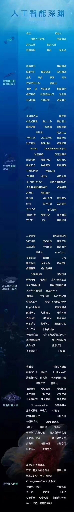
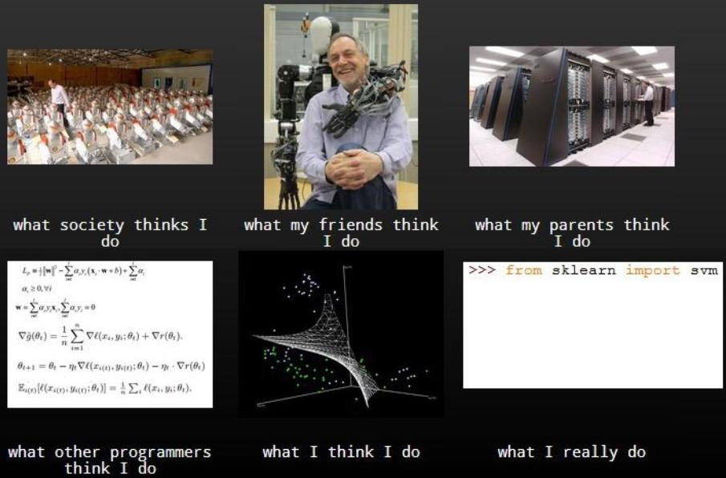
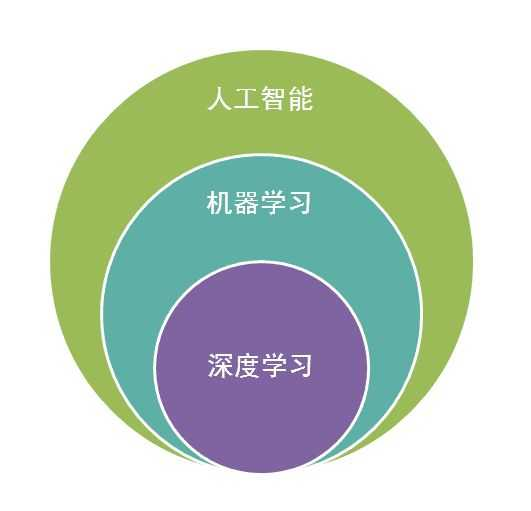
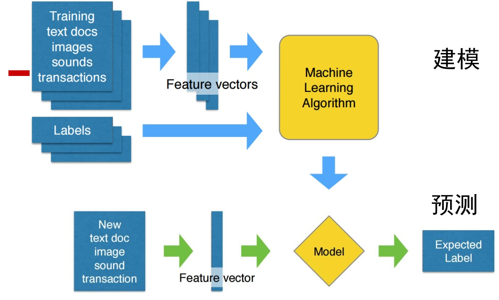
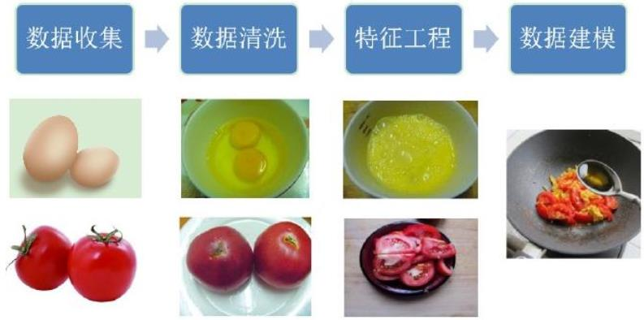
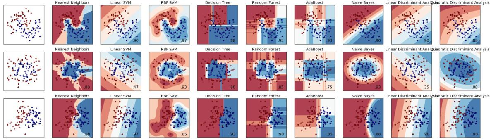

# 机器学习前言

* [返回上层目录](../perface.md)
* [什么是机器学习和模式识别](#什么是机器学习和模式识别)
* [机器学习的应用](#机器学习的应用)
* [机器学习的流程](#机器学习的流程)
* [不同机器学习算法预测效果不同](#不同机器学习算法预测效果不同)

这是传说中的人工智能深渊

# 什么是机器学习和模式识别

一句话解释：

**机器学习**就是可以通过自动调节参数，使得模型可以解释所观测到的数据。

**模式识别**其实就是控制科学下的机器学习。

正经解释：

什么是**机器学习**：对于某给定的任务T，在合理的性能度量方案P的前提下，某计算机程序可以自主学习任务T的经验E；随着提供合适、优质、大量的经验E，该程序对于任务T的性能逐步提高。--Tom Michael Mitchell,1997

说人话：

**机器学习**是人工智能的一个分支。我们使用计算机设计一个系统，使它能够根据提供的训练数据按照一定的方式来学习；随着训练次数的增加，该系统可以在性能上不断学习和改进；通过参数优化的学习模型，能够用于预测相关问题的输出。

别人眼中的机器学习和自己眼中的机器学习：

肯定你们也听到了，人工智能、机器学习、深度学习这样的关键词，那么他们之间得关系是什么？

# 机器学习的应用

**在踏入人工智能大门前，我先讲一下，为什么这两年深度学习为什么突然火了**

2016年AlphaGo 4比1 战胜李世石，掀起了一波AI热潮，DeepMind背后所用的深度学习一下子火了起来了。其实在内行看来，AlphaGo对阵李世石的结果是毫无悬念的，真正的突破在几年前就发生了。

最近AlphaGo的弟弟AlphaGo Zero把自己的哥哥直接横扫了，原因是AlphaGo Zero是两个机器人自己博弈，所以收敛速度要比学习人类棋谱快多了。

2012年，Gefferey Hinton的学生Alex使用一个特别构造的深度神经网络（后来就叫AlexNet），在图像识别的专业比赛ImageNet中，得到了远超之前最好成绩的结果，那个时候，整个人工智能领域就已经明白，深度学习的革命已经到来了。

果然，之后深度学习在包括语音识别，图像理解，机器翻译等传统的人工智能领域都超越了原先各自领域效果最好的方法。从2015年起，工业界内一些嗅觉灵敏的人士也意识到，一场革命或已到来。 

**随着机器学习在生活中越来越广泛得被应用在各个领域，**

比如：

- 资讯类APP，每日的消息推送都是我们自己喜欢且关注的内容（人工智能的学习和记忆）
- 百度搜索结果的排序推送是基于用户历史的点击数据，会更多地推送个人喜欢或认为正确的结果
- 百度广告根据每个人喜好去最大化点击的概率
- 美图秀秀根据用户储存的自动美化后的照片来优化算法
- 滴滴帮助司机选择路线、规划车辆调度方案
- 未来的自动驾驶技术重新定义智能出行、智能城市
- APP背后的判断、预测、抉择、分类。
- 当前发展比较热门的应用，语音识别、自然语言理解、知识图谱、个性推荐、个性化排序各种领域的进步

# 机器学习的流程

(注：本图片来自小象学院邹博老师的机器学习课程)

将数据挖掘/机器学习的流程比作**炒菜**：

(注：本图片来自小象学院邹博老师的机器学习课程)

# 不同机器学习算法预测效果不同

即便是同一个数据，选择不同的机器学习算法，就有不同的分类预测。

# 参考文献

* [小象学院\_机器学习\_邹博](http://www.chinahadoop.cn/course/1068)

前几节的内容和图片基本都来自于此。

