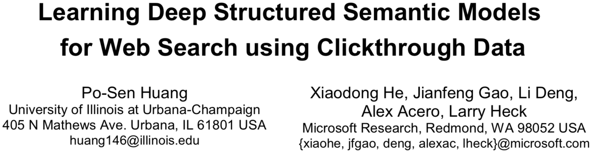
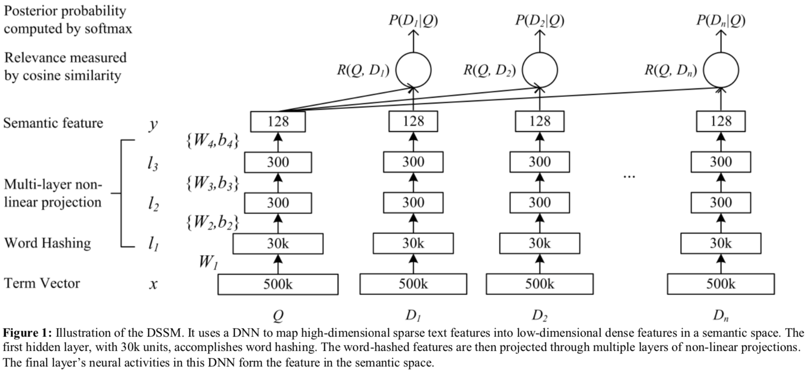

# DSSM: Learning Deep Structured Semantic Models for Web Search using Clickthrough Data

* [返回上层目录](../deep-learning.md)
* [简介](#简介)
* [DSSM原理](#DSSM原理)
  * [计算语义特征的DNN模型](#计算语义特征的DNN模型)
  * [word-hash](#word-hash)
  * [DSSM的损失函数](#DSSM的损失函数)
* [实验](#实验)



> 论文：Learning Deep Structured Semantic Models for Web Search using Clickthrough Data
> 作者：Po-Sen Huang, Xiaodong He, Jianfeng Gao, Li Deng
> 来源：CIKM2013

PDF: [*Learning Deep Structured Semantic Models for Web Search using Clickthrough Data*](https://posenhuang.github.io/papers/cikm2013_DSSM_fullversion.pdf)


做了两件事：

1、用深度结构将query和doc映射到同一个低维空间，从而可以计算出它俩之间的相似度。

2、应对大规模网络检索，采用word hash技巧。

# 简介

传统的网络检索通常用关键词匹配，但是一个概念通常用的词汇和语法都不一样，这样就导致不准确了。

已有的LSA隐语义模型虽然能将相似上下文的不同单词放到同一个语义类簇中，但是它的训练方式是无监督的，损失函数和检索的评估指标联系不太相关，所以性能也不能达到预期。

目前对于上述传统的隐语义模型，有两条路进行了拓展：

1. 将训练目标和检索排序任务联系起来。但其训练目标是最大化似然值，而不是排序这一评估指标，这依然是次优的。而且，不能应对大规模检索任务，必须要见效减小单词数量，但这会导致性能下降。
2. Hinton等人通过深度自编码这一深度学习技术，可得到单词的embedding，比传统的LSA更优。但是其依然使用了无监督学习，模型的参数被用来重建doc而和排序无关，所以比base line方法也好不了太多。而且，当检索规模一大，也不能胜任。

针对上述缺点，于是提出了DSSM，给定query，使用深度神经网络对doc进行排序。

主要改进之处有两点：

1. 将query和doc同时非线性映射到同一个语义空间，然后计算给定的query和每一个doc之间的cos相似度。目标函数是直接最大化实际发生的query-doc点击pair对的条件似然。
2. 对于大规模单词，提出了word hash技巧。以很小的信息损失，将高维的vector映射到n-gram大小维度。

经过这两点改进，DSSM比其他所有的方法的指标都要高出2.5～4.3%。

# DSSM原理

## 计算语义特征的DNN模型

DNN架构如下图所示。输入的原始文本特征是高维向量，输出是低维语义特征空间的向量。



DNN模型的作用如下：

1. 将原始的文本特征非线性映射到低维语义空间。
2. 在低维语义空间中计算doc和query的相似度。

具体表述如下：

$x$为输入向量，$y$为输出向量，
$$
l_i,\ i=1,...,N-1
$$
为中间隐层，$W_i$为第$i$层的权重矩阵，$b_i$是第$i$层的偏移项。

我们有：
$$
\begin{aligned}
&l_1=W_1x\\
&l_i=f(W_il_{i-1}+b_i)\\
&y=f(W_Nl_{N-1}+b_N)
\end{aligned}
$$
使用tanh作为输出层和隐藏层$l_i(i = 2, ..., N-1)$的激活函数：
$$
f(x)=\frac{1-e^{\text{—}2x}}{1+e^{\text{—}2x}}
$$
则queryQ和docD的语义相关度为：
$$
R(Q,\ D)=\text{cosine}(y_Q,y_D)=\frac{y_Q^Ty_D}{||y_Q||\ ||y_D||}
$$
所以，给定query，按照其语义相关度对doc进行排序。

输入的$x$向量的维度等于单词表的大小，但是单词表在现实中是非常大的，所以将其直接作为神经网络的输入，对神经网络的前向传播和模型训练都不可接受。所以这里对DNN的第一层使用了“word hash”，这一层的权重被设置为不可学习（固定权重的线性变换）。

## word-hash

word hash用于减小输入x（词袋向量）的维度，它基于n-gram，最终被表征为n-gram字符的向量。例如good这个单词，先加上起始结束标志#，即```#good#```，基于3-gram可被拆分为：```#go, goo, ood, od#```。

相比维度巨大的one-hot编码的向量，Word hash技术让我们能够用维度小得多的向量去表征query或者doc。500K大小的单词可表征成30621维的3-gram向量，从而让我们能将DNN模型用到大国膜信息检索任务上。

唯一的问题是可能不同的单词会有相同的word hash值，但是这个概率很小，500K的单词中仅有22个单词发生了重叠，重叠概率仅为0.0044%。

可将word hash视为固定的不可变的线性变换。

## DSSM的损失函数

我们的目标是给定query下最大化点击过的doc的条件概率。
$$
P(D|Q)=\frac{\text{exp}(\gamma R(Q,D))}{\sum_{D'\in \mathbf{D}}\text{exp}(\gamma R(Q,D'))}
$$
其中，$\gamma$是平滑因子，需要经验性设置。$\mathbf{D}$为待排序的候选doc集。

理论上，$\mathbf{D}$应该包含所有可能的doc，但实际上，对于每一个实际发生的(query, clicked-doc)pair对，用
$$
(Q, D^{+})
$$
表示，即$Q$是query，$D^{+}$是点击过的doc。

**负采样：**

我们将理论上包含了所有doc的集合D近似为包含了$D^{+}$和四个随机选择的未点击的doc（负样本）。

而且这里作者说，并没有观察到不同的选择未点击doc的负采样策略会导致显著差异。

所以损失函数是
$$
L(\Lambda)=-\text{log}\mathop{\Pi}_{(Q,D^{+})}P(D^{+}|Q)
$$

# 实验

略。具体直接看paper。

# 参考资料

无

===

[DSSM模型和tensorflow实现](https://www.jianshu.com/p/71b731e4444b)

[DSSM系列: Deep Structured Semantic Models](https://blog.csdn.net/wangqingbaidu/article/details/79286038)

