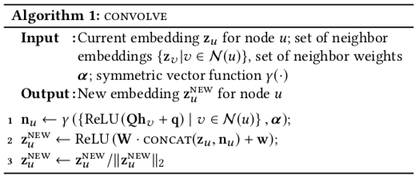

# 用于大规模推荐系统的图卷积神经网络

* [返回上层目录](../advanced-knowledge.md)
* [前言](#前言)
* [模型结构](#模型结构)
* [模型训练](#模型训练)
  * [Importance-based neighborhoods](#Importance-based neighborhoods)
  * [Stacking convolutions](#Stacking convolutions)
  * [Loss function](#Loss function)

>论文：Graph Convolutional Neural Networks for Web-Scale Recommender Systems
>作者：Rex Ying, Ruining He, Kaifeng Chen, Pong Eksombatchai
>来源：KDD 2018

PDF: [*Graph Convolutional Neural Networks for Web-Scale Recommender Systems*](https://arxiv.org/pdf/1806.01973.pdf)

# 前言

这篇文章是Pinterest将GCN成功应用在大规模真实场景的论文，唯一可惜的是没有公开源码。

[Pinterest](https://www.pinterest.com)是世界上最大的图片社交分享网站。网站允许用户创建和管理主题图片集合，例如事件、兴趣和爱好。

论文包含了理论创新和实际落地实现中的一些工程优化。这里对算法理论这块做一下简单记录。

这篇文章虽然说是GCN算法，但是全文看下来其实和卷积并没有很大的关系。GCN算法大多数都是端到端的计算，需要在整个graph上训练。这样的话很难将算法扩展应用到实际的大规模工业应用上。

所以文章提出了一个局部卷积的概念，不在全局的graph上优化算法，而是给特定的节点形成一个包含有限领域节点的子图，在子图上构造局部卷积，然后不同节点共享同样的局部卷积参数，也许正是因为要共享参数，所以作者把这个叫做卷积吧。

# 模型结构

下图是论文提出来的卷积模型结构

整个算法中，局部卷积算法'CONVOLVE'应该是最核心的部分。

这个CONVOLVE是逐点优化的算法，所以输入是当前计算的节点u的embedding，以及它所对应的领域节点的embedding。而**具体的卷积操作其实就是一些全联接构造成的映射**。

分析一下上图的后面三行伪代码。

**第一行**里面的hν指的是领域节点v的embedding，这里感觉作者没写清楚，我刚开始也没看明白，后来看了图才看明白。

一个CONVOLVE模块（流程图中的那三行伪代码）就是如下图这样的一个模块：

先是对节点的领域节点经过Q映射后，再利用weight-pooling函数γ让输出的维度和输入保持一致，生成所有领域节点统一的embedding向量$h_{N(A)}$。

**第二行**的伪代码描述的是节点embedding的更新，直接把上一层或者初始的embedding和领域节点embedding一起concate起来，再加上一层全联接就可以生成新的节点embedding。第三行的代码只是对输出的节点embedding做了L2归一化，让训练更稳定。

这一个CONVOLVE里的参数，比如Q,q,W,w这些都是**共享**的，每个节点都一样。所以把这个叫卷积吧。。

# 模型训练

现在最核心的算法模块有了，需要先构造输入，输入是按节点迭代，那么每次输入CONVOLVE的就是当前节点，和选择出来的领域。那么领域怎么选？

## Importance-based neighborhoods

作者为了统一每个节点的领域个数，已经进一步引入每个领域节点对当前节点的重要性，采用了随机游走的策略来生成节点的领域。并且通过计算随机游走对顶点的访问次数的 𝐿1 归一化值。来定义领域节点的重要性，按对定点的访问次数排序后取top-T个节点作为当前节点的领域。

在分析代码流程图的时候，里面的weight-pooling函数的weight方式并没有提到，其实就是这里这里随机游走产生的这个L1归一化值。

其实到这里这个算法也勉强能用了，不过作者为了让这个算法更像卷积，进一步将CONVOLVE模块进行了stack。

## Stacking convolutions

思路比较简单，就是把CONVOLVE输出的embedding，再传入一个CONVOLVE，类似多层全联接一样，连起来。代码写起来可能会比较麻烦了，因为不同节点的领域不一样，那么堆叠到第二层的时候，输入CONVOLVE的节点就是上一层CONVOLVE的minibatch的节点的领域的领域。有点拗口。具体流程图如下：

1-7行的循环：获得集合M中从源节点出发，path为1到K的节点集合

8-14循环：获得每一层的embed

5-17行：更新embedding

具体分两部分。

第一部分，首先把每一层里节点的领域都计算好。（流程图里smpling neighborhoods of minibatch nodes下的代码）

第二部分就是循环计算每一层的CONVOLVE，把上一层CONVOLVE的输出作为下一层CONVOLVE的输入。

算法的最后是把最后一层CONVOLVE的输出再经过G1和G2做全联接映射后输出最终的节点embedding。

这里需要注意的是，前面我说过一个CONVOLVE的参数都是共享，这里的共享指的是同一层的CONVOLVE。对应不同层之间的CONVOLVE不共享参数。

能发现，这**整个网络结构确实很像一个多层卷积网络**，输入是节点和节点领域embedding，输出是新的节点embedding。

这个针对不同任务已经完全能够迁移作为backbone。

## Loss function

模型训练的目标是让有标记的(query, item)pair对的embedding更接近。

作者定义的损失函数是hinge loss:
$$
\mathcal{J}_{\mathcal{G}}(z_qz_i)=\mathbb{E}_{n_k\sim P_n(q)}\text{max}\left\{0,z_qz_{\text{neg}_k}-z_q\cdot z_i+\Delta\right\}
$$
文章后面还写了一些实际实现工程中的加速优化，这里就不说了。大家可以直接去看原文，或者这里看这哥们[翻译的文章](https://davidham3.github.io/blog/2018/06/17/graph-convolutional-neural-networks-for-web-scale-recommender-systems/)。

# 参考资料

* [【GCN】: Graph Convolutional Neural Networks for Web-Scale Recommender Systems](https://blog.csdn.net/sxf1061926959/article/details/92402481)
* [翻译：Graph Convolutional Neural Networks for Web-Scale Recommender Systems](https://davidham3.github.io/blog/2018/06/17/graph-convolutional-neural-networks-for-web-scale-recommender-systems/)
* [【Read3】Pinterest使用的推荐系统](https://zhuanlan.zhihu.com/p/45097523)

本文参考了这几篇文章。
