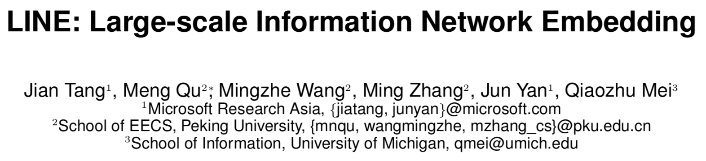
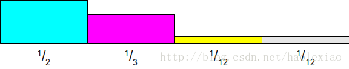
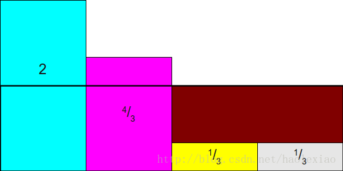
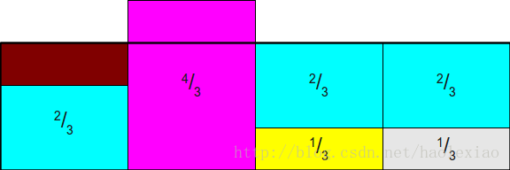

# LINE: Large-scale Information Network Embedding

* [返回上层目录](../graph-embedding.md)
* [论文解读](#论文解读)
  * [介绍](#介绍)
  * [定义](#定义)
  * [一阶近似](#一阶近似)
  * [二阶近似](#二阶近似)
  * [结合一阶近似和二阶近似](#结合一阶近似和二阶近似)
  * [负采样](#负采样)
  * [边采样](#边采样)
* [源码说明与运行](#源码说明与运行)
  * [代码说明](#代码说明)
  * [数据集](#数据集)
  * [运行示例](#运行示例)
  * [编译LINE源码](#编译LINE源码)
    * [编译时遇到的问题](#编译时遇到的问题)
    * [运行时遇到的问题](#运行时遇到的问题)
* [源码解析](#源码解析)
  * [train_youtube.sh](#train_youtube.sh)
  * [reconstruct.cpp](#reconstruct.cpp)
  * [line.cpp](#line.cpp)
  * [时间复杂度O[1]的Alias离散采样算法](#时间复杂度O[1]的Alias离散采样算法)
* [分布式实现（腾讯Angel）](#分布式实现（腾讯Angel）)
  * [运行示例](#运行示例)
  * [分布式实现原理](#分布式实现原理)
* [推荐场景中的实际应用](#推荐场景中的实际应用)



论文地址：https://arxiv.org/pdf/1503.03578.pdf

代码地址：https://github.com/tangjianpku/LINE

# 论文解读

## 介绍

本篇文章提出的算法定义了两种相似度：一阶相似度和二阶相似度，一阶相似度为直接相连的节点之间的相似，二阶相似度为存不直接相连单存在相同邻近节点的相似。还提出来一个针对带权图的边采样算法，来优化权重大小差异大，造成梯度优化的时候梯度爆炸的问题。

该方法相比于deepwalk来说，deepwalk本身是针对无权重的图，而且根据其优化目标可以大致认为是针对二阶相似度的优化，但是其使用random walk可以认为是一种DFS的搜索遍历，而针对二阶相似度来说，BFS的搜索遍历更符合逻辑。而LINE同时考虑来一阶和二阶相似度，一阶相似度可以认为是局部相似度，直接关联。二阶相似度可以作为一阶相似度的补充，来弥补一阶相似度的稀疏性。


## 定义

**信息网络（Information Network）**信息网络被定义为G(V, E),其中V是节点集合，E表示边的集合。其中每条边定义一个有序对：e=(u, v)，并分配一个权重值$w_{uv}$用于表示点u和点v之间联系的强弱。如果为无向图的话，$(u, v) = (v, u),\ w_{uv} = w_{vu}$。

**一阶相似性（First-order Proximity）**一阶相似性定义为两个节点之间的局部成对相似性。对于由边(u, v)链接的节点对，其链接权重$w_{uv}$用于表示节点u和节点v之间的一阶相似性，如果两个节点之间没有边相连，那么他们的一阶相似性为0。

一阶相似性固然可以直接表示节点之间的相似性，但是在真实环境下的信息网络往往存在大量的信息缺失，而许多一阶相似度为0的节点，他们本质上相似度也很高。自然能想到的是那些拥有相似邻近节点的节点可能会存在一定的相似性。比如在真实环境中，拥有相同朋友的两个人也很可能认识，经常在同一个词的集合中出现的两个词也很有可能很相似。

举例：上图中6和7就是一阶相似，因为6和7直接相连。

**二阶相似性(Second-order Proximity)** 两个节点的二阶相似性是他们的邻近网络结构的相似性。如
$$
p_u=(w_{u,1},...,w_{u,|V|})
$$
表示u对全部节点的一阶相似性。那么节点u和节点v的二阶相似性由$p_u$和$p_v$决定。如果没有节点同时链接u和v，那么u和v的二阶相似度为0。

举例：上图中的5和6就是二阶相似，因为它们虽然没有直接相连，但是它们连接的其他节点中有重合（1, 2, 3, 4）。

## 一阶近似

定义两个点（点$v_i$和$v_j$）之间的联合概率：
$$
p_1(v_i,v_j)=\frac{1}{1+\text{exp}\left(-\vec{u}_i^T\cdot \vec{u}_j^T\right)}
$$
其中，$u_i$和$u_j$属于$R^d$是节点i和j的低维embedding向量，直接利用sigmoid来度量两个节点的相似度。

而对应的需要拟合的经验概率为
$$
\hat{p}_1=\frac{w_{ij}}{W}
$$
，即为全部权重的归一化后的占比，这里
$$
W=\sum_{(i,j)\in E}w_{i,j}
$$
，所以对应的优化目标为
$$
O_1=d(\hat{p}_1(.,.),p_1(.,.))
$$
这就是我们的目标函数，即损失函数，我们要最小化该目标，让预定义的两个点之间的联合概率尽量靠近经验概率。d(.,.)用于度量两个分布之间的距离，作者选择KL散度（即交叉熵）来作为距离度量。那么使用KL散度并忽略常数项后，可以得到：
$$
O_1=-\sum_{(i,j)\in Edge}w_{ij}\text{log}\ p_1(v_i,v_j)
$$
这就是最终的优化目标，这里需要注意，一阶相似度只能用于无向图。

## 二阶近似

二阶相似度同时适用于有向图和无向图。

二阶的含义可以理解为每个节点除了其本身外还代表了其所对应的上下文，如果节点的上下文分布接近那么可以认为这两个节点相似。

以有向边为例，有向边(i, j)定义节点$v_i$的上下文（邻接）节点$v_j$的概率为：
$$
p_2(v_j|v_i)=\frac{\text{exp}(\vec{u}_j{'}^T\cdot \vec{u}_i)}{\sum_{k=1}^{|V|}\text{exp}(\vec{u}_k{'}^T\cdot \vec{u}_i)}
$$
其中$|V|$是**所有context节点**的数量，而不是和i相连的节点的数量。其实和一阶的思路类似，这里用softmax对邻接节点做了一下归一化。优化目标也是去最小化分布之间的距离：
$$
O_2=\sum_{i\in V}\lambda_id\left(\hat{p}_2(\cdot|v_i),\ p_2(\cdot|v_i)\right)
$$
这里d(. , .)用于度量两个分布之间的差距。因为考虑到图中的节点重要性可能不一样，所以设置了参数$\lambda_i$来对节点进行加权。可以通过节点的出入度或者用pagerank等算法来估计出来。而这里的经验分布则被定义为：
$$
\hat{p}_2(v_i|v_j)=\frac{w_{ij}}{d_i}
$$
其中，$w_{ij}$是边(i, j)的权重，$d_i$是节点i的出度，即
$$
d_i=\sum_{k\in N(i)}w_{ik}
$$
而N(i)就是节点i的出度节点的集合。同样采用KL散度作为距离度量，可以得到如下优化目标：
$$
O_2=-\sum_{(i,j)=Edge}w_{ij}\text{log}\ p_2(v_j|v_i)
$$
有人很奇怪，既然这里的V是所有context节点，那和i不相连的节点j的$w_{ij}$怎么算呢？那就是0啊，就这么简单。只有把V当作所有context节点，而不仅仅是和i相连的节点，之后才能说的通文章后面的负采样那里是全局随机负采样。

**注意：**

这里有个坑，非常容易让人误解。就是二阶边(i, j)其实根本不是上图中的5和6，同一个图里，基本不会出现同时存在二阶和一阶关系的图，一般只能二选一，具体原因见下一小节。二阶边(i, j)应该就是(1, 5)、(1, 6)这种边的关系，因为1的自身向量和5的上下文向量接近。**而为什么我们说5和6是二阶关系呢？因为是按照这种算法，算出来和5相似的就是6，所以才说5和6是二阶关系，即5和6是二阶相似，是计算的结果的体现，不是说训练数据就有(5, 6)这条边！**。

## 结合一阶近似和二阶近似

文章提到暂时还不能将一阶和二阶相似度进行联合训练，只能将他们单独训练出embedding，然后在做concatenate。

但是一般来说，从节点和边的性质上来说，能用一阶就不能用二阶，反之亦然。比如github上的相互关注，就是典型的一阶关系，因为彼此都是好基友。但是比如抖音上的屌丝男关注了女神，那就绝对不能用一阶关系，而应该是二阶关系。

## 负采样

这个算是一个常见的技巧，在做softmax的时候，分母的计算要遍历所有节点，这部分其实很费时，所以在分母的求和数量较大的时候，经常会使用负采样技术。

## 边采样

也是训练的一个优化，因为优化函数中由一个w权重，在实际的数据集中，因为链接的大小差异会很大，这样的话会在梯度下降训练的过程中很难去选择好一个学习率。直观的想法是把权重都变成1，然后把w权重的样本复制w份，但是这样会占用更大的内存。第二个方法是按w权重占比做采样，可以减少内存开销。

这篇文章就是按照第二种方法，用一种复杂度为O(1)的方法：alias采样法，该方法在本文后面有详细描述。

# 源码说明与运行

## 代码说明

在<https://github.com/tangjianpku/LINE>下载代码。下载下来的代码说明：

**LINE：大规模的信息网络嵌入**

**介绍**

这是为了嵌入非常大规模的信息网络而开发的LINE工具箱。它适用于各种网络，包括有向，无向，无权或加权边。 LINE模型非常高效，能够在几个小时内在单台机器上嵌入数百万个顶点和数十亿个边界的网络。

联系人：唐建，tangjianpku@gmail.com

项目页面：https://sites.google.com/site/pkujiantang/line

当作者在微软研究院工作时，这项工作就完成了

**用法**

我们提供Windows和LINUX版本。为了编译源代码，需要一些外部包，用于为LINE模型中的边缘采样算法生成随机数。对于Windows版本，使用BOOST软件包，可以从http://www.boost.org/下载;对于LINUX，使用GSL包，可以从http://www.gnu.org/software/gsl/下载。

**网络输入**

网络的输入由网络中的边组成。输入文件的每一行代表网络中的一个DIRECTED边缘，指定为格式“起点-终点-权重”（可以用空格或制表符分隔）。对于每个无向边，用户必须使用两个DIRECTED边来表示它。以下是一个词共现网络的输入示例：

```shell
good the 3
the good 3
good bad 1
bad good 1
bad of 4
of bad 4
```

**运行**

```shell
./line -train network_file -output embedding_file -binary 1 -size 200 -order 2 -negative 5 -samples 100 -rho 0.025 -threads 20
```

* train，网络的输入文件;
* output，嵌入的输出文件;
* binary，是否以二进制模式保存输出文件;默认是0（关）;
* size，嵌入的维度;默认是100;
* order，使用的相似度; 1为一阶，2为二阶;默认是2;
* negative，负采样中负采样样本的数目；默认是5;
* samples，训练样本总数（*百万）;
* rho，学习率的起始值;默认是0.025;
* threads，使用的线程总数;默认是1。

**文件夹中的文件**

reconstruct.cpp：用于将稀疏网络重建为密集网络的代码

line.cpp：LINE的源代码;

normalize.cpp：用于归一化嵌入的代码（l2归一化）;

concatenate.cpp：用于连接一阶和二阶嵌入的代码;

**示例**

运行Youtube数据集（可在http://socialnetworks.mpi-sws.mpg.de/data/youtube-links.txt.gz处获得）的示例在train_youtube.bat / train_youtube .sh文件中提供

## 数据集

Youtube数据集：网络中的节点代表用户，有联系的用户之间有边。YouTube网络是一个无向、无权的网络。

数据集从<http://socialnetworks.mpi-sws.mpg.de/data/youtube-links.txt.gz>下载。下载的数据集文件中，每行有两个数字，中间以制表符隔开，代表网络中的一条边，两个数字分别代表边的起点和终点。因为是无权图，因此不需要权重的值。因为是无向图，因此每条边在文件中出现两次，如(1, 2)和(2, 1)，代表同一条边。

数据集中共包括4945382条边（有向边，因为无向图中每条边被看做两条有向边，所以Youtube网络中有2472691条边）和至少937968个点（文件中节点的名字并不是连续的，有些节点的度为0，在数据集文件中没有出现）。

## 运行示例

在Youtube数据集上运行算法的示例在train_youtube.bat / train_youtube.sh文件中提供。算法运行分为五步：

* 将单向的关系变为双向的关系，因为youtobe好有关系是无向图

  ```shell
  python3 preprocess_youtube.py youtube-links.txt net_youtube.txt
  ```

* 通过reconstruct程序对原网络进行重建（1h）

  ```shell
  ./reconstruct -train net_youtube.txt -output net_youtube_dense.txt -depth 2 -threshold 1000
  ```

* 两次运行line，分别得到一阶相似度和二阶相似度下的embedding结果

  ```shell
  ./line -train net_youtube_dense.txt -output vec_1st_wo_norm.txt -binary 1 -size 128 -order 1 -negative 5 -samples 10000 -threads 40
  ./line -train net_youtube_dense.txt -output vec_2nd_wo_norm.txt -binary 1 -size 128 -order 2 -negative 5 -samples 10000 -threads 40
  ```

* 利用normalize程序将实验结果进行归一化

  ```shell
  ./normalize -input vec_1st_wo_norm.txt -output vec_1st.txt -binary 1
  ./normalize -input vec_2nd_wo_norm.txt -output vec_2nd.txt -binary 1
  ```

* 使用concatenate程序连接一阶嵌入和二阶嵌入的结果

  ```shell
  ./concatenate -input1 vec_1st.txt -input2 vec_2nd.txt -output vec_all.txt -binary 1
  ```

## 编译LINE源码

### 编译时遇到的问题

编译LINE源码时，会遇到一些问题：

[linux下GSL安装](https://blog.csdn.net/waleking/article/details/8265008/)

注意，可能会报错：

```sh
line.cpp:(.text+0x30b8): undefined reference to `gsl_rng_uniform'
```

这时候，需要在编译选项

```sh
-lm -pthread -Ofast -march=native -Wall -funroll-loops -ffast-math -Wno-unused-result
```

中加入

```sh
-lgsl -lgslcblas
```

就好啦。

具体参见[linux下GSL安装](https://blog.csdn.net/waleking/article/details/8265008/)、[can't link GSL properly?](https://www.daniweb.com/programming/software-development/threads/289812/can-t-link-gsl-properly)。

### 运行时遇到的问题

#### 问题1

```sh
../bin/reconstruct -train ../data/net_youtube.txt -output ../data/net_youtube_dense.txt -depth 2 -threshold 1000
```

会出现

```
../bin/reconstruct: error while loading shared libraries: libgsl.so.23: cannot open shared object file: No such file or directory
```

解决办法：

```
export LD_LIBRARY_PATH=/usr/local/lib
```

具体参见[error while loading shared libraries: libgsl.so.23: cannot open shared object file: No such file or directory](https://stackoverflow.com/questions/45665878/a-out-error-while-loading-shared-libraries-libgsl-so-23-cannot-open-shared)。

#### 问题2

运行代码时可能还会遇到这个问题:

```shell
../bin/line: /lib64/libm.so.6: version `GLIBC_2.15' not found (required by ../bin/line)
```

基本是因为你在其他该版本系统上编译好了，又在低版本系统上直接运行了。只需要在低版本上重新make编译一下就好。

## 源码中存在的bug

源码中在计算输出的时候，数组的index是int型，如果数据量一大，就非常容易超出int的范围21亿，则就会出错，出错类型是：segment fault，这是因为超出int型范围后，index就成了负数了，则数组就会向前检索，一旦求址到达内存中的不可访问区域，则就会报错。

要改正这个bug很简单，就是强制将index的数据类型改为longlong就行：

```c++
if (is_binary) for (b = 0; b < (unsigned long long)dim; b++) fwrite(&emb_vertex[a * (unsigned long long)dim + b], sizeof(real), 1, fo_vertex);
```

# 源码解析

在Youtube数据集上运行算法的示例在train_youtube.bat / train_youtube.sh文件中提供。算法运行分为五步：

- 将单向的关系变为双向的关系，因为youtobe好有关系是无向图

  ```shell
  python3 preprocess_youtube.py youtube-links.txt net_youtube.txt
  ```

- 通过reconstruct程序对原网络进行稠密化（1h）

  ```shell
  ./reconstruct -train net_youtube.txt -output net_youtube_dense.txt -depth 2 -threshold 1000
  ```

- 两次运行line，分别得到一阶相似度和二阶相似度下的embedding结果

  ```shell
  ./line -train net_youtube_dense.txt -output vec_1st_wo_norm.txt -binary 1 -size 128 -order 1 -negative 5 -samples 10000 -threads 40
  ./line -train net_youtube_dense.txt -output vec_2nd_wo_norm.txt -binary 1 -size 128 -order 2 -negative 5 -samples 10000 -threads 40
  ```

- 利用normalize程序将实验结果进行归一化

  ```shell
  ./normalize -input vec_1st_wo_norm.txt -output vec_1st.txt -binary 1
  ./normalize -input vec_2nd_wo_norm.txt -output vec_2nd.txt -binary 1
  ```

- 使用concatenate程序连接一阶嵌入和二阶嵌入的结果

  ```shell
  ./concatenate -input1 vec_1st.txt -input2 vec_2nd.txt -output vec_all.txt -binary 1
  ```

下面我们依次分析这些源码：

## train_youtube.sh

这个代码很简单，就是上述的流程。建议自己先把youtube-links.txt数据下下来，把那段下载的代码屏蔽掉，这样快一些。

```shell
#!/bin/sh

g++ -lm -pthread -Ofast -march=native -Wall -funroll-loops -ffast-math -Wno-unused-result line.cpp -o line -lgsl -lm -lgslcblas
g++ -lm -pthread -Ofast -march=native -Wall -funroll-loops -ffast-math -Wno-unused-result reconstruct.cpp -o reconstruct
g++ -lm -pthread -Ofast -march=native -Wall -funroll-loops -ffast-math -Wno-unused-result normalize.cpp -o normalize
g++ -lm -pthread -Ofast -march=native -Wall -funroll-loops -ffast-math -Wno-unused-result concatenate.cpp -o concatenate

wget http://socialnetworks.mpi-sws.mpg.de/data/youtube-links.txt.gz
gunzip youtube-links.txt.gz

python3 preprocess_youtube.py youtube-links.txt net_youtube.txt
./reconstruct -train net_youtube.txt -output net_youtube_dense.txt -depth 2 -threshold 1000
./line -train net_youtube_dense.txt -output vec_1st_wo_norm.txt -binary 1 -size 128 -order 1 -negative 5 -samples 10000 -threads 40
./line -train net_youtube_dense.txt -output vec_2nd_wo_norm.txt -binary 1 -size 128 -order 2 -negative 5 -samples 10000 -threads 40
./normalize -input vec_1st_wo_norm.txt -output vec_1st.txt -binary 1
./normalize -input vec_2nd_wo_norm.txt -output vec_2nd.txt -binary 1
./concatenate -input1 vec_1st.txt -input2 vec_2nd.txt -output vec_all.txt -binary 1

cd evaluate
./run.sh ../vec_all.txt
python3 score.py result.txt
```

## reconstruct.cpp

这个代码的作用是**稠密化一阶节点**，对于少于指定的边数（比如1000）的节点，将其二阶节点采样，作为一阶节点来使用。

但是注意，用二阶节点来稠密一阶节点，只能针对无向图，而针对有向图，如果要稠密化一阶节点，就要取其三阶节点，但是因为多了一层，导致准确度会下降。所以，究竟是稠密化节点带来的好处多，还是多了一层导致准确性的下降带来的坏处多，需要具体实验判定。

核心代码如下：

```c++
for (sv = 0; sv != num_vertices; sv++)
{
    ///xxx
    sum = vertex[sv].sum_weight;
    node.push(sv);
    depth.push(0);
    weight.push(sum);
    while (!node.empty())
    {
        cv = node.front();
        cd = depth.front();
        cw = weight.front();

        node.pop();
        depth.pop();
        weight.pop();

        if (cd != 0) vid2weight[cv] += cw;// 一阶+二阶

        if (cd < max_depth)
        {
            len = neighbor[cv].size();// 该节点的出度
            sum = vertex[cv].sum_weight;// 该节点的出度权值之和

            for (int i = 0; i != len; i++)
            {
                node.push(neighbor[cv][i].vid);// 该节点的所有出度的链接节点
                depth.push(cd + 1);// 阶层加1
                weight.push(cw * neighbor[cv][i].weight / sum);//
            }
        }
    }
    //xxx
}
```

##line.cpp

 这个程序和word2vec的风格很像，估计就是从word2vec改的。

首先在main函数这，特别说明一个参数：`total_samples`，这个参数是总的训练次数，LINE没有训练轮数的概念，因为LINE是随机按照权重选择边进行训练的。

我们直接看TrainLINE()函数中的TrainLINEThread()这个函数，多线程跑的就是这个函数。

训练结束条件是，当训练的次数超过`total_samples`的次数以后就停止训练。如下：

```c++
if (count > total_samples / num_threads + 2) break;
```

首先要按边的权重采集一条边edge(u, v)，得到其这条边的起始点u和目标点v：

```c++
curedge = SampleAnEdge(gsl_rng_uniform(gsl_r), gsl_rng_uniform(gsl_r));
u = edge_source_id[curedge];
v = edge_target_id[curedge];
```

然后最核心的部分就是负采样并根据损失函数更新参数：

```c++
lu = u * dim;
for (int c = 0; c != dim; c++) vec_error[c] = 0;

// NEGATIVE SAMPLING
for (int d = 0; d != num_negative + 1; d++)
{
    if (d == 0)
    {
        target = v;
        label = 1;
    }
    else
    {
        target = neg_table[Rand(seed)];
        label = 0;
    }
    lv = target * dim;
    if (order == 1) Update(&emb_vertex[lu], &emb_vertex[lv], vec_error, label);
    if (order == 2) Update(&emb_vertex[lu], &emb_context[lv], vec_error, label);
}
for (int c = 0; c != dim; c++) emb_vertex[c + lu] += vec_error[c];
```

很显然，1阶关系训练的是两个节点的`emb_vertex`，而2阶关系训练的是开始节点的`emb_vertex`（节点本身的embedding）和目标节点的`emb_context`（节点上下文的embedding）。

接下来进入最关键的权值更新函数`Update()`：

```c++
/* Update embeddings */
void Update(real *vec_u, real *vec_v, real *vec_error, int label)
{
	real x = 0, g;
	for (int c = 0; c != dim; c++) x += vec_u[c] * vec_v[c];
	g = (label - FastSigmoid(x)) * rho;
	for (int c = 0; c != dim; c++) vec_error[c] += g * vec_v[c];
	for (int c = 0; c != dim; c++) vec_v[c] += g * vec_u[c];
}
```

这时我们需要回到论文中，看公式（8）和公式（7）：
$$
\begin{aligned}
\frac{\partial O_2}{\partial\vec{u}_i}&=w_{ij}\cdot \frac{\partial\ \text{log}\ p_2(v_j|v_i)}{\partial \vec{u}_i}\\
&=\frac{\partial\ \text{log}\ p_2(v_j|v_i)}{\partial \vec{u}_i}\ (w_{ij}\text{通过Alias采样来近似})\\
&=\frac{\partial\ \text{log}\ \sigma({\vec{u}{'}_j}^T\cdot \vec{u}_i)+\sum_{i=1}^KE_{v_n\sim P_n}\left[\text{log}\ \sigma(-{\vec{u}{'}_n}^T\cdot \vec{u}_i)\right]}{\partial \vec{u}_i}\\
&=\frac{\partial\ \text{log}\ \sigma({\vec{u}{'}_j}^T\cdot \vec{u}_i)+\sum_{i=1}^KE_{v_n\sim P_n}\left[\text{log}\ \left(1-\sigma({\vec{u}{'}_n}^T\cdot \vec{u}_i)\right)\right]}{\partial \vec{u}_i}\\
&=\frac{\partial\ \text{log}\ \sigma({\vec{u}{'}_j}^T\cdot \vec{u}_i)}{\partial \vec{u}_i}+\frac{\sum_{i=1}^KE_{v_n\sim P_n}\partial\ \left[\text{log}\ \left(1-\sigma({\vec{u}{'}_n}^T\cdot \vec{u}_i)\right)\right]}{\partial \vec{u}_i}\\
&=\left[1-\sigma({\vec{u}{'}_j}^T\cdot \vec{u}_i)\right]\vec{u}{'}_j+\sum_{i=1}^KE_{v_n\sim P_n} \left[0-\sigma({\vec{u}{'}_n}^T\cdot \vec{u}_i)\right]\vec{u}{'}_n
\end{aligned}
$$
这下代码应该就很容易能理解了。

上式中的$E_{v_n\sim P_n}$对应`TrainLINEThread()`负采样部分中的
```c++
target = neg_table[Rand(seed)];
label = 0;
```

边eage(u, v)中的v会在每次update时更新，u会在负采样完之后统一更新。

```c++
// 边eage(u, v)中的v会在每次update时更新
void Update(real *vec_u, real *vec_v, real *vec_error, int label)
{
	xxxxx
	for (int c = 0; c != dim; c++) vec_error[c] += g * vec_v[c];
	for (int c = 0; c != dim; c++) vec_v[c] += g * vec_u[c];
}

void *TrainLINEThread(void *id)
{
	xxx
	while (1)
	{
		// NEGATIVE SAMPLING
		for (int d = 0; d != num_negative + 1; d++)
		{
			xxx
		}
        // 边eage(u, v)中的u会在负采样完之后统一更新
		for (int c = 0; c != dim; c++) emb_vertex[c + lu] += vec_error[c];

		count++;
	}
	xxx
}
```

## 时间复杂度O[1]的Alias离散采样算法

**Alias-Sampling-Method**

问题：比如一个随机事件包含四种情况，每种情况发生的概率分别为：
$$
\frac{1}{2},\ \frac{1}{3},\ \frac{1}{12},\ \frac{1}{12}
$$
，问怎么用产生符合这个概率的采样方法。

### 最容易想到的方法

我之前有在[【数学】均匀分布生成其他分布的方法](https://blog.csdn.net/haolexiao/article/details/65157026)中写过均匀分布生成其他分布的方法，这种方法就是产生0~1之间的一个随机数，然后看起对应到这个分布的CDF中的哪一个，就是产生的一个采样。比如落在0~1/2之间就是事件A，落在1/2~5/6之间就是事件B，落在5/6~11/12之间就是事件C，落在11/12~1之间就是事件D。 

但是这样的复杂度，如果用BST树来构造上面这个的话，时间复杂度为O(logN)，有没有时间复杂度更低的方法。

### 一个Naive的办法

一个Naive的想法如下： 


1. 可以像上图这样采样，将四个事件排成4列：1~4，扔两次骰子，第一次扔1~4之间的整数，决定落在哪一列。 


2. 如上如所示，将其按照最大的那个概率进行归一化。在1步中决定好哪一列了之后，扔第二次骰子，0~1之间的任意数，如果落在了第一列上，不论第二次扔几，都采样时间A，如果落在第二列上，第二次扔超过2323则采样失败，重新采样，如果小于2323则采样时间B成功，以此类推。 
3. 这样算法复杂度最好为O(1)O(1)最坏有可能无穷次，平均意义上需要采样O(N)

那怎么去改进呢？

### Alias-Method

这样Alias Method采样方法就横空出世了 



还是如上面的那样的思路，但是如果我们不按照其中最大的值去归一化，而是按照其均值归一化。即按照1/N（这里是1/4）归一化，即为所有概率乘以N，得到如下图： 


其总面积为N，然后可以将其分成一个1*N的长方形，如下图： 



将前两个多出来的部分补到后面两个缺失的部分中。 
先将1中的部分补充到4中： 


这时如果，将1,2中多出来的部分，补充到3中，就麻烦了，因为又陷入到如果从中采样超过2个以上的事件这个问题中，所以Alias Method一定要保证：**每列中最多只放两个事件** 
所以此时需要讲1中的补满3中去：



再将2中的补到1中： 


至此整个方法大功告成 
Alias Method具体算法如下： 

1. 按照上面说的方法，将整个概率分布拉平成为一个1*N的长方形即为Alias Table，构建上面那张图之后，储存两个数组，一个里面存着第i列对应的事件i矩形占的面积百分比【也即其概率】，上图的话数组就为Prab[2/3, 1, 1/3, 1/3]，另一个数组里面储存着第i列不是事件i的另外一个事件的标号，像上图就是Alias[2 NULL 1 1]
2. 产生两个随机数，第一个产生1~N 之间的整数i，决定落在哪一列。扔第二次骰子，0~1之间的任意数，判断其与Prab[i]大小，如果小于Prab[i]，则采样i，如果大于Prab[i]，则采样Alias[i]

这个算法是不是非常的精妙而且简洁，做到了O(1)事件复杂度的采样。但是还有一个问题是，如何去构建上面的第1步？即如何去拉平整个概率分布？这样预处理的时间复杂度又是多少呢？

### Alias-Method程序化构建

#### Naive方法

构建方法： 
1.找出其中面积小于等于1的列，如i列，这些列说明其一定要被别的事件矩形填上，所以在Prab[i]中填上其面积 
2.然后从面积大于1的列中，选出一个，比如j列，用它将第i列填满，然后Alias[i] = j，第j列面积减去填充用掉的面积。

以上两个步骤一直循环，直到所有列的面积都为1了为止。

#### 存在性证明

那么Alias Table一定存在吗，如何去证明呢？ 
要证明Alias Table一定存在，就说明上述的算法是能够一直运行下去，直到所有列的面积都为1了为止，而不是会中间卡住。 
一个直觉就是，这一定是可以一直运行下去的。上述方法每运行一轮，就会使得剩下的没有匹配的总面积减去1，在第n轮，剩下的面积为N-n，如果存在有小于1的面积，则一定存在大于1的面积，则一定可以用大于1的面积那部分把小于1部分给填充到1，这样就进入到了第n+1轮，最后一直到所有列面积都为1。 
更为严谨的证明见Blog：[Darts, Dice, and Coins: Sampling from a Discrete Distribution](http://www.keithschwarz.com/darts-dice-coins/)。

#### 更快的构建方法

如果按照上面的方法去构建Alias Table，算法复杂度是O(n^2)的，因为最多需要跑N轮，而每跑一轮的最大都需要遍历N次。一个更好的办法是用两个队列A,B去储存面积大于1的节点标号，和小于1的节点标号，每次从两个队列中各取一个，将大的补充到小的之中，小的出队列，再看大的减去补给之后，如果大于1，继续放入A中，如果等于1，则也出去，如果小于1则放入B中。 
这样算法复杂度为O(n)

至此Alias Method就讲完了，感觉还是一个非常精妙的方法，而且方法实现起来也非常的简单。值得学习。


# 分布式实现（腾讯Angel）

LINE(Large-scale Information Network Embedding)算法，是Network Embedding领域著名的算法之一，将图数据嵌入到向量空间，从达到用针对向量类型数据的机器学习算法来处理图数据的目的

**腾讯Angel**实现了LINE的分布式版本。

主页：[Angel](https://www.bookstack.cn/read/angel/README.md)，LINE：[LINE](https://www.bookstack.cn/read/angel/docs-algo-sona-line_sona.m)或者[LINE](https://github.com/Angel-ML/angel/blob/master/docs/algo/sona/line_sona.md)

GITHUB：[LINE](https://github.com/Angel-ML/angel/blob/master/spark-on-angel/mllib/src/main/scala/com/tencent/angel/spark/ml/embedding/line/LINEModel.scala)，可直接从Github上把源码下载到本地IDEA编辑器中打开。

## 运行示例

进入`/data2/recxxxd/angel-2.2.0-bin/bin`，直接`sh SONA-example`，就可以运行了。可以打开`SONA-example`，查看其内容：

```shell
#!/bin/bash

source ./spark-on-angel-env.sh

$SPARK_HOME/bin/spark-submit \
    --master yarn-cluster \
    --conf spark.ps.jars=$SONA_ANGEL_JARS \
    --conf spark.ps.instances=10 \
    --conf spark.ps.cores=2 \
    --conf spark.ps.memory=6g \
    --conf spark.hadoop.angel.ps.env="HADOOP_MAPRED_HOME=${HADOOP_MAPRED_HOME:-"/opt/yarn"}" \
    --conf spark.hadoop.angel.am.env="HADOOP_MAPRED_HOME=${HADOOP_MAPRED_HOME:-"/opt/yarn"}" \
    --conf spark.hadoop.angel.staging.dir="/tmp/recommend" \
    --jars $SONA_SPARK_JARS\
    --name "LR-spark-on-angel" \
    --driver-memory 10g \
    --num-executors 10 \
    --executor-cores 2 \
    --executor-memory 4g \
    --class com.tencent.angel.spark.examples.basic.LR \
    ./../lib/spark-on-angel-examples-${ANGEL_VERSION}.jar \
    input:hdfs://nameservice3/tmp/lu.jiawei/angel \
    lr:0.1 \
```

，要想改源码或者替换成其他模型，那就进入`~/IdeaProjects/angel/spark-on-angel/examples`，然后进行打包编译`mvn package`。

## 分布式实现原理

LINE算法的实现参考了Yahoo的论文

[*Network–Efficient Distributed Word2vec Training System for Large Vocabularies*](https://arxiv.org/abs/1606.08495)

, 将Embedding向量按维度拆分到多个PS上，节点之间的点积运算可以在每个PS内部进行局部运算，之后再拉取到spark端合并。Spark端计算每个节点的梯度，推送到每个PS去更新每个节点对应的向量维度。


# 推荐场景中的实际应用

LINE在推荐中有三种应用。

LINE中的每个节点都有两个embedding，vectex embedding和context embedding。

（1）泛User-Based策略

通过vectex embedding找出相似的节点，这样就找到了相似User，然后将相似User看过的东西推荐给User。

（2）User->Item策略

直接通过User的vertex embedding找出相似Item的Context embedding，直接将Item推荐给User。

（3）User->Item * Item->User策略

通过User的vectext embedding和Item的Context embedding，计算User对Item的喜好，再通过Item的vertex embedding和User的Context embedding，计算Item对User的喜好。然后两者相乘，就是双方的匹配程度。

# 参考资料

* [Embedding算法Line源码简读](https://blog.csdn.net/daiyongya/article/details/80963767)
* [LINE实验](https://www.jianshu.com/p/f6a9af93d081)

"LINE源码说明与运行"参考此博客。

* [【数学】时间复杂度O(1)的离散采样算法—— Alias method/别名采样方法](https://blog.csdn.net/haolexiao/article/details/65157026)
* [Alias Method:时间复杂度O(1)的离散采样方法](https://zhuanlan.zhihu.com/p/54867139)

"时间复杂度O(1)的Alias离散采样算法"参考了此博客。

===

在2017年在北邮举办的Google开发者节上，一位来自北大的同学使用Tensorflow实现了Line的代码:

[LINE的tensorflow实现](https://github.com/snowkylin/line)

