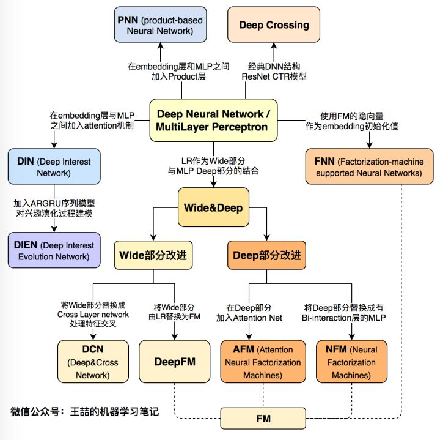
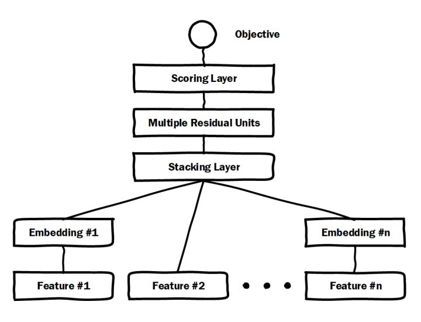

# 排序模型概述

* [返回上层目录](../advanced-knowledge.md)

# 深度学习排序模型演化图谱

[王喆](https://www.zhihu.com/people/wang-zhe-58/activities)有一篇知乎专栏上的文章谷歌：[《阿里、微软等10大深度学习CTR模型最全演化图谱【推荐、广告、搜索领域】》](https://zhuanlan.zhihu.com/p/63186101)，我把它复制到这里，以下是正文：

这里是**「王喆的机器学习笔记」**的第十三篇文章，今天我们一起回顾一下**近3年来的所有主流深度学习CTR模型**，也是我工作之余的知识总结，希望能帮大家梳理推荐系统、计算广告领域在深度学习方面的前沿进展。

随着微软的Deep Crossing，Google的Wide&Deep，以及FNN，PNN等一大批优秀的深度学习CTR预估模型在2016年被提出，**计算广告和推荐系统领域全面进入了深度学习时代**，时至今日，深度学习CTR模型已经成为广告和推荐领域毫无疑问的主流。在之前的专栏文章《[前深度学习时代CTR预估模型的演化之路](https://zhuanlan.zhihu.com/p/61154299)》中，我们与大家一起探讨了传统CTR模型的结构特点以及演化关系。在进入深度学习时代之后，CTR模型不仅在表达能力、模型效果上有了质的提升，而且大量借鉴并融合了深度学习在图像、语音以及自然语言处理方向的成果，在模型结构上进行了快速的演化。

本文总结了广告、推荐领域最为流行的10个深度学习CTR模型的结构特点，构建了它们之间的演化图谱。选择模型的标准尽量遵循下面三个原则：

1. **模型的在业界影响力较大的；**
2. **已经被Google，微软，阿里等知名互联网公司成功应用的；**
3. **工程导向的，而不是仅用实验数据验证或学术创新用的。**

下面首先列出这张**深度学习CTR模型的演化图谱**，再对其进行逐一介绍：

## 微软Deep Crossing（2016年）深度学习CTR模型的base model

微软Deep Crossing模型架构图

微软于2016年提出的Deep Crossing可以说是**深度学习CTR模型的最典型和基础性的模型**。如上图的模型结构图所示，它涵盖了深度CTR模型最典型的要素，即通过加入embedding层将稀疏特征转化为低维稠密特征，用stacking layer，或者叫做concat layer将分段的特征向量连接起来，再通过多层神经网络完成特征的组合、转换，最终用scoring layer完成CTR的计算。跟经典DNN有所不同的是，Deep crossing采用的multilayer perceptron是由残差网络组成的，这无疑得益于MSRA著名研究员何恺明提出的著名的152层ResNet。

论文：[Deep Crossing: Web-Scale Modeling without Manually Crafted Combinatorial Features](https://www.kdd.org/kdd2016/subtopic/view/deep-crossing-web-scale-modeling-without-manually-crafted-combinatorial-fea)

## FNN（2016年）用FM的隐向量完成Embedding初始化

FNN模型架构图

FNN相比Deep Crossing的创新在于**使用FM的隐层向量作为user和item的Embedding**，从而避免了完全从随机状态训练Embedding。由于id类特征大量采用one-hot的编码方式，导致其维度极大，向量极稀疏，所以Embedding层与输入层的连接极多，梯度下降的效率很低，这大大增加了模型的训练时间和Embedding的不稳定性，使用pre train的方法完成Embedding层的训练，无疑是降低深度学习模型复杂度和训练不稳定性的有效工程经验。

论文：[Deep Learning over Multi-field Categorical Data: A Case Study on User Response Prediction](https://arxiv.org/pdf/1601.02376.pdf)

## PNN (2016年)丰富特征交叉的方式

PNN模型架构图

PNN的全称是Product-based Neural Network，**PNN的关键在于在embedding层和全连接层之间加入了Product layer**。传统的DNN是直接通过多层全连接层完成特征的交叉和组合的，但这样的方式缺乏一定的“针对性”。首先全连接层并没有针对不同特征域之间进行交叉；其次，全连接层的操作也并不是直接针对特征交叉设计的。但在实际问题中，特征交叉的重要性不言而喻，比如年龄与性别的交叉是非常重要的分组特征，包含了大量高价值的信息，我们急需深度学习网络能够有针对性的结构能够表征这些信息。因此PNN通过加入Product layer完成了针对性的特征交叉，其product操作在不同特征域之间进行特征组合。并定义了inner product，outer product等多种product的操作捕捉不同的交叉信息，增强模型表征不同数据模式的能力 。

论文：[[PNN\] Product-based Neural Networks for User Response Prediction (SJTU 2016)](https://link.zhihu.com/?target=https%3A//github.com/wzhe06/Reco-papers/blob/master/Deep%2520Learning%2520Recommender%2520System/%255BPNN%255D%2520Product-based%2520Neural%2520Networks%2520for%2520User%2520Response%2520Prediction%2520%2528SJTU%25202016%2529.pdf)

# 镶嵌在互联网技术上的明珠：漫谈深度学习时代点击率预估技术进展

https://zhuanlan.zhihu.com/p/54822778

# 从FM推演各深度CTR预估模型（附开源代码）

https://www.jiqizhixin.com/articles/2018-07-22-19

