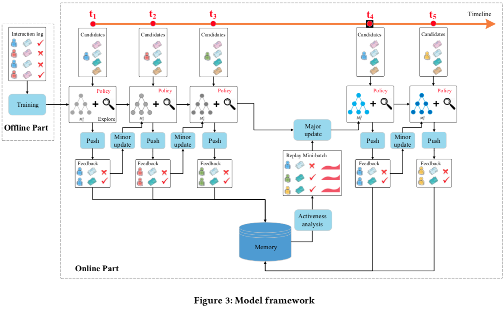
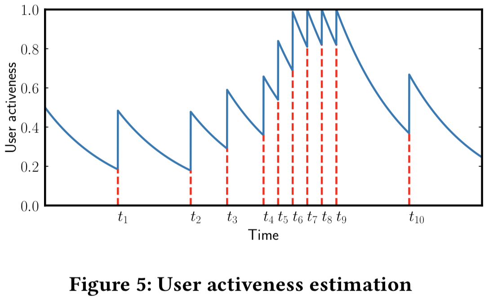
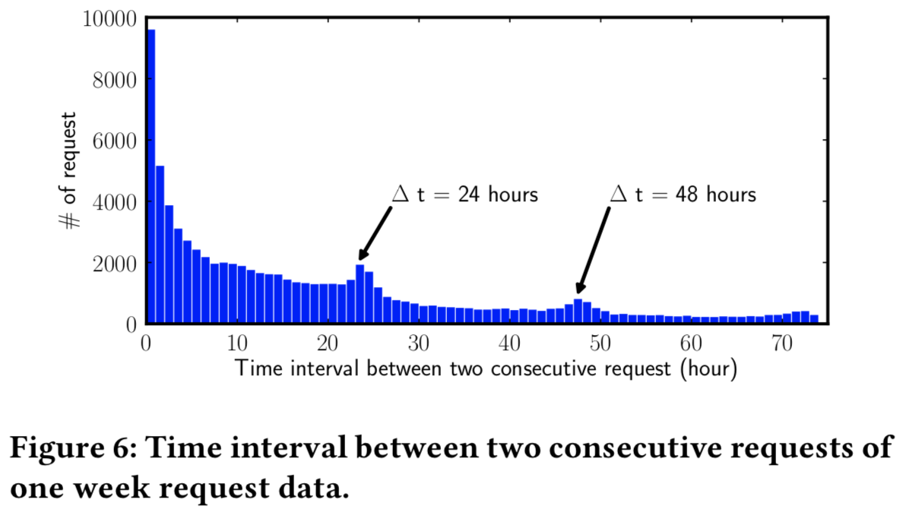
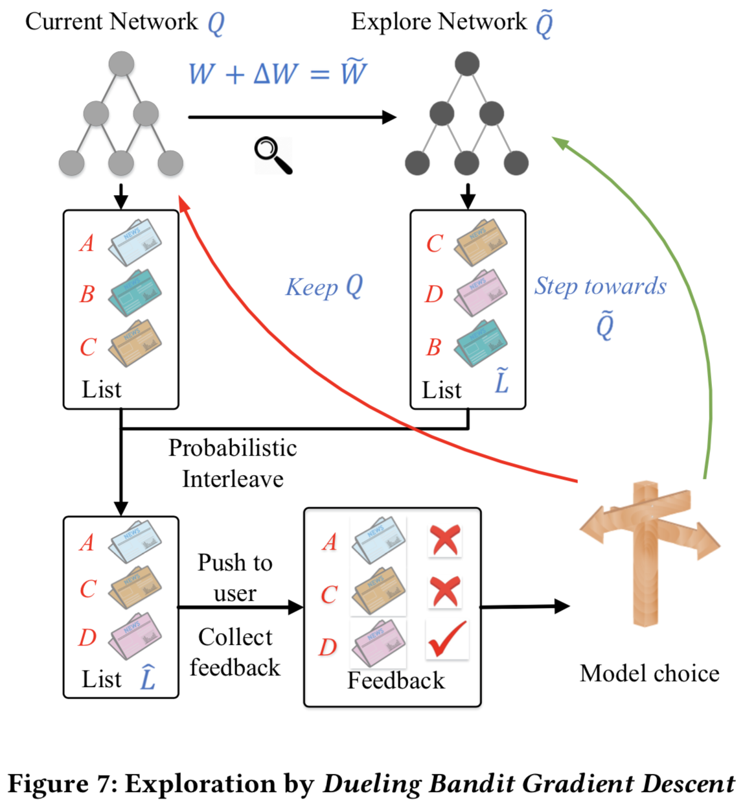
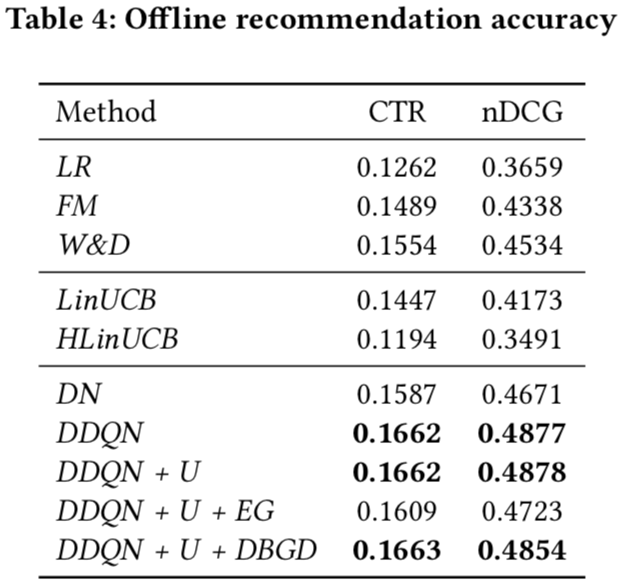

# DRN: A Deep Reinforcement Learning Framework for News Recommendation

* [返回上层目录](reinforcement-learning.md)
* [解读一：我的解读](#解读一：我的解读)
  * [摘要](#摘要)
  * [概述](#概述)
  * [相关工作](#相关工作)
  * [问题定义](#问题定义)
  * [方法](#方法)
  * [实验](#实验)
  * [总结](#总结)
* [解读二：杨镒铭的解读](#解读二：杨镒铭的解读)

论文pdf下载地址：

[《DRN: A Deep Reinforcement Learning Framework for News Recommendation》](http://www.personal.psu.edu/~gjz5038/paper/www2018_reinforceRec/www2018_reinforceRec.pdf)

# 解读一：我的解读

## 摘要

这篇文章提出了用于新闻推荐的新颖的深度强化学习框架。在线个性化新闻推荐是一个有高度挑战性的问题，这是因为新闻特点和用户偏好是动态变化的。尽管

## 概述

在我们的系统中，用户池和新闻池作为**环境**（environment），推荐算法作为**智能体**（agent），用户的特征表征作为**状态**（state），新闻的特征表征作为**动作**（action）。每当用户发生一次请求新闻的行为，状态表征（用户特征）和一组行为表征（候选新闻的表征）会传给智能体。智能体会在当前状态（用户特征）下选择最好的行为（即给用户推荐一系列的新闻），并且取回用户的反馈作为**奖励**（reward）。特别的，奖励由*是否点击*和用户的*活跃度*的估计组成。所有的推荐和反馈日志将存储到智能体的内存中。每隔一小时，智能体就会使用内存中的log日志来更新其推荐算法。

本文剩余的结构如下：

* 第二部分：讨论了相关工作

* 第三部分：提出了问题的定义

* 第四部分：介绍了我们的方法

* 第五部分：实验结果
* 第六部分：简要总结

## 相关工作

### 新闻推荐算法

推荐系统一直在被广泛的研究，因为其和产品的利润直接挂钩。最近，由于在线内容的爆炸性增长，越来越多的人关注推荐的特殊应用：在线个性化新闻推荐。

传统的新闻推荐算法分为三类：

* 基于内容的推荐会维护新闻的频率特征（即TF-IDF）和用户画像（基于历史点击过的新闻）。然后推荐系统会选择与用户画像相似的新闻进行推荐。
* 相比之下，协同过滤方法通常利用当前用户或者相似用户的历史打分进行打分预测，或者两者的结合。
* 为了结合上述两类方法的优势，进一步提出了混合方法来改善用户画像建模。

近期，作为上述方法的扩展和集成，深度学习模型比前三类方法表现出了优越的性能，这是因为其对复杂用户-物品关系的建模能力。

不同于致力于建立用户和物品之间复杂关系模型，我们的算法关注的是处理在线新闻推荐的动态特性，以及未来奖励的建模。然而，这些特征构造和用户-物品关系建模技术可以轻易地继承到我们的模型中。

### 推荐中的强化学习

* 上下文相关的多臂赌博机模型（Contextual Multi-Armed Bandit models，简称MAB）

文献[5, 7, 23, 40, 43, 44, 50]的工作开始将上下文包含了用户和物品的特征的问题定义为MAB问题。文献[23]假设期望的奖励是上下文的线性函数。文献[39]使用赌博机的集成来提升性能，文献[40]提出了无参数模型，文献[50]解决了用户的兴趣会随时间变化。最近，文献[14]有人尝试把赌博机问题，和基于聚类的协同过滤，还有矩阵分解结合起来，这是为了能对更加复杂的用户和物品关系进行建模，并在确定奖励函数时利用社交网络关系。**然而，我们的模型和这些工作大大不同，这是因为，通过应用马尔可夫决策过程，我们的模型能够明确地对将来的奖励建模。长久看来，这将显著提升推荐准确性。**

* 马尔可夫决策过程模型

还有一些文献尝试使用马尔可夫决策过程来对推荐过程进行建模。与基于MAB的方法不同，基于MDP的方法不仅能够获取当前迭代的即时奖励，还能获取未来迭代的潜在奖励。文献[26, 27, 35, 36, 38]试图将物品或者n元（n-gram）物品建模为状态，将物品之间的转移（推荐下一个物品的）建模为行动。然后，这不能扩大到大数据集上，因为当物品的候选集变大时，状态空间的维度会指数级增长。此外，状态转移数据通常非常稀疏，并缺只能用于学习与特定状态转换对应的模型参数。因此，模型确实很难去学习。不同于上述文献，**我们提出了一个采用连续状态和行为表征的MDP框架，能够让系统去扩展，并且通过使用所有的状态、行动和奖励来有效学习模型参数。**

## 问题定义

我们的问题定义如下：

当一个用户u给推荐智能体G在时刻t发送一个新的请求，已知一个新闻I的候选集，我们的算法将给这个用户选择一个TopK的适合其的新闻列表L。论文中用到的符号如下表所示。

| 符号 | 含义                         |
| ---- | ---------------------------- |
| G    | Agent                        |
| u, U | User, User set               |
| a    | Action                       |
| s    | State                        |
| r    | Reward                       |
| i, I | News, Candidate news pool    |
| L    | List of news to recommend    |
| B    | List of feedback from users  |
| Q    | Deep Q-Network               |
| W    | Parameters of Deep Q-Network |

## 方法

近年来，个性化新闻推荐已经引起了许多关注。当前的方法通常可以归类为基于内容的方法，基于协同过滤的方法，还有混合方法。最近，为了能够对更复杂的用户和物品之间交互进行建模，进一步提出了许多深度学习模型。当新闻推荐问题发生在在线场景下时，会变得更加具有挑战性，这是因为有三点：

* 由于新闻特征和用户喜好的高度动态性，需要在线学习
* 只单纯使用点击/未点击标签捕捉不到用户的对新闻的全部反馈信息
* 传统的推荐方法倾向于推荐相似的物品，这样会缩减用户的阅读选择范围，会使得用户对推荐内容感到厌倦，导致见效用户长期的满意度。

为了解决上述三个挑战，我们提出了**基于DQN的深度强化学习框架，来进行在线个性化新闻推荐**。

特别的，我们使用**用户的连续状态特征表征**和**物品的连续行为特征表征**作为给多层DQN的输入，以预测潜在的奖励（即，用户是否会点击该新闻）。

* 该框架能够处理新闻推荐的高度动态特性，这是因为DQN可以在线更新。同时，DQN不同于常见的在线方法，这是因为其能够推测用户和物品之间的未来交互。
* 我们提出将用户的活跃度（即用户在一次推荐后有多快再次回到App）和点击标签结合，作为用户的反馈。
* 我们提出将Dueling Bandit Gradient Descent探索策略用于我们的算法，这样不仅能够改善推荐多样性，还能避免推荐精确度的损失。经典的探索策略如ε-greedy和Upper Confidence Bound会引起损害推荐精确度。

我们的方法和MAB类方法有很大的不同，因为其对未来的奖励有明确的建模，也不同于之前的使用用户log记录的MDP方法，因为其对状态和动作的连续表征和扩展到大规模系统上的能力。

本节内容如下：

### 模型框架

如图3所示，我们的模型由离线部分和在线部分组成。在离线阶段，从新闻和用户提取四类特征（在下一节讨论）。使用一个多层DQN，根据这四类特征来预测奖励（即，用户-新闻的点击标签和用户活跃度）。使用离线的用户-新闻点击记录来训练该网络。然后，在在线学习部分，我们的推荐智能体G将会和用户交互，并用如下方式来更新网络：

（1）PUSH（**推送**）：在每一个时间戳(t1, t2, t3, t4, t5, …)上，当用户发送一个新闻请求到系统时，推荐智能体G将以当前用户和新闻候选集的特征表征作为输入，然后产生一个top_K的推送给推荐系统的新闻列表L。当前模型的利用（4.3节会讲到）和新物品的探索（4.5节会讲到）共同决定了新闻列表L。

（2）FEEDBACK（**反馈**）：接收到推荐的新闻列表L的用户u，将通过其对这组新闻的点击，给出其反馈。

（3）MINOR UPDATE（**次要更新**）：在每个时间戳之后（即，在时间戳t1后），根据上一个用户u和新闻列表L的特征表征，以及反馈B，智能体G会通过比较利用网络Q和探索网络$\tilde{Q}$的推荐表现，对模型进行更新。如果$\tilde{Q}$的推荐结果好，则当前的网络就将朝着$\tilde{Q}$的方向去更新。否则，Q将保持不变。在每次推荐展示后都会进行次要（Minor）更新。

（4）MAJOR UPDATE（**主要更新**）：经历一段时间$T_R$后（即在时间戳t3后），智能体G将使用存在其内存中的用户反馈B和用户活跃度来更新Q网络。这里，我们使用经验回放技术来更新网络。特别地，智能体G会保留最近的历史点击和用户活跃度记录。每次进行更新时，智能体G将采样一批记录来更新模型。主要更新通常在某一特定的时间段后进行，比如每隔一个小时，在此期间，已经进行了数以千计的推荐展示，并且会收集他的反馈。

（5）重复步骤（1）-（4）。

### 特征构建

为预测出用户是否会点击某个特定的新闻，我们构建了四类特征：

* **新闻特征**包含417维one-hot特征，这些one-hot特征描述了这个新闻是否有某一属性，包括标题、内容提供者、排名、实体名称、种类、话题类别，和分别在过去1小时内、6小时内、24小时、1周内和1年内的点击次数。
* **用户特征**主要描述了用户分别在1小时内、6小时内、24小时内、1周内和1年内所点击的新闻特征（即，标题、内容提供者、排名、实体名称、类别、话题类别），同时对于每个时间粒度还有一个总的点击次数。因此，一共有413x5=2065维。
* **用户新闻特征**。这25维特征描述了用户和某一个新闻的的交互，即，出现在用户阅读历史中的实体（还有种类、话题类别和内容提供者）的频率。
* **上下文特征**。这32维的特征描述了新闻请求发生时的上下文，包含时间、星期和新闻的新鲜度（请求时间和新闻发布时间之间的时间跨度）。

为了把注意力集中于对强化学习推荐系统的分析，我们这里不会加入更多特征（如文本特征）。但是，能够轻易将其集成到我们的框架中，以便得到更好的表现。

### 深度强化学习模型

考虑到之前提到的新闻推荐的动态特征和估计未来奖励的需要，我们使用深度Q网络（DQN）来对一个用户点击某个新闻的可能性进行建模。从强化学习的角度来看，用户是否点击某个新闻（以及之后要推荐的新闻）的可能性实质上就是智能体能够获得的奖励。因此，我们对整个奖励建模如式(1)所示：
$$
y_{s,a}=Q(s,a)=r_{immediate}+\gamma r_{future}\quad\quad\quad\quad(1)
$$
其中，状态（state）为上下文特征和用户特征，行动（action）为新闻特征和用户-新闻交叉特征，$r_{immediate}$是当前环境的即时奖励（即，用户是否点击该新闻），$r_{future}$是智能体对将来奖励的预估。γ是平衡即时奖励和未来奖励两者权重的超参数。特别地，已知s为当前状态，通过在时间戳t处采取行动a，我们使用DDQN目标来预测整个奖励，如式2所示。
$$
y_{s,a,t}=r_{a,t+1}+\gamma Q(s_{a,t+1},\text{arg }\mathop{\text{max}}_{a'}Q(s_{a,t+1},a';W_t);W_t')\quad\quad\quad(2)
$$
其中，$r_{a,t+1}$为采取行动a的即时奖励（下标为t+1是因为奖励总是会比行动延迟1个时间步）。这里，Wt和W't是两个不同的DQN参数设置。在该式中，给定所选动作a，智能体G将推测下一个阶段$s_{a,t+1}$。基于此，给定动作{a'}的候选集，根据参数Wt，选择使得将来奖励最大化的动作a‘。在此之后，已知状态$s_{a,t+1}$，基于W't，计算出估计的将来奖励。每隔几次迭代，互换Wt和W‘t。已经证明该策略能消除Q估计值的过度优化。通过该处理，DQN可以同时根据即时奖励和将来将来进行决策。

如图4所示，我们将四类特征喂入Q网络，**用户特征**和**上下文特征**作为状态特征，同时，**用户新闻特征**和**新闻特征**作为动作特征。

* 一方面，在状态s下采取动作a所获得的奖励，与所有特征都紧密相关。
* 另一方面，由用户自己的特征（是否活跃，是否今日读了足够的新闻）决定的奖励，仅仅受用户和上下文特征影响。

根据上述观察，如文献[47]所述，我们将Q函数划分为**值函数**V(s)和**优势函数**A(s,a)，其中V(s)仅仅由状态特征决定，A(s,a)由状态特征和动作特征句共同决定。

### 用户活跃度

传统推荐系统仅仅集中于优化类似CTR的指标（即仅仅利用是否点击标签），它只描述了用户的部分反馈信息。推荐系统的表现好坏，可能也会影响用户是想再次使用该APP，即，好的推荐系统会增加用户使用该APP的频率。因此，还应当适当考虑用户的活跃度变化。

用户并非以一个统一的模式请求新闻。用户通常看新闻的时间段比较短（即30分钟），在这段时间内，用户会非常高频的请求或者点击新闻。然后用户就会退出APP，几个小时后，当用户想读更多的新闻时，又会重新打开APP。当用户请求新闻时，用户会返回APP（用户在点击新闻前总是会先请求新闻，所以其实也隐含了用户点击）。

我们使用生存模型对用户返回和用户活跃度进行建模。生存分析已经用在了估计用户返回时间领域了。假设T是直到用户下次返回APP的时间长度，则风险函数（即事件发生的瞬时率）如式（3）所示：
$$
\lambda(t)=\mathop{\text{lim}}_{dt\rightarrow 0}\frac{Pr\{t\le T < t+dt|T\ge t\}}{dt}\quad\quad\quad(3)
$$
则在时间t后事件发生的概率如式（4）所示：
$$
S(t)=e^{-\int^t_0\lambda(x)dx}\quad\quad\quad(4)
$$
并且预计的生命跨度$T_0$如下式所计算：
$$
T_0=\int_0^{\infty}S(t)dt\quad\quad\quad(5)
$$
在我们的问题中，我们仅设置
$$
\lambda(t)=\lambda_0
$$
，意味着每一个用户都有一个恒定的概率返回APP。每当监测到一次用户返回，就对该用户设置
$$
S(t)=S(t)+S_a
$$
。用户活跃度得分不会超过1。例如，如图5所示，该用户的活跃度在0时刻处从S0开始衰减。在时刻t1处，用户返回了APP，这导致用户的活跃度有一个Sa的上涨。然后，在时刻t1后，用户活跃度持续下跌。类似的事情发生在t2、t3、t4和t5。注意，在t4到t9之间，尽管该用户的请求频率已经很高了，但是用户活跃度的最大值依然被截断限制为1。

参数
$$
S_0,\ S_a,\ \lambda_0,\ T_0
$$
根据数据集中的实际用户模式来确定。S0被设置为0.5，表示用户的随机初始状态（即可能是活跃的，也可能是不活跃的）。我们可以观察用户每两个连续请求之间的时间间隔的直方图，如图6所示。

我们观察到，除了一天多次阅读新闻外，人们通常每天定期返回APP。所以我们将T0设置为24小时。根据式(4)和式(5)，衰减因子λ0设置为1.2e-5/s。此外，每次点击后，用户活跃度的增量Sa设置为0.32，以保证用户在每日一次请求后返回初始状态，即，
$$
S_0e^{-\lambda_0T_0}+S_a=S_0
$$
将点击/非点击标签r_click和用户活跃度r_active结合起来，如式(6)所示。
$$
r_{total}=r_{click}+\beta\ r_{active}\quad\quad\quad(6)
$$
尽管这里我们使用生存模型来估计用户活跃度，但是其他的模型，如泊松点过程（Poisson point proces）也能提供相似的功能。

### 探索

强化学习中最直接的探索策略就是ε-greedy和UCB模型。ε-greedy会以概率ε来随机推荐新物品，而UCB会挑选多次未被探索过的物品（因为这些物品可能有较大的方差）。但是很显然，这些细枝末节的探索技术，在短期内会损害推荐系统的性能。因此，相比随机地探索，我们使用Dueling Bandit Gradient Descent算法进行探索。

直观地，如图7所示，智能体G会使用当前网络Q产生推荐列表L，并使用探索网络$\tilde{Q}$来产生另一个推荐列表$\tilde{L}$。通过对当前网络Q的参数W增加小扰动ΔW（式7），来得到网络$\tilde{Q}$的参数$\tilde{W}$。
$$
\Delta W=\alpha \cdot rand(-1, 1)\cdot W\quad\quad\quad(7)
$$
其中，α是探索系数，并且rand(-1,1)是-1到1之间的随机数。然后，智能体G将进行概率交织，使用L和$\tilde{L}$生成合并后的推荐列表$\hat{L}$。为了确定推荐列表$\hat{L}$中每个位置的物品，概率交织方法首先在列表L和$\tilde{L}$之间随机选择。假设选择了L，然后L中的物品i会以由其在L中的排名确定的概率（排名越靠前，被选择的概率越大）被放入$\hat{L}$。然后，列表$\hat{L}$会被推荐给用户u，智能体G将得到用户的反馈B。如果通过探索网络$\tilde{Q}$所推荐的物品受到的反馈更好，则智能体G会将网络Q朝着$\tilde{Q}$更新，即Q网络的参数W更新如式(8)所示。
$$
W'=W+\eta \tilde{W}\quad\quad\quad(8)
$$
否则，智能体G将保持网络Q不变。通过这种探索，智能体会进行更有效的探索，同时推荐精度又不损失更多。

## 实验

### 数据集

我们从一个商业新闻推荐应用中收集到抽样离线数据集，并对此进行实验，并将我们的系统在线部署在APP上超过一个月。每当用户请求新闻，每个推荐算法将给出其推荐结果，并对用户的反馈进行记录（是否点击）。采样数据的基本统计情况如表2所示。

| ...           | Duration | # of users | # of news |
| ------------- | -------- | ---------- | --------- |
| Offline stage | 6 mouths | 541337     | 1355344   |
| Online stage  | 1 mouth  | 64610      | 157088    |

在第一个离线阶段，训练数据和测试数据按照时间顺序进行拆分（最后两周的数据作为测试数据），使在线模型能够在不同的切片之间更好地学习序列化信息。在第二个在线部署阶段，我们使用离线数据来与训练模型，并在真实的生产环境中运行所有的对比方法。

如图8所示，数据集的数据是非常倾斜的。每个用户的请求数是一个长尾分布，绝大多数用户请求新闻的次数少于500次。每个新闻的推送次数也是长尾分布，并且绝大多数新闻被推送给用户的次数少于200次。

### 评估措施

* CTR，点击率，如式(9)所示。
  $
  CTR=\frac{\text{number of clicked items}}{\text{number of total items}}\quad\quad\quad(9)
  $

* 精度@k。在k处的精度如式(10)所示。
  $
  Precision@k=\frac{\text{number of click in top-k recommended items}}{k}
  $

* nDGC。我们应用标准正则化折扣累积增益，如式(11)所示。
  $
  DCG(f)=\sum_{r=1}^n y_r^fD(r)
  $

  $
  D(r)=\frac{1}{log(1+r)}
  $

  其中，r表示物品在推荐列表中的排名，n是推荐列表的长度，f是排名函数或者算法，$y^f_r$是1或者0，表示是否点击会发生，D(r)是折扣。

### 实验设置

在我们的实验中，通过参数空间的网格搜索来确定参数，使得点击率最大。详细的设置如表3所示。

### 对照方法

**我们的模型的变种**。我们的基本模型叫“DN”，它使用不考虑未来奖励的dueling-structure Double Deep Q-network。然后，考虑到未来奖励，它又变为“DDQN”。在那之后，我们又往“DDQN”中添加了更多的成分，“U”表示用户活跃度，“EG”表示ε-greedy，“DBGD”表示Dueling Bandit Gradient Descent。

**基线算法**。我们和如下五个基线算法对比我们的算法。所有这五种算法在整个实验阶段均在线更新。一些业界先进的算法未能应用，因为它们不适合我们的问题，比如文献[43]（用户图和物品图过大，无法逐步更新），文献[45]（和W&D类似，但是去处了文本特征），文献[48]（经验回放并不适用于经验回放更新）。

* LR。逻辑回归作为baseline方法，广泛用于工业界，这是因为它应用容易并且高效。它把所有的这四类特征都作为输入。使用Keras来应用它。
* FM。因子分解机是一种先进的上下文感知推荐算法。它将所有的四类特征作为输入，使用特征的结合及其交叉进行点击预测。
* W&D。Wide&Deep是广泛使用的业内先进的深度学习模型，结合了记忆（通过基于对分类特征进行广泛组合作为特征的逻辑回归）和泛化（通过对初始特征进行embedding的深度神经网络）来预测点击标签。
* LinUCB。Linear Upper Confidence Bound基于估计的潜在奖励的上置信界，能选择一个臂（即推荐一个新闻）。基于新闻请求数和新闻点击数的长尾分布，我们将同一组参数用于不同的新闻，这在我们的数据集上实际上要比原始的设置表现更好。（原始LinUCB的提升版本-HLinUCB也会被比较）。
* HLinUCB是另一个在推荐系统中先进的bandit-based方法。Hidden Linear Upper Confidence Bound进一步允许学习隐特征对奖励进行建模。我们允许原始的那种对不同的用户和新闻保持不同的参数设置。然而，在本例中，只有4.2节介绍的新闻特征才能直接被应用，同时描述用户和新闻之间交互的其他特征有望在隐特征中学习。

对于所有的对比算法，通过选择top-k的每个物品的预估潜在奖励（LinUCB，HLinUCB和我们的方法）或者点击概率（LR，FM，W&D）来选择物品，从而生成推荐列表。

### 离线估计

我们首先将我们的方法和离线数据集上其他baseline进行对比。离线数据集是静态的，并且只记录了特定用户-新闻交互对。因此，由于不同的推荐决策，我们不能观测用户活跃度的变化。类似地，由于受限的候选新闻集（即，只记录了部分候选新闻的点击标签），探索策略无法探索。因此，在离线设置中考虑用户活跃性和探索的好处并不明显。因此，我们仅仅展示在这种情况下的推荐精度。

对于离线实验，我们以大约1:11的比例降采样点击/不点击，使得模型更好地拟合。

我们设计算法来推荐top5新闻，并以CTR和nDCG的形式来显示结果（我们忽略了top5的精度，因为它会和CTR相同）。

（1）精度。精度的结果如表4所示。正如所料，我们的算法优于所有baseline算法。和baseline相比，我们的base模型DN已经达到了非常好的结果。这是因为dueling网络结构能够很好的对用户和新闻之间的交互进行建模。增加未来奖励考虑（DDQN），我们实现了又一次显著提升。然后，在离线情况下，结合用户活跃度和探索并不一定能提升性能，这可能是因为在离线情况下，算法不能和用户进行最好的交互，因为候选新闻是有限的静态集合（很可能发生的情况是，依据用户活跃度和探索，智能体G想给用户u推荐新闻i，但实际上用户u是否将会点击新闻i在离线log中不存在。。那这就没办法了）。此外，简单的随机探索，如ε-greedy会损害推荐系统的精度。

(2)模型收敛过程。在图9中，我们进一步展示了不同方法的累积CTR，以揭示收敛过程。离线数据根据时间顺序排列来模拟用户按实际时间发送新闻请求的过程。所有对照方法会在每隔100个请求片段后进行更新。正如所预期的一样，我们的算法（DDQN+U+DBGD）收敛地比起让方法要快，CTR结果要更好。

### 在线估计

在在线估计阶段，将我们的模型和对照算法部署到商业新闻推荐应用上。用户被均匀地划分给不同的算法。在线设置中，我们不能仅仅看推荐精度，还要观察不同算法的推荐多样性。当收到用户的新闻请求时，所有的算法均推荐top20新闻给用户。

（1）精度。从CTR、精度@5和nDCG上对比不同算法。如表5所示，我们的完整模型DDQN+U+DBGD的性能显著优于其他所有模型。

添加每一个组成的观察如下：加入未来奖励（DDQN）确实提升了基本的DN的推荐精度。然而，进一步添加用户活跃度U在推荐精度方面并没有非常有用。（但是该部分对于提升用户活跃度和推荐多样性非常有用，稍后描述他们）此外，使用DBGD作为探索方法，有助于避免经典的ε-greedy方法引起的推荐性能损失。

（2）推荐多样性。最终，为了评估探索的效果，我们使用ILS来计算不同算法的推荐多样性，计算方法如式(13)所示：
$$
ILS(L)=\frac{\sum_{b_i\in L}\sum_{b_j\in L,b_j\neq b_i}S(b_i,b_j)}{\sum_{b_i\in L}\sum_{b_j\in L,b_j\neq b_i}1}\quad\quad\quad(13)
$$
其中，S(bi, bj)表示是物品bi和bj之间的余弦相似度。表6为用户点击的新闻的多样性。一般来说，在我们的算法DDQN + U + DBGD中的用户会有最优的点击多样性。有意思的是，加入EG似乎不能提升推荐多样性，这可能是因为当进行随机探索（即EG）时，推荐系统可能会推荐一些完全不相关的物品给用户。尽管这些物品有高度的多样性，但是用户可能并没有兴趣阅读他们，并转而去阅读他们更感兴趣的物品。这样的话，这种探索无助于改善推荐的多样性。令我们惊讶的是，一些baseline方法，如HLinUCB，也能够得到与我们的方法接近的推荐多样性，这意味着UCB也能达到合理的探索结果（但是这种没有指引的探索会损害推荐精度）。

## 总结

在本文中，我们提出了基于DQN的强化学习框架进行在线个性化新闻推荐。不同于之前的方法，我们的方法能够有效的对动态新闻特征和用户偏好进行建模，并且还明确考虑将来，以便长期能够获取更高的奖励（即CTR）。我们进一步将用户活跃度作为点击/未点击标签的补充，来捕获更多的用户反馈信息。此外，我们将有效的探索策略应用于我们的框架，来提升推荐系统。实验显示我们的方法能够显著提升推荐精度和推荐多样性我们的模型普适于很多其他推荐问题。

对于将来的工作，相应地为不同的用户设计模型会更有意义（即，重度用户和一次性用户），特别是用户活跃度的测量。如果针对不同的用户群观察到不同的模式，它可以带来更多的见解。

# 解读二：杨镒铭的解读

作者是[杨镒铭](https://www.zhihu.com/people/yang-yi-ming-80)，毕业于中科大，现就任于滴滴，负责行车路线的召回和排序工作。

下面的内容是作者知乎专栏关于此论文的解读：

[强化学习系列一——基于深度强化学习的新闻推荐模型DRN](https://zhuanlan.zhihu.com/p/58280384)

# 参考文献

