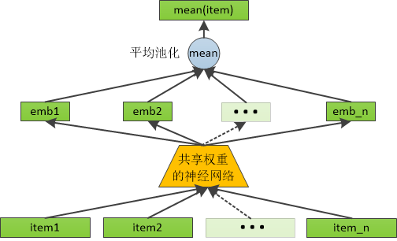

# 基于共享权重神经网络+池化的用户行为序列建模

* [返回上层目录](../short-sequence.md)
* [问题描述](#问题描述)
* [解决思路](#解决思路)
* [代码实现](#代码实现)
* [结论](#结论)
* [探讨](#探讨)
  * [共享权重加池化网络和全连接网络的区别](#共享权重加池化网络和全连接网络的区别)


# 问题描述

给用户行为序列进行建模，每个item的输入为n维向量，有m个item，可采用类似卷积结构那样的方法，用同一个输入为m维的神经网络NN，对这m个item依次进行神经网络运算，然后再把得到结果进行拼接。这个m维输出的神经网络NN的作用方式，就类似于卷积神经网络的卷积头，使用同一套参数对m个item进行神经网络计算。

# 解决思路

这个思路是非常可行的，实际上这是一种**共享权重（weight sharing）**的方式，类似于卷积神经网络（CNN）中的卷积操作。具体来说，可以采用以下结构来实现这个方法：

模型结构：



1. **共享参数的网络（共享权重）**：
   - 对于每个item，使用相同的神经网络（NN）来处理其特征输入。每个item的输入是一个$n$维的向量（item的特征），有$m$个item，因此输入特征维度总共是$m\times n$。
   - 对每个item的输入，使用相同的神经网络结构进行处理。换句话说，网络的参数在处理不同item时是共享的，就像卷积神经网络在处理图像的不同区域时共享卷积核参数。
2. **处理流程**：
   - **输入层**：每个item有$n$维的特征，序列数量为$m$个item，因此网络的输入是一个$m\times n$的矩阵。
   - **共享神经网络**：对于每个item，你可以将$n$维的特征输入通过同一个神经网络（例如，简单的全连接层、激活层等）进行处理，得到一个新的输出。每个item的输出都是同样形态的$k$维向量，其中$k$是你希望每个item最终输出的维度。
   - **拼接**：对所有item的输出结果进行拼接，得到一个$m\times k$的矩阵，其中每一行代表一个item的输出向量。
3. **后续操作**：
   - 在得到所有item的处理结果后，你可以对这些$m\times k$维的向量进行进一步的处理：
     - **池化（可选）**：可以选择对所有item的输出进行池化（如最大池化或平均池化），将其合并为一个固定长度的向量。池化操作有助于聚合信息，减少维度。
     - **全连接层**：池化后的向量可以通过全连接层进行进一步的映射，形成最终的输出（例如，针对item的威胁效果评估或决策输出）。

这种模型结构的优势是：

- **共享参数**：由于使用了共享权重，你的模型可以在处理不同item时保持一致性，减少参数的数量，避免过拟合。
- **处理变长输入**：如果item数量$m$是变化的（例如，1个、2个或更多item），这可以通过适当的池化或者填充技术来应对。
- **灵活性**：你可以在每个item的输出上进行更多的操作（如特征选择或更复杂的决策层）。

# 代码实现

假设用户行为序列有3个item，每个item有5维特征，即输入是一个$5\times 3$的矩阵。你用一个共享的神经网络处理每个item的特征，假设每个item输出的维度为 4（即$k=4$），那么你将得到一个$3 \times 4$的矩阵。如果你用最大池化（或其他池化方法）处理这个矩阵，最终得到一个固定长度的向量，然后进行后续决策。

```python
import torch
import torch.nn as nn


class BehaviorSequenceModel(nn.Module):
    def __init__(self, item_feature, output_dim):
        super(BehaviorSequenceModel, self).__init__()
        # 共享的全连接层
        # self.shared_nn = nn.Sequential(
        #     nn.Linear(item_feature, 2),  # 输入到隐藏层
        #     nn.ReLU(),  # 激活函数
        #     nn.Linear(2, output_dim)  # 隐藏层到输出层
        # )

        linear_layer = nn.Linear(in_features=item_feature, out_features=output_dim)
        # 初始化权重为1，偏置为0
        nn.init.constant_(linear_layer.weight, 1)  # 权重初始化为1
        linear_layer.weight.data = torch.tensor([[1., 1., 1.],
                [0., 0., 0.],
                [1., 1., 1.]], requires_grad=True)
        nn.init.constant_(linear_layer.bias, 1)  # 偏置初始化为0
        # 查看初始化后的权重和偏置
        print("初始化后的权重:")
        print(linear_layer.weight)
        print("初始化后的偏置:")
        print(linear_layer.bias)
        self.shared_nn = nn.Sequential(
            linear_layer,
        )

    def forward(self, items):
        # items: [batch_size, item_num, item_feature]
        batch_size, item_num, item_feature = items.size()

        # 对每个item的特征进行处理，得到 [batch_size, item_num, output_dim]
        item_outputs = self.shared_nn(items.view(batch_size * item_num, item_feature))

        # 将输出的形状恢复为 [batch_size, item_num, output_dim]
        item_outputs = item_outputs.view(batch_size, item_num, -1)

        # 可以在这里对item进行池化操作，例如平均池化或最大池化
        pooled_output_mean = item_outputs.mean(dim=1)  # 按照item维度求平均池化
        pooled_output_max_values, pooled_output_max_indices = item_outputs.max(dim=1)  # 按照item维度求平均池化

        return torch.concat([pooled_output_mean, pooled_output_max_values], dim=1)


# 测试部分
def test_item_model():
    # 参数设置
    batch_size = 2  # 批次大小
    item_num = 2  # 每个样本的item数量
    item_feature = 3  # 每个item的特征维度
    output_dim = 3  # 每个item的输出维度

    # 随机生成 batch_size x item_num x item_feature 的矩阵作为item特征
    # items = torch.randn(batch_size, item_num, item_feature)
    items1 = torch.tensor([[[1.0, 2.0, 3.0], [4.0, 5.0, 6.0]]])
    items2 = torch.tensor([[[1.0, 1.0, 1.0], [2.0, 2.0, 2.0]]])
    items = torch.concat([items1, items2], dim=0)
    # 生成随机输入，形状为 batch_size x item_num x item_feature

    # 创建模型实例
    model = BehaviorSequenceModel(item_feature=item_feature, output_dim=output_dim)

    # 将生成的item特征传入模型进行处理
    output = model(items)

    # 打印输出
    print("输入item特征：")
    print(items)
    print("模型输出：")
    print(output)


# 运行测试
test_item_model()
```

代码解释：

* **输入数据**：`items` 是一个形状为 `[batch_size, item_num, item_feature]` 的三维张量，表示批量大小为 `batch_size` 的样本，每个样本中有 `item_num` 个item，每个item有 `item_feature` 个特征。

* **共享全连接层**：我们通过 `shared_nn` 层对每个item的特征进行处理。为了让网络处理每个item的特征，我们使用 `view(batch_size * item_num, item_feature)` 将输入从三维张量展平为二维张量，然后通过 `self.shared_nn` 进行处理。输出的形状是 `[batch_size * item_num, output_dim]`。

* **恢复形状**：处理完后，输出是一个形状为 `[batch_size * item_num, output_dim]` 的张量，我们使用 `view(batch_size, item_num, -1)` 将其恢复为三维张量。

* **池化操作**：对每个样本的所有item输出进行池化（在这里我们使用 **平均池化**），得到形状为 `[batch_size, output_dim]` 的输出，表示每个样本的最终结果。
* **拼接**：把平均池化和最大池化的结果进行拼接，作为输出。

# 结论

这种设计方法与卷积神经网络类似，通过共享权重的方式对多个item进行处理，保持了参数的一致性和计算的高效性，同时避免了对于每个item单独训练网络的高计算开销。这种方法对于处理可变数量的item尤其有效，且能很好地捕捉不同item之间的共性。

在这种情况下，我们的模型需要处理三维数据。我们可以先对每个item进行处理（使用共享的全连接层），然后使用池化操作（如最大池化或平均池化）将多个item的输出汇聚成一个固定长度的向量。这样，我们就能处理 **任意数量的item**，并且保证输出的维度是固定的。

# 探讨

## 共享权重加池化网络和全连接网络的区别

对于不固定数量的item特征，现在有2种处理方法：

1、类似上面我们做的那样，对每一个item进行一个共享权重的神经网络计算，然后再mean池化

2、设定一个最大可能的item数量，对所有的item特征进行拼接，然后剩余的item位置补零，然后再传给一个神经网络

这两种，各自的优势和劣势是什么，哪一种会好一些？

**解答**：

这两种处理方法在处理不固定数量的item特征时，都是有效的方式，但它们的优缺点有所不同。我们可以从几个方面来分析它们的优势和劣势，包括 **灵活性**、**计算效率**、**模型表现** 以及 **对item数量变化的适应性** 等。

**方法 1：对每一个item进行共享权重的神经网络计算，然后再 `mean` 池化**

这种方法的基本思路是：对每个item的特征使用相同的神经网络（共享权重），然后对每个样本中的所有item输出进行池化（例如平均池化），得到一个固定维度的结果。

优势：

1. **灵活性高**：因为对每个item的处理是通过共享权重的神经网络进行的，这意味着模型不需要知道item的具体数量，也不需要对item数量进行特殊处理。每个item的特征都会通过相同的网络进行处理，无论有多少item。
2. **适应性强**：无论每个样本中有多少item，网络都会根据item的数量进行动态处理。无item或不同数量的item都能自适应。
3. **避免冗余**：池化操作（如平均池化）帮助去除多余的细节，只保留最重要的特征信息，从而得到一个固定维度的输出。这种方式对于不同数量的item（例如 1 个、2 个或 3 个）都能有效地处理。
4. **较少的内存消耗**：池化操作有效地减少了信息的维度，从而降低了内存和计算资源的消耗。

劣势：

1. **计算开销较大**：对于每个item的特征进行神经网络计算（即共享权重的全连接层）会增加计算的复杂性，尤其当item数量很大时，可能会影响效率。
2. **信息丢失**：平均池化虽然能有效减少信息的维度，但可能会丢失一些细节信息，特别是在item数量不多的情况下，池化后的信息可能不够丰富。
3. **对item特征的表示能力有限**：虽然池化能合并item的特征，但它的表现能力可能无法完全捕捉所有item间的相互关系。如果item之间存在复杂的相互作用，池化操作可能无法有效表示这种关系。

**方法 2：设定最大可能的item数量，对所有item特征进行拼接，剩余的item位置补零，再传给神经网络**

这种方法的思路是：为固定数量的item（最大数量）预留空间，将每个样本中的item特征拼接成一个统一的向量，如果某个样本的item数量不足最大数量，则用零填充。

优势：

1. **可以捕捉所有item的信息**：拼接的方式允许每个item的信息在模型中完整表达。通过这种方式，item间的关系可以在模型的全连接层中被学习到，尤其适合有复杂相互作用的场景。
2. **灵活的处理不定长输入**：通过填充零，可以适应不同item数量的样本，而不需要担心输入的形状不一致。即使有些样本的item数量少于最大数量，零填充后也能统一输入格式。
3. **模型对item数量敏感**：如果模型能够有效利用不同item位置的信息（通过全连接层），就能较好地捕捉到每个item的作用和特征，而不仅仅依赖池化操作的简化。

劣势：

1. **固定item数量带来的限制**：设定一个固定的最大item数量意味着，如果实际的item数量超过了这个数目，就会丢失信息。或者如果item数量远低于最大数量，零填充可能导致信息浪费。
2. **填充操作的影响**：填充零虽然能够保持输入形状一致，但也可能引入噪声，特别是当item数量不足时，零填充会占用不必要的计算资源，影响模型性能。
3. **计算效率低**：当item数量较多时，拼接所有item的特征可能会导致输入向量的维度非常高，增加计算量和内存消耗。此外，随着最大item数量的增加，计算和存储开销也会随之增长。
4. **难以适应不同规模的item数目**：在这种方法中，最大item数量必须事先设定，如果在实际场景中item数量有较大波动，可能导致模型在某些情况下处理效率低下，甚至丢失信息。

结论与建议：

- **如果item数量差异较大且信息不依赖于item之间的复杂交互**，方法 1（共享神经网络 + 池化）会更合适，因为它能较好地处理不同数量的item，并且池化操作能够减少计算量。
- **如果每个item的特征和item间的关系非常重要**，且item数量变化较少或变化不是很大时，方法 2（固定最大item数量 + 拼接 + 填充）可能更有优势，因为它能保留每个item的所有特征信息，并且对item之间的关系更敏感。

建议：

根据你的应用场景，如果item数量变化较大且你希望尽可能减少计算资源的浪费，则倾向于 **方法 1**。它对item数量的适应性较好，而且可以通过池化操作减少计算开销，避免填充零带来的信息浪费。如果item数量相对稳定或你确实需要保留每个item的独立信息，**方法 2** 会更适合，但需要注意固定最大item数量的选择，以平衡计算效率和模型的适应性。