# DSIN:Deep Session Interest Network for Click-Through Rate Prediction

* [返回上层目录](../alibaba.md)
* [问题背景](#问题背景)
* [模型结构](#模型结构)
  * [基本架构](#基本架构)
  * [DSIN模型](#DSIN模型)
  * [Session Division Layer](#Session Division Layer)
  * [Session Interest Extractor Layer](#Session Interest Extractor Layer)
  * [Session Interest Interacting Layer](#Session Interest Interacting Layer)
  * [Session Interest Activating Layer](#Session Interest Activating Layer)
* [模型试验](#模型试验)
* [进一步讨论](#进一步讨论)
  * [Effect of Multiple Sessions](#Effect of Multiple Sessions)
  * [Effect of Session Interest Interacting Layer](#Effect of Session Interest Interacting Layer)
  * [Effect of Bias Encoding](#Effect of Bias Encoding)
  * [Visualization of Self-attention and the Activation Unit](#Visualization of Self-attention and the Activation Unit)
* [总结](#总结)


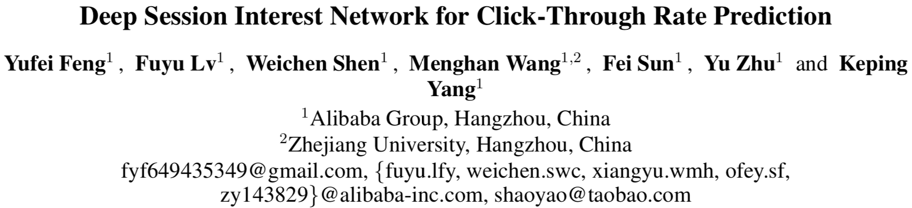

pdf：[*Deep Session Interest Network for Click-Through Rate Prediction*](https://arxiv.org/pdf/1905.06482.pdf)

代码：[shenweichen/**DSIN**](https://github.com/shenweichen/DSIN)


# 问题背景

从用户行为中，我们发现，

* 在每个会话中的行为是相近的，
* 而在不同会话之间差别是很大的。

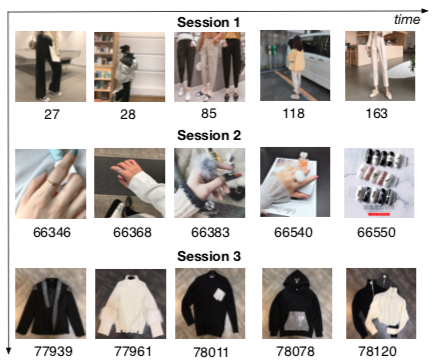

# 模型结构

## 基本架构

Base Model就是一个全连接神经网络，其输入的特征的主要分为三部分，

* 用户特征$X^U$
* 待推荐物品特征$X^I$
* 用户历史行为序列特征$S$

损失函数：

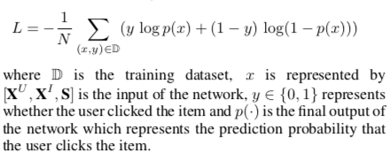


## DSIN模型

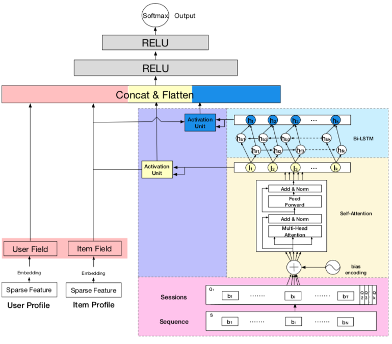

其中，激活单元具体结构和右下角方框中的各层的名称为

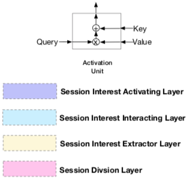

## Session Division Layer

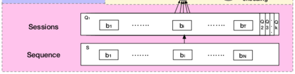

这一层将用户的行文进行切分，首先将用户的点击行为按照时间排序，判断每两个行为之间的时间间隔，前后的时间间隔大于30min，就进行切分。

切分后，我们可以将用户的行为序列S转换成会话序列Q。第k个会话$Q_k=[b_1;b_2;...;b_i;...;b_T]$,其中，T是会话的长度，$b_i$是会话中第i个行为，是一个d维的embedding向量。所以$Q_k$是$T*d$的，而Q，则是$K*T*d$的。

## Session Interest Extractor Layer

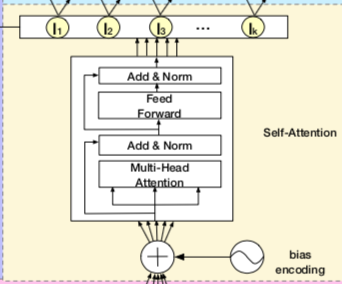

这里对每个session，使用transformer对每个会话的行为进行处理。

这里使用Bias Encoding而非transformer的Positional Encoding：
$$
BE_{(k,t,c)}=w^K_k+w^T_t+w^C_c
$$
加入偏置项后，Q变为：
$$
Q=Q+BE
$$
随后，是对每个会话中的序列通过Transformer进行处理：

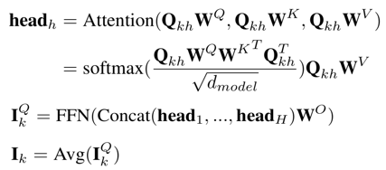

注意，这里的Bias Encoding可能不太好理解，但具体实现很简单，利用了python/tensorflow的广播机制，python代码如下

```python
import numpy as np
# K = 2 两个session
sess = np.random.randn(2, 1, 1)
# T = 3 每个session有三个item
seq = np.random.randn(1, 3, 1)
# C = 5 每个item是5维embedding
embed = np.random.randn(1, 1, 5)
# BE = WK + WT + WC
bias_embedding = sess + seq + embed

print("sess = ")
print(sess)
print("seq = ")
print(seq)
print("embed = ")
print(embed)
print("bias_embedding = sess + seq + embed = ")
print(bias_embedding)
```

## Session Interest Interacting Layer

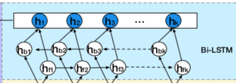

用户的会话兴趣，是有序列关系在里面的，这种关系，我们通过一个双向LSTM(bi-LSTM)来处理：

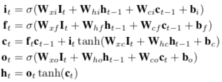

每个时刻的hidden state计算：


## Session Interest Activating Layer
用户的会话兴趣与目标物品越相近，那么应该赋予更大的权重，这里使用注意力机制来刻画这种相关性：
$$
\begin{aligned}
&\alpha^I_k=\frac{\text{exp}(I_kW^IX^I)}{\sum_k^K\text{exp}(I_kW^IX^I)}\\
&U^I=\sum_k^K \alpha_k^II_k
\end{aligned}
$$
同样，混合了上下文信息的会话兴趣，也进行同样的处理：
$$
\begin{aligned}
&\alpha^H_k=\frac{\text{exp}(H_kW^HX^I)}{\sum_k^K\text{exp}(H_kW^HX^I)}\\
&U^H=\sum_k^K \alpha_k^HH_k
\end{aligned}
$$

# 模型试验

模型使用了两个数据集进行了实验，分别是阿里妈妈的广告数据集和阿里巴巴的电商推荐数据集。

对比模型有：YoutubeNet、Wide & Deep、DIN 、DIN-RNN、DIEN。

评价指标是AUC。结果如图：

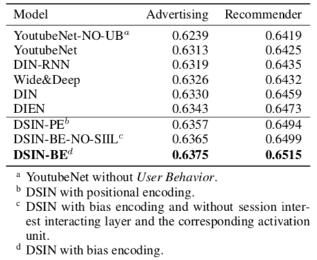

其中，

DIN-RNN(这个和DIN很像，在原始的DIN中，用户的行为序列没有使用RNN进行处理，而DIN-RNN使用bi-LSTM对用户的历史行为序列进行处理)

对于DSIN，这里有分了三种情况，第一个是DSIN，不过将Bias Encoding变为Transformer里面的Positional Encoding，第二个是DSIN，使用bias encoding，但不添加session interest interacting layer and the corresponding activation unit。第三个就是前文介绍的DSIN框架。可以看到，最后一个在两个数据集上的AUC均为最大。

# 进一步讨论

## Effect of Multiple Sessions
从实验结果来看，DIN-RNN的效果差于DIN，而DSIN-BE的效果好于DSIN-BE-No-SIIL。两组的差别均是有没有使用序列建模。文章里提到，对于序列建模来说，如果用户的行为时十分跳跃的，同时是突然结束的，会使得用户的行为看上进去具有很大的噪声。这样就使得DIN-RNN的效果反而不如DIN，

但在DSIN中，我们对用户的行为序列按照会话进行了分组，由于以下两点原因，使得DSIN中使用序列建模效果反而更好：

1、每个session内部，用户的行为是同质的

2、不同的session之间，用户的session兴趣是呈现一种序列性的，适合序列建模

## Effect of Session Interest Interacting Layer
DSIN-BE的效果好于DSIN-BE-No-SIIL，说明通过Effect of Session Interest Interacting Layer得到混合上下文信息的用户兴趣，可以进一步提升模型的效果。

## Effect of Bias Encoding

DSIN-BE的效果好于DSIN-PE，说明对不同的session添加偏置项，效果还是十分不错的。

## Visualization of Self-attention and the Activation Unit

这里论文展示了一下 Self-attention and the Activation Unit的效果，还是开篇的那个例子：

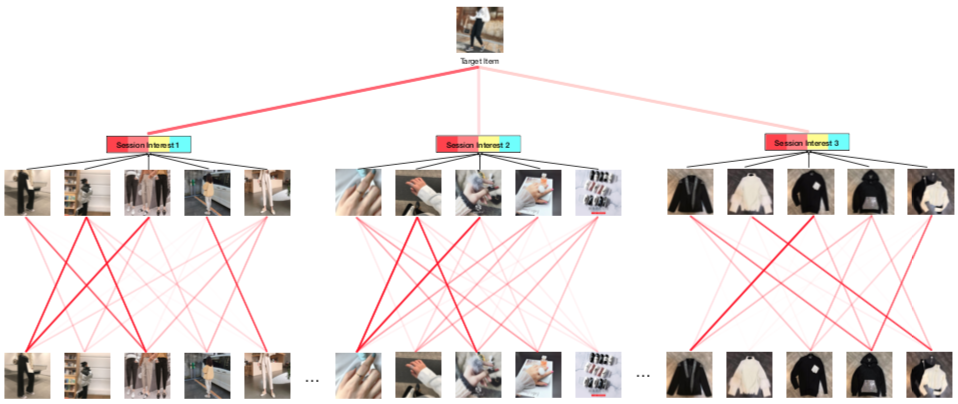

可以看到self-attention和激活函数的权值的关系。

# 总结

* 用户的行为序列包含多个历史session片段，其特点是：

  1、在同一个session中，点击的内容是同质的

  2、在不同片段中，点击的内通是不同的

* 基于这个特点，提出了Deep Session Interest Network (DSIN) ，具体做法是：

  1、使用基于transformer和Bias-Encoding的自注意力机制来提取用户每个片段的兴趣

  2、使用双向LSTM来捕获像下文序列兴趣的序列关系

  3、使用激活单元（其实还是注意力机制），基于要预测的目标item来聚合用户不同session兴趣的表征

* 将来会使用知识图谱作为先验知识来解释用户的历史行为，以便更好的预测CTR

# 参考资料

* [推荐系统遇上深度学习(四十五)-探秘阿里之深度会话兴趣网络DSIN](https://www.jianshu.com/p/82ccb10f9ede)
* [阿里Deep Session Interest Network解读](https://zhuanlan.zhihu.com/p/71695849)

本文参考了这两篇文章。

* [shenweichen/**DSIN**](https://github.com/shenweichen/DSIN/blob/3aed7819e47f0463f12ab78cc2589cacf1081745/code/models/dsin.py#L28)
* [shenweichen/**DSIN**](https://github.com/shenweichen/DeepCTR/blob/ce140ffcc1057e8fb57622ae1732c39df32bc11e/deepctr/layers/sequence.py)
* [numpy和tensorflow中的广播机制](https://www.cnblogs.com/harvey888/p/10211800.html)

Bias Encoding的具体TensorFlow代码实现利用了broadcast机制，如下：

```python
        self.sess_bias_embedding = self.add_weight('sess_bias_embedding', shape=(self.sess_max_count, 1, 1),
                                                   initializer=TruncatedNormal(
                                                       mean=0.0, stddev=0.0001, seed=self.seed))
        self.seq_bias_embedding = self.add_weight('seq_bias_embedding', shape=(1, seq_len_max, 1),
                                                  initializer=TruncatedNormal(
                                                      mean=0.0, stddev=0.0001, seed=self.seed))
        self.item_bias_embedding = self.add_weight('item_bias_embedding', shape=(1, 1, embed_size),
                                                   initializer=TruncatedNormal(
                                  mean=0.0, stddev=0.0001, seed=self.seed))

# ======

    def call(self, inputs, mask=None):
        """
        :param concated_embeds_value: None * field_size * embedding_size
        :return: None*1
        """
        transformer_out = []
        for i in range(self.sess_max_count):
            transformer_out.append(
                inputs[i] + self.item_bias_embedding + self.seq_bias_embedding + self.sess_bias_embedding[i])
        return transformer_out
```


