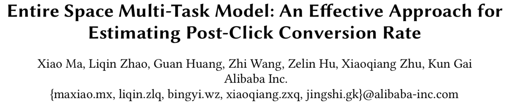
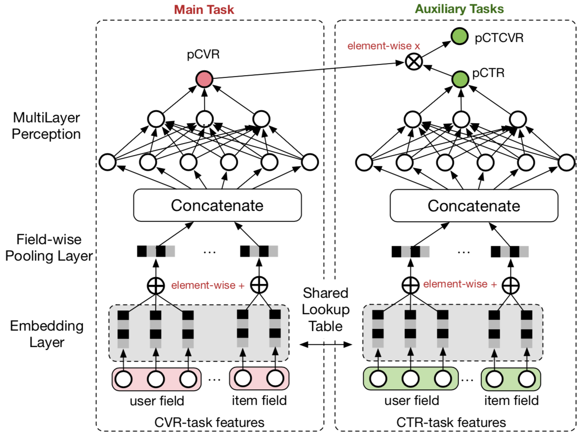
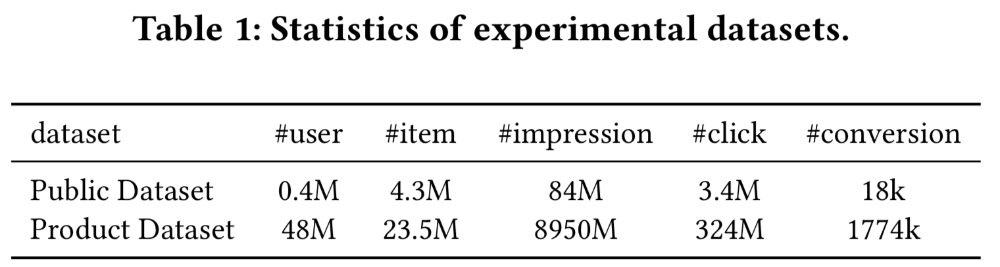
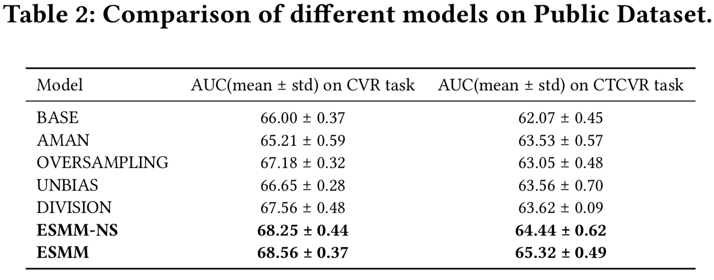
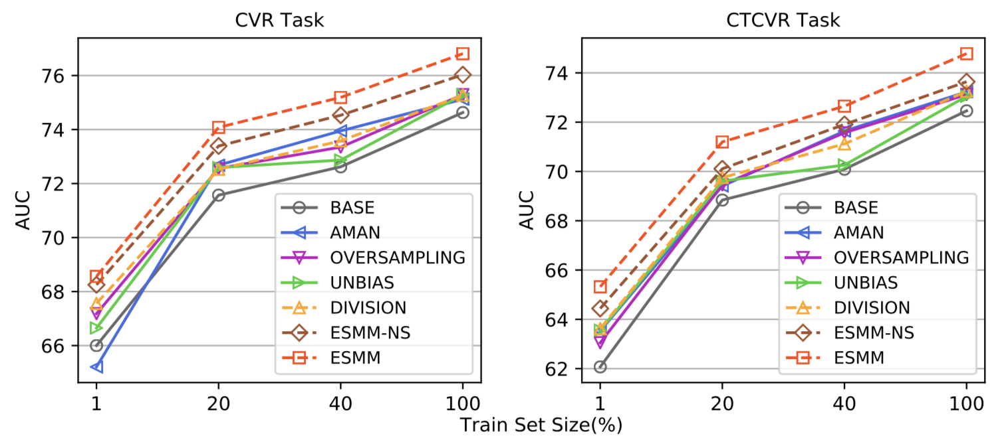

# ESMM完整空间上的多任务模型

* [返回上层目录](../alibaba.md)
* [动机](#动机)
* [模型](#模型)
* [实验](#实验)
* [讨论](#讨论)

pdf:[*Entire Space Multi-Task Model: An Effective Approach for Estimating Post-Click Conversion Rate*](https://arxiv.org/pdf/1804.07931.pdf)

ESMM模型的tensorflow实现:《[构建分布式Tensorflow模型系列:CVR预估之ESMM](https://zhuanlan.zhihu.com/p/42214716)》

本文介绍阿里妈妈团队发表在SIGIR2018的论文。文章基于Multi-Task Learning的思路，提出一种新的CVR预估模型：ESMM，有效解决了真实场景中CVR预估面临的样本选择偏差以及数据稀疏这两个关键问题。 实践出真知，论文一点也不花里胡哨，只有4页，据传被SIGIR2018高分录用。

# 动机

不同于CTR预估问题，CVR预估面临两个关键问题：

1. **Sample Selection Bias (SSB)** 。转化是在点击之后才“有可能”发生的动作，传统CVR模型通常以点击数据为训练集，其中点击未转化为负例，点击并转化为正例。但是训练好的模型实际使用时，则是对整个空间的样本进行预估，而非只对点击样本进行预估。即是说，训练数据与实际要预测的数据来自不同分布，这个偏差对模型的泛化能力构成了很大挑战。
2. **Data Sparsity (DS)** 作为CVR训练数据的点击样本远小于CTR预估训练使用的曝光样本。

一些策略可以缓解这两个问题，例如从曝光集中对unclicked样本抽样做负例缓解SSB，对转化样本过采样缓解DS等。但无论哪种方法，都没有很elegant地从实质上解决上面任一个问题。

可以看到：点击—>转化，本身是两个强相关的连续行为，作者希望在模型结构中显示考虑这种“行为链关系”，从而可以在整个空间上进行训练及预测。这涉及到CTR与CVR两个任务，因此使用多任务学习（MTL）是一个自然的选择，论文的关键亮点正在于“如何搭建”这个MTL。

# 模型

介绍ESMM之前，我们还是先来思考一个问题——“**CVR预估到底要预估什么**”，论文虽未明确提及，但理解这个问题才能真正理解CVR预估困境的本质。想象一个场景，一个item，由于某些原因，例如在feeds中的展示头图很丑，它被某个user点击的概率很低，但这个item内容本身完美符合这个user的偏好，若user点击进去，那么此item被user转化的概率极高。CVR预估模型，预估的正是这个转化概率，**它与CTR没有绝对的关系，很多人有一个先入为主的认知，即若user对某item的点击概率很低，则user对这个item的转化概率也肯定低，这是不成立的。**更准确的说，**CVR预估模型的本质，不是预测“item被点击，然后被转化”的概率**（CTCVR）**，而是“假设item被点击，那么它被转化”的概率**（CVR）。这就是不能直接使用全部样本训练CVR模型的原因，因为咱们压根不知道这个信息：那些unclicked的item，假设他们被user点击了，它们是否会被转化。如果直接使用0作为它们的label，会很大程度上误导CVR模型的学习。

认识到点击（CTR）、转化（CVR）、点击然后转化（CTCVR）是三个不同的任务后，我们再来看三者的关联：
$$
\begin{aligned}
&\underbrace{p(z\&y=1|x)}_{pCTCVR}\\
=&\underbrace{p(z=1|y=1,x)}_{pCVR}\underbrace{p(y=1|x)}_{pCTR}
\end{aligned}
$$
其中z, y分别表示conversion和click。注意到，在全部样本空间中，CTR对应的label为click，而CTCVR对应的label为click & conversion，**这两个任务是可以使用全部样本的**。**那为啥不绕个弯，通过这学习两个任务，再根据上式隐式地学习CVR任务呢？**ESMM正是这么做的，具体结构如下：

整体来看，对于一个给定的展现，ESMM模型能够同时输出预估的pCTR、pCVR 和pCTCVR。它主要由两个子神经网络组成，左边的子网络用来拟合pCVR ，右边的子网络用来拟合pCTR。两个子网络的结构是完全相同的，这里把子网络命名为BASE模型。两个子网络的输出结果相乘之后即得到pCTCVR，并作为整个任务的输出。

需要强调的是，ESMM模型有三个主要的特点，使其区别于传统的CVR预估模型，分别阐述如下。

（1）**在整个样本空间建模**

由下面的等式可以看出，pCVR 可以在先估计出pCTR 和pCTCVR之后推导出来。从原理上来说，相当于分别单独训练两个模型拟合出pCTR 和pCTCVR，再通过pCTCVR 除以pCTR 得到最终的拟合目标pCVR 。
$$
p(z=1|y=1,x)=\frac{p(y=1,z=1|x)}{p(y=1|x)}
$$
但是，由于pCTR 通常很小，除以一个很小的浮点数容易引起数组不稳定问题（计算内存溢出）。所以ESMM模型采用了乘法的形式，而没有采用除法形式。

pCTR和pCTCVR是ESMM模型需要估计的两个主要因子，而且是在整个样本空间上建模得到的，pCVR只是一个中间变量。由此可见，ESMM模型是在整个样本空间建模，而不像传统CVR预估模型那样只在点击样本空间建模。

（2）**共享特征表示**

ESMM模型借鉴**迁移学习**的思路，在两个子网络的embedding层共享embedding向量（特征表示）词典，即两者从Concatenate之后才学习各自部分独享的参数。网络的embedding层把大规模稀疏的输入数据映射到低维的表示向量，该层的参数占了整个网络参数的绝大部分，需要大量的训练样本才能充分学习得到。由于CTR任务的训练样本量要大大超过CVR任务的训练样本量，ESMM模型中特征表示共享的机制能够使得**CVR子任务也能够从只有展现没有点击的样本中学习**，从而能够极大地有利于**缓解训练数据稀疏性**问题。

（3）**隐式学习pCVR**

pCVR（粉色节点）仅是网络中的一个**中间变量，没有显式的监督信号。**

具体地，反映在损失函数中：
$$
\begin{aligned}
&L(\theta_{cvr},\theta{ctr})\\
=&\sum^N_{i=1}l(y_i,f(x_i;\theta_{ctr}))\\
+&\sum^N_{i=1}l(y_i\&z_i,f(x_i;\theta_{ctr})\times f(x_i;\theta_{cvr}))
\end{aligned}
$$
即**利用CTCVR和CTR的监督信息来训练网络，隐式地学习CVR，这正是ESMM的精华所在**，至于这么做的必要性以及合理性，本节开头已经充分论述了。

再思考下，ESMM的结构是基于“乘”的关系设计——pCTCVR=pCVR*pCTR，是不是也可以通过“除”的关系得到pCVR，即 pCVR = pCTCVR / pCTR ？例如分别训练一个CTCVR和CTR模型，然后相除得到pCVR，其实也是可以的，但这有个明显的缺点：真实场景预测出来的pCTR、pCTCVR值都比较小，“除”的方式容易造成数值上的不稳定。作者在实验中对比了这种方法。

**注意啦：**

这里你可能会有疑惑，为什么上图模型中左边的model明明预估的就是pCTCVR呀，为什么文中声称预估的是pCVR呢？其实，model只是个函数拟合器，你让它拟合什么，完全靠你自己定义，那自己怎么定义呢？靠损失函数呀，损失函数已经给它分配的角色就是拟合pCVR。

即，模型中左侧的model预估的，不是
$$
\underbrace{p(z\&y=1|x)}_{pCTCVR}
$$
而是
$$
\underbrace{p(z=1|y=1,x)}_{pCVR}
$$
你指定它拟合什么函数，它就拟合什么函数，并不是只能拟合固定的一种。一定要认识到，model只是个函数拟合器，可以拟合你任意指定的函数，指定是通过损失函数来指定。

# 实验

**数据集**

目前还没用同时包含点击、转化信息的公开数据集，作者从淘宝日志中抽取整理了一个数据集Product，并开源了从Product中随机抽样1%构造的数据集[Public](https://tianchi.aliyun.com/dataset/dataDetail?dataId=408&userId=1)（约38G）。

**实验设置**

1. 对比方法：

   BASE——图1左部所示的CVR结构，训练集为点击集；

   AMAN——从unclicked样本中随机抽样作为负例加入点击集合；

   OVERSAMPLING——对点击集中的正例（转化样本）过采样；

   UNBIAS——使用rejection sampling；

   DIVISION——分别训练CTR和CVCTR，相除得到pCVR；

   ESMM-NS——ESMM结构中CVR与CTR部分不share embedding。

2. 上述方法/策略都使用NN结构，relu激活函数，嵌入维度为18，MLP结构为360*200*80\*2，adam优化器参数$\beta_1=0.9$，$\beta_2=0.999$，$\epsilon=10^{-8}$。

3. 按时间分割，1/2数据训练，其余测试

**衡量指标**

在点击样本上，计算CVR任务的AUC；同时，单独训练一个和BASE一样结构的CTR模型，除了ESMM类模型，其他对比方法均以pCTR*pCVR计算pCTCVR，在全部样本上计算CTCVR任务的AUC。

**实验结果**

如下表所示，ESMM显示了最优的效果。这里有趣的一点可以提下，ESMM是使用全部样本训练的，而CVR任务只在点击样本上测试性能，因此这个指标对ESMM来说是在biased samples上计算的，但ESMM性能还是很牛啊，说明其有很好的泛化能力。

其中，AUC以%为单位。

在Product数据集上，各模型在不同抽样率上的AUC曲线如下图所示，ESMM显示的稳定的优越性，曲线走势也说明了Data Sparsity的影响还是挺大的。

# 讨论

1. ESMM 根据用户行为序列，显示引入CTR和CTCVR作为辅助任务，“迂回” 学习CVR，从而在完整样本空间下进行模型的训练和预测，解决了CVR预估中的2个难题。

2. 可以把 ESMM 看成一个**新颖的 MTL 框架**，其中子任务的网络结构是可替换的，当中有很大的想象空间。至于这个框架的意义，这里引用论文作者之一[@朱小强的描述](https://zhuanlan.zhihu.com/p/54822778)：

> 据我所知这个工作在这个领域是最早的一批，但不唯一。今天很多团队都吸收了MTL的思路来进行建模优化，不过大部分都集中在传统的MTL体系，如研究怎么对参数进行共享、多个Loss之间怎么加权或者自动学习、哪些Task可以用来联合学习等等。ESMM模型的特别之处在于我们额外**关注了任务的Label域信息，**通过展现>点击>购买所构成的行为链，巧妙地构建了multi-target概率连乘通路**。**传统MTL中多个task大都是隐式地共享信息、任务本身独立建模，ESMM细腻地捕捉了契合领域问题的任务间显式关系，**从feature到label全面利用起来**。这个角度对互联网行为建模是一个较有效的模式，后续我们还会有进一步工作。

# 参考资料

* [阿里CVR预估模型之ESMM](https://zhuanlan.zhihu.com/p/57481330)
* [CVR预估的新思路：完整空间多任务模型](https://zhuanlan.zhihu.com/p/37562283)
* [镶嵌在互联网技术上的明珠：漫谈深度学习时代点击率预估技术进展](https://zhuanlan.zhihu.com/p/54822778)

本文复制并组合了上述几篇文章中的内容。

