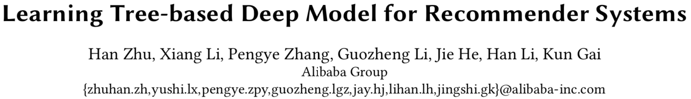
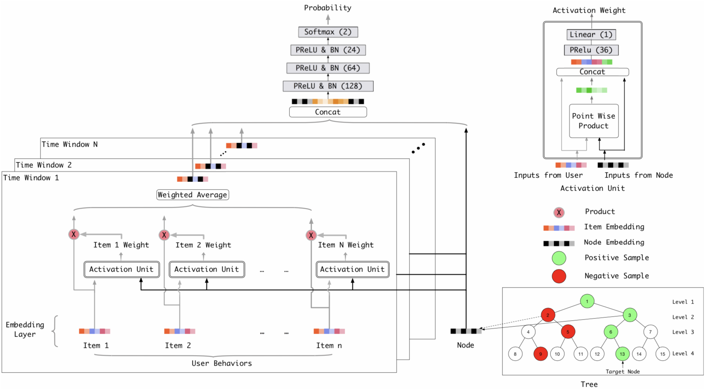
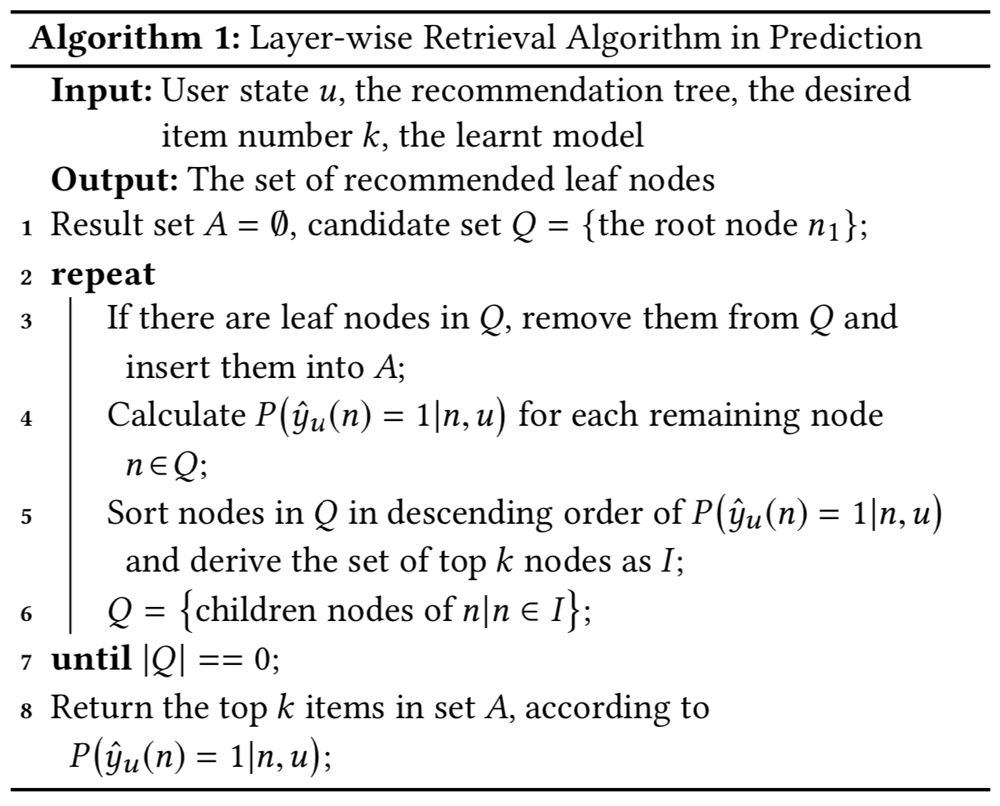
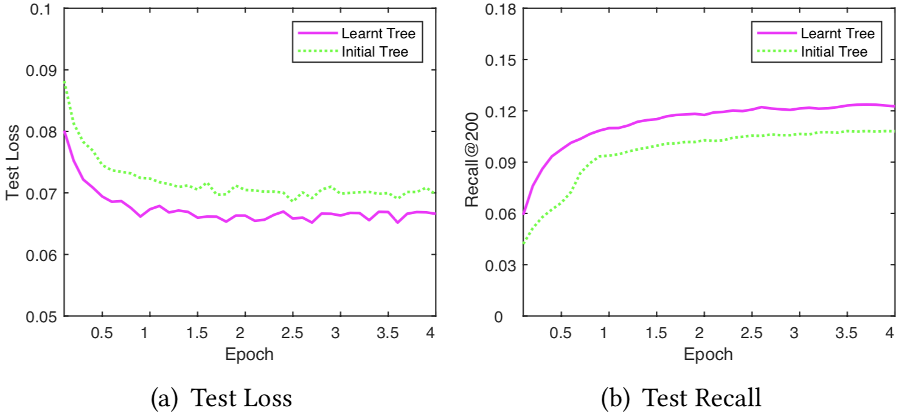
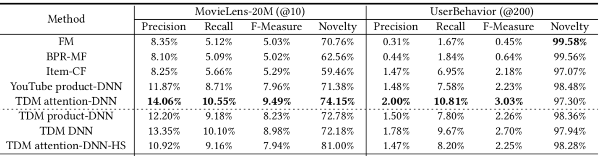
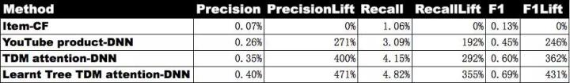
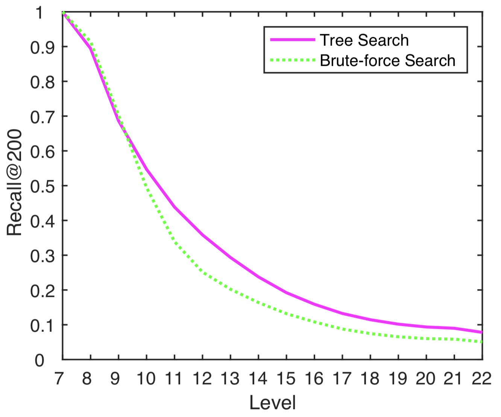

# TDM:Learning Tree-based Deep Model for Recommender Systems

* [返回上层目录](../alibaba.md)
* [背景](#背景)
* [相关技术](#相关技术)
  * [第一代：基于统计的启发式规则方法](#第一代：基于统计的启发式规则方法)
  * [第二代：基于内积模型的向量检索方法](#第二代：基于内积模型的向量检索方法)
  * [下一代匹配和推荐技术](#下一代匹配和推荐技术)
* [技术方案](#技术方案)
  * [概率连乘树并不适用匹配问题](#概率连乘树并不适用匹配问题)
  * [最大堆树的提出和构建](#最大堆树的提出和构建)
  * [全局分类器的设计理念](#全局分类器的设计理念)
  * [最大堆树背后的方法论](#最大堆树背后的方法论)
* [方案细节](#方案细节)
  * [模型训练](#模型训练)
  * [结果预测](#结果预测)
  * [树联合训练](#树联合训练)
* [实验效果](#实验效果)
  * [召回率评估](#召回率评估)
  * [新颖性评估](#新颖性评估)
  * [树结构对效果的促进](#树结构对效果的促进)
* [总结与展望](#总结与展望)
  * [总结](#总结)
  * [展望](#展望)

pdf: [*Learning Tree-based Deep Model for Recommender Systems*](https://arxiv.org/pdf/1801.02294.pdf)

github:[离线训练: 深度树匹配模型(TDM)](https://github.com/alibaba/x-deeplearning/wiki/%E6%B7%B1%E5%BA%A6%E6%A0%91%E5%8C%B9%E9%85%8D%E6%A8%A1%E5%9E%8B(TDM))

github:[在线Serving](https://github.com/alibaba/x-deeplearning/wiki/TDMServing)

这是阿里自主创新的下一代匹配&推荐技术：任意深度学习+树状全库检索

>电商时代，消费者对推荐系统已经不再陌生。蓦然回首，你会发现喜欢的商品就在显眼处。如何设计推荐系统，让消费者更方便地从海量商品中找到自己的最爱，阿里工程师一直在不断探索更优的算法和技术。
>阿里妈妈精准定向技术团队，针对大规模候选集上的匹配推荐问题，自主创新提出了一套崭新的、完整的基于树结构的匹配和推荐算法框架，希望借此赋能任意深度学习模型在推荐匹配中的使用，实现面向全量大规模候选集的精准匹配和推荐。下面让我们一起来深入了解、探讨。

# 背景

推荐、搜索、广告投放是互联网内容提供商进行流量分配的核心业务，也是大数据和机器学习技术的典型应用场景。无论是推荐，搜索，还是广告投放问题，都可以描述为从大规模候选中给用户提供有限的展现结果以获取用户的正向反馈（广告投放还需额外考虑广告主意愿和体验）。

在具体实现中，由于在线业务对性能尤其是响应时间的严格要求，我们往往会把上述过程拆分为两个阶段——匹配（Match）+排序（Rank）。以淘宝推荐系统为例，匹配阶段的核心在于如何从全量商品（Item）中根据用户（User）信息召回合适的TopK候选集合，排序阶段则是对TopK候选集合进行精细化打分并排序输出最终展现的结果。排序阶段因为候选集小，可以引入诸如深度学习等非常复杂的模型来优化目标，达到最终效果（相关性、广告收益等）的提升，业界对此阶段的研究比较集中和深入，比如阿里妈妈精准定向广告业务团队在排序阶段的CTR（Click-through Rate）预估上引入了基于Attention结构的深度兴趣模型（DIN，[https://arxiv.org/abs/1706.06978](https://link.zhihu.com/?target=https%3A//arxiv.org/abs/1706.06978)），取得了非常好的业务效果。

而匹配阶段由于问题规模大，复杂模型在此阶段的应用存在一定的局限性，所以业界对这方面的研究尤其是深度学习在此阶段的应用仍处在发展阶段。回到上述关于两阶段的描述，可以看出匹配阶段产生的候选集的质量会成为最终效果的天花板，因此如何创新和发展匹配技术是对业务有着重大意义的问题，也一直是业界和学术界关注的重点问题。

以推荐为例，在工业级的推荐系统中，匹配阶段往往面临很多技术挑战。例如当候选集非常大的时候，要从全量候选集中挑选TopK集合，我们无法接受随着全量候选集大小而线性增长的时间复杂度，这使得一些学术界研究的需要计算全量 {User，Item} 兴趣度的方法并不能真正应用于实际推荐系统中的匹配阶段。在有限的计算资源下，如何根据用户信息从全量候选集中快速得到高质量的TopK候选集，需要在计算效率和计算准确性上做精巧的平衡。作为真实应用的推荐系统，其匹配阶段的计算时间需要被限制，简单用以下公式表示：
$$
T\times N\leqslant\text{Bound}\quad\quad(1)
$$
其中T表示单次计算的时间消耗，N可以认为是为单个用户召回TopK需要的总体计算次数。在上述公式的约束下，围绕如何提升匹配效果，工业界的技术发展也经历了几代的演进，从最初的基于统计的启发式规则方法，逐渐过渡到基于内积模型的向量检索方法。然而这些方法在技术选型上都在上述计算效率约束下对匹配效果进行了很大的牺牲。如何在匹配阶段的计算效率约束下引入更先进的复杂深度学习模型成为了下一代匹配技术发展的重要方向。

# 相关技术

如上文所述，结合工业级推荐系统的约束，匹配技术经历了从基于统计的启发式规则方法到基于内积模型的向量检索方法的转变，具体描述如下：

## 第一代：基于统计的启发式规则方法

这一类方法的经典代表就是Item-based Collaborative Filtering（以下简称Item-CF），也是业界应用最广的推荐算法之一。Item-CF的算法原理是：首先通过统计计算得到Item to Item（I2I）的相似关系，其次启发式地获取用户近期行为作为Trigger Item集合，用它们进行I2I扩展，最后以某种打分规则对扩展后的Item集合进行排序，截断得到TopK作为候选集进行后续排序流程。结合公式（1），我们可以知道这种方法有效的控制了总体计算次数N，因为用户的Trigger Item集合是有限的，相似关系圈定的候选集合也是有限的，从而避免了对全量候选集的计算，同时简单的打分规则可以有效地控制单次计算时间T，两者使得最终整体方法的计算量较少，满足了在线应用的要求。

这类方法简单有效，应用也比较广泛，但从算法原理不难看出，这种方法天然存在一大弊端：它限制了尝试推荐给用户未曾行为过但可能感兴趣的Item的可能性。这种将候选限定在历史兴趣相似范畴内的启发式规则对推荐效果的提升有限，它降低了用户体验（尤其是推荐结果的惊喜度），也制约了系统整体的可持续发展能力。尽管后续的排序环节可以引入复杂的机器学习方法，例如MLR（混合逻辑回归，[https://arxiv.org/abs/1704.05194](https://link.zhihu.com/?target=https%3A//arxiv.org/abs/1704.05194)），FM（因子分解）或者深度学习，但它们都依赖于匹配给出的候选结果，所以无论如何复杂的模型都突破不了匹配给定的上限。

## 第二代：基于内积模型的向量检索方法

引入机器学习方法来提升匹配能力是业界共识和趋势。机器学习本质上是一个衡量模型，可以衡量用户对商品的兴趣度。这种基于模型的匹配方法理论上要衡量一个用户对所有商品的兴趣度，从而挑选出最优的推荐结果。这就带来了问题：对于大规模商品候选集的场景是计算不可行的。

如何化解计算不可行的问题？研究人员提出了以向量距离的方式衡量用户和商品兴趣度的方法，用户和商品被表示成向量形式，并以此为基础建立基于向量聚类的索引结构进一步加速衡量效率，于是这个计算问题变成了在有限时间内是可解的（近似求解），具体实现也落到了向量引擎的范畴。结合公式（1），T代表简单的向量内积计算时间，而N则通过建立向量索引结构从而控制在O(桶候选集规模)的较小范围内。

所以内积式模型和向量引擎成为了最近几年匹配领域技术革新的最重要技术（图像检索问题最早就是采用的这种方法）。尤其是去年Facebook的Faiss框架开源，极大降低了业界尝试向量引擎的难度，对行业发展起到了极大的促进作用。至此，基于内积模型的向量检索方法引领了第二代匹配和推荐技术的潮流，在各类学术会议和工业实践中大放异彩。

然而问题是，这类方法并未实现充分利用机器学习解决匹配问题的初衷，对机器学习模型的限制太大。高阶深度学习大部分都不可划成内积形式，比如CTR预估里用户和商品特征交叉非常有用，大部分不可用内积表示。而**在现有深度学习中内积模型的表达能力被证明是有限的，比如将内积模型中最后的内积运算直接换成多层感知机能大幅提升模型能力**，而多层PNN内外积神经网络 ，DIN等对用户兴趣更有洞察力的复杂模型效果被证明能极大的超越内积模型。

与此同时，我们也发现在具体实践中，向量检索算法要求User和Item能够映射到统一的向量空间。User输入信息和Item输入信息一般并不同质，如何保证映射到统一目标向量空间下的检索精度对映射算法提出了严格的要求，换言之，统一的向量空间映射对运用向量检索来解决推荐问题带来了精度损失的风险。

## 下一代匹配和推荐技术

结合上文的描述，匹配技术发展的核心点在于系统性能限制下尽可能提升兴趣的衡量精度（从规则算法到引入先进模型）和覆盖范围（从限定候选集到全量候选集）。为此我们尝试对下一代匹配和推荐技术进行研究，自主提出了一种更通用的匹配和推荐算法框架，它允许容纳任意先进模型而非限定内积形式，并且能够对全量候选集进行更好的匹配。无论在公开数据集还是在阿里数据集上，新方法的召回率和新颖性对比前两代技术都有飞跃性的提高。我们的方法以推荐问题为例进行展开，实验也是在推荐应用的场景下进行的。值得指出的是，匹配问题本身作为推荐、搜索、广告投放业务中的核心模块，使得我们的方法具有很强的普适性。

# 技术方案

承上所述，第二代基于内积模型向量检索的方案，限定模型结构以实现检索效率的提升，因此要想进一步释放模型能力就必须**使得整体检索结构的设计与模型结构的设计解耦（向量内积检索与内积模型即是一种强耦合关联）**。面对一个复杂问题，人脑常有的一个思考方式是先从大的层面入手，确定大方向后具体细化。我们也从这个角度入手，思考是否可以有一种从粗到细的检索方式，逐步判断并细化，最后给出最优推荐。基于这个思考，我们把探索方向定位在了使用层次化树结构增加检索效率上。

然而，模糊的上层概念想起来容易，概念上万物皆通，真正难的是否能在数学和技术上构建出一条真正可行的路径。就匹配问题而言，树检索结构的引入伴随着一系列的问题要解决：

1、树结构是如何构建的；

2，如何基于树进行匹配建模；

3、如何围绕树结构实现高效的兴趣计算和检索。

## 概率连乘树并不适用匹配问题

在有了使用层次化树结构来增加检索效率的思路后，我们首先尝试了概率连乘树的形式。这个形式在Natural Language Processing（自然语言处理）中已经有了一些工作和探讨（例如Hierarchical Softmax，Word2Vec等）。虽然最后不幸的发现，这个优美的概率形式并不能对匹配问题带来实质的帮助，但它对真正理清匹配问题的要点和难点从而提出真正可用的方法是很有帮助的。

以Hierarchical Softmax（以下简称HS）为例，每一个叶子节点（词）都有到根节点编码唯一的一条路径，而给定前置上文，下一个词出现的概率被建模为编码路径上分类概率的连乘。传统的多分类Softmax里归一化项依赖所有类别项的计算，所以即使计算一个类别的概率的计算量也很大，而通过概率连乘树的方式，HS有效避免了在传统Softmax建模中需要遍历所有叶子节点计算分母归一化项的过程。

假设我们通过类似HS的方式建立了叶子节点为商品的树，把上下文认为是用户输入，把输出的叶子节点概率认为是用户对商品的兴趣度，看上去HS可以解决我们的匹配问题。但经过我们的分析和实践，事实并非如此。

1）HS方法解决了给定上文进行节点概率快速计算的问题，即通过引入Hierarchical Structure避免了对全量候选集的逐一计算和归一化，直接计算得到节点概率。但对于匹配和推荐TopK这类全局寻优问题HS并不适用，因为当给定用户输入时，寻找最优的TopK候选我们仍然需要遍历所有的叶子节点，计算各个叶子的连乘概率，对概率排序得到最优的K个。而任何贪心的检索方法如BeamSearch，都无法保证检索得到的TopK是全局最优的，即HS建模方式下每一层的最优连乘并不保证全局最优。所以需要遍历全部叶子计算的HS方法并不适合大规模候选集的匹配和推荐问题。

2）与此同时，HS方法在建树时往往会考虑将某种具有相似关系（语义、词频等）的节点靠近组成兄弟。而HS方法在计算路径概率时把每一个节点的概率计算看作是二分类问题，用于判断接下来选择哪个孩子节点继续走下去。这种判断优与次优的分类方法对于HS是适用和有效的，但对于匹配和推荐问题却是无法成立的，因为当两个孩子具有某种相似关系时，用户往往是同时喜欢或者同时不喜欢。也就说在**单层节点上，匹配和推荐要求的是该层上的全局序判别问题，而HS方法解决的是同一父亲下两个孩子节点谁更优的问题**。

在采用HS方法进行匹配和推荐的实践中，包括YouTube团队在他们的内积模式向量检索做匹配的文章中提到了他们采用HS方法学习用户和候选Video的偏好关系，但是效果并不理想。而我们最先也在阿里妈妈广告测试集上进行了HS方法的尝试，效果也不如预期。

## 最大堆树的提出和构建

推翻概率连乘树方法的思路，我们需要构建一套全新的方法体系来实现树结构的构建、基于树的训练采样和TopK检索、以及节点兴趣度计算的统一。回到匹配问题本身，假定全量候选集中的每一个商品都是一个叶子节点，当前用户对所有叶子节点背后都存在一个真实的兴趣度，用
$$
P_i(u)
$$
表示。我们并不知道其具体值，只有根据概率采样出来的样本（用户真实反馈）。对于一般的模型，我们可以对叶子节点的概率建模，但是要找TopK需要遍历所有节点，计算量太大。因此我们创新性的提出了**兴趣最大堆树（Max-heap like Tree）**的概念，其定义树上节点的概率如下：
$$
p^{(j)}(n|u)=\frac{\mathop{max}\limits_{n_c\in\{\text{n's children nodes in level j+1}\}}p^{(j+1)}(n_c|u)}{\alpha^{(j)}}\quad\quad(2)
$$
即用户对第j层父亲节点兴趣的偏好概率正比于用户对第j+1层孩子节点兴趣的偏好概率最大值，其中
$$
\alpha^{(j)}
$$
是第j层节点兴趣概率的归一化因子。根据最大堆树的定义，如果已知这棵树上的每层节点概率之间的序（同层内），我们可以快速找到全局TopK，即从根节点出发找当前层的TopK，然后在上层TopK节点对应的下层孩子节点集合中继续找TopK，递归向下直至叶子。

然而问题是这棵树上的节点概率我们现在并不知道，但是我们可以想办法得到符合树节点概率的序的样本，然后用深度学习在这个样本上进行拟合也即得到了节点概率之间的序。具体地，**对于任意一个用户有行为的叶子节点采样i，隐含了叶子层的序**：
$$
P_i>P_j\ \text{for all }i \neq j
$$
**。根据我们的树节点概率定义（最大堆性质），可以向上递归推出每层节点概率的序。根据这个序我们进行负样本采样，用深度学习模型基于这个采样去学习，以逼近最大堆树上每层的序**。

## 全局分类器的设计理念

承上文所述，**我们构建每一层的兴趣节点模型要严格满足最大堆概率公式是很困难，但是可以得到符合树节点概率的序的样本**。而且在检索过程中，我们只需要每一层的节点概率序确定TopK即可，这里面需要特别说明的是虽然**每一层的TopK候选集由上层父亲决定，但该层TopK的排序选取本身并不受父辈的影响，也即每一层的TopK排序都是独立的，父辈的排序分数不参与子辈的排序计算**，这一点也是我们的方案区别与概率连乘树在计算形式上的不同。

于是我们可以将每层节点的兴趣判别单独建模，构建针对单层节点的全局分类器来保证在单层上的精确分类能力。从叶子结点层建模出发确定采样方式，同时结合最大堆的概率定义，确定每一层的采样方式和建模方式。如果用户对叶子结点ni感兴趣，那么对于其他不感兴趣的叶子结点nj，有
$$
P(n_i|u)>P(n_j|u)
$$
，根据公式（2），对于叶子结点ni的父节点$n_i^p$和nj的父节点$n_j^p$，有
$$
P(n^p_i|u)>P(n_j^p|u)
$$
这种设计使得训练得到的模型在单层分类上有更好的判别能力，**即使在上层分类发生偏差的情况下，在当前层的分类也具备“去伪存真”的能力**。当然，分层全局分类能力的设计对样本采样提出了新的要求，后续模型训练章节详细阐述了具体采样方式。

重复三遍：

以上的综合设计使得**对全库TopK检索的计算次数限制在log(候选集规模)量级，有效控制了N的大小，而且单次计算并不要求限定于内积等简单形式，从而允许其容纳更先进的模型**。

以上的综合设计使得**对全库TopK检索的计算次数限制在log(候选集规模)量级，有效控制了N的大小，而且单次计算并不要求限定于内积等简单形式，从而允许其容纳更先进的模型**。

以上的综合设计使得**对全库TopK检索的计算次数限制在log(候选集规模)量级，有效控制了N的大小，而且单次计算并不要求限定于内积等简单形式，从而允许其容纳更先进的模型**。

## 最大堆树背后的方法论

最大堆树结构定义背后描述的直观意义是**用户兴趣的层次结构**，如果用户对具体的商品感兴趣，例如iPhone，那么用户对更高层的节点，例如iPhone所在的类别--手机，也是感兴趣的。用户的兴趣结构具有天然的层次性，**最大堆树结构定义了用户从细粒度兴趣到粗粒度兴趣的传递过程，也在刻画用户的这种兴趣的层次结构**。当然描绘用户的兴趣层次结构不限于最大堆树结构，但是我们提出的最大堆树结构在方法上具有独到之处，其**从方法论层面统一了树结构的构建过程，树节点的兴趣建模和采样方式，兴趣树背后的TopK检索流程**。

综上所述，从最大堆树结构定义出发，我们提出了Tree-based Deep Match（以下简称TDM）算法框架（图1）。TDM以淘宝商品体系为初始化依托，自顶向下构造从粗到细的兴趣层次树（Tree），并在此基础上应用深度学习网络进行用户兴趣的推荐建模，赋能单点计算上的复杂模型，运用层次检索方法实现全量候选上的用户TopK商品兴趣推荐。

*图1 Tree-basedDeep Match算法框架*

基于如上的设计和实现，TDM的贡献包含以下几点：

- 创新的最大堆树检索结构使得使用任意高级深度学习模型变得可能，带来推荐效果的极大提升

  TDM采用树来组织用户兴趣层次，并将之做为兴趣推荐的层次检索结构载体，良好的亚线性O(log(候选集规模))时间复杂度使得TDM的检索过程非常高效，这种高效为TDM引入先进复杂模型提升检索精度提供了强大支持。在单独计算每个兴趣节点的偏好时，TDM不局限于特定的模型结构（如内积等），可以引入更加切合数据特性的复杂模型结构来优化预测结果，例如基于用户历史行为的Attention结构，树节点Embedding下沉到输入层，用户和树节点的历史交叉信息引入等等。无论上述哪种复杂计算的引入，在TDM的对比实验中都取得了更优的推荐效果。

- 全库检索能力可以有效提升召回准确度和新颖性

  TDM实现了面向全量候选集的检索能力，通过对用户兴趣进行层次切分和逐层圈选，TDM避免了直接在全量候选集上的超大计算，它采用将大问题切割成多个小问题递归求解的方式实现全库检索。受益于全库检索的实现，TDM可以提升结果的新颖比例并保持了召回效果，而借助于先进模型计算能力的引入TDM可以达到新颖性指标提升的同时进一步优化召回的准确度。

- 再创新的树-模型联合训练实现树结构和模型能力的双优化，进一步大幅提升效果

  在基础TDM算法框架之上，我们继续创新性地建立了树-模型联合训练框架，通过初始树-模型训练-树重建-模型再训练的循环迭代，树的结构随着模型的演进不断得到优化，使得树更契合用户的兴趣组成和分布，而模型训练也受益于优化后的树结构，进一步降低Loss提升测试效果。联合训练为TDM带来了10%以上的测试效果提升，具体对比可参见后文实验效果部分。

下述章节将详细阐述TDM在模型训练、结果预测（TopK检索）和树联合训练方面的设计和实现。

# 方案细节

## 模型训练

如上述章节所陈，我们将大规模候选集上的TopK匹配和推荐问题转换成一系列前后相依的全局分类问题，也即我们需要在树的每一层建立一个全局分类器，计算该层节点概率的序，得到最优TopK个候选。我们选择负样本采样（Negative Sampling）的方式进行样本生成，以最大似然估计的方式对这些分类器进行训练。

具体地，设n为树中的某个节点，我们有用户u对节点n的偏好预测概率为：
$$
P(\hat{y}_u(n)=1|n,u)
$$
根据公式（2），用户u对ni感兴趣，隐含了u对ni的父亲$n_i^p$也感兴趣，所以假设ni为某叶子结点，那么我们就有了一条唯一的路径：
$$
\{l_j(n_i),j=1,2,...m\}
$$
,lj表示ni在第j层的祖先，m为树的高度。当用户u对ni产生了行为时，我们认为ni是用户的一个兴趣，由上我们认为用户u也对路径
$$
\{l_j(n_i),j=1,2,...m\}
$$
中各个祖先节点也产生了兴趣，于是我们选择这些节点作为训练的正样本，而根据全局分类器的设计要求，我们对这些证样本节点所在层进行随机采样构成负样本。

具体地，记对于用户u，$y_u^+$为正样本集合，$y_u^-$为负样本集合，我们有如下的似然公式：
$$
\mathop{\Pi}_u\left(\mathop{\Pi}_{n\in y_u^+}P\left(\hat{y}_u(n)=1|n,u\right)\right)\mathop{\Pi}_{n\in y_u^-}P\left(\hat{y}_u(n)=0|n,u\right)
$$
相对应的，我们有损失函数为：
$$
-\sum_u\sum_{n\in y_u^+\cup y_u^-}y_u(n)\text{log}P\left(\hat{y}_u(n)=1|n,u\right)+\left(1-y_u(n)\right)\text{log}P\left(\hat{y}_u(n)=0|n,u\right)
$$
其中，yu(n)代表用户u对节点n偏好的真实Label（0或1）。

图(1)形象的描述了TDM（带Attention版本）训练时的模型结构，其中树是一棵完全二叉树（但TDM框架本身并不要求树必须是二叉结构）。

在实际的样本构建中，我们采用了用户当天的行为叶子节点及其上溯路径上的祖先节点为正样本，而随机采样各个正样本节点的同层兄弟为负样本。在特征上我们使用了(0, 8*24)小时的行为特征作为用户特征输入。

## 结果预测

遵循TDM层次检索的原理，我们只需要从根节点出发，自顶向下依次逐层选取该层候选孩子中最优的K个节点即可。也即我们有层次检索算法：对于最终要求K个叶子目标推荐的情况下，选择当前层概率最高的K个节点，然后往下层扩展他们的孩子节点，对下层孩子节点进行概率估计，选取概率最高的K个，递归计算和选取直至所有路径都到达叶子层，最后从候选叶子集合（可能大于2K个）中取概率最高的K个返回即可。具体的检索逻辑可参考图2的伪代码描述。在TDM的实验中，层次TopK的检索被实验证明是有效的，甚至是优于平层暴力（Brute-force）检索的，这一点也侧面验证了兴趣树的层次结构可以有效促进检索的精度提升，具体的提升效果可参见后文实验效果部分。

## 树联合训练

TDM中的树是支撑高效检索效率的兴趣层次组织的载体，同时树的结构直接决定了层次检索的候选集组成以及模型训练的样本组成，所以树结构的优化与否对TDM模型的性能好坏具有直接影响。在实践中我们发现，基于淘宝商品体系为依托构造的树所得的TDM模型，在离线评估指标（召回率等）上会显著的优于随机构造的树所得的TDM模型，这一结果印证了树结构对TDM的巨大影响。鉴于此，我们尝试建立了树优化学习的方法，同时为了最大程度联合TDM模型训练取得更优效果，我们在这基础上进行了树-模型联合训练的迭代实验，实验结果证明联合训练的模型可以取得比初始模型更优的效果提升（10%+），详细提升可参见后文实验效果部分。具体而言我们建立了如下的联合训练迭代方法：

1）依托淘宝商品体系构造出实话的兴趣层次树T0

2）基于T0构造样本，训练得到TDM模型M1

3）根据M1学得的节点Embedding，通过KMeans聚类重建新树T1

4）基于T1重新构造样本，训练得到TDM新模型M2

5）继续步骤3）和4）直至模型测试指标稳定，得到最终模型Mj

需要说明的是，步骤1）中借鉴淘宝商品体系构建初始化树有助于TDM建立较好的树迭代起点。对于一般领域而言，可以采用随机方式构造的树作为初始树的选择。

图3具体展现了树联合训练在离线测试上的效果。

*图3 联合训练树模型和初始树模型的测试结果对比*

# 实验效果

我们在公开数据集MovieLens和阿里妈妈构建的广告数据集UserBehavior上进行了TDM的实验对比，评价指标包括精度、召回率、精度召回率调和F1和新颖性等方面，对比的方法包括：

- Item-CF采用的是业界广泛使用的基于商品的协同过滤方法，
- YouTube product-DNN实现的是YouTube视频推荐的向量检索方法（采用和TDM统一的网络结构和特征Embedding维度，负采样只在最底层商品层进行且负样本总个数和TDM保持相等），
- 基于Attention结构使用（attention-DNN）与否、树节点Embedding是（DNN）否（product-DNN）进入输入层TDM也有多个版本。

## 召回率评估

*表1 Tree-basedDeep Match实验效果对比*

从表1的对比效果中我们可以看出：

1）无论是MovieLens上还是UserBehavior上，带Attention的TDM在召回率上都显著超越了现有推荐匹配算法，包括YouTube向量检索方法和Item-CF统计规则方法；

2）在基础product-DNN版本上引入更复杂和先进的深度模型（节点Embedding进入输入层和引入Attention）可以进一步大幅提升召回率。

## 新颖性评估

*表2 Tree-basedDeep Match在新颖类目上的效果*

在电商领域内，类目（Category，商品分类体系内较粗的级别，例如商品iPhone的类目是手机，商品任天堂Switch的类目是家用游戏机）级别的新颖效果也是非常重要的关注指标，我们对各个模型的推荐结果做了用户行为过的类目的过滤，并对过滤后的结果进行了Precision、Recall、F1等的对比（如表2）。

从中可以看到，attention-DNN的TDM方案在全部的指标上都有极大提升，包括相对于广泛使用的Item-CF方案召回率提升292%，相对于业界主流YouTube方案召回率提升34%，而经过树联合训练后Learnt Tree TDM方案效果进一步得到提升，包括相对于广泛使用的Item-CF方案召回率提升355%，相对于业界主流YouTube方案召回率提升56%。指标的提升极大的说明了TDM方案在类目级别的新颖结果上有很好的表现，并从侧面验证了树-模型联合学习对效果的巨大提升。

## 树结构对效果的促进

*图4 树检索和暴力检索在每一层上的召回率对比*

我们知道TDM中的树作为检索的载体具有良好的时间复杂性，极大赋能了单点的复杂计算。而树本身就是兴趣层次结构，它将推荐匹配的大问题切割成多个层次化的全局分类小问题递归求解。在实验中我们发现树的这种层次化结构可以更加促进效果的提升。从图4我们可以看到在树层数达到一定高度（9+）后TopK层次检索方法（图2）在召回率上会显著优于在该层上的暴力检索方法。究其原因，我们认为TDM的层次化树检索有效防止了上层差的节点对下层节点序计算的影响，将下层候选圈定在上层好的（TopK）节点的孩子中，相对于暴力检索大大降低了序计算的难度，使其具有更好的分类能力，实现召回效果的提升。

# 总结与展望

## 总结

Tree-based Deep Match（TDM）自主创新提出了一套完整的基于树的复杂深度学习推荐匹配算法框架，它通过建立用户兴趣层次树结构实现了高效的全库检索，并以此为基础赋能深度模型引入Attention等更先进的计算结构，达到了在精度、召回率以及新颖性等指标上相对于传统推荐方法的显著效果提升。进一步的，TDM设计实现了一套完整的初始树-模型训练-树重建-模型再训练的联合训练迭代框架，更加促进了效果的提升。联合训练赋予了TDM算法框架较好的通用性，为TDM向新场景、新领域的迁移扩展提供了良好的理论基础和极大的工程可行性。

由阿里自主创新提出的这套TDM框架是对学术界和工业界关于匹配和推荐理论技术发展的一次重大促进，它为解决匹配问题提出了一套崭新的、完整的支持任意深度学习的树状全库检索方案，取得了算法效果的巨大提升，并为广泛的行业、领域迁移提供了极大的可行性。

## 展望

TDM建立了一套完整的基于树结构的深度学习推荐匹配理论和技术，并在阿里妈妈广告业务上取得了初步的成果和进展。但相对来说TDM还处于开端阶段，后续还有较多可改进的地方，比如在树学习方法上暂时采用的是无监督学习的KMeans聚类，未来可以考虑采用有监督的方式对树进行调枝、剪枝等调整来实现树结构的进一步优化。

# 参考资料

* [阿里技术: 阿里自主创新的下一代匹配&推荐技术：任意深度学习+树状全库检索](https://zhuanlan.zhihu.com/p/35030348)

* [何杰: 阿里妈妈深度树检索技术（TDM）及应用框架的探索实践](https://zhuanlan.zhihu.com/p/78488485)

本文主要摘抄上述文章。

* [seq2seq 中的 beam search 算法过程是怎样的？](https://www.zhihu.com/question/54356960)

帮助理解了beam search。

