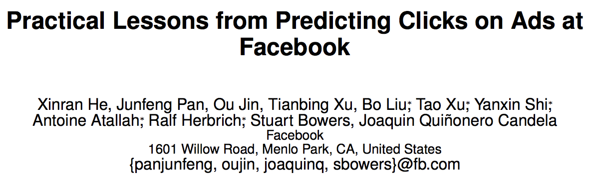

# XGB+LR:Practical Lessons from Predicting Clicks on Ads at Facebook

pdf：[Practical Lessons from Predicting Clicks on Ads at Facebook](http://quinonero.net/Publications/predicting-clicks-facebook.pdf)

对GBDT/XGB+LR的看法：

xgb因为是tree based，可以看做一种**特征交叉**方法。比如一棵树的某个叶子节点的路径依次为 f1 > 0.2 && f2 < 5 && f3 == 1 && f4 > 0，它其实就可以看做四个特征结合的交叉特征。而且分割节点的时候，是按照gain来分割的，自带了**特征选择**的思想在里面。

# 改进的XGBoost+LR

原始特征：类别+连续

先把类别特征离散化了（连续特征不用离散化），然后喂给xgboost。然后将xgboost的叶子结点也给离散化了。

然后把连续特征离散化了，将离散化的xgboost特征和原始特征离散化后拼接在一起，其实此时特征数据的x值已经全部成为了01值了，再喂给LR，得到预估值。

[XGBoost + LR 就是加特征而已](https://cloud.tencent.com/developer/article/1006009)

# 参考资料

* [XGBoost4J-Spark Tutorial](https://xgboost.readthedocs.io/en/latest/jvm/xgboost4j_spark_tutorial.html)

===

[推荐系统遇上深度学习(十)--GBDT+LR融合方案实战](https://www.jianshu.com/p/96173f2c2fb4)

[GBDT+LR算法解析及Python实现](https://www.cnblogs.com/wkang/p/9657032.html)

[gbdt对标量特征要不要onehot编码](https://ask.julyedu.com/question/7720)

在我看来，GBDT中每课tree的作用是进行supervised clustering，最后输出的其实是每个cluster的index。用GBDT是为了追求tree间的diversity。类似思路见周志华的gcForest，用extreme random forest进行特征转换，也是为了追求diversity。

[知乎：LR,gbdt,libfm这三种模型分别适合处理什么类型的特征](https://www.zhihu.com/question/35821566/answer/225927793)

[10分钟了解GBDT＋LR模型的来龙去脉](https://cloud.tencent.com/developer/news/14063)

[XGBoost+LR融合的原理和简单实现](https://zhuanlan.zhihu.com/p/42123341?utm_source=wechat_session&utm_medium=social&utm_oi=903049909593317376)

