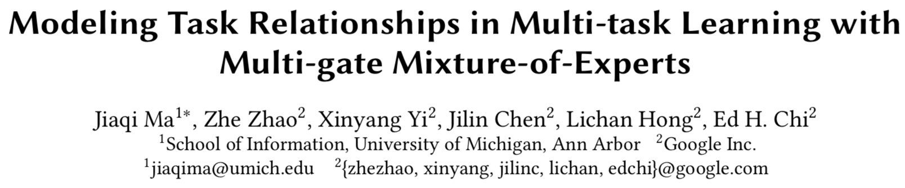
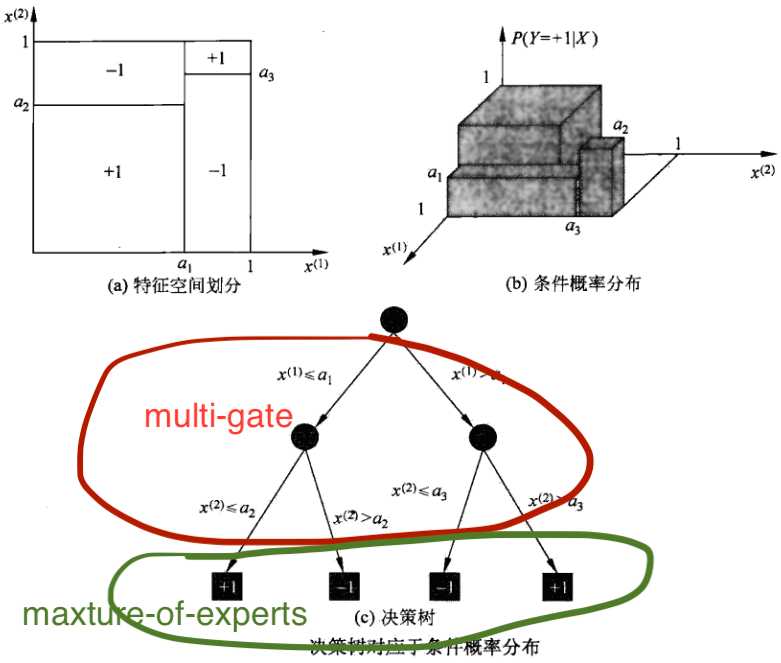

# Multi-task Learning with MMoE

* [返回上层目录](../google.md)
* [MOE混合专家系统](#MOE混合专家系统)

pdf: [*Modeling Task Relationships in Multi-task Learning with Multi-gate Mixture-of-Experts*](https://dl.acm.org/doi/pdf/10.1145/3219819.3220007)

slides论文作者视频讲解: [YouTube](https://www.youtube.com/watch?time_continue=3&v=Dweg47Tswxw&feature=emb_logo)

# MOE混合专家系统

首先我们需要了解混合专家系统（mixture of experts），这里特别推荐Hinton在多伦多大学的一篇slides：

[CSC321: Introduction to Neural Networks and Machine Learning Lecture 15: Mixtures of Experts ](https://www.cs.toronto.edu/~hinton/csc321/notes/lec15.pdf)

先看这个，然后我们直接讲MOE的本质理解：

moe其实就是个决策树桩，他的多个专家网络，就是决策树桩的多个叶子结点的函数。而那个门控路由，就是决策树的if else规则。这样类比的话，就感觉很容易能理解moe的本质了。

更进一步，moe相当于一个连续概率选择（这里需要看下上面的slides）的决策树桩，每一个叶子结点可以看作是一个专家系统。加上归一化的概率，这样就可以有连续的空间来优化参数。

按照moe的思想，确实应该要每个结果乘以一个概率，然后整合成一个结果进行输出，最后就等价于决策树那样。moe把决策树通过概率给连续化了，这样也方便计算损失进行训练。

为什么moe的多个结果要相加，而不是concat呢，我感觉是因为moe的思想就是连续化的决策树，所以多个专家的决策结果形式上要和一个专家的结果保持一致。

moe会让几何空间有明显的分割界限，这个和决策树的空间划分是同一个意思，如上图的上半部分所示。

至于mmoe，则就是利用moe的多个叶子结点的信息，通过不同的multi-gate的参数进行调整，作为不同任务的输入，即共享了底层结点，丰富了原始特征，又不至于让所有专家网络同质化或者低质化。

# 为什么需要引入MMOE

下面引用自知乎推荐算法负责人的博客。

与所有的系统类似，知乎的多目标推荐系统最初也是一个比较简单的版本，仅仅是给各个目标学习一个模型。这种情况下，模型本身的训练和在线预测的负担就会非常严重，每一个模型的训练和预测都要耗费同样的资源，这样对于工程资源压力是非常大的。这些模型之间还有互相的交叉、验证；每个模型还需要评估，离线评估一遍，在线评估一遍，之后再合并… 林林总总的行为加起来，对研发资源造成的负担是非常大的。

在多目标推荐系统的第一版（不同目前各自是一个模型）做出来之后，团队就在考虑：能不能使用模型之间共享一些参数的方式，或者共享模型本身以及训练流程的方式，来减少在训练上的负担，以及它在工程成本、研发成本上的负担？

以此想法为基础，团队做出了一个能够在底层共享相关参数，在顶层根据各种模型、目标本身特点而学习的特有的神经网络架构，张瑞说，这套架构中参考了很多现有的多目标学习的研究进展。

虽然解决了一部分问题，但是把多个模型融合在一起，通过一个模型去学习一个目标的方式仍然存在问题。

首先，目标之间的相关性决定了这个模型学习的上限能有多少。比如：如果一个模型中点赞和点击是完全耦合的，那么这个模型在学习点赞的过程中，也就学习了点击。但是对用户来讲，它的意义是不一样的，这并不是一个完全耦合的系统。

在这个学习任务下，如果去共享底层网络参数的话，可能会造成底层的每个目标都能学习一点，但是每个目标学习的都不够充分，这是**多目标学习系统实现的一个难点**。为了解决这个问题，研发团队参考了 Google 发表的一篇论文，叫做 Multi-gate Mixture-of-Experts，简称 MMOE。

**MMOE 的核心思想是**：把底层的网络划分成一些专用的模块，虽然底层参数是共享的，但是通过目标和网络参数之间的一个 gate（门）来学习，让每部分网络充分学习到对每个目标的贡献最大的一组参数结构，通过这种方式来保证，底层网络参数共享的时候，不会出现目标之间相互抵消的作用。

张瑞告诉我们，经过尝试之后，交互层面的预估子任务的 AUC 值得到了至少千分之二的提升，在模型的主任务也就是预测阅读的任务中，AUC 也没有下降。上线之后，取得的效果也是非常正向的。

# 参考资料

* [CSC321: Introduction to Neural Networks and Machine Learning Lecture 15: Mixtures of Experts ](https://www.cs.toronto.edu/~hinton/csc321/notes/lec15.pdf)

“MOE混合专家系统”参考此slides。

* [进击的下一代推荐系统：多目标学习如何让知乎用户互动率提升100%？](https://blog.csdn.net/cpongo4/article/details/89030299?utm_medium=distribute.pc_relevant.none-task-blog-baidulandingword-6&spm=1001.2101.3001.4242)

“为什么需要引入MMOE”参考了此博客。

* [详解 Google 多任务学习模型 MMoE ( KDD 2018 )](https://www.infoq.cn/article/ShMttzIuB4idK*TsBE15)
* [论文笔记：Multi-task Learning with MMoE](https://zhuanlan.zhihu.com/p/55161704)

本文参考了了上述几篇文章中的内容。

* [HOW POWERFUL ARE GRAPH NEURAL NETWORKS?](https://arxiv.org/pdf/1810.00826v3.pdf)

* [How Powerful are Graph Neural Networks？ GIN 图同构网络 ICLR 2019 论文详解](https://blog.csdn.net/yyl424525/article/details/102841352)

这个论文讲述了为什么embedding聚合采用sum而不是avg和max的原因。

===

[CS 2750 Machine Learning Ensamble methods. Mixtures of experts](https://people.cs.pitt.edu/~milos/courses/cs2750-Spring04/lectures/class22.pdf)

这是一篇介绍MOE的slides。

[Twenty Years of Mixture of Experts](http://www.ee.hacettepe.edu.tr/~eyuksel/Publications/2012_TwentyYearsofMixtureofExperts.pdf)

《Multi-Task Learning Using Uncertainty to Weigh Losses for Scene Geometry and Semantics》18年cvpr

这篇论文用来调多任务模型训练，各loss融合的权重

[多目标模型之MMoE](https://www.bilibili.com/read/cv6495744/)

这篇讲了MMoE和共享底层多任务模型的区别。

