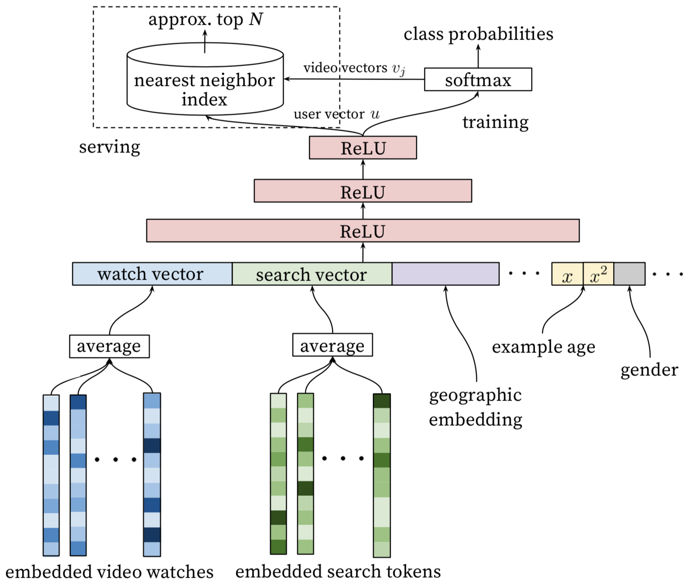
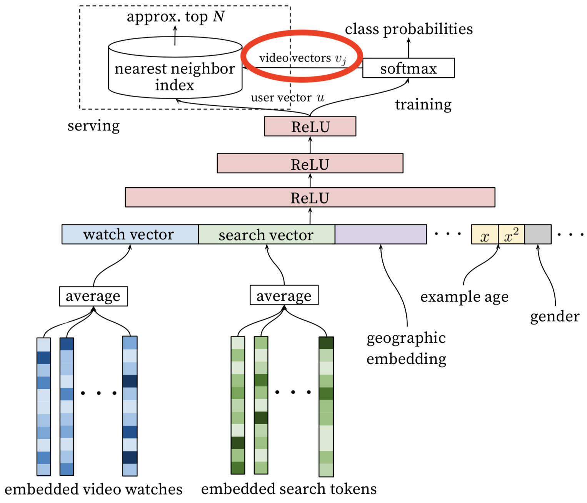

# YouTubeDNN:Deep Neural Networks for YouTube Recommendations

* [返回上层目录](../youtube.md)
* [论文解读](#论文解读)
* [十大工程问题](#十大工程问题)

pdf:[*Deep Neural Networks for YouTube Recommendations*](https://static.googleusercontent.com/media/research.google.com/zh-CN//pubs/archive/45530.pdf)

# 论文解读

这篇神文给我留下的深刻印象有两点：

1. 这毫无疑问是**工业界论文的典范**，是我非常推崇的工程导向的，算法工程师必读的文章；
2. 我以为毫不起眼的地方，也藏着Youtube工程师宝贵的工程经验，**这篇文章你应该精确到句子来体会**，这是我惊为神文的原因。

废话不多说，下面就跟大家分享一下两次拜读这篇论文的不同体验和收获。

第一遍读这篇论文的时候，我想所有人都是冲着算法的架构去的，在深度学习推荐系统已经成为各大公司“基本操作”的今天，Youtube在算法架构上并无惊奇之处，我们来快速介绍一下文章中的深度学习推荐系统的算法架构。

Youtube的用户推荐场景自不必多说，作为全球最大的UGC的视频网站，需要在百万量级的视频规模下进行个性化推荐。由于候选视频集合过大，考虑online系统延迟问题，不宜用复杂网络直接进行推荐，所以Youtube采取了两层深度网络完成整个推荐过程：

1. 第一层是**Candidate Generation Model**完成候选视频的快速筛选，这一步候选视频集合由百万降低到了百的量级。
2. 第二层是用**Ranking Model**完成几百个候选视频的精排

首先介绍candidate generation模型的架构

*Youtube Candidate Generation Model*

我们自底而上看这个网络，最底层的输入是用户观看过的video的embedding向量，以及搜索词的embedding向量。至于这个embedding向量是怎么生成的，作者的原话是这样的

> Inspired by continuous bag of words language models, we learn high dimensional embeddings for each video in a xed vocabulary and feed these embeddings into a feedforward neural network

所以作者是先用word2vec方法对video和search token做了embedding之后再作为输入的，这也是做embedding的“基本操作”，不用过多介绍；当然，除此之外另一种大家应该也比较熟悉，就是通过加一个embedding层跟上面的DNN一起训练，两种方法孰优孰劣，有什么适用场合，大家可以讨论一下。

特征向量里面还包括了用户的地理位置的embedding，年龄，性别等。然后把所有这些特征concatenate起来，喂给上层的ReLU神经网络。

三层神经网络过后，我们看到了softmax函数。这里Youtube的同学们把这个问题看作为用户推荐next watch的问题，所以输出应该是一个在所有candidate video上的概率分布，自然是一个多分类问题。

好了，这一套深度学习的“基本操作”下来，就构成了Youtube的candidate generation网络，看似平淡无奇，其实还是隐藏着一些问题的，比如

1. 架构图的左上角，为什么在online serving的时候不直接用这套网络进行预测而要使用nearest neighbor search 的方法？
2. 多分类问题中，Youtube的candidate video有百万之巨，意味着有几百万个分类，这必然会影响训练效果和速度，如何改进？

这些问题在读第一遍的时候我也没有深想深看，但却是工程实现中必然会遇到的问题，我们随后再深入介绍论文中的解决方法。

既然得到了几百个候选集合，下一步就是利用ranking模型进行**精排序**，下面是ranking深度学习网络的架构图。

*Youtube Ranking Model*

乍一看上面的ranking model似乎与candidate generation模型没有什么区别，模型架构还是深度学习的“基本操作”，唯一的区别就是特征工程，那么我们就讲讲特征工程。

事实上原文也明确说明了，引入另一套DNN作为ranking model的目的就是引入更多描述视频、用户以及二者之间关系的特征，达到对候选视频集合准确排序的目的。

> During ranking, we have access to many more features describing the video and the user's relationship to the video because only a few hundred videos are being scored rather than the millions scored in candidate generation.

具体一点，从左至右的特征依次是

1. **impression video ID embedding**: 当前要计算的video的embedding
2. **watched video IDs average embedding**: 用户观看过的最后N个视频embedding的average pooling
3. **language embedding**: 用户语言的embedding和当前视频语言的embedding
4. **time since last watch**: 自上次观看同channel视频的时间
5. **#previous impressions**: 该视频已经被曝光给该用户的次数

上面五个特征中，我想重点谈谈第4个和第5个。因为这两个很好的引入了对用户行为的观察。

第4个特征背后的思想是

> We observe that the most important signals are those that describe a user's previous interaction with the item itself and other similar items.

有一些引入attention的意思，这里是用了**time since last watch**这个特征来反应用户看同类视频的间隔时间。从用户的角度想一想，假如我们刚看过“DOTA经典回顾”这个channel的视频，我们很大概率是会继续看这个channel的视频的，那么该特征就很好的捕捉到了这一用户行为。

第5个特征**#previous impressions**则一定程度上引入了exploration的思想，避免同一个视频持续对同一用户进行无效曝光。尽量增加用户没看过的新视频的曝光可能性。

至此，我的第一遍论文阅读就结束了，对Youtube的算法框架有了概念，但总觉得不过如此，没什么太多新颖的地方。。

但如果真这么想，还是太naive了，这篇文章，**如果你只读懂了Youtube的推荐系统架构，你只抓住了30%的价值**。那么剩下的70%的价值在哪里呢？

# 十大工程问题

在重读这篇文章的时候，我从一个工程师的角度，始终绷着“如何实现”这根弦，发现这篇论文的工程价值之前被我大大忽略了。下面我列出十个文中解决的非常有价值的问题：

1. 文中把推荐问题转换成多分类问题，在next watch的场景下，每一个备选video都会是一个分类，因此总共的分类有数百万之巨，这在使用softmax训练时无疑是低效的，这个问题Youtube是如何解决的？
2. 在candidate generation model的serving过程中，Youtube为什么不直接采用训练时的model进行预测，而是采用了一种最近邻搜索的方法？
3. Youtube的用户对新视频有偏好，那么在模型构建的过程中如何引入这个feature？
4. 在对训练集的预处理过程中，Youtube没有采用原始的用户日志，而是对每个用户提取等数量的训练样本，这是为什么？
5. Youtube为什么不采取类似RNN的Sequence model，而是完全摒弃了用户观看历史的时序特征，把用户最近的浏览历史等同看待，这不会损失有效信息吗？
6. 在处理测试集的时候，Youtube为什么不采用经典的随机留一法（random holdout），而是一定要把用户最近的一次观看行为作为测试集？
7. 在确定优化目标的时候，Youtube为什么不采用经典的CTR，或者播放率（Play Rate），而是采用了每次曝光预期播放时间（expected watch time per impression）作为优化目标？
8. 在进行video embedding的时候，为什么要直接把大量长尾的video直接用0向量代替？
9. 针对某些特征，比如#previous impressions，为什么要进行开方和平方处理后，当作三个特征输入模型？
10. 为什么ranking model不采用经典的logistic regression当作输出层，而是采用了weighted logistic regression？

因为我也是在视频推荐领域工作，所以可以很负责任的说以上的十个问题都是非常有价值的。接下来详细分析一下以上十大问题的答案。

**1、文中把推荐问题转换成多分类问题，在预测next watch的场景下，每一个备选video都会是一个分类，因此总共的分类有数百万之巨，这在使用softmax训练时无疑是低效的，这个问题YouTube是如何解决的？**

这个问题原文的回答是这样的

> We rely on a technique to sample negative classes from the background distribution ("candidate sampling") and then correct for this sampling via importance weighting.

简单说就是进行了负采样（negative sampling）并用importance weighting的方法对采样进行calibration。文中同样介绍了一种替代方法，hierarchical softmax，但并没有取得更好的效果。当然关于采样的具体技术细节以及优劣可能再开一篇文章都讲不完，感兴趣的同学可以参考tensorflow中的介绍（[https://www.tensorflow.org/extras/candidate_sampling.pdf](https://link.zhihu.com/?target=https%3A//www.tensorflow.org/extras/candidate_sampling.pdf)）以及NLP领域的经典论文 [http://www.aclweb.org/anthology/P15-1001](https://link.zhihu.com/?target=http%3A//www.aclweb.org/anthology/P15-1001)。

**2、在candidate generation model的serving过程中，YouTube为什么不直接采用训练时的model进行预测，而是采用了一种最近邻搜索的方法？**

这个问题的答案是一个经典的工程和学术做trade-off的结果，在model serving过程中对几百万个候选集逐一跑一遍模型的时间开销显然太大了，因此在通过candidate generation model得到user 和 video的embedding之后，通过最近邻搜索的方法的效率高很多。我们甚至不用把任何model inference的过程搬上服务器，只需要把user embedding和video embedding存到redis或者内存中就好了。

但这里我估计又要求助场外观众了，在原文中并没有介绍得到user embedding和video embedding的具体过程，只是在架构图中从softmax朝 model serving module那画了个箭头（如下图红圈内的部分），**到底这个user vector和video vector是怎么生成的？**

**3、Youtube的用户对新视频有偏好，那么在模型构建的过程中如何引入这个feature？**

为了拟合用户对fresh content的bias，模型引入了“Example Age”这个feature，文中其实并没有精确的定义什么是example age。按照文章的说法猜测的话，会直接把sample log距离当前的时间作为example age。比如24小时前的日志，这个example age就是24。在做模型serving的时候，不管使用那个video，会直接把这个feature设成0。大家可以仔细想一下这个做法的细节和动机，非常有意思。

当然我最初的理解是训练中会把Days since Upload作为这个example age，比如虽然是24小时前的log，但是这个video已经上传了90小时了，那这个feature value就是90。那么在做inference的时候，这个feature就不会是0，而是当前时间每个video的上传时间了。

我不能100%确定文章中描述的是哪种做法，大概率是第一种。还请大家踊跃讨论。

文章也验证了，example age这个feature能够很好的把视频的freshness的程度对popularity的影响引入模型中。

从上图中我们也可以看到，在引入“Example Age”这个feature后，模型的预测效力更接近经验分布；而不引入Example Age的蓝线，模型在所有时间节点上的预测趋近于平均，这显然是不符合客观实际的。

**4、在对训练集的预处理过程中，YouTube没有采用原始的用户日志，而是对每个用户提取等数量的训练样本，这是为什么？**

原文的解答是这样的，

> Another key insight that improved live metrics was to generate a xed number of training examples per user, e ectively weighting our users equally in the loss function. This prevented a small cohort of highly active users from dominating the loss.

理由很简单，这是为了减少高度活跃用户对于loss的过度影响。

**5、YouTube为什么不采取类似RNN的Sequence model，而是完全摒弃了用户观看历史的时序特征，把用户最近的浏览历史等同看待，这不会损失有效信息吗？**

这个原因应该是YouTube工程师的“经验之谈”，如果过多考虑时序的影响，用户的推荐结果将过多受最近观看或搜索的一个视频的影响。YouTube给出一个例子，如果用户刚搜索过“tayer swift”，你就把用户主页的推荐结果大部分变成tayer swift有关的视频，这其实是非常差的体验。为了综合考虑之前多次搜索和观看的信息，YouTube丢掉了时序信息，讲用户近期的历史纪录等同看待。

但RNN到底适不适合next watch这一场景，其实还有待商榷，@严林 大神在上篇文章的评论中已经提到，youtube已经上线了以RNN为基础的推荐模型， 参考论文如下： [https://static.googleusercontent.com/media/research.google.com/en//pubs/archive/46488.pdf](https://link.zhihu.com/?target=https%3A//static.googleusercontent.com/media/research.google.com/en//pubs/archive/46488.pdf)

看来时隔两年，YouTube对于时序信息以及RNN模型有了更多的掌握和利用。

**6、在处理测试集的时候，YouTube为什么不采用经典的随机留一法（random holdout），而是一定要把用户最近的一次观看行为作为测试集？**

这个问题比较好回答，只留最后一次观看行为做测试集主要是为了避免引入future information，产生与事实不符的数据穿越。

**7、在确定优化目标的时候，YouTube为什么不采用经典的CTR，或者播放率（Play Rate），而是采用了每次曝光预期播放时间（expected watch time per impression）作为优化目标？**

这个问题从模型角度出发，是因为 watch time更能反应用户的真实兴趣，从商业模型角度出发，因为watch time越长，YouTube获得的广告收益越多。而且增加用户的watch time也更符合一个视频网站的长期利益和用户粘性。

这个问题看似很小，实则非常重要，objective的设定应该是一个算法模型的根本性问题，而且是算法模型部门跟其他部门接口性的工作，从这个角度说，YouTube的推荐模型符合其根本的商业模型，非常好的经验。

我之前在领导一个算法小组的时候，是要花大量时间与Business部门沟通Objective的设定问题的，这是路线方针的问题，方向错了是要让组员们很多努力打水漂的，一定要慎之又慎。

**8、在进行video embedding的时候，为什么要直接把大量长尾的video直接用0向量代替？**

这又是一次工程和算法的trade-off，把大量长尾的video截断掉，主要还是为了节省online serving中宝贵的内存资源。当然从模型角度讲，低频video的embedding的准确性不佳是另一个“截断掉也不那么可惜”的理由。

当然，之前很多同学在评论中也提到简单用0向量代替并不是一个非常好的选择，那么有什么其他方法，大家可以思考一下。

**9、针对某些特征，比如#previous impressions，为什么要进行开方和平方处理后，当作三个特征输入模型？**

这是很简单有效的工程经验，引入了特征的非线性。从YouTube这篇文章的效果反馈来看，提升了其模型的离线准确度。

**10、为什么ranking model不采用经典的logistic regression当作输出层，而是采用了weighted logistic regression？**

因为在第7问中，我们已经知道模型采用了expected watch time per impression作为优化目标，所以如果简单使用LR就无法引入正样本的watch time信息。因此采用weighted LR，将watch time作为正样本的weight，在线上serving中使用$e^{(Wx+b)}$做预测可以直接得到expected watch time的近似，完美。

这里我们详细陈述一下这个问题：

*YouTube深度学习推荐系统中Ranking Model的架构图*

上图是YouTube推荐系统排序模型（Ranking Model）的架构图，我们不再重复讲解模型的细节，而是把关注的焦点放在最后的输出层：

**为什么Ranking Model采用了weighted logistic regression作为输出层？在模型serving过程中又为何没有采用sigmoid函数预测正样本的probability，而是使用$e^{(Wx+b)}$这一指数形式预测用户观看时长？**

对于传统的深度学习架构，输出层往往采用LR或者Softmax，在线上预测过程中，也是原封不动的照搬LR或者softmax的经典形式来计算点击率（广义地说，应该是正样本概率）。

而YouTube这一模型的神奇之处在于，输出层没有使用LR，而是采用了Weighted LR，模型serving没有采用sigmoid函数的形式，而是使用了$e^{(Wx+b)}$这一指数形式。按照原文说法，这样做预测的就是用户观看时长？？没有任何其他表情能像这位小哥一样表达我初读论文的感受。。What？？？

搞清楚这件事情并不是一件容易的事情，我们要从逻辑回归的**本质意义**上开始。

几乎所有算法工程师的第一堂课就是逻辑回归，也肯定知道逻辑回归的数学形式就是一个线性回归套sigmoid函数：
$$
h_{\theta}(x)=\dfrac{1}{1+e^{-\theta^Tx}}
$$
但为什么选择sigmoid函数？难道仅仅是sigmoid函数能把值域映射到0-1之间，符合概率的物理意义这么简单吗？

答案显然不会这么肤浅。

为解释这个问题，首先我们需要定义一个新的变量——**Odds**，中文可以叫**发生比**或者**机会比**。
$$
Odds=\frac{p}{1-p}
$$
假设一件事情发生的概率是p，那么**Odds就是一件事情发生和不发生的比值**。

如果对Odds取自然对数，再让ln(Odds)等于一个线性回归函数，那么就得到了下面的等式。
$$
logit(p)=ln(\frac{p}{1-p})=\theta_0+\theta_1x_1+\theta_2x_2
$$
其中ln(p/(1-p))就是大名鼎鼎的**logit函数**，logistics regression又名logit regression，上面的式子就是逻辑回归的由来。我们再做进一步运算，就可以转变成我们熟悉的逻辑回归的形式：
$$
\begin{aligned}
&ln(\frac{p}{1-p})=\theta^Tx\\
\Rightarrow&\frac{p}{1-p}=e^{\theta^Tx}\\
\Rightarrow&p=\frac{1}{1+e^{-\theta^Tx}}\\
\Rightarrow&p=sigmoid(\theta^Tx)
\end{aligned}
$$
到这里大家应该已经完全明白了LR的推导过程了。

那么再对$ln(Odds)=\theta^Tx$这个等式做一个小小的转换，两边取自然底数：
$$
\begin{aligned}
&ln(Odds)=\theta^Tx\\
\Rightarrow&Odds=e^{\theta^Tx}=\text{YouTubeServingFunction}
\end{aligned}
$$
大家看到了吗，Youtube的Serving函数$e^{Wx+b}$计算的不是别的，正是Odds！

但我们还没有到达终点，因为Youtube要预测的明明是用户观看时长，怎么就成了Odds了？

这就要提到YouTube采用的独特的训练方式Weighted LR，这里的Weight，对于正样本i来说就是观看时长$T_i$，对于负样本来说，则指定了单位权重1。

Weighted LR的特点是，正样本权重w的加入会让正样本发生的几率变成原来的w倍，也就是说样本i的Odds变成了下面的式子：
$$
Odds(i)=\frac{w_ip}{1-w_ip}
$$
由于在视频推荐场景中，用户打开一个视频的概率p往往是一个很小的值，因此上式可以继续简化：
$$
Odds(i)=\frac{w_ip}{1-w_ip}\approx w_ip=T_ip=E(T_i)
$$
而且由于YouTube采用了用户观看时长$T_i$作为权重，因此式子进一步等于$T_i\times p$，这里真相就大白了，由于p就是用户打开视频的概率，$T_i$是观看时长，因此$T_i\times p$就是用户观看某视频的期望时长！

因此，YouTube采用$e^{Wx+b}$这一指数形式预测的就是曝光这个视频时，用户观看这个视频的时长的期望！利用该指标排序后再进行推荐，是完全符合YouTube的推荐场景和以观看时长为优化目标的设定的。

**再简要总结一下YouTube Ranking Model的Serving过程要点。**

1. $e^{Wx+b}$这一指数形式计算的是Weighted LR的Odds；
2. Weighted LR使用用户观看时长作为权重，使得对应的Odds表示的就是用户观看时长的期望；
3. 因此，Model Serving过程中$e^{Wx+b}$计算的正是观看时长的期望。

最后按惯例给大家留一个讨论的问题，欢迎大家各抒己见：

训练Weighted LR一般来说有两种办法：

1. 将正样本按照weight做重复sampling，然后输入模型进行训练；
2. 在训练的梯度下降过程中，通过改变梯度的weight来得到Weighted LR。

问题是这两种训练方法得到的结果有没有不同？有没有其他Weighted LR的训练方法？

回答：

这两种训练方法得到的结果是不一样的，比如要抽样10倍，对于第一种方法，就是把一条样本重复10倍，这样优化的过程中，每遇到一条这个样本，就会用梯度更新一下参数，然后用更新后的参数再去计算下一条样本上的梯度，如果逐步计算并更新梯度10次；但对于第二种方法，则是一次性更新了单条梯度乘以10这么多的梯度，是一种一次到位的做法。

直观一些来讲，第一种方法更像是给予一条样本10倍的关注，愿意花更多时间和精力来对待这条样本，是一种更细致的方法，第二种则比较粗暴了，不愿意花太多功夫，直接给你10倍权重。

---

疑问：

1. serving的时候，sigmoid和和指数函数都是单调递增的。如果取固定的top K个item做曝光，那这两种方式结果完全是一样的，没理解为什么还要用指数函数。

   答：如果只是涉及到排序阶段的话，结果应该是一样的，看自己业务需要，如果是广告算法，需要乘以对应的cpc，结果就有不同了

十个问题全部答完，希望对大家有帮助。其实在上一篇文章抛出这十个问题的时候，已经有诸位大神做出了很好的回答。最后增加一个思考环节，大家可以讨论一下下面的问题：

1. **本论文中，用于 candidate generation网络serving部分的user embedding vector和video embedding vector是怎么生成的？**
2. **Example age这个feature的定义到底是什么？**
3. **除了用0向量embedding替代长尾内容，有没有其他好的方法？**

# 参考资料

* [重读Youtube深度学习推荐系统论文，字字珠玑，惊为神文](https://zhuanlan.zhihu.com/p/52169807)

* [YouTube深度学习推荐系统的十大工程问题](https://zhuanlan.zhihu.com/p/52504407)

* [揭开YouTube深度推荐系统模型Serving之谜](https://zhuanlan.zhihu.com/p/61827629)

本文复制自这三篇文章并进行整理合并。

===

[Youtube论文的要点，你真的懂了吗？（一）](https://zhuanlan.zhihu.com/p/82552122)

