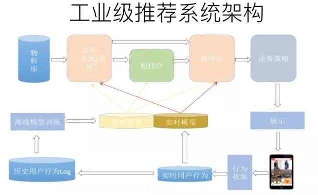

# 推荐系统概述

* [返回上层目录](../recommender-systems.md)
* [工业级推荐系统架构](#工业级推荐系统架构)
  * [召回](#召回)
  * [排序](#排序)

# 工业级推荐系统架构

## 召回

召回的类别主要分为三类：

* user->user->item

  即找到和用户相似的用户，再把相似用户喜欢的商品推送给用户。

* user->item->item

  即找到用户喜欢的商品，再把和用户喜欢的商品相似的商品推送给用户。

* user->item

  直接把用户可能喜欢的商品推送给用户。

具体如下图所示：

## 排序

# 参考资料

===

[深度学习与推荐系统完结篇（知识、论文、源码、数据集&行业应用）](https://mp.weixin.qq.com/s/n5ZplTadX6jtXIwJmXHivg)

