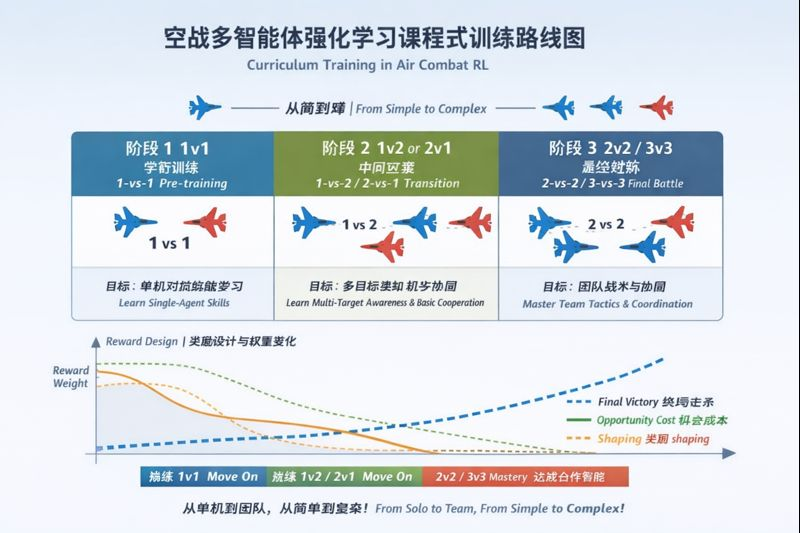

# 课程式学习在MARL中的应用

* [返回上层目录](../advanced-theme.md)
* [课程式训练的核心思想](#课程式训练的核心思想)
* [课程式训练在MARL中的应用](#课程式训练在MARL中的应用)

# 课程式训练的核心思想

**课程式训练（Curriculum Learning）** 的核心思想是：

> 不一开始就让 agent 面对最复杂的任务，而是先学简单任务，慢慢增加难度。

在博弈对抗情境下的例子：

1. **阶段 1：简单追击**
   - 敌机速度慢、轨迹直
   - 让 agent 学会如何靠近敌机、发射导弹
2. **阶段 2：避导弹 + 复杂机动**
   - 引入敌机导弹，agent 需要躲避
3. **阶段 3：全战术空战**
   - 真实复杂环境，混合动作、资源管理

**Reward 逐步增加复杂性**

- 一开始只奖励 `R_FIRE_GOOD`
- 后期加入 `opportunity cost`
- 再后期加入 `post-fire confirm shaping`

**目的**

- **让 agent 更快收敛**，避免一开始 reward 信号太稀疏
- **减少训练不稳定**
- 更容易学出合理策略，而不是被 sparse reward 打懵

总结：

> 目的：帮助 agent 逐步学复杂任务  
> 具体应用：先简单追击 → 加避弹 → 加多敌机，或者逐步增加 reward 模块

# 课程式训练在MARL中的应用

**问题**：课程式训练能否用于 MARL？例如：先做 1v1，再训练 2v2？

**答案**：完全可以，而且非常推荐。这是多智能体强化学习中成熟的策略，特别适合博弈问题。

你这个想法在学术界和工程界都有大量先例，并且**特别适合博弈问题**。

**一句话结论**

> **课程式训练完全适合 MARL**
> **1v1 → 2v2 → 3v3** 是空战、多机协同领域的标准做法之一。
> 这不是投机取巧，而是降低博弈复杂度的正统方法。

你这个设计不是“投机取巧”，而是**降低博弈复杂度的正统方法**。

## 为什么 MARL 更“需要”课程式训练？

MARL 的难点不在于状态维度，而在于：

1. **非平稳性（non-stationarity）**
2. **联合动作空间指数爆炸**
3. **信用分配（credit assignment）**

直接从 2v2 或 3v3 开始：

- 每个 agent 面对的“环境策略”一直在变
- 学到的东西随时会失效
- reward 信号更稀疏、更噪声

**结论**：1v1 本质上是 MARL → 单智能体博弈的“最小非平稳单元”。

## 1v1 → 2v2 的课程逻辑在空战中特别合理

空战天然有“战术层级”：

| 阶段     | 学习目标                                         |
| -------- | ------------------------------------------------ |
| **1v1**  | 发射窗口识别、射与不射的博弈、基础机动与角度控制 |
| **2v2**  | 目标分配、协同夹击、避免浪费导弹                 |
| **3v3+** | 编队、掩护、战场态势评估                         |

这些能力本身不是同一层级技能，强行一起学反而更难。

## 结合工程设计的课程建议

### ✅ 阶段 1：1v1（强烈建议）

**目标**：学会“像个会打仗的飞行员”

- 敌我：1 vs 1
- reward：
  - 终局击杀
  - 发射窗口奖励
  - 机会成本
  - 很弱的 confirm shaping

**关注指标**：

- 是否会在窗口内稳定发射
- 是否避免无意义乱射
- 导弹命中率随训练上升

### ✅ 阶段 2：1v2 或 2v1（过渡阶段）

这是一个**被很多人忽略，但非常关键的中间阶段**。

**作用**：

- 引入战场多目标感知
- 但仍然保持我方决策简单

可用于：

- 测试 target-attention 是否生效
- 检查 reward 是否会诱导错误集火

### ✅ 阶段 3：2v2（真正 MARL）

- **复用 1v1 模型参数**初始化
- 只调整：
  - critic（联合价值）
  - 部分 reward 权重（降低 shaping）

**优点**：这一步往往**收敛速度比从零训练快一个数量级**。

## 重要工程建议

### ❗ 坑 1：不要换人数就清空网络权重

- actor：强烈建议继承
- critic：可重置或部分冻结再放开  

否则 1v1 学到的“发射窗口识别能力”会被白白丢掉。

### ❗ 坑 2：reward 不要突然完全换一套

- 1v1 / 2v2 / 3v3 的 missile reward 可通用，不需要推翻
- 随人数增加，逐步降低 shaping 权重
- 保留终局与机会成本逻辑

### ❗ 坑 3：不要一开始就要求完美协同

- 允许 2v2 早期允许一定程度的“重复攻击”，先学会**不乱射 + 会在窗口射**
- 协同行为是后期 emergent，非 reward 硬塞

## 五、研究段位评价

如果把 MARL 工作分层：

| 层级                 | 特征                                               |
| -------------------- | -------------------------------------------------- |
| 初学者               | 单一场景，直接 2v2，reward 杂糅                    |
| 中级                 | 有 1v1 预训练，但 reward 设计粗糙                  |
| **高级（推荐路线）** | **1v1 curriculum + 精细 reward + 模块化设计**      |
| 顶级                 | curriculum + self-play + population-based training |

> 你现在已稳站在“高级工程 + 可写论文”档次

## 六、可选下一步：Population-based curriculum

- 等 2v2 稳定后，可考虑**Population-based curriculum**：
  - 1v1 对不同风格敌人
  - 再迁移到 2v2

这是 AlphaStar / OpenAI Five 用过的路线。

## 七、AlphaStar / OpenAI Five 的课程式训练示例

AlphaStar 和 OpenAI Five 在训练初期都是**从最小、最简单的博弈单元开始的**，然后逐步升级到完整多人场景。全不是一开始直接nvn。具体来说：

### 1️⃣ AlphaStar（星际争霸 II AI）

- **初始阶段**：先训练在非常简化的微型地图或者单一单位上对战。
  - 例如 1v1，或者只让 AI 控制少量单位，敌人也是固定策略。
  - 目标是让 agent 学会基础操作：采矿、建造、简单战斗。
- **中间阶段**：逐步增加单位数量、地图大小和对手策略多样性。
  - 引入 curriculum，让 agent 学会不同战术组合。
- **最终阶段**：全地图、完整 1v1 竞技。
  - 这个阶段 agent 已经有足够底层技能，只需要优化高层策略。

### 2️⃣ OpenAI Five（Dota 2）

- **初始阶段**：先在 1v1、或者 1v1v1、非常小的英雄组合上训练。
  - 学习单个英雄技能释放、移动、攻击等。
- **逐步升级**：
  - 2v2 → 3v3 → 5v5
  - 每一步都是 curriculum：先学会小规模战斗，再引入协同。
- **奖励设计**：一开始奖励非常稀疏（击杀、掉血），再慢慢加上 shaping（技能命中、位置控制等）。
- **自对弈（self-play）**：不断升级难度，让 agent 在 curriculum 里自适应。

## 八、核心规律总结

1. 不直接从完整多人场景开始  
   - 复杂度高，reward 稀疏，策略不稳定
2. 先学局部技能，再学协同/全局策略  
   - 小单位 → 小组合 → 完整队伍
3. 课程式训练 + 自对弈是关键  
   - Curriculum 降低训练难度  
   - Self-play 提供多样化对手

## 九、空战 MARL 实践建议

- 训练顺序：1v1 → 2v2 → 3v3  
- reward 精细化，shaping 弱  
- 难度逐步增加  
- 充分复用低级模型参数，提高收敛效率

> 完全沿用了 AlphaStar / OpenAI Five 的理念

# 参考资料

ChatGPT：

* [迁移对话总结](https://chatgpt.com/c/694b802c-0478-8324-95ec-b72e1ac2a284)

* [课程式学习与MARL](https://chatgpt.com/c/694b659b-005c-8324-b614-099997d5de3e)

* [奖励函数设计-课程式学习在对话的最后](https://chatgpt.com/c/6938f2c6-d1f4-8325-a0e9-168c20318205)

