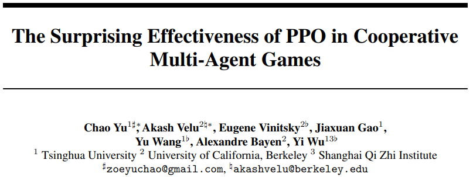

# 多智能体强化学习论文

- [返回上层目录](../multi-agent-reinforcement-learning.md)

pdf: [The Surprising Effectiveness of PPO in Cooperative Multi-Agent Games](https://arxiv.org/pdf/2103.01955.pdf)

源码：

* 官方开源代码，但官方代码对环境的要求可能比较高

  https://github.com/marlbenchmark/on-policy

* 更加轻量版，对环境没有依赖的版本，更好方便移植到自己项目的代码为

  https://github.com/tinyzqh/light_mappo

网上一个异构多智能体的环境：[Farama-Foundation/MicroRTS](https://github.com/Farama-Foundation/MicroRTS)

我和chatgpt的聊天：https://chatgpt.com/c/686ff5f8-63ec-800f-9964-e6478f8f4db2

# 多智能体算法分类

多智能体强化学习算法大致上可以分为两类，**中心式**和**分散式**。

**中心式**的思想是考虑一个合作式的环境，直接将单智能体算法扩展，让其直接学习一个联合动作的输出，但是并不好给出单个智能体该如何进行决策。

**分散式**是每个智能体独立学习自己的奖励函数，对于每个智能体来说，其它智能体就是环境的一部分，因此往往需要去考虑环境的非平稳态，并且分散式学习到的并不是全局的策略。

最近的一些工作提出了两种框架连接中心式和分散式这两种极端方法，从而得到折衷的办法：**中心式训练分散式执行**（centealized training and decentralized execuation, CTDE）和**值分解**（value decomposition, VD）

CTDE是通过学习一个全局的Critic来减少值函数的方差，这类方法的代表有MADDPG和COMA；VD是通过对局部智能体的Q函数进行组合来得到一个联合Q函数。

MAPPO采用的一种中心式的值函数方法来考虑全局信息，属于CTDE方法，通过一个全局的值函数使得单个PPO智能体相互配合。**前身是IPPO**，是一个完全分散式PPO算法。

MAPPO中每个智能体$i$基于局部观测和一个共享策略$\pi_{\theta}(a_i|o_i)$（这里的共享策略针对的是智能体同类型的情况，对于非同类型每个智能体有自己的actor和critic网络）生成一个动作来最大化折扣累积奖励。

| 系统                        | 方法选择                                                     |
| --------------------------- | ------------------------------------------------------------ |
| **OpenAI Five**             | centralized critic + team reward + 参数共享 + LSTM + large-scale env |
| **DeepMind AlphaStar**      | centralized critic + team reward + role encoder（可理解为 attention） |
| **腾讯觉武 / 字节飞桨空战** | MAPPO + team reward + 策略分工（导弹机/雷达机）+ actor routing |

# 参考资料

* [MAPPO算法流程和代码解读](https://blog.csdn.net/weixin_41106546/article/details/137194198)

本文参考了此csdn博客。

===

mappo与rmappo区别见原代码:

https://github.com/marlbenchmark/on-policy/blob/main/onpolicy/scripts/train/train_mpe.py#L68

区别：rmappo使用了RNN

[全网良心论文复现！Centos 7.9 复现MAPPO出现的问题汇总](https://www.jianshu.com/p/4c5a1784def4)

[MAPPO论文翻译-The Surprising Effectiveness of PPO in Cooperative, Multi-Agent Games](https://blog.csdn.net/weixin_71090624/article/details/139012940)

[多智能体强化学习MAPPO源代码解读](https://blog.csdn.net/onlyyyyyyee/article/details/118888711)

[MAPPO算法流程和代码解读](https://blog.csdn.net/weixin_41106546/article/details/137194198)

[多智能体强化学习(二) MAPPO算法详解](https://zhiqianghe.blog.csdn.net/article/details/117283800)

[多智能体强化学习之MAPPO理论解读](https://blog.csdn.net/onlyyyyyyee/article/details/118640097)

[听说你的多智能体强化学习算法不work？你用对MAPPO了吗](https://baijiahao.baidu.com/s?id=1693377816234538595)