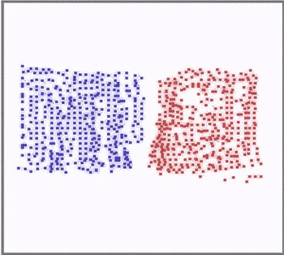

# 平均场多智能体强化学习

- [返回上层目录](../paper.md)

该论文是UCL汪军老师团队发表于ICML2018

论文：[Mean Field Multi-Agent Reinforcement Learning](https://arxiv.org/pdf/1802.05438v4.pdf)

MAgent环境：[geek-ai/MAgent](https://github.com/geek-ai/MAgent)

这个是UCL汪军老师团队Mean Field 论文里用到的环境，主要研究的是当环境由**大量智能体**组成的时候的竞争和协作问题。也可以看成是复杂的Grid World环境。Render如下：

# 参考资料

* [有哪些常用的多智能体强化学习仿真环境？](https://www.zhihu.com/question/332942236/answer/1295507780)

这里提到了汪军老师的环境及其渲染图。

* [新智元：UCL汪军团队新方法提高群体智能，解决大规模AI合作竞争](https://www.sohu.com/a/237639512_473283)

这里介绍了这篇论文。

===

* [csdn: Mean Field Multi-Agent Reinforcement Learning](https://blog.csdn.net/qq_36616268/article/details/83084455#:~:text=%E4%B8%80%E3%80%81%E5%BC%95%E8%A8%80%20Mean%20Field%20Multi-Agent%20Reinforcement%20Learning%20%EF%BC%88MFMARL%EF%BC%89%20%E6%98%AF%E4%BC%A6%E6%95%A6%E5%A4%A7%E5%AD%A6%E5%AD%A6%E9%99%A2%EF%BC%88UCL%EF%BC%89%E8%AE%A1%E7%AE%97%E6%9C%BA%E7%A7%91%E5%AD%A6%E7%B3%BB%E6%95%99%E6%8E%88%E6%B1%AA%E5%86%9B%E6%8F%90%E5%87%BA%E7%9A%84%E4%B8%80%E4%B8%AA%E5%A4%9A%E6%99%BA%E8%83%BD%E4%BD%93%E5%BC%BA%E5%8C%96%E5%AD%A6%E4%B9%A0%E7%AE%97%E6%B3%95%E3%80%82,%E4%B8%BB%E8%A6%81%E8%87%B4%E5%8A%9B%E4%BA%8E%E6%9E%81%E5%A4%A7%E8%A7%84%E6%A8%A1%E7%9A%84%E5%A4%9A%E6%99%BA%E8%83%BD%E4%BD%93%E5%BC%BA%E5%8C%96%E5%AD%A6%E4%B9%A0%E9%97%AE%E9%A2%98%EF%BC%8C%E8%A7%A3%E5%86%B3%E5%A4%A7%E8%A7%84%E6%A8%A1%E6%99%BA%E8%83%BD%E4%BD%93%E4%B9%8B%E9%97%B4%E7%9A%84%E4%BA%A4%E4%BA%92%E5%8F%8A%E8%AE%A1%E7%AE%97%E5%9B%B0%E9%9A%BE%E3%80%82%20%E7%94%B1%E4%BA%8E%E5%A4%9A%E6%99%BA%E8%83%BD%E4%BD%93%E5%BC%BA%E5%8C%96%E5%AD%A6%E4%B9%A0%E9%97%AE%E9%A2%98%E4%B8%8D%E4%BB%85%E6%9C%89%E7%8E%AF%E5%A2%83%E4%BA%A4%E4%BA%92%E9%97%AE%E9%A2%98%EF%BC%8C%E8%BF%98%E6%9C%89%E6%99%BA%E8%83%BD%E4%BD%93%E4%B9%8B%E9%97%B4%E7%9A%84%E5%8A%A8%E6%80%81%E5%BD%B1%E5%93%8D%EF%BC%8C%E5%9B%A0%E6%AD%A4%E4%B8%BA%E4%BA%86%E5%BE%97%E5%88%B0%E6%9C%80%E4%BC%98%E7%AD%96%E7%95%A5%EF%BC%8C%E6%AF%8F%E4%B8%AA%E6%99%BA%E8%83%BD%E4%BD%93%E9%83%BD%E9%9C%80%E8%A6%81%E8%80%83%E5%AF%9F%E5%85%B6%E4%BB%96%E6%99%BA%E8%83%BD%E4%BD%93%E7%9A%84%E5%8A%A8%E4%BD%9C...%20%E6%96%87%E7%AB%A0%E7%9B%AE%E5%BD%95Sequential%20GamesMarkov%20Games%E9%A9%AC%E5%B0%94%E7%A7%91%E5%A4%AB%E5%8D%9A%E5%BC%88%E4%B8%AD%E7%9A%84%E5%BC%BA%E5%8C%96%E5%AD%A6%E4%B9%A0%E5%80%BC%E8%BF%AD%E4%BB%A3%20Sequential%20Games%20%E5%A4%9A%E6%99%BA%E8%83%BD%E4%BD%93%E5%BC%BA%E5%8C%96%E5%AD%A6%E4%B9%A0%E5%9C%A8%E6%9C%89%E7%8A%B6%E6%80%81%E8%BD%AC%E7%A7%BB%E7%9A%84%E7%8E%AF%E5%A2%83%E4%B8%AD%E8%BF%9B%E8%A1%8C%E5%BA%8F%E5%88%97%E5%86%B3%E7%AD%96%E3%80%82)