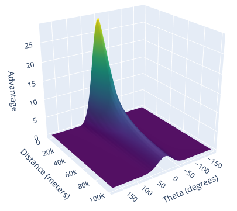
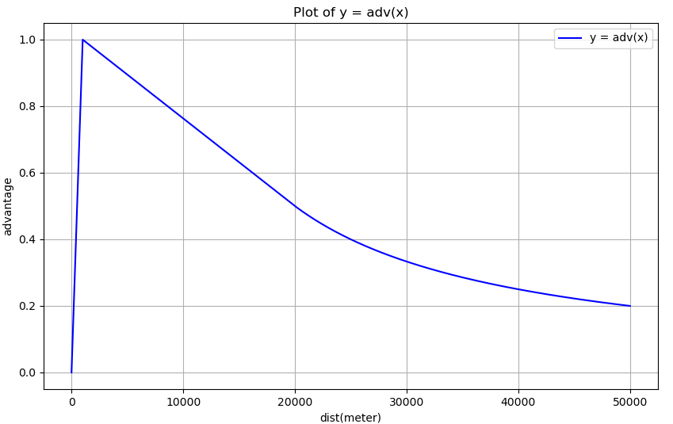
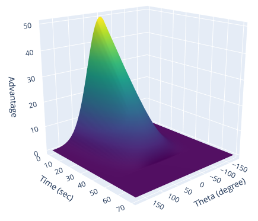

# 对抗智能体奖励设计

* [返回上层目录](../sparse-reward.md)
* [事件奖励（稀疏）](#事件奖励（稀疏）)
* [状态奖励（稠密）](#状态奖励（稠密）)


奖励函数在强化学习算法中起到至关重要的作用。空战问题固有的奖励函数为在战斗结束时，根据战争的结果给出的奖励。但是，这样的奖励过于稀疏，难以引导智能体习得最优策略。使用奖励塑造（Reward Shaping）的技术，通过密集奖励，对智能体进行引导。

奖励可分为事件奖励和状态奖励。

* 事件奖励是稀疏的，在特定事件发生后才得到奖励。
* 状态奖励是密集的，每个时间步都会计算。

根据文献1和2，针对超视距空战，设计奖励函数，如下表所示。

```
1.《Mastering air combat game with deep reinforcement learning》. Defence Technology，2024
2.《稀疏奖励下基于课程学习的无人机空战仿真》. 系统仿真学报，2024
```

# 事件奖励（稀疏）

* 命中目标 +100
* 平局 -10
* 被命中 -100
* 坠地 -100
* 扫描到敌机 +10
* 近距离躲避敌机 +50
* 近距离经过敌机 +10
* 发射导弹 -6~-2

还有：

* 角度奖励：当我机没有发射导弹且敌机没有发射导弹时，为了鼓励飞机接近敌机的尾部，飞机速度方向与敌机速度方向之间的夹角越小，智能体获得的奖励越高。因为这表明智能体处于更有利的攻击位置。

* 导弹发射成功奖励：当智能体成功发射导弹时，给予奖励；如果导弹命中目标，则进一步增加奖励。
* 导弹损失惩罚：如果导弹未能命中目标，则给予负奖励，以鼓励智能体优化武器使用
* 超出交战空域，reward -= 10，引导 Agent 在交战空域内
* 被敌方锁定后，逃脱导弹成功， reward += 1，引导Agent学习导弹规避动作。

# 状态奖励（稠密）

* 我机优势 $R_{plane\_adv}$
* 我方导弹优势 $R_{missile\_adv}$
* 敌方导弹威胁 $R_{thread}$

状态奖励包括了优势、威胁等。其中，

（1）**我机优势奖励**指的是飞机在位置上的优势，与双方飞机的距离和相对角度有关，其作用在于引导智能体将机头对准地方，追踪敌方飞机，占据位置优势。综合考虑距离和角度因素，结合超视距空战中位置优势不明显的特征，给出优势奖励的计算方法为
$$
\begin{aligned}
A = \left\{
\begin{matrix}
&30e^{-\frac{\theta_{LOS}^2}{1300}}\frac{d}{1000} \quad &0\le d \le 1000 \\
&30e^{-\frac{\theta_{LOS}^2}{1300}}\frac{39000-d}{38000} \quad &1000< d \le 20000 \\
&30e^{-\frac{\theta_{LOS}^2}{1300}}\frac{10000}{d} \quad &d > 20000 \\
\end{matrix}
\right.
\end{aligned}
$$

$$
R_{plane\_adv}=A_t-A_{t-1}
$$

注意，奖励不是直接用$A$，而是$A$的增量（当前时刻的优势减去上一时刻的优势），这样奖励有正有负，有利于训练。

式中：$\theta_{LOS}$为本机和敌机的连线和本机机头方向的夹角；$d$为双方之间的距离。优势奖励随角度和距离的变化如下图所示。



注意，这里距离是个分段函数，只分析距离的函数图像为：



从上图可看出，当距离过近，反而没有优势。

（2）**我方导弹优势**

这个的计算其实就是计算敌方导弹威胁乘以-1，所以，直接看下面的敌方导弹威胁就行。

（3）**敌方导弹威胁**是指对方武器对我方的威胁程度，与导弹击中我机的剩余时间$t$和相对方位角$\theta_{LOS}$（导弹的速度和导弹到我机的连线的角度）有关，威胁奖励的作用是引导智能体躲避来袭导弹，计算式为

$$
\begin{aligned}
T = \left\{
\begin{matrix}
&-50e^{-\frac{\theta_{LOS}^2}{4900}}\frac{50-t}{50} \quad &0\le t \le 50 \\
&0 \quad &t>50
\end{matrix}
\right.
\end{aligned}
$$

$$
R_{thread}=T_t-T_{t-1}
$$

威胁奖励随角度和剩余飞行时间的变化如下图所示。



# 附录

## 我机优势图像的绘制代码

三维图像的代码：

```python
import numpy as np
import plotly.graph_objects as go

# Define the advantage function
def advantage(theta, dist):
    adv = np.zeros_like(dist)  # Initialize array for advantage values
    mask1 = dist <= 1000
    mask2 = (dist > 1000) & (dist <= 20000)
    mask3 = dist > 20000

    adv[mask1] = 30 * np.exp(-np.square(theta[mask1]) / 1300.0) * (dist[mask1] / 1000.0)
    adv[mask2] = 30 * np.exp(-np.square(theta[mask2]) / 1300.0) * ((39000.0 - dist[mask2]) / 38000.0)
    adv[mask3] = 30 * np.exp(-np.square(theta[mask3]) / 1300.0) * (10000.0 / dist[mask3])
    return adv

# Generate x and y data
theta = np.linspace(-180, 180, 50)  # Range of x
dist = np.linspace(0, 100000, 50)  # Range of y
X, Y = np.meshgrid(theta, dist)    # Create grid
Z = advantage(X, Y)  # Compute Z using the advantage function

# Create the 3D surface plot
fig = go.Figure(data=[go.Surface(z=Z, x=X, y=Y, colorscale='Viridis')])

# Update layout for better visualization
fig.update_layout(
    title="3D Surface Plot of Advantage Function",
    scene=dict(
        xaxis_title="Theta (degrees)",
        yaxis_title="Distance (meters)",
        zaxis_title="Advantage"
    ),
)

# Show the plot
fig.show()
```

只分析距离函数的代码：

```python
import numpy as np
import matplotlib.pyplot as plt

# Define the function
def adv(x):
    if x < 1000:
        return x / 1000.0
    elif 1000 <= x < 20000:
        return (39000.0 - x) / 38000.0
    else:
        return 10000.0 / x

# Vectorize the function for efficient computation
adv_vectorized = np.vectorize(adv)

# Generate x values
x = np.linspace(0, 50000, 1000)

# Compute y values
y = adv_vectorized(x)

# Plot the function
plt.figure(figsize=(10, 6))
plt.plot(x, y, label='y = adv(x)', color='blue')
plt.xlabel('dist(meter)')
plt.ylabel('advantage')
plt.title('Plot of y = adv(x)')
plt.grid(True)
plt.legend()
plt.show()
```

## 敌机导弹威胁图像的绘制代码

三维图像的代码：

```python
import numpy as np
import plotly.graph_objects as go

# Define the advantage function
def advantage(theta, time):
    adv = np.zeros_like(time)  # Initialize array for advantage values
    mask1 = time <= 50
    mask2 = time > 50

    adv[mask1] = 50 * np.exp(-np.square(theta[mask1]) / 4900.0) * ((50 - time[mask1]) / 50.0)
    adv[mask2] = 0
    return adv

# Generate x and y data
theta = np.linspace(-180, 180, 50)  # Range of x
time = np.linspace(0, 70, 50)  # Range of y
X, Y = np.meshgrid(theta, time)    # Create grid
Z = advantage(X, Y)  # Compute Z using the advantage function

# Create the 3D surface plot
fig = go.Figure(data=[go.Surface(z=Z, x=X, y=Y, colorscale='Viridis')])

# Update layout for better visualization
fig.update_layout(
    title="3D Surface Plot of Advantage Function",
    scene=dict(
        xaxis_title="Theta (degree)",
        yaxis_title="Time (sec)",
        zaxis_title="Advantage"
    ),
)

# Show the plot
fig.show()
```


# 参考资料

* 《基于混合动作的空战分层强化学习决策算法》20240915，清华和611所