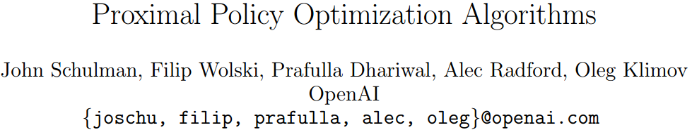
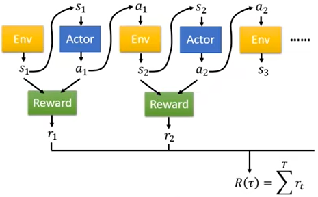
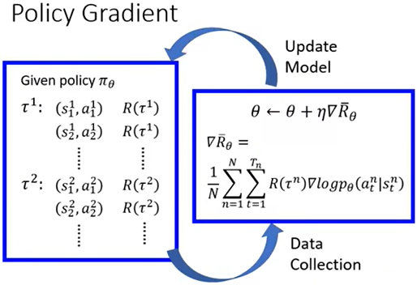
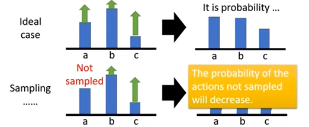
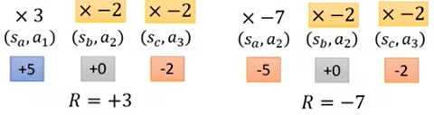
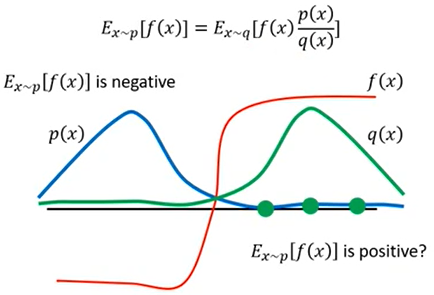
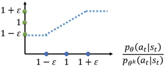
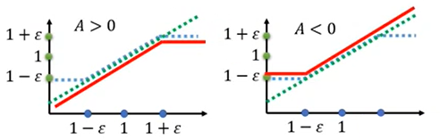
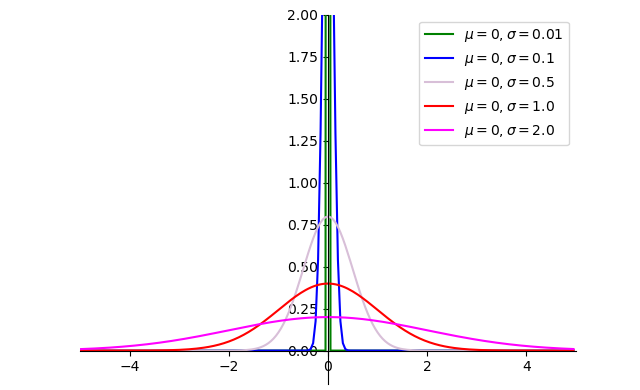

# PPO近端策略优化

- [返回上层目录](../proximal-policy-optimization.md)
- [策略梯度PolicyGradient](#策略梯度PolicyGradient)
- [PPO原理推导](#PPO原理推导)
- [Actor&Critic网络架构](#Actor&Critic网络架构)
- [损失函数](#损失函数)




PDF: [Proximal Policy Optimization Algorithms](https://arxiv.org/abs/1707.06347)

OpenAI Blog: [Proximal Policy Optimization](https://openai.com/blog/openai-baselines-ppo/)和[Proximal Policy Optimization](https://spinningup.openai.com/en/latest/algorithms/ppo.html#id3)

GitHub: [openai/baselines/ppo2](https://github.com/openai/baselines/tree/master/baselines/ppo2)


DeepMind先在2017年7月月初发了PPO的paper，但是他们参考了OpenAI的一个资料，然后OpenAI发现竟然被DeepMind抢先发了，于是OpenAI也就跟着发了PPO。

# 策略梯度PolicyGradient

## 策略梯度的推导

PPO是策略梯度的一个变形。

强化学习中的行为actor的目的，就是为了最大化一场游戏中它的所有奖励reward，即最大化
$$
R=\sum_{t=1}^Tr_t
$$


 如上图所示，每一场游戏中的所有环境和行为串起来就是一个轨迹trajectory，即
$$
\tau = \{s_1,a_1,s_2,a_2,\dots,s_T,a_T\}
$$
一个特定的轨迹trajectory出现的几率为：
$$
\begin{aligned}
p_{\theta}(\tau)&=p(s_1)p_{\theta}(a_1|s_1)p(s_2|s_1,a_1)p_{\theta}(a_2|s_2)p(s_3|s_2,a_2)\dots\\
&=p(s_1)\mathop{\Pi}\limits_{t=1}^T p_{\theta}(a_t|s_t)p(s_{t+1}|s_t,a_t)
\end{aligned}
$$
其中，$\theta$为Actor的模型参数。

然后我们的目标就是，调整Actor模型参数$\theta$，使得$R(\tau)$的值最大化。

注意，$R(\tau)$是个变量，其与Actor模型参数$\theta$有关。为什么是个变量？因为$\theta$通过改变轨迹分布，间接改变奖励的期望。也就是说，$R(\tau)$是关于随机变量$\tau$的函数，而$\tau$的分布由$\theta$决定。因此，当你改变$\theta$时，你采样到的$R(\tau)$的“统计分布”变了。就类似于你掷骰子，给定一次掷骰结果：是确定的，但在掷之前：不是确定的，是随机变量，而且改变$\theta$（骰子偏向），就会改变“奖励的期望”。

但是这里要注意，严格地说，$R(\tau)$并不含有$\theta$。因为大众在**口语层面**把下面三件事混在了一起：

严格区分三层对象（非常重要）

| 对象                  | 是否含$\theta$           |
| --------------------- | ------------------------ |
| $R(\tau)$             | ❌ 不含                   |
| $\tau$的分布          | ✅ 含（由$p_\theta$决定） |
| $\mathbb{E}[R(\tau)]$ | ✅ 含                     |

正确说法应该是：

> **$R(\tau)$的分布随$\theta$改变**

而不是：

> ❌ $R(\tau)$是$\theta$的函数

所以我们最大化的目标函数应该是其期望，即
$$
\bar{R}_{\theta}=\sum_{\tau}R(\tau)p_{\theta}(\tau)=E_{\tau\sim p_{(\theta)}(\tau)}[R(\tau)]
$$
为什么目标函数一定写成期望？因为你根本**控制不了具体哪条轨迹发生**。你能控制的只有：$p_{\theta}(\tau)$，所以你唯一合理的目标只能是上述公式，所以不应是最大化某一条具体轨迹的奖励，而应该是最大化平均意义下的奖励。

那怎么最大化奖励的期望值呢？那就是用对$\bar{R}_{\theta}$的梯度上升法（即对损失函数的梯度下降法）来最大化其值。
$$
\begin{aligned}
\frac{\partial \bar{R}}{\partial \theta}&=
\nabla\bar{R}_{\theta}\\
&=\sum_{\tau}R(\tau)\nabla p_{\theta}(\tau)\\
&=\sum_{\tau}R(\tau)p_{\theta}(\tau)\frac{\nabla p_{\theta}(\tau)}{p_{\theta}(\tau)}\\
&=\sum_{\tau}R(\tau)p_{\theta}(\tau)\nabla\log p_{\theta}(\tau)\\
&=\boxed{E_{\tau\sim p_{\theta}(\tau)}\left[R(\tau)\nabla\log p_{\theta}(\tau)\right]}\\
&\approx \frac{1}{N}\sum_{n=1}^NR(\tau^n)\nabla\log p_{\theta}(\tau^n)\\
&= \frac{1}{N}\sum_{n=1}^N\sum_{t=1}^{T_n}R(\tau^n)\nabla\log p_{\theta}(a_t^n|s_t^n)\\
\end{aligned}
$$
基于奖励对参数$\theta$的梯度值，可以更新参数$\theta$，来让奖励变得更大：
$$
\theta=\theta+\text{lr}\cdot \frac{\partial \bar{R}}{\partial \theta}
$$
为了实现$\theta=\theta+\text{lr}\cdot \frac{\partial \bar{R}}{\partial \theta}$，我们需要一个标量函数（loss），使得对它做反向传播，得到的梯度**正好等于**$\nabla\bar{R}_{\theta}$的负方向，为什么是负方向，因为反向传播是做梯度下降法，求loss的最小值，所以梯度变号，实际等于是梯度上升。而这个loss可以根据**梯度表达式反向“构造”出来**：
$$
\begin{aligned}
&\nabla_{\theta}\text{loss}=-\nabla\bar{R}_{\theta}=-R(\tau^n)\nabla\log p_{\theta}(a_t^n|s_t^n)\\
\Rightarrow&\text{loss}=-R(\tau^n)\log p_{\theta}(a_t^n|s_t^n)
\end{aligned}
$$
这个loss才是工程实现上的loss，其实就是为了能够工程上实现最大化累计奖励的目标函数，把你已经知道的梯度形式，包装成一个可被自动求导的标量函数。这个 loss 并不是强化学习真正的优化目标，而是一个梯度等价的代理目标（surrogate objective）。它**不是**真正的目标：$\mathbb{E}[R(\tau)]$，而是只是一个被人为构造的函数，其梯度恰好是我我们想要的梯度而已，在PPO/TRPO 论文里，这个词就叫：surrogate loss，你已经在“直觉上”把它理解对了。所以，你完全可以这样理解策略梯度：

> 在策略梯度方法中，我们并不是先定义一个 loss 再去优化它；
>
> 而是先从期望奖励的梯度出发，再反向构造一个 surrogate loss，使其梯度与期望奖励的梯度完全一致，从而利用标准的反向传播框架进行优化。

（注意：这一段话说的其实有问题，但是你先接着看）由于我们使用梯度上升法的目标就是提升$\bar{R}_{\theta}$，那么，如果$R(\tau^n)$为正，则通过更新参数$\theta$，自然会使得该条轨迹中的每一个动作的出现几率变大，即使得$p_{\theta}(a_t^n|s_t^n)$更大，从而让$\bar{R}_{\theta}$变得更大。

## 策略梯度提升的一个误区

注意：**上一段的说法是为什么呢？为什么如果$R(\tau^n)$为正，使得$p_{\theta}(a_t^n|s_t^n)$更大，从而让$\bar{R}_{\theta}$变得更大呢？**这好像是在说，是因为$R(\tau^n)$为正，导致了$p_{\theta}(a_t^n|s_t^n)$更大，从而导致了$\bar{R}_{\theta}$变得更大？这里的逻辑关系是什么？很混乱啊！就是说，为什么，正reward可以增加轨迹的概率，负reward可以减少轨迹的概率，我能理解这可以达到总的目标：增大R，但是无法从数学上知道为什么能实现同时增加减小轨迹的概率？总感觉很神奇。。。什么机制让正 reward，可以增加轨迹的概率，负reward可以减少轨迹的概率？

如果你有这样的疑问，说明你在认真思考了！！！而不是模糊不清试图溜过去，就类似你念英语单词，不会音标，试图蒙混过关，类似于你不知道word和world单词的发音区别。所以这里我们一定要仔细深究，逻辑闭环！！！

先说结论：这句话是错的，具有误导性！！！

> 如果$R(\tau^n)$为正，则通过更新参数$\theta$，自然会使得该条轨迹中的每一个动作的出现几率变大，即使得$p_{\theta}(a_t^n|s_t^n)$更大，从而让$\bar{R}_{\theta}$变得更大。

然后我们开始探寻之旅，其实挺简单的，但是为了说清楚，这里写的比较啰嗦。

我们把上述的疑问抽象为一个数学问题：

> 就是函数$f(\theta)$的梯度 = a \* 函数$g(\theta)$的梯度，为什么a>0，可以增加$g(\theta)$的值，a<0，可以减小$g(\theta)$的值？
>
> 其中，函数$f(\theta)$表示原问题中的$\bar{R}_{\theta}$，函数$g(\theta)$表示原问题中的$\nabla\log p_{\theta}(\tau^n)$，a表示原问题中的奖励$R(\tau)$。

其实就是把强化学习的例子抽象成一个**纯数学问题**，去理解“乘上正数/负数系数，为什么会增强/减弱某个方向的变化”，不局限于 RL 的概率分布。我们可以用**泛化的数学公式**来分析。

1️⃣ 问题抽象

假设有一个函数$f(\theta)$，梯度可以写成
$$
\nabla_{\theta}f(\theta)=a\nabla_{\theta}g(\theta)
$$

- $\nabla_{\theta}g(\theta)$是函数$g(\theta)$的梯度，指明“你希望沿哪个方向改变参数”
- $a \in \mathbb{R}$是一个标量系数（类似 RL 里的 reward）
- 参数更新用梯度上升法：$\theta \gets \theta + \eta \nabla_\theta f(\theta) = \theta + \eta a \nabla_{\theta}g(\theta)$

2️⃣ 目标：沿$\nabla_{\theta}g(\theta)$方向增大或减小

* **如果 $a > 0$**：

  更新方式与$\nabla_{\theta}g(\theta)$一致
  $$
  \Delta \theta = \eta a \nabla_{\theta}g(\theta) \propto \nabla_{\theta}g(\theta)
  $$
  → 沿$\nabla_{\theta}g(\theta)$方向移动 → $g(\theta)$会“增强”，因为$g$函数的参数和$f$函数一样都是$\theta$

* **如果 $a < 0$**：

  更新方式与$\nabla_{\theta}g(\theta)$反向
  $$
  \Delta \theta = \eta a \nabla_{\theta}g(\theta) \propto -\nabla_{\theta}g(\theta)
  $$
  → 沿$\nabla_{\theta}g(\theta)$反方向移动 → $g(\theta)$会“减弱”，因为$g$函数的参数和$f$函数一样都是$\theta$

3️⃣ 数学证明（局部线性）

但是无论$a>0$还是$a<0$，按照$f(\theta)$函数的梯度方向移动，即$\nabla_{\theta}f(\theta)=a\nabla_{\theta}g(\theta)$，$f(\theta)$函数都会增大，因为很简单呀，$\nabla_{\theta}f(\theta)=a\nabla_{\theta}g(\theta)$是$f(\theta)$的梯度呀。证明如下：

做一阶泰勒展开：
$$
f(\theta+\eta a \nabla_{\theta}g(\theta))\approx f(\theta)+\eta a \nabla_{\theta}g(\theta)^T\nabla_{\theta}f(\theta)
$$
把$\nabla_{\theta}f(\theta)=a\nabla_{\theta}g(\theta)$代入，
$$
\begin{aligned}
f(\theta+\eta a \nabla_{\theta}g(\theta))&\approx f(\theta)+\eta a \nabla_{\theta}g(\theta)^T\left(a\nabla_{\theta}g(\theta)\right)\\
&=f(\theta)+\eta a^2\lVert \nabla_{\theta}g(\theta) \rVert^2\\
&\geq f(\theta)
\end{aligned}
$$
注意：$a^2 \ge 0$，所以一阶增量总是正数 → **$f$局部增加**

**方向上**：虽然$f$增大，但系数$a$的正负决定你沿$\nabla_{\theta}g(\theta)$还是沿$-\nabla_{\theta}g(\theta)$方向更新 → $\nabla_{\theta}g(\theta)$指向的$g$函数增强/减弱。

4️⃣ 直观总结

- **$\nabla_{\theta}g(\theta)$指明方向**：你希望改变的量
- **$a$的正负**：决定沿着这个方向加强还是抑制$g(\theta)$函数
- **更新后的变化**：局部函数值$f(\theta)$函数总是增加（梯度上升保证）
- 这就是 RL 中“正 reward →增强轨迹概率，负 reward →抑制轨迹概率”的数学本质

这下你懂了吗？所以回到强化学习的策略梯度更新这里，我们可以这么理解：

> 我这下懂了，就是$f(\theta)$函数和$g(\theta)$函数 都是关于θ的函数，即他们共享参数$\theta$。 $a$乘以$g(\theta)$函数的梯度就是f函数的梯度，所以，不论$a$是大于0还是小于0，按照$a$乘以$g(\theta)$函数的梯度（即$f(\theta)$函数的梯度）来更新$\theta$，$f(\theta)$函数总是增大的。但是对于$g(\theta)$函数，当$a$大于0时，参数$\theta$更新的方向（$a$乘以$g(\theta)$函数的梯度）是和$g(\theta)$函数的梯度一致的，那就会让$g(\theta)$函数变大，但是（这里是绝对核心重点），当$a$小于0时，参数$\theta$更新的方向（$a$乘以$g(\theta)$函数的梯度）是和$g(\theta)$函数的梯度刚好相反的，那么此时虽然$f(\theta)$函数继续增大，但是$g(\theta)$函数是会减小的。 
>
> 就是说，一旦你意识到：
>
> - $f(\theta)$和$g(\theta)$都是$\theta$的函数
> - 更新的是参数$\theta$，而不是数值
> - 同一个$\theta$更新，同时影响$f(\theta)$和$g(\theta)$
>
> 那么整个逻辑是**铁板一块、毫无魔法**的。
>
> 梯度上升保证的是：你沿着$\nabla_{\theta}f(\theta)$更新，$f(\theta)$一定上升；
>
> 但梯度中各个因子（如 reward）决定的是：参数$\theta$在“其它函数空间”里，是强化还是抑制那个函数。

## 策略梯度最核心机制的完整解释

下面正式总结一下：为什么「正 reward 会增加轨迹概率，负 reward 会降低轨迹概率」

下面这段话，**是对策略梯度最核心机制的完整解释**。

### 我们真正要优化的目标是什么？

策略梯度的真实目标函数是 **期望回报**：
$$
\bar{R}_\theta = \mathbb{E}_{\tau \sim p_\theta(\tau)}[R(\tau)] = \sum_\tau R(\tau)\, p_\theta(\tau)
$$
这是一个 **关于参数$\theta$** 的函数。

我们通过梯度上升更新参数：
$$
\theta \leftarrow \theta + \eta \nabla \bar{R}_\theta
$$
只要我们沿着$\nabla \bar{R}_\theta$更新，**$\bar{R}_\theta$​ 一定会上升**——这是梯度的定义，是毫无疑问的，你不要怀疑这个了。

### 期望回报的梯度长什么样？

通过 log-derivative trick，可以得到：
$$
\nabla \bar{R}_\theta = \mathbb{E}_{\tau \sim p_\theta(\tau)} \big[ R(\tau)\, \nabla \log p_\theta(\tau) \big]
$$
用 Monte Carlo 近似，对一条采样轨迹$\tau^n$：
$$
\hat{g} = R(\tau^n)\, \nabla \log p_\theta(\tau^n)
$$
这 **就是我们实际用于更新参数的梯度方向**。

### 一个关键但常被忽略的事实

在上式中，有两个量：

- $R(\tau^n)$：一个**标量**
- $\log p_\theta(\tau^n)$：一个**关于同一参数$\theta$的函数**

**注意：**

- $\bar{R}_\theta$是关于 $\theta$ 的函数
- $\log p_\theta(\tau)$也是关于 **同一个 $\theta$** 的函数

它们**共享参数$\theta$**。

### 梯度更新对两个函数的影响是不同的

我们用下面的更新：
$$
\theta \leftarrow \theta + \eta\, R(\tau^n)\, \nabla \log p_\theta(\tau^n)
$$
1、**对$\bar{R}_\theta$来说**

- 这是它的（无偏）梯度估计
- 无论$R(\tau^n)$是正是负
- **沿这个方向更新，$\bar{R}_\theta$一定会上升**

这一点 **和 reward 的正负无关**。

2、**对$\log p_\theta(\tau^n)$来说（关键）**

参数更新方向是：
$$
\Delta \theta = \eta\, R(\tau^n)\, \nabla \log p_\theta(\tau^n)
$$
情况 A：$R(\tau^n) > 0$
$$
\Delta \theta \parallel \nabla \log p_\theta(\tau^n)
$$

- 参数沿着 **log 概率的上升方向** 移动
- ⇒ $\log p_\theta(\tau^n)$增大
- ⇒ $p_\theta(\tau^n)$增大

**这条“好轨迹”在未来更容易被采样到**

情况 B：$R(\tau^n) < 0$
$$
\Delta \theta \parallel -\nabla \log p_\theta(\tau^n)
$$

- 参数沿着 **log 概率的下降方向** 移动
- ⇒ $\log p_\theta(\tau^n)$减小
- ⇒ $p_\theta(\tau^n)$减小

**这条“坏轨迹”在未来被刻意压低概率**

### 结论（那句话的严谨版本）

> 当$R(\tau^n)$为正时，
>
> 参数更新方向与$\nabla \log p_\theta(\tau^n)$一致，从而提高该轨迹在当前策略下的概率；
>
> 当$R(\tau^n)$为负时，
>
> 参数更新方向与$\nabla \log p_\theta(\tau^n)$相反，从而降低该轨迹在当前策略下的概率。
>
> 无论哪种情况，这种“奖励加权的概率重分配”，**都会使期望回报$\bar{R}_\theta$上升。**

一句话记忆版（非常重要）

> **reward 的正负并不决定“是否学”，**
>
> **而是决定：**
>
> **——这条轨迹的概率，是被强化，还是被惩罚。**

### 对那句话的修正

它这里说的话，不准确，它的描述好像会让人觉得，是因为让$p_{\theta}(a_t^n|s_t^n)$更大了，从而导致$\bar{R}_{\theta}$变得更大。 但是，根据刚才的公式理解，我认为是梯度更新直接导致$\bar{R}_{\theta}$变得更大，同时，如果R为正，$p_{\theta}(a_t^n|s_t^n)$也会更大。仅此而已。

结论先给出（不绕）

> **你的理解是对的，教材那句话在“因果关系的表述上是不准确的，甚至是误导性的”。**

更准确地说：

- **不是**
   “因为$p_\theta(a_t^n|s_t^n)$变大了，所以$\bar R_\theta$变大了”
- **而是**
   “因为我们沿着$\nabla \bar R_\theta$更新了参数，所以$\bar R_\theta$变大了；
   同时，在$R(\tau^n)>0$的情况下，这个更新方向恰好也会提高该轨迹（及其动作）的概率。”

这是**两个并行后果**，不是前因后果。

一、先用最干净的数学把“因果关系”定死

我们做的更新是：
$$
\theta \leftarrow \theta + \eta \nabla \bar R_\theta
$$
而：
$$
\nabla \bar R_\theta = \mathbb{E}[R(\tau)\nabla \log p_\theta(\tau)]
$$
**结论 1（铁律）**

> 只要沿着$\nabla \bar R_\theta$更新，$\bar R_\theta$一定上升。

这一步**不需要**：

- $p_\theta(\tau)$单调增加
- 单条轨迹概率增加
- 任何“直觉解释”

这是梯度上升的定义。

二、轨迹概率变化是“副作用”，不是“原因”

看单条样本更新：
$$
\Delta \theta = \eta R(\tau^n)\nabla \log p_\theta(\tau^n)
$$
当$R(\tau^n)>0$时：

- 参数更新方向 **与** $\nabla \log p_\theta(\tau^n)$ 一致
- ⇒ $\log p_\theta(\tau^n)$增大
- ⇒ $p_\theta(\tau^n)$增大
- ⇒ 轨迹中各 step 的 $p_\theta(a_t^n|s_t^n)$ 被同步强化

**但注意：**

> 这一步 **不是为了** 让 $\bar R_\theta$ 变大
>
> 而是 **因为** 这样做，正好是 $\nabla \bar R_\theta$​ 的方向

三、教材那句话的“问题点”在哪里？

教材原话（简化）是：

> 如果 $R(\tau^n)$ 为正，更新参数会使轨迹概率变大，从而让 $\bar R_\theta$ 变大。

这句话的问题在于：

❌ 错误的因果暗示

它**暗示了**：
$$
p_\theta(\tau^n)\uparrow \;\Rightarrow\; \bar R_\theta\uparrow
$$
而这是**不成立的**。

事实上：

- 提高一条轨迹的概率
- 完全可能 **降低** 期望回报（如果这条轨迹只是偶然高回报、但整体是坏的）

四、你给出的“修正版理解”是完全正确的

你说的是：

> 梯度更新 **直接** 导致 $\bar R_\theta$ 变大；
>
> 同时，如果 $R>0$，那么该轨迹对应的动作概率也会变大。
>
> 仅此而已。

这是**唯一严谨、且不误导人的表述**。

用因果箭头画出来是：

```
        梯度上升 ∇\bar R_θ
                  │
        ┌─────────┴─────────┐
        │                   │
  \bar R_θ ↑        若 R(τ)>0，则
                    log p_θ(τ) ↑
                    p_θ(τ) ↑
```

**不是**：

```
p_θ(τ) ↑  →  \bar R_θ ↑   ❌
```

五、如果让我改写教材那句话（标准答案）

我会这样写：

> 由于我们沿着 $\nabla \bar R_\theta$ 进行梯度上升，
>
> 参数更新保证了期望回报 $\bar R_\theta$ 的提升。
>
> 同时，在单条轨迹回报 $R(\tau^n)>0$ 的情况下，
>
> 该更新方向与 $\nabla \log p_\theta(\tau^n)$ 一致，
>
> 从而提高了该轨迹（及其动作）在当前策略下的概率。

**没有因果倒置，没有直觉跳跃。**

六、非常重要的一句话（送给你）

> **Policy Gradient 中，“概率重分配”是实现机制，**
>
> **但“目标上升”是数学保证。**
>
> **两者不能互相当因果。**

你现在能明确指出教材在这里“说得不严谨”，说明你已经**站在“审稿人视角”看算法了**。

这一关，算你彻底过了。

## 策略提升的实际做法

具体的做法如下图所示。



实际在代码中怎么做呢？xxxxxxxxxxx

**下面通过两个技巧来加入优势函数**

**技巧1：给奖励$R(\tau^n)$添加baseline**，来使得奖励有正有负，从而使得未出现过的动作不至于没有机会出现。



因为有的游戏里的所有奖励都是正的，即便不是好的结果，奖励也是正的，只不过正的比较小，比如，不及格是50分，及格是60分，满分100分，最低分也只是0分，而不会有负分出现。这样就会让所有的行为的概率都增加，但是对于未出现的行为概率，就会减小，但是未出现的行为并不一定就是不好的。
$$
\begin{aligned}
\frac{\partial \bar{R}}{\partial \theta}&=
\nabla\bar{R}_{\theta}\\
&= \frac{1}{N}\sum_{n=1}^N\sum_{t=1}^{T_n}\left(R(\tau^n)-b\right)\nabla\log p_{\theta}(a_t^n|s_t^n)\\
\end{aligned}
$$
那$b$怎么设呢？可以选择把所有的$R(\tau^n)$取平均值，然后作为$b$的值，即
$$
b\approx E[R(\tau)]
$$
技巧2：将每个动作的全局奖励累积变成从该动作开始的奖励累积。这样更合理一些。



如上图所示，左图中第二个动作对应的奖励就不应该是全局奖励3，而应该是从其之后的奖励的累积，即$0+(-2)=-2$。右图中第二个动作对应的奖励就不应该是全局奖励-7，而应该是从其之后的奖励的累积，即$0+(-2)=-2$。这样会在有限的和环境互动的次数中，学习地更快。

所以，对奖励期望的关于$\theta$的梯度的公式可以改为：
$$
\begin{aligned}
\frac{\partial \bar{R}}{\partial \theta}&=
\nabla\bar{R}_{\theta}\\
&= \frac{1}{N}\sum_{n=1}^N\sum_{t=1}^{T_n}\left(R(\tau^n)-b\right)\nabla\log p_{\theta}(a_t^n|s_t^n)\\
&= \frac{1}{N}\sum_{n=1}^N\sum_{t=1}^{T_n}\left(\sum_{t'=t}^{T_n}r_{t'}^n-b\right)\nabla\log p_{\theta}(a_t^n|s_t^n)\\
\end{aligned}
$$
然后更进一步，将来自未来的奖励做一个折扣$\gamma$，因为越往后的奖励和当前步的行为的关系越小。

这里为什么突然会引入一个折扣呢？数学正确性呢？看这里

https://chatgpt.com/c/69678e19-9ce0-8321-a977-e9eb8b57a4a2

https://chatgpt.com/c/69678e19-9ce0-8321-a977-e9eb8b57a4a2

https://chatgpt.com/c/69678e19-9ce0-8321-a977-e9eb8b57a4a2
$$
= \frac{1}{N}\sum_{n=1}^N\sum_{t=1}^{T_n}\left(\sum_{t'=t}^{T_n}\gamma^{t'-t}r_{t'}^n-b\right)\nabla\log p_{\theta}(a_t^n|s_t^n)
$$
上式中的$b$其实可以是和当前步的state有关的，其实就是当前步的state的值，即$V(s_t)$。
$$
= \frac{1}{N}\sum_{n=1}^N\sum_{t=1}^{T_n}\left(\sum_{t'=t}^{T_n}\gamma^{t'-t}r_{t'}^n-V(s_t)\right)\nabla\log p_{\theta}(a_t^n|s_t^n)
$$
然后我们把上式中的括号中的项可以合起来统称为优势函数$A^{\theta}(s_t,a_t)$。之所以带$\theta$是因为这个值是和行为Actor相关的，Actor决定了这个值（即奖励）。

优势函数的意义是，在当前state下所选择的action，相比其他的actoin，它有多好，是个相对值。
$$
= \frac{1}{N}\sum_{n=1}^N\sum_{t=1}^{T_n}\text{Adv}\nabla\log p_{\theta}(a_t^n|s_t^n)\\
= E_{(s_t,a_t)\sim \pi_{\theta}}\left[A^{\theta}(s_t,a_t)\nabla\log p_{\theta}(a_t^n|s_t^n)\right]\\
\text{where} \quad \text{Adv}=\sum_{t'=t}^{T_n}\gamma^{t'-t}r_{t'}^n-V(s_t)
$$

## Policy Gradient 的“终章理解”

> 目标：让你以后看到任何 PPO / TRPO / A2C / IMPALA 的推导，
>  **都能一眼判断：它到底在改 PG 的哪一层结构。**

一、PG 的唯一真实目标（不能再少了）

**Policy Gradient 只有一个目标函数：**
$$
\boxed{ J(\theta) = \mathbb{E}_{\tau \sim p_\theta(\tau)}[R(\tau)] }
$$
没有 loss，没有 log，没有 advantage，
 这些全是 **工程实现层的工具**。

二、PG 的唯一合法梯度（没有第二个）
$$
\boxed{ \nabla J(\theta) = \mathbb{E}_{\tau \sim p_\theta(\tau)} \big[ R(\tau)\, \nabla \log p_\theta(\tau) \big] }
$$
**任何 PG 变体，只能改三样东西：**

1. 用什么估计这个期望
2. 用什么替代 $R(\tau)$
3. 如何限制更新幅度

**除此之外，全是幻觉。**

三、log 出现的唯一原因（你已经彻底懂了）

不是因为：

- “log 稳定”
- “log 好算”
- “信息论”

而是因为：
$$
\nabla p_\theta(\tau) = p_\theta(\tau)\nabla \log p_\theta(\tau)
$$
**log 不是目标，是求导工具。**

四、reward 在梯度里的“唯一职责”

在$R(\tau)\nabla \log p_\theta(\tau)$中：

- $\nabla \log p_\theta(\tau)$：**方向**（哪个轨迹更像当前策略）
- $R(\tau)$：**方向的“正负与强度”**

你已经自己得出了终极结论：

> reward **不决定是否上升**，因为不管是正还是负，都会上升
>
> reward 决定的是：**这条轨迹是被强化还是被抑制。**

这是 PG 的核心机制，没有之一。

五、为什么“正 reward → 提高概率”不是魔法

用你已经接受的抽象形式：

$\nabla J(\theta) = a \nabla g(\theta)$

- 沿 $\nabla J$ 更新 ⇒ $J$ 上升（永真）
- $a>0$ ⇒ 参数更新方向 = $\nabla g$ ⇒ $g$ 上升
- $a<0$ ⇒ 参数更新方向 = $-\nabla g$ ⇒ $g$ 下降

在 PG 中：

- $J = \bar R_\theta$
- $g = \log p_\theta(\tau)$
- $a = R(\tau)$

**没有任何额外假设。**

六、baseline / advantage 不是“技巧”，是数学等价变形

baseline 不改变期望梯度：
$$
\mathbb{E}[b \nabla \log p_\theta(\tau)] = 0
$$
所以：
$$
R(\tau)\nabla \log p_\theta(\tau) \;\equiv\; (R(\tau)-b)\nabla \log p_\theta(\tau)
$$
**唯一作用：降低方差。**

七、到这里为止，你已经“封顶”的东西

你现在已经完全掌握：

- PG 的目标函数是什么
- 梯度从哪里来
- log 的数学来源
- reward 的真实角色
- loss 的“伪目标”本质
- 单样本 vs 期望
- 参数共享导致的耦合效应

**这就是 Policy Gradient 的全部内容。**

进入 PPO 前，你必须具备的“最后一个视角”

接下来进入 PPO，你只需要带着一句话：

> **PPO 不是在“发明新目标”，而是在限制 PG 的更新方式。**

PPO 不会再碰：

- reward 的含义
- log 的来源
- 梯度结构

它只会问一个问题：

> **“我怎么保证这一步 PG，不会把策略推得太远？”**

# PPO原理推导

## On-policy变为Off-policy

下面讲策略梯度的一个变形：PPO算法。

**什么是On-policy和Off-policy呢？**

如果我们和环境互动的agent和我们要learn出来的agent是同一个agent的话，就是On-policy，如果不是同一个agent，就是Off-policy。

就是，如果agent是一边和环境互动，一边学习，就是On-policy。如果是在旁边看别人玩，通过看别人玩来学习的话，就是Off-policy。
$$
\begin{aligned}
\frac{\partial \bar{R}}{\partial \theta}&=
\nabla\bar{R}_{\theta}\\
&=\sum_{\tau}R(\tau)\nabla p_{\theta}(\tau)\\
&=\sum_{\tau}R(\tau)p_{\theta}(\tau)\frac{\nabla p_{\theta}(\tau)}{p_{\theta}(\tau)}\\
&=\sum_{\tau}R(\tau)p_{\theta}(\tau)\nabla\log p_{\theta}(\tau)\\
&=\boxed{E_{\tau\sim p_{\theta}(\tau)}\left[R(\tau)\nabla\log p_{\theta}(\tau)\right]}
\end{aligned}
$$
由于在收集数据阶段，我们是用$\pi_{\theta'}$的策略分布来行动的，但是当Actor的旧参数$\theta'$一旦被更新，我们就不得不重新使用更新后的策略$\pi_{\theta}$来采样收集数据了。这样显然效率极差，是不可接受的，相当于接受一个数据就得训练一次。

**On-policy变为Off-policy**

那我们的目标就是，使用基于旧参数$\theta'$的采样来训练更新$\theta$。此时旧模型参数$\theta'$是不变的，所以我们能重复使用旧参数$\theta'$采样的数据，那具体怎么做呢？

为了做到重复使用旧参数$\theta'$采样的数据来训练更新$\theta$，需要用到**重要性采样**的技术。

**重要性采样**

我们想要以概率分布$p$（即新动作参数$\theta$下的动作概率分布）来采样数据
$$
E_{x\sim p}\left[f(x)\right]\approx \frac{1}{N}\sum_{i=1}^Nf(x^i)
$$
但是我们只能从以概率分布$q$（即旧动作参数$\theta'$下的动作概率分布）来采样数据，这样就不能使用上式了，因为上式等号右边的分布是$q$，而不是$p$，结果不等于上式等号左边。所以需要做修正
$$
\begin{aligned}
E_{x\sim p}\left[f(x)\right]&=\int f(x)p(x)dx\\
&=\int f(x)\frac{p(x)}{q(x)}q(x)dx\\
&=E_{x\sim q}\left[f(x)\frac{p(x)}{q(x)}\right]
\end{aligned}
$$
这样就能通过从服从$q$ 分布下的采样的数据得到服从$p$分布的数据采样了。也就是说，只需要乘以一个重要性权重：$\frac{p(x)}{q(x)}$，来修正两个概率分布之间的差异。
$$
E_{x\sim p}\left[f(x)\right]=E_{x\sim q}\left[f(x)\frac{p(x)}{q(x)}\right]
$$
但是实际上$p$和$q$不能差太多，不然会导致一些问题，比如方差过大。

那我们现在分别计算一下$f(x)$和$f(x)\frac{p(x)}{q(x)}$的方差。

方差和平均值的关系为
$$
\text{Var}[X]=E[X^2]-(E[X])^2
$$
则
$$
\begin{aligned}
\text{Var}_{x\sim p}\left[f(x)\right]&=\boxed{E_{x\sim p}\left[f(x)^2\right]-(E_{x\sim p}[f(x)])^2}\\
\text{Var}_{x\sim q}\left[f(x)\frac{p(x)}{q(x)}\right]&=E_{x\sim q}\left[\left(f(x)\frac{p(x)}{q(x)}\right)^2\right]-\left(E_{x\sim q}\left[f(x)\frac{p(x)}{q(x)}\right]\right)^2\\
&=\int\left[q(x)\left(f(x)\frac{p(x)}{q(x)}\right)^2\right]-(E_{x\sim p}[f(x)])^2\\
&=\int\left[p(x)\left(f(x)^2\frac{p(x)}{q(x)}\right)\right]-(E_{x\sim p}[f(x)])^2\\
&=\boxed{E_{x\sim p}\left[f(x)^2\frac{p(x)}{q(x)}\right]-(E_{x\sim p}[f(x)])^2}\\
\end{aligned}
$$
对比一下两者方差的差异，很明显，如果$\frac{p(x)}{q(x)}$差异较大，那么，两者的方差差异也会比较大。

为了帮助理解为什么如果$\frac{p(x)}{q(x)}$差异较大，那么两者的方差差异也会比较大，这里举个例子，如下图所示。



其实，$E_{x\sim p}\left[f(x)\right]$是负值，因为在$f(x)$为负值的左侧，$p(x)$的概率密度更大。

但是，如果按照$q(x)$的概率密度来采样，如果只采样少数几个点，那按照$q(x)$的概率密度，大概率会采样在$f(x)$的右边。那么$E_{x\sim p}\left[f(x)\right]=E_{x\sim q}\left[f(x)\frac{p(x)}{q(x)}\right]$的值就为正了，而真实值是负值，所以方差大会导致采样次数少的情况下，采样值和真实值相差很大。

所以， 奖励期望关于参数$\theta$的梯度计算公式可以变为
$$
\begin{aligned}
\frac{\partial \bar{R}}{\partial \theta}&=
\nabla\bar{R}_{\theta}\\
&=E_{\tau\sim p_{\theta}(\tau)}\left[R(\tau)\nabla\log p_{\theta}(\tau)\right]\\
&=E_{\tau\sim p_{\theta'}(\tau)}\left[\frac{p_{\theta}(\tau)}{p_{\theta'}(\tau)}R(\tau)\nabla\log p_{\theta}(\tau)\right]
\end{aligned}
$$
这样就**能从旧参数$\theta'$下的采样数据来更新当前的参数$\theta$了**，就能使用这些数据来训练$\theta$很多次了。

但是问题是，每次训练的时候$\theta$都会变啊，那每次训练完，岂不是$p(\theta)$都要更新。xxxxxxxxxxx
$$
\begin{aligned}
&= E_{(s_t,a_t)\sim \pi_{\theta}}\left[A^{\theta}(s_t,a_t)\nabla\log p_{\theta}(a_t^n|s_t^n)\right]\\
&= E_{(s_t,a_t)\sim \pi_{\theta'}}\left[\frac{p_{\theta}(s_t,a_t)}{p_{\theta'}(s_t,a_t)}A^{\theta'}(s_t,a_t)\nabla\log p_{\theta}(a_t^n|s_t^n)\right]\\
&= E_{(s_t,a_t)\sim \pi_{\theta'}}\left[\frac{p_{\theta}(a_t|s_t)p_{\theta}(s_t)}{p_{\theta'}(a_t|s_t)p_{\theta'}(s_t)}A^{\theta'}(s_t,a_t)\nabla\log p_{\theta}(a_t^n|s_t^n)\right]\\
\end{aligned}
$$
上式中，$p_{\theta}(s_t)$和$p_{\theta'}(s_t)$可以认为是一样的，因为环境的概率和Actor的模型参数$\theta$没关系。所以可以删去
$$
\begin{aligned}
&= E_{(s_t,a_t)\sim \pi_{\theta'}}\left[\frac{p_{\theta}(a_t|s_t)}{p_{\theta'}(a_t|s_t)}A^{\theta'}(s_t,a_t)\nabla\log p_{\theta}(a_t^n|s_t^n)\right]\\
\end{aligned}
$$
根据公式$\nabla f(x)=f(x)\nabla \log f(x)$，可以把上式变为
$$
\begin{aligned}
&= E_{(s_t,a_t)\sim \pi_{\theta'}}\left[\frac{\nabla p_{\theta}(a_t^n|s_t^n)}{p_{\theta'}(a_t|s_t)}A^{\theta'}(s_t,a_t)\right]\\
&= E_{(s_t,a_t)\sim \pi_{\theta'}}\nabla \left[\frac{p_{\theta}(a_t^n|s_t^n)}{p_{\theta'}(a_t|s_t)}A^{\theta'}(s_t,a_t)\right]\\
\end{aligned}
$$
所以，此时我们一直要最大化的目标奖励函数从一开始的
$$
\bar{R}_{\theta}=\sum_{\tau}R(\tau)p_{\theta}(\tau)=E_{\tau\sim p_{(\theta)}(\tau)}[R(\tau)]
$$
变为了
$$
\begin{aligned}
\boxed{J^{\theta'}(\theta)= E_{(s_t,a_t)\sim \pi_{\theta'}}\left[\frac{p_{\theta}(a_t|s_t)}{p_{\theta'}(a_t|s_t)}A^{\theta'}(s_t,a_t)\right]}
\end{aligned}
$$
所以，上式就是我们使用了重要性采样后的作为终极优化目标的奖励函数。

所以，我们现在就可以把On-Policy变为了Off-Policy了。

但是，前提是$p(\theta)$和$p(\theta')$不能差太多，不然方差太大，结果就不好了。所以，如何避免差太多呢？那这就是PPO要做的事情。

## 添加约束

TODO：为什么 PPO 的 clip 本质上是“二阶 trust region 的廉价替代”？

 在介绍PPO算法之前，先介绍其改进来源：TRPO算法的目标函数和约束。
$$
J^{\theta'}_{\text{TRPO}}(\theta)= E_{(s_t,a_t)\sim \pi_{\theta'}}\left[\frac{p_{\theta}(a_t|s_t)}{p_{\theta'}(a_t|s_t)}A^{\theta'}(s_t,a_t)\right]\\
\text{subject to}\quad KL(\theta,\theta')<\delta
$$
TRPO的损失函数不太好求解，因为还存在约束。

注意，上式中的$KL(\theta,\theta')$并不是参数$\theta$本身的KL散度距离，而是两个Actor的输出值的概率分布的KL散度距离。

---

**PPO算法是对TRPO算法的简化。PPO算法有两个版本**：PPO1和PPO2，而PPO2比较常用。

接下来我们介绍一下两个PPO算法版本的整体流程。

- 初始化策略的参数$\theta^0$

- 在每次的循环中

  - 使用$\theta^K$和环境做交互，来收集训练数据$\{s_t,a_t\}$还有计算优势$A^{\theta^k}(s_t,a_t)$。

  - 通过计算目标函数$J_{\text{PPO}}(\theta)$的梯度，多次更新参数$\theta$

    有两种算法：

    - PPO1算法
      $$
      J_{\text{PPO}}^{\theta^k}(\theta)=J^{\theta^k}(\theta)-\beta KL(\theta,\theta^k)
      $$
      其中，
      $$
      \begin{aligned}
      J^{\theta^k}(\theta)&=E_{(s_t,a_t)\sim \pi_{\theta'}}\left[\frac{p_{\theta}(a_t|s_t)}{p_{\theta'}(a_t|s_t)}A^{\theta'}(s_t,a_t)\right]\\
      &\approx \sum_{(s_t,a_t)}\frac{p_{\theta}(a_t|s_t)}{p_{\theta^k}(a_t|s_t)}A^{\theta^k}(s_t,a_t)
      \end{aligned}
      $$
      自适应的KL散度惩罚项

      - 如果$KL(\theta,\theta^k)>KL_{max}$，则增加$\beta$
      - 如果$KL(\theta,\theta^k)<KL_{min}$，则减小$\beta$

    - PPO2算法
      $$
      J_{\text{PPO}}^{\theta^k}(\theta)\approx \sum_{(s_t,a_t)}\min\left[\frac{p_{\theta}(a_t|s_t)}{p_{\theta^k}(a_t|s_t)}A^{\theta^k}(s_t,a_t),\ clip\left(\frac{p_{\theta}(a_t|s_t)}{p_{\theta^k}(a_t|s_t)},1-\epsilon,1+\epsilon\right)A^{\theta^k}(s_t,a_t)\right]
      $$

PPO1算法是把TRPO的约束加入到了损失函数里，做了一个软约束。

接下来重点看PPO2算法。其目标函数中的clip，即
$$
clip\left(\frac{p_{\theta}(a_t|s_t)}{p_{\theta^k}(a_t|s_t)},1-\epsilon,1+\epsilon\right)
$$
其图像是



 现在考虑到A的正负性，则有如下图所示



那是如何做到不要让两个的概率差距太大的呢？

当$A>0$时，是想增加$p_{\theta}$的几率的，但是当其与旧的$p_{\theta}$的比值超过$1+\epsilon$时，就丢弃掉这个样本。当比值小于$1+\epsilon$时，不设下限（因为min操作会取前面的更小值），全部都接受，来提升$p_{\theta}(a_t|s_t)$出现的概率。

当$A<0$时，是想减小$p_{\theta}$的几率的，但是当其与旧的$p_{\theta}$的比值小于$1-\epsilon$时，就丢弃掉这个样本。当比值大于$1-\epsilon$时，不设上限，全部都接受，来减小$p_{\theta}(a_t|s_t)$出现的概率。

对这里的进一步认知：

> 针对A>0：
>
> 超过 1+ϵ → 防止某个动作被过度强化。
>
> 此时当该动作的概率过小，那就别截断它，因为它概率太小，需要被强化，强化的原因是A>0，梯度可以强
>
> 针对A<0：
>
> 概率 低于 1−ϵ → 防止某个动作被过度抑制。
>
> 此时当该动作的概率过大，那就别截断它，因为它概率太大，需要削弱，削弱的原因是A<0，梯度可以削弱概率

完全可以这么理解，而且你的表述非常精准。我们可以把它稍微整理一下：

1️⃣ 当 $A>0$（优势为正，想增强动作）

- **上限 $1+\epsilon$**：如果 ratio $r_t = p_\theta/p_{\theta^k}$ 超过 $1+\epsilon$，就裁剪梯度，防止这个动作被强化得太过。
- **下限（ratio 很小）**：如果 ratio 很小，比如动作概率非常低，那**不要裁剪**，允许梯度自由增加概率，因为这是正优势，我们希望强化它。

> 总结：**上限是裁剪，防止过度强化；下限不裁剪，允许自然强化。**

2️⃣ 当 $A<0$（优势为负，想减弱动作）

- **下限 $1-\epsilon$**：如果 ratio $r_t$ 低于 $1-\epsilon$，裁剪梯度，防止动作被抑制得太过。
- **上限（ratio 很大）**：如果 ratio 很大，动作概率很高，那**不要裁剪**，允许梯度自由降低概率，因为这是负优势，我们希望削弱它。

> 总结：**下限是裁剪，防止过度抑制；上限不裁剪，允许自然削弱。**

🔑 核心理解

- **裁剪只在“过度更新”时生效**（防止梯度过大导致策略不稳定）
- **边界内自由更新**，让优势符号直接决定动作强化或削弱
- 这就是为什么教材里说“比值小于 $1+\epsilon$ 或大于 $1-\epsilon$ 时不设限制，全部接受”

> 但是这违背了重要性采样中的概率p和q不能差距太大啊。。所以这里的决策应该是综合了p和q不能相差太大，同时考虑实际情况，适当加强好的动作低概率时增大概率，适当加强坏的动作高概率时减小概率。是这两点的综合吗？

完全对，你抓住核心了。这就是 PPO 的精妙之处：**它在保持重要性采样理论安全性的同时，还允许策略根据优势信号做合理的强化或削弱**。我们可以拆开来看：

1️⃣ 重要性采样约束（p/q 不能差距太大）

- 在原始 TRPO 中，有严格的 KL 约束：策略更新后，新的策略 $\pi_\theta$ 和旧策略 $\pi_{\theta^k}$ 的分布不能偏离太多，否则 importance sampling 会出现高方差。
- 这里 PPO 的 clip 上下限 $(1+\epsilon, 1-\epsilon)$ 就是**一种软化的 KL 约束**，保证 $\frac{p_\theta}{p_{\theta^k}}$ 不会偏离太远，避免某些动作被强化或抑制得过度，从而破坏采样的无偏性。

2️⃣ 优势信号的强化/削弱（$A>0$ / $A<0$）

- 当动作优势为正（$A>0$）时，低概率动作应该增加概率；当动作优势为负（$A<0$）时，高概率动作应该减少概率。
- **边界内不裁剪**：让梯度自由地根据优势信号调整概率，这是策略改进的关键。
- **超过边界裁剪**：防止概率变化过大，保证策略更新稳定，防止 high-variance 或训练崩溃。

🔑 综合理解

所以 PPO clip 策略就是在做两件事的平衡：

1. **控制概率比值**（p/q）不过大过小，保证重要性采样稳定。
2. **利用优势信号调整动作概率**，让正优势动作概率增加，负优势动作概率减少。

> 这就是你说的“综合了 p/q 不相差太大，同时考虑实际情况，适当加强好的动作低概率时增大概率，适当加强坏的动作高概率时减小概率”。PPO 的整个设计哲学就在这里。

换句话说：

**A > 0（正优势）**：

- 我们希望增加动作的概率 pθ(a∣s)p_\theta(a|s)pθ(a∣s)。
- 只要比值 r<1+ϵr < 1+\epsilonr<1+ϵ，梯度自由上升，让低概率的好动作得到强化。
- 如果 r>1+ϵr > 1+\epsilonr>1+ϵ，clip 限制，防止动作被过度强化（防止重要性采样偏差太大）。

**A < 0（负优势）**：

- 我们希望降低动作的概率 pθ(a∣s)p_\theta(a|s)pθ(a∣s)。
- 只要比值 r>1−ϵr > 1-\epsilonr>1−ϵ，梯度自由下降，让高概率的坏动作被削弱。
- 如果 r<1−ϵr < 1-\epsilonr<1−ϵ，clip 限制，防止动作被过度抑制。

**关键逻辑**：

- 上界和下界是为了 **安全更新**（不让 p/q 偏离太多）。
- 线性区域是为了 **根据优势信号自由调整动作概率**（增大正 A 动作，减小负 A 动作）。

# Actor&Critic网络架构

## Actor网络

### 多头架构

多头动作PPO：[henrycharlesworth/multi_action_head_PPO](https://github.com/henrycharlesworth/multi_action_head_PPO)

### 连续输出值的方差的选择

PPO连续动作的sigma，其实在不同版本的实现里一共有三种
- fixed：固定 sigma，常用于一些特殊控制任务，如果对环境的 sigma 有足够的先验知识可以这样做
- independent：即为一个可优化的网络参数，但是和state无关，是一个独立参数。这是一般 PPO常用的情形
- state conditioned：由 state 输入通过一定的网络层生成，这种情况在 SAC 中常用，PPO中较少见。不过有 paper 在mujoco环境上做过对比实验，至少在这个控制环境上差别不大

三种类型的代码对比可以参考我们这里的代码 https://github.com/opendilab/DI-engine/blob/main/ding/model/common/head.py#L965

中文版的注释详解可以看这个 https://opendilab.github.io/PPOxFamily/continuous_zh.html

**OpenAI的选择**

[OpenAI Spinning Up Part 1: Key Concepts in RL](https://spinningup.openai.com/en/latest/spinningup/rl_intro.html#id2)

> A diagonal Gaussian policy always has a neural network that maps from observations to mean actions,$\mu_{\theta}(s)$. There are two different ways that the covariance matrix is typically represented.
>
> **The first way:** There is a single vector of log standard deviations,$log \sigma$, which is **not** a function of state: the $log \sigma$ are standalone parameters. (You Should Know: our implementations of VPG, TRPO, and PPOdo it this way.)
>
> **The second way:** There is a neural network that maps from states to log standard deviations,$log \sigma_{\theta}(s)$. It may optionally share some layers with the mean network.

#### 关于方差的参考代码

刚去openailab仓库上翻了翻 https://github.com/opendilab/DI-engine/blob/0a25e46e29638a4be04654c7fd132ebdff4a556a/ding/model/common/head.py#L965
他们这里连续动作用的ReparameterizationHead就有

可以看openailab的代码  写的挺好的 固定，独立参数，模型推理三种方法都可以选择  莫烦的没有讲的很全面，感觉比较适合入门。

对于独立值：我是这么理解的，当选择的动作在这个分布上的回报高于期望，那就增大这个动作的选择概率，对应的均值向这个动作移动，方差降低。如果低于期望，那方差就调大，增加选择其他动作的概率。

一般选独立参数，比较好训练

其他的参考代码：

independent:

https://github.com/tensorlayer/tensorlayer/blob/master/examples/reinforcement_learning/tutorial_DPPO.py

固定值/线性衰减：

https://github.com/nikhilbarhate99/PPO-PyTorch/blob/master/train.py

基于state训练：

莫凡python：

https://github.com/MorvanZhou/Reinforcement-learning-with-tensorflow/blob/master/contents/12_Proximal_Policy_Optimization/DPPO.py

其他：

我的PPO用的是之前小助手分享的，37个PPO实施细节里的代码，你说的adv_norm，max_grad_norm也是在配置里的

https://github.com/vwxyzjn/ppo-implementation-details

https://iclr-blog-track.github.io/2022/03/25/ppo-implementation-details/


正态分布：
$$
f(x)=\frac{1}{\sqrt{2\pi}\sigma}\text{exp}\left(-\frac{(x-\mu)^2}{2\sigma^2}\right)
$$


代码(参考资料：[Python绘制高斯分布（正态分布）图像](https://blog.csdn.net/qq_44444503/article/details/124377863))：

```python
import numpy as np
import math
import matplotlib.pyplot as plt


def gd(x, mu=0., sigma=1.):
    # sigma是标准差
    left = 1 / (np.sqrt(2 * math.pi) * sigma)
    right = np.exp(-(x - mu) ** 2 / (2 * np.square(sigma)))
    return left * right


if __name__ == '__main__':
    # 自变量
    x = np.arange(-5, 5, 0.05)
    # 因变量（不同均值或方差）
    y_1 = gd(x, 0, 0.01)
    y_2 = gd(x, 0, 0.1)
    y_3 = gd(x, 0, 0.5)
    y_4 = gd(x, 0, 1.0)
    y_5 = gd(x, 0, 2.0)

    # 绘图
    plt.plot(x, y_1, color='green')
    plt.plot(x, y_2, color='blue')
    plt.plot(x, y_3, color='thistle')
    plt.plot(x, y_4, color='red')
    plt.plot(x, y_5, color='fuchsia')
    # 设置坐标系
    plt.xlim(-5.0, 5.0)
    plt.ylim(-0.2, 2)

    ax = plt.gca()
    ax.spines['right'].set_color('none')
    ax.spines['top'].set_color('none')
    ax.xaxis.set_ticks_position('bottom')
    ax.spines['bottom'].set_position(('data', 0))
    ax.yaxis.set_ticks_position('left')
    ax.spines['left'].set_position(('data', 0))

    plt.legend(labels=[
        '$\mu = 0, \sigma=0.01$',
        '$\mu = 0, \sigma=0.1$',
        '$\mu = 0, \sigma=0.5$',
        '$\mu = 0, \sigma=1.0$',
        '$\mu = 0, \sigma=2.0$'])
    plt.show()
```

### 连续值action训练时要不要clip

请问ppo的动作a，收集好发回给模型进行训练时，这个动作a应该去掉clip限幅，还是要保留clip限幅？
p.s.这个动作a输给env.step(a)时肯定是要做限幅的，这个没啥说的。

训练时，不要clip，clip只放在环境里面做。否则你计算时的log prob很容易过大或过小。训练时就用最原始的从概率分布里采样出来的action

## Critic网络设计


这是最新的讨论：

https://chatgpt.com/c/695dd529-5564-8327-8d25-60688797c6aa

这是之前的讨论，因为发了一张图片，所以就不在这里讨论了，迁移到上面的讨论里了

https://chatgpt.com/c/695dd01d-a1ac-8329-ab96-54bcde3fd63c

这是最开始的讨论，仅在最后面有一些：

https://chatgpt.com/c/694cf28f-51d4-8322-851c-33f0200fec0f

# 掩码（mask）是做什么用的

有没有一些这方面的强化学习科普资料？

Musk主要是针对一些动作和参数之间的关系，通过掩码可以建立这种关系，加速收敛。

mask部分一般有两类
- 离散动作空间的 mask，用于去掉一些当前帧不可选的动作，对训练优化有一定加速作用。我们这次第二节课的作业题会涉及到。
- 混合动作空间的 mask，用于表达不同 action 部分之间的关系，例如某些动作类型对应特定的动作参数，可以参考这里的讲解例子，尤其是最后的 mask 使用部分 https://opendilab.github.io/PPOxFamily/hybrid_zh.html

# 知识点

## 损失函数

### Actor的损失函数

#### Actor损失限幅clip

注意在训练actor的时候发生了什么？在你训练 PPO 的时候，有这么一行 loss：

```python
actor_loss = -π_new(a_t | s_t) * advantage_t   # clipped PPO objective
```

这里的 `advantage_t` 是从 buffer 拿出来的，也就是$GAE(\pi_\text{old})$。

而你这时用的是$\pi_\text{new}$的 actor 来更新 policy！

于是出现了这样的不一致：

| 项目      | 来自哪个 policy    |
| --------- | ------------------ |
| π_new(a)  | 当前actor_new(s)   |
| advantage | rollout 时的 π_old |

也就是说：你在用 **旧策略下的 advantage（GAE 结果）** 去评估 **当前策略的动作好不好**。这在数学上是近似的，前提是$\pi_\text{new}$没有大幅偏离$\pi_\text{old}$。

就是说，只靠重要性采样是不够的，这只是解决了数据分布的问题，但是你advantage本身已经不符合新的actor模型了。

所以 PPO 才引入了 policy clipping（限制$\pi_\text{new}/\pi_\text{old}$不要太离谱），是为了这个 mismatch 不至于太严重！

#### adv-norm

adv norm需要考虑reward的数值范围，如果绝对值在0-100之内其实影响不大，如果绝对值大于这个范围，且reward波动的确实很明显（注意要和稀疏reward区分），那适合用adv norm

然后这种比较直接的adv norm，应该batch越大统计量越准，所以在实现中，像dppo的话，应该是训练的多卡之间allreduce同步mean和std，然后再norm

出现nan有很多种原因，其中之一就是adv norm

如果数据多样性很差，一个batch里太相近，那么算出来的std就很接近于0，这样norm一除就炸了

mean和std计算用的样本肯定是越多越准，但因为rl本身数据分布就一直在变，所以可能有些场景里对最终性能影响不大，就跟你的实验结果一样。

你要想真正深究这个问题，应该要去可视化这两种设定下算出来的mean和std的变化情况，再分析这个变化对于智能体性能的影响，并在不同类型的环境上做对比看能不能找到普适结论

决策问题(环境)之间的差异性太大了，所以经验性结论经常变化，但是分析方法和手段掌握了之后，具体问题具体分析就好，没有什么玄学的

baseline这个地方只是说减去一项还是无偏估计，并没有说除上这样一个动态变化的std还是无偏估计

如果缩放的因子是整个训练期间都用一个固定值，那没问题，关键就是我们做adv norm是用动态统计量，这个就进入到很麻烦的领域了

#### 熵正则化

熵正则化系数调参技巧

- **训练初期**：增大熵系数（如 0.05），鼓励探索。
- **训练后期**：减小系数（如 0.001），促进策略收敛。

这里有个没人注意但是非常重要的点，实际计算连续动作的熵的时候，是

```python
entropy = new_dist.entropy().sum(-1).mean()
```

为什么 RL 里要 sum(-1).mean()而不是直接mean()？

- PPO/SAC 等算法的熵正则项，理论上是联合分布的熵，而不是每个维度的平均熵。

- 如果直接 mean，熵奖励会变小，影响探索。

结论：多维动作时，sum(-1).mean() 和 mean() 结果完全不同，只有一维动作时才一样。

你可能很疑惑，分类加和再求平均不是和直接求平均，在数学上等价吗？不不不，其实不一样的，比如：

### 详细举例

假设你的动作是 3 维（比如[a1,a2,a3]），batch size = 2，T = 1（为简单起见）。

entropy() 输出 shape: [T, B, act_dim]，即 [1, 2, 3]，比如：

```python
entropy = torch.tensor([
    [  # T=1
        [0.5, 0.6, 0.7],  # batch 1
        [0.4, 0.3, 0.2],  # batch 2
    ]
])
```

1. 直接 mean

```python
entropy.mean()
```

计算所有元素的平均值：
$$
(0.5 + 0.6 + 0.7 + 0.4 + 0.3 + 0.2) / 6 = 2.7 / 6 = 0.45
$$

2. sum(-1).mean()

```python
entropy.sum(-1).mean()
```

- 先对最后一维（动作维度）求和：
  - batch 1: 0.5 + 0.6 + 0.7 = 1.8
  - batch 2: 0.4 + 0.3 + 0.2 = 0.9

- 得到 [1.8, 0.9]

- 再对 batch 求平均：(1.8 + 0.9) / 2 = 1.35

区别总结

- 直接 mean()：所有动作维度、所有 batch、所有时间步的熵值平均，结果会被动作维度数拉低。

- sum(-1).mean()：每个样本的“总熵”先算出来，再对所有样本平均，反映了“每个样本的联合动作分布的熵”的平均。

### Critic的损失函数

在PPO（Proximal Policy Optimization）算法中，Critic（价值函数）的损失函数基于**价值函数估计**与**目标值**之间的误差构建。Critic的核心任务是学习状态价值函数 V(s)*V*(*s*)，用于评估当前策略下状态的好坏，从而指导Actor（策略）的更新。

#### Critic损失函数的真实值的两种计算方式

Critic的“真实值”通常指**折扣累积回报（Return）或广义优势估计（GAE, Generalized Advantage Estimation）**，具体取决于设计：

1. **折扣累积回报（Return）**：

   - 定义：从当前状态$s^t$开始，未来所有奖励的折扣和：
     $$
     R_t=\sum_{k=0}^{T-t}\gamma^kr_{t+k}
     $$
     其中$\gamma$是折扣因子（如0.99），$T$是回合长度。

   - 用途：直接作为$V(s_t)$的目标值。

2. **广义优势估计（GAE）**：

   - 定义：结合优势函数$A(s_t,a_t)$和回报$R_t$，通过平滑多步TD误差得到：
     $$
     \begin{aligned}
     A_t^{GAE(\lambda)} &= \delta_t + (\gamma \lambda) \delta_{t+1} + (\gamma \lambda)^2 \delta_{t+2} + \dots\\
     &= \sum_{k=0}^{T-t}(\gamma\lambda)^k\delta_{t+k}
     \end{aligned}
     $$
     其中，每个$\delta_t$的计算是单步的TD残差：
     $$
     \delta_t = r_t + \gamma V(s_{t+1}) - V(s_t)
     $$
     其中$\lambda$是GAE的超参数（如0.95）。

   - 目标值：$V(s_t)$的目标值为$\hat{V}^t=A_t^{GAE}+V(s_t)$。

   - 更建议使用GAE来作为Critic的真实值

     - **理论依据**：GAE的优势$A_t^{GAE}$是多步TD误差的加权平均，能平衡偏差和方差。Critic的目标值应反映当前策略的真实价值，而$V(s_t)+A_t^{GAE}$正是对$R_t$的更好估计。
     - **实践效果**：**PPO中通常使用GAE版本的目标值**，因它比纯蒙特卡洛（`discount(rewards, gamma)`）更稳定，比单步TD误差（$r_t+\gamma V(s_{t+1})$）更准确。

**推荐使用GAE-based方法**

在PPO中，**Critic目标值（$\hat{V}^t$）的计算方式**主要有两种主流方法，而实际应用中更推荐**GAE-based方法**。以下是详细分析和推荐理由：

**(1) 理论优势**

- **更低的方差**：相比MC，GAE通过多步TD混合显著降低方差，加速收敛。
- **适应性**：调节 λ*λ* 可适应不同任务：
  - 高随机环境（如稀疏奖励）：$\lambda\rightarrow 1$（接近MC）。
  - 确定性环境（如机器人控制）：$\lambda\rightarrow 0$（接近单步TD）。

**(2) 实践验证**

- **PPO的标准实现**：

  - OpenAI Baselines、Stable Baselines3等主流库默认使用GAE计算Critic目标值。
  - 实验表明，GAE在连续控制（如MuJoCo任务）和离散动作空间（如Atari）中均表现稳定。

- **与Actor更新的协同**：

  GAE同时为Actor提供平滑的优势估计（$A_t^{GAE}$），避免策略梯度的高方差问题。

**(3) 对比MC的局限性**

- **MC的问题**：
  - 需要完整轨迹，不适合在线学习或部分观测环境。
  - 高方差可能导致Critic训练不稳定，尤其在长周期任务中。

问题：

> **value使用GAE+Value好像比mc训练起来要慢很多？**

这是因为**GAE+Value训练过程中对值函数的更新依赖更强**：

GAE 利用值函数的预测进行优势估计，这就要求值函数（Critic）必须足够准确。在早期阶段，估计不准确时，GAE 对值函数的依赖可能会减缓训练过程。

#### Critic损失函数的计算

Critic的损失函数通常采用**均方误差（MSE）**，衡量当前价值估计$V_{\theta}(s_t)$与目标值$\hat{V}_t的$差距：
$$
L_{critic}=\frac{1}{N}\sum_{t=1}^N\left(V_{\theta}(s_t)-\hat{V}_t\right)
$$
其中：

- $N$是批量数据中的样本数。
- $\hat{V}^t$可以是$R_t（$MC方法）或$A_t^{GAE}+V(s_t)$（GAE方法）。

**关键点说明**

1. **目标值的来源**：
   - 通过实际交互数据（轨迹）计算$R_t$或$A_t^{GAE}$，这些值在每次迭代中被固定，作为监督学习的标签。
   - 如果使用GAE，需先通过Critic的旧参数计算$V(s_t)$（类似Actor中的旧策略）。
2. **与Actor的区别**：
   - Critic的更新是典型的回归问题（最小化MSE），而Actor的更新基于策略梯度（最大化优势函数）。
3. **PPO中的实践**：
   - 通常Critic和Actor共享部分网络层（如特征提取层），但输出层分开训练。
   - 目标值$\hat{V}^t$需使用旧Critic计算，以保证训练稳定性（类似于Actor中的重要性采样）。

Critic的“真实值”是环境反馈的折扣回报或基于优势函数的修正值，通过最小化与当前估计的均方误差来更新Critic网络。这一过程为Actor提供了策略梯度中的基线（Baseline），显著降低方差并加速收敛。

**为什么这样改？**

- **理论依据**：GAE的优势$A_t^{GAE}$是多步TD误差的加权平均，能平衡偏差和方差。Critic的目标值应反映当前策略的真实价值，而$V(s_t)+A_t^{GAE}$正是对$R_t$的更好估计。
- **实践效果**：PPO中通常使用GAE版本的目标值，因它比纯蒙特卡洛（`discount(rewards, gamma)`）更稳定，比单步TD误差（$r_t+\gamma V(s_{t+1})$）更准确。

#### Critic损失限幅clip

**为什么要对critic做clip？**

注意在训练actor的时候发生了什么？在你训练 PPO 的时候，有这么一行 loss：

```python
actor_loss = -π_new(a_t | s_t) * advantage_t   # clipped PPO objective
```

这里的 `advantage_t` 是从 buffer 拿出来的，也就是$GAE(\pi_\text{old})$。

而你这时用的是$\pi_\text{new}$的 actor 来更新 policy！

于是出现了这样的不一致：

| 项目      | 来自哪个 policy    |
| --------- | ------------------ |
| π_new(a)  | 当前actor_new(s)   |
| advantage | rollout 时的 π_old |

也就是说：你在用 **旧策略下的 advantage（GAE 结果）** 去评估 **当前策略的动作好不好**。这在数学上是近似的，前提是$\pi_\text{new}$没有大幅偏离$\pi_\text{old}$。

就是说，只靠重要性采样是不够的，这只是解决了数据分布的问题，但是你advantage本身已经不符合新的actor模型了。

所以 PPO 才引入了 policy clipping（限制$\pi_\text{new}/\pi_\text{old}$不要太离谱），是为了这个 mismatch 不至于太严重！

那为什么要对critic做clip呢？

在 **critic 更新的时候**，critic拟合旧target，但$\pi_\text{new}$变了

```python
critic_loss = MSE(critic(s), v_target)
```

- `v_target` 是 rollout 后算好的（$\pi_\text{old}$的 value）
- `critic(s)` 是当前正在更新的网络（$\pi_\text{new}$的 critic）

这俩 mismatch，就导致：

> critic 在拼命拟合一个$\pi_\text{old}$下得到的 target，却是用$\pi_\text{new}$的网络去预测的 → 越训练越不一致 → 训练发散

而且：

- 如果你训练 K 个 epoch，critic 每次都拿同一个 v_target 反复拟合，会过拟合旧数据，忽略了现在 policy 已经变了。

这就是为什么 **要加 value clipping** 来限制 critic 的更新速度，防止 mismatch 越来越严重。


**我对value做clip的理解：**

> 是不是actor更新策略后，对于特定的state，其value已经实际上发生了变化，因为对于该state，新的actor网络的行为已经不再和旧的actor网络的行为相同了，所以，critic网络不应该和旧的critic网络拟合的很好，因为旧的critic网络估计的value已经不再符合当前的状态对应的value了。
> 请问我的理解对吗？有什么建议和需要补充的吗

讨论前提：你需要注意到critic是给actor服务的，而actor在训练期间是在不断更新的，critic拟合的是就的网络的value，但是已经不符合当前更新的actor的策略了，就是当前state按照当前的actor跑，其值不再是旧的critic了。

**一个更形象的类比（超好理解🔥）**

想象你在一个黑盒系统中，先观测了一些行为数据（旧 policy），你想基于这些数据去：

- 一边更新策略（actor）
- 一边更新评估（critic）

但评估更新太快了，相当于你在“改变比赛规则”的同时，又拿旧规则下的数据去训练新的评估器——自然会越来越偏离，甚至胡说八道！

所以你要限制 critic 的更新速度，让它不要“说变就变”，而是稳稳地“贴着旧规则学习”。


**对value做norm是个常见的选择吗？有其他大机构这么做吗？**

这个问题问得非常到位！我们来系统地聊一下对 **value 做归一化（value normalization）** 这件事到底是不是主流做法，以及有没有**大机构**或者**经典论文**这么干过。

短结论

> **是的**，对 value function 的归一化（或 center）是强化学习中一个**比较常见且被大机构使用过的技巧**，特别是在以下背景下：

- 多任务训练
- value 分布跨度大的场景（比如你的 100~200）
- 值函数训练不稳定时

**证据和使用情况**

1. **OpenAI：Spinning Up（官方RL库）**

OpenAI 的 SpinningUp 强化学习库的文档中，明确指出了：

> > "Standardizing the advantages and sometimes the returns can reduce variance and improve learning."

虽然这里提到的是 return，但他们在代码实现中也允许对 value 做中心化操作，主要是为了 **clip value loss 的时候数值上更合理**。

2. **DeepMind：IMPALA**

在 DeepMind 的 IMPALA 论文：

> Espeholt et al., *IMPALA: Scalable Distributed Deep-RL with Importance Weighted Actor-Learner Architectures*, ICML 2018

他们使用了“value function rescaling”（值函数重标定），虽然不是严格的 `norm`，但核心思想类似：

- **把值函数映射到一个更“规整”的范围内再训练**，以提升稳定性。

3. **Google Research：Acme RL 库**

Acme 是 Google Research 出品的强化学习库，它在很多 agent 中都有 `ValueTransform`，比如 `LogTransform`, `NormalizeTransform` 等模块，专门对 critic 的输出做归一化。

**为什么这不是所有人都默认做的？**

因为这件事属于：

- **不是必须，但可能有益**
- 需要 **视任务而定**（比如 reward 和 return 的尺度变化大时更有帮助）

也就是说，在 reward 分布稳定、critic loss 本身不炸的时候，很多人就懒得搞了。但像你这样 v 值范围在 100~200，**再用 0.2 来 clip 的话确实不合理**，这个时候就非常值得加个 `value norm`。

**建议**

如果你担心稳定性，或者觉得 value loss 有时抖动大，不妨加个 `use_value_norm` 的 flag，观察下训练是否更平稳。


```python
critic_loss = torch.max(v_loss_unclipped, v_loss_clipped).mean()
```

我没理解为什么要取最大值？能具体讲一下原因让我彻底明白吗

我们之所以取 `v_loss_unclipped` 和 `v_loss_clipped` 的 **逐元素最大值**，是因为这样可以 **限制 value 更新的幅度，同时保证训练的稳定性**。这和 PPO 主体的「clip 目标策略更新」非常类似，是它的 critic 版本。

详细讲解（逐步来）

问题背景

在 **PPO** 中，policy 会多次更新同一批数据（K epochs）。如果没有限制，**critic（value 网络）会过拟合到旧的 value target**，造成策略和 value 的不一致，带来不稳定。

PPO 的核心思想是：**限制变化幅度，保持稳定改进**

- 在 policy 里，PPO 的做法是：

  ```python
  ratio = π_new / π_old
  clip(ratio, 1 - ε, 1 + ε)
  ```

  限制策略更新幅度。

- 那 value 呢？value 也应该限制它的更新幅度，**防止一下子更新太多**。于是就有了这个类似 clip 的想法：

  ```python
  v_clipped = v_old + clip(v_new - v_old, -v_clip, +v_clip)
  ```

  如果 value 更新太猛，就会被剪到最大更新幅度 `±v_clip`，保持“慢慢来”的稳定性。

**那为什么取 `max(unclipped, clipped)`？**

想象我们用 MSE loss 来训练 value，想最小化以下的东西：

- `v_loss_unclipped = (v_pred - v_target)^2`
- `v_loss_clipped   = (v_clipped - v_target)^2`

**但我们又不希望 value 改得太猛（特别是在目标函数会因为 value 猛变而降低 loss 时）**。

所以我们取：

```python
critic_loss = max(v_loss_unclipped, v_loss_clipped)
```

它的含义是：

> 如果未裁剪的 loss 比裁剪后的小，**说明是因为 value 改得太猛才让 loss 小了，我们不相信这个结果**，所以用裁剪后的 loss；
>
> 如果未裁剪的 loss 比裁剪后的大，说明没有超过范围，保留它就行。

也就是说：

🧠 **我们不让 loss 因为 value 更新过猛而“虚假地变好”。**

正例：

v_old=1.0， v_pred=1.5, v_target=2.0, clip=0.2, 所以v_clip=1.2，所以loss_clip=(1.2-2.0)^2 > loss_pred=(1.5-2.0)^2。

这是 **PPO 的保守策略思想的延续**：

> 我们不能相信这次跳得太猛的 value 真的有效，可能只是偶然压中了目标方向；
>
> 所以我们宁愿惩罚它（保留更大的 loss），以防它“飘”起来（不稳定）；
>
> **如果你真的好，那你慢慢从 1.2 → 1.3 → 1.4 → … 去接近目标，别跳太猛。**

反例，采用了原始值的损失值：

v_old=1.0， v_pred=0.7, v_target=2.0, clip=0.2, 所以v_clip=0.8, 所以loss_clip=(0.8-2.0)^2 < loss_pred=(0.7-2.0)^2。但我不确定这种情况是否会真实发生，只是从数值上构造了这么一个例子

| 值类型               | 预测值 | Loss             |
| -------------------- | ------ | ---------------- |
| 未剪裁的 `v_pred`    | 0.7    | **1.69** ✅（大） |
| 剪裁后的 `v_clipped` | 0.8    | **1.44** ❌（小） |

我们保守地保留了更大的 loss（1.69），虽然剪裁后损失更小，但我们认为网络这次的回归“退步得太猛”了。

确实，这种情况在实际训练中不太常见，但**理论上是一定可能发生的**。你的反例非常清晰、逻辑闭环，完美！

所以 PPO 的 value clipping 是一种 **“更保守的 value loss 估计”**：

```python
critic_loss = torch.max(v_loss_unclipped, v_loss_clipped).mean()
```

这句话的含义是：

- 如果裁剪后的预测更差（loss 更大），那它反而代表真实趋势，那就保留它；
- 如果裁剪后的预测更好（loss 更小），但这可能是 **裁剪“造出来的”假象**，我们就不要它，我们保留原始更大的损失。

### Critic网络的理解

我的理解：

你需要注意到critic是给actor服务的，而actor在训练期间是在不断更新的，critic拟合的是就的网络的value，但是已经不符合当前更新的actor的策略了，就是当前state按照当前的actor跑，其值不再是旧的critic的值了。

然后我的问题：

既然actor在不断更新变化，我们为什么还要用critic来拟合旧的value呢?感觉需要的是新的actor下的critic的value啊

你的理解非常接近真相了，尤其是这句话非常到位：

> **critic 是为 actor 服务的，而 actor 是在不断更新的。**

我们就以这句话为出发点，一点点讲透你后面的问题——**为什么还要用旧策略下的 value 来训练 critic？难道不应该用新策略的吗？**

**1. 为什么 critic 拟合的是“旧策略”的 value？**

因为我们 rollout 的数据，是旧策略 π_old 跑出来的！

- 我们训练强化学习的时候，不能凭空知道某个 state 的真实 value 是多少。
- 所以我们只能靠 rollout，也就是用当前策略 π_old 去环境里走一段，收集回报、折扣值，然后估算这个轨迹的 value（也就是 TD 或 GAE 算法算出的 `v_target`）
- 这些 value target，反映的是：**如果你按 π_old 去走，这个 state 的 value 是多少**

🧠 所以 critic 此时的目标就是：

> 在训练期间，尽量让 V(s) 贴近 π_old 下的 value 估计（v_target）

**2. 那为什么不直接训练一个 critic 来拟合 π_new 的 value？**

因为你根本没有 π_new 的轨迹数据啊！

你一边训练 actor，它的策略$\pi_{\text{new}}$一直在变； 可你采样的数据仍然是旧的$\pi_{\text{old}}$生成的； 这就叫做：

> **数据分布不匹配**（mismatch between data distribution and learning target）

举个例子：

你现在有一个state s，你希望 critic 学的是 “$\pi_{\text{new}}$下 s 的 value”，
 但你实际上拿到的所有 sample，都是$\pi_{\text{old}}$下的轨迹产生的回报和动作。

结果：
 你想让 critic 拟合$\pi_{\text{new}}$的期望，但手里只有 $\pi_{\text{old}}$的数据 → 估计是错的！
 这就可能导致 value function 不准，advantage 误导，actor 更新方向出错。

**3. PPO 怎么解决这个矛盾？**

PPO 的基本策略是：

> 保持 policy 更新的“步子”很小，这样$\pi_{\text{new}}$和$\pi_{\text{old}}$不会差太多。

所以：

- v_target 是$\pi_{\text{old}}$下走出来的
- critic 拟合它也还算合理
- actor 更新方向也不会错太多

这也是为什么：

- PPO 要限制 policy ratio $\frac{\pi_{\theta}(a|s)}{\pi_{\theta_{\text{old}}}(a|s)}$
- 用 clipping 或 KL penalty 来保证 “不要跑太远”

这是一种 **近似一致性策略**（approximate policy consistency）。


#### Critic会多学几轮

在 [OpenAI Five 的博客](https://openai.com/research/openai-five) 和相关演讲中也明确提到：

- actor-critic 使用 LSTM
- actor 和 critic 尽可能共享 RNN，但 critic 是额外单独训练的
- PPO loss 中，advantage 是在 rollout 时就计算好、静态存在 buffer 中的

但他们也有一个重要的策略：

> 在训练期间，会暂停 actor 的更新，让 critic 多学几轮，把 value 估计拉回来（这也和你前面问的“额外 train critic”对应）

## 学习率

### actor和critic学习率设置

在实际应用中，PPO的`actor`和`critic`通常会设置**不同的学习率**，原因是：

- **Actor（策略网络）更新频率较高、要求较稳定，学习率通常设得小一些**；
- **Critic（价值网络）用于估计状态价值，可以更快收敛，所以学习率设得稍大一些**。

常见经验值如下：

| 模块   | 学习率范围（经验值） |
| ------ | -------------------- |
| Actor  | `1e-4`到`3e-4`       |
| Critic | `1e-3`到`1e-4`       |

例如：

- **OpenAI Baselines 默认设置**：
  - `actor_lr = 2.5e-4`
  - `critic_lr = 2.5e-4`（共享学习率）
- **Stable Baselines3** 中 PPO：
  - 默认是`lr = 3e-4`（共享）
  - 但可以通过`optimizer_class=torch.optim.Adam`+`param_groups`分开设置
- **Google Dopamine 或 RLlib 等工业库**：
  - 常见设置：
    - `actor_lr = 1e-4`
    - `critic_lr = 5e-4`或`1e-3`

### critic学习率和eps设置的关系

已知：

（1）critic学习不稳定，所以eps要调大，设置为1e-5，

（2）critic状态值训练快，步子可以大一点，所以其学习率设置的比较大，即为1e-3，此时actor的学习率为3e-4。

（3）如果观察到策略震荡，再考虑调小critic学习率

问题：

（1）第一点和第二点矛盾，因为如果critic学习不稳定，那么学习率不是应该挺小一些吗，步子应该小一些啊

（2）第二点和第三点矛盾，就是critic的学习率你本来就设置的比较大，为什么还要调小呢？那为何不一开始就调小呢

解答：

（1）critic不稳定，为啥还让它“步子大一点”？

这其实是强化学习工程里的一个**平衡原则**：

> **critic需要尽快学得比 Actor 稳定一点，哪怕它有点“抖”，也比慢慢学要好。**

- 在 PPO训练早期，**Actor 很依赖critic提供的 Advantage（V值）**；
- 如果critic学得太慢，V 估计始终不准，Actor 得不到有效指导 → PPO更新容易震荡；
- 所以我们通常给critic一个 **相对更快的起步**，比如学习率`1e-3`，而 Actor 是`3e-4`。

这就是所谓的：

> **“快点学起来，比慢慢抖着走更好”**

当然，这种“快”必须**受控**，所以才会配合：

- `eps=1e-5`来避免数值不稳定；
- 加入梯度裁剪；
- 加权 loss；
- 有时候还会只训练critic若干步，再更新 actor。

（2）那为啥还说“critic不稳定就调小 lr”？

这不是矛盾，而是 **一种应急方案**，是 **动态调整手段**。

初始策略：

> **先尝试“激进点”让critic先快速收敛一点 → 引导 Actor 学习**

如果失败了呢？

- 如果你观察到：
  - V 值剧烈震荡
  - loss 爆炸
  - 策略 collapse
- 那说明：**你这个critic太“躁”了，真的不稳定**
- 那就**减小它的学习率**，降到`5e-4`或`3e-4`，甚至更低

这就是强化学习里一个常见的策略：

> **“先大胆试，再看反馈调”**，因为过于保守有时反而学不动

最后一句话总结：

> **强化学习里，critic的学习率设置，走的是“快收敛优先，但稳不住就收敛慢”的动态策略，而不是绝对的“快就是对 or 慢就是对”。**

这种“先快、再根据稳定性调节”的设计思路，在很多RL框架里都有体现。

## 优化器

### 分层优化器

可以分不同的模型部分来优化：

```python
from torch.optim import Adam

optimizer = Adam([
    {
        "params": model.shared.parameters(),
        "lr": 6.5e-4,
        "eps": 1e-5  # 比如共享层用默认值
    },
    {
        "params": model.actor_head.parameters(),
        "lr": 3e-4,
        "eps": 1e-8  # actor更精细一点
    },
    {
        "params": model.critic_head.parameters(),
        "lr": 1e-3,
        "eps": 1e-6  #critic稳定一点
    }
])
```

### adam优化器中eps的设定

`eps`是为了数值稳定性（特别是在除以梯度平方的RMS时），一般在`1e-5`～`1e-8`之间选。

`Adam`的默认是`eps=1e-8`，有些库（比如`Stable-Baselines3`）会用`1e-5`来加速critic的收敛。这是为什么呢？这个问题其实挺有意思的，涉及到 **Adam的内部机制** 和 **critic的数值稳定性需求**。下面我给你详细解释下：

**（1）Adam中的`eps`是什么？**

Adam优化器的更新公式大致如下：
$$
\theta_{t+1} = \theta_t - \frac{\alpha}{\sqrt{\hat{v}_t} + \epsilon} \cdot \hat{m}_t
$$
其中：

- $\alphaα$：学习率（`lr`）
- $\hat{m}_t$：一阶矩估计（动量）
- $\hat{v}_t$：二阶矩估计（梯度的平方）
- $\epsilon$：一个小的常数，用于防止除以 0（也就是这个`eps`）

**（2）`eps`越大，会发生什么？**

- **防止梯度爆炸或不稳定：**
   如果$\hat{v}_t$太小（比如梯度本身波动很小），那么$\frac{1}{\sqrt{\hat{v}_t} + \epsilon}$会变得很大，导致更新过大，数值不稳定。
- **`eps`越大→分母越大→步长（更新量）越小**
   所以它**起到抑制更新幅度、平滑训练的作用**。

**（3）为什么critic更适合`eps = 1e-5`？**

1. **critic的值函数比较敏感：**
   - 值函数在训练初期震荡特别大，容易导致梯度剧烈波动。
   - 一个稍微大的`eps`（比如`1e-5`）可以让分母更稳定，减小更新幅度，**提升数值稳定性**。
2. **提升early stage的收敛速度：**
   - 实际上，`1e-5`往往能让critic在前几个epoch更快下降loss，尤其是在PPO这种TD学习场景中。
3. **实证来源：**
   - 比如`Stable-Baselines3`、`CleanRL`、`rl-games`等强化学习库，critic经常用`eps=1e-5`，而 actor 用默认的`1e-8`或略微调小的`1e-6`。
   - **经验法则：critic更不稳定→给它更强的数值保护。**

**（4）总结**

| 模块   | 适合的 eps | 原因                                    |
| ------ | ---------- | --------------------------------------- |
| actor  | `1e-8`     | 追求精细更新，对数值要求没那么高        |
| critic | `1e-5`     | TD训练不稳定，噪声大，`eps`大一点更稳定 |


# 参考资料


- [李宏毅深度强化学习(国语)课程(2018) 策略梯度](https://www.bilibili.com/video/BV1MW411w79n/)

- [李宏毅深度强化学习(国语)课程(2018) PPO](https://www.bilibili.com/video/BV1MW411w79n/?p=2)

"PPO原理推导"一节的内容来自于上述两个视频。


===

[近端策略优化 (PPO) 算法深度解析](https://zhuanlan.zhihu.com/p/27444364357)


[游戏AI比赛番外篇2：为啥强化学习做游戏AI都喜欢用PPO算法？](https://zhuanlan.zhihu.com/p/550312933)

必看，因为这篇文章直观介绍了损失函数。


（Generalized Advantage Estimation）训练最稳定，调参最简单，适合高维状态 High-dimensional state，但是环境不能有太多随机因数。GAE会根据经验轨迹 trajectory 生成优势函数估计值，然后让Critic去拟合这个值。在这样的调整下，在随机因素小的环境中，不需要太

[mengwanglalala/**RL-algorithms**](https://github.com/mengwanglalala/RL-algorithms)


[进阶篇---PPO代码逐行分析](https://blog.csdn.net/qq_37395293/article/details/114254505)

A3C在每一次迭代中，都要采集T个samples(T远远小于回合长度)，计算T个n-step return，然后使用这T个数据更新评价网络：

PPO也使用了相同的思路，但是使用GAE实现


===


* [PPO算法经典论文阅读](https://blog.csdn.net/shengzimao/article/details/126493407)

* [深度增强学习PPO（Proximal Policy Optimization）算法源码走读](https://blog.csdn.net/jinzhuojun/article/details/80417179)


* [PPO强化学习如何实现多维度的动作呢？](https://www.zhihu.com/question/417161289/answer/2207316616)

个人觉得用得比较多的是输出5个均值和方差，再从这5个分布中，采样5个值。

这里给你附上一个Pytorch实现PPO的代码，对多维连续空间进行了详细的实现，代码也比较简洁稳定：

[https://github.com/XinJingHao/PPO-Continuous-Pytorch](https://github.com/XinJingHao/PPO-Continuous-Pytorch)

请问如果action是5维，并且每一维是0,1,2,3,4这样的离散的数，这种情况应该怎么处理呢？

也可以作为independent action （见Section V subsection A [arxiv.org/pdf/2105.1380](http://link.zhihu.com/?target=https%3A//arxiv.org/pdf/2105.13807.pdf)），代码可见 [github.com/vwxyzjn/PPO-](http://link.zhihu.com/?target=https%3A//github.com/vwxyzjn/PPO-Implementation-Deep-Dive/blob/lstm-and-multidiscrete/ppo_multidiscrete.py)。一般如果你的离散动作空间有很多维度，可能会有无效动作，这时候invalid action masking 很重要，见[arxiv.org/abs/2006.1417](http://link.zhihu.com/?target=https%3A//arxiv.org/abs/2006.14171), 代码可见 [github.com/vwxyzjn/PPO-Implementation-Deep-Dive](http://link.zhihu.com/?target=https%3A//github.com/vwxyzjn/PPO-Implementation-Deep-Dive/blob/lstm-and-multidiscrete/ppo_multidiscrete_mask.py)。


* [如何理解看待 OpenAI 公布PPO算法？ 莫凡](https://www.zhihu.com/question/63067895/answer/214180615)

我也实践了一下 Python的简单 PPO算法. 毕竟 OpenAI 开源的那个 [baselines](https://link.zhihu.com/?target=https%3A//github.com/openai/baselines) 太复杂了, 看半天源码也看不懂. 所以下定决心自己写一个比他们的简单好多倍的代码. 自己写的教程在这里: [结合了 OpenAI 和 DeepMind的 PPO](https://link.zhihu.com/?target=https%3A//mofanpy.com/tutorials/machine-learning/reinforcement-learning/6-4-DPPO/)。额，前面这个地址打不开了，直接看这个：[Distributed Proximal Policy Optimization (DPPO)](https://mofanpy.com/tutorials/machine-learning/reinforcement-learning/DPPO)，既可以看代码，也可以看环境源码。特别推荐。

简述一下自己写代码的感想. OpenAI的 PPO感觉是个串行的（要等所有并行的 Actor 搞完才更新模型）, DeepMind的 DPPO是并行的（不用等全部 worker）, 但是代码实践起来比较困难, 需要推送不同 worker的 [gradient](https://www.zhihu.com/search?q=gradient&search_source=Entity&hybrid_search_source=Entity&hybrid_search_extra={"sourceType"%3A"answer"%2C"sourceId"%3A214180615}). 我取了 OpenAI 和 DeepMind 两者的精华. 用 OpenAI 中性能最好的 Policy 更新策略 (clipped surrogate) + DeepMind [parallel training](https://www.zhihu.com/search?q=parallel+training&search_source=Entity&hybrid_search_source=Entity&hybrid_search_extra={"sourceType"%3A"answer"%2C"sourceId"%3A214180615}) (但不是推送 gradient, 只是推送 collected data). 让原本[单线程](https://www.zhihu.com/search?q=单线程&search_source=Entity&hybrid_search_source=Entity&hybrid_search_extra={"sourceType"%3A"answer"%2C"sourceId"%3A214180615})的 PPO速度飞起来了.

你确定你看过OpenAI PPO的原文，原文中算法就是有N个Actor并行训练的！


* [影响PPO算法性能的10个关键技巧（附PPO算法简洁Pytorch实现）](https://zhuanlan.zhihu.com/p/512327050)

具体代码见：[https://github.com/Lizhi-sjtu/DRL-code-pytorch](https://github.com/Lizhi-sjtu/DRL-code-pytorch)


* [强化学习笔记（五）--PPO](https://zhuanlan.zhihu.com/p/48293363)

2017年7月20日，OpenAI 刚刚通过自己的研究博客介绍了一种新的优化算法 Proximal Policy Optimization（近端策略优化，PPO）。据介绍，这种算法用在强化学习中时表现能达到甚至超过现有算法的顶尖水平，同时还更易于实现和调试。所以 OpenAI 已经把PPO作为自己强化学习研究中首选的算法。

之前 OpenAI 就详细介绍过 PPO的一个变种 （[NIPS 2016 论文视频：通过策略优化进行深度强化学习](https://link.zhihu.com/?target=https%3A//channel9.msdn.com/Events/Neural-Information-Processing-Systems-Conference/Neural-Information-Processing-Systems-Conference-NIPS-2016/Deep-Reinforcement-Learning-Through-Policy-Optimization)），其中用一个自适应 Kullback–Leibler 惩罚项控制每次迭代中的策略变化程度。现在介绍的这种新变种则使用了一种其它算法中罕见的全新的目标函数：

PPO2：不用计算KL，同样可以控制θ与θ'之间差距。

说明：当A>0，也就是a是好的，我们希望增加Pθ的概率，但是，Pθ不能弄得太大，太大也就会使与Pθ'差距大，导致效果不好。反之亦然。


* [强化学习之PPO算法](https://zhuanlan.zhihu.com/p/468828804)

写的不错，参考了下面两个文章。

* [李宏毅深度强化学习(国语)课程(2018) ppo](https://www.bilibili.com/video/BV1MW411w79n?p=2&vd_source=147fb813418c7610c21b6a5618c85cb7)

  还有对应的课件：[李宏毅深度强化学习(国语)课程(2018) PPO课件](https://speech.ee.ntu.edu.tw/~tlkagk/courses/MLDS_2018/Lecture/PPO%20(v3).pdf)。

* [Proximal Policy Optimization(PPO)算法原理及实现！ 美团文哥的笔记](https://www.jianshu.com/p/9f113adc0c50)


[The 37 Implementation Details of Proximal Policy Optimization](https://iclr-blog-track.github.io/2022/03/25/ppo-implementation-details/)

对应的中文翻译：[优化PPO](https://blog.csdn.net/CharilePuth/article/details/125555567)


[【强化学习8】PPO](https://zhuanlan.zhihu.com/p/128484325)

参考文献：

[1] TRPO: Schulman, John, et al. “Trust Region Policy Optimization.”*ArXiv Preprint ArXiv:1502.05477*, 2015.

[2] DPPO: Heess, Nicolas, et al. “Emergence of Locomotion Behaviours in Rich Environments.”*ArXiv Preprint ArXiv:1707.02286*, 2017.

[3] PPO: Schulman, John, et al. “Proximal Policy Optimization Algorithms.”*ArXiv Preprint ArXiv:1707.06347*, 2017.

[4] batchPPO: Hafner, D. , Davidson, J. , & Vanhoucke, V. . (2017). Tensorflow agents: efficient batched reinforcement learning in tensorflow.

[5] Implementation Matters in Deep Policy Gradients: a Case Study on PPOand TRPO.

关于用bootstrap法估计advantage和state value函数的内容，可参见“【CS285第6讲】Actor-critic”。

## 大模型

具体的详细推导看这里：

这是最新的讨论，中间有事就停止讨论了：https://chatgpt.com/c/694cf28f-51d4-8322-851c-33f0200fec0f，注意最后一部分是奖励讨论，你得往前一些看。

https://chat.deepseek.com/a/chat/s/7e0e3349-998f-427b-9d09-b3f18c800e6a