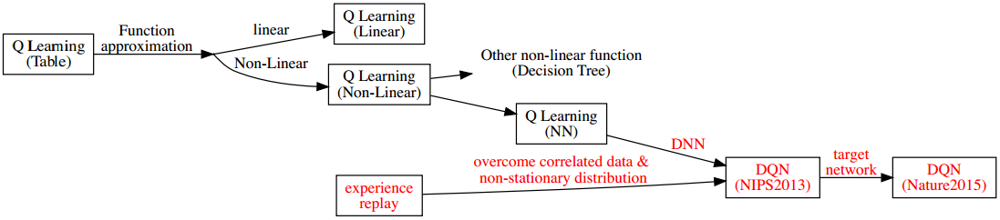
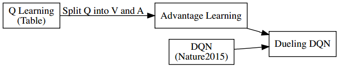
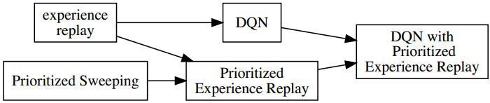
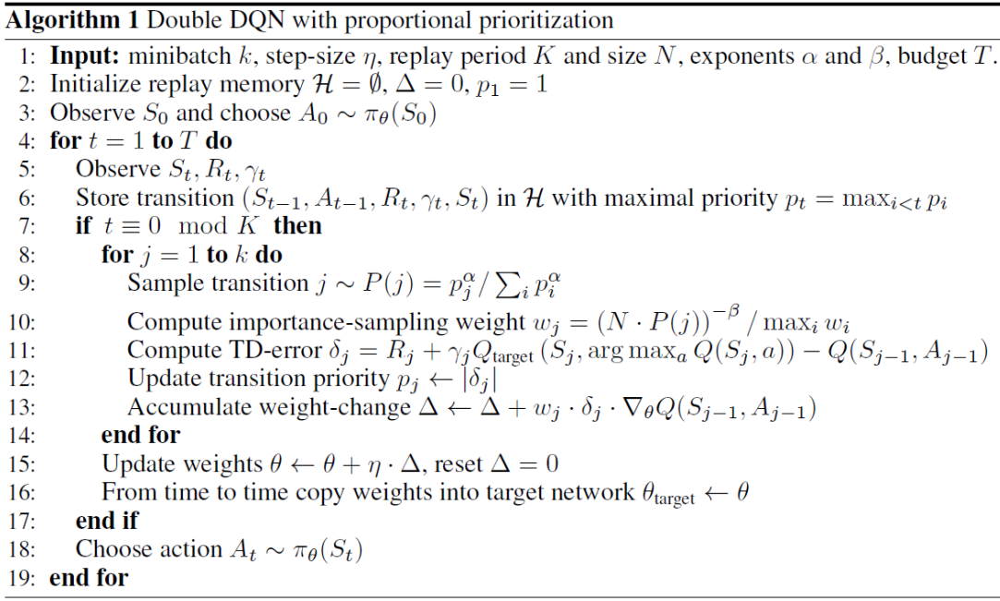
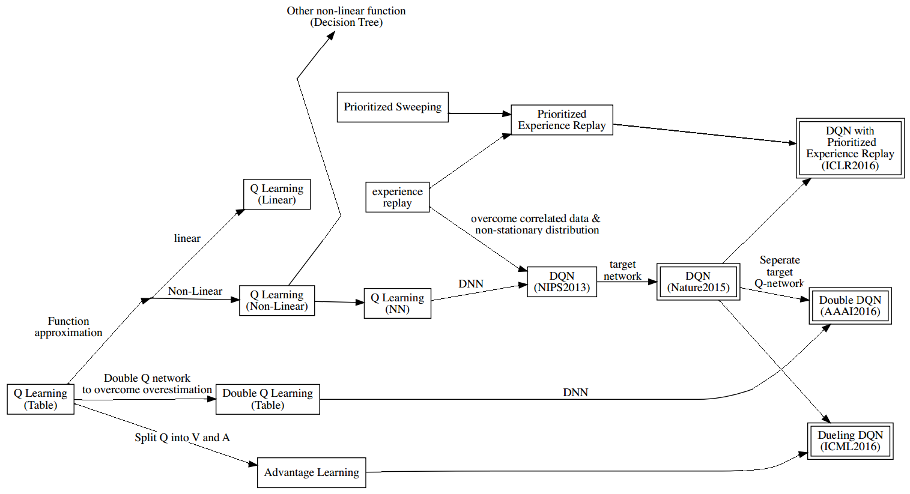
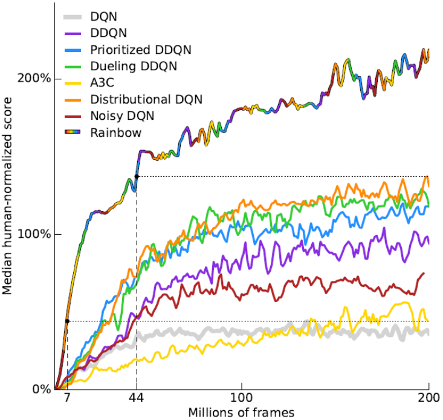
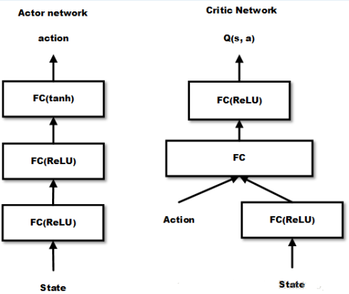

# 深度强化学习

* [返回上层目录](../reinforcement-learning.md)
* [本章在学习地图中的位置](#本章在学习地图中的位置)
* [本章简介](#本章简介)
  * [深度强化学习简介](#深度强化学习简介)
  * [讲解流程](#讲解流程)
* [Value-based DRL](#Value-based DRL)
  * [DQN](#DQN)
  * [Double DQN](#Double DQN)
  * [Dueling DQN](#Dueling DQN)
  * [Prioritized Experience Replay](#Prioritized Experience Replay)
  * [Q learning到各DQN变体的演变](#Q learning到各DQN变体的演变)
  * [Rainbow](#Rainbow)
* [Policy-based DRL](#Policy-based DRL)
  * [DPG](#DPG)
  * [DDPG](#DDPG)
  * [A3C](#A3C)
  * [A2C](#A2C)
  * [策略梯度到基于策略DRL的演化](#策略梯度到基于策略DRL的演化)
* [Trust Region based DRL](Trust Region based DRL)
  * [简要介绍](#简要介绍)
  * [一些基础](#一些基础)
  * [TRPO](#TRPO)
  * [PPO](#PPO)
  * [其他信赖域算法](#其他信赖域算法)

# 本章在学习地图中的位置

# 本章简介

## 深度强化学习简介

* 深度学习+强化学习=深度强化学习

* 使用深度神经网络作为强化学习的函数近似器

  * 函数近似器：从状态到值函数的映射关系
  * 函数近似器：从状态到策略的映射关系

* 深度学习本质上是一种表示学习，它负责将原始数据表达为和问题相关的特征

* 例：flappybird

  * 图像输入：DRL

    不要迷信深度强化学习，深度学习适合的场景为输入特征和真实特征相距比较远的情况下

  * 坐标输入：RL

    如果是坐标输入的话，那就不需要深度强化学习，强化学习就好

## 讲解流程

* 基于值函数：从DQN到Rainbow
* 基于策略
  * 策略梯度框架
  * 信赖域优化

本节课会大量引用文献。每说一个问题，就会把其最原始的paper展现给大家。为了方便大家的文献阅读，尽量使用和原文类似的英文表达。

# Value-based DRL

## DQN

基于值函数的深度强化学习。这里讲基于值函数的方法是如何拓展到深度强化学习的。

深度强化学习第一个工作，也是最具有代表性的工作，也是深度强化学习第一个引入中国的工作，就是DQN。

DQN有两个版本，一个是在NIPS2013，一个是在Nature2015上，都是DeepMind做的。

* Playing Atari with Deep Reinforcement Learning (NIPS2013) 
* Human-level control through deep reinforcement learning (Nature2015) 
* DQN是非常重要的工作，创新点在于真正从实际意义上，给大家证明了一件事，重要意义在于：
  * 以前做RL的人觉得：不用函数近似无法解决大规模问题，用函数近似训练又不稳定，总是不能找到平衡。DQN是第一个告诉人们，能够通过深度神经网络做函数近似。
  * DQN首次证明了能够通过原始像素点（raw pixels）作为输入就能解决游戏问题
  * 最关键的是，DQN对所有游戏通用。大部分游戏只需要微调一下奖励函数的形式，其他的比如输入都不用改，就可以把游戏打好。打Atari游戏并不是很难的工作，加入一些规则，用传统的方法甚至可以比DQN打得更好。DQN最关键的一点就是不需要你做人为的设计规则，来一个游戏就能打一个游戏，甚至连模型都不用调，只需要重新训练一遍就可以了，DQN最重要的工作就在于这一点。

**DQN的关键特点**

* Q learning + DNN
* Experience Replay
* Target Network

* 一开始学习**Q学习**的时候，它是一个基于表格的方法

* 后来我们学了一个基于**函数近似**的方法

  * 函数近似有两种，一种是线性的
  * 另一种是**非线性**的
    * 非线性的也有其他的方法，比如决策树等等
    * 最关键的是之前所提到的，用**神经网络**做函数近似

* **深度神经网络DQN(NIPS2013)**

  * 怎么解决训练的问题呢？引入了**Experience Replay**，这是经验回放。经验回放是什么东西？它是在电脑里开辟内存存储区，比如就是个矩阵或者队列等等。开辟好存储区，然后每次和环境交互的时候，会产生一些transition，指的是状态，动作到后继状态等状态的一次跳转，把这些transition存到存储区里面，然后每次训练的时候，会对存储区做均匀的采样，用所采样的样本去训练。它有什么好处？最大的好处是，强化学习有个关键的点在于，训练数据的样本之间有高度的相关性，比如你和某一个人下棋下了一个小时，那么这个期间采样的所有数据都是和这个人下棋，数据之间其实是不满足独立同分布的，导致训练过程会朝着和这个人对弈的结果去收敛。后果就是，当和另一个人下棋，立马就完蛋了。所以，为了打破数据的相关性，就把数据先存起来，然后再去回放，随机抽取。，这样就不会只是某个人的了，避免了完全跟随某个人的风格。可能大家觉得这个思路比较简单，但里面隐藏了比较深的因素：如果把存的样本再去回放，其实必定对应着off-policy离策略的学习方法，原因是所存的样本对应的策略已经是过去的策略了，而参数的目标是求现在参数的策略，而存的样本是过去那套参数的策略，所以训练的样本和实际更新的网络，必定是离策略的。在离策略的情况下，选择的Experience Replay方法为什么会和DQN去结合，和Q学习结合，而不是和SARSA结合，最大的原因是在于它一定只能用off-policy的方法去做，而off-policy方法如果是TD(0)的话，是不需要重要性采样这个因子的，所以可以很完美的结合。

* **深度神经网络DQN(Nature2015)**

  这里又加了一个改动，加了一个**target nerwork**，这个是什么东西，下面结合算法讲解。就是在构建TD目标值的时候，不要用现在的这个Q去构建目标值，因为现在这个Q函数一直处于更新的状态，一直在波动，如果目标值也随之波动，会导致训练很不稳定，所以它搞了一个目标网络，专门负责构建TD目标值。而目标网络怎么去更新呢？就是现在更新的网络每更新100步了，然后把现在这个网络拷贝到目标网络，然后这个目标网络在下个100步中保持不变，一直作为Q网络更新的指导（TD目标值），然后再100步再去更新。

**算法：deep Q-learning with experience relay**

这个算法

* 是Q学习，带ε的贪婪行为策略。
* 以一阶的ε策略选一个最大的
* 然后执行动作后就可以和环境进行交互，得到下一个奖励值和下一个状态。
  * 这里还对状态做了一个预处理，把预处理后的图像做一个状态
* transition对应t时刻的状态和动作和奖励，然后再跳转到下一个状态，这叫一个transition。
* 把这个transition存到memory里面，
* DNQ对应两部份，第一个部分就是从此往前，对应一个交互过程，就是agent用行为策略和environment进行交互。接下来就是学习。
* 怎么更新呢？并不是采用transition更新，而是从memory里面采样一个batch
* 然后首先更新TD目标值
  * 如果后继状态是终止状态，那么奖励就是该状态的即时奖励
  * 否则就是奖励加上Q学习里面的目标值，这个目标值用的是一个目标$\hat{Q}$网络，这个$\hat{Q}$网络和前面更新的Q网络一样又不一样，参数不一样，用目标Q网络更新的会更缓慢一点，因为要用比较稳定的网络构建目标值。
* 函数近似的本质，就是用输入拟合一个目标值，然后最小化均方误差，用梯度下降的方式，去更新函数近似中的参数。
* 然后每隔C步把目标网络更新一遍。

这就是DQN，最重要的是这俩个技术：Experience Replay和target nerwork。这两个技术真正让DQN运转起来了。很多人都会想到有了深度学习和强化学习，我可以把它结合在一起，但是能做大训练稳定的，只有DQN，这是DeepMind做的最大的贡献。

下面说两个DQN的拓展，大家也基本都会去用，因为被证明在一般意义上，都会比DQN要好。

## Double DQN

* **把Double Q学习和DQN结合，就是Double DQN**

* Deep Reinforcement Learning with Double Q-learning (AAAI2016) 

* Q学习中存在**过估计**（Q学习本身存在的缺陷）

  * Q学习中的TD目标值$r+\gamma \mathop{\text{max}}_aQ(s',a)$中**存在max操作**。
    
    如果Q是很精确的情况下，max没什么问题，但关键Q是一个估计值，就会存在噪声，取max会把噪声大的部分取到，就会引入正向偏差。
    
  * 这会引入一个**正向的偏差**

    例子：对于状态s下，如果对于所有的a，真实的q(s,a)均为0，但是估计值由于不精确，会导致有些大于0，有些小于0。虽然平均值接近真实值。但对估计值取最大，就会选择最大的噪声值，导致某一个动作被凸显出来，会引入一个正向的偏差。

  * 因此**建模两个Q网络**，一个用于选动作，一个用于评估动作
  $$
    r+\gamma Q^B(s',\text{arg }\mathop{\text{max}}_aQ^A(s',a))
  $$
    这样就会有有一些抵消，可以减缓这个过程，比如接着上面的例子，有些Q噪声虽然大于0，沿着大于零选了动作，比如a1被估计的大于0且是最大，则根据$Q^A$网络，$a_1$就被选择，但是对于另外一个Q网络$Q^B$来评估它的时候，则对于$a_1$的评估可能是小于0的，因为$Q^B$并不存在max操作，相互会抵消，则不存在过估计。

**Double DQN算法：**

继续将上面的图往外扩展，DQN结合Double Q Learning，就得到了Double DQN。

注意在实现的时候，之前提到DQN里有一个target网络，有一个更新的网络。既然DQN本身就有两个网络，那再Double DQN中有一个最简单的方法，把target网络也用来更新，则直接就构成了Double DQN。之前DQN中的target网络是用现在的网络去拷贝到target网络，现在就不拷贝了，各有各的学习方法和学习参数，然后交替更新，你更新我，我更新你，所以在Double DQN实现的时候，对原来的DQN改动的很小。因为你DQN本身也建模了两个Q网络，现在Double DQN也建模了两个Q网络。

下面给的算法片段，并不是Double DQN，而是Double Q学习，用的还是表格法。但是把里面的更新公式，换成梯度下降的更新公式，就可以直接得到Double DQN。

## Dueling DQN

* Dueling Network Architectures for Deep Reinforcement (ICML2016) 
* 核心是：将Q函数分解成V函数和优势(Advantage)函数

* 上图中的第一幅图是DQN，通过卷积层，将输入变成Q值

* 上图中的第二幅图是Dueling DQN，将输出分成了两部分：

  * 预测V值，即预测每个状态的V函数
  * 预测每个状态的每个动作下的优势函数

  把这两者结合起来，变成一个Q，更新的时候还是和DQN一样，构建一个TD目标值去更新Q。主要是在结构上，做了这么一个拆分

这样子有什么好处？

优势是：

* 对于很多状态并不需要估计每个动作的值，增加了V函数的学习机会

  Q函数其实比V函数多一个维度，多一个动作的维度，一旦多一个维度，这个量级就已经不是一个量级了。假设总共有10个状态，有10个动作，当你采样时，每个状态只采样了2个动作，则更新Q的时候，每个状态只更新了2个，即只有2个Q会更新的比较好，其他8个Q都更新的不是很好，但用DQN的话，每个Q之间都是分离的，因为每一个Q会对应每一个输出，但这样会把它强行归纳到一个V函数，所以不管那一次采样到什么动作，对应的状态至少都是一样的，所以会大大增加V函数学习的机会。

* V函数的泛化性能好，当有新动作加入时，并不需要重新学习

  对于DQN，要加入一个新动作，q,s,a都需要从初始化开始重新学习。但如果用Dueling DQN结构的方式，就会从V做一个baseline（基准线）去学习。这样学习起来会非常的简单。

  在本节开头的那篇paper中，V函数学了路径的整体趋势，优势函数Advantage就学了每一个动作导致预测轨迹的改变量，看上去比较直观。

* 减少了Q函数由于状态和动作维度差异导致的噪声和突变

上图的解释：

* 在Q Learning中，把Q分解为V函数和A优势函数，做成Advantage Learning
* 然后结合DQN，得到Dueling DQN

## Prioritized Experience Replay 

之前的Double DQN和Dueling DQN都是对DQN的结构，去做一些改变。

既然提了Experience Replay，那能不能把把原来的均匀采样换一种方式，即把Experience Replay做优化？

* Prioritized Experience Replay (ICLR 2016) 

  在2016年这个会议上，提出了一个优先级的经验回放

* DQN算法的一个重要改进是Experience Replay ，训练时从Memory中均匀采样 

* 而Prioritized Experience Replay就是维护了一个带优先级的Experience Replay采样

  * 不同的Experience的权重不同 

    在一些比较复杂的环境里，和环境进行交互，有一些很重要的样本，很难去采样到。好不容易采样到一次，则希望这次的采样能带来更多的反馈。就比如好不容易你做成了一件事，你不能把这种事和你平时的吃饭走路搞成一个等级。这里也是一样的，对每一个Experience打不同的权重

  * 用TD误差去衡量权重

    TD误差越大，表示目前来说，解决的不是很好，而这个不太好的样本，我就认为是很重要的，那就给它更高的权重。对于权重越大的，就先把它采样出来

  * 需要使用sum-tree以及binary heap data structure去实现 

    由于这个不是均匀采样了，所以为了降低复杂度，实现起来需要用相应的数据结构去实现

  * 新的transition的TD误差会被设置为最大 

    每一次为了保证每一个transition都能被更新，所以对于新发生的transition，由于都还没有拿来更新，比如DQN里面，每次得到transition都是先存到memory，还没有计算TD误差。这个时候怎么设置TD误差呢？会把它设为最大，以保证新的transition至少会被更新一次

  * 类似于DP中的优先清理

    对于不同的状态给予了不同的优先级

* DQN中的Experience Replay使得更新不受限于实际经验的**顺序**，即尽量打破相邻经验之间的相关性，更新和实际环境交互的顺序没有关系。Prioritized Experience Replay使得更新不受限于实际经验的**频率**，如果是均匀采样，按道理，和环境交互的频率越多，在memory中存的越多，均匀采样的环境更新的也就越多。而现在并不是交互的频率越多，更新就越多，而是TD误差越大，更新就越多。所以说和频率就没有关系了。

具体使用时会存在一些问题

* TD误差对噪声非常敏感

* TD误差小的transition长时间不更新

  拿到一个transition，其TD误差为零，就把它存到优先级的最后面，那么这个transition存到最后面有可能就一辈子不更新了。由于参数是发生变化的，有可能这个transition是非常有用的，但是你已经把这个transition存到了最后面，你就永远都拿不出来了。所以这也是一个弊端。

* 过分关注TD误差大的transition，导致丧失了样本多样性

  在特殊情况下（机器人摔倒了），可能会有一个TD误差非常大，你反复拿这个TD误差非常大的transition去更新，导致其他的没有去更新，会导致过拟合，会对这个TD误差特别大的做得很好，其他的都做得不是很好。

* 使用某种分布采样了Experience，会引入Bias 

  在估计某个变量的时候，用了一种特殊的采样方法去采，其实就改变了采样的分布，就需要重要性采样来纠正。

解决方法

* 两种变体：$p_i=|\delta_i|+\epsilon$或者$p_i=1 / rank(i)$

  把优先级不再用TD误差去衡量，用另外两种去解决前三个问题。

  第一个方法就是加了噪声，$|\delta_i|$是TD误差的绝对值，在其上加了一个噪声，作为优先级去存到memory的队列里面。

  第二个方法是用排序，对每一个TD误差去排序，排序排到最高（第一个），对排序的倒数作为优先级，这样的话，即使误差再大，那也就是第一名第二名，通过排序，那优先级也不过是1/1, 1/2，这样抗干扰就比较强。

* 加入重要性采样来消除Bias

  这个来解决上面的第四个（最后一个）问题。在估计某个变量的时候，用了一种特殊的采样方法去采，其实就改变了采样的分布，就需要重要性采样来纠正。

上图说明：DQN结合带优先级的经验回放（由之前动态规划中的优先清理得到），就得到了带优先级经验回放的DQN。

下面是带优先级经验回放的DQN算法片段，和DQN差不多

* for中第一行，p其实是每一个transition的优先级，然后可以算出每一个transition的概率$P(j)$，然后通过这个概率取采样
* 采样完后，计算重要性采样的权重wj，进行修正
* 计算TD误差$\delta_j$，这里还是Double DQN的形式，用了两个Q网络，里面的Q网络选择动作，外面的Q网络评估这个动作
* 用TD误差值$\delta_j$去更新transition的优先级$p_j$。这里是直接更新，你也可以用上面的两种去抵抗上小节说的优先级经验回放存在的一些问题（如噪声干扰等）
* 实际是batch批量更新，不是每一次都更新

## Q learning到各DQN变体的演变

这里对上面说的各DQN方法的总结。主要是说怎么由基于表格的Q学习逐步的导出上面所说的各种DQN

## Rainbow

Rainbow就是把各种DQN变种融合到一起的算法。

* 提出Rainbow的文献：Rainbow: Combining Improvements in Deep Reinforcement Learning

* 集合了多种 DQN 的变体

  * DQN

  * Double DQN

  * Dueling DQN

  * Prioritized Experience Replay

  * NoiseNet: (Noisy Networks for Exploration, AAAI2018)

    这里没讲，其实是对探索的改善。之前讲的各DQN和Q学习一样，其探索是带ε的贪婪策略，是人为设计的，人为加了一个带ε的噪声扰动。这里呢，就是说，这个扰动也可以去用神经网络学习。

  * Distributional RL: (A Distributional Perspective on Reinforcement Learning, ICML2017) 

    把强化学习通过概率的形式去解释。以前是输出每一个输出，每一个动作，每一个动作对应的Q函数，现在不输出Q函数了，而是输出Q函数的分布。从贝叶斯的观点来说，每一个东西都是随机的，都有一个分布，则对Q值，认为也是一个分布，而不是一个值

**Rainbow和其他DQN变种的对比**

Rainbow是上面这条线，明显比别的DQN变种都很强。

# Policy-based DRL

基于策略的深度强化学习

上节课介绍了策略梯度算法和A2C算法，今天来介绍DPG和DDPG的算法，这两个算法是自成一派，和前面的算法都不太一样。最大不同就是能用于高维和连续动作空间。

## DPG

确定性策略梯度算法。DPG并不是一个深度强化学习算法，讲它的原因是为了引出DDPG（深度确定性策略梯度算法）。

* Deterministic Policy Gradient Algorithms (ICML2014)

* 将策略梯度定理用到了高维和连续动作

* 常规的策略梯度方法无法用到高维和连续动作空间

  * 连续动作无法使用概率分布输出的形式

    因为常规的策略梯度（PG）算法是输出动作的概率分布，但对连续动作或者高维动作就无法计算了，比如$10^{100}$维的动作，就要构建$10^{100}$维的概率输出，显然不可行。如果是连续动作，那就是维度无穷大。

  * 高维动作空间中采样费时

  * 随机策略梯度是通过采样的方式估算策略梯度, 需要在状态空间和动作空间内采样
    $$
    \bigtriangledown_{\pi_{\theta}}J(\theta)=\int_S\int_A\rho^{\pi_{\theta}}(s)\bigtriangledown_{\theta}\text{log}\pi_{\theta}(a|s)Q^{\pi_{\theta}}(s,a)\ da\cdot ds
    $$
  
* 直接采用确定性策略输出：$a=\pi(s)$
  
* 由此诞生几个问题：

  * 确定性策略情况下如何求策略梯度？
  * 如何探索？

* 过去一直认为无模型情况下确定性策略梯度不存在

* DPG证明了确定性策略梯度定理的存在, 建立了它跟Q函数梯度的关系
  $$
  \bigtriangledown_{\pi_{\theta}}J(\theta)=\int_S\rho^{\pi_{\theta}}(s)\bigtriangledown_{\theta}\pi_{\theta}\bigtriangledown_aQ^{\pi_{\theta}}(s,a)|_{a=\pi(\theta)}ds
  $$
  
* 只需要对状态S进行积分

* 使用Off-policy的方式探索并更新（需要重要性采样）

## DDPG

* Continuous Control with Deep Reinforcement Learning (ICRL2016)
* 结合了DQN和DPG
* 使用了DQN的两种技术：Experience Replay和Target Network
* 利用随机过程产生探索性动作

**建模方式**

**DDPG算法**

* 在执行过程中有一个随机过程，用各种随机游走的方式，去建模这个噪声。用随机过程在真正的target动作下，加一个噪声去选择动作，做环境交互。
* 维护了target network。不仅在critic network，也在actor network也用了target network。在构建目标值的时候，用target actor选动作，用target Q去评价它的目标，这样可以使其更稳定。
* target会更新的更慢一些，因为加了延迟因子τ

## A3C

A3C: Asynchronous Advantage Actor-Critic

和A2C比较相似，唯一的区别在于一个是异步更新，一个是同步更新。

* [*Asynchronous Methods for Deep Reinforcement Learning*](https://arxiv.org/abs/1602.01783) (ICML2016)

  A3C来源于这篇文章，但这篇文章其实本质上不是讲A3C，讲的是异步更新的方法。讲了一套异步更新的方法，包括异步更新的DQN，异步更新的SARSA，异步更新的Actor Critic

  这一套算法中最著名的异步更新算法就是A3C（异步更新的Actor Critic）

* Online的算法和DNN结合后不稳定 (因为有样本关联性)

  DQN引入经验回放打破关联性

  但我们能不能不用经验回放去做呢？用一些on-policy的方法去做。因为有了经验回放，就限制了必须用离策略形式更新，我们也想用在策略的方法，怎么办？就提出了下列方法：

* 通过创建多个agent在多个环境（不同进程）执行异步学习构建batch

  * 来自不同环境的样本无相关性

  * 不依赖于GPU和大型分布式系统

    直接利用了电脑的多进程就可以了，比较平民化的实践方式

  * 不同线程使用了不同的探索策略，增加了探索量

每一个进程更新完，就马上把收集到的梯度推送到主进程，让主进程去更新网络。这更多的是一个工程的实现方法。A3C可以拓展到超大规模的强化学习，有好多台服务器，每台服务器开一个进程去更新，然后将参数的梯度用异步通信的方式推送到参数服务器上

## A2C

* Openai Blog(https://blog.openai.com/baselines-acktr-a2c/)

* 改异步为同步, 能够更好地利用GPU

  对于单机版本，就改成了同步，因为异步没什么额外好处。同步是指所有进程同步等待，变成一个batch去更新

  这样的好处是可以利用GPU加速

* 在batch_size较大时效果好

## 策略梯度到基于策略DRL的演化

# Trust Region based DRL

基于深度强化学习的信赖域优化，这个其实是在基于策略的深度强化学习里面占据主要部分。主要是解决基于策略的深度强化学习中步长收敛的问题。但这里把它单独拉出来作为一条线，主要是因为现在很多好的算法和方法都是用了这样的方法，所以单独拉出来详细讲解。

信赖域的理论是相当复杂的，这里讲的只是凤毛麟角。如果你的优化理论学得不好，没有一个完备的优化理论体系，这里无论怎么讲，你都是不理解的。所以这里干脆只讲它到底做了什么事，为什么要做这个事，它到底有什么用。至于它到底怎么做的，那就要恶补很多知识才能看懂。

## 简要介绍

之前只是推导了梯度更新的方向，但是有个关键点就是它的步长。这个非常非常关键，和值函数方法是不一样的。值函数方法本质上还是监督学习的方法，还是去构造了一些样本，输入是状态，输出是TD target，即用TD目标值的样本去更新，就是说，假设这一步迈大了，则Q值会比以前更小，就会把Q拉回来。但是策略梯度情况下，就很容易这一步迈大了之后，一更新，就把整个策略变掉了。而在Q学习中，只是把这个状态下的Q函数给变了，影响不是很大，是慢慢来的，是交替进行的，即更新一次Q，就做一次策略提升，哪怕这步没走好，影响也不是很大。但是策略梯度的问题在于，一旦把策略变掉了，后面的采样轨迹就完完全全发生了变化。

举个例子理解：走迷宫，这个迷宫相当于二叉树，一次改变，差别就很大。

策略梯度算法的更新步长很重要

* 步长太小，导致更新效率低下
* 步长太大，导致参数更新的策略比上次更差，通过更差的策略采样得到的样本更差，导致学习再次更新的参数会更差，最终崩溃

如何选择一个合适的步长，使得每次更新得到的新策略所实现的回报值单调不减：可限定一个信赖域，在信赖域中更新，会保证得到的新策略的表现不会比以前更差，即至少单调不减。

* 信赖域(Trust Region)方法指在该区域内更新，策略所实现的回报值单调不减

## 一些基础

下面的内容其实已经超出这门课的范围了。

* 自然梯度：Natural Gradient Works Efciently in Learning, 1998

  * 在黎曼空间（神经网络参数空间）里面，它不是正交空间，最快的下降方向不是梯度方向，而是自然梯度方向$G^{-1}(\theta)J(\theta)$
    
  * 只有当坐标系统正交，才退化成欧式空间
  
* 神经网络中的参数空间是黎曼空间
  
* 其中G为Reimannian metric tensor
  
* 统计问题中， G可以用Hessian矩阵去计算 。类似于牛顿法
  
* 保守策略迭代，CPI: Approximately Optimal Approximate Reinforcement Learning, 2002

  * 给出策略性能增长的条件
    * 策略更新后的所有优势函数非负，就能保证新策略不会比老策略差
    * 使用混合更新的方式更新策略 

## TRPO

在信赖域优化里，一个重要的工作就是TRPO，就是结合了上节所说的自然梯度和CPI，以及信赖域方法，把三者做结合得到的，非常重要。有了这个更算法，策略梯度在很多复杂的（尤其是机器人控制）问题上才真正表现得比较好。

有了TRPO，就可以保证策略梯度的更新比较稳定，但实现起来很复杂，尤其是还要求共轭梯度（每次更新还要迭代求梯度）。

* Trust Region Policy Optimization, ICML2015

* 以CPI为基础，推导出策略更新后性能的下界, 通过优化**下界**优化原函数
  
* 实际操作时用KL散度作为约束

  优化下界比较难，就把下界变成了KL散度

* 求解带约束的优化问题时，利用自然梯度

* 实际求解是利用了共轭梯度+线性搜索的方法, 避免求自然梯度

## PPO

真正在实践当中用到信赖域方法，这里推荐PPO

OpenAI做的打dota的也是用PPO实现的。自从OpenAI推出了PPO，整个OpenAI都会把它作为一个默认的算法。基本上什么算法都会用PPO去做。主要原始是PPO结合了策略梯度的一些优点，学习起来又比较稳定，执行起来也比较方便，速度也比较快，在大规模的情况下实现起来特别好。

* Proximal Policy Optimization Algorithms, 2017

* Openai blog(https://blog.openai.com/openai-baselines-ppo/)

  具体参考此博客

* TRPO太复杂，普通策略梯度（PG）效果又不好

* PPO本质上是TRPO的简化版

* 移除了KL惩罚项和交替更新

  把TRPO的KL约束和交替更新去掉，搞成一个等价的方式，写到LOSS函数里面，加了一个正则项。则更新方式就和以前一模一样了，无非就是在Loss函数里加一项

* 由于性能好，且容易实现，已经成为默认的OPENAI算法

## 其他信赖域算法

信赖域方法还有很多很多，下面列几个：

* ACKTR: Scalable trust-region method for deep reinforcement learning using Kronecker-factored approximation
* ACER: Sample Efcient Actor-Critic with Experience Replay
* GAE: High-Dimensional Continuous Control Using Generalized Advantage Estimation
* … 

# 参考资料

* [《强化学习理论与实践》第九章-深度强化学习](http://www.shenlanxueyuan.com/my/course/96)

本章内容是该课程这节课的笔记。
