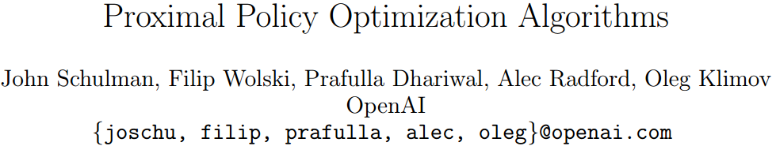
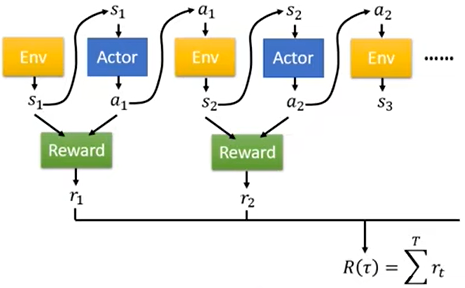
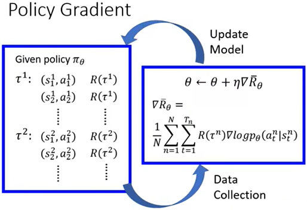
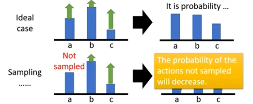
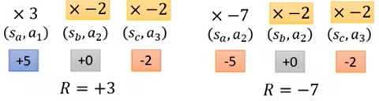
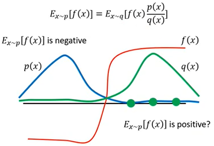
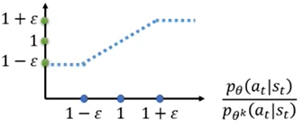
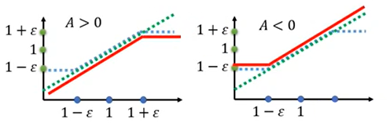

# PPO近端策略优化

- [返回上层目录](../proximal-policy-optimization.md)
- [PPO原理推导](#PPO原理推导)
- [Actor&Critic网络架构](#Actor&Critic网络架构)
- [损失函数](#损失函数)




PDF: [Proximal Policy Optimization Algorithms](https://arxiv.org/abs/1707.06347)

OpenAI Blog: [Proximal Policy Optimization](https://openai.com/blog/openai-baselines-ppo/)和[Proximal Policy Optimization](https://spinningup.openai.com/en/latest/algorithms/ppo.html#id3)

GitHub: [openai/baselines/ppo2](https://github.com/openai/baselines/tree/master/baselines/ppo2)


DeepMind先在2017年7月月初发了PPO的paper，但是他们参考了OpenAI的一个资料，然后OpenAI发现竟然被DeepMind抢先发了，于是OpenAI也就跟着发了PPO。

# PPO原理推导

## 策略梯度PolicyGradient

PPO是策略梯度的一个变形。

强化学习中的行为actor的目的，就是为了最大化一场游戏中它的所有奖励reward，即最大化
$$
R=\sum_{t=1}^Tr_t
$$


 如上图所示，每一场游戏中的所有环境和行为串起来就是一个轨迹trajectory，即
$$
\tau = \{s_1,a_1,s_2,a_2,\dots,s_T,a_T\}
$$
一个特定的轨迹trajectory出现的几率为：
$$
\begin{aligned}
p_{\theta}(\tau)&=p(s_1)p_{\theta}(a_1|s_1)p(s_2|s_1,a_1)p_{\theta}(a_2|s_2)p(s_3|s_2,a_2)\dots\\
&=p(s_1)\mathop{\Pi}\limits_{t=1}^T p_{\theta}(a_t|s_t)p(s_{t+1}|s_t,a_t)
\end{aligned}
$$
其中，$\theta$为Actor的模型参数。

然后我们的目标就是，调整Actor模型参数$\theta$，使得$R(\tau)$的值最大化。

注意，$R(\tau)$是个变量，其与Actor模型参数$\theta$有关。

所以我们最大化的应该是其期望，即
$$
\bar{R}_{\theta}=\sum_{\tau}R(\tau)p_{\theta}(\tau)=E_{\tau\sim p_{(\theta)}(\tau)}[R(\tau)]
$$
那怎么最大化奖励的期望值呢？那就是用对$\bar{R}_{\theta}$的梯度上升法（即对损失函数的梯度下降法）来最大化其值。
$$
\begin{aligned}
\frac{\partial \bar{R}}{\partial \theta}&=
\nabla\bar{R}_{\theta}\\
&=\sum_{\tau}R(\tau)\nabla p_{\theta}(\tau)\\
&=\sum_{\tau}R(\tau)p_{\theta}(\tau)\frac{\nabla p_{\theta}(\tau)}{p_{\theta}(\tau)}\\
&=\sum_{\tau}R(\tau)p_{\theta}(\tau)\nabla\log p_{\theta}(\tau)\\
&=\boxed{E_{\tau\sim p_{\theta}(\tau)}\left[R(\tau)\nabla\log p_{\theta}(\tau)\right]}\\
&\approx \frac{1}{N}\sum_{n=1}^NR(\tau^n)\nabla\log p_{\theta}(\tau^n)\\
&= \frac{1}{N}\sum_{n=1}^N\sum_{t=1}^{T_n}R(\tau^n)\nabla\log p_{\theta}(a_t^n|s_t^n)\\
\end{aligned}
$$
基于奖励对参数$\theta$的梯度值，可以更新参数$\theta$，来让奖励变得更大：
$$
\theta=\theta+\text{lr}\cdot \frac{\partial \bar{R}}{\partial \theta}
$$
由于我们使用梯度上升法的目标就是提升$\bar{R}_{\theta}$，那么，如果$R(\tau^n)$为正，则通过更新参数$\theta$，自然会使得该条轨迹中的每一个动作的出现几率变大，即使得$p_{\theta}(a_t^n|s_t^n)$更大，从而让$\bar{R}_{\theta}$变得更大、

具体的做法如下图所示。



实际在代码中怎么做呢？xxxxxxxxxxx

**下面通过两个技巧来加入优势函数**

**技巧1：给奖励$R(\tau^n)$添加baseline**，来使得奖励有正有负，从而使得未出现过的动作不至于没有机会出现。



因为有的游戏里的所有奖励都是正的，即便不是好的结果，奖励也是正的，只不过正的比较小，比如，不及格是50分，及格是60分，满分100分，最低分也只是0分，而不会有负分出现。这样就会让所有的行为的概率都增加，但是对于未出现的行为概率，就会减小，但是未出现的行为并不一定就是不好的。
$$
\begin{aligned}
\frac{\partial \bar{R}}{\partial \theta}&=
\nabla\bar{R}_{\theta}\\
&= \frac{1}{N}\sum_{n=1}^N\sum_{t=1}^{T_n}\left(R(\tau^n)-b\right)\nabla\log p_{\theta}(a_t^n|s_t^n)\\
\end{aligned}
$$
那$b$怎么设呢？可以选择把所有的$R(\tau^n)$取平均值，然后作为$b$的值，即
$$
b\approx E[R(\tau)]
$$
技巧2：将每个动作的全局奖励累积变成从该动作开始的奖励累积。这样更合理一些。



如上图所示，左图中第二个动作对应的奖励就不应该是全局奖励3，而应该是从其之后的奖励的累积，即$0+(-2)=-2$。右图中第二个动作对应的奖励就不应该是全局奖励-7，而应该是从其之后的奖励的累积，即$0+(-2)=-2$。这样会在有限的和环境互动的次数中，学习地更快。

随意，对奖励期望的关于$\theta$的梯度的公式可以改为：
$$
\begin{aligned}
\frac{\partial \bar{R}}{\partial \theta}&=
\nabla\bar{R}_{\theta}\\
&= \frac{1}{N}\sum_{n=1}^N\sum_{t=1}^{T_n}\left(R(\tau^n)-b\right)\nabla\log p_{\theta}(a_t^n|s_t^n)\\
&= \frac{1}{N}\sum_{n=1}^N\sum_{t=1}^{T_n}\left(\sum_{t'=t}^{T_n}r_{t'}^n-b\right)\nabla\log p_{\theta}(a_t^n|s_t^n)\\
\end{aligned}
$$
然后更进一步，将来自未来的奖励做一个折扣$\gamma$，因为越往后的奖励和当前步的行为的关系越小。
$$
= \frac{1}{N}\sum_{n=1}^N\sum_{t=1}^{T_n}\left(\sum_{t'=t}^{T_n}\gamma^{t'-t}r_{t'}^n-b\right)\nabla\log p_{\theta}(a_t^n|s_t^n)
$$
上式中的$b$其实可以是和当前步的state有关的，其实就是当前步的state的值，即$V(s_t)$。
$$
= \frac{1}{N}\sum_{n=1}^N\sum_{t=1}^{T_n}\left(\sum_{t'=t}^{T_n}\gamma^{t'-t}r_{t'}^n-V(s_t)\right)\nabla\log p_{\theta}(a_t^n|s_t^n)
$$
然后我们把上式中的括号中的项可以合起来统称为优势函数$A^{\theta}(s_t,a_t)$。之所以带$\theta$是因为这个值是和行为Actor相关的，Actor决定了这个值（即奖励）。

优势函数的意义是，在当前state下所选择的action，相比其他的actoin，它有多好，是个相对值。
$$
= \frac{1}{N}\sum_{n=1}^N\sum_{t=1}^{T_n}\text{Adv}\nabla\log p_{\theta}(a_t^n|s_t^n)\\
= E_{(s_t,a_t)\sim \pi_{\theta}}\left[A^{\theta}(s_t,a_t)\nabla\log p_{\theta}(a_t^n|s_t^n)\right]\\
\text{where} \quad \text{Adv}=\sum_{t'=t}^{T_n}\gamma^{t'-t}r_{t'}^n-V(s_t)
$$

## On-policy变为Off-policy

下面讲策略梯度的一个变形：PPO算法。

**什么是On-policy和Off-policy呢？**

如果我们和环境互动的agent和我们要learn出来的agent是同一个agent的话，就是On-policy，如果不是同一个agent，就是Off-policy。

就是，如果agent是一边和环境互动，一边学习，就是On-policy。如果是在旁边看别人玩，通过看别人玩来学习的话，就是Off-policy。
$$
\begin{aligned}
\frac{\partial \bar{R}}{\partial \theta}&=
\nabla\bar{R}_{\theta}\\
&=\sum_{\tau}R(\tau)\nabla p_{\theta}(\tau)\\
&=\sum_{\tau}R(\tau)p_{\theta}(\tau)\frac{\nabla p_{\theta}(\tau)}{p_{\theta}(\tau)}\\
&=\sum_{\tau}R(\tau)p_{\theta}(\tau)\nabla\log p_{\theta}(\tau)\\
&=\boxed{E_{\tau\sim p_{\theta}(\tau)}\left[R(\tau)\nabla\log p_{\theta}(\tau)\right]}
\end{aligned}
$$
由于在收集数据阶段，我们是用$\pi_{\theta'}$的策略分布来行动的，但是当Actor的旧参数$\theta'$一旦被更新，我们就不得不重新使用更新后的策略$\pi_{\theta}$来采样收集数据了。这样显然效率极差，是不可接受的，相当于接受一个数据就得训练一次。

**On-policy变为Off-policy**

那我们的目标就是，使用基于旧参数$\theta'$的采样来训练更新$\theta$。此时旧模型参数$\theta'$是不变的，所以我们能重复使用旧参数$\theta'$采样的数据，那具体怎么做呢？

为了做到重复使用旧参数$\theta'$采样的数据来训练更新$\theta$，需要用到**重要性采样**的技术。

**重要性采样**

我们想要以概率分布$p$（即新动作参数$\theta$下的动作概率分布）来采样数据
$$
E_{x\sim p}\left[f(x)\right]\approx \frac{1}{N}\sum_{i=1}^Nf(x^i)
$$
但是我们只能从以概率分布$q$（即旧动作参数$\theta’$下的动作概率分布）来采样数据，这样就不能使用上式了，因为上式等号右边的分布是$q$，而不是$p$，结果不等于上式等号左边。所以需要做修正
$$
\begin{aligned}
E_{x\sim p}\left[f(x)\right]&=\int f(x)p(x)dx\\
&=\int f(x)\frac{p(x)}{q(x)}q(x)dx\\
&=E_{x\sim q}\left[f(x)\frac{p(x)}{q(x)}\right]
\end{aligned}
$$
这样就能通过从服从$q$ 分布下的采样的数据得到服从$p$分布的数据采样了。也就是说，只需要乘以一个重要性权重：$\frac{p(x)}{q(x)}$，来修正两个概率分布之间的差异。
$$
E_{x\sim p}\left[f(x)\right]=E_{x\sim q}\left[f(x)\frac{p(x)}{q(x)}\right]
$$
但是实际上$p$和$q$不能差太多，不然会导致一些问题，比如方差过大。

那我们现在分别计算一下$f(x)$和$f(x)\frac{p(x)}{q(x)}$的方差。

方差和平均值的关系为
$$
\text{Var}[X]=E[X^2]-(E[X])^2
$$
则
$$
\begin{aligned}
\text{Var}_{x\sim p}\left[f(x)\right]&=\boxed{E_{x\sim p}\left[f(x)^2\right]-(E_{x\sim p}[f(x)])^2}\\
\text{Var}_{x\sim q}\left[f(x)\frac{p(x)}{q(x)}\right]&=E_{x\sim q}\left[\left(f(x)\frac{p(x)}{q(x)}\right)^2\right]-\left(E_{x\sim q}\left[f(x)\frac{p(x)}{q(x)}\right]\right)^2\\
&=\sum\left[q(x)\left(f(x)\frac{p(x)}{q(x)}\right)^2\right]-(E_{x\sim p}[f(x)])^2\\
&=\sum\left[p(x)\left(f(x)^2\frac{p(x)}{q(x)}\right)\right]-(E_{x\sim p}[f(x)])^2\\
&=\boxed{E_{x\sim p}\left[f(x)^2\frac{p(x)}{q(x)}\right]-(E_{x\sim p}[f(x)])^2}\\
\end{aligned}
$$
对比一下两者方差的差异，很明显，如果$\frac{p(x)}{q(x)}$差异较大，那么，两者的方差差异也会比较大。

为了帮助理解为什么如果$\frac{p(x)}{q(x)}$差异较大，那么两者的方差差异也会比较大，这里举个例子，如下图所示。



其实，$E_{x\sim p}\left[f(x)\right]$是负值，因为在$f(x)$为负值的左侧，$p(x)$的概率密度更大。

但是，如果按照$q(x)$的概率密度来采样，如果只采样少数几个点，那按照$q(x)$的概率密度，大概率会采样在$f(x)$的右边。那么$E_{x\sim p}\left[f(x)\right]=E_{x\sim q}\left[f(x)\frac{p(x)}{q(x)}\right]$的值就为正了，而真实值是负值，所以方差大会导致采样次数少的情况下，采样值和真实值相差很大。

所以， 奖励期望关于参数$\theta$的梯度计算公式可以变为
$$
\begin{aligned}
\frac{\partial \bar{R}}{\partial \theta}&=
\nabla\bar{R}_{\theta}\\
&=E_{\tau\sim p_{\theta}(\tau)}\left[R(\tau)\nabla\log p_{\theta}(\tau)\right]\\
&=E_{\tau\sim p_{\theta'}(\tau)}\left[\frac{p_{\theta}(\tau)}{p_{\theta'}(\tau)}R(\tau)\nabla\log p_{\theta}(\tau)\right]
\end{aligned}
$$
这样就**能从旧参数$\theta'$下的采样数据来更新当前的参数$\theta$了**，就能使用这些数据来训练$\theta$很多次了。

但是问题是，每次训练的时候$\theta$都会变啊，那每次训练完，岂不是$p(\theta)$都要更新。xxxxxxxxxxx
$$
\begin{aligned}
&= E_{(s_t,a_t)\sim \pi_{\theta}}\left[A^{\theta}(s_t,a_t)\nabla\log p_{\theta}(a_t^n|s_t^n)\right]\\
&= E_{(s_t,a_t)\sim \pi_{\theta'}}\left[\frac{p_{\theta}(s_t,a_t)}{p_{\theta'}(s_t,a_t)}A^{\theta'}(s_t,a_t)\nabla\log p_{\theta}(a_t^n|s_t^n)\right]\\
&= E_{(s_t,a_t)\sim \pi_{\theta'}}\left[\frac{p_{\theta}(a_t|s_t)p_{\theta}(s_t)}{p_{\theta'}(a_t|s_t)p_{\theta'}(s_t)}A^{\theta'}(s_t,a_t)\nabla\log p_{\theta}(a_t^n|s_t^n)\right]\\
\end{aligned}
$$
上式中，$p_{\theta}(s_t)$和$p_{\theta'}(s_t)$可以认为是一样的，因为环境的概率和Actor的模型参数$\theta$没关系。所以可以删去
$$
\begin{aligned}
&= E_{(s_t,a_t)\sim \pi_{\theta'}}\left[\frac{p_{\theta}(a_t|s_t)}{p_{\theta'}(a_t|s_t)}A^{\theta'}(s_t,a_t)\nabla\log p_{\theta}(a_t^n|s_t^n)\right]\\
\end{aligned}
$$
根据公式$\nabla f(x)=f(x)\nabla \log f(x)$，可以把上式变为
$$
\begin{aligned}
&= E_{(s_t,a_t)\sim \pi_{\theta'}}\left[\frac{\nabla p_{\theta}(a_t^n|s_t^n)}{p_{\theta'}(a_t|s_t)}A^{\theta'}(s_t,a_t)\right]\\
&= E_{(s_t,a_t)\sim \pi_{\theta'}}\nabla \left[\frac{p_{\theta}(a_t^n|s_t^n)}{p_{\theta'}(a_t|s_t)}A^{\theta'}(s_t,a_t)\right]\\
\end{aligned}
$$
所以，此时我们一直要最大化的目标奖励函数从一开始的
$$
\bar{R}_{\theta}=\sum_{\tau}R(\tau)p_{\theta}(\tau)=E_{\tau\sim p_{(\theta)}(\tau)}[R(\tau)]
$$
变为了
$$
\begin{aligned}
\boxed{J^{\theta'}(\theta)= E_{(s_t,a_t)\sim \pi_{\theta'}}\left[\frac{p_{\theta}(a_t|s_t)}{p_{\theta'}(a_t|s_t)}A^{\theta'}(s_t,a_t)\right]}
\end{aligned}
$$
所以，上式就是我们使用了重要性采样后的作为终极优化目标的奖励函数。

所以，我们现在就可以把On-Policy变为了Off-Policy了。

但是，前提是$p(\theta)$和$p(\theta')$不能差太多，不然方差太大，结果就不好了。所以，如何避免差太多呢？那这就是PPO要做的事情。

## 添加约束

 在介绍PPO算法之前，先介绍其改进来源：TRPO算法的目标函数和约束。
$$
J^{\theta'}_{\text{TRPO}}(\theta)= E_{(s_t,a_t)\sim \pi_{\theta'}}\left[\frac{p_{\theta}(a_t|s_t)}{p_{\theta'}(a_t|s_t)}A^{\theta'}(s_t,a_t)\right]\\
\text{subject to}\quad KL(\theta,\theta')<\delta
$$
TRPO的损失函数不太好求解，因为还存在约束。

注意，上式中的$KL(\theta,\theta')$并不是参数$\theta$本身的KL散度距离，而是两个Actor的输出值的概率分布的KL散度距离。


**PPO算法是对TRPO算法的简化。PPO算法有两个版本**：PPO1和PPO2，而PPO2比较常用。

接下来我们介绍一下两个PPO算法版本的整体流程。

- 初始化策略的参数$\theta^0$

- 在每次的循环中

  - 使用$\theta^K$和环境做交互，来收集训练数据$\{s_t,a_t\}$还有计算优势$A^{\theta^k}(s_t,a_t)$。

  - 通过计算目标函数$J_{\text{PPO}}(\theta)$的梯度，多次更新参数$\theta$

    有两种算法：

    - PPO1算法
      $$
      J_{\text{PPO}}^{\theta^k}(\theta)=J^{\theta^k}(\theta)-\beta KL(\theta,\theta^k)
      $$
      其中，
      $$
      \begin{aligned}
      J^{\theta^k}(\theta)&=E_{(s_t,a_t)\sim \pi_{\theta'}}\left[\frac{p_{\theta}(a_t|s_t)}{p_{\theta'}(a_t|s_t)}A^{\theta'}(s_t,a_t)\right]\\
      &\approx \sum_{(s_t,a_t)}\frac{p_{\theta}(a_t|s_t)}{p_{\theta^k}(a_t|s_t)}A^{\theta^k}(s_t,a_t)
      \end{aligned}
      $$
      自适应的KL散度惩罚项

      - 如果$KL(\theta,\theta^k)>KL_{max}$，则增加$\beta$
      - 如果$KL(\theta,\theta^k)<KL_{min}$，则减小$\beta$

    - PPO2算法
      $$
      J_{\text{PPO}}^{\theta^k}(\theta)\approx \sum_{(s_t,a_t)}\min\left(\frac{p_{\theta}(a_t|s_t)}{p_{\theta^k}(a_t|s_t)}A^{\theta^k}(s_t,a_t),\ clip\left(\frac{p_{\theta}(a_t|s_t)}{p_{\theta^k}(a_t|s_t)},1-\epsilon,1+\epsilon\right)A^{\theta^k}(s_t,a_t)\right)
      $$

PPO1算法是把TRPO的约束加入到了损失函数里，做了一个软约束。

接下来重点看PPO2算法。其目标函数中的clip，即
$$
clip\left(\frac{p_{\theta}(a_t|s_t)}{p_{\theta^k}(a_t|s_t)},1-\epsilon,1+\epsilon\right)
$$
其图像是



 现在考虑到A的正负性，则有如下图所示



那是如何做到不要让两个的概率差距太大的呢？

当$A>0$时，是想增加$p_{\theta}$的几率的，但是当其与旧的$p_{\theta}$的比值超过$1+\epsilon$时，就丢弃掉这个样本。当比值小于$1+\epsilon$时，不设下限，全部都接受，来提升$p_{\theta}(a_t|s_t)$出现的概率。

当$A<0$时，是想减小$p_{\theta}$的几率的，但是当其与旧的$p_{\theta}$的比值小于$1-\epsilon$时，就丢弃掉这个样本。当比值大于$1-\epsilon$时，不设上限，全部都接受，来减小$p_{\theta}(a_t|s_t)$出现的概率。


# Actor&Critic网络架构

## Actor网络

### 多头架构

多头动作PPO：[henrycharlesworth/multi_action_head_PPO](https://github.com/henrycharlesworth/multi_action_head_PPO)

### 连续输出值的方差的选择

PPO连续动作的sigma，其实在不同版本的实现里一共有三种
- fixed：固定 sigma，常用于一些特殊控制任务，如果对环境的 sigma 有足够的先验知识可以这样做
- independent：即为一个可优化的网络参数，但是和state无关，是一个独立参数。这是一般 PPO 常用的情形
- state conditioned：由 state 输入通过一定的网络层生成，这种情况在 SAC 中常用，PPO中较少见。不过有 paper 在mujoco环境上做过对比实验，至少在这个控制环境上差别不大

三种类型的代码对比可以参考我们这里的代码 https://github.com/opendilab/DI-engine/blob/main/ding/model/common/head.py#L965

中文版的注释详解可以看这个 https://opendilab.github.io/PPOxFamily/continuous_zh.html

**OpenAI的选择**

[OpenAI Spinning Up Part 1: Key Concepts in RL](https://spinningup.openai.com/en/latest/spinningup/rl_intro.html#id2)

> A diagonal Gaussian policy always has a neural network that maps from observations to mean actions,$\mu_{\theta}(s)$. There are two different ways that the covariance matrix is typically represented.
>
> **The first way:** There is a single vector of log standard deviations,$log \sigma$, which is **not** a function of state: the $log \sigma$ are standalone parameters. (You Should Know: our implementations of VPG, TRPO, and PPO do it this way.)
>
> **The second way:** There is a neural network that maps from states to log standard deviations,$log \sigma_{\theta}(s)$. It may optionally share some layers with the mean network.

#### 关于方差的参考代码

刚去openailab仓库上翻了翻 https://github.com/opendilab/DI-engine/blob/0a25e46e29638a4be04654c7fd132ebdff4a556a/ding/model/common/head.py#L965
他们这里连续动作用的ReparameterizationHead就有

可以看openailab的代码  写的挺好的 固定，独立参数，模型推理三种方法都可以选择  莫烦的没有讲的很全面，感觉比较适合入门。

对于独立值：我是这么理解的，当选择的动作在这个分布上的回报高于期望，那就增大这个动作的选择概率，对应的均值向这个动作移动，方差降低。如果低于期望，那方差就调大，增加选择其他动作的概率。

一般选独立参数，比较好训练

其他的参考代码：

independent:

https://github.com/tensorlayer/tensorlayer/blob/master/examples/reinforcement_learning/tutorial_DPPO.py

固定值/线性衰减：

https://github.com/nikhilbarhate99/PPO-PyTorch/blob/master/train.py

基于state训练：

莫凡python：

https://github.com/MorvanZhou/Reinforcement-learning-with-tensorflow/blob/master/contents/12_Proximal_Policy_Optimization/DPPO.py

其他：

我的PPO用的是之前小助手分享的，37个PPO实施细节里的代码，你说的adv_norm，max_grad_norm也是在配置里的

https://github.com/vwxyzjn/ppo-implementation-details

https://iclr-blog-track.github.io/2022/03/25/ppo-implementation-details/


正态分布：
$$
f(x)=\frac{1}{\sqrt{2\pi}\sigma}\text{exp}\left(-\frac{(x-\mu)^2}{2\sigma^2}\right)
$$


代码(参考资料：[Python绘制高斯分布（正态分布）图像](https://blog.csdn.net/qq_44444503/article/details/124377863))：

```python
import numpy as np
import math
import matplotlib.pyplot as plt


def gd(x, mu=0., sigma=1.):
    # sigma是标准差
    left = 1 / (np.sqrt(2 * math.pi) * sigma)
    right = np.exp(-(x - mu) ** 2 / (2 * np.square(sigma)))
    return left * right


if __name__ == '__main__':
    # 自变量
    x = np.arange(-5, 5, 0.05)
    # 因变量（不同均值或方差）
    y_1 = gd(x, 0, 0.01)
    y_2 = gd(x, 0, 0.1)
    y_3 = gd(x, 0, 0.5)
    y_4 = gd(x, 0, 1.0)
    y_5 = gd(x, 0, 2.0)

    # 绘图
    plt.plot(x, y_1, color='green')
    plt.plot(x, y_2, color='blue')
    plt.plot(x, y_3, color='thistle')
    plt.plot(x, y_4, color='red')
    plt.plot(x, y_5, color='fuchsia')
    # 设置坐标系
    plt.xlim(-5.0, 5.0)
    plt.ylim(-0.2, 2)

    ax = plt.gca()
    ax.spines['right'].set_color('none')
    ax.spines['top'].set_color('none')
    ax.xaxis.set_ticks_position('bottom')
    ax.spines['bottom'].set_position(('data', 0))
    ax.yaxis.set_ticks_position('left')
    ax.spines['left'].set_position(('data', 0))

    plt.legend(labels=[
        '$\mu = 0, \sigma=0.01$',
        '$\mu = 0, \sigma=0.1$',
        '$\mu = 0, \sigma=0.5$',
        '$\mu = 0, \sigma=1.0$',
        '$\mu = 0, \sigma=2.0$'])
    plt.show()
```

### 连续值action训练时要不要clip

请问ppo的动作a，收集好发回给模型进行训练时，这个动作a应该去掉clip限幅，还是要保留clip限幅？
p.s.这个动作a输给env.step(a)时肯定是要做限幅的，这个没啥说的。

训练时，不要clip，clip只放在环境里面做。否则你计算时的log prob很容易过大或过小。训练时就用最原始的从概率分布里采样出来的action

# 掩码（mask）是做什么用的

有没有一些这方面的强化学习科普资料？

Musk主要是针对一些动作和参数之间的关系，通过掩码可以建立这种关系，加速收敛。

mask部分一般有两类
- 离散动作空间的 mask，用于去掉一些当前帧不可选的动作，对训练优化有一定加速作用。我们这次第二节课的作业题会涉及到。
- 混合动作空间的 mask，用于表达不同 action 部分之间的关系，例如某些动作类型对应特定的动作参数，可以参考这里的讲解例子，尤其是最后的 mask 使用部分 https://opendilab.github.io/PPOxFamily/hybrid_zh.html


# 损失函数

## Actor的损失函数

### adv-norm

adv norm需要考虑reward的数值范围，如果绝对值在0-100之内其实影响不大，如果绝对值大于这个范围，且reward波动的确实很明显（注意要和稀疏reward区分），那适合用adv norm

然后这种比较直接的adv norm，应该batch越大统计量越准，所以在实现中，像dppo的话，应该是训练的多卡之间allreduce同步mean和std，然后再norm

出现nan有很多种原因，其中之一就是adv norm

如果数据多样性很差，一个batch里太相近，那么算出来的std就很接近于0，这样norm一除就炸了

mean和std计算用的样本肯定是越多越准，但因为rl本身数据分布就一直在变，所以可能有些场景里对最终性能影响不大，就跟你的实验结果一样。

你要想真正深究这个问题，应该要去可视化这两种设定下算出来的mean和std的变化情况，再分析这个变化对于智能体性能的影响，并在不同类型的环境上做对比看能不能找到普适结论

决策问题(环境)之间的差异性太大了，所以经验性结论经常变化，但是分析方法和手段掌握了之后，具体问题具体分析就好，没有什么玄学的

baseline这个地方只是说减去一项还是无偏估计，并没有说除上这样一个动态变化的std还是无偏估计

如果缩放的因子是整个训练期间都用一个固定值，那没问题，关键就是我们做adv norm是用动态统计量，这个就进入到很麻烦的领域了

### 熵正则化

熵正则化系数调参技巧

- **训练初期**：增大熵系数（如 0.05），鼓励探索。
- **训练后期**：减小系数（如 0.001），促进策略收敛。

## Critic的损失函数

在PPO（Proximal Policy Optimization）算法中，Critic（价值函数）的损失函数基于**价值函数估计**与**目标值**之间的误差构建。Critic的核心任务是学习状态价值函数 V(s)*V*(*s*)，用于评估当前策略下状态的好坏，从而指导Actor（策略）的更新。

------

### Critic损失函数的真实值的两种计算方式

Critic的“真实值”通常指**折扣累积回报（Return）或广义优势估计（GAE, Generalized Advantage Estimation）**，具体取决于设计：

1. **折扣累积回报（Return）**：

   - 定义：从当前状态$s^t$开始，未来所有奖励的折扣和：
     $$
     R_t=\sum_{k=0}^{T-t}\gamma^kr_{t+k}
     $$
     其中$\gamma$是折扣因子（如0.99），$T$是回合长度。

   - 用途：直接作为$V(s_t)$的目标值。

2. **广义优势估计（GAE）**：

   - 定义：结合优势函数$A(s_t,a_t)$和回报$R_t$，通过平滑多步TD误差得到：
     $$
     \begin{aligned}
     A_t^{GAE(\lambda)} &= \delta_t + (\gamma \lambda) \delta_{t+1} + (\gamma \lambda)^2 \delta_{t+2} + \dots\\
     &= \sum_{k=0}^{T-t}(\gamma\lambda)^k\delta_{t+k}
     \end{aligned}
     $$
     其中，每个$\delta_t$的计算是单步的TD残差：
     $$
     \delta_t = r_t + \gamma V(s_{t+1}) - V(s_t)
     $$
     其中$\lambda$是GAE的超参数（如0.95）。

   - 目标值：$V(s_t)$的目标值为$\hat{V}^t=A_t^{GAE}+V(s_t)$。

   - 更建议使用GAE来作为Critic的真实值

     - **理论依据**：GAE的优势$A_t^{GAE}$是多步TD误差的加权平均，能平衡偏差和方差。Critic的目标值应反映当前策略的真实价值，而$V(s_t)+A_t^{GAE}$正是对$R_t$的更好估计。
     - **实践效果**：**PPO中通常使用GAE版本的目标值**，因它比纯蒙特卡洛（`discount(rewards, gamma)`）更稳定，比单步TD误差（$r_t+\gamma V(s_{t+1})$）更准确。

### 推荐使用GAE-based方法

在PPO中，**Critic目标值（$\hat{V}^t$）的计算方式**主要有两种主流方法，而实际应用中更推荐**GAE-based方法**。以下是详细分析和推荐理由：

#### **(1) 理论优势**

- **更低的方差**：相比MC，GAE通过多步TD混合显著降低方差，加速收敛。
- **适应性**：调节 λ*λ* 可适应不同任务：
  - 高随机环境（如稀疏奖励）：$\lambda\rightarrow 1$（接近MC）。
  - 确定性环境（如机器人控制）：$\lambda\rightarrow 0$（接近单步TD）。

#### **(2) 实践验证**

- **PPO的标准实现**：

  - OpenAI Baselines、Stable Baselines3等主流库默认使用GAE计算Critic目标值。
  - 实验表明，GAE在连续控制（如MuJoCo任务）和离散动作空间（如Atari）中均表现稳定。

- **与Actor更新的协同**：

  GAE同时为Actor提供平滑的优势估计（$A_t^{GAE}$），避免策略梯度的高方差问题。

#### **(3) 对比MC的局限性**

- **MC的问题**：
  - 需要完整轨迹，不适合在线学习或部分观测环境。
  - 高方差可能导致Critic训练不稳定，尤其在长周期任务中。

### Critic损失函数的计算

Critic的损失函数通常采用**均方误差（MSE）**，衡量当前价值估计$V_{\theta}(s_t)$与目标值$\hat{V}_t的$差距：
$$
L_{critic}=\frac{1}{N}\sum_{t=1}^N\left(V_{\theta}(s_t)-\hat{V}_t\right)
$$
其中：

- $N$是批量数据中的样本数。
- $\hat{V}^t$可以是$R_t（$MC方法）或$A_t^{GAE}+V(s_t)$（GAE方法）。

**关键点说明**

1. **目标值的来源**：
   - 通过实际交互数据（轨迹）计算$R_t$或$A_t^{GAE}$，这些值在每次迭代中被固定，作为监督学习的标签。
   - 如果使用GAE，需先通过Critic的旧参数计算$V(s_t)$（类似Actor中的旧策略）。
2. **与Actor的区别**：
   - Critic的更新是典型的回归问题（最小化MSE），而Actor的更新基于策略梯度（最大化优势函数）。
3. **PPO中的实践**：
   - 通常Critic和Actor共享部分网络层（如特征提取层），但输出层分开训练。
   - 目标值$\hat{V}^t$需使用旧Critic计算，以保证训练稳定性（类似于Actor中的重要性采样）。

Critic的“真实值”是环境反馈的折扣回报或基于优势函数的修正值，通过最小化与当前估计的均方误差来更新Critic网络。这一过程为Actor提供了策略梯度中的基线（Baseline），显著降低方差并加速收敛。

### 为什么这样改？

- **理论依据**：GAE的优势$A_t^{GAE}$是多步TD误差的加权平均，能平衡偏差和方差。Critic的目标值应反映当前策略的真实价值，而$V(s_t)+A_t^{GAE}$正是对$R_t$的更好估计。
- **实践效果**：PPO中通常使用GAE版本的目标值，因它比纯蒙特卡洛（`discount(rewards, gamma)`）更稳定，比单步TD误差（$r_t+\gamma V(s_{t+1})$）更准确。

1

# 参考资料


- [李宏毅深度强化学习(国语)课程(2018) 策略梯度](https://www.bilibili.com/video/BV1MW411w79n/)

- [李宏毅深度强化学习(国语)课程(2018) PPO](https://www.bilibili.com/video/BV1MW411w79n/?p=2)

"PPO原理推导"一节的内容来自于上述两个视频。


===

[近端策略优化 (PPO) 算法深度解析](https://zhuanlan.zhihu.com/p/27444364357)


[游戏AI比赛番外篇2：为啥强化学习做游戏AI都喜欢用PPO算法？](https://zhuanlan.zhihu.com/p/550312933)

必看，因为这篇文章直观介绍了损失函数。


（Generalized Advantage Estimation）训练最稳定，调参最简单，适合高维状态 High-dimensional state，但是环境不能有太多随机因数。GAE会根据经验轨迹 trajectory 生成优势函数估计值，然后让Critic去拟合这个值。在这样的调整下，在随机因素小的环境中，不需要太

[mengwanglalala/**RL-algorithms**](https://github.com/mengwanglalala/RL-algorithms)


[进阶篇---PPO代码逐行分析](https://blog.csdn.net/qq_37395293/article/details/114254505)

A3C在每一次迭代中，都要采集T个samples(T远远小于回合长度)，计算T个n-step return，然后使用这T个数据更新评价网络：

PPO也使用了相同的思路，但是使用GAE实现


===


* [PPO算法经典论文阅读](https://blog.csdn.net/shengzimao/article/details/126493407)

* [深度增强学习PPO（Proximal Policy Optimization）算法源码走读](https://blog.csdn.net/jinzhuojun/article/details/80417179)


* [PPO强化学习如何实现多维度的动作呢？](https://www.zhihu.com/question/417161289/answer/2207316616)

个人觉得用得比较多的是输出5个均值和方差，再从这5个分布中，采样5个值。

这里给你附上一个Pytorch实现PPO的代码，对多维连续空间进行了详细的实现，代码也比较简洁稳定：

[https://github.com/XinJingHao/PPO-Continuous-Pytorch](https://github.com/XinJingHao/PPO-Continuous-Pytorch)

请问如果action是5维，并且每一维是0,1,2,3,4这样的离散的数，这种情况应该怎么处理呢？

也可以作为independent action （见Section V subsection A [arxiv.org/pdf/2105.1380](http://link.zhihu.com/?target=https%3A//arxiv.org/pdf/2105.13807.pdf)），代码可见 [github.com/vwxyzjn/PPO-](http://link.zhihu.com/?target=https%3A//github.com/vwxyzjn/PPO-Implementation-Deep-Dive/blob/lstm-and-multidiscrete/ppo_multidiscrete.py)。一般如果你的离散动作空间有很多维度，可能会有无效动作，这时候invalid action masking 很重要，见[arxiv.org/abs/2006.1417](http://link.zhihu.com/?target=https%3A//arxiv.org/abs/2006.14171), 代码可见 [github.com/vwxyzjn/PPO-Implementation-Deep-Dive](http://link.zhihu.com/?target=https%3A//github.com/vwxyzjn/PPO-Implementation-Deep-Dive/blob/lstm-and-multidiscrete/ppo_multidiscrete_mask.py)。


* [如何理解看待 OpenAI 公布PPO算法？ 莫凡](https://www.zhihu.com/question/63067895/answer/214180615)

我也实践了一下 Python 的简单 PPO 算法. 毕竟 OpenAI 开源的那个 [baselines](https://link.zhihu.com/?target=https%3A//github.com/openai/baselines) 太复杂了, 看半天源码也看不懂. 所以下定决心自己写一个比他们的简单好多倍的代码. 自己写的教程在这里: [结合了 OpenAI 和 DeepMind 的 PPO](https://link.zhihu.com/?target=https%3A//mofanpy.com/tutorials/machine-learning/reinforcement-learning/6-4-DPPO/)。额，前面这个地址打不开了，直接看这个：[Distributed Proximal Policy Optimization (DPPO)](https://mofanpy.com/tutorials/machine-learning/reinforcement-learning/DPPO)，既可以看代码，也可以看环境源码。特别推荐。

简述一下自己写代码的感想. OpenAI 的 PPO 感觉是个串行的（要等所有并行的 Actor 搞完才更新模型）, DeepMind 的 DPPO 是并行的（不用等全部 worker）, 但是代码实践起来比较困难, 需要推送不同 worker 的 [gradient](https://www.zhihu.com/search?q=gradient&search_source=Entity&hybrid_search_source=Entity&hybrid_search_extra={"sourceType"%3A"answer"%2C"sourceId"%3A214180615}). 我取了 OpenAI 和 DeepMind 两者的精华. 用 OpenAI 中性能最好的 Policy 更新策略 (clipped surrogate) + DeepMind [parallel training](https://www.zhihu.com/search?q=parallel+training&search_source=Entity&hybrid_search_source=Entity&hybrid_search_extra={"sourceType"%3A"answer"%2C"sourceId"%3A214180615}) (但不是推送 gradient, 只是推送 collected data). 让原本[单线程](https://www.zhihu.com/search?q=单线程&search_source=Entity&hybrid_search_source=Entity&hybrid_search_extra={"sourceType"%3A"answer"%2C"sourceId"%3A214180615})的 PPO 速度飞起来了.

你确定你看过OpenAI PPO的原文，原文中算法就是有N个Actor并行训练的！


* [影响PPO算法性能的10个关键技巧（附PPO算法简洁Pytorch实现）](https://zhuanlan.zhihu.com/p/512327050)

具体代码见：[https://github.com/Lizhi-sjtu/DRL-code-pytorch](https://github.com/Lizhi-sjtu/DRL-code-pytorch)


* [强化学习笔记（五）--PPO](https://zhuanlan.zhihu.com/p/48293363)

2017年7月20日，OpenAI 刚刚通过自己的研究博客介绍了一种新的优化算法 Proximal Policy Optimization（近端策略优化，PPO）。据介绍，这种算法用在强化学习中时表现能达到甚至超过现有算法的顶尖水平，同时还更易于实现和调试。所以 OpenAI 已经把PPO作为自己强化学习研究中首选的算法。

之前 OpenAI 就详细介绍过 PPO的一个变种 （[NIPS 2016 论文视频：通过策略优化进行深度强化学习](https://link.zhihu.com/?target=https%3A//channel9.msdn.com/Events/Neural-Information-Processing-Systems-Conference/Neural-Information-Processing-Systems-Conference-NIPS-2016/Deep-Reinforcement-Learning-Through-Policy-Optimization)），其中用一个自适应 Kullback–Leibler 惩罚项控制每次迭代中的策略变化程度。现在介绍的这种新变种则使用了一种其它算法中罕见的全新的目标函数：

PPO2：不用计算KL，同样可以控制θ与θ'之间差距。

说明：当A>0，也就是a是好的，我们希望增加Pθ的概率，但是，Pθ不能弄得太大，太大也就会使与Pθ'差距大，导致效果不好。反之亦然。


* [强化学习之PPO算法](https://zhuanlan.zhihu.com/p/468828804)

写的不错，参考了下面两个文章。

* [李宏毅深度强化学习(国语)课程(2018) ppo](https://www.bilibili.com/video/BV1MW411w79n?p=2&vd_source=147fb813418c7610c21b6a5618c85cb7)

  还有对应的课件：[李宏毅深度强化学习(国语)课程(2018) ppo 课件](https://speech.ee.ntu.edu.tw/~tlkagk/courses/MLDS_2018/Lecture/PPO%20(v3).pdf)。

* [Proximal Policy Optimization(PPO)算法原理及实现！ 美团文哥的笔记](https://www.jianshu.com/p/9f113adc0c50)


[The 37 Implementation Details of Proximal Policy Optimization](https://iclr-blog-track.github.io/2022/03/25/ppo-implementation-details/)

对应的中文翻译：[优化PPO](https://blog.csdn.net/CharilePuth/article/details/125555567)


[【强化学习8】PPO](https://zhuanlan.zhihu.com/p/128484325)

参考文献：

[1] TRPO: Schulman, John, et al. “Trust Region Policy Optimization.”*ArXiv Preprint ArXiv:1502.05477*, 2015.

[2] DPPO: Heess, Nicolas, et al. “Emergence of Locomotion Behaviours in Rich Environments.”*ArXiv Preprint ArXiv:1707.02286*, 2017.

[3] PPO: Schulman, John, et al. “Proximal Policy Optimization Algorithms.”*ArXiv Preprint ArXiv:1707.06347*, 2017.

[4] batchPPO: Hafner, D. , Davidson, J. , & Vanhoucke, V. . (2017). Tensorflow agents: efficient batched reinforcement learning in tensorflow.

[5] Implementation Matters in Deep Policy Gradients: a Case Study on PPO and TRPO.

关于用bootstrap法估计advantage和state value函数的内容，可参见“【CS285第6讲】Actor-critic”。