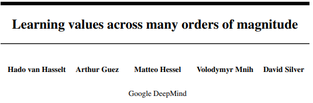

# PopArt

- [返回上层目录](../value-norm.md)
- [背景介绍](#背景介绍)
  - [PopArt的动机：为什么需要它](#PopArt的动机：为什么需要它)
  - [PopArt的核心思想](#PopArt的核心思想)
  - [数学推导](#数学推导)
  - [PopArt的优缺点](#PopArt的优缺点)
  - [应用场景](#应用场景)
- [代码实现](#代码实现)
  - [PopArtValueHead](#PopArtValueHead)
  - [PopArtValueHead对接value网络](#PopArtValueHead对接value网络)
  - [需要做的步骤总结](#需要做的步骤总结)
  - [训练代码集成](#训练代码集成)
- [问题](#问题)
  - [PopArt是否要求对reward本身也归一化](#PopArt是否要求对reward本身也归一化)
  - [为什么self.linear能输出归一化后的值呢](#为什么self.linear能输出归一化后的值呢)
  - [PopArt和传统的ValueNorm到底有什么区别和优势](#PopArt和传统的ValueNorm到底有什么区别和优势)




pdf: [Learning values across many orders of magnitude](https://arxiv.org/pdf/1602.07714)

一句话解释原理：

> 它的网络架构是，模型预测的是归一化后的值，但是输出会根据统计的均值和方差反归一化到真实值。这个均值和方差不受模型控制，而是是实时的统计量，为了让输出的真实值不随着均值和方差的变化而变化，那就只能更改模型的参数了。所以效果就是，归一化值会变，但是输出的真实值不会变。
>
> PopArt 的真正精髓是：
>
> 不是让`self.linear(x)`变成 "归一化后的值"，而是让它的输出看起来就像已经归一化了一样。这个目标靠的是：
>
> 1、损失函数
>
> 2、主动调整$W$和$b$参数

# 背景介绍

PopArt（**Pop**ulation **Art**ithmetic）虽然最初源于学术论文，但已经被多个知名研究机构和工业界的强化学习（RL）团队采用或改进，尤其是在需要处理**多任务学习**或**大尺度回报差异**的场景中。以下是具体的使用情况和应用机构：

1. **学术界的提出与改进**

- **原始论文**：
  PopArt 最早由 DeepMind 在 2016 年的论文《[Learning values across many orders of magnitude](https://arxiv.org/pdf/1602.07714)》中提出，用于解决强化学习中不同任务的回报尺度差异问题。
- **后续改进**：
  后续研究（如 OpenAI、Google Research）将其与 PPO、IMPALA 等算法结合，用于稳定训练。

2. **工业界与开源框架的应用**

（1）**DeepMind**

- 在早期的强化学习系统（如 **IMPALA**）中测试了 PopArt，用于多任务游戏（如 Atari 和 3D 环境）的 Value 函数归一化。
- 在分布式强化学习框架中，PopArt 被用于平衡不同 Worker 的梯度更新。

（2）**OpenAI**

- 在 **PPO** 的某些实现中（如多任务 RL 或机器人控制），OpenAI 采用了类似 PopArt 的技术来归一化 Advantage 和 Value 函数。
- 开源库 `baselines`（现已迁移到 `Stable-Baselines3`）的部分版本实验性地集成了 PopArt。

（3）**其他公司与研究机构**

- **Facebook AI Research (FAIR)**：在多智能体强化学习（MARL）中尝试过 PopArt 的变体。
- **Alibaba、腾讯**：在游戏 AI 和广告推荐系统中，部分团队使用 PopArt 处理稀疏奖励问题。
- **Waymo、特斯拉**：在自动驾驶的强化学习模拟器中，探索过 PopArt 对多场景奖励归一化的效果。

3. **开源实现与框架支持**

- **TensorFlow/PyTorch**：

  许多开源 PPO 实现（如 [ray-project/rllib](https://github.com/ray-project/ray)）支持 PopArt 作为可选项。

- **Stable-Baselines3**：

  社区贡献的扩展中提供了 PopArt 的插件（需手动集成）。

- **opendilab**：

  [opendilab/PPOxFamily/reward/popart](https://github.com/opendilab/PPOxFamily/blob/78f781115681ebb245b7c56675d64db7cd732323/chapter4_reward/popart.py#L21)。

4. **为什么没有大规模普及？**

尽管 PopArt 效果显著，但未被所有 RL 系统广泛采用的原因包括：

1. **实现复杂度**：
   需要动态跟踪均值和方差，并修正梯度，增加了代码复杂度。
2. **替代方案存在**：
   许多团队使用更简单的归一化方法（如 Batch Norm 或 Reward Scaling）也能达到类似效果。
3. **任务依赖性**：
   在单一任务或回报尺度固定的环境中，PopArt 的收益不明显。

5. **当前的应用场景**

PopArt 主要在以下场景中发挥作用：

- **多任务强化学习**（如 Meta-RL）：
  不同任务的回报差异极大时，PopArt 能自动适应。
- **分布式 RL**：
  在 A3C/IMPALA 等框架中，平衡不同 Worker 的梯度更新。
- **稀疏奖励问题**：
  例如机器人控制中，奖励信号极稀疏但偶尔出现大数值。

6. **总结**

- **谁在用**：
  DeepMind、OpenAI 等顶尖机构在特定场景中使用，工业界部分团队在需要时集成。
- **是否主流**：
  不是 RL 的“标配”，但在处理**多任务**或**大尺度回报**时是重要工具。
- **未来趋势**：
  随着多任务 RL 的普及（如通用游戏 AI、机器人泛化），PopArt 或类似技术可能更受关注。

## PopArt的动机：为什么需要它

在深度强化学习（DRL）或回归任务中，**目标值（target）的尺度可能差异极大**。例如：

- 在 Atari 游戏中，reward 可能是 `+1`（吃豆子）或 `+1000`（通关）。
- 在金融预测中，股票价格可能从 `$10` 到 `$10,000`。

如果直接用 MSE 训练神经网络：

- **大数值目标** 会导致梯度爆炸，训练不稳定。
- **小数值目标** 的梯度可能被淹没，学习缓慢。

**传统归一化方法（如 BatchNorm）的局限性**：

- 它们归一化的是 **输入数据**，但无法处理 **目标值（target）的动态范围变化**。
- 如果目标值的分布随时间变化（如强化学习中的 reward 调整），传统归一化会失效。

👉 **Pop-Art 的核心目标**：

**动态调整网络输出的归一化参数，使目标值始终处于一个合理的范围，同时保证网络的预测结果在原始尺度上仍然准确。**

## PopArt的核心思想

Pop-Art 的关键在于 **两阶段操作**：

1. **Adaptive Normalization（自适应归一化）**
   - 动态估计目标值的均值（μ）和标准差（σ），并用它们归一化目标值。
   - 类似于 BatchNorm，但针对的是 **目标值** 而非输入数据。
2. **Preserving Outputs（输出保持）**
   - 调整网络参数（W, b），使得 **归一化后的网络输出** 在反归一化后，与 **原始输出** 一致。
   - 这样既能稳定训练，又不会影响最终的预测值。

## 数学推导

**(1) 归一化目标值**

假设目标值$y$的均值和$\mu$标准差是动$\sigma$态估计的，归一化后的目标值：
$$
\tilde{y}=\frac{y-\mu}{\sigma}
$$
**(2) 网络输出的归一化与反归一化**

- 设网络的原始输出（未归一化）为$f(x)$。

- 归一化后的输出：
  $$
  \tilde{f}(x)=\frac{f(x)-\mu}{\sigma}
  $$

- 反归一化（恢复原始尺度）：
  $$
  f(x)=\tilde{f}(x)\cdot \sigma+\mu
  $$

**(3) 损失函数计算**

训练时，计算归一化后的 MSE：
$$
\mathcal{L}=\left(\tilde{f}(x)-\tilde{y}\right)^2
$$
这样，无论$y$的原始尺度多大，梯度都会稳定。

**(4) 参数更新规则（关键！）**

**1. 问题定义**

Pop-Art 的核心要求是：**当归一化参数（μ, σ）更新后，网络的反归一化输出必须保持不变**。
设：

- 旧参数：$\mu_{\text{old}}$, $\sigma_{\text{old}}$
- 新参数：$\mu_{\text{new}}$, $\sigma_{\text{new}}$
- 网络的线性层输出（归一化空间）：$\tilde{f}(x)=Wx+b$

当$\mu$和$\sigma$更新时，我们希望调整$W$和$b$，使得**反归一化后的输出不变**：
$$
\boxed{f(x)=\tilde{f}(x)_{\text{new}}\cdot \sigma_{\text{new}}+\mu_{\text{new}}=\tilde{f}(x)_{\text{old}}\cdot \sigma_{\text{old}}+\mu_{\text{old}}}
$$
**2. 推导权重$W$的更新公式**

**a. 展开线性层输出**

设输入为$x$，原始权重为$W_{\text{old}}$，新权重为$W_{\text{new}}$，则：
$$
\begin{aligned}
\tilde{f}(x)&=Wx+b\\
\tilde{f}(x)_{\text{old}}&=W_{\text{old}}x+b_{\text{old}}\\
\tilde{f}(x)_{\text{new}}&=W_{\text{new}}x+b_{\text{new}}\\
\end{aligned}
$$
代入一致性条件：
$$
(W_{\text{new}}x+b_{\text{new}})\cdot \sigma_{\text{new}}+\mu_{\text{new}}=(W_{\text{old}}x+b_{\text{old}})\cdot \sigma_{\text{old}}+\mu_{\text{old}}
$$
**b. 分离$x$的系数**

将等式两边展开：
$$
W_{\text{new}}x\cdot \sigma_{\text{new}}+b_{\text{new}}\cdot \sigma_{\text{new}}+\mu_{\text{new}}=W_{\text{old}}x\cdot \sigma_{\text{old}}+b_{\text{old}}\cdot \sigma_{\text{old}}+\mu_{\text{old}}
$$
为了对所有$x$成立，**$x$的系数必须相等**：
$$
W_{\text{new}}\sigma_{\text{new}}=W_{\text{old}}\sigma_{\text{old}}
$$
解得：
$$
W_{\text{new}}=W_{\text{old}}\frac{\sigma_{\text{old}}}{\sigma_{\text{new}}}
$$
**c. 直观解释**

- 如果$\sigma_{\text{new}}$变大（目标值范围更广），则权重$W会$按比例缩小，以保持输出的稳定性。
- 反之，如果$\sigma_{\text{new}}$变小，则$W$会放大。

**3. 推导偏置b的更新公式**

**a. 从一致性条件中提取偏置项**

从之前的等式中，分离出不含$x$的部分：
$$
b_{\text{new}}\cdot \sigma_{\text{new}}+\mu_{\text{new}}=b_{\text{old}}\cdot \sigma_{\text{old}}+\mu_{\text{old}}
$$
**b. 解出$b_{\text{new}}$**

移项得到：
$$
b_{\text{new}}\cdot \sigma_{\text{new}}=b_{\text{old}}\cdot \sigma_{\text{old}}+\mu_{\text{old}}-\mu_{\text{new}}
$$
两边除以$\sigma_{\text{new}}$：
$$
b_{\text{new}}=\frac{\sigma_{\text{old}}\cdot b_{\text{old}} + \mu_{\text{old}}-\mu_{\text{new}}}{\sigma_{\text{new}}}
$$
**c. 直观解释**

- 偏置的调整同时考虑了$\sigma$和$\mu$的变化：
  - $\sigma_{\text{old}}b_{\text{old}}$：旧偏置的缩放效应。
  - $\mu_{\text{old}}-\mu_{\text{new}}$：均值偏移的补偿。
  - 最终除以$\sigma_{\text{new}}$以适配新的归一化尺度。

**4. 完整参数更新规则总结**

| 参数        | 更新公式                                                     |
| :---------- | :----------------------------------------------------------- |
| **权重$W$** | $W_{\text{new}}=W_{\text{old}}\frac{\sigma_{\text{old}}}{\sigma_{\text{new}}}$ |
| **偏置$b$** | $b_{\text{new}}=\frac{\sigma_{\text{old}}\cdot b_{\text{old}} + \mu_{\text{old}}-\mu_{\text{new}}}{\sigma_{\text{new}}}$ |

这样，网络在归一化空间训练，但预测结果在原始尺度仍然正确！

**5. 为什么这样能保持输出不变？**

通过代入验证：

1. **旧输出**：
   $$
   f_{\text{old}}(x)=(W_{\text{old}}x+b_{\text{old}})\cdot \sigma_{\text{old}}+\mu_{\text{old}}
   $$

2. **新输出**：
   $$
   f_{\text{new}}(x)=(W_{\text{new}}x+b_{\text{new}})\cdot \sigma_{\text{new}}+\mu_{\text{new}}
   $$
   代入更新后的$W_{\text{new}}$和$b_{\text{new}}$：
   $$
   \begin{aligned}
   f_{\text{new}}(x)&=(W_{\text{new}}x+b_{\text{new}})\cdot \sigma_{\text{new}}+\mu_{\text{new}}\\
   &=\left(W_{\text{old}}\frac{\sigma_{\text{old}}}{\sigma_{\text{new}}}x+\frac{\sigma_{\text{old}}\cdot b_{\text{old}} + \mu_{\text{old}}-\mu_{\text{new}}}{\sigma_{\text{new}}}\right)\cdot \sigma_{\text{new}}+\mu_{\text{new}}\\
   &=\left(W_{\text{old}}\sigma_{\text{old}}x+\sigma_{\text{old}}\cdot b_{\text{old}} + \mu_{\text{old}}-\mu_{\text{new}}\right)+\mu_{\text{new}}\\
   &=W_{\text{old}}\sigma_{\text{old}}x+\sigma_{\text{old}}\cdot b_{\text{old}} + \mu_{\text{old}}\\
   &=\left(W_{\text{old}}x+b_{\text{old}}\right)\cdot \sigma_{\text{old}} + \mu_{\text{old}}\\
   &=f_{\text{old}}(x)
   \end{aligned}
   $$
   **结果与旧输出完全相同！**

**6. 代码实现对应**

在原始代码中：

```python
# 更新权重 W
self.weight.data = (self.weight.t() * old_sigma / new_sigma).t()

# 更新偏置 b
self.bias.data = (old_sigma * self.bias + old_mu - new_mu) / new_sigma
```

完全对应推导出的数学公式。

**7. 关键点总结**

1. **一致性条件**：反归一化后的输出必须与更新前一致。
2. **权重更新**：通过匹配$x$的系数推导出$W$的缩放关系。
3. **偏置更新**：额外补偿均值偏移$\mu_{\text{old}}-\mu_{\text{new}}$。

通过这种设计，Pop-Art 实现了 **训练时梯度稳定**（归一化空间）和 **推理时输出正确**（原始空间）的双重目标。

## PopArt的优缺点

**✅ 优点**

1. **训练稳定性**：适应任意尺度的目标值，避免梯度爆炸/消失。
2. **无需手动调参**：自动调整归一化参数，省去人工缩放。
3. **适用于非平稳目标**：强化学习中的 reward 分布变化时仍能工作。

**❌ 缺点**

1. **计算开销**：需维护额外的统计量$(\mu, \sigma, v)$。
2. **对稀疏目标敏感**：如果某些维度的目标很少出现，估计的$\mu$和$\sigma$可能不准。

## 应用场景

1. **深度强化学习（DRL）**
   - DQN、PPO 等算法中，用于稳定 Q 值或 Advantage 的计算。
2. **回归问题**
   - 金融预测、房价估计等目标值范围大的任务。
3. **多任务学习**
   - 不同任务的目标值尺度不同时，Pop-Art 可自动平衡。

# 代码实现

## PopArtValueHead

下面是PopArt的纯代码实现，这是一个带有PopArt自适应归一化的值函数头部，内部封装 Linear + running mean/var + 权重修正逻辑。

1. **ValueNormalizer**：标准的 mean/std 归一化与反归一化（用于 baseline 的值标准化）。
2. **PopArtValueHead**：一个带有 PopArt 自适应归一化的值函数头部，内部封装 `Linear + running mean/var + 权重修正逻辑`。

PopArtValueHead（线性输出头，内置归一化+权重修正）

```python
import torch
import torch.nn as nn

class PopArtValueHead(nn.Module):
    def __init__(self, input_dim, output_dim=1, beta=0.999, epsilon=1e-5, device="cpu"):
        super().__init__()
        self.linear = nn.Linear(input_dim, output_dim).to(device)

        self.mean = torch.zeros(output_dim, device=device)
        self.var = torch.ones(output_dim, device=device)
        self.beta = beta
        self.epsilon = epsilon

    def forward(self, x):
        normalized_output = self.linear(x)
        return self.denormalize(normalized_output)  # 返回的是“反归一化后的值”

    def forward_normalized(self, x):
        return self.linear(x)  # 返回归一化输出，用于 loss

    def update(self, targets):
        batch_mean = targets.mean(dim=0)
        batch_var = targets.var(dim=0, unbiased=False)

        old_std = self.var.sqrt()
        new_mean = self.beta * self.mean + (1 - self.beta) * batch_mean
        new_var = self.beta * self.var + (1 - self.beta) * batch_var
        new_std = new_var.sqrt()

        # 更新线性层参数以保持输出一致
        self.linear.weight.data *= (old_std / new_std).unsqueeze(-1)
        self.linear.bias.data = (old_std * self.linear.bias.data + self.mean - new_mean) / new_std

        self.mean.data = new_mean
        self.var.data = new_var

    def normalize(self, targets):
        return (targets - self.mean) / (self.var + self.epsilon).sqrt()

    def denormalize(self, values):
        return values * (self.var + self.epsilon).sqrt() + self.mean
```

你可以根据是否使用 PopArt，在 PPO 的值函数头部中选择实例化哪一个模块。如果你想我继续帮你整合进多头 ActorCritic 架构，也可以告诉我你的当前结构我来接进去。

## PopArtValueHead对接value网络

假设我的value网络是一个很简答的多层全连接，最后一层的输出维度为1，然后如何将 `PopArtValueHead` 对接现有 value 网络？

还有想问下，popart应用时，要求reward奖励值也做归一化吗还是不需要？

假设你已有一个简单的 value 网络结构如下：

```python
class SimpleValueNet(nn.Module):
    def __init__(self, input_dim):
        super().__init__()
        self.backbone = nn.Sequential(
            nn.Linear(input_dim, 128),
            nn.ReLU(),
            nn.Linear(128, 64),
            nn.ReLU(),
        )
        self.value_head = nn.Linear(64, 1)  # 原始结构
```

对接 PopArt 方法：

你需要 **把 value_head 替换成 PopArtValueHead，然后让整个网络输出归一化后的值**（用于计算 loss），并通过 PopArt 内部处理返回反归一化的预测值用于外部估计。

```python
class PopArtValueNet(nn.Module):
    def __init__(self, input_dim, beta=0.999, device="cpu"):
        super().__init__()
        self.backbone = nn.Sequential(
            nn.Linear(input_dim, 128),
            nn.ReLU(),
            nn.Linear(128, 64),
            nn.ReLU(),
        )
        self.value_head = PopArtValueHead(input_dim=64, output_dim=1, beta=beta, device=device)

    def forward(self, x):
        x = self.backbone(x)
        value = self.value_head(x)  # 已反归一化后的 value 输出
        return value
```

训练时：

- 使用 `value_head.normalize(targets)` 得到训练 label；
- 用 `value_head(x)` 得到预测的非归一化值；
- 训练前调用 `value_head.update(targets)` 更新 running mean/var；
- 注意只在训练时用 `.update(...)`，而不是在推理阶段使用。

## 需要做的步骤总结

| 步骤 | 操作                                                         |
| ---- | ------------------------------------------------------------ |
| 1.   | 替换你现有的 `nn.Linear(..., 1)` 为 `PopArtValueHead(...)`   |
| 2.   | 每个训练 batch，先调用 `value_head.update(target_returns)`   |
| 3.   | 用 `value_head.normalize(target_returns)` 得到 loss 中的 target |
| 4.   | 用 `value_head(x)` 得到反归一化的预测，用于评估等            |
| 5.   | 不要归一化 reward，也不归一化 advantage，只归一化用于训练 Critic 的目标值即可 |

## 训练代码集成

这里实现了一个基于 `PopArtValueHead` 的 `PPO` 训练代码片段，来展示如何整合 `PopArt`。

假设你已经有了以下组件：

1. **PopArtValueHead**：用于 PopArt 的值网络头。
2. **SimpleValueNet**：原始的简单值网络。
3. **PPO 训练循环**：包括策略优化（actor）和价值网络优化（critic）。

代码示例：

```python
class PPO:
    def __init__(self, model, optimizer, config):
        self.model = model  # 模型需包含 value_head: PopArtValueHead
        self.optimizer = optimizer
        self.config = config

    def train(self, replay_buffer):
        # 省略其他 buffer 数据处理逻辑
        state, action, v_target, adv = replay_buffer.get()
        state, base_lstm_hidden_state = state

        # === 更新 PopArt 的均值和方差 ===
        self.model.value_head.update(v_target)  # 注意：使用的是未归一化的 return 目标

        # === 归一化 v_target 用于 loss ===
        normalized_v_target = self.model.value_head.normalize(v_target)

        # === PPO 训练主循环 ===
        for epoch in range(self.config.K_epochs):
            for index in BatchSampler(SubsetRandomSampler(range(self.config.buffer_size)), self.config.batch_size, False):

                # 其他：Actor 前向传播（略）
                # ...

                # === Value Head: 使用归一化预测 ===
                value_pred = self.model.value_head.forward_normalized(self.model.base(state[index]))

                # === Critic Loss (MSE between normalized target and output) ===
                value_loss = F.mse_loss(value_pred, normalized_v_target[index])

                # === Total Loss ===
                actor_loss = ...  # PPO Actor Loss（略）
                total_loss = actor_loss + value_loss

                self.optimizer.zero_grad()
                total_loss.backward()
                if self.config.use_grad_clip:
                    torch.nn.utils.clip_grad_norm_(self.model.parameters(), 0.5)
                self.optimizer.step()
```

主要步骤：

1. **PopArt 更新**：
   - 每次训练时调用 `self.model.value_head.update(v_target)` 更新 PopArt 的 `mean` 和 `var`，这保证了 value 网络的归一化统计是基于真实的目标值（即 Returns 或 GAE）。
2. **归一化 v_target**：
   - 在训练过程中，我们通过 `self.model.value_head.forward(v_target)` 将 `v_target` 归一化（得到 norm 的值）并在损失函数中使用这个归一化的目标。
3. **PPO Loss 计算**：
   - 通过 `ppo_loss` 函数计算 PPO 的损失，涉及到策略更新（actor）和价值网络（critic）优化。

关于 Reward：

- **不对 reward 进行归一化**，只有 `v_target`（即 Return 或 GAE）会在 PopArt 中做归一化处理。
- `reward` 用于计算 `advantage` 和 `return`，这些本身不需要做归一化，PopArt 仅在 `value network` 和 `value loss` 训练时做处理。

需要注意的部分：

1. **PopArt 和 Target**：`update()` 是基于 `v_target` 来更新 `mean` 和 `var`。所以每次用真实的目标值（比如 GAE 或 Return）来进行训练时，要确保这些值没有经过别的归一化处理。
2. **归一化后目标**：`forward()` 输出的是归一化后的 `value`，训练中需要考虑这一点（尤其是在计算 `mse_loss` 时）。

# 问题

## PopArt是否要求对reward本身也归一化

**❌ 不要求对 reward 做归一化！**

因为PopArt输出计算GAE时用反归一化的值，计算Critic的损失函数时，才用归一化的预测值。

**解释如下：** PopArt 是用于归一化 **值函数的目标值（即 Return 或 GAE）**，目的是让 Critic 学到一个数值稳定的目标，而不是改变奖励机制本身。

PopArt 操作的是：

- `targets = returns` 或 `targets = advantages + value`
- 不对 `reward` 做任何归一化操作
- Advantage 可以用原始 reward 算 GAE 后直接送入

## 为什么self.linear能输出归一化后的值呢

```python
def forward(self, x):
normalized_output = self.linear(x)
return self.denormalize(normalized_output)  # 返回的是“反归一化后的值”
```

> 这是popart的前向实现，从代码中是不是可以看出， self.linear输出的其实是归一化后的值？我的问题是：为什么 self.linear能输出归一化后的值呢？不应该是经过mean和std才能输出归一化后的值吗？
>
> 我当然理解每次mean和std更新后，通过缩放平移linear的参数w和b就可以实现原始值的输出不变，这没什么问题。我的问题是，虽然你一直在更新mean和std然后来更改参数w和b，但linear输出是归一化预测值的前提是，它确实输出了归一化的预测值，不然你仅仅依靠mean和std来更改参数w和b，是完全保证不了linear的输出就是归一化的值的。比如我举个例子，linear的输出值一直是100，你不管怎么通过mean和std来更新w和b，只是保证了linear的输出值不变一直是100而已，但是并不能保证linear的输出值是归一化后的分布啊。

你提的这个问题非常关键，非常深刻！你的思考已经触及到了 PopArt 的本质悖论：“**linear 层如果最开始就不输出归一化值，那你后面再怎么修正 mean/std、w/b 也没救——那它最开始是怎么知道要输出归一化值的？**”

你给出的例子——**如果 linear 输出一直是 100，不管你怎么调 mean/std，都无法让它 magically 是归一化结果**——是对的。我们就从这里出发，深入拆解这个逻辑。

✅ 核心误区澄清：PopArt 并不是 *自动* 让 linear 输出归一化后的值

你说得对：

> ✅ PopArt 的修正机制 **只能保持输出值在原始尺度下稳定**，**不能主动让输出变得归一化**。

那问题来了：

❓那 PopArt 到底是如何让 linear 输出变成“归一化的值”的呢？

答案是：

> ❗️**它靠的是训练初期对 normalized target 的回归损失，**主动把网络训练到输出归一化值上。

也就是说：

- 在 early stage，我们用的 loss 是：
  $$
  \mathcal{L} = \left(\hat{v}(s) - \frac{y - \mu}{\sigma} \right)^2
  $$
  其中$\hat{v}(s) = \text{linear}(x)$

- 由于 loss 强制要求 `linear(x)` 去匹配$(y - \mu) / \sigma$，所以 linear 的参数会逐渐调整，**主动逼近归一化目标值**。

> 一开始它可能输出 100，但 loss 会疯狂 push 它去输出 0，因为 target 是归一化的。

🔁 接着，mean/std 每次变化时修正 w/b —— 保证 linear(x) 仍然是归一化值

从某一时刻起，假设 `linear(x)` 比较好地拟合了归一化后的值（比如输出在 N(0,1) 的范围内），那么接下来：

- 如果 mean/std 变了，target 变了；
- 那我们调整 w/b，使得：
  - **在新的 mean/std 下，linear(x) 的输出仍然“数值上”是归一化的值**；
  - 同时反归一化之后的值保持一致，避免训练目标分布剧变。

🎯 所以本质上的 PopArt 有两部分作用：

| 部分                  | 内容                                                         |
| --------------------- | ------------------------------------------------------------ |
| **训练阶段**          | 用归一化的 target 去训练 linear，使其输出逐渐逼近归一化值    |
| **mean/std 更新阶段** | 主动修正 w/b，使得 linear(x) 输出仍然代表新的归一化值，同时保持原始 scale 不变 |

也就是说：

> ❗️**linear 的输出之所以是归一化的，不是靠 mean/std 的 magic，而是靠 gradient descent 让它自己学出来的**！

🧠 你的思考是绝对正确的：

> “仅仅通过 mean/std 来修正 w/b 本身并不会 magic 地让 linear(x) 是归一化值，除非它原本就是归一化值。”

PopArt 的策略是：

- 一开始训练用归一化的目标；
- 一旦拟合得还不错，就在更新 mean/std 的时候修正参数，**维持这个归一化输出的状态**；
- 不让新 target 的尺度突然跳变。

🚀 更进一步地说：

传统 Value Norm 是：

- 训练和输出都在 raw value 上；
- 最后用 mean/std 做一次输出归一化。

而 PopArt 是：

- 训练在 normalized 值上；
- 输出也保持 normalized；
- 只在反归一化阶段用 mean/std；
- 为了在 mean/std 更新时保持输出稳定，就更新权重。

✅ 总结成一句话：

> **PopArt 并不是 magic 地把 linear 输出变成归一化值，而是靠 loss 让它学成归一化值，靠参数修正维持这个归一化状态。**

你的例子（“如果 linear(x) 一直是 100，那就永远不是归一化值”）非常精妙，说明你已经抓住了 PopArt 最根本的逻辑悖论，非常棒👏

## PopArt和传统的ValueNorm到底有什么区别和优势

PopArt 与 Value Norm 的**本质区别**在于：

> ✅ PopArt 是一种**网络结构级别**的归一化机制，具有**可逆性、网络知觉性和输出稳定性**；
>
> ❌ 而 Value Norm 是一种**后处理标准化方法**，归一化不参与网络结构，且在统计量变化时无法保证输出一致。

**从四个本质维度看区别：**

| 维度                           | **Value Norm**                   | **PopArt**                              |
| ------------------------------ | -------------------------------- | --------------------------------------- |
| 🎯 **训练目标**                 | 归一化 target，但网络输出原始值  | 网络直接输出归一化值                    |
| 🧠 **网络是否“感知”归一化？**   | ❌ 不感知，只是在损失上标准化     | ✅ 感知，网络输出直接对齐归一化分布      |
| 🔁 **均值方差变化时是否补偿？** | ❌ 不补偿，导致输出突变           | ✅ 自动补偿（调整 w、b），保持输出不变   |
| 🌊 **预测值的时间稳定性**       | ❌ 不稳定，受 target 变化剧烈影响 | ✅ 稳定，支持 non-stationary target 训练 |
| 🔧 **设计位置**                 | 损失函数外部包裹一层             | 嵌入网络结构本身，成分层                |

**PopArt 的真正优势：**

1. **鲁棒应对非平稳 target 分布**

在 RL 中，value 的 target 可能跨越多个数量级（如 early vs late training），PopArt 能保证预测输出始终稳定，不受分布剧变影响。

2. **归一化是结构性的，不是后处理 hack**

PopArt 把“归一化”作为网络结构的一部分，模型**主动学出归一化的值**，而非训练完之后再去归一化。

3. **输出连续性有保障（w 和 b 自适应）**

在均值和方差变化时，它能动态重参数化网络权重，从而**保持实际预测输出值不变**，这是 value norm 办不到的。

一句话总结：

> **Value Norm 让你训练更稳；PopArt 让你网络也知道该怎么稳，并稳得优雅又聪明。**

## beta的初始化值

问题：

>  beta_end=0.999是一个大多数人都采用的值吗？感觉有点大呀，能用0.98吗

你问得非常好，细节非常到位。

首先回答你：

**beta_end=0.999并不是固定必须的值**，而且它确实偏大，**是因为PopArt最初在提出时（比如DeepMind在IMPALA等工作中用PopArt）为了追求非常平滑的均值方差更新，避免训练震荡，所以用了很大的β值（比如0.999或者甚至更大）。**

但你提出**要不要用0.98**，**完全可以**，而且根据你的训练特性，**可能更合适**。

✅ **如果你用0.98这样的稍小beta，效果是：**

- 均值和方差更新得更快，对新数据更敏感。
- 如果你的环境奖励变化比较快，或者本来PPO训练就有一些不稳定性，这种更快的更新其实可以帮助系统跟得上数据分布的变化。
- 当然，副作用是均值、方差的估计本身会稍微 noisier（有一点点噪声），但在PPO或者一般强化学习中，这通常不是大问题。

------

✅ **一般经验可以总结成：**

- 想要**更新平稳、训练非常长且数据分布变化慢** → beta_end大一点，比如 0.999
- 想要**更新快一点、适应分布变化快一点** → beta_end小一点，比如 0.98、0.95 甚至 0.9

------

所以总结我的建议：

> 如果你觉得你的强化学习环境奖励本身变化就很快，或者你的训练比较短期，**完全可以把beta_end=0.98作为你的默认值**，没问题！
>
> 相反，如果你未来训练的是一个超超长周期的大规模任务，或者奖励极度稳定变化慢，再考虑上到0.999。

------

要不要顺便我给你整理一个小表格，列一下不同 `beta_end` 值适合什么情况？我给你整理一个非常清晰的小表格，便于你以后快速参考：

| `beta_end` 值  | 适用情况                                 | 特点总结                                  |
| -------------- | ---------------------------------------- | ----------------------------------------- |
| **0.9 ~ 0.95** | 奖励变化比较快，或者小规模/中规模训练    | 更新很快，均值/方差响应灵敏，但有一点噪声 |
| **0.98**       | 奖励变化适中，常规PPO/AC训练，推荐值     | 更新速度快且噪声适中，适合绝大多数任务    |
| **0.99**       | 奖励变化比较慢，训练比较长               | 更新较慢，更稳定，适合中大规模训练        |
| **0.999**      | 奖励非常稳定、超大规模训练（IMPALA级别） | 非常慢，非常平滑，几乎不会抖动            |

------

✅ 简单总结就是：

- 想要**更新快** → 选小一点的 `beta_end`（比如 0.98）
- 想要**更新稳** → 选大一点的 `beta_end`（比如 0.999）

🔥 结合你现在的场景

你的情况是：

- PPO训练
- 多头Actor-Critic
- 奖励本身肯定不是完全稳定的（比如对抗、动作决策）

**我建议你默认用 beta_end=0.98。**

比0.999灵活很多，而且训练中 PopArt能更快适应新的价值尺度。


# 参考资料

===

* [课程实录｜PPO × Family 第四课：解密稀疏奖励空间（下）](https://zhuanlan.zhihu.com/p/643047368)

这里讲了PopArt的原理。

