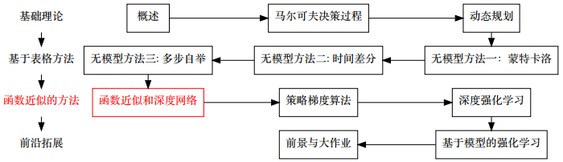
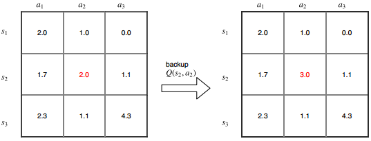
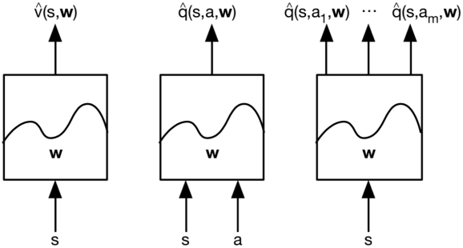
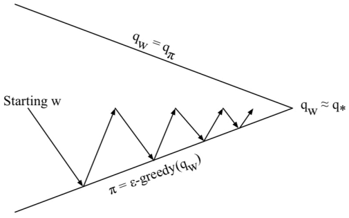
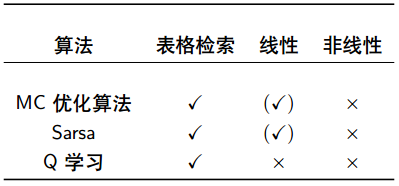
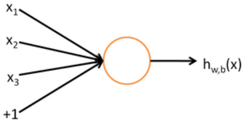
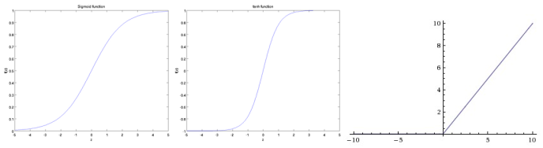
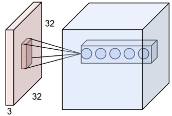
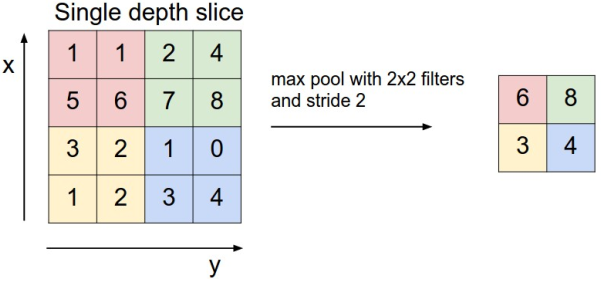
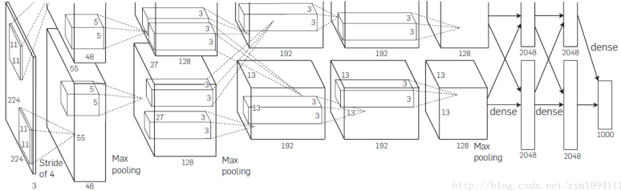

# 函数近似和深度网络

* [返回上层目录](../reinforcement-learning.md)
* [本章在学习地图中的位置](#本章在学习地图中的位置)
* [本章简介](#本章简介)
  * [值函数近似](#值函数近似)
  * [大规模强化学习问题](#大规模强化学习问题)
  * [值函数近似](#值函数近似)
  * [值函数近似的类型](#值函数近似的类型)
  * [函数近似器](#函数近似器)
* [增量算法](#增量算法)
  * [梯度算法](#梯度算法)
    * [值函数近似和随机梯度下降](#值函数近似和随机梯度下降)
  * [线性函数近似](#线性函数近似)
    * [特征向量](#特征向量)
    * [线性值函数近似](#线性值函数近似)
    * [表格检索特征](#表格检索特征)
  * [值函数近似下的增量式评价算法](值函数近似下的增量式评价算法)
    * [值函数近似下的蒙特卡洛](#值函数近似下的蒙特卡洛)
    * [值函数近似下的时间差分TD（0）](#值函数近似下的时间差分TD（0）)
    * [值函数近似下的时间差分TD（λ）](#值函数近似下的时间差分TD（λ）)
  * [值函数近似下的增量式优化算法](#值函数近似下的增量式优化算法)
    * [通用策略迭代](#通用策略迭代)
    * [对Q函数的近似](#对Q函数的近似)
    * [线性Q函数近似](#线性Q函数近似)
    * [增量式策略迭代优化算法](#增量式策略迭代优化算法)
* [收敛性简介](#收敛性简介)
  * [策略评价时的收敛性](#策略评价时的收敛性)
  * [策略优化时的收敛性](#策略优化时的收敛性)
* [神经网络](#神经网络)
  * [神经网络单元](#神经网络单元)
  * [激活函数](#激活函数)
  * [多层神经网络](#多层神经网络)
  * [反向传播](#反向传播)
  * [网络的大小和深度](#网络的大小和深度)
  * [正则化](#正则化)
  * [本课程对神经网络的要求](#本课程对神经网络的要求)
* [卷积神经网络](#卷积神经网络)
  * [卷积神经网络的整体结构](#卷积神经网络的整体结构)
  * [卷积](#卷积)
  * [卷积层](#卷积层)
  * [池化层（Pooling）](#池化层（Pooling）)
  * [全连接层](#全连接层)
* [其他](#其他)
  * [LeNet5](#LeNet5)
  * [AlexNet](#AlexNet)
  * [ResNet](#ResNet)
  * [深度学习的其他拓展](#深度学习的其他拓展)

# 本章在学习地图中的位置

截止到上一节，基本上有关强化学习的基础方法已经讲清楚了。从这一节课开始，我们要把强化学习方法，和我们现在用的比较多的函数近似的工具，比如神经网络，进行一个结合。

之前课程中的SARSA和Q学习都是基于表格更新的方法，即将值函数列成一个表格，每一次更新都是更新表格中的某一项。从今天开始，就要把表格的这个工具用函数近似的方法来代替。

这节课介绍怎么**用函数近似的方法表达值函数**。下节课会介绍用函数近似的方法表达策略，以及怎么推导出一个策略梯度算法。

本章的前三节都是讲如何将以前学到的理论方法和函数近似结合起来，也会去讲下我们为什么要用函数近似，函数近似并不仅仅是神经网络，神经网络只是函数近似中的一个小小的分支。但是之后要讲的深度强化学习都是用神经网络去逼近的，所以本章后面三节会去讲神经网络。

# 本章简介

## 值函数近似

* 之前所提到的方法（不论是策略评价还是策略优化）均为基于值函数的方法。策略评价是指给定策略π，求相应的值函数；策略优化是指找到最优的值函数，从而推出最优的一个策略或者一个最优的Q函数来推导最优的策略。我们的目的都是求值函数，所以把它叫做基于值函数的方法。

  * 通过求解最优值函数来求解最优策略

* 而且，在前面的课程中，都是基于表格的方法。比如Q函数的基于表格的方法：

  

* 表格的大小会随着**状态数量**和**动作数量**快速膨胀

* 对于表格中某一项的更新不会影响到其他项的更新。会精确地描述每一个动作和状态对应的值函数

  * 好处是：更新这个状态不会影响其他状态，更有利于收敛性。即没有干扰，不会引起其他参数的震荡。
  * 坏处是：要想把表格维护的很好，必须保证把表格中的每一项都给采样到，不然很难找到最优的策略。迁移性也不够。

## 大规模强化学习问题

强化学习能够用来解决大规模的问题

* 西洋双陆棋：10^20种不同的状态

  这已经非常大了，基本很难用一个表格在计算机内维护

* 围棋：10^170种不同的状态

  比宇宙全部的原子数量还要多，那不可能用一个计算机存储这个表格并遍历一遍

* 机器人控制以及无人机控制：连续状态

  连续状态是无穷维的量级。。用表格就更不能做了

* 图像状态：256^像素点数

  这也是个极其庞大的数

之前讲的基于表格的方法对于这么大的规模的强化学习问题，基本是没有办法的。所以说我们如何将无模型的方法应用到如此大规模的强化学习问题？

那我们就用值函数近似的方法去做。

## 值函数近似

* 过去我们都是使用表格来表示值函数，表格分为两种：

  * 对于V函数：每个状态s都有一个V值函数V(s)——V函数向量
  * 对于Q函数：每个状态动作对\<s, a\>都有一个Q值函数——Q函数矩阵

* 在大规模的马尔科夫决策（MDPs）中会存在如下的问题：

  * 需要在内存空间中存储大量的状态或者动作。这个内存空间有时候基本上是不可能这么大的。
  * 学习太缓慢

* 为了解决大规模的马尔科夫决策（MDPs）的方法是

  * 我们使用**函数近似**的方法
    $
    \begin{aligned}
    \hat{v}(s,w)\approx V_{\pi}(s)\\
    \hat{q}(s,a,w)\approx q_{\pi}(s,a)\\
    \end{aligned}
    $

  * 从已经经历过的状态可以推广到未见的状态，适用性更广。

    并不需要把所有的状态都遍历一遍，而是做一些采样就行，采足够的样本就可以拟合成一条曲线。因为有时候想描述一条曲线，有时候并不需要把曲线上的每一个点都给画出来，只需要大概用一个形式去描述就行了。

    就像是初中学的函数，描述函数有几种方法，第一个方法就是表格，把自变量和应变量列成一个表格，然后就能根据自变量在表格中查表，找到对应的应变量。还有图像法。最简洁的方式就是函数表达法，就是用极少的参数取描述。

    用函数表达的好处在于：比如你要描述一个二次函数曲线，若用表格法，则每一个点都要列在表格中，那表格是无穷大的。但是，用参数的话，用a,b,c就可以表达二次函数了，为了拟合出这个二次函数，你只要采样三个点就能把这三个参数求出来。**但前提假设是，值函数都是有规律的，用参数能够把这个规律表示出来**。恰巧对于值函数，这个假设是成立的，比如打砖块的图像，并不是每个点都会随意随机变化的，肯定是具有某种规律的。**值函数近似就是通过采样一些样本，找到这种规律，有了这个规律，就可以适用到你没有见过的样本点**。

    所以值函数的表达就是用具体的参数w去表达。

  * 更新参数的方法还和以前一样，可以使用蒙特卡洛或者时间差分更新参数w。

    以前是更新一个表格，现在只是更新一个参数。

## 值函数近似的类型

第三种情况，要求动作a是可数的，因为s虽然已经可以是无穷大了，即连续的也可以，因为s是输入的。但因为a是输出，要同时输出m个Q值，所以a的数量一定是有限的。它有什么好处呢？我们在之前提过，Q函数得到了之后，我们可以直接得到一个最优的策略，怎么得到最优策略呢？是需要对Q函数取max的，如果同时输出了m个Q值，那么比一下大小，马上就能得到哪个动作a的Q函数值是最大的，这相比第二幅图，是比较高效的，所以，一般在动作a可数有限的情况下，都会选择第三种建模的方式。

## 函数近似器

我们考虑**可微**的函数近似器，比如

* **线性模型**
* **神经网络**
* 决策树
* 最近邻法
* 傅里叶基
* 小波变换
* ...

不可微的很难用梯度的方法去寻优，所以用的特别少。

这里主要讲两种：线性模型、神经网络。

# 增量算法

现在我们来讲在线性模型下，函数近似是怎么更新参数的。一般我们用增量式的方法去更新，即增量算法。

## 梯度算法

首先来讲怎么更新参数，更新参数其实属于优化理论。

* 如果J(w)是参数向量w的可微函数

* 那么J(w)的梯度定义为
  $
  \begin{aligned}
  \bigtriangledown _wJ(w)=
  \begin{bmatrix}
  \frac{\partial J(w)}{\partial w_1}\\ 
  ...\\ 
  \frac{\partial J(w)}{\partial w_n}
  \end{bmatrix}
  \end{aligned}
  $

* 为了能找到J(w)的局部最优值

* 沿负梯度方向更新参数向量w
  $
  \bigtriangleup w=-\frac{1}{2}\alpha\bigtriangledown_wJ(w)
  $
  这里α代表步长。

梯度下降的劣势是只能找到局部最优值，但在线性模型下，局部最优值就是全局最优值。

### 值函数近似和随机梯度下降

在强化学习中怎么定义目标函数呢？

* 目标：寻找参数向量w，以及最小化近似值函数
  $
  \hat{v}(s,w)
  $
  和真实的值函数vπ(s)之间的均方误差（mean-squared-error, MSE）：
  $
  J(w)=\mathbb{E}_{\pi}\left[ (v_{\pi}(S)-\hat{v}(S,w))^2 \right]
  $

* 梯度下降算法会寻找局部最优值
  $
  \begin{aligned}
  \bigtriangleup w&=-\frac{1}{2}\alpha\bigtriangledown_wJ(w)\\
  &=\alpha\mathbb{E}_{\pi}\left[ (v_{\pi}(S)-\hat{v}(S,w))\bigtriangledown_w\hat{v}(S,w) \right]\\
  \end{aligned}
  $

* 随机梯度下降算法会对梯度进行采样
  $
  \bigtriangleup w=\alpha\left( v_{\pi}(S)-\hat{v}(S,w) \right)\bigtriangledown_w\hat{v}(S,w)
  $

* 其他常见的优化算法：牛顿法、批量梯度下降、动量梯度下降、RMSprop、Nesterov、Adagrad、Adam...

  建议直接用Adam，因为比较简单，而且更新步长是可以自调节自适应的。

## 线性函数近似

### 特征向量

线性模型的参数就是一个线性向量。把每一个状态表达为一种线性特征，然后用线性特征和线性向量做一个结合，就得到一个线性模型。

* 通过一个特征向量表达状态（线性特征）
  $
  \begin{aligned}
  x(S)=
  \begin{bmatrix}
  x_1(S)\\ 
  ...\\ 
  x_n(S)
  \end{bmatrix}
  \end{aligned}
  $
  形象理解：比如一个状态就是一个人，x1(S)就是这个人的身高，x2(S)就是这个人的体重，x3(S)就是这个人的年龄。也就是x(S)是这个人的一系列特征组成的特征向量，用这个特征向量来描述某一个人。也就是说x(S)就是状态的特征向量，x(S)是这个状态的一系列特征的组合，用这个x(S)可以描述一个状态S。

* 常用于特征之间关系不明显的数据

  比如图像的不同像素之间是有一定的位置关系的，把它搞成一个向量就不太好，最好还是保持原来的矩阵形式。

### 线性值函数近似

* 通过特征的线性组合表达值函数
  $
  \hat{v}(S,w)=X(s)^Tw=\sum_{j=1}^nx_j(S)w_j
  $

* 目标函数是w的二次形式
  $
  J(w)=\mathbb{E}_{\pi}\left[ (v_{\pi}(S)-x(S)^Tw)^2 \right]
  $

* 随机梯度下降会收敛到全局最优值

* 在线性值函数近似的情况下，梯度的计算变得非常简单
  $
  \begin{aligned}
  \bigtriangledown _w\hat{v}(S,w)&=x(S)\\
  \bigtriangleup w&=\alpha\left( v_{\pi}(S)-\hat{v}(S,w) \right)x(S)\\
  \end{aligned}
  $

### 表格检索特征

还有一种特征，也是线性模型。

* 表格检索是线性值函数近似的一种特殊形式

* 使用表格检索特征
  $
  \begin{aligned}
  x^{\text{table}}(S)=
  \begin{bmatrix}
  I(S=s_1)\\ 
  ...\\ 
  I(=s_nS)
  \end{bmatrix}
  \end{aligned}
  $
  其中，I是示性函数，满足相等即返回1，否则返回0

* 参数向量w本质上相当于给了每个状态对应的值函数V
  $
  \begin{aligned}
  \hat{v}(S,w)=
  \begin{bmatrix}
  I(S=s_1)\\ 
  ...\\ 
  I(=s_nS)
  \end{bmatrix}^T
  \begin{bmatrix}
  w_1\\ 
  ...\\ 
  w_n
  \end{bmatrix}
  \end{aligned}
  $
  所以说，之前的表格法也是线性模型的一种

## 值函数近似下的增量式策略评价算法

* 之前是假设了给定了真实的值函数vπ(s)

* 但是在RL环境中，并**不知道**真实的值函数，只有奖励值

* 直观地，我们用**目标值**替代vπ(s)

  * 对于蒙特卡洛，目标值是回报值$G_t$，则Δw为
    
    $\bigtriangleup w=\alpha\left( G_t-\hat{v}(S_t,w) \right)\bigtriangledown_w\hat{v}(S_t,w)$
    
  * 对于TD(0)，目标值是TD目标值：$R_{t+1}+\gamma\hat{v}(S_{t+1},w)$，则Δw为
    $
    \bigtriangleup w=\alpha(R_{t+1}+\gamma \hat{v}(S_{t+1},w)-\hat{v}(S_t,w))\bigtriangleup_w\hat{v}(S_t,w)
    $
  
  * 对于TD(λ)，目标值是λ回报值$G_t^{\lambda}$，则Δw为
    $
    \bigtriangleup w=\alpha\left( G_t^{\lambda}-\hat{v}(S_t,w)\bigtriangleup_w\hat{v}(S_t,w) \right)
    $

### 值函数近似下的蒙特卡洛

* 回报值Gt是真实值函数vπ(St)的**无偏估计**

* 通过智能体和环境的交互，可以得到监督学习的“训练数据”
  $
  <S_1,G_1>,<S_2,G_2>,...,<S_t,G_T>
  $

* 更新参数
  $
  \begin{aligned}
  \bigtriangleup w&=\alpha(G_t-\hat{v}(S_t,w))\bigtriangleup_w\hat{v}(S_t,w)\\
  &=\alpha(G_t-\hat{v}(S_tw))x(S_t)\quad \text{(in linear condition)}
  \end{aligned}
  $

### 值函数近似下的时间差分TD（0）

* 时间差分目标值$R_{t+1}+\gamma\hat{v}(S_{t+1},w)$是真实值函数vπ(St)的**有偏估计**
  
* 仍然可以构建监督学习的“训练数据”
  $
  <S_1,R_2+\gamma\hat{v}(S_2,w)>,\ <S_2,R_3+\gamma\hat{v}(S_3,w)>\ ,...,\ <S_{T-1},R_T>
  $

* 更新参数
  $
  \begin{aligned}
  \bigtriangleup w&=\alpha(R_{t+1}+\gamma\hat{v}(S_{t+1},w)-\hat{v}(S_t,w))\bigtriangledown_w\hat{v}(S_t,w)\\
  &=\alpha\delta x(S)\quad \text{(in linear condition)}\\
  \end{aligned}
  $

### 值函数近似下的时间差分TD（λ）

* λ回报值$G_t^{\lambda}$，也是真实值函数vπ(s)的**有偏估计**
  
* 仍然可以构建监督学习的“训练数据”
  $
  <S_1,G_1^{\lambda}>,\ <S_1,G_2^{\lambda}>\ ,...,\ <S_1,G_{T-1}^{\lambda}>
  $

* 前向视角的TD(λ)
  $
  \begin{aligned}
  \bigtriangleup w&=\alpha\left( G_t^{\lambda}-\hat{v}(S_t,w) \right)\bigtriangledown_w\hat{v}(S_t,w)\\
  &=\alpha\left( G_t^{\lambda}-\hat{v}(S_t,w) \right)x(S_t)\quad \text{(in linear condition)}\\
  \end{aligned}
  $

* 后向视角的TD(λ)

  需要维护一个资格迹Et，但和之前不同的是，之前所维护的资格迹是对每一个状态都维护一个资格迹，它记录了每一个状态对于当前更新的一个贡献。现在的资格迹是对参数的一个资格迹，它描述的是过去的每一套参数，对于我现在的一个更新的贡献。所以说目前这个资格迹的维度是和参数的维度一样的。之前资格迹的维度是和状态的数量是一样的，所以这里资格迹的含义发生了一些变化，但是整体的思路是差不多的。
  $
  \begin{aligned}
  \delta_t&=R_{t+1}+\gamma\hat{v}(S_{t+1},w)-\hat{v}(S_t,w)\\
  E_t&=\gamma\lambda E_{t-1}+\bigtriangledown_w\hat{v}(S_t,w)=\gamma\lambda E_{t-1}+x(S_t)\quad \text{(in linear condition)}\\
  \bigtriangleup w&=\alpha\delta_tE_t\\
  \end{aligned}
  $

## 值函数近似下的增量式策略优化算法

### 通用策略迭代

还是和以前一样，对于无模型的方法，我们同样要选Q函数，V函数是不能得到最优策略的。

* 策略评价：**近似化策略评价**$\hat{q}(.,.,w)\approx q_{\pi}$在每一次迭代时，是找不到最优的Q函数的，所以是近似的策略评价。
  
* 策略提升：ε贪婪策略提升

### 对Q函数的近似

和V函数其实一样，就是把V换成了Q。

* 近似Q函数$\hat{q}(S,A,w)\approx q_{\pi}(S,A)$
  
* 最小化近似值和真实值的均方误差
  $
  J(w)=\mathbb{E}_{\pi}\left[ (q_{\pi}(S,A)-\hat{q}(S,A,w))^2 \right]
  $

* 使用随机梯度下降来找到局部最小值
  $
  \begin{aligned}
  -\frac{1}{2}\bigtriangledown_wJ(w)&=(q_{\pi}(S,A)-\hat{q}(S,A,w))\bigtriangledown_w\hat{q}(S,A,w)\\
  \bigtriangleup w&=\alpha(q_{\pi}(S,A)-\hat{q}(S,A,w))\bigtriangledown_w\hat{q}(S,A,w)\\
  \end{aligned}
  $

### 线性Q函数近似

* 用一个特征向量表示某一个具体的S,A。

  其实就是多加了一维特征A进去了。当然亦可以多加几维特征。比如机器人关节有六个，那就要多加六个维度。
  $
  \begin{aligned}
  x(S,A)=
  \begin{bmatrix}
  x_1(S,A)\\ 
  ...\\ 
  x_n(S,A)
  \end{bmatrix}
  \end{aligned}
  $

* 通过特征的线性组合表达Q函数
  $
  \hat{q}(S,A,w)=x(S,A)^Tw=\sum_{j=1}^nx_j(S,A)w_j
  $

* 随机梯度下降
  $
  \begin{aligned}
  \bigtriangledown_w\hat{q}(SA,w)&=x(S,A)\\
  \bigtriangleup w&=\alpha(q_{\pi}(S,A)-\hat{q}(S,A,w))x(S,A)\\
  \end{aligned}
  $

### 增量式策略迭代优化算法

同样地，我们用目标值替换真实的$q_{\pi}(S,A)$，因为真实的qπ我们是不知道的。
* 对于蒙特卡洛，目标值即回报值Gt
  $
  \bigtriangleup w=\alpha(G_t-\hat{q}(S_t,A_t,w))\bigtriangledown_w\hat{q}(S_t,A_t,w)
  $

* 对于TD(0)，目标值是TD目标值
  $
  R_{t+1}+\gamma Q(S_{t+1},A_{t+1})
  $

  $
  \bigtriangleup w=\alpha(R_{t+1}+\gamma\hat{q}(S_{t+1},A_{t+1},w)-\hat{q}(S_t,A_t,w))\bigtriangledown_w\hat{q}(S_t,A_t,w)
  $

* 对于前向视角的TD(λ)，目标值时针对Q的λ回报值
  $
  \bigtriangleup w=\alpha(q_t^{\lambda}-\hat{q}(S_t,A_t,w))\bigtriangledown_w\hat{q}(S_t,A_t,w)
  $

* 对于后向视角的TD(λ)，
  $
  \begin{aligned}
  \delta_t&=R_{t+1}+\gamma\hat{q}(S_{t+1},A_{t+1},w)-\hat{q}(S_t,A_t,w)\\
  E_t&=\gamma\lambda E_{t-1}+\bigtriangledown_w\hat{q}(S_t,A_t,w)\\
  \bigtriangleup w&=\alpha\delta_tE_t\\
  \end{aligned}
  $

# 收敛性简介

## 策略评价时的收敛性

当我们从表格法迁移到函数近似，除了能获得之前所说的一些好处（比如大规模强化学习问题，通用性更广）之外，我们有一些什么坏处呢？

最重要的坏处就是**收敛性会受损**。收敛性的证明比较复杂。

当我们把一个强化学习问题用一套比较复杂的模型去解的时候，是很有可能面临一些不收敛的情况的。怎么去解决不收敛的情况呢？一般是通过一些经验。

其中，上图打钩的表示能保证收敛性，打叉的表示不能收敛。

* 表格检索的收敛性最好
* 离策略的收敛性比在策略要差
* 非线性近似会影响收敛性
* 时间差分TD算法的收敛性不如蒙特卡洛MC算法的收敛性

## 策略优化时的收敛性

其中，“（√）”表示接近最优值函数，即可以收敛，但不会到最优值。

Q学习是离策略的，收敛性会更差一点。虽然收敛性不好，但是适用性很广，也可以通过一些手段（下下节课讲），改善它的收敛性，就可以发挥它其他的一些好处，比如离策略下数据有效性会更高啊等一些好处。

# 神经网络

参考资料：

由于神经网络和卷积神经网络并不是我们这门课的重点，因此这里主要是简述，具体大家可以参考如下的资料

* UFLDL 教程，有关神经网络和反向传播算法

  http://ufldl.stanford.edu/wiki/index.php/UFLDL_Tutorial (可以选择中文)

* CS231

  http://cs231n.github.io/ 

## 神经网络单元

本质上是一个线性特征组合 + 一个非线性激活函数。在这里 
$$
h_{W,b}(x)=f(W^Tx+b)=f\left( \sum_{i=1}^3 W_ix_i+b\right)
$$

* 其中函数f：R→R称为“激活函数”
* W,b表示这个神经元的参数
* 通过W,b对输入的特征进行了特征组合，然后经过非线性映射，将输入投射到新的空间

## 激活函数

为什么要靠激活函数？

* 特征组合运算都是线性运算
* 分割不同的神经网络层

常用的激活函数

* sigmoid
  $
  f(z)=\frac{1}{1+e^{-z}}
  $

* tanh
  $
  f(z)=tanh(z)=\frac{e^z-e^{-z}}{e^z-e^{-z}}
  $

* ReLU(Rectified Linear Unit)
  $
  f(z)=ReLU(z)=max(0,z)
  $

* sigmoid和tanh形式不同，取值范围有所差别。([0,1],[-1,1])

* 激活函数除了要求非线性外，还要求容易求导

  * sigmoid：
    $
    f'(z)=f(z)(1-f(z))
    $

  * tanh：
    $
    f'(z)=1-(f(z))^2
    $

  * sigmiod和tanh具有饱和效应，不适用于太深的神经网络。

## 多层神经网络

* 输入层，输出层，隐藏层

* 每一层的输出本质上是将输入特征进行了变换

* 如果用向量的形式表示
  $
  f([z_1,z_2,z_3])=[f(z_1),f(z_2),f(z_3)]
  $
  ，且用$W^{(l)}, b^{(l)}$表示第l层的权重和偏置
  $
  \begin{aligned}
  a^{(2)}=f(W^{(1)}x+b^{(1)})\\
  a^{(3)}=f(W^{(2)}a^{(2)}+b^{(2)})
  \end{aligned}
  $

* 上述过程叫做前向传播——给定第l层的输出，可以计算l+1层的输出

## 反向传播

神经网络中最重要的概念之一就是反向传播

* 前向传播指的是从前往后一次计算输出的过程

* 反向传播指的是从后往前一次计算梯度的过程

* 损失函数
  $
  J=\frac{1}{2}||h_{W,b}(x)-y||^2
  $

* 如果要更新参数
  $
  W^{(1)},b^{(1)},W^{(2)},b^{(2)}
  $
  ，那么就需要计算相应的梯度
  $
  \bigtriangledown_{w^{(1)}}J,\bigtriangledown_{b^{(1)}}J,\bigtriangledown_{w^{(2)}}J,\bigtriangledown_{b^{(2)}}J,...
  $

* 反向传播本质上就是利用了求导的链式法则
  $
  \begin{aligned}\\
  \frac{\partial y}{\partial x}&=\frac{\partial y}{\partial z}\frac{\partial z}{\partial x}\\
  \frac{\partial J}{\partial W^{(2)}}&=\frac{\partial J}{\partial a^{(2)}}\frac{\partial a^{(2)}}{\partial W^{(2)}}\\
  \frac{\partial J}{\partial W^{(1)}}&=\frac{\partial J}{\partial a^{(2)}}\frac{\partial a^{(2)}}{\partial W^{(1)}}\\
  \end{aligned}
  $

## 网络的大小和深度

* 多层神经网络集合可以拟合任意连续函数
* 网络越大越深，模型复杂度越高，对函数的拟合能力越强
* 网络越大越深，参数也会越多，容易导致过拟合

## 正则化

为了防止过拟合，出了修改网络大小之外，还可以在损失函数里加正则化项
$$
J_{\text{with regularization}}=J+\frac{\lambda}{2}\sum_{l}\sum_j\sum_j\left( W_{ji}^{(l)} \right)^2
$$

## 本课程对神经网络的要求

* 对于本门课而言
  * 神经网络是工具的一种
  * 要求知道如何使用
  * 深度学习框架可以自动求导
* 不过要真正地深入了解深度强化学习，深度学习，神经网络的知识必不可少 

# 卷积神经网络

## 卷积神经网络的整体结构

* 常规的神经网络每一层都是一维向量

* 卷积神经网络的每一层是三维数据：高，宽，深

  

* 由宽和高组成的平面称为特征图 (feature map)

* 深度表示特征图的个数, 也叫做通道 (channal) 数

* 特别地，当输入是一个图像时，它表示深度为3(RGB) 的特征图 

## 卷积

* 局部连接
* 参数共享
* 关键概念
  * 卷积核、步长（stride）、pad

## 卷积层

* 对于每一个卷积核
  * 使用一个滑动窗口在输入层滑动
  * 每滑动一次，就会得到一个输出值
  * 滑动完整个输入层就得到一个输出的特征图
* 每有一个卷积核就提取一种特征，得到一个特征图
* 使用多个卷积核就能得到多个特征图 

http://cs231n.github.io/convolutional-networks/

## 池化层（Pooling）

* 池化层本质上是一种降采样
* 降低特征图大小

## 全连接层

* 全连接层就是传统神经网络中的连接方式
* 每一层是一个一维向量
* 也可以用从三维的角度去看待全连接层
  * 即宽和高均为1的层
* 一般卷积神经网络的最后几层是全连接层
  * 输出不同类别的概率
  * 输出不同动作所对应的Q值 (RL问题中) 

# 其他

## LeNet5

1994年Yann LeCun 

* Conv, Ave-pooling, sigmoid 

## AlexNet

* 2012年引发深度学习热潮
* 使用了多个GPU分布式训练
* 使用了ReLU，数据增广，dropout

## ResNet

* 提出残差结构，使得超深的网络训练成为现实
* 2015 年152层的结构，导致识别率超过人类
* 2016 CVPR best paper 

## 深度学习的其他拓展

* 循环神经网络 RNN, LSTM
* Attention 结构
* 可微分存储器
* … 

# 参考资料

* [《强化学习理论与实践》第七章-函数近似与深度网络](http://www.shenlanxueyuan.com/my/course/96)

本章内容是该课程这节课的笔记。

* [强化学习入门 第五讲 值函数逼近](https://zhuanlan.zhihu.com/p/26007538)

也可参考该知乎专栏文章。
