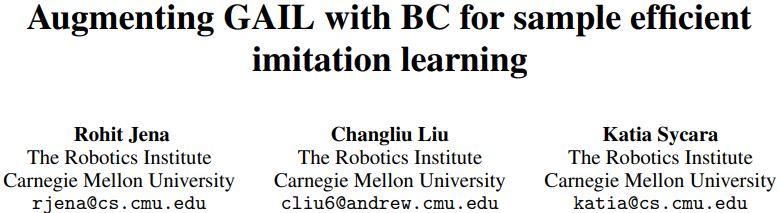

# Augmenting GAIL with BC for sample efficient imitation learning

* [返回上层目录](../paper.md)

paper: [Augmenting GAIL with BC for sample efficient imitation learning](https://arxiv.org/pdf/2001.07798.pdf)

github: [https://github.com/rohitrango/BC-regularized-GAIL](https://github.com/rohitrango/BC-regularized-GAIL)

