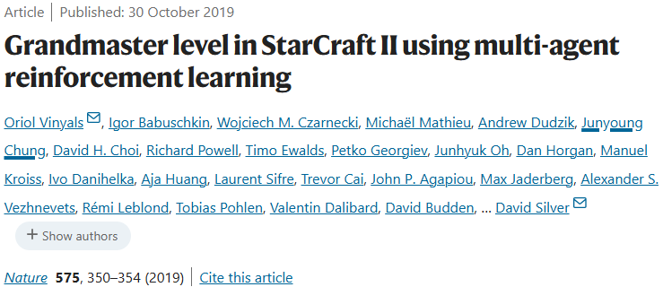

# AlphaStar星际争霸II

- [返回上层目录](../deepmind.md)

2019年，DeepMind出过有个游戏AI，AlphaStar，用于打游戏StarCraft II。

论文链接：https://www.nature.com/articles/s41586-019-1724-z

bolg：[AlphaStar: Grandmaster level in StarCraft II using multi-agent reinforcement learning](https://deepmind.google/discover/blog/alphastar-grandmaster-level-in-starcraft-ii-using-multi-agent-reinforcement-learning/)

blog：[AlphaStar: Mastering the real-time strategy game StarCraft II](https://deepmind.google/discover/blog/alphastar-mastering-the-real-time-strategy-game-starcraft-ii/)

github（官方，无训练代码）：[google-deepmind/alphastar](https://github.com/google-deepmind/alphastar)

github（开源实现）：[liuruoze/mini-AlphaStar](https://github.com/liuruoze/mini-AlphaStar)

2019年10月底，DeepMind在《自然》杂志发布最新研究：《Grandmaster level in StarCraft II using multi-agent reinforcement learning》，并放出大量AlphaStar和顶级人类选手的《星际争霸II》对战replay。相关数据显示，AlphaStar在战网上（欧服天梯）的排名已超越99.8%的活跃玩家，在不到 4 个月的时间里，它使用每个种族进行了 30 场天梯比赛，三个种族的水平都达到了宗师级别：星灵 6275 分（胜率 83%），人族 6048 分（胜率 60%），虫族 5835 分（胜率 60%）。

AlphaStar是一个把游戏看作长序列建模学习任务的强化学习智能体，它的模型设计也就以长序列建模为能力为核心。模型从游戏接口接收的数据是单位列表和这些单位的属性，经过神经网络计算后输出在游戏中执行的指令。这个神经网络的基础是Transformer网络，并且结合了一个深度LSTM网络核心、一个带有指针网络的自动回归策略头，以及一个中心化的评分基准。这样的网络架构是DeepMind对复杂序列建模任务的最新思考结果，他们也相信这样的先进模型可以在其他需要长序列建模、有很大行动空间的机器学习任务（比如机器翻译、语言建模和视觉表示）中同样发挥出优秀的表现。

AlphaStar使用神族（Protoss），在2018年12月10日以5：0战绩打败了Team Liquid的职业星际2选手TLO，然后经过更多训练后，在12月19日再次以5：0的完胜战绩打败了来自同一个战队的职业选手MaNa 。

===

* [田渊栋：关于AlphaStar](https://zhuanlan.zhihu.com/p/89396146)

* [张楚珩 清华大学：【强化学习 99】AlphaStar](https://zhuanlan.zhihu.com/p/92543229)
* [陈雄辉 阿里巴巴：浅谈AlphaStar](https://zhuanlan.zhihu.com/p/97720096)

[AlphaStar项目负责人亲自答Reddit网友提问](https://baijiahao.baidu.com/s?id=1623701277834339949)

[We are Oriol Vinyals and David Silver from DeepMind’s AlphaStar team, joined by StarCraft II pro players TLO and MaNa! Ask us anything](https://www.reddit.com/r/MachineLearning/comments/ajgzoc/we_are_oriol_vinyals_and_david_silver_from/)

[如果有一天，用人工智能作为代练机器人帮忙打上王者荣耀国服，那么，它将会带来哪些影响？](https://www.zhihu.com/question/467884750/answer/1963034850)

比如说星际2就有开源的游戏环境：[DeepMind and Blizzard open StarCraft II as an AI research environment](https://www.deepmind.com/blog/deepmind-and-blizzard-open-starcraft-ii-as-an-ai-research-environment)

并且DeepMind还做了Baseline模型：[StarCraft II: A New Challenge for Reinforcement Learning](https://kstatic.googleusercontent.com/files/8f5c46f2ca6f2dc1944e86fe852ecfa2072cc3729ceb6af4dc84307a939b60ac8915c82ead4e7e4d4862d0436a8a329a6f06a4d538b741219e85c207c5e04f62)

 **RNN联合注意力attention框架改进**： Pointer Networks。我们直到所有RNN（lstm） 在当下序列建模里的成就都和attention机制的结合有关。 而pointer network又对之前的attention进行了改进， 用输出的结果直接影响注意力需要注意的对象， 并且这个输出的尺寸是可变的。

链接：https://www.zhihu.com/question/310195660/answer/582705422

[基于多智能体强化学习主宰星际争霸游戏](https://zhuanlan.zhihu.com/p/102749648)

超大动作空间 -> auto-regressive policy

动作空间组合数目较多，每一个动作都需要先选择一个对象（比如农民），选择动作的类型，然后可能还需要地图中选择作用的位置（比如走到某个位置），最后还需要**选择什么时候进行下一个动作**。