# Leela-Zero

* [返回上层目录](../alphago-zero.md)
* [Leela-Zero介绍](#Leela-Zero介绍)
* [直接玩免编译](#直接玩免编译)
  * [下载leela-zero/releases版](#下载leela-zero/releases版)
  * [下载leela-zero的权重文件](#下载leela-zero的权重文件)
  * [安装围棋图形界面Sabaki并配置](#安装围棋图形界面Sabaki并配置)
  * [使用Sabaki下围棋](#使用Sabaki下围棋)
* [下载编译leela-zero](#下载编译leela-zero)
  * [下载leela-zero源码](#下载leela-zero源码)
  * [VisualStudio编译leela-zero](#VisualStudio编译leela-zero)
    * [安装qt来编译autogtp部分](#安装qt来编译autogtp部分)
    * [编译leela-zero部分](#编译leela-zero部分)
    * [开始执行编译好的可执行文件](#开始执行编译好的可执行文件)
* [理解leela-zero](#理解leela-zero)
  * [leela-zero历次版本改进](#leela-zero历次版本改进)
  * [leela-zero架构](#leela-zero架构)
  * [MCTS并行](#MCTS并行)

AlphaGo在2016年三月4:1战胜围棋世界冠军李世石，改进后的Master版本2017年5月3:0战胜柯洁后，Deepmind又用新的算法开发出了AlphaGo Zero，不用人类的对局训练，完全自我对局，训练3天后即战胜了AlphaGo Lee，训练21天后击败了AlphaGo Master。

Deepmind发表AlphaGo Zero论文后，之后的围棋AI都是根据AlphaGo Zero的论文来实现的。其中腾讯开发的绝艺被用在国家队的训练，Facebook开发出了Elf Go（14比0击败了韩国棋院棋手），腾讯微信团队开发的Phoenix Go(金毛测试)，还有本文要介绍的LeelaZero，其中后面三个AI是开源的。

# Leela-Zero介绍

* Leela Zero是著名围棋人工智能AlphaGo Zero的民间版本，由比利时的程序员根据AlphaGo Zero的论文进行复现。Leela Zero于2017年11月发布，2018年3月已经能稳赢职业九段。

* Sabaki是一款非常优雅、现代的围棋对局GUI，我们把它作为Leela Zero的载体。

leela-zero和AlphaGo-zero一样，是使用蒙特卡洛树搜索和深度残差神经网络算法，不依赖于任何人类棋谱训练出来的围棋AI。leela-zero是AlphaGo-zero忠实的追随者。 和绝艺不一样的，leela-zero是开源免费的项目，其成果是全人类共享的。leela-zero任何人都可以免费使用。 Zero顾名思义，就是从零开始。leela-zero需要从零开始学习围棋，通过自对弈产生棋谱训练自己，逐步成长为围棋高手。

据估计，在普通的硬件设备上重新打造一个AlphaGo-zero需要1700年。开源项目Leela Zero已经证明最花时间的是产生大量的对弈棋谱，而只要有了棋谱，则只要一台普通显卡的电脑几个小时就能训练出一个模型了。

也就是说，产生训练数据这一步最耗算力，而用数据来训练模型则只需要普通显卡几个小时就能完成。1700年太久，我现在就想要！众人拾柴火焰高，所以在自对弈产生棋谱从而作为训练数据这一步（最耗费算力），可以在全世界各个电脑上进行。因此leela-zero采用分布式的训练方式。世界各地的leela爱好者们可以贡献自己的电脑参与训练。其过程可概括为以下几步：

- leela志愿者者下载leela-zero训练程序autogtp
- 志愿者们分别运行训练程序，训练程序会自动让leela-zero自对弈，产生棋谱后上传服务器。
- 作者用收集到的棋谱训练出神经网络权重（权重：表征神经网络内部联系的一系列参数）
- 新出来的权重会和之前最强的权重对局，用于检验其棋力，400局中胜率超过55%的则更新为当前最强权重。

leela-zero的进步就是靠产生一个又一个更强的权重。

目前每天有600人左右在为leela-zero提供训练。在半年的时间内leela-zero已经自我对弈700万局，经历128次权重更迭。详细信息前往[sjeng](http://zero.sjeng.org/)查看。 一次权重更迭就代表leela-zero的一次进步。虽然每个人的力量很弱小，但我们团结在一起的力量是无比巨大的。Leela-zero从牙牙学语，到如今具备职业棋手水平，参与训练的志愿者们功不可没！

注意：leela-zero开源的代码只是比赛下棋时的代码。训练的部分作者还没开源，估计普通人拿到了也跑不出结果（auto-gtp是自对弈产出训练数据？）。alphago-zero论文中，自对弈只是产生训练数据(没写用了多少硬件资源)，训练模型用了64个GPU，比赛下棋用了4个TPU。

# 直接玩免编译

## 下载leela-zero/releases版

打开[https://github.com/leela-zero/leela-zero/releases](https://github.com/leela-zero/leela-zero/releases)进行下载，下载完解压就行。

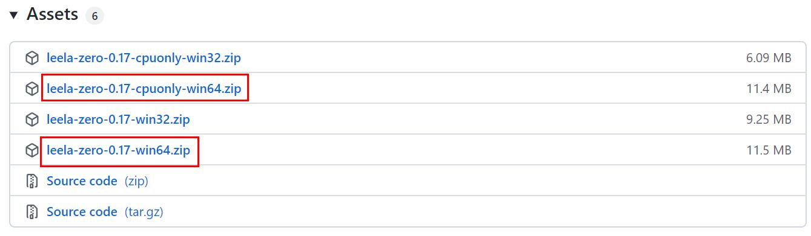

没gpu就选`cpuonly`版本，有gpu就选另一个，有gpu会快很多。

## 下载leela-zero的权重文件

leela zero的权重文件的下载地址是: [https://zero.sjeng.org/best-network](https://zero.sjeng.org/best-network)，下载下来的文件名字就是`best-network`，这个可以用。

但如果你想下载最新的权重文件，打开[http://zero.sjeng.org](https://zero.sjeng.org/)，和AlphaGo Zero一样，新的权重文件只有能够战胜老的权重文件55%，就会用新的权重文件来进行下一轮的训练。


点击红框下载最新的权重文件，下载下来的文件名字类似这样（大小约89M）：

`0e9ea880fd3c4444695e8ff4b8a36310d2c03f7c858cadd37af3b76df1d1d15f.gz`

下载下来的文件不需要解压。

## 安装围棋图形界面Sabaki并配置

上面的围棋软件都只是游戏引擎，要用图形界面下棋，需要支持GTP协议的软件，

* sabaki:画面精美的打谱软件，支持GTP协议。可用来加载leelazero。[使用教程](https://hhpetra.github.io/leelachinese/tutorials/sabaki.html)

* GoGui:简洁、稳定的打谱软件，支持GTP协议。可用来加载leelazero。[使用教程](https://hhpetra.github.io/leelachinese/tutorials/gogui.html)

* lizzie：为leelazero量身定做的图形界面，强大的实时分析功能。

* mylizzie:在lizzie基础上发展而来，根据群友的要求添加更贴心的功能，功能比lizzie更完善。[使用教程](https://hhpetra.github.io/leelachinese/tutorials/lizzie.html)

* goreviewpartner:复盘分析软件，将棋谱的分析结果保存下来方便查看，但是不能实时分析。

我们这里选择Sabaki。

Sabaki是一款非常优雅、现代的围棋对局GUI，我们把它作为Leela Zero的载体。

Sabaki下载的下载地址是: [https://github.com/SabakiHQ/Sabaki/Release](https://github.com/SabakiHQ/Sabaki/Release)

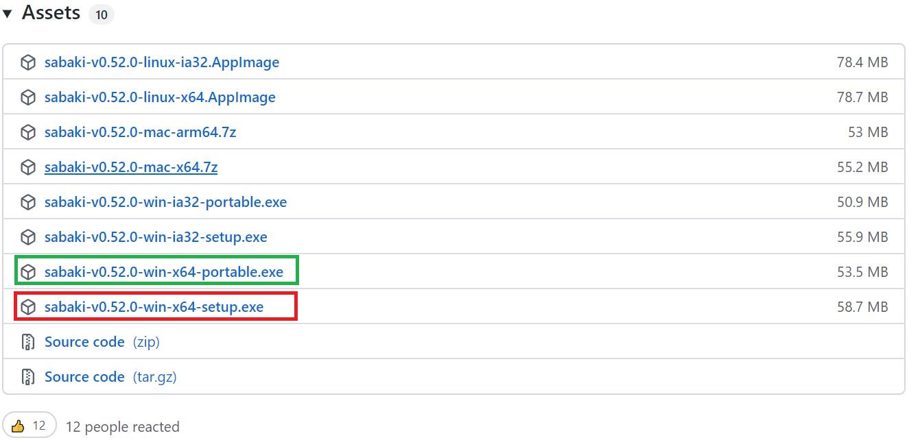

上图中，绿框（带portable的）是免安装版，红框是需要安装的，我们就安装红框的吧，安装路径不要有中文，不要有空格，比如请不要往该路径`C:\Program Files`安装。

安装完打开，进行配置，按照下图步骤进行设置：

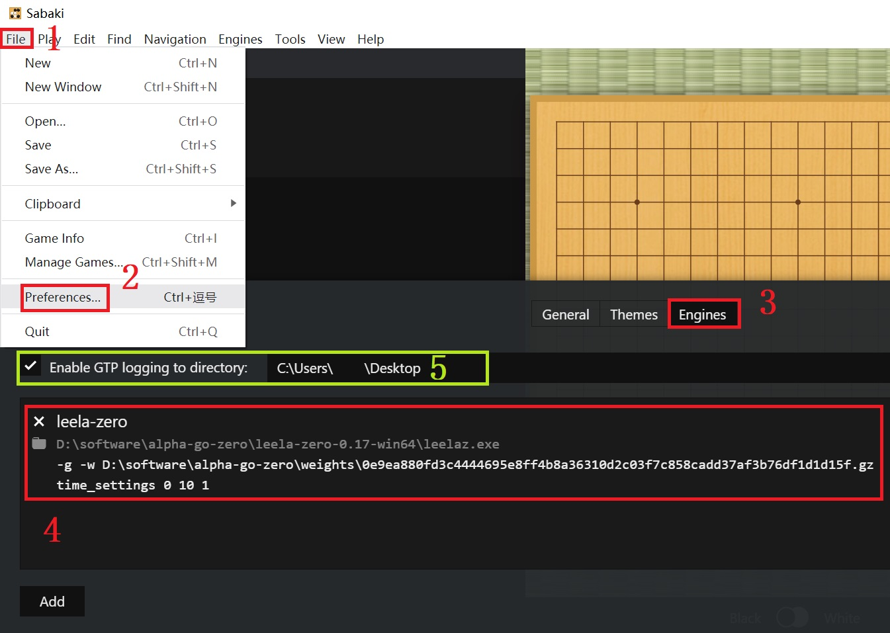

加载权重参数：

```shell
# 设置引擎名称（自己起）
leela-zero
# 设置引擎地址
D:\software\alpha-go-zero\leela-zero-0.17-win64\leelaz.exe
# 加载权重参数
-g -w D:\software\alpha-go-zero\weights\0e9e...d15f.gz
# 初始化命令（限制电脑思考时间 最长10秒下一手：
time_settings 0 10 1
```

各参数的解释如下：

```shell
-g  启用GTP模式，必须
-t  使用CPU的线程数，设为2是两线程，4线程会很卡。
-v  限制引擎访问次数，数字越大越强。
-p  限制引擎的数量，数字指电脑思考深度，数字越大越强。必须配合参数--noponder一起使用。playouts大致可以理解成演算的深度，数字越低则AI的水平也较低，需要配合noponder参数一起使用。
-r  设置当胜率低于%几认输
-w 网络权重文件
--noponder  引擎不占用对手思考时间.
heatmap 代表显示下一步棋可能选点的热图。如果你不希望显示热图，可以去掉该参数。
```

0.17版本引擎不要设置`-t`。引擎会自动判断线程参数`-t`。0.17版本引擎标准参数是`-g -w 路径/权重名`。

作为参考，给出网上某些之前版本的参数设置：

```shell
-g --noponder -t4 -w D:\0e9e...d15f.gz
-gtp -threads 6 -v1000 -noponder -w D:\0e9e...d15f.gz
```

其中，`-g`参数所代表的GTP是什么意思？

## GTP协议

> GTP协议
>
> GNU GO 3.0引入了一个新接口——围棋文本协议, 英文缩写：GTP，其目的是建立一个比GMP（Go Modem Protocol）协议的ascii 接口更合适于双机通信、更简单、更有效、更灵活的接口。
>
> ----[围棋引擎的GTP协议](http://www.tianqiweiqi.com/go-gtp.html)


## 使用Sabaki下围棋

1、找Attach Engines。点菜单栏的Engines，把第一个Show Engines Sidebar勾上，然后左边弹窗的左上角按钮就是Attach Engines，点击后可以选择装上刚才命名的Engine（这里也可以找到Manage Engines）

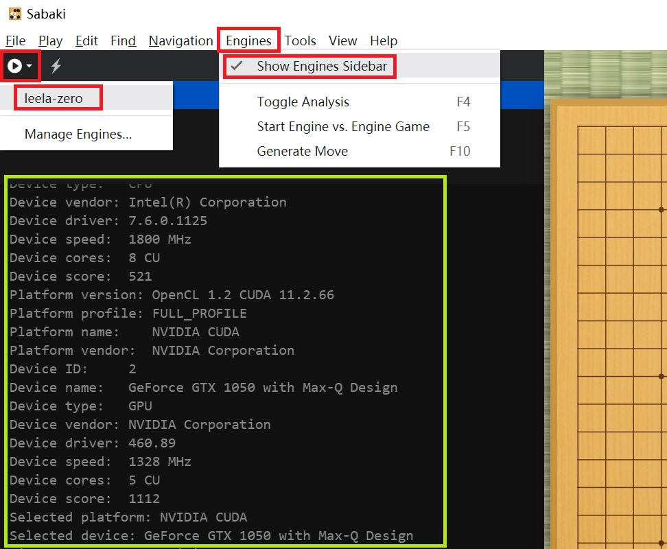

2、选择角色，开始对局点菜单栏File里的New（快捷键Ctrl+N），下方选择让Leela Zero执黑或者执白或者自己打自己。

下图所示为：黑棋（leela-zero），白棋（人）

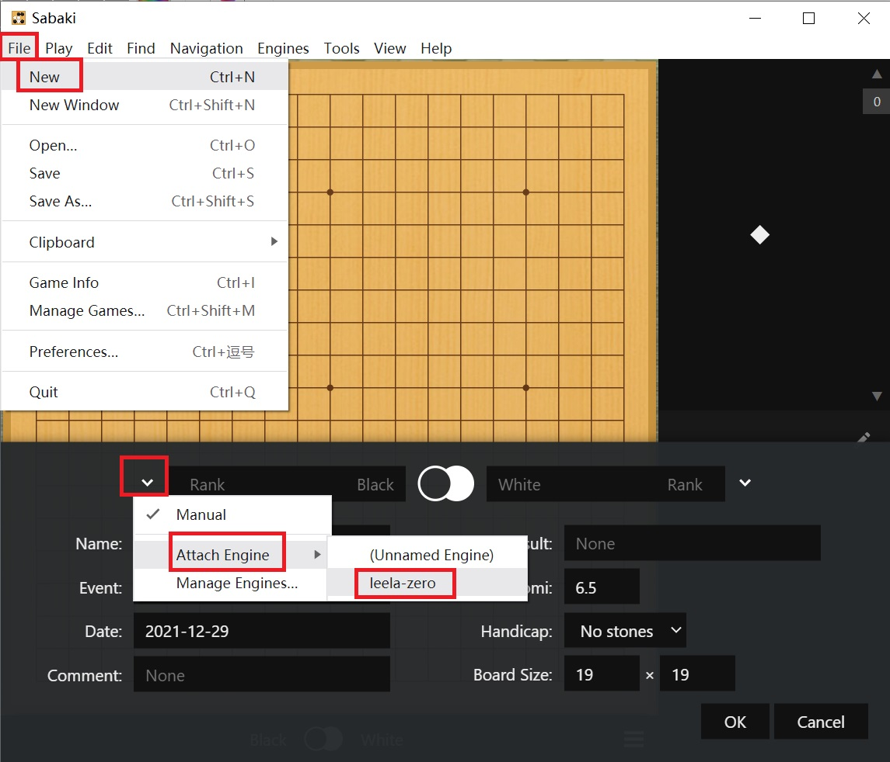

3、将一些显示的设置进行调整。

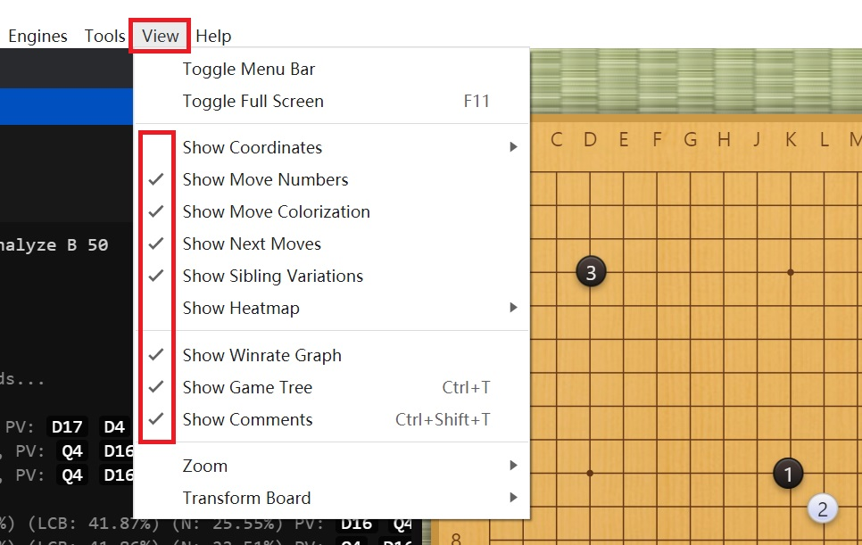

4、Leela Zero如果执黑先手，需要点菜单栏Engines里的Generate Move让它下第一手，或者你直接替他下第一手也可。

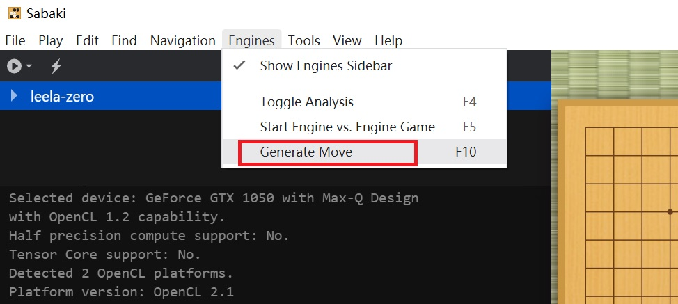

**现在就可以开始人机博弈对抗啦！**

还可以显示热力图，按F4进入分析模式（或者点下图的红框），让AI指导你该往哪一步下：

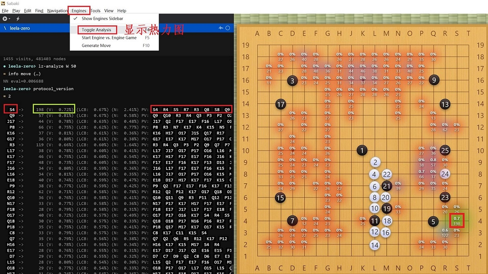

上图绿框显示的是胜率以及仿真模拟次数，随时间模拟次数越大，概率越准，类似MCTS那样。

# 下载编译leela-zero

## 下载leela-zero源码

就按照[https://github.com/leela-zero/leela-zero](https://github.com/leela-zero/leela-zero)的readme说的：

```shell
# Clone github repo
git clone https://github.com/leela-zero/leela-zero
cd leela-zero
git submodule update --init --recursive
```

## VisualStudio编译leela-zero

进入`leela-zero\msvc`，点击`leela-zero2017.sln`，从下图可以看到该解决方案包含两个项目：

* autogtp
* leela-zero

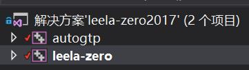

这里说明一下，**必须要使用VS2017版本**，最好不要使用更高版本，不然编译`autogtp`会有问题，高版本只编译`leela-zero`是没有问题的。

由于`autogtp`需要安装qt，所以我们把编译准备工作分为两部分：1.安装qt来编译`autogtp`部分，2.编译`leela-zero`部分。

### 安装qt来编译autogtp部分

如下图所示的最终效果，我们需要在VS2017中安装`Qt VS Tools`。

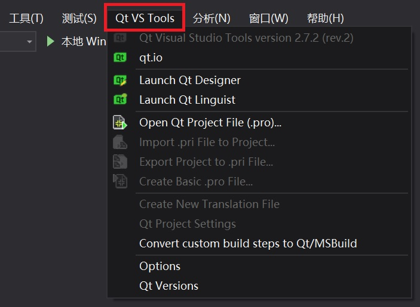

具体做法：

（1）下载并安装qt，这里建议安装qt5，比如我安装的是qt5.12.2版本。

（2）在VS2017中在安装`Qt VS Tools`。

（3）将curl.exe和gzip.exe复制到源码的`leela-zero\msvc`路径下。

具体地：

**（1）下载并安装qt，这里建议安装qt5，比如我安装的是qt5.12.2版本。**

下载地址：[https://www.qt.io/download](https://www.qt.io/download)

点击`Try Qt`的`Download Qt`下载安装Qt，选择`5.12.2`版本（官方[readme](https://github.com/leela-zero/leela-zero/tree/next/autogtp#readme)要求是5.3版本及以后都行），里面只需要选择`MSVC 2017 64-bit`就行，其他选项按照默认的来。

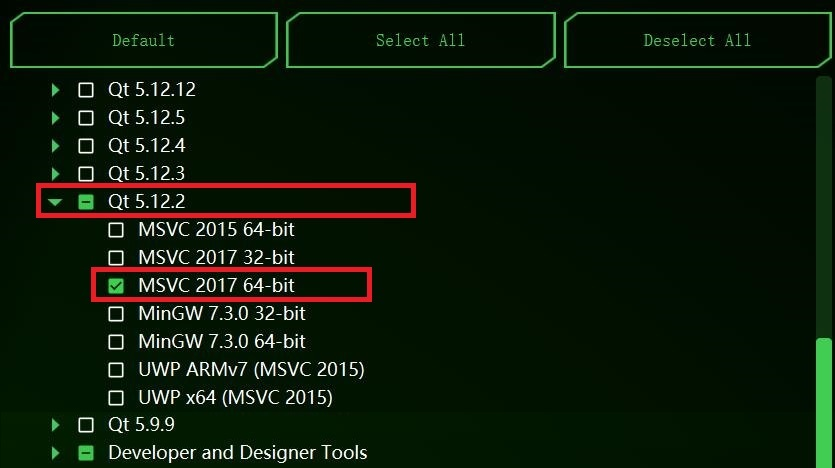

安装好以后，比如安装到`D:\software\Qt`，开始下一步。

**（2）在VS2017中在安装`Qt VS Tools`。**

如下图所示，下载`Qt VS Tools`

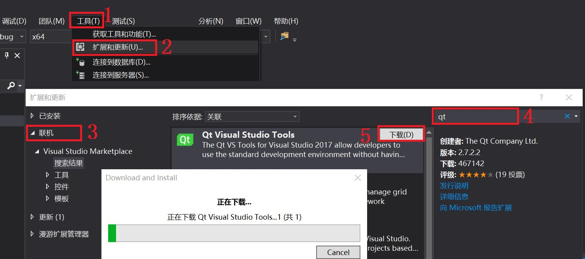

然后和上一步安装好的Qt进行关联。

关联安装好的Qt5.12.2，具体做法如下图所示。

其中，第3个步骤，只需要选定`msvc2017_64`这个文件夹就行，不用选到具体的可执行文件，软件会自动识别。

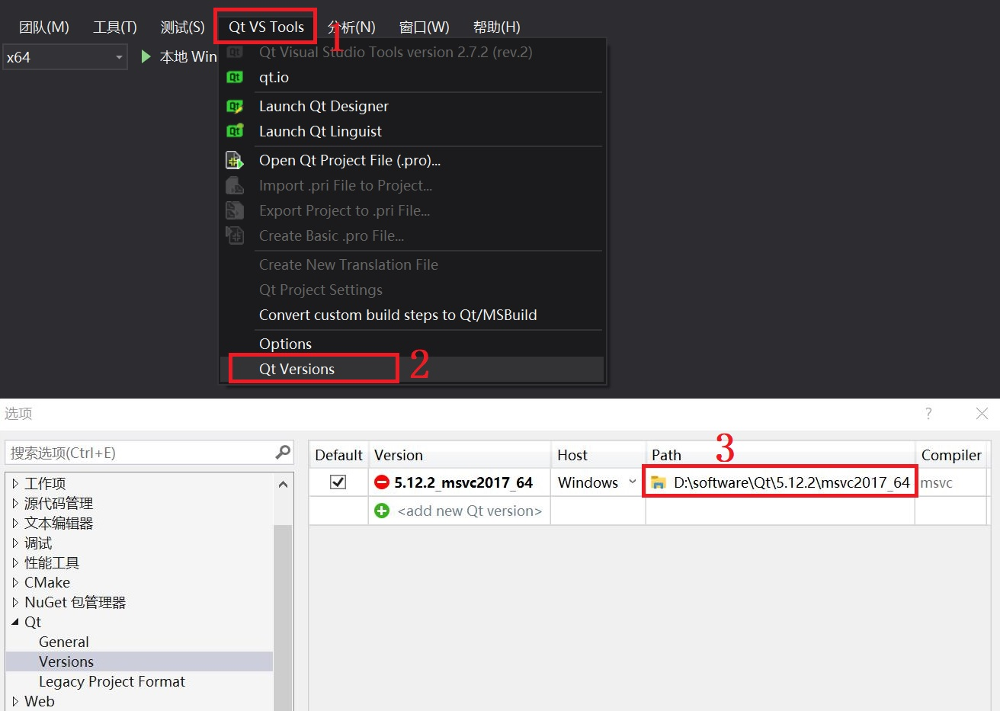

然后

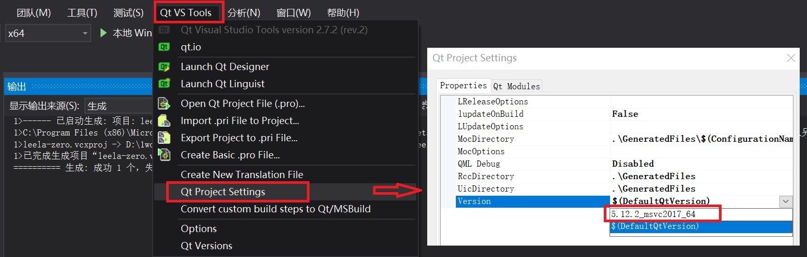

完成这两项设置后，再进行编译就没有问题了。项目的运行、调试等就都是Visual Studio的操作了，这里不再赘述。

**（3）将curl.exe和gzip.exe复制到源码的`leela-zero\msvc`路径下。**

curl.exe和gzip.exe可以从官方的Release版本中得到。

Release版本在前面的已经介绍过了，这里再介绍一次，尽量保证各介绍模块的独立性吧。

官方的Release版本：[https://github.com/leela-zero/leela-zero/releases](https://github.com/leela-zero/leela-zero/releases)。

下载完解压。


没gpu就选`cpuonly`版本，有gpu就选另一个。

具体操作如下图所示：

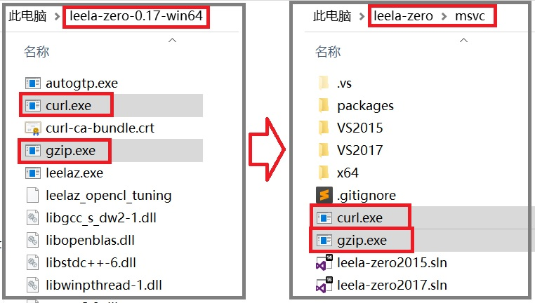

### 编译leela-zero部分

此刻直接点击重新生成解决方案，如下图所示，

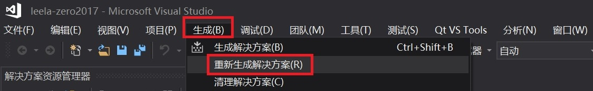

结果报错，显示为：

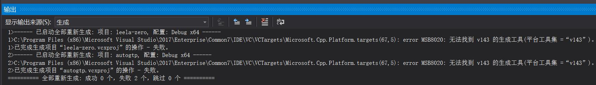

显示无法找到v143的工具集，这是因为我先后安装了VS2022和VS2017，这两版本同时存在。其中，v143代表VS2022，v141代表VS2017。

**我们需要改成v141**，对项目右键`属性`，如下图所示，注意要分别对`autogtp`和`leela-zero`两个项目进行更改。

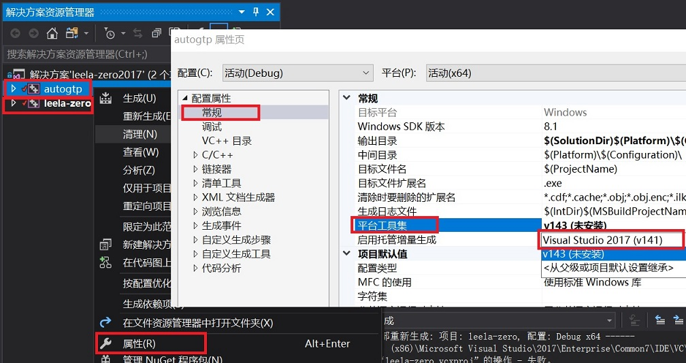

再次点击重新生成解决方案，如下图所示，


结果报错，显示为：

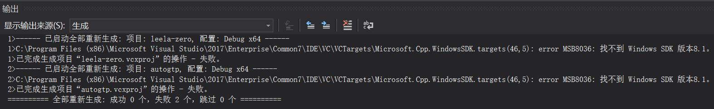

这是在说windows sdk版本不对，这也是因为我们先后同时装了VS2022和VS2017的缘故，需要切换回VS2017对应的windows sdk版本。

**这里选择10.0.17的windows sdk版本**，这才是VS2017版带的sdk，具体如下图所示：

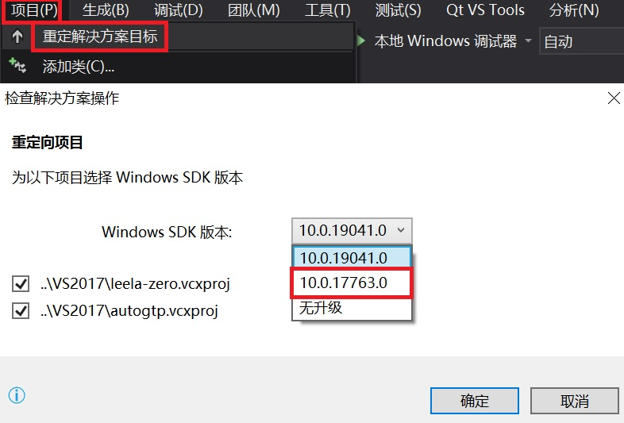

VS2017可能还会编译报错：“**缺少此项目引用的NuGet程序包…**”

这是因为该程序需要下载一些程序包：

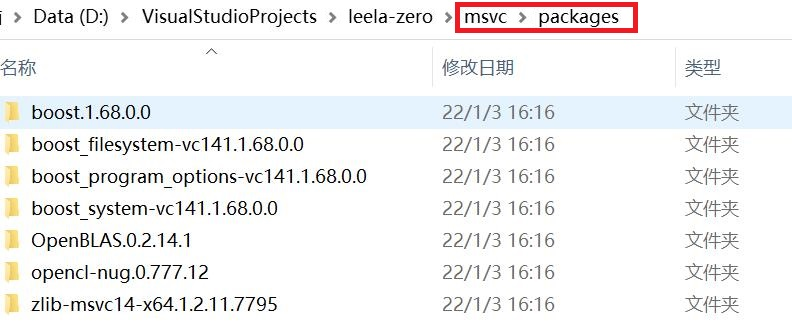

所以需要安装NuGet程序包管理器：

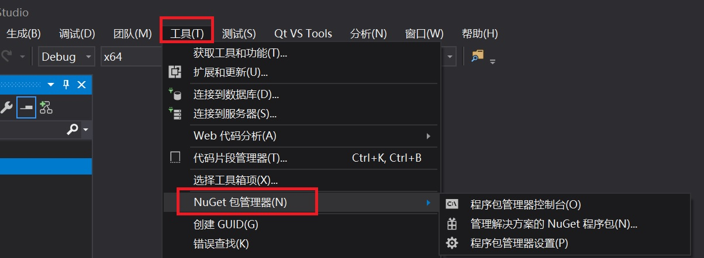

这块具体怎么弄我给忘了，上网搜一下吧。

然后，点击`生成`->`重新生成解决方案`，如下图所示，


就能成功编译了，生成了两个项目的可执行文件：`leela-zero.exe`和`autogtp.exe`，如下图：


生成的文件在这里：

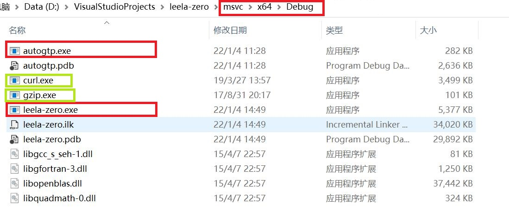

**如果想编译Release版的**，那就按下图从Debug模式切换到Release模式：

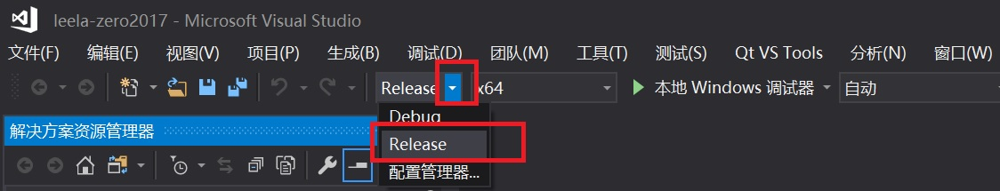

然后按照本节同样的流程走一遍，最后点击`生成`->`重新生成解决方案`，

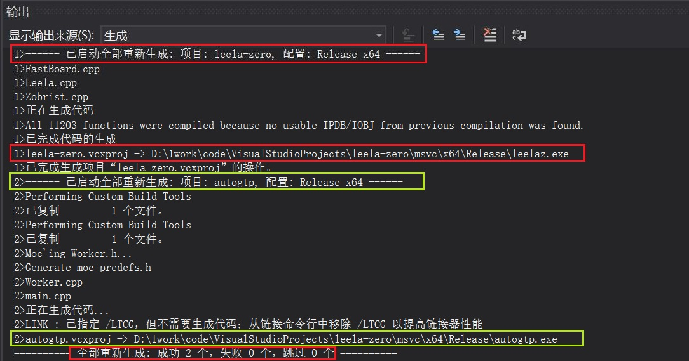

生成的文件在这里：

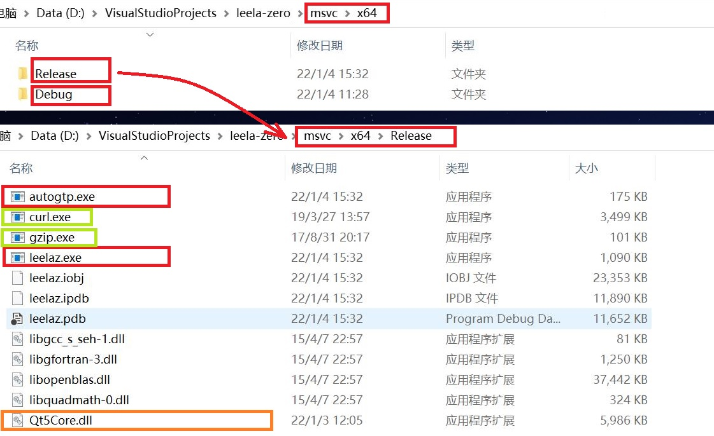

### 开始执行编译好的可执行文件

打开VisualStudio2017后，按下图进行点击“开始执行”：

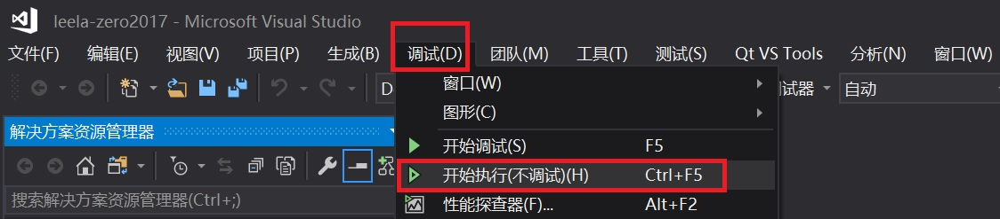

会有如下提示：

> A network weights file is required to use the program.
> By default, Leela Zero looks for it in D:\VisualStudioProjects\leela-zero\msvc\VS2017\best-network.
>
> D:\VisualStudioProjects\leela-zero\msvc\x64\Debug\leela-zero.exe (进程 76500)已退出，返回代码为: 1。
> 按任意键关闭此窗口...


也就是说，当前缺少模型网络权重文件`best-network`，请从[https://zero.sjeng.org/best-network](https://zero.sjeng.org/best-network)下载好模型权重文件`best-network`（大小为89MB）放入默认路径`leela-zero\msvc\VS2017\`下，注意，不是把文件`best-network`放入路径`leela-zero\msvc\VS2017\best-network`路径下，别重复了！

再次点击“开始执行”：


可执行文件打开后，会读取相关信息，经过漫长的大约十分钟后，读取完毕，出现界面：

```shell
Using OpenCL batch size of 5
Using 10 thread(s).
RNG seed: 8940146160618434604
Leela Zero 0.17  Copyright (C) 2017-2019  Gian-Carlo Pascutto and contributors
This program comes with ABSOLUTELY NO WARRANTY.
This is free software, and you are welcome to redistribute it
under certain conditions; see the COPYING file for details.

BLAS Core: built-in Eigen 3.3.7 library.
Detecting residual layers...v1...256 channels...40 blocks.
Initializing OpenCL (autodetecting precision).
Detected 2 OpenCL platforms.
Platform version: OpenCL 2.1
Platform profile: FULL_PROFILE
Platform name:    Intel(R) OpenCL
Platform vendor:  Intel(R) Corporation
Device ID:     0
Device name:   Intel(R) UHD Graphics 620
Device type:   GPU
Device vendor: Intel(R) Corporation
Device driver: 25.20.100.6518
Device speed:  1150 MHz
Device cores:  24 CU
Device score:  621
Device ID:     1
Device name:   Intel(R) Core(TM) i7-8550U CPU @ 1.80GHz
Device type:   CPU
Device vendor: Intel(R) Corporation
Device driver: 7.6.0.1125
Device speed:  1800 MHz
Device cores:  8 CU
Device score:  521
Platform version: OpenCL 1.2 CUDA 11.2.66
Platform profile: FULL_PROFILE
Platform name:    NVIDIA CUDA
Platform vendor:  NVIDIA Corporation
Device ID:     2
Device name:   GeForce GTX 1050 with Max-Q Design
Device type:   GPU
Device vendor: NVIDIA Corporation
Device driver: 460.89
Device speed:  1328 MHz
Device cores:  5 CU
Device score:  1112
Selected platform: NVIDIA CUDA
Selected device: GeForce GTX 1050 with Max-Q Design
with OpenCL 1.2 capability.
Half precision compute support: No.
Tensor Core support: No.
Detected 2 OpenCL platforms.
Platform version: OpenCL 2.1
Platform profile: FULL_PROFILE
Platform name:    Intel(R) OpenCL
Platform vendor:  Intel(R) Corporation
Device ID:     0
Device name:   Intel(R) UHD Graphics 620
Device type:   GPU
Device vendor: Intel(R) Corporation
Device driver: 25.20.100.6518
Device speed:  1150 MHz
Device cores:  24 CU
Device score:  621
Device ID:     1
Device name:   Intel(R) Core(TM) i7-8550U CPU @ 1.80GHz
Device type:   CPU
Device vendor: Intel(R) Corporation
Device driver: 7.6.0.1125
Device speed:  1800 MHz
Device cores:  8 CU
Device score:  521
Platform version: OpenCL 1.2 CUDA 11.2.66
Platform profile: FULL_PROFILE
Platform name:    NVIDIA CUDA
Platform vendor:  NVIDIA Corporation
Device ID:     2
Device name:   GeForce GTX 1050 with Max-Q Design
Device type:   GPU
Device vendor: NVIDIA Corporation
Device driver: 460.89
Device speed:  1328 MHz
Device cores:  5 CU
Device score:  1112
Selected platform: NVIDIA CUDA
Selected device: GeForce GTX 1050 with Max-Q Design
with OpenCL 1.2 capability.
Half precision compute support: No.
Tensor Core support: No.

Started OpenCL SGEMM tuner.
Will try 290 valid configurations.
(1/290) KWG=32 KWI=8 MDIMA=8 MDIMC=8 MWG=64 NDIMB=8 NDIMC=8 NWG=64 SA=1 SB=1 STRM=0 STRN=0 TCE=0 VWM=2 VWN=4 3.6808 ms (160.2 GFLOPS)
(14/290) KWG=32 KWI=8 MDIMA=16 MDIMC=16 MWG=64 NDIMB=8 NDIMC=8 NWG=32 SA=1 SB=1 STRM=0 STRN=0 TCE=0 VWM=4 VWN=2 3.0431 ms (193.8 GFLOPS)
(19/290) KWG=32 KWI=2 MDIMA=16 MDIMC=16 MWG=64 NDIMB=16 NDIMC=16 NWG=64 SA=1 SB=1 STRM=0 STRN=0 TCE=0 VWM=4 VWN=4 3.0308 ms (194.6 GFLOPS)
(45/290) KWG=32 KWI=2 MDIMA=16 MDIMC=16 MWG=64 NDIMB=8 NDIMC=8 NWG=64 SA=1 SB=1 STRM=0 STRN=0 TCE=0 VWM=4 VWN=2 2.3970 ms (246.1 GFLOPS)
(88/290) KWG=16 KWI=8 MDIMA=16 MDIMC=16 MWG=64 NDIMB=8 NDIMC=8 NWG=64 SA=1 SB=1 STRM=0 STRN=0 TCE=0 VWM=4 VWN=4 2.3747 ms (248.4 GFLOPS)
(95/290) KWG=16 KWI=8 MDIMA=16 MDIMC=16 MWG=64 NDIMB=8 NDIMC=8 NWG=64 SA=1 SB=1 STRM=0 STRN=0 TCE=0 VWM=4 VWN=2 2.3590 ms (250.0 GFLOPS)
Wavefront/Warp size: 32
Max workgroup size: 1024
Max workgroup dimensions: 1024 1024 64

Started OpenCL SGEMM tuner.
Will try 290 valid configurations.
(1/290) KWG=32 KWI=8 MDIMA=8 MDIMC=8 MWG=64 NDIMB=8 NDIMC=8 NWG=64 SA=1 SB=1 STRM=0 STRN=0 TCE=0 VWM=2 VWN=4 2.5841 ms (228.3 GFLOPS)
(52/290) KWG=16 KWI=8 MDIMA=8 MDIMC=8 MWG=64 NDIMB=8 NDIMC=8 NWG=64 SA=1 SB=1 STRM=0 STRN=0 TCE=0 VWM=4 VWN=4 2.5771 ms (228.9 GFLOPS)
(74/290) KWG=32 KWI=2 MDIMA=8 MDIMC=8 MWG=64 NDIMB=8 NDIMC=8 NWG=64 SA=1 SB=1 STRM=0 STRN=0 TCE=0 VWM=4 VWN=4 2.5206 ms (234.0 GFLOPS)
(117/290) KWG=16 KWI=2 MDIMA=8 MDIMC=8 MWG=64 NDIMB=8 NDIMC=8 NWG=64 SA=1 SB=1 STRM=0 STRN=0 TCE=0 VWM=4 VWN=4 2.4799 ms (237.8 GFLOPS)
(157/290) KWG=32 KWI=8 MDIMA=8 MDIMC=8 MWG=64 NDIMB=8 NDIMC=8 NWG=64 SA=1 SB=1 STRM=0 STRN=0 TCE=0 VWM=4 VWN=2 2.4658 ms (239.2 GFLOPS)
(267/290) KWG=32 KWI=8 MDIMA=8 MDIMC=8 MWG=64 NDIMB=8 NDIMC=8 NWG=64 SA=1 SB=1 STRM=0 STRN=0 TCE=0 VWM=4 VWN=4 2.4223 ms (243.5 GFLOPS)
Wavefront/Warp size: 32
Max workgroup size: 1024
Max workgroup dimensions: 1024 1024 64
Using OpenCL half precision (at least 5% faster than single).
Setting max tree size to 3736 MiB and cache size to 415 MiB.

Passes: 0            Black (X) Prisoners: 0
Black (X) to move    White (O) Prisoners: 0

   a b c d e f g h j k l m n o p q r s t
19 . . . . . . . . . . . . . . . . . . . 19
18 . . . . . . . . . . . . . . . . . . . 18
17 . . . . . . . . . . . . . . . . . . . 17
16 . . . + . . . . . + . . . . . + . . . 16
15 . . . . . . . . . . . . . . . . . . . 15
14 . . . . . . . . . . . . . . . . . . . 14
13 . . . . . . . . . . . . . . . . . . . 13
12 . . . . . . . . . . . . . . . . . . . 12
11 . . . . . . . . . . . . . . . . . . . 11
10 . . . + . . . . . + . . . . . + . . . 10
 9 . . . . . . . . . . . . . . . . . . .  9
 8 . . . . . . . . . . . . . . . . . . .  8
 7 . . . . . . . . . . . . . . . . . . .  7
 6 . . . . . . . . . . . . . . . . . . .  6
 5 . . . . . . . . . . . . . . . . . . .  5
 4 . . . + . . . . . + . . . . . + . . .  4
 3 . . . . . . . . . . . . . . . . . . .  3
 2 . . . . . . . . . . . . . . . . . . .  2
 1 . . . . . . . . . . . . . . . . . . .  1
   a b c d e f g h j k l m n o p q r s t

Hash: 9A930BE1616C538E Ko-Hash: A14C933E7669946D

Black time: 01:00:00
White time: 01:00:00

Leela:
```

假设黑方：Leela，白方：人。可以尝试输入：

* 第一步先帮黑方AI走一步棋：`play B D4`

* 然后自己走一步：`play W P6`

不过似乎也没啥卵用，只是用来证明编译成功了。

然后就可以用编译好的可执行文件`leela-zero\msvc\x64\Debug\leela-zero.exe`或者`leela-zero\msvc\x64\Release\leelaz.exe`来替换掉之前讲的围棋图形界面Sabaki的Releasee版的`leela-zero-0.17-win64\leelaz.exe`来玩了，即

参数从下图


变为：

```shell
# 设置引擎名称（自己起）
leela-zero
# 设置引擎地址
## Debug版
D:\1work\code\VisualStudioProjects\leela-zero\msvc\x64\Debug\leela-zero.exe
## 或者 Release版
D:\1work\code\VisualStudioProjects\leela-zero\msvc\x64\Release\leelaz.exe
# 加载权重参数
-g -w D:\software\alpha-go-zero\weights\0e9e...d15f.gz
# 初始化命令（限制电脑思考时间 最长10秒下一手：
time_settings 0 10 1
```

### 在VS中加上命令参数调试

进入项目【项目】—>【属性】—>【调试】—>【命令参数】—>输入a b c d，如果有多个字符串参数，则用空格隔开。比如要读入两张图片，在命令参数里输入”1.jpg” “2.jpg”。

### 用PowerShell试运行

在`leela-zero\msvc\x64\Release`目录下打开PowerShell，然后输入

```shell
.\leelaz.exe -g
```


# 理解leela-zero

## leela-zero历次版本改进

这里[https://github.com/leela-zero/leela-zero/releases](https://github.com/leela-zero/leela-zero/releases)可以看不同版本的历次的改进措施，可以看出来一些改进和相关知识。

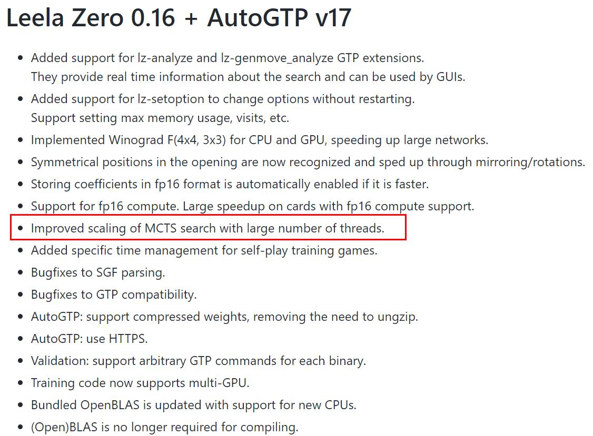


## leela-zero架构


## MCTS并行

[Issues: Need Help for Questions About Parallel MCTS](https://github.com/leela-zero/leela-zero/issues/2545)


# 参考资料

* [leela-zero中文网站](https://hhpetra.github.io/leelachinese/index)

介绍了leela-zero

* [AlphaGo Zero 有开源版了，但这不代表你可以训练出 AlphaGo Zero](https://zhuanlan.zhihu.com/p/30434626)

leela-zero开源的代码只是比赛下棋时的代码。训练的部分作者还没开源，估计普通人拿到了也跑不出结果（auto-gtp是自对弈产出训练数据？）。alphago-zero论文中，自对弈只是产生训练数据(没写用了多少硬件资源)，训练模型用了64个GPU，比赛下棋用了4个TPU。

===

* [编译leela-zero-next](https://steemkr.com/ai/@ivysrono/leela-zero-next)

。。。

* [Leela-zero 使用指南](https://www.goandai.com/leela-zero-wiki/#Introduce)

QQ群：Leela Zero 训练2群：[726658329](https://jq.qq.com/?_wv=1027&k=5KmjH7P)（已满），训练3群：[731052614](https://jq.qq.com/?_wv=1027&k=5b7yOMf)，训练4群：[789799005](https://jq.qq.com/?_wv=1027&k=5pL7iHl)

* [基于 Sabaki 搭建围棋 AI](https://leungf.github.io/2018/09/15/sabaki/)

这个写的很好，里面讲了怎么产生数据，怎么**训练**。

