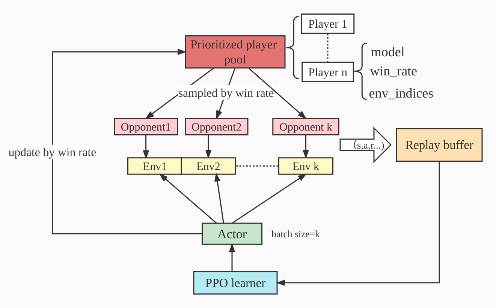

# TimeChamber: A Massively Parallel Large Scale Self-Play Framework

- [返回上层目录](../time-chamber.md)

TimeChamber: A Massively Parallel Large Scale Self-Play Framework

TimeChamber: 大规模并行的大规模自对弈框架


github: [inspirai/TimeChamber](https://github.com/inspirai/TimeChamber)




TimeChamber里面的任务包括了：

* Humanoid Strike

* Ant Sumo

* Ant Battle

支持自我博弈训练：

Self-Play Training

```shell
python train.py task=MA_Humanoid_Strike headless=True
```

