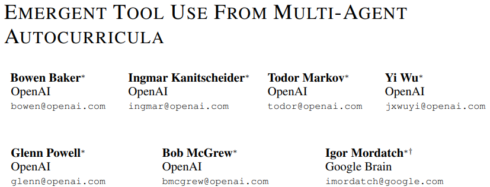

# 捉迷藏Multi-Agent Hide and Seek: Emergent tool use from multi-agent interaction

- [返回上层目录](../openai.md)

所谓捉迷藏，本质上来说便是A、B双方利用各种道具，一个藏，一个找的博弈过程。

官方博客：[Emergent tool use from multi-agent interaction](https://openai.com/index/emergent-tool-use/)

论文地址：[*EMERGENT TOOL USE FROM MULTI-AGENT AUTOCURRICULA*](https://arxiv.org/pdf/1909.07528)

成果视频：[YouTube: Multi-Agent Hide and Seek](https://www.youtube.com/watch?v=kopoLzvh5jY)

# 参考资料

* [清华吴翼：从捉迷藏游戏说起，谈谈强化学习的六个开放问题](https://www.163.com/dy/article/G4STCFOK0511DPVD.html)

