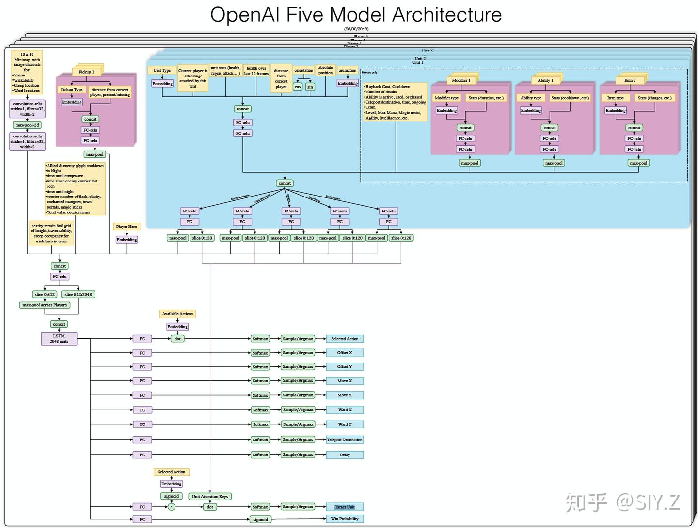
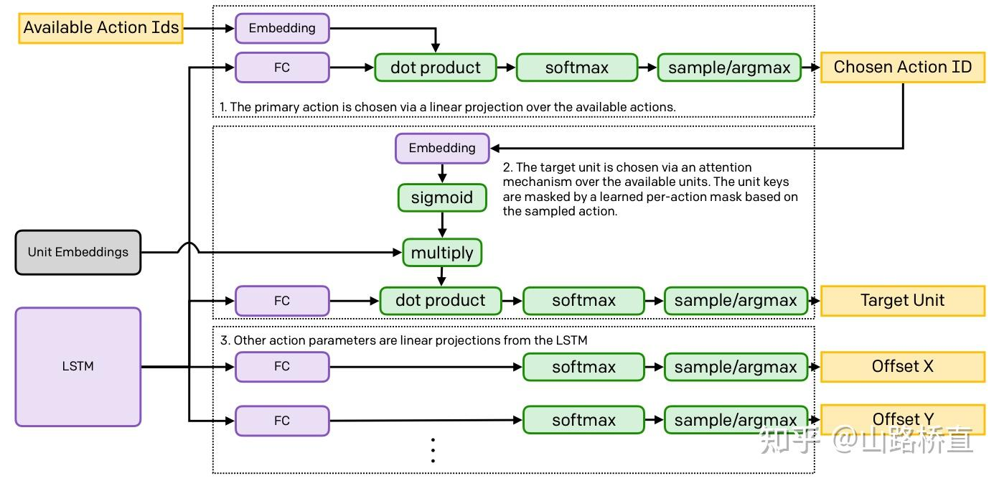

# OpenAI Five: Dota 2 with Large Scale Deep Reinforcement Learning 201904

- [返回上层目录](../openai.md)

paper: [Dota 2 with Large Scale Deep Reinforcement Learning](https://cdn.openai.com/dota-2.pdf)

blog：[OpenAI Five](https://openai.com/index/openai-five/)

code: [OpenAI_Five_vs_Dota2_Explained](https://github.com/llSourcell/OpenAI_Five_vs_Dota2_Explained)（官方并没有公开源码，这只是其他人实现的基本功能）

# 参考资料

===

[看OpenAI如何利用强化学习破解现实决策问题的复杂性和连续性](https://cloud.tencent.com/developer/article/1673287)

[一文解析OpenAI Five，一个会打团战的Dota2 AI](https://cloud.tencent.com/developer/article/1498728)

OpenAI Five每天玩的游戏量相当于人类玩家180年的积累，和围棋AI一样，它从自学中提取经验。训练设备是256个GPU和128,000个CPU，使用的强化学习算法是近端策略优化（PPO）。因为不同英雄间技能、出装各异，这5个英雄使用的是5个独立的LSTM，无人类数据，由英雄从自己的数据中学习可识别策略。

实验表明，在没有根本性进展的前提下，强化学习可以利用LSTM进行大规模的、可实现的长期规划，这出乎我们的意料。为了考察这个成果，7月28日，OpenAI Five会和顶级玩家进行比赛，届时玩家可以在Twitch上观看实况转播。

强化学习（RL）研究人员一般认为，如果想让智能体在长时间游戏中表现出色，就难免需要一些根本上的新突破，比如hierarchical reinforcement learning（分层强化学习）。但实验结果表明，我们应该给予已有算法更多信任，如果规模够大、结构够合理，它们也能表现出色。

智能体的训练目标是最大化未来回报，这些回报被折扣因子γ加权。在OpenAI Five的近期训练中，**我们把因子γ从0.998提高到了0.9997**，把评估未来奖励的半衰期从46秒延长到了五分钟。为了体现这个进步的巨大，这里我们列几个数据：在PPO这篇论文中，最长半衰期是0.5秒；在Rainbow这篇论文中，最长半衰期是4.4秒；而在Observe and Look Further这篇论文中，最长半衰期是46秒。

尽管当前版本的OpenAI Five在“补刀”上表现不佳（大约是Dota玩家的中位数），但它对于经验、金钱的的优先级匹配策略和专业选手基本一致。为了获得长期回报，牺牲短期回报是很正常的，就好比队友抱团推塔时，玩家不该自己在线上补刀刷钱。这是个振奋人心的发现，因为我们的AI系统真的在进行长期优化。

[OpenAI-Five 模型详解](https://zhuanlan.zhihu.com/p/41501669)

OpenAI 于今天公布了详细的训练模型。可以说这个模型（在大结构上）要比AlphaGo等之前的AI复杂得多：

[Summary of OpenAI Five details](https://zhuanlan.zhihu.com/p/938987991)

[OpenAI Five Model Architecture](https://cdn.openai.com/research-covers/openai-five/network-architecture.pdf)

