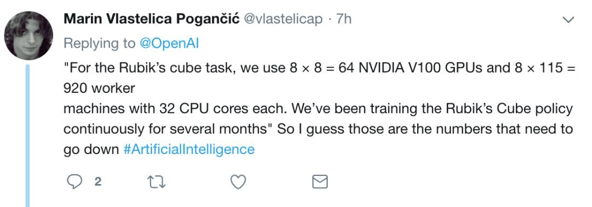

# 机械手玩魔方: Solving Rubik’s Cube with a robot hand

- [返回上层目录](../openai.md)

官方博客：[Solving Rubik’s Cube with a robot hand](https://openai.com/blog/solving-rubiks-cube/)

论文地址：[*Solving Rubik's Cube with a Robot Hand*](https://arxiv.org/pdf/1910.07113)

成果视频：[YouTube: Solving Rubik's Cube with a Robot Hand](https://www.youtube.com/playlist?list=PLOXw6I10VTv9HODt7TFEL72K3Q6C4itG6)

机械手玩魔方的团队领导者：

> **Lilian Weng**是OpenAI的前研究与安全副总裁，本科毕业于**北京大学**信息系统与计算机科学专业，后在印第安纳大学伯明顿分校获得博士学位。
>
> 
>
> 自2017年加入OpenAI以来，Lilian为推动AI技术和安全的发展做出了重要贡献。她最初专注于机器人技术，领导了一个标志性项目——用机械手解决魔方问题，为复杂机器人任务的训练算法奠定了基础。
>
> **在OpenAI转向大型语言模型（LLMs）后，Lilian领导开发了多个关键系统，特别是在安全领域。**她创立并领导了OpenAI应用AI研究团队，推动了API微调、嵌入工具、内容审核和应用安全框架的开发。这些成果极大提升了OpenAI API的技术性能、实用性与安全性。
>
> Lilian Weng已于2024年1月加盟Fellows Fund，担任新的Distinguished Fellow。

腾讯与港中大相关研究：https://arxiv.org/pdf/1907.11388.pdf

> 今年年初，腾讯AI与香港中文大学合作，进行了一项模拟实验。

OpenAI在机械手上用到了两大法宝：

* 一个是曾经打败Dota 2世界冠军团队的AI系统OpenAI Five；

* 另一个是自动域随机化（ADR，Automatic Domain Randomization）。

  > ADR会不断在仿真中生成越来越困难的环境，使系统摆脱精确模型对现实的束缚，从而使模拟环境中的神经网络能够迁移到真实世界。
  >
  > 这里提到的环境中的随机化是什么呢？其中包括模拟器考虑到的物理特性（如几何形状、摩擦和重力），以及模拟器未能考虑到的一些物理效应。比如魔方的大小，就是随机化参数之一。此外，还有照明条件之类的视觉元素、相机位置和角度、物体的材料和外观、背景纹理甚至是渲染图像的后处理效果。

# ADR自动域随机化

更大的挑战，是现实世界中复杂的物理参数。在玩魔方这个任务当中，机械手跟魔方之间的摩擦力、弹性和其他动力学因素都很难测量，更别说精细建模了。并且，在模拟仿真环境中训练出来的AI，面对复杂多变的真实物理世界，是否能保持鲁棒，也是一个大问题。比如说带个橡胶手套，摩擦力就变了。两个手指被绑住，难度也会与模拟训练时大大不同。甚至可能会跑出来一只长颈鹿，试图叼走魔方。如此种种，使得sim2real（从模拟环境到现实环境）变得非常困难，仅凭过去的域随机化（Domain Randomization）算法已经不足以解决。

> 注：域随机化（Domain Randomization）由OpenAI提出，能够创建具有随机属性的各种模拟环境，并训练可在任何环境中工作的模型。
>
> 论文地址：https://arxiv.org/abs/1710.06537

而OpenAI的核心秘诀，在于进一步开发了一种新的算法，称为自动域随机化（ADR）。

# 奖励函数

既然是用强化学习，必然会涉及到奖励机制，OpenAI团队在这个实验中定义了三个：

* 系统当前状态与目标状态之间的差异；
* 达成目标时给予奖励；

* 每当手中魔方掉落时就受到惩罚。

# 训练

他们使用了64个V100和920台32核CPU的主机，并且连续训练了好几个月。

# 参考资料

* [量子位：OpenAI机械手：玩转魔方，灵活不输人类](https://m.thepaper.cn/baijiahao_4728005)

* [独家｜前OpenAI华人副总裁Lilian Weng加盟Fellows Fund Fellow团队，助力AI探索与下一代创业者](https://mp.weixin.qq.com/s/pDa_SpDXkMzGxc8_Fldrbg)

机械手玩魔方的团队领导者参考了公众号。